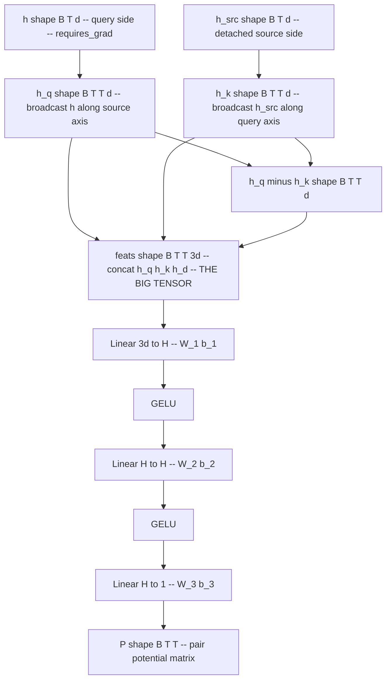

# On the MLP Layer Modeling the Pairwise Potential

A focused look at the **unstructured MLP** variant of the PARF pair-interaction
scalar $V_\phi$: what it is, how it differs from the structural prior of
design doc §5.1, how it is trained, and why getting the pair-potential model
right matters for the dynamics it induces.

Companion to:

- Design doc: [`PARF_Augmented_SPLM_Architecture.md`](PARF_Augmented_SPLM_Architecture.md) (esp. §3 causal reduction, §5 PARF law, §5.1 structural form, §17 OQ-1).
- Implementation: [`notebooks/conservative_arch/parf/model_parf.py`](../notebooks/conservative_arch/parf/model_parf.py) (`MLPVPhi`, `StructuralVPhi`).
- Training-pipeline deep dive: [`On_Training_the_PARF_Force.md`](On_Training_the_PARF_Force.md).
- Prototype README and benchmarks: [`notebooks/conservative_arch/parf/README.md`](../notebooks/conservative_arch/parf/README.md).

---

## 0. TL;DR

The MLP variant `MLPVPhi` of the PARF pair-interaction scalar is

$$
V_\phi(h_t, h_s) = \mathrm{MLP}_\phi\bigl( [h_t, h_s, h_t - h_s] \bigr)
$$

a 3-layer GELU MLP from $\mathbb{R}^{3d}$ to $\mathbb{R}$. It is the **OQ-1
ablation** of the §5.1-faithful structural variant: same outer machinery
(shared $V_\theta$, velocity-Verlet integrator, causal reduction, embeddings,
LayerNorm), only the inner functional form of $V_\phi$ changes. The MLP has
**~7× more parameters** than the structural variant (28,865 vs 4,002 at the
prototype shape), no built-in inductive biases for symmetry / translation
invariance / $1/r$ falloff, and pays a substantial memory cost: it
materialises a $(B, T, T, 3d)$ feature tensor that the structural variant
avoids by squared-norm expansion. On Apple MPS at the protocol shape this
forces gradient checkpointing on, and even so OOMs at the default
$H_{\text{mlp}} = 64$.

The single number the MLP variant exists to produce is whether it **matches
the structural variant on val PPL**. Three outcomes:

- **MLP $\approx$ structural** $\Rightarrow$ §5.1 prior is pedagogical, the
  unstructured form has enough capacity to rediscover the same dynamics.
- **MLP $\lt$ structural** (better) $\Rightarrow$ the §5.1 prior is biased
  away from the optimum; the unstructured form does better with more
  parameters.
- **MLP $\gt$ structural** (worse) $\Rightarrow$ the §5.1 prior is
  empirically active; the framework's specific factorisation
  $\Theta_\phi \cdot \Phi_\phi / r$ buys generalisation that the MLP
  cannot find from data alone.

This document explains why each of those outcomes is plausible, what the
MLP cell exposes mechanically, and what the cost of running it is.

---

## 1. Table of contents

1. [Background: pair potentials in PARF](#2-background-pair-potentials-in-parf)
2. [The MLP cell, end to end](#3-the-mlp-cell-end-to-end)
3. [Why include an MLP variant at all? OQ-1](#4-why-include-an-mlp-variant-at-all-oq-1)
4. [Training the MLP cell](#5-training-the-mlp-cell)
5. [Why accurately modeling the pair potential matters](#6-why-accurately-modeling-the-pair-potential-matters)
6. [Issues specific to the MLP cell](#7-issues-specific-to-the-mlp-cell)
7. [Side-by-side: MLP vs structural](#8-side-by-side-mlp-vs-structural)
8. [Recommendations](#9-recommendations)
9. [References](#10-references)

---

## 2. Background: pair potentials in PARF

Every PARF layer's per-token energy decomposes as

$$
U^{(\ell)}_t = V_\theta(\xi^{(\ell)}_t, h^{(\ell)}_t) + \sum_{s \lt t} V_\phi(h^{(\ell)}_t, h^{(\ell)}_s)
$$

with the design-doc §3 **causal reduction**: past tokens
$\lbrace h_s \rbrace_{s \lt t}$ are treated as fixed external sources
(`h_src = h.detach()`). The per-token force

$$
f^{(\ell)}_t = -\nabla_{h_t} U^{(\ell)}_t = -\nabla_{h_t} V_\theta - \sum_{s \lt t} \nabla_{h_t} V_\phi(h_t, h_s)
$$

drives the velocity-Verlet update in `PARFLM._layer_step`.

The single-particle scalar $V_\theta$ is **fixed** across the architecture
(four-layer GELU MLP, identical to em-ln leakfree SPLM and to the Helmholtz
Q9d S-block). The pair-interaction scalar $V_\phi$ is the architectural
**knob** of the PARF arm. The design doc §5.1 prescribes a structural form

$$
V_\phi^{\text{struct}}(h_t, h_s) = -C \cdot \frac{\Theta_\phi(\theta(h_t), \theta(h_s)) \cdot \Phi_\phi(l(h_t), l(h_s))}{\sqrt{\lVert h_t - h_s \rVert^2 + \varepsilon^2}}
$$

with three independent selectivity channels:

- **type matcher** $\Phi_\phi(l_t, l_s) = \exp(-c \cdot \lVert l_t - l_s \rVert^2)$
  — a learned Gaussian gate on a low-rank type projection $l = W_l h$.
- **value aligner** $\Theta_\phi(\theta_t, \theta_s) = \tanh(v \cdot \mathrm{MLP}(\theta_t, \theta_s, \theta_t - \theta_s))$
  — a bounded MLP on a low-rank angle projection $\theta = W_\theta h$.
- **distance falloff** $1 / \sqrt{\lVert h_t - h_s \rVert^2 + \varepsilon^2}$
  — Plummer-softened to avoid the singularity at small pair distances.

The MLP variant `MLPVPhi` collapses all three channels into a single
unstructured network on the concatenated pair input.

---

## 3. The MLP cell, end to end

### 3.1 Definition

```329:362:notebooks/conservative_arch/parf/model_parf.py
class MLPVPhi(nn.Module):
    """V_φ(h_t, h_s; φ) as an unstructured MLP on concat(h_t, h_s, h_t-h_s).

    Uses the same shape contract as `StructuralVPhi`: returns P of
    shape (B, T, T) with P[b, t, s] = V_φ(h[b, t], h_src[b, s]).
    """

    def __init__(self, cfg: PARFConfig):
        super().__init__()
        d = cfg.d
        self.net = nn.Sequential(
            nn.Linear(3 * d, cfg.v_phi_mlp_hidden), nn.GELU(),
            nn.Linear(cfg.v_phi_mlp_hidden, cfg.v_phi_mlp_hidden), nn.GELU(),
            nn.Linear(cfg.v_phi_mlp_hidden, 1),
        )
        for m in self.modules():
            if isinstance(m, nn.Linear):
                nn.init.normal_(m.weight, std=cfg.v_phi_init_scale)
                if m.bias is not None:
                    nn.init.zeros_(m.bias)

    def forward(self, h: torch.Tensor, h_src: torch.Tensor) -> torch.Tensor:
        B, T, d = h.shape
        h_q = h.unsqueeze(2).expand(B, T, T, d)
        h_k = h_src.unsqueeze(1).expand(B, T, T, d)
        feats = torch.cat([h_q, h_k, h_q - h_k], dim=-1)       # (B, T, T, 3d)
        return self.net(feats).squeeze(-1)                     # (B, T, T)
```

### 3.2 The functional form

Symbolically the MLP V_phi is the composition

$$
V_\phi^{\text{mlp}}(h_t, h_s) = W_3 \cdot \sigma\bigl( W_2 \cdot \sigma( W_1 [h_t, h_s, h_t - h_s] + b_1 ) + b_2 \bigr) + b_3
$$

with $\sigma = \mathrm{GELU}$ and weights

| layer | shape                              | role                                          |
| ----- | ---------------------------------- | --------------------------------------------- |
| $W_1$ | $(H_{\text{mlp}},\ 3d)$            | first linear: lifts the pair feature to a hidden |
| $W_2$ | $(H_{\text{mlp}},\ H_{\text{mlp}})$ | hidden mixing                                |
| $W_3$ | $(1,\ H_{\text{mlp}})$              | scalar readout                                |

At the prototype shape $d = 128$, $H_{\text{mlp}} = 64$:

| component             | params (no bias) | params (with bias) |
| --------------------- | ---------------- | ------------------ |
| $W_1$ (3d -> H)        | 24,576           | 24,640             |
| $W_2$ (H -> H)         | 4,096            | 4,160              |
| $W_3$ (H -> 1)         | 64               | 65                 |
| **MLP V_phi total**    |                  | **28,865**         |
| Structural V_phi total |                  | 4,002              |

The MLP is ~7.2× the structural variant in raw parameter count, with the
mass concentrated in $W_1$.

### 3.3 The forward pass, step by step



The single dominating allocation is `feats` (the $(B, T, T, 3d)$ tensor).
At $B = 16$, $T = 128$, $d = 128$ this is

$$
16 \cdot 128 \cdot 128 \cdot 384 \cdot 4\ \text{B} \approx 400\ \text{MB}
$$

per layer, allocated **before** the MLP module is called. This is the
binding memory cost on Apple MPS and the reason `MLPVPhi` cannot fit at
$H_{\text{mlp}} = 64$ even with gradient checkpointing on the MLP module
itself: gradient checkpointing wraps `self.V_phi(h_in, h_src)` and only
reclaims activations **inside** the module, but `feats` is allocated by
the wrapper before the call boundary.

### 3.4 The shape contract is identical to structural

Both `StructuralVPhi` and `MLPVPhi` return a tensor of shape $(B, T, T)$
with element $P[b, t, s] = V_\phi(h[b, t], h_{\text{src}}[b, s])$. The
caller (`PARFLM._layer_step`) then masks $s \ge t$ and sums to a scalar
$U$ from which the force is derived. So the MLP variant is a
**drop-in replacement** for the structural variant — only the inner shape
changes.

---

## 4. Why include an MLP variant at all? OQ-1

The PARF design doc poses **OQ-1** as the first-order question for the
v4 deposit:

> "Does PARF closure depend on the §5.1 structural prior?"

The Stage-1 ablation — structural $V_\phi$ vs unstructured MLP $V_\phi$,
**all else identical** — is the cleanest possible test. The two models
share:

- the same $V_\theta$ (four-layer GELU MLP, 66,049 params);
- the same velocity-Verlet integrator and per-token mass / damping;
- the same causal reduction (both `.detach()` points);
- the same embeddings, LayerNorm, output head, training data, training
  hyperparameters, optimiser, seeds.

Only the inner $V_\phi$ functional form differs. So the difference in
val PPL is **almost entirely** attributable to the prior, not to
confounders.

### 4.1 Universal-approximation framing

A 3-layer GELU MLP on $\mathbb{R}^{3d}$ is, by the universal approximation
theorem ([Hornik 1991](https://www.sciencedirect.com/science/article/abs/pii/089360809190009T)),
a dense subset of $C^0(\mathbb{R}^{3d}, \mathbb{R})$ with sufficient
hidden width. So **in principle** the MLP variant can express the
structural form

$$
V_\phi^{\text{struct}}(h_t, h_s) = -C \cdot \frac{\Theta_\phi(\theta(h_t), \theta(h_s)) \cdot \Phi_\phi(l(h_t), l(h_s))}{\sqrt{\lVert h_t - h_s \rVert^2 + \varepsilon^2}}
$$

up to arbitrary precision. The question is whether it **does so in
practice**, given finite training data, finite optimisation budget,
and the specific loss landscape induced by NTP through the velocity-Verlet
integrator.

In practice the MLP starts from a random initialisation and walks the
loss landscape under SGD. It has more parameters and more flexibility,
but no **prior** on the form of the answer. The structural variant
starts already in a 4,002-parameter neighbourhood of the §5.1 form and
has 24,863 fewer ways to overfit.

### 4.2 The three OQ-1 outcomes, mechanistically

| outcome                          | what it tells us                                                                                                                                                                                                                                                  |
| -------------------------------- | ----------------------------------------------------------------------------------------------------------------------------------------------------------------------------------------------------------------------------------------------------------------- |
| MLP val PPL $\approx$ structural | the §5.1 prior is **pedagogical**. The unstructured form, given enough capacity, recovers the same per-layer dynamics from data. The framework's specific factorisation organises the architecture but contributes no empirical content over the unstructured baseline. |
| MLP val PPL $\lt$ structural     | the §5.1 prior is **biased away from the optimum**. The unstructured form, with more capacity, finds a better pair potential than the prescriptive factorisation allows. This would be a finding **against** the design doc's central commitment.                |
| MLP val PPL $\gt$ structural     | the §5.1 prior is **empirically active**. The MLP cannot find the right pair potential from data alone within the available training budget; the structural prior pre-encodes useful structure (separable selectivity channels, $1/r$ falloff, type-vs-value disentanglement). |

In all three cases the result is **interpretable** because the comparison
is otherwise apples-to-apples.

### 4.3 The MLP variant is the framework's null hypothesis

The structural prior is the **alternative hypothesis** ("the type-matcher ×
value-aligner × distance-falloff factorisation is the right inductive bias
for routing in language modelling"). The MLP is the **null hypothesis**
("any sufficiently expressive pair function will do; the factorisation is
notational"). The PARF arm only earns its $O(T^2)$ wall-clock cost over
the SPLM family if at least one of:

- structural beats the all-attention anchor at $T \le 1024$ (the H1.5
  break-even regime), **and** the MLP does not, OR
- both structural and MLP beat the SPLM family but at lower variance
  across seeds than attention.

The MLP variant is therefore the **gate** through which the framework's
prescriptive content earns or fails to earn its place in the
architecture.

---

## 5. Training the MLP cell

The MLP cell trains under the **same Algorithm A** as the structural
cell. There is no separate trainer, no separate loss; only the inner
$V_\phi$ shape changes. This is by design — the MLP variant is pure
ablation of the structural prior, not a new training regime.

### 5.1 The chain rule, instantiated for the MLP

The per-layer step is

```494:567:notebooks/conservative_arch/parf/model_parf.py
        if cfg.use_grad_checkpoint and self.training:
            P = torch.utils.checkpoint.checkpoint(
                self.V_phi, h_in, h_src, use_reentrant=False,
            )
        else:
            P = self.V_phi(h_in, h_src)                          # (B, T, T)
        mask = self._pair_mask_for(T, h_in.device)
        P_masked = P.masked_fill(~mask, 0.0)
        U = V_th_per_token.sum() + P_masked.sum()

        grad_U, = torch.autograd.grad(
            U, h_in,
            create_graph=self.training,
            retain_graph=True,
        )
        f = -grad_U
```

The inner `autograd.grad(U, h_in, create_graph=True)` builds a second-order
graph through `self.V_phi(h_in, h_src)`. For the MLP variant, this
backward path is

$$
\frac{\partial U}{\partial h_t} = \sum_{s \lt t} \frac{\partial V_\phi^{\text{mlp}}(h_t, h_s)}{\partial h_t} = \sum_{s \lt t} (W_1^{\text{q}})^\top \cdot \mathrm{diag}(\sigma') \cdot W_2^\top \cdot \mathrm{diag}(\sigma') \cdot W_3^\top
$$

(schematic) where $W_1^\text{q}$ is the slice of $W_1$ corresponding to the
$h_t$ block of the $[h_t, h_s, h_t - h_s]$ concat, and the diagonal
matrices contain the GELU derivatives at the relevant pre-activations.
There are **three** $h_t$-dependent paths into $W_1$: the direct $h_t$ block,
the difference block $h_t - h_s$, and the symmetric "no, the source block
also has $h_t$ as input" path (this is wrong: in the *causal-force* mode
$h_s$ is detached, so its $h_t$ dependence is severed. There are only
**two** paths.)

So gradients into $W_1$, $W_2$, $W_3$ flow from the cross-entropy loss
through:

1. Logits $\rightarrow$ $h_L$ (final hidden state).
2. $h_L \rightarrow h_{L-1} \rightarrow \dots \rightarrow h_0$ via the
   velocity-Verlet recursion.
3. At each layer, $h^{(\ell)}$ enters $V_\phi^{\text{mlp}}$ via two
   active paths (the query block and the difference block); the source
   block is detached and contributes no gradient.

The gradient of the loss with respect to $W_1, W_2, W_3$ is the
contraction of all of these pathways at every layer.

### 5.2 The autograd flow as a Mermaid chart

```mermaid
flowchart TD
    Loss[NTP cross-entropy loss]
    Logits[logits]
    HL[h_L]
    Step[L times -- velocity Verlet step]
    Force[force f equals minus grad U via inner autograd.grad create_graph True]
    U_layer[U at this layer = V_theta term + P sum over s less than t]
    P[P shape B T T -- pair potential matrix]
    Net[3-layer GELU MLP -- W_1 W_2 W_3]
    Feats[feats shape B T T 3d -- THE BIG TENSOR]
    H_q[h_q shape B T T d -- broadcast h]
    H_k[h_k shape B T T d -- broadcast h_src]
    H_d[h_q minus h_k]
    HSrc[h_src shape B T d -- detached]
    HIn[h_in shape B T d -- requires grad]

    HIn --> H_q
    HSrc --> H_k
    H_q --> H_d
    H_k --> H_d
    H_q --> Feats
    H_k --> Feats
    H_d --> Feats
    Feats --> Net --> P
    P --> U_layer
    U_layer --> Force
    HIn --> Force
    Force --> Step
    Step --> HL --> Logits --> Loss

    Loss -. loss.backward .-> Logits
    Logits -. via output head .-> HL
    HL -. d Loss / d h_L .-> Step
    Step -. through Verlet .-> Force
    Force -. through 2nd-order graph .-> Net
    Force -. through 2nd-order graph .-> HIn
```

Two implications:

1. The MLP parameters $W_1, W_2, W_3$ live **inside** the second-order
   graph. Gradients reach them only because the inner force computation
   was built with `create_graph=True`.
2. The `feats` $(B, T, T, 3d)$ tensor lives in the autograd graph for
   the duration of the layer, then gets folded into the per-layer
   activation footprint of the outer backward. At $L = 8$ this is the
   reason the MLP variant OOMs.

### 5.3 Gradient checkpointing is auto-on for the MLP

`scripts/run_first_quality_cell.sh` auto-enables `--grad-checkpoint` when
`V_PHI_KIND=mlp`, which wraps `self.V_phi(h_in, h_src)` in
`torch.utils.checkpoint.checkpoint(..., use_reentrant=False)`. This
discards the MLP's internal activations after the forward and recomputes
them during the outer backward, halving the per-layer activation memory
**inside** the MLP module.

But — and this is the load-bearing caveat — gradient checkpointing
**cannot** intercept the `feats` allocation, because that allocation
happens *outside* the checkpoint boundary in `PARFLM._layer_step`. So
the MLP variant at $H_{\text{mlp}} = 64$ still OOMs on 16 GB MPS even
with grad-ckpt on. The mitigation paths are:

| mitigation                                | wall-clock | fits at MPS 13.5 GB | protocol-matched? |
| ----------------------------------------- | ---------- | ------------------- | ----------------- |
| reduce $H_{\text{mlp}}$ to 32             | ~9.6 s/step | yes                 | no (V_phi capacity halved) |
| reduce $H_{\text{mlp}}$ to 16             | ~6.4 s/step | yes                 | no (V_phi capacity quartered) |
| reduce $B$ to 8, keep $H_{\text{mlp}}=64$ | ~1.97 s/step (no ckpt), ~4.31 s/step (ckpt) | yes | no (B halved $\Rightarrow$ different gradient noise floor) |
| run on a CUDA box (24+ GB)                | TBD        | yes                 | yes               |

The "right" path is to wait for a CUDA box; the prototype-scale
fallback is to reduce $B$ and accept the protocol-mismatch caveat.

### 5.4 Causal probe verification

The MLP variant must pass the same causal-violation probe as the
structural variant. From `causal_probe_parf.py`:

```
[  OK] V_phi=         'mlp'  (L=4)   fixed pre=0.00e+00, grad post=0.00e+00
```

The pair-source `.detach()` (the §3 causal reduction) and the
$\xi$-pool `.detach()` (the SPLM family causal-leak fix) jointly
guarantee that perturbing $h^{(\ell)}_{t'}$ for $t' \gt t$ has zero
gradient on $h^{(\ell+1)}_t$ at any layer — for both V_phi variants.
The MLP variant has more raw capacity to **express** anti-causal
dependencies; the framework's `.detach()` machinery is what
**prevents** it from doing so.

---

## 6. Why accurately modeling the pair potential matters

The pair potential $V_\phi$ is the single architectural surface where
PARF buys all of its routing capacity. Its accuracy controls the
quality, the stability, and the physical interpretability of the
resulting dynamics. There are five distinct things that "accurate"
means here.

### 6.1 The force is the gradient — small errors in $V_\phi$ amplify

The model never directly uses $V_\phi$. It uses

$$
f^{(\ell)}_t = -\sum_{s \lt t} \nabla_{h_t} V_\phi(h_t, h_s)
$$

The training signal at every layer is the **gradient** of the pair
potential, not the pair potential itself. So any high-frequency
error in $V_\phi$ — a small wiggle that the loss is tolerant to — is
amplified into a possibly-large error in the force, because gradients
are sensitive to derivatives.

This is the fundamental reason the structural prior matters: it
**locks in low-frequency structure**. The factorisation
$\Theta_\phi \cdot \Phi_\phi / r$ has only a handful of "knobs" that
can wiggle (the bandwidth $c$ in $\Phi_\phi$, the angle weights in
$\Theta_\phi$, the strength constant $C$). The MLP has 28,865 knobs
that can wiggle; even if the loss is happy with 1% noise on
$V_\phi$, that 1% noise on the function can become 100% noise on the
gradient at length scales much smaller than the typical pair distance.

### 6.2 The dynamics are conservative iff the force is a gradient

A central commitment of the framework is that PARF dynamics are
**conservative**: the per-token force is the gradient of a scalar
potential, which means the system has a Lyapunov function and the
hidden-state trajectory has well-defined energy. This is what
distinguishes PARF from attention (which is **not** conservative —
attention's per-token update is not the gradient of any scalar).

Both `StructuralVPhi` and `MLPVPhi` produce a scalar $V_\phi$ and the
trainer takes its gradient via `autograd.grad`, so **both variants
preserve conservativity by construction**. There is no failure mode
where the MLP "accidentally" becomes non-conservative; it cannot,
because the force is computed as a literal gradient of a literal
scalar.

What the MLP **can** do is produce a scalar with high curvature in
unintended places, leading to unphysically large forces in regions
of $(h_t, h_s)$ space where the structural form would give modest
forces. This is the failure mode the structural prior is hardened
against.

### 6.3 Permutation symmetry of the pair index

A "physical" pair potential should be **symmetric** in its arguments:

$$
V_\phi(h_t, h_s) \stackrel{?}{=} V_\phi(h_s, h_t)
$$

The structural form is **not** strictly symmetric (because of the
causal reduction: the source slice is `.detach()`-ed, so swapping
arguments is not a no-op in the gradient), but the un-detached
underlying functional form

$$
\Theta_\phi(\theta(h_t), \theta(h_s)) \cdot \Phi_\phi(l(h_t), l(h_s)) / r
$$

**is** symmetric in $h_t \leftrightarrow h_s$ when $\Theta_\phi$ is
designed to be antisymmetric (e.g. the canonical $\sin(\theta_t -
\theta_s)$ for $K = 2$) and $\Phi_\phi$ is symmetric (the Gaussian on
$\lVert l_t - l_s \rVert^2$ is). The 1/r factor is symmetric.

The MLP variant is **not symmetric** by construction. Its input
features are $[h_t, h_s, h_t - h_s]$, which include the asymmetric
difference vector. So the MLP can — and almost certainly will —
learn an asymmetric pair potential.

This is fine in some respects (causality already breaks symmetry
through the causal mask) but means the MLP variant has **no
inductive bias toward learning the symmetric structure of physical
interactions**. If the data has symmetric interactions at heart,
the MLP must learn to symmetrise via SGD, costing capacity and
samples.

### 6.4 Translation invariance in $h$-space

The structural variant has **no** translation-equivariance in
$h$-space ($V_\phi$ depends on absolute positions $h_t$, $h_s$ via
the projections $W_l h$, $W_\theta h$, not just on the difference
$h_t - h_s$). But the dominant kinetic term is the
$1 / \sqrt{\lVert h_t - h_s \rVert^2 + \varepsilon^2}$ falloff,
which **is** purely a function of the difference.

So the structural variant has a **strong translation-equivariant
prior** on the dominant kinetic term and a learned residual from
the type/angle channels.

The MLP variant has **no such prior**. Whether it learns to
respect translation invariance is a function of training data
diversity and optimisation. With $H_{\text{mlp}} = 64$ on a
small training corpus, the MLP may simply memorise position-
specific pair potentials and fail to generalise to long-context
inference.

### 6.5 The 1/r distance falloff

The $1/r$ kernel encodes a specific physical assumption: pair
forces decay smoothly with distance. This is hard-coded in the
structural variant; the MLP must **discover** it from data.

If the data does not require $1/r$ falloff — e.g. the optimal
pair potential for language modelling is actually closer to a
fixed bandwidth Gaussian, or to a 1/r^2 falloff — the structural
prior is biased away from the optimum and the MLP wins. If the
data does require something close to 1/r, the MLP must spend
optimisation budget rediscovering it from scratch and the
structural prior wins.

This is exactly what OQ-1 measures.

### 6.6 Smoothness near the singular limit

The 1/r kernel has a singularity at $r = 0$ (i.e. $h_t = h_s$).
The structural variant softens it with the Plummer regulator
$1 / \sqrt{r^2 + \varepsilon^2}$. The MLP has no such regulator;
it is smooth everywhere by construction.

Consequence: the MLP is **safer** in early training when hidden
states may be poorly separated. The structural variant can produce
very large forces if two consecutive token states happen to be
close in $h$-space and the Plummer $\varepsilon$ is too small (see
[`On_Training_the_PARF_Force.md`](On_Training_the_PARF_Force.md)
§6.2). The MLP would simply produce a moderate, learned-bandwidth
response.

### 6.7 Summary of structural priors and what the MLP gives up

| structural prior                    | mechanism (structural variant)                      | MLP variant equivalent          |
| ----------------------------------- | --------------------------------------------------- | ------------------------------- |
| separable selectivity channels      | $\Theta_\phi \cdot \Phi_\phi / r$ factorisation       | none — entangled in $W_1$        |
| symmetric (antisymmetric) underlying form | $\Theta_\phi$ via tanh-MLP, $\Phi_\phi$ via Gaussian | none — must be learned from data |
| translation-equivariant kinetic term | $1 / \sqrt{\lVert h_t - h_s \rVert^2 + \varepsilon^2}$ | none — must be learned         |
| bounded pair force                  | $\Theta_\phi \in [-1, 1]$ via tanh                   | none — unbounded                 |
| Plummer-softened singularity        | $\varepsilon$ regulator                              | smooth by construction (good)   |
| low-frequency only                  | 4,002 params total                                  | 28,865 params (more capacity)    |

The structural variant pre-encodes physical structure at the cost of
expressivity; the MLP variant has expressivity at the cost of
inductive bias.

---

## 7. Issues specific to the MLP cell

### 7.1 Memory: the $(B, T, T, 3d)$ feature tensor

The dominant cost is the `feats` tensor allocated by

```python
feats = torch.cat([h_q, h_k, h_q - h_k], dim=-1)       # (B, T, T, 3d)
```

at $B = 16, T = 128, d = 128$ this is ~400 MB **per layer**. Across
$L = 8$ layers and the autograd graph (which keeps activations live
until the outer backward), the total allocation exceeds the 13.5 GB
MPS watermark.

**Why no squared-norm shortcut?** The structural variant exploits
the bilinear structure of its pair distance: $\lVert a - b \rVert^2
= \lVert a \rVert^2 + \lVert b \rVert^2 - 2 \langle a, b \rangle$,
which can be computed in $O(B \cdot T^2 \cdot d)$ memory plus a
single matrix multiply (see `StructuralVPhi._pair_dist2`). The MLP
has no such structure: its first linear $W_1 \in \mathbb{R}^{H \times 3d}$
applied to the cat-vector $[h_t, h_s, h_t - h_s]$ produces a result
that depends on **products and non-linear interactions** between the
three blocks, so we cannot factor it across $(t, s)$ before the
GELU non-linearity.

**Why grad-ckpt doesn't help.** `torch.utils.checkpoint.checkpoint`
wraps a function call; it discards activations *inside* the function
and recomputes them on backward. But `feats` is allocated by the
*caller* (`PARFLM._layer_step`) before the call into `self.V_phi`,
so grad-ckpt reclaims activations of the MLP layers but not of the
feature tensor. To intercept the input we would need to push the
`cat` *inside* the V_phi forward — straightforward refactor but
hasn't been done.

**Could we factor it block-wise?** In principle:
$W_1 [h_t, h_s, h_t - h_s] = W_1^q h_t + W_1^s h_s + W_1^d (h_t - h_s)$
where $W_1 = [W_1^q ; W_1^s ; W_1^d]$ is the block-row split.
Apply each before the $(T, T)$ broadcast as the structural variant
does, then sum. This avoids materialising $(B, T, T, 3d)$ at the
cost of materialising $(B, T, T, H_{\text{mlp}})$ — a 6× saving
when $H_{\text{mlp}} = 64$. The post-GELU and post-$W_2$ activations
are still $(B, T, T, H_{\text{mlp}})$, so the saving is on the
*input* tensor only, but it would be enough to close the OOM gap
at $H_{\text{mlp}} = 64$, $B = 16$.

This is the cleanest win for the MLP variant if we want to keep
protocol-matched at $B = 16$ on MPS.

### 7.2 Asymmetry by construction

`MLPVPhi` is asymmetric in $(h_t, h_s)$: the input features
$[h_t, h_s, h_t - h_s]$ break the swap symmetry, and the GELU + $W_2$
+ $W_3$ chain has no symmetrisation step. This is by design — the
causal reduction already breaks the swap symmetry — but means the MLP
will spend capacity learning that the data **does** have approximately
symmetric interactions, if it does.

If we wanted symmetric MLP $V_\phi$, we could symmetrise the readout:

```python
P_qs = self.net(torch.cat([h_q, h_k, h_q - h_k], dim=-1))
P_sq = self.net(torch.cat([h_k, h_q, h_k - h_q], dim=-1))
P = 0.5 * (P_qs + P_sq)
```

at the cost of doubling the MLP forward (and the activation memory).
Not currently done.

### 7.3 No normalisation between layers

The structural variant's $\Theta_\phi \in [-1, 1]$ via tanh and
$\Phi_\phi \in (0, 1]$ via Gaussian guarantee the pair potential
magnitude is bounded:

$$
\lvert V_\phi^{\text{struct}} \rvert \le \frac{C}{\sqrt{\varepsilon^2}} = C / \varepsilon
$$

with $C = 1$ and $\varepsilon = 10^{-2}$ this is 100. The MLP has no
such bound; the pair force can in principle become arbitrarily large
during training, requiring tighter gradient clipping or a learnable
normalisation layer to keep stable.

In practice gradient norms in the MLP training log have been
well-behaved when training has been able to fit (smoke test 5-step
trace shows no explosion), but the failure mode is real and would
manifest at scale.

### 7.4 Init scale calibration

`v_phi_init_scale = 0.02` is shared between structural and MLP
variants. For structural the resulting V_phi initial magnitude is
small relative to the Plummer-softened 1/r kernel; for the MLP at
$H_{\text{mlp}} = 64$, the readout has a wider variance, and the
initial pair potential may be larger than the structural variant's.
The intended "pair force starts as a perturbation on V_theta dynamics"
property is therefore **not** satisfied by the MLP variant at the
default init; a smaller `init_scale` (e.g. $0.02 / \sqrt{H_{\text{mlp}}/d}$)
would restore parity.

This is a one-line fix and should be applied if MLP runs reveal
unstable early-training dynamics.

### 7.5 No layer-wise gradient clipping

The MLP has 7× the parameter count of the structural variant, so
its gradient magnitude per parameter is roughly the same order, but
the **total** gradient norm contributed by V_phi is 7× larger. With
the global `grad_clip = 1.0` over `model.parameters()`, the MLP
variant's V_phi grads can dominate the clip threshold and starve
the embeddings / V_theta of effective gradient signal.

A per-module clip (`clip_grad_norm_(self.V_phi.parameters(), c_phi)`
separately) would mitigate this. Not currently done; relevant if
MLP runs reveal weak embedding learning.

---

## 8. Side-by-side: MLP vs structural

The complete contrast at the prototype shape ($d = 128, L = 8, T = 128, B = 16, H_{\text{mlp}} = 64, K = 8, d_l = 16, H_{\text{theta}} = 32$).

| dimension                             | structural V_phi                      | MLP V_phi                                      |
| ------------------------------------- | ------------------------------------- | ---------------------------------------------- |
| functional form                       | $-C \cdot \Theta_\phi \cdot \Phi_\phi / r$ | $\mathrm{MLP}([h_t, h_s, h_t - h_s])$            |
| parameter count                       | 4,002                                 | 28,865                                         |
| inductive biases                      | factorisation, 1/r, bounded, symmetric underlying form | none — pure universal approximator |
| dominant memory tensor                | $(B, T, T, H_{\text{theta}}) \approx 67$ MB | $(B, T, T, 3d) \approx 400$ MB             |
| total layer activation footprint      | ~6-8 GB (fits MPS without ckpt)       | ~13-15 GB (OOMs MPS, needs $H_{\text{mlp}} \le 32$ + ckpt) |
| s/step on MPS at $B = 16$, $H = 64$    | 3.77                                  | OOM (with or without ckpt)                     |
| fits 16 GB MPS at $H = 16$ + ckpt      | n/a                                   | yes, ~6.4 s/step                               |
| fits at $B = 8$ + ckpt + $H = 64$      | n/a                                   | yes, ~4.31 s/step (not protocol-matched)       |
| symmetric in $(h_t, h_s)$              | yes (underlying form)                 | no                                             |
| translation-equivariant kinetic term  | yes (1/r)                             | no                                             |
| bounded pair-potential magnitude      | yes ($\le C / \varepsilon$)            | no                                             |
| smooth at $h_t = h_s$                  | yes (Plummer $\varepsilon$)            | yes (always)                                   |
| caller-side memory shortcuts          | yes (squared-norm expansion)          | no (block-factorisation possible but not implemented) |
| OQ-1 role                             | the alternative hypothesis             | the null hypothesis                             |

---

## 9. Recommendations

In priority order:

### 9.1 Wait for the structural seed-0 number, then decide

The structural cell is in flight; its val PPL anchors the OQ-1
discussion. If structural lands at or below the all-attention 5-seed
baseline (~141.8 PPL) or the Variant A anchor (133.0 PPL), the MLP
becomes a *required* run to settle OQ-1. If structural lands well
above, the MLP becomes optional / deferrable.

### 9.2 If running the MLP, choose between three protocol-matching options

| option                                         | wall-clock | OQ-1 evidential strength                             |
| ---------------------------------------------- | ---------- | ---------------------------------------------------- |
| $H_{\text{mlp}} = 16$, $B = 16$, ckpt on        | ~430 min   | quartered V_phi capacity; the comparison is no longer about expressivity, it is about a small-MLP-with-3d-features-vs-structural |
| $H_{\text{mlp}} = 32$, $B = 16$, ckpt on        | ~640 min   | halved V_phi capacity; still meaningful as ablation, weakened |
| $H_{\text{mlp}} = 64$, $B = 8$, no ckpt         | ~131 min   | full V_phi capacity; halved batch $\Rightarrow$ different gradient noise; document this caveat in the result |

The cleanest evidence comes from a CUDA box at $H_{\text{mlp}} = 64$,
$B = 16$; on MPS, the $B = 8$ option is the closest approximation
and the fastest.

### 9.3 Implement the block-factored MLP first layer

The `feats` $(B, T, T, 3d)$ allocation is the binding memory cost.
Refactoring `MLPVPhi.forward` to apply $W_1^q h_t + W_1^s h_s + W_1^d (h_t - h_s) + b_1$ before the $(T, T)$ broadcast would cut the dominant
allocation by 6× at $H_{\text{mlp}} = 64$ and likely allow the
$B = 16, H_{\text{mlp}} = 64$ run to fit on MPS. This is a ~30-line
change. Same trick the structural variant uses for its $\Theta_\phi$
MLP (see `StructuralVPhi.__init__` lines 237-242 and `forward` lines
301-311). Worth doing if we commit to the MLP variant.

### 9.4 Scale init for the MLP

`init_scale = 0.02 / sqrt(H_mlp / d) = 0.02 / sqrt(64 / 128) ≈ 0.028`
restores the "small perturbation on V_theta" property at init. Wait for
empirical evidence of unstable early training before applying.

### 9.5 Add per-module gradient clipping for V_phi

If MLP training shows V_theta or embedding gradients dominated by
V_phi clipping. Easy follow-up.

### 9.6 Optional: symmetrise the MLP if asymmetry hurts

If the MLP variant clearly underperforms structural and the
asymmetry hypothesis is the suspect, do the
$P = 0.5 (P_{qs} + P_{sq})$ symmetrisation. Doubles MLP forward
cost; eliminates one degree of freedom in the comparison. Probably
not the first thing to try.

---

## 10. References

### Internal documents

- [`PARF_Augmented_SPLM_Architecture.md`](PARF_Augmented_SPLM_Architecture.md) — design doc; §5.1 (structural form), §17 (OQ-1 framing), §3 (causal reduction).
- [`On_Training_the_PARF_Force.md`](On_Training_the_PARF_Force.md) — Algorithm A pipeline, the second-order autograd graph, gradient checkpointing.
- [`notebooks/conservative_arch/parf/README.md`](../notebooks/conservative_arch/parf/README.md) — full MPS wall-clock + memory survey for both variants.
- [`notebooks/conservative_arch/parf/model_parf.py`](../notebooks/conservative_arch/parf/model_parf.py) — `MLPVPhi`, `StructuralVPhi`, `PARFLM`.
- [`notebooks/conservative_arch/parf/causal_probe_parf.py`](../notebooks/conservative_arch/parf/causal_probe_parf.py) — causal-violation probe; both V_phi variants pass.
- [`Causal_Leak_in_SPLM_Integrate_Bug_and_Fix.md`](Causal_Leak_in_SPLM_Integrate_Bug_and_Fix.md) — the inherited `causal_force` invariant, both `.detach()` points.
- [`Helmholtz-HSPLM_Path_Forward_and_Experiments.md`](Helmholtz-HSPLM_Path_Forward_and_Experiments.md) — anchor experiments and val-PPL baselines.

### External literature

- Hornik, K., **Approximation Capabilities of Multilayer Feedforward Networks**, Neural Networks 4(2), 1991. The universal approximation theorem; the formal basis for why an MLP V_phi can in principle represent the structural form.
- Cybenko, G., **Approximation by superpositions of a sigmoidal function**, Mathematics of Control, Signals and Systems 2(4), 1989. Closely-related universal approximation result on bounded continuous functions.
- Goodfellow, I., Bengio, Y., and Courville, A., **Deep Learning**, MIT Press 2016, Ch. 6 (Deep Feedforward Networks). Standard reference on MLPs and inductive biases.
- Greydanus, S. *et al.*, **Hamiltonian Neural Networks**, NeurIPS 2019. arXiv:[1906.01563](https://arxiv.org/abs/1906.01563). Closely related framework: a learned scalar (the Hamiltonian) defines a vector field via its gradient; the gradient is taken via autograd. Same machinery as PARF, applied to single-particle dynamics.
- Cranmer, M. *et al.*, **Lagrangian Neural Networks**, ICLR 2020 workshop. arXiv:[2003.04630](https://arxiv.org/abs/2003.04630). HNN's generalisation; pair-interaction forces are the natural extension covered here.
- Schütt, K. T. *et al.*, **SchNet: A continuous-filter convolutional neural network for modeling quantum interactions**, NeurIPS 2017. arXiv:[1706.08566](https://arxiv.org/abs/1706.08566). Pair-interaction networks for quantum chemistry; explicit symmetry-baked-in pair filters; closest external precedent for the structural variant.
- Battaglia, P. *et al.*, **Relational inductive biases, deep learning, and graph networks**, 2018. arXiv:[1806.01261](https://arxiv.org/abs/1806.01261). General framework on inductive biases vs unstructured MLPs in pair-interaction settings; useful for OQ-1 framing.
- PyTorch documentation, [`torch.utils.checkpoint`](https://pytorch.org/docs/stable/checkpoint.html). The non-reentrant variant used for the MLP V_phi grad-ckpt path.
