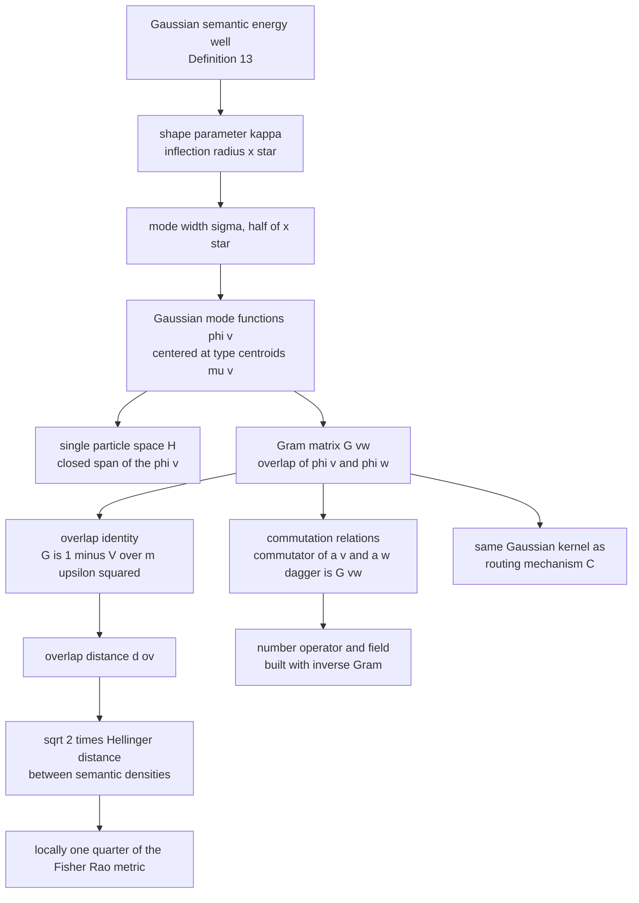
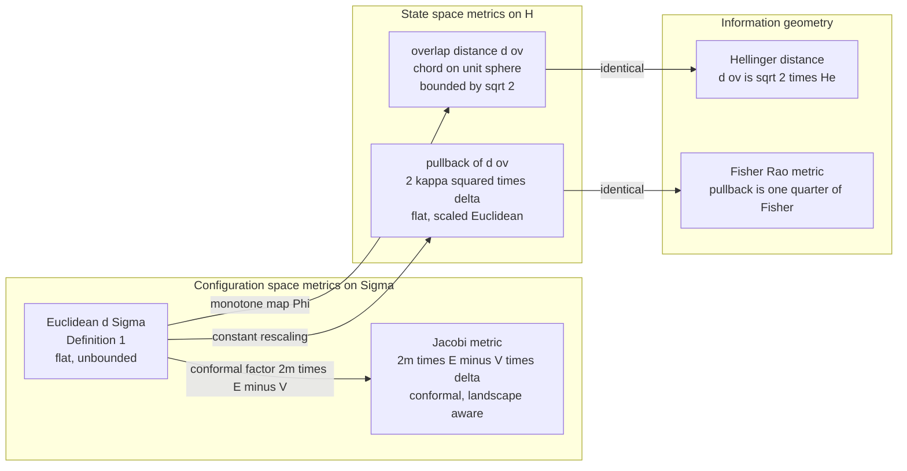
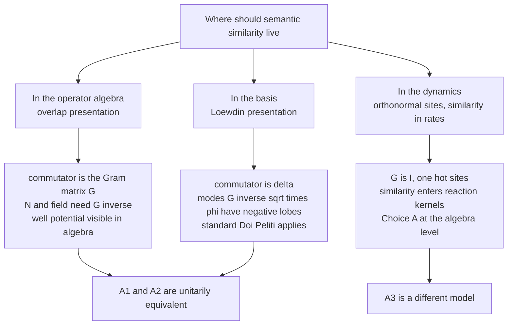
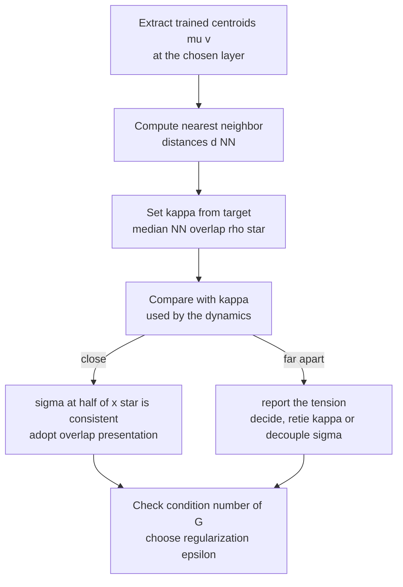
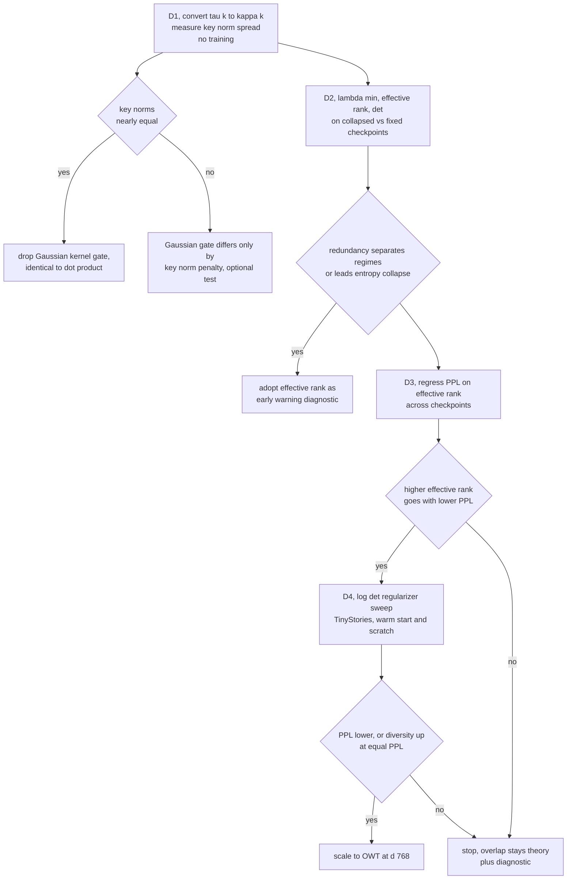

# Overlap Distance in the Semantic Simulation Framework

**Definition, derivations, geometric structure, and repercussions for the Fock-space (v2) formalism**

Companion note to Section 10.5.2 (*Creation and destruction (v2) → Fock space and second quantisation*). Notation follows the book: semantic space $\Sigma = (\mathbb{R}^L, d_\Sigma)$ with $d_\Sigma(x,y) = \lVert x-y\rVert _2$ (Definition 1), Gaussian semantic energy well $V(x) = m\upsilon^2\left(1 - e^{-\kappa^2 x^2}\right)$ with shape parameter $\kappa = f/\upsilon$ (Definition 13).

---

## Contents

1. [Motivation](#1-motivation)
2. [Starting point: the Gaussian well](#2-starting-point-the-gaussian-well)
3. [Mode functions and the overlap integral](#3-mode-functions-and-the-overlap-integral)
4. [The overlap identity and the overlap distance](#4-the-overlap-identity-and-the-overlap-distance)
5. [Metric properties of the overlap distance](#5-metric-properties-of-the-overlap-distance)
6. [Geometry: embedding, pullback metric, and information geometry](#6-geometry-embedding-pullback-metric-and-information-geometry)
7. [Heterogeneous and anisotropic wells](#7-heterogeneous-and-anisotropic-wells)
8. [Consequences for the Fock-space algebra](#8-consequences-for-the-fock-space-algebra)
9. [Repercussions, one by one](#9-repercussions-one-by-one)
10. [Practical impact on Fock-PARFLM: what it does not do, and where it may help](#10-practical-impact-on-fock-parflm-what-it-does-not-do-and-where-it-may-help)
11. [Recommendations for the book](#11-recommendations-for-the-book)
12. [Proposed experiments](#12-proposed-experiments)
13. [Summary](#13-summary)

---

## 1. Motivation

Section 10.5.2 builds a Fock space $\mathcal{F}(\mathcal{H})$ over a single-particle Hilbert space $\mathcal{H}$ and writes the canonical relation

$$
[a_v, a_w^\dagger] = \delta_{vw}.
$$

The Kronecker delta is only correct if the single-particle states of distinct types $v \neq w$ are **orthogonal**. If they are, then the operator algebra sees *cat* and *kitten* as exactly as unrelated as *cat* and *tax*: semantic similarity is invisible at the level of $\mathcal{H}$. This is the "one-hot" (Choice A) single-particle space.

The framework already contains everything needed to do better. The field operator in the §10.5.2 mapping table,

$$
\hat{\phi}(x) = \sum_v \phi_v(x) a_v,
$$

implicitly attaches a **mode function** $\phi_v \in L^2(\mathbb{R}^L)$ to each type. If those mode functions are Gaussians tied to the semantic energy well, their inner products encode similarity, and the Gaussian well itself appears inside the operator algebra.

This note develops that construction in full: it defines the **overlap distance**, derives its properties, places it in relation to the Euclidean metric $d_\Sigma$ and the Jacobi metric, and traces every repercussion of adopting it.

The central result, derived in §4, is an exact identity:

$$
\boxed{\lVert \phi_a - \phi_b\rVert ^2 = \frac{2V\left(\lVert a-b\rVert \right)}{m\upsilon^2}}
$$

The squared Hilbert-space distance between two semantic particle states equals the normalized Gaussian well potential evaluated at their Euclidean separation.



---

## 2. Starting point: the Gaussian well

From Definition 13, a semantic particle displaced by $x = \lVert \vec{r} - \vec{r}_c\rVert$ from its equilibrium centroid has potential energy

$$
V(x) = m\upsilon^2\left(1 - e^{-\kappa^2 x^2}\right), \qquad x \geq 0. \qquad (2.1)
$$

The relevant derived quantities are as follows.

**Depth.** $V(\infty) = m\upsilon^2 = E_t$, the total ensemble energy.

**Force.** The radial force is

$$
F(x) = -V'(x) = -2m\upsilon^2\kappa^2 x e^{-\kappa^2x^2}. \qquad (2.2)
$$

**Inflection radius.** Setting $V''(x) = 0$:

$$
V''(x) = 2m\upsilon^2\kappa^2 e^{-\kappa^2x^2}\left(1 - 2\kappa^2x^2\right) = 0
\Longrightarrow
x^{\ast} = \frac{1}{\kappa\sqrt{2}}. \qquad (2.3)
$$

Inside $x^{\ast}$ the well is approximately harmonic; beyond it the restoring force decays and the particle is effectively free.

**Harmonic limit.** For $x \ll x^{\ast}$,

$$
V(x) \approx m\upsilon^2\kappa^2 x^2 - \tfrac{1}{2}m\upsilon^2\kappa^4 x^4 + O(x^6), \qquad (2.4)
$$

with harmonic frequency $\omega^2 = 2\upsilon^2\kappa^2$.

The **normalized well profile** will play a central role:

$$
\bar{V}(x) \equiv \frac{V(x)}{m\upsilon^2} = 1 - e^{-\kappa^2x^2} \in [0, 1). \qquad (2.5)
$$

---

## 3. Mode functions and the overlap integral

### 3.1 Definition

Let $\{\mu_v\}_{v \in \mathcal{V}} \subset \mathbb{R}^L$ be the centroids of the semantic particle types. Attach to each type the normalized Gaussian mode function

$$
\phi_v(x) = (2\pi\sigma^2)^{-L/4}\exp\left(-\frac{\lVert x - \mu_v\rVert ^2}{4\sigma^2}\right). \qquad (3.1)
$$

The exponent uses $4\sigma^2$ rather than $2\sigma^2$ so that the **squared** mode function is a normalized Gaussian density with variance $\sigma^2$ per coordinate:

$$
|\phi_v(x)|^2 = (2\pi\sigma^2)^{-L/2}\exp\left(-\frac{\lVert x-\mu_v\rVert ^2}{2\sigma^2}\right) = \mathcal{N}(x;\mu_v,\sigma^2 I_L). \qquad (3.2)
$$

Hence $\lVert \phi_v\rVert _{L^2} = 1$. The mode function is the square root of a probability density over semantic space. This fact drives the information-geometric results of §6.4.

### 3.2 The overlap integral: full derivation

Compute $\langle\phi\_a, \phi\_b\rangle = \int\_{\mathbb{R}^L}\phi\_a(x)\phi\_b(x)dx$ for centroids $a, b$. The integrand is

$$
\phi_a\phi_b = (2\pi\sigma^2)^{-L/2}\exp\left(-\frac{\lVert x-a\rVert ^2 + \lVert x-b\rVert ^2}{4\sigma^2}\right).
$$

Complete the square with midpoint $c = (a+b)/2$ and separation $\Delta = a - b$:

$$
\lVert x-a\rVert ^2 + \lVert x-b\rVert ^2 = 2\lVert x - c\rVert ^2 + \tfrac{1}{2}\lVert \Delta\rVert ^2. \qquad (3.3)
$$

To verify, write $x - a = (x-c) - \Delta/2$ and $x - b = (x-c) + \Delta/2$. The cross terms cancel, leaving $2\lVert x-c\rVert ^2 + 2\cdot\lVert \Delta\rVert ^2/4$.

Substituting,

$$
\langle\phi_a,\phi_b\rangle = (2\pi\sigma^2)^{-L/2} e^{-\lVert \Delta\rVert ^2/(8\sigma^2)}\int_{\mathbb{R}^L} e^{-\lVert x-c\rVert ^2/(2\sigma^2)}dx.
$$

The remaining Gaussian integral equals $(2\pi\sigma^2)^{L/2}$, which cancels the prefactor exactly:

$$
\boxed{\langle\phi_a,\phi_b\rangle = \exp\left(-\frac{\lVert a-b\rVert ^2}{8\sigma^2}\right)} \qquad (3.4)
$$

Three properties follow immediately.

- $\langle\phi_a,\phi_b\rangle \in (0, 1]$: always strictly positive, never negative.
- It equals 1 if and only if $a = b$.
- It depends only on $\lVert a - b\rVert$: the overlap is isotropic and translation invariant.

### 3.3 Calibration: tying σ to the well

The overlap (3.4) and the well profile (2.5) have the same functional form. Matching the exponents requires

$$
\frac{1}{8\sigma^2} = \kappa^2 \quad\Longleftrightarrow\quad \sigma = \frac{1}{2\sqrt{2}\kappa}. \qquad (3.5)
$$

Comparing with (2.3), $x^{\ast} = 1/(\kappa\sqrt2) = 2\sigma$, so

$$
\boxed{\sigma = \frac{x^{\ast}}{2}} \qquad (3.6)
$$

**Interpretation.** The semantic resolution of the single-particle space, meaning the width of a particle's mode function, is exactly half the inflection radius of the well that binds it. The resolution is not a free hyperparameter; it is fixed by the same shape parameter that governs the dynamics.

A useful byproduct is

$$
\sqrt{2}\kappa = \frac{1}{x^{\ast}}, \qquad (3.7)
$$

which makes the linearized overlap distance in §5.3 particularly simple.

---

## 4. The overlap identity and the overlap distance

### 4.1 The overlap identity

With the calibration (3.5), equation (3.4) reads $\langle\phi_a,\phi_b\rangle = e^{-\kappa^2\lVert a-b\rVert ^2}$. Comparing with (2.5):

$$
\boxed{\langle\phi_a,\phi_b\rangle = 1 - \bar{V}\left(\lVert a-b\rVert \right) = 1 - \frac{V(\lVert a-b\rVert )}{m\upsilon^2}} \qquad (4.1)
$$

**Reading.** The overlap between particle states centered at $a$ and $b$ is one minus the normalized depth of the well centered at $a$, felt at $b$. By symmetry of $V$ in its argument, the same holds with $a$ and $b$ exchanged.

### 4.2 The overlap distance

Define the **overlap distance** as the norm distance in $\mathcal{H}$ between mode functions:

$$
d_{\mathrm{ov}}(a, b) \equiv \lVert \phi_a - \phi_b\rVert _{L^2}. \qquad (4.2)
$$

Expanding the norm and using $\lVert \phi_a\rVert  = \lVert \phi_b\rVert  = 1$:

$$
d_{\mathrm{ov}}^2 = \lVert \phi_a\rVert ^2 + \lVert \phi_b\rVert ^2 - 2\langle\phi_a,\phi_b\rangle = 2\left(1 - \langle\phi_a,\phi_b\rangle\right). \qquad (4.3)
$$

Substituting (4.1):

$$
\boxed{d_{\mathrm{ov}}^2(a,b) = 2\bar{V}\left(d_\Sigma(a,b)\right) = \frac{2V(d_\Sigma(a,b))}{m\upsilon^2} = 2\left(1 - e^{-\kappa^2 d_\Sigma^2(a,b)}\right)} \qquad (4.4)
$$

So $d_{\mathrm{ov}}$ is a function of the Euclidean semantic distance alone:

$$
d_{\mathrm{ov}} = \Phi(d_\Sigma), \qquad \Phi(d) = \sqrt{2\left(1 - e^{-\kappa^2 d^2}\right)}. \qquad (4.5)
$$

In the draft replacement text for §10.5.2 this quantity is written $d_{\mathcal{H}}$. The two names refer to the same object.

### 4.3 Worked example

Take the toy two-dimensional embeddings used earlier: *cat* $= (0.90, 0.40)$, *kitten* $= (0.85, 0.50)$, *tax* $= (-0.30, 0.95)$, with $\sigma = 0.25$, so $\kappa^2 = 1/(8\sigma^2) = 2$ and $x^{\ast} = 0.5$.

| Pair | $d_\Sigma^2$ | $d_\Sigma / x^{\ast}$ | $\langle\phi_a,\phi_b\rangle$ | $d_{\mathrm{ov}}$ |
|---|---|---|---|---|
| cat–kitten | 0.0125 | 0.224 | 0.975 | 0.223 |
| kitten–tax | 1.525 | 2.470 | 0.047 | 1.380 |
| cat–tax | 1.7425 | 2.640 | 0.031 | 1.392 |

Two features are visible already. Near-synonyms have $d_{\mathrm{ov}} \approx d_\Sigma/x^{\ast}$ (§5.3). Unrelated words both sit near the ceiling $\sqrt2 \approx 1.414$ and are barely distinguishable from each other in degree (§5.4).

---

## 5. Metric properties of the overlap distance

### 5.1 $d_{\mathrm{ov}}$ is a metric

$d_{\mathrm{ov}}$ is the restriction of the $L^2$ norm distance to the set $\{\phi_a : a \in \mathbb{R}^L\}$, so symmetry and the triangle inequality are inherited from the norm. Positivity and identity of indiscernibles follow from

$$
d_{\mathrm{ov}}(a,b) = 0 \iff \phi_a = \phi_b \iff a = b,
$$

because the map $a \mapsto \phi_a$ is injective (distinct centroids give distinct Gaussians). Hence $(\mathbb{R}^L, d_{\mathrm{ov}})$ is a metric space.

### 5.2 Monotonicity: the same ordering as $d_\Sigma$

$\Phi$ in (4.5) is strictly increasing on $[0,\infty)$:

$$
\Phi'(d) = \frac{2\kappa^2 d e^{-\kappa^2 d^2}}{\Phi(d)} \gt  0 \quad (d \gt  0). \qquad (5.1)
$$

Consequently, for any points $a, b, c, e$,

$$
d_\Sigma(a,b) \lt  d_\Sigma(c,e) \iff d_{\mathrm{ov}}(a,b) \lt  d_{\mathrm{ov}}(c,e). \qquad (5.2)
$$

The two metrics induce the **same topology**, the **same nearest-neighbor relations**, and the **same ordering of all pairs**. Every construction in the book that depends on distances only through comparisons or thresholds, such as cohesion criteria and neighborhood membership, transfers unchanged, with each threshold $\tau_\Sigma$ mapped to $\Phi(\tau_\Sigma)$.

### 5.3 Local behavior: linear regime

Expanding $1 - e^{-u} = u - u^2/2 + O(u^3)$ with $u = \kappa^2 d^2$:

$$
d_{\mathrm{ov}}^2 = 2\kappa^2 d^2 - \kappa^4 d^4 + O(d^6), \qquad (5.3)
$$

$$
d_{\mathrm{ov}} = \sqrt2\kappa d\left(1 - \tfrac{1}{4}\kappa^2 d^2 + O(d^4)\right). \qquad (5.4)
$$

Using (3.7), the leading term is

$$
\boxed{d_{\mathrm{ov}} \approx \frac{d_\Sigma}{x^{\ast}}\quad\text{for } d_\Sigma \ll x^{\ast}} \qquad (5.5)
$$

Within a well, the overlap distance is the Euclidean distance **measured in units of the inflection radius**.

### 5.4 Global behavior: saturation

Since $\langle\phi_a,\phi_b\rangle \gt  0$ always,

$$
0 \le d_{\mathrm{ov}} \lt  \sqrt{2}. \qquad (5.6)
$$

All mode functions lie on the unit sphere of $\mathcal{H}$ with pairwise angles strictly below $\pi/2$; the supremum $\sqrt2$ corresponds to orthogonality, approached but never reached.

**Saturation scale.** The overlap falls below a tolerance $\delta$ when

$$
e^{-\kappa^2 d^2} \le \delta \iff d \ge \frac{\sqrt{\ln(1/\delta)}}{\kappa} = x^{\ast}\sqrt{2\ln(1/\delta)}. \qquad (5.7)
$$

For $\delta = 0.01$, this gives $d \ge 3.03x^{\ast}$. Beyond about three inflection radii, every pair is orthogonal to within 1%.

**Sensitivity.** From (5.1), the resolving power $\Phi'(d)$ peaks near $d \sim x^{\ast}$ and decays like $de^{-\kappa^2d^2}$ at large $d$. Large-distance distinctions are compressed super-exponentially.

| $d_\Sigma / x^{\ast}$ | $\kappa^2 d^2$ | overlap $e^{-\kappa^2d^2}$ | $d_{\mathrm{ov}}$ | linear approx. $d_\Sigma/x^{\ast}$ |
|---|---|---|---|---|
| 0.25 | 0.031 | 0.969 | 0.248 | 0.25 |
| 0.5 | 0.125 | 0.882 | 0.485 | 0.50 |
| 1.0 | 0.5 | 0.607 | 0.887 | 1.00 |
| 2.0 | 2.0 | 0.135 | 1.315 | 2.00 |
| 3.0 | 4.5 | 0.011 | 1.406 | 3.00 |
| 4.0 | 8.0 | $3.4\times10^{-4}$ | 1.414 | 4.00 |

The linear approximation is accurate to about 3% at $d = 0.5x^{\ast}$ and fails completely beyond $2x^{\ast}$.

### 5.5 Two-sided bounds

From $1 - e^{-u} \le u$:

$$
d_{\mathrm{ov}} \le \sqrt2\kappa d_\Sigma = \frac{d_\Sigma}{x^{\ast}}. \qquad (5.8)
$$

So $d_{\mathrm{ov}}$ is globally 1-Lipschitz with respect to $d_\Sigma/x^{\ast}$.

A reverse bound holds only on bounded regions. Concavity of $1 - e^{-u}$ gives, for $u \le U$, $1 - e^{-u} \ge u(1 - e^{-U})/U$. With $U = \kappa^2 D^2$:

$$
d_{\mathrm{ov}} \ge \sqrt{\frac{1 - e^{-\kappa^2D^2}}{\kappa^2 D^2}}\frac{d_\Sigma}{x^{\ast}}\qquad\text{whenever } d_\Sigma \le D. \qquad (5.9)
$$

The two metrics are therefore **bi-Lipschitz equivalent on any bounded region**, with a constant that deteriorates as the region grows beyond $x^{\ast}$, but **not globally equivalent**. This is the precise sense in which $d_{\mathrm{ov}}$ complements rather than replaces $d_\Sigma$.

---

## 6. Geometry: embedding, pullback metric, and information geometry

### 6.1 The embedding into the unit sphere

The map

$$
\iota : \mathbb{R}^L \to \mathcal{S}(\mathcal{H}) \subset L^2(\mathbb{R}^L),\qquad a \mapsto \phi_a \qquad (6.1)
$$

embeds semantic space into the unit sphere of $L^2$. Because all overlaps are positive, the image lies inside a "positive orthant" of the sphere: no two images are more than $90°$ apart.

### 6.2 Pullback metric: $\iota$ is flat

The Riemannian metric induced on $\mathbb{R}^L$ by $\iota$ is

$$
g_{ij}(a) = \left\langle \frac{\partial\phi_a}{\partial a_i}, \frac{\partial\phi_a}{\partial a_j}\right\rangle = \left.\frac{\partial^2}{\partial a_i\partial b_j}\langle\phi_a,\phi_b\rangle\right|_{b=a}. \qquad (6.2)
$$

With $K(a,b) = e^{-\kappa^2\lVert a-b\rVert ^2}$:

$$
\frac{\partial K}{\partial b_j} = 2\kappa^2(a_j - b_j)K,
$$

$$
\frac{\partial^2 K}{\partial a_i\partial b_j} = 2\kappa^2\delta_{ij}K - 4\kappa^4(a_i - b_i)(a_j - b_j)K.
$$

At $b = a$ the second term vanishes and $K = 1$:

$$
\boxed{g_{ij} = 2\kappa^2\delta_{ij} = \frac{\delta_{ij}}{(x^{\ast})^2}} \qquad (6.3)
$$

The pullback metric is a **constant multiple of the Euclidean metric**. Its Christoffel symbols vanish, its curvature vanishes, and its geodesics are straight lines in $\Sigma$. The intrinsic length of the straight segment from $a$ to $b$ is

$$
\ell_{\mathrm{ov}}(a,b) = \sqrt2\kappa d_\Sigma(a,b) = \frac{d_\Sigma(a,b)}{x^{\ast}}. \qquad (6.4)
$$

### 6.3 Chord versus arc

$d_{\mathrm{ov}}$ is the **chord** in $L^2$ between two points of the embedded manifold; $\ell_{\mathrm{ov}}$ is the **arc** along it. Their ratio,

$$
\frac{d_{\mathrm{ov}}}{\ell_{\mathrm{ov}}} = \frac{\sqrt{2(1 - e^{-s^2/2})}}{s},\qquad s = \frac{d_\Sigma}{x^{\ast}}, \qquad (6.5)
$$

tends to 1 as $s \to 0$ and to 0 as $s \to \infty$. The embedded manifold is intrinsically flat but extrinsically "curls" through ever-new orthogonal directions of $L^2$. This is the familiar behavior of the Gaussian-kernel feature map: an infinite-dimensional helix in which far-apart points are nearly orthogonal even though the path between them has finite length.

**Repercussion.** The overlap distance introduces **no new intrinsic Riemannian structure** on $\Sigma$. It does not compete with the Jacobi metric, which remains the only metric in the framework that is sensitive to the potential landscape between basins.



### 6.4 Information-geometric identification

By (3.2), $\phi_v = \sqrt{p_v}$ with $p_v = \mathcal{N}(\mu_v, \sigma^2 I)$. The overlap is therefore the **Bhattacharyya coefficient** between the semantic densities:

$$
\langle\phi_v,\phi_w\rangle = \int\sqrt{p_vp_w}dx = \mathrm{BC}(p_v, p_w). \qquad (6.6)
$$

With the Hellinger distance defined by $\mathrm{He}^2(p,q) = \tfrac12\int(\sqrt p - \sqrt q)^2 = 1 - \mathrm{BC}(p,q)$, (4.3) gives

$$
\boxed{d_{\mathrm{ov}}(v,w) = \sqrt2\mathrm{He}(p_v, p_w)} \qquad (6.7)
$$

The overlap distance is, up to $\sqrt2$, the Hellinger distance between the Gaussian semantic densities of the two types.

The Hellinger distance is locally governed by the Fisher information $\mathcal{I}$:

$$
\mathrm{He}^2(p_\theta, p_{\theta + d\theta}) = \tfrac18 d\theta^\top \mathcal{I}(\theta) d\theta + O(\lVert d\theta\rVert ^3), \qquad (6.8)
$$

hence

$$
d_{\mathrm{ov}}^2 \approx \tfrac14 d\theta^\top\mathcal{I}(\theta)d\theta. \qquad (6.9)
$$

For the location family $\mathcal{N}(\mu, \sigma^2 I)$, $\mathcal{I}_{\mu\mu} = I/\sigma^2$, so $d_{\mathrm{ov}}^2 \approx \lVert d\mu\rVert ^2/(4\sigma^2) = 2\kappa^2\lVert d\mu\rVert ^2$. This reproduces (6.3) independently.

**Consequence.** The overlap construction is not ad hoc. It is the canonical information-geometric distance between semantic particles, once particles are modeled as Gaussian densities over $\Sigma$ with width set by the well. This connects the framework to information geometry (Amari, Čencov) and supplies an invariance argument: by Čencov's theorem, the Fisher–Rao metric is the unique (up to scale) metric on statistical models invariant under sufficient statistics.

---

## 7. Heterogeneous and anisotropic wells

Later sections of the book use anisotropic Gaussian $V_\theta$ and mixtures of wells with learned widths. The overlap must then be generalized.

### 7.1 General anisotropic overlap

Let each type have a positive-definite covariance $\Sigma_v$ and mode function

$$
\phi_v(x) = (2\pi)^{-L/4}(\det\Sigma_v)^{-1/4}\exp\left(-\tfrac14(x - \mu_v)^\top\Sigma_v^{-1}(x - \mu_v)\right). \qquad (7.1)
$$

Write $A = \Sigma_v^{-1}$, $B = \Sigma_w^{-1}$, $\Delta = \mu_v - \mu_w$. The product's exponent is $-\tfrac14\left[(x-\mu\_v)^\top A(x-\mu\_v) + (x-\mu\_w)^\top B(x-\mu\_w)\right]$. Completing the square around $c = (A+B)^{-1}(A\mu_v + B\mu_w)$ leaves the constant term

$$
-\tfrac14\Delta^\top A(A+B)^{-1}B\Delta = -\tfrac14\Delta^\top(\Sigma_v + \Sigma_w)^{-1}\Delta,
$$

using $A(A+B)^{-1}B = (A^{-1} + B^{-1})^{-1}$. The Gaussian integral contributes $(4\pi)^{L/2}\det(A+B)^{-1/2}$. Collecting factors:

$$
\boxed{G_{vw} = \frac{(\det\Sigma_v\det\Sigma_w)^{-1/4}}{\det\left(\tfrac{\Sigma_v^{-1}+\Sigma_w^{-1}}{2}\right)^{1/2}}\exp\left(-\tfrac14\Delta^\top(\Sigma_v+\Sigma_w)^{-1}\Delta\right)} \qquad (7.2)
$$

This is the Bhattacharyya coefficient between $\mathcal{N}(\mu_v,\Sigma_v)$ and $\mathcal{N}(\mu_w,\Sigma_w)$. It factors into a **shape term** (the determinant prefactor), which depends only on how the two wells' shapes differ, and a **location term** (the exponential), which depends on the separation measured in the averaged covariance.

### 7.2 Isotropic but heterogeneous widths

For $\Sigma_v = \sigma_v^2 I$ and $\Sigma_w = \sigma_w^2 I$, (7.2) reduces to

$$
G_{vw} = \left(\frac{2\sigma_v\sigma_w}{\sigma_v^2 + \sigma_w^2}\right)^{L/2}\exp\left(-\frac{\lVert \mu_v - \mu_w\rVert ^2}{4(\sigma_v^2 + \sigma_w^2)}\right). \qquad (7.3)
$$

With $\sigma_v = \sigma_w$ the prefactor is 1, recovering (3.4).

### 7.3 The shape prefactor in high dimension

Let $r = \sigma_w/\sigma_v = 1 + \varepsilon$. Then

$$
\frac{2r}{1 + r^2} = \frac{1 + \varepsilon}{1 + \varepsilon + \varepsilon^2/2} = 1 - \frac{\varepsilon^2}{2} + O(\varepsilon^3), \qquad (7.4)
$$

so

$$
\ln(\text{prefactor}) = \frac{L}{2}\ln\frac{2r}{1+r^2} \approx -\frac{L\varepsilon^2}{4}. \qquad (7.5)
$$

| $L$ | width ratio $r$ | prefactor (exact) |
|---|---|---|
| 2 | 1.1 | 0.995 |
| 64 | 1.1 | 0.865 |
| 384 | 1.1 | 0.42 |
| 768 | 1.1 | 0.176 |
| 768 | 1.2 | 0.0018 |
| 1024 | 1.1 | 0.098 |

**Repercussion.** At production widths, a modest difference in well widths is by itself a strong orthogonalizer: two types with **identical centroids** but a 20% width difference have overlap about $2\times10^{-3}$ at $L = 768$. In models with learned per-well widths, the overlap structure is dominated by width agreement, not centroid proximity, unless widths are tied or regularized. This may be desirable, since concepts of very different precision should be distinguishable, but it must be a deliberate design decision.

### 7.4 Hyperbolic geometry of the (centroid, width) space

When widths are learned, the relevant parameter space is $(\mu, \sigma) \in \mathbb{R}^L \times \mathbb{R}\_{\gt 0}$. The Fisher information of the isotropic Gaussian family is block-diagonal with $\mathcal{I}\_{\mu\mu} = I/\sigma^2$ and $\mathcal{I}\_{\sigma\sigma} = 2L/\sigma^2$, so

$$
ds_{\mathrm{FR}}^2 = \frac{\lVert d\mu\rVert ^2 + 2Ld\sigma^2}{\sigma^2}. \qquad (7.6)
$$

Substituting $\tau = \sqrt{2L}\sigma$:

$$
ds_{\mathrm{FR}}^2 = 2L\frac{\lVert d\mu\rVert ^2 + d\tau^2}{\tau^2}, \qquad (7.7)
$$

which is $2L$ times the upper-half-space model of hyperbolic space $\mathbb{H}^{L+1}$. By (6.9), the overlap pullback metric is a quarter of this, with constant sectional curvature

$$
K_{\mathrm{ov}} = -\frac{4}{2L} = -\frac{2}{L}. \qquad (7.8)
$$

**Repercussion.** Once widths are learnable, the space of semantic particles under the overlap geometry is **hyperbolic**. Broad wells (large $\sigma$, general concepts) sit "high" in the half-space, where they are close to many points; narrow wells (small $\sigma$, specific concepts) sit "low", where they are far from each other. This is the geometry known to embed hierarchies with low distortion (Poincaré embeddings). It suggests a principled reading of well width as a level in a concept hierarchy. The curvature magnitude $2/L$ is small at large $L$, but distances in the $\tau$ direction are amplified by $\sqrt{2L}$, so the hierarchy effect does not vanish.

---

## 8. Consequences for the Fock-space algebra

### 8.1 Single-particle space

$$
\mathcal{H} = \overline{\mathrm{span}}\{\phi_v : v\in\mathcal{V}\} \subset L^2(\mathbb{R}^L), \qquad (8.1)
$$

with Gram matrix

$$
G_{vw} = \langle\phi_v,\phi_w\rangle = 1 - \bar{V}(\lVert \mu_v - \mu_w\rVert ). \qquad (8.2)
$$

**Invertibility.** The Gaussian kernel is strictly positive definite on distinct points (Bochner's theorem, since its Fourier transform is a strictly positive Gaussian). Hence $G \succ 0$ and $G^{-1}$ exists whenever the centroids are distinct.

### 8.2 Commutation relations

For any $f, g \in \mathcal{H}$, bosonic second quantization gives $[a(f), a^\dagger(g)] = \langle f, g\rangle$. With $a_v \equiv a(\phi_v)$:

$$
\boxed{[a_v, a_w^\dagger] = G_{vw} = 1 - \frac{V(\lVert \mu_v-\mu_w\rVert )}{m\upsilon^2}} \qquad (8.3)
$$

**The Gaussian well appears directly in the operator algebra.** Creating a particle of type $w$ and then annihilating one of type $v$ leaves a residue proportional to how deeply $w$ sits inside $v$'s well.

### 8.3 The number operator requires the inverse Gram matrix

The naive operator $\sum\_v a\_v^\dagger a\_v$ does **not** count particles when $G \neq I$. Applied to a one-particle state:

$$
\Big(\sum_v a_v^\dagger a_v\Big) a_u^\dagger|0\rangle = \sum_v G_{vu} a_v^\dagger|0\rangle \neq a_u^\dagger|0\rangle.
$$

The correct number operator uses the dual frame:

$$
N = \sum_{v,w} a_v^\dagger(G^{-1})_{vw}a_w. \qquad (8.4)
$$

**Proof.** On $a_u^\dagger|0\rangle$:

$$
Na_u^\dagger|0\rangle = \sum_{v,w} a_v^\dagger (G^{-1})_{vw}[a_w, a_u^\dagger]|0\rangle = \sum_{v,w} a_v^\dagger(G^{-1})_{vw}G_{wu}|0\rangle = a_u^\dagger|0\rangle.
$$

Since $[N, a_u^\dagger] = a_u^\dagger$ by the same computation, $N$ counts correctly on every $n$-particle sector. $\square$

### 8.4 The semantic field

The field operator $\hat{\phi}(x)$ must satisfy $a_u = \int\phi_u(x)\hat{\phi}(x)dx$ (mode functions are real). Trying $\hat{\phi}(x) = \sum\_{v,w}\phi\_v(x)C\_{vw}a\_w$:

$$
\int\phi_u\hat{\phidx} = \sum_{v,w}G_{uv}C_{vw}a_w = a_u \iff GC = I \iff C = G^{-1}.
$$

$$
\boxed{\hat{\phi}(x) = \sum_{v,w}\phi_v(x)(G^{-1})_{vw}a_w} \qquad (8.5)
$$

The book's current expression $\sum\_v\phi\_v(x)a\_v$ is the special case $G = I$.

### 8.5 Löwdin presentation: moving similarity into the basis

Define orthonormalized modes $\tilde{\phi} = G^{-1/2}\phi$, that is $\tilde{\phi}\_v = \sum\_w (G^{-1/2})\_{vw}\phi\_w$. Then $\langle\tilde{\phi}\_v,\tilde{\phi}\_w\rangle = \delta\_{vw}$, and with $\tilde{a}\_v = a(\tilde{\phi}\_v)$:

$$
[\tilde{a}_v, \tilde{a}_w^\dagger] = \delta_{vw},\qquad N = \sum_v\tilde{a}_v^\dagger\tilde{a}_v,\qquad \hat{\phi}(x) = \sum_v\tilde{\phi}_v(x)\tilde{a}_v. \qquad (8.6)
$$

The two presentations are unitarily equivalent descriptions of the same Fock space. Similarity lives either in the algebra (overlap presentation) or in the change of basis (Löwdin presentation). Among symmetric orthogonalizations, Löwdin's $G^{-1/2}$ is the one that minimizes $\sum\_v\lVert \tilde{\phi}\_v - \phi\_v\rVert ^2$, so the orthonormal modes stay as close as possible to the original Gaussians.



### 8.6 Multi-particle norms: statistics now interact with similarity

The norm of a two-particle state shows how particle statistics and semantic overlap couple. Let $\rho = G_{12}$.

**Bosons.** Using the commutator twice:

$$
\lVert a_1^\dagger a_2^\dagger|0\rangle\rVert ^2 = \langle0|a_2a_1a_1^\dagger a_2^\dagger|0\rangle = G_{11}G_{22} + G_{12}G_{21} = 1 + \rho^2 = \mathrm{per}(G). \qquad (8.7)
$$

**Fermions.** With anticommutators, the cross term changes sign:

$$
\lVert a_1^\dagger a_2^\dagger|0\rangle\rVert ^2 = 1 - \rho^2 = \det(G). \qquad (8.8)
$$

In general the $n$-particle norm is the permanent (bosons) or determinant (fermions) of the $n\times n$ Gram submatrix.

**Linguistic repercussion.**

- **Bosonic** near-synonyms are *enhanced*, by a factor up to 2 as $\rho\to1$: similar meanings bunch together.
- **Fermionic** near-synonyms are *suppressed*: as $\rho\to1$ the state vanishes. With overlapping modes, Pauli exclusion becomes a **continuous soft exclusion of near-duplicate meanings**, a precise formal model of "one filler per slot, and the filler cannot be duplicated by a paraphrase."

This effect does not exist with orthogonal (one-hot) modes, where both norms equal 1. It is a new consequence of introducing the overlap.

### 8.7 Two-mode example: cat and kitten

With $\rho = 0.975$:

$$G = \begin{pmatrix}1 & \rho\cr \rho & 1\end{pmatrix},\qquad G^{-1} = \frac{1}{1-\rho^2}\begin{pmatrix}1 & -\rho\cr -\rho & 1\end{pmatrix},\qquad \lambda(G) = 1\pm\rho. \qquad (8.9)$$

Then

$$
N = \frac{a_1^\dagger a_1 + a_2^\dagger a_2 - \rho\left(a_1^\dagger a_2 + a_2^\dagger a_1\right)}{1 - \rho^2}. \qquad (8.10)
$$

Numerically, $1 - \rho^2 = 0.0494$ and the condition number is $\kappa(G) = (1+\rho)/(1-\rho) = 79$. The number operator subtracts the "shared" part of the two modes and rescales by about 20.

---

## 9. Repercussions, one by one

### 9.1 Ordering and topology: unchanged

By (5.2), every comparison-based or threshold-based construct is preserved under $\tau \mapsto \Phi(\tau)$. Nearest-neighbor graphs, cohesion criteria for semantic structures, and neighborhood-defined interaction ranges are invariant.

### 9.2 Additive constructions: resolution loss at long range

Constructions that **add** or **subtract** distances change, because $\Phi$ is concave and saturating. Affected examples include path lengths, inter-anchor separation arguments such as $D^{\ast}$ in the Dyck analysis, ensemble-to-ensemble distances, and any margin of the form $d(a,c) - d(a,b)$. By (5.7), beyond about $3x^{\ast}$ the overlap distance carries less than 1% of its range in differences. **These constructions must stay on $d_\Sigma$.**

### 9.3 No change to the dynamics

The Euler–Lagrange equations, $V_\theta$, $V_\phi$, the Rayleigh dissipation, the BAOAB integrator, and the Jacobi metric $J_{ij} = 2m(E - V)\delta_{ij}$ are all defined on $(\Sigma, d_\Sigma)$ and are untouched. The overlap is a **kinematic structure on the space of particle-number states**, not a modification of configuration-space geometry.

### 9.4 No competition with the Jacobi metric

By §6.2–6.3 the overlap geometry is intrinsically flat. The Jacobi metric is conformally flat with a landscape-dependent factor and is the only metric in the framework that sees barriers between basins. The two answer different questions:

| Question | Metric |
|---|---|
| Are two particle states distinguishable? | $d_{\mathrm{ov}}$ (bounded, local) |
| How far apart are two positions? | $d_\Sigma$ (unbounded, flat) |
| How costly is it to move from one meaning to another along the dynamics? | Jacobi geodesic distance (landscape-aware) |

### 9.5 High-dimensional calibration of κ is essential

In high $L$, Euclidean distances concentrate. If embeddings have roughly i.i.d. coordinates with variance $s^2$, then

$$
\lVert \mu_v - \mu_w\rVert ^2 \approx 2Ls^2\left(1 \pm O(L^{-1/2})\right), \qquad (9.1)
$$

so typical overlaps are

$$
G_{vw} \approx e^{-2\kappa^2Ls^2}. \qquad (9.2)
$$

If $\kappa$ is chosen without reference to $L$, then $G \approx I$ to machine precision and the construction silently **degenerates to the one-hot space**: *cat* is orthogonal to *kitten* again. Non-trivial overlaps require

$$
\kappa \sim \frac{1}{s\sqrt{2L}}. \qquad (9.3)
$$

A practical rule: choose $\kappa$ so that the median nearest-neighbor overlap equals a target $\rho_\star$:

$$
\kappa^2 = \frac{\ln(1/\rho_\star)}{\mathrm{median}_v d_{\mathrm{NN}}^2(v)}. \qquad (9.4)
$$

For example, $\rho_\star = 0.5$ places the typical nearest neighbor at $d_{\mathrm{NN}} = x^{\ast}\sqrt{2\ln 2} \approx 1.18x^{\ast}$.

**Tension.** The $\kappa$ that makes the overlap informative should be compared with the $\kappa$ the dynamics actually learns or uses. If they differ substantially, the identification $\sigma = x^{\ast}/2$ in (3.6) is in tension with the trained model, which is itself a diagnostic worth reporting.



### 9.6 Heterogeneous widths dominate overlaps

By §7.3, with learned per-well widths at $L \sim 10^3$, shape mismatch alone suppresses overlaps by orders of magnitude. If similarity is meant to track centroid proximity, widths should be tied, regularized toward a common value, or the prefactor should be dropped by convention (equivalently, using only the location term of (7.2)). If width is meant to encode generality, the hyperbolic structure of §7.4 is the right lens.

### 9.7 Conditioning: counting near-synonyms is ill-posed

By (8.9), $\kappa(G) = (1+\rho)/(1-\rho)$ for a pair. For clusters of near-synonyms, the smallest eigenvalue of $G$ approaches 0 and $G^{-1}$ amplifies noise in $N$ and $\hat{\phi}$.

This is semantically honest: whether "the cat … the kitten" introduces one discourse entity or two is genuinely ambiguous. Numerically it requires regularization. Two standard choices:

$$
N_\varepsilon = \sum_{v,w}a_v^\dagger\left[(G + \varepsilon I)^{-1}\right]_{vw}a_w, \qquad (9.5)
$$

or truncation of the eigenvalues of $G$ below a threshold $\lambda_{\min}$. The regularizer $\varepsilon$ (or $\lambda_{\min}$) has a direct interpretation as a **coreference tolerance**: below it, nearly identical modes are counted as one.

### 9.8 Statistics become meaningful

By §8.6, the choice between bosons and fermions now has graded, similarity-dependent consequences: bunching versus soft exclusion of near-synonyms. With orthogonal modes the choice is visible only for identical types. This strengthens the case for stating the statistics explicitly in §10.5.2, and opens the option of **mixed statistics**: bosonic semantic content with fermionic slot occupancy.

### 9.9 Doi–Peliti: sites become Löwdin modes

The Doi–Peliti formalism is built on orthonormal site modes. With overlapping Gaussians it must be applied in the Löwdin basis (8.6). The Löwdin modes are **not** non-negative bumps: for a pair,

$$G^{-1/2} = \frac{1}{2}\begin{pmatrix}\frac{1}{\sqrt{1+\rho}} + \frac{1}{\sqrt{1-\rho}} & \frac{1}{\sqrt{1+\rho}} - \frac{1}{\sqrt{1-\rho}}\cr \frac{1}{\sqrt{1+\rho}} - \frac{1}{\sqrt{1-\rho}} & \frac{1}{\sqrt{1+\rho}} + \frac{1}{\sqrt{1-\rho}}\end{pmatrix}, \qquad (9.6)$$

whose off-diagonal entries are negative, so $\tilde{\phi}_v$ has negative lobes. The probabilistic interpretation of Doi–Peliti, as occupation numbers over sites, remains valid, but the sites are abstract orthogonalized concepts rather than localized regions of $\Sigma$.

The alternative (option A3 in the diagram of §8.5) is to keep one-hot sites for Doi–Peliti and move similarity into reaction rates. That is a genuinely different model, in which the algebra is blind to similarity. The book should state which choice it makes.

In either case, Doi–Peliti coherent states remain product Poisson distributions, and a continuous salience variable remains the natural mean-field (Poisson-mean) amplitude.

### 9.10 Computational cost

For register pools of size $M$, $G$ is $M \times M$ and its inverse costs $O(M^3)$, which is negligible at $M \sim 16$. Over a full vocabulary, $G$ is a dense $|\mathcal{V}|^2$ matrix. The random-Fourier-feature approximation already used in the book (Eq. 232) applies directly. For $K(a,b) = e^{-\kappa^2\lVert a-b\rVert ^2}$, Bochner's theorem gives frequencies $\omega_m \sim \mathcal{N}(0, 2\kappa^2 I)$:

$$
G \approx ZZ^\top,\qquad Z_{vm} = \sqrt{\tfrac{2}{M}}\cos\left(\omega_m^\top\mu_v + b_m\right),\quad b_m\sim\mathcal{U}[0,2\pi). \qquad (9.7)
$$

The regularized inverse then follows from the Woodbury identity in $O(|\mathcal{V}|M^2)$:

$$
(ZZ^\top + \varepsilon I)^{-1} = \varepsilon^{-1}\left[I - Z\left(\varepsilon I + Z^\top Z\right)^{-1}Z^\top\right]. \qquad (9.8)
$$

### 9.11 Unification with the symmetric-kernel routing mechanism

Mechanism C in Section 24 proposes a positive-definite kernel $K(h_t, h_s)$ as both router and interaction, with the Gaussian kernel as the canonical choice. If its bandwidth is matched to the well, $K(h\_t, h\_s) = e^{-\kappa^2\lVert h\_t - h\_s\rVert ^2}$, then

$$
K(h_t, h_s) = \langle\phi_{h_t},\phi_{h_s}\rangle = [a(\phi_{h_t}), a^\dagger(\phi_{h_s})]. \qquad (9.9)
$$

The routing kernel, the Gram matrix of the single-particle space, and the commutator of the Fock algebra become **one object**. The similarity that determines who interacts is the same similarity that determines how creation and annihilation compose. This is the strongest structural argument for the overlap presentation over the orthonormal one.

### 9.12 Summary of repercussions

| Aspect | Effect of introducing $d_{\mathrm{ov}}$ |
|---|---|
| Topology, nearest neighbors, pair ordering | Unchanged |
| Threshold-based constructs | Unchanged under $\tau\mapsto\Phi(\tau)$ |
| Additive / long-range distance arguments | Lose resolution beyond about $2$–$3x^{\ast}$; keep on $d_\Sigma$ |
| Dynamics, potentials, integrators, Jacobi metric | Unchanged |
| Intrinsic geometry | Flat; scaled Euclidean ($g = 2\kappa^2\delta$) |
| Information geometry | $d_{\mathrm{ov}} = \sqrt2$ Hellinger; locally $\tfrac14$ Fisher–Rao |
| Learned widths | Hyperbolic (centroid, width) space; curvature $-2/L$ |
| Width heterogeneity at large $L$ | Strong orthogonalization via the shape prefactor |
| Choice of κ | Must be calibrated to the embedding scale or $G \to I$ |
| Commutator | $[a_v,a_w^\dagger]$ = $G_{vw}$; well potential enters the algebra |
| Number operator, field | Require $G^{-1}$; ill-conditioned for near-synonyms |
| Statistics | Bosonic bunching vs fermionic soft exclusion of near-synonyms |
| Doi–Peliti | Applies in the Löwdin basis; sites become abstract |
| Computation | $O(M^3)$ for registers; RFF plus Woodbury for vocabularies |
| Mechanism C | Routing kernel and Fock commutator coincide |

---

## 10. Practical impact on Fock-PARFLM: what it does not do, and where it may help

The previous sections establish that the overlap distance makes the v2 formalism internally consistent. A separate question is whether implementing anything derived from it would change the behavior of trained Fock-derived models at production widths such as $d = 768$. This section answers that question carefully. The short answer is: **not by itself**. The theoretical gain is consistency; any empirical gain must come from a specific mechanism derived from the overlap structure, and must be demonstrated.

### 10.1 No direct effect on the dynamics

The quantities that determine perplexity are the forces acting on token particles,

$$
F_i = -\nabla_{h_i}V_\theta(\xi, h_i) - \sum_{s\neq i}\nabla V_\phi(h_i, h_s) - \sum_k \sigma_k\nabla V_\phi(h_i, r_k), \qquad (10.1)
$$

together with the damped integrator and the creation and destruction gates that set $r_k$ and $\sigma_k$. Introducing $d_{\mathrm{ov}}$, the Gram matrix $G$, and the corrected commutator (8.3) into the formalism changes none of these. A training run with the §10.5.2 rewrite in the book and no code change is bit-for-bit identical to one without it.

### 10.2 High dimension is a fragility, not an advantage

Sections 7.3 and 9.5 show that at $d \sim 10^3$ the overlap construction is *fragile*:

- distance concentration drives $G \to I$ unless κ is calibrated to the embedding scale, by (9.2)–(9.3);
- width heterogeneity suppresses overlaps through the prefactor $\left(2\sigma\_v\sigma\_w/(\sigma\_v^2+\sigma\_w^2)\right)^{L/2}$, by (7.5).

Both failure modes collapse the overlap space back to the one-hot space it was introduced to fix. Nothing in the construction makes high-dimensional behavior *better*; the sections on high dimension are warnings about what must be controlled for the construction to mean anything.

### 10.3 Gaussian-kernel routing reduces to dot-product routing

The most obvious way to "implement the overlap" is to replace the dot-product logits of the register creation gate by a Gaussian kernel in key space. The current gate is

$$
\alpha_{kj} = \mathrm{softmax}_j\left(\frac{q_k\cdot k_j}{\tau_k}\right),\qquad \tau_k = e^{\theta_{\tau,k}}, \qquad (10.2)
$$

with per-register learnable log-temperature (fix B1). A Gaussian-kernel gate with per-register bandwidth $\kappa_k$ would be

$$
\alpha^{\mathrm{G}}_{kj} = \mathrm{softmax}_j\left(-\kappa_k^2\lVert q_k - k_j\rVert ^2\right). \qquad (10.3)
$$

Expanding the squared norm,

$$
-\kappa_k^2\lVert q_k - k_j\rVert ^2 = 2\kappa_k^2q_k\cdot k_j - \kappa_k^2\lVert k_j\rVert ^2 - \kappa_k^2\lVert q_k\rVert ^2. \qquad (10.4)
$$

The last term does not depend on the token index $j$, so it cancels in the softmax:

$$
\boxed{\alpha^{\mathrm{G}}_{kj} = \mathrm{softmax}_j\left(2\kappa_k^2q_k\cdot k_j - \kappa_k^2\lVert k_j\rVert ^2\right)} \qquad (10.5)
$$

Gaussian-kernel routing is therefore dot-product routing with

1. temperature tied to bandwidth,
$$
\tau_k = \frac{1}{2\kappa_k^2}, \qquad (10.6)
$$
2. plus an additive **key-norm penalty** $-\kappa_k^2\lVert k_j\rVert ^2$ that biases routing toward tokens with small key norm.

If keys are normalized to a common norm, the penalty is constant in $j$ and the two gates are **identical**. The learnable temperature of B1 already plays the role of κ. Switching kernels can only matter through the key-norm term, and whether that helps (for example, by de-emphasizing high-norm keys of very frequent tokens) or hurts is an empirical question with no theoretical prior in its favor.

**A free calibration check.** Equation (10.6) means the trained temperatures already imply a bandwidth. The converged per-register range $\tau_k \in [7.26, 8.53]$ corresponds to

$$
\kappa_k^2 = \frac{1}{2\tau_k} \in [0.0586, 0.0689]. \qquad (10.7)
$$

This is a bandwidth **in projected key space** (after $W_Q$ and the per-register $W_K^{(k)}$), not directly in $\Sigma$. Comparing it with the well's κ requires accounting for the singular values of the projections, but it can be computed from existing checkpoints with no training.

### 10.4 Where it may plausibly help: register redundancy

One structure suggested by the overlap formalism is **not** already in the model: a direct measure of redundancy among register modes, and a force that keeps registers distinct throughout training.

#### Two register Gram matrices

There are two natural choices of "mode" for a register.

**(a) Content overlap**, using the register states $r_k$ as centroids:

$$
G^{(r)}_{kl} = \exp\left(-\kappa^2\lVert r_k - r_l\rVert ^2\right). \qquad (10.8)
$$

This measures whether two registers *hold the same content*. It requires choosing κ, with all the calibration caveats of §9.5.

**(b) Routing overlap**, using the creation distributions $\alpha\_k = (\alpha\_{k1},\dot{s},\alpha\_{kT})$. Each $\alpha_k$ is a probability vector, so $\sqrt{\alpha_k}$ is a unit vector, exactly as $\phi_v = \sqrt{p_v}$ in §6.4. Their inner product is the Bhattacharyya coefficient:

$$
G^{(\alpha)}_{kl} = \sum_j \sqrt{\alpha_{kj}\alpha_{lj}}. \qquad (10.9)
$$

This measures whether two registers *read from the same tokens*. It needs no bandwidth, is bounded in $[0,1]$, and is the direct analogue of the overlap identity at the level of routing. With the causal (cumulative) creation softmax, compute it per position $t$ over the prefix and average over positions and batch.

**Caveat for (b).** Diffuse distributions overlap strongly with each other: two near-uniform creation distributions over $T$ tokens have $G^{(\alpha)}_{kl} \approx 1$ even if they were produced independently. A quick check with random softmax rows over $T = 32$ tokens and 9 active registers gives an effective rank (defined below) of only about 2.4. So $G^{(\alpha)}$ conflates *diffuse* with *redundant*. Interpret it jointly with creation entropy, or compute it on the sharpened distributions $\alpha\_k^{\beta}/\lVert \alpha\_k^{\beta}\rVert \_1$ with $\beta \gt  1$.

Choice (b) is the more natural diagnostic for the routing questions studied in the B1–B3 work; choice (a) complements it by catching registers that read different tokens but store the same content.

#### Redundancy diagnostics

From either Gram matrix, restricted to the active set $A = \{k : \sigma_k \gt  \theta_{\min}\}$:

**Smallest eigenvalue.** $\lambda_{\min}(G_A)$ approaches 0 when some register is nearly a combination of others.

**Effective rank.** With eigenvalues $\lambda_i$ of $G_A$ and $p\_i = \lambda\_i/\sum\_l\lambda\_l$,

$$
\mathrm{erank}(G_A) = \exp\Big(-\sum_i p_i\ln p_i\Big) \in [1, |A|]. \qquad (10.10)
$$

This is the effective number of genuinely distinct registers. It equals $|A|$ when registers are orthogonal and 1 when they have collapsed onto a single mode.

**Fermionic norm.** $\det G_A$, the squared volume spanned by the modes (§8.6). It is 1 for orthogonal modes and 0 for linearly dependent ones.

These are cheap: $M = 16$ gives a $16\times16$ eigendecomposition per layer.

#### A determinantal diversity regularizer

The fermionic norm suggests a training-time penalty,

$$
\mathcal{L}_{\det} = -\lambda_{\det}\sum_{\ell}\log\det\left(G_{A,\ell} + \varepsilon I\right), \qquad (10.11)
$$

summed over layers $\ell$, added to the language-modeling loss. Its gradient is

$$
\frac{\partial}{\partial G}\log\det(G + \varepsilon I) = (G + \varepsilon I)^{-1}, \qquad (10.12)
$$

so the penalty pushes hardest on the most redundant directions: the inverse Gram weights each pairwise overlap by how badly it degrades the spanned volume. This is the logic of determinantal point processes, which favor diverse subsets.

**Why it might help.** The B3 fix (orthogonal query initialization) breaks the rotational symmetry among registers **only at step 0**. Nothing afterwards prevents registers from drifting back toward each other. The measured diversity of about 0.581, against a reference of 0.78, leaves room for a persistent diversity force. The B1+B2+B3 result was superadditive precisely because the three fixes broke compounding symmetries; a training-time force that keeps symmetry broken is a natural next candidate.

**Why it might hurt.** Some redundancy may be useful. Two registers co-attending to a dominant discourse entity can be legitimate, and forcing them apart may cost perplexity. The penalty also adds a gradient path through every creation gate, which interacts with the instability history of the register mechanism (gradient spikes traced partly to Fock register gating in Phase 5). Start with small $\lambda_{\det}$ and monitor gradient norms per module.

**Implementation sketch** (PyTorch, routing-overlap variant):

```python
import torch

def routing_gram(alpha: torch.Tensor, eps: float = 1e-8) -> torch.Tensor:
    # alpha: (B, M, T) creation weights, rows sum to 1 over T
    s = torch.sqrt(alpha.clamp_min(eps))
    return torch.einsum("bmt,bnt->bmn", s, s)          # (B, M, M), Bhattacharyya

def redundancy_stats(G: torch.Tensor, active: torch.Tensor):
    # G: (M, M) for one example; active: (M,) bool mask
    Ga = G[active][:, active]
    lam = torch.linalg.eigvalsh(Ga).clamp_min(0)
    p = lam / lam.sum()
    erank = torch.exp(-(p * torch.log(p.clamp_min(1e-12))).sum())
    return lam.min(), erank, torch.linalg.det(Ga)

def logdet_penalty(G: torch.Tensor, active: torch.Tensor,
                   lam_det: float, eps: float = 1e-3) -> torch.Tensor:
    # mean over batch of -log det(G_A + eps I); G: (B, M, M)
    mask = active.float()                              # (B, M)
    I = torch.eye(G.shape[-1], device=G.device)
    # inactive registers replaced by identity rows/cols so they do not count
    Gm = G * mask[:, :, None] * mask[:, None, :] + I * (1 - mask)[:, :, None]
    return -lam_det * torch.logdet(Gm + eps * I).mean()
```

Masking inactive registers to identity rows and columns keeps them out of both the diagnostics and the penalty, so destruction (§20 of the book) is not fought by the regularizer.

### 10.5 Diagnostic protocol

The order matters: diagnostics first, on existing checkpoints, and a training intervention only if they show signal.

**D1. Temperature-to-bandwidth calibration** (no training). From trained Fock v2.1 checkpoints, convert $\tau_k$ to $\kappa_k^2$ by (10.6). Estimate the key-space-to-$\Sigma$ scale from the singular values of $W_Q$ and $W_K^{(k)}$, and compare with the well κ (experiment E1). Also record the key-norm spread $\mathrm{std}\_j\lVert k_j\rVert/\mathrm{mean}\_j\lVert k_j\rVert$: if small, (10.5) shows a Gaussian-kernel gate would be indistinguishable from the current one, and that option can be dropped.

**D2. Redundancy versus collapse** (existing checkpoints, logging only). Compute $\lambda_{\min}$, effective rank, and $\det$ of $G^{(\alpha)}$ and $G^{(r)}$ across the saved checkpoints of both the collapsed regime (pre-B1, creation entropy about 0.04) and the fixed regime (B1+B2+B3). Test whether redundancy statistics separate the two regimes, and whether, along a training trajectory, the drop in effective rank **precedes** the drop in creation entropy. A lead time would make effective rank an early-warning signal, independently useful even if no regularizer is ever trained.

**D3. Redundancy versus perplexity** (existing checkpoints). Across runs and checkpoints, regress validation PPL (or the frequent-token excess loss, the about 79% component identified in the OWT diagnostics) on effective rank, controlling for training step. A clear negative relationship is the precondition for expecting a diversity force to help.

**D4. Regularizer ablation** (training; only if D2 or D3 show signal). On TinyStories first, sweep $\lambda_{\det} \in \{0, 10^{-3}, 10^{-2}, 10^{-1}\}$ from the converged conservative checkpoint (warm start) and from scratch. Report PPL, creation entropy, diversity, effective rank, and per-module gradient norms. Success criteria, in order of preference:

1. lower PPL at equal compute;
2. equal PPL with diversity moving toward 0.78 and higher effective rank;
3. faster convergence to the B1+B2+B3 operating point from scratch.

If none holds at any $\lambda_{\det}$, the overlap structure stays a theoretical contribution and a diagnostic, which is a legitimate outcome.



### 10.6 Summary of this section

| Proposal | Expected effect | Evidence needed |
|---|---|---|
| Overlap formalism in the book | Theoretical consistency only | None; no code change |
| Gaussian-kernel creation gate | Identical to dot product up to a key-norm penalty | D1 key-norm spread |
| τ-to-κ calibration | Consistency check between routing and well | D1 |
| Effective rank of register Gram | Early warning of routing collapse | D2 lead time |
| Log-det diversity regularizer | Possible diversity and PPL gain, possible PPL cost | D2 and D3 signal, then D4 |

---

## 11. Recommendations for the book

1. **Keep Definition 1 as is.** $d_\Sigma$ remains the metric of semantic space.
2. **Introduce $d_{\mathrm{ov}}$ as a derived quantity** in the book's §10.5.2, defined by (4.2) and characterized by (4.4), with a sentence noting its monotone relation to $d_\Sigma$.
3. **Define $\mathcal{H}$ explicitly** by (8.1), with Gaussian mode functions of width $\sigma = x^{\ast}/2$.
4. **Replace $[a\_v, a\_w^\dagger] = \delta\_{vw}$** with (8.3), and update the number operator and field per (8.4) and (8.5). Mention the Löwdin equivalence (8.6).
5. **State the statistics** (bosonic, with the reasons given in the draft replacement text), and note the soft-exclusion property of fermions as an alternative for slot-like referents.
6. **State the Doi–Peliti convention**: Löwdin basis (algebra sees similarity) or one-hot sites with similarity in rates (algebra blind to similarity).
7. **Add a calibration remark** on κ in high dimension (§9.5), including the comparison with the dynamically used κ.
8. **Cross-reference mechanism C**, noting that matched bandwidths make the routing kernel and the commutator identical.
9. **Optionally**, a short paragraph on the Hellinger/Fisher–Rao identification and, for learned widths, the hyperbolic geometry.

---

## 12. Proposed experiments

**E1. Calibration and tension test.** On trained Fock-PARFLM checkpoints, extract centroids, compute $d_{\mathrm{NN}}$, set κ by (9.4), and compare with the learned well widths. Report the ratio $\kappa_{\text{calib}}/\kappa_{\text{dyn}}$ per layer.

**E2. Overlap as a semantic similarity measure.** Add $d_{\mathrm{ov}}$ (equivalently, overlap $G$) as a fourth candidate in the geodesic semantic-distance experiment on STS-B and SICK-R, alongside cosine, Euclidean, and Jacobi geodesic distance. Prediction: $d_{\mathrm{ov}}$ matches Euclidean in Spearman correlation (identical ordering, by (5.2)) and loses to the Jacobi geodesic on cross-basin and polysemy strata, because it is landscape-blind.

**E3. Conditioning statistics.** Compute the spectrum of $G$ over register modes during training. Track the smallest eigenvalue as a measure of register redundancy. Prediction: collapse of $\lambda_{\min}(G)$ precedes entropy collapse in the creation gates, giving an earlier warning than the entropy metric. Concrete Gram matrices, statistics, and the protocol are given in §10.4–10.5 (diagnostics D2–D3).

**E4. Width heterogeneity.** In multi-well models, measure the distribution of the shape prefactor in (7.3) across type pairs. Determine whether overlaps are dominated by width mismatch (§7.3) or centroid proximity.

**E5. Soft exclusion probe.** In a controlled synthetic setting, compare bosonic and fermionic register statistics on tasks with argument slots that must not be filled by paraphrases. Prediction: fermionic statistics with overlap reduces duplicate-filler errors.

**E6. Occupation statistics.** Test whether register salience distributions are Poisson-like, as the Doi–Peliti coherent-state picture predicts, or sub- or super-Poissonian, indicating effective repulsion or attraction between creations.

**E7. Determinantal diversity regularizer.** The log-det penalty (10.11) on register Gram matrices, run as protocol step D4 of §10.5 and only if diagnostics D2–D3 show that register redundancy tracks routing collapse or perplexity.

---

## 13. Summary

Tying Gaussian mode functions to the semantic energy well yields an exact identity: the squared Hilbert-space distance between two semantic particle states equals twice the normalized well potential at their Euclidean separation,

$$
d_{\mathrm{ov}}^2 = \frac{2V(d_\Sigma)}{m\upsilon^2},
$$

with mode width $\sigma = x^{\ast}/2$ fixed by the well's inflection radius.

The resulting overlap distance is a bounded metric with the same topology and pair ordering as $d_\Sigma$. It is locally the Euclidean distance in units of $x^{\ast}$, saturates at $\sqrt2$ beyond about $3x^{\ast}$, and equals $\sqrt2$ times the Hellinger distance between Gaussian semantic densities, so it is locally a quarter of the Fisher–Rao metric. Its intrinsic geometry is flat, so it does not compete with the Jacobi metric; with learned widths, the (centroid, width) space becomes hyperbolic.

In the Fock algebra, the overlap turns the canonical commutator into the Gram matrix, $[a_v, a_w^\dagger] = 1 - V/(m\upsilon^2)$, placing the well potential inside the operator algebra and identifying it with the routing kernel of mechanism C. The price is that counting and the field require $G^{-1}$, which is ill-conditioned exactly where meaning is ambiguous (near-synonyms), and that κ must be calibrated to the embedding scale in high dimension or the construction collapses back to the one-hot space. Particle statistics acquire graded, similarity-dependent content: bosonic bunching versus fermionic soft exclusion of near-duplicate meanings.

The overlap distance therefore belongs in the framework as a derived, state-space quantity alongside $d_\Sigma$ and the Jacobi metric, not as a replacement for either.

Its introduction does not by itself change the behavior of trained Fock-derived models, and nothing in it makes high-dimensional behavior better; at $d = 768$ it is fragile and must be calibrated. A Gaussian-kernel creation gate reduces to the existing dot-product gate with temperature $\tau = 1/(2\kappa^2)$ plus a key-norm penalty. The plausible empirical payoff lies elsewhere: register Gram matrices (content overlap, or the Bhattacharyya overlap of creation distributions) give a direct measure of register redundancy, and the fermionic norm suggests a determinantal diversity regularizer that keeps registers distinct throughout training rather than only at initialization. Whether that helps is to be decided by the staged protocol D1–D4, diagnostics first.
