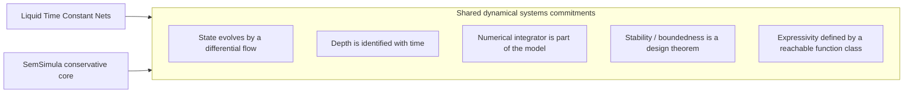
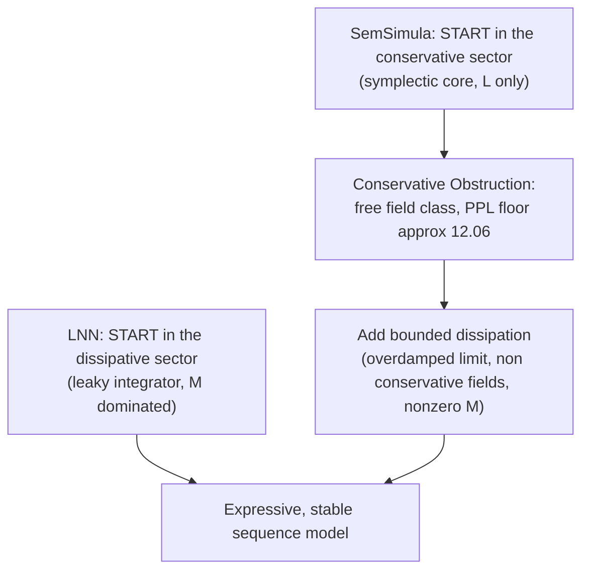
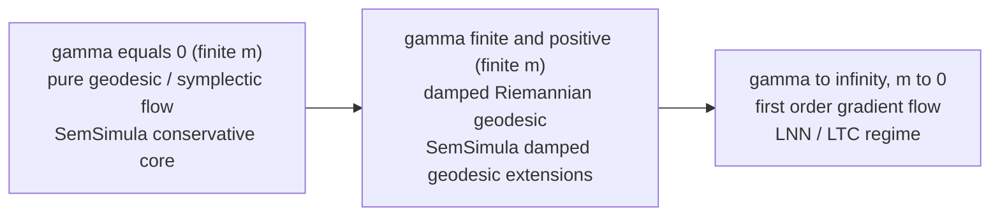
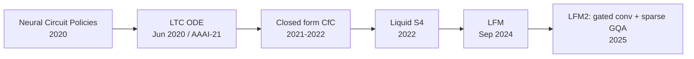
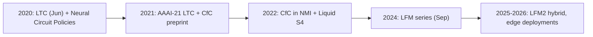

# Parallels and Lessons from Liquid Neural Networks

*Internal technical report — a structured comparison with the SemSimula / Fock‑PARFLM framework, and the takeaways from the Liquid Neural Network (LNN) research‑to‑product trajectory that bear on SemSimula's roadmap.*

**Date:** July 2026
**Author context:** SemSimula / Fock‑PARFLM independent research program

---

## 1. Executive summary

Liquid Neural Networks and SemSimula look like cousins: both reject the "static stack of matmuls" picture and treat computation as the evolution of a state under a differential flow, both come out of a dynamical‑systems tradition, and both make the numerical integrator a first‑class part of the model. Underneath that shared surface, however, the two frameworks sit at **opposite poles of a single axis** — the *conservation posture* of their dynamics.

- A Liquid Time‑Constant (LTC) neuron is a **dissipative relaxation** element. Its stability and expressivity come *from* leaking energy.
- The SemSimula core is a **conservative, symplectic** flow. Its Conservative Obstruction Theorem says that staying purely conservative confines the model to a weak (free‑field) function class with a hard perplexity floor.

The most useful single insight in this report is that both frameworks are best understood as special cases of one decomposition — the **metriplectic / GENERIC** split of a flow into a reversible (symplectic) sector and an irreversible (dissipative) sector. LNNs live in the irreversible sector; SemSimula's core lives in the reversible sector; and SemSimula's own overdamped / non‑conservative extensions are the act of *turning the irreversible sector back on*. In other words, the two programs are arriving at the same destination from opposite directions on the conservation axis, and the entire LTC literature is independent, externally‑motivated evidence for the lesson the Obstruction Theorem states from the top down: **conservation alone is not enough; controlled dissipation is where usable expressivity lives.** Section 5 sharpens this into geometry: an LNN is the *overdamped limit* in which a damped Riemannian geodesic loses its inertial and curvature content, so the genuinely metric-aware "dissipative geodesic" regime is one SemSimula occupies and the LNN lineage does not.

The remainder of the report formalizes this, then extracts concrete lessons from how the LNN program evolved from a pure ODE model (2020) into a shipped, hybrid, edge‑first architecture (2025–2026).

---

## 2. Background

### 2.1 Liquid Neural Networks — lineage and dates

| Milestone | Form | First public | Venue |
|---|---|---|---|
| Neural Circuit Policies | Auditable *C. elegans*‑wired controllers | 2020 | *Nature Machine Intelligence* |
| **Liquid Time‑Constant (LTC) networks** | Continuous‑time RNN, ODE with input‑dependent time constant | **8 Jun 2020** (arXiv:2006.04439) | **AAAI‑21**, 35(9):7657–7666 |
| Closed‑form Continuous‑time (CfC) | Closed‑form solution, removes the ODE solver | 2021 (arXiv:2106.13898) | *Nature Machine Intelligence* 4(11), 2022 |
| Liquid‑S4 | Liquid structural state‑space models | 2022 (arXiv:2209.12951) | — |
| Liquid Foundation Models (LFM) | Productized foundation models | Sep 2024 | Liquid AI |
| LFM2 | Hybrid: gated short convolutions + sparse GQA, hardware‑in‑the‑loop search | 2025 | LFM2 Technical Report |

The "present form" of the *idea* is the 2020 LTC model. The present form of the *product* is several architectural steps removed from it — a point we return to in Section 6.

The LTC state $\mathbf{x}(t) \in \mathbb{R}^{n}$ obeys

$$
\frac{d\mathbf{x}(t)}{dt} = -\left[\frac{1}{\tau} + f\left(\mathbf{x}(t),\mathbf{I}(t),\theta\right)\right]\mathbf{x}(t) + f\left(\mathbf{x}(t),\mathbf{I}(t),\theta\right) A,
$$

where $f$ is a bounded neural nonlinearity, $\mathbf{I}(t)$ the input, and $A$ a bias vector. The signature "liquid" property is that the **effective time constant is itself input‑modulated and provably bounded**:

$$
\tau_{\text{sys}} = \frac{\tau}{1 + \tau f(\mathbf{x},\mathbf{I},\theta)}, \qquad 0 \le \tau_{\text{sys}} \le \tau .
$$

The leading $-[\cdot]\mathbf{x}$ term is a **relaxation / damping** term: the state contracts toward input‑driven equilibria. This is what yields the bounded‑state stability theorems — and it is intrinsically **non‑conservative**.

### 2.2 SemSimula / Fock‑PARFLM — in brief

SemSimula casts language‑model inference as motion of a semantic state through a (possibly curved) manifold under classical‑ and quantum‑mechanical structure. Writing the state as canonical coordinates $(\mathbf{q},\mathbf{p})$ with Hamiltonian $H(\mathbf{q},\mathbf{p})$, the **conservative core** is the symplectic flow

$$
\dot{\mathbf{q}} = \frac{\partial H}{\partial \mathbf{p}}, \qquad
\dot{\mathbf{p}} = -\frac{\partial H}{\partial \mathbf{q}},
$$

integrated with an energy‑preserving **velocity‑Verlet** scheme (leapfrog):

$$
\mathbf{p}_{n+\frac{1}{2}} = \mathbf{p}_{n} - \frac{h}{2}\nabla_{q}V(\mathbf{q}_{n}), \quad
\mathbf{q}_{n+1} = \mathbf{q}_{n} + h M^{-1}\mathbf{p}_{n+\frac{1}{2}}, \quad
\mathbf{p}_{n+1} = \mathbf{p}_{n+\frac{1}{2}} - \frac{h}{2}\nabla_{q}V(\mathbf{q}_{n+1}).
$$

Additional structure layered on this core includes: a **Riemannian metric** with geodesic transport

$$
\ddot{q}^{k} + \Gamma^{k}_{ij}\dot{q}^{i}\dot{q}^{j} = 0,
$$

a **Fock / second‑quantized** treatment of semantic content (creation–annihilation operators, a $Q/K/V$‑structured creation protocol, and the partition function $G_{c}^{(4)}$), and **$\xi$‑routed conservative attention** with entropy/diversity routing metrics and Gumbel‑softmax gating. Boundedness assumptions **B1–B3** and a bounded Gaussian potential $V_{\theta}$ keep training from diverging.

The framework's reported results (TinyStories / OpenWebText scale) include Fock‑PARFLM v2.1 at roughly $9.30$ perplexity and Fock Attention at roughly $9.42$, against a **matched‑attention baseline of $7.81$**, with the **purely conservative (free‑field) class bounded below at a floor of $\approx 12.06$** perplexity.

---

## 3. A common substrate: computation as a differential flow

Strip both models to their skeleton and they express the same commitments.

Concretely:

1. **Trajectory, not composition.** The forward pass integrates a learned vector field. For LTCs the integrand is a leaky‑integrator ODE; for SemSimula it is a Hamiltonian (or geodesic) flow. Both make the choice of integrator a *modeling* decision with consequences: solver accuracy for LTCs, symplecticity for SemSimula.
2. **Stability as theory, not luck.** LTCs carry bounded‑state and bounded‑time‑constant theorems. SemSimula carries B1–B3 boundedness and the bounded $V_{\theta}$ fix. Both treat well‑posedness of the recurrence as the route to robustness *and* as the knob that defines the function class.
3. **A theory of the reachable set.** LTC theory asks what dynamics an input‑modulated time constant can approximate. SemSimula's Conservative Obstruction Theorem is the mirror statement: given a conservative constraint, the closure of expressible maps is exactly the free‑field class. Both are expressivity‑of‑a‑constrained‑flow results rather than generic universal‑approximation claims.
4. **Grey‑box mechanistic ambition.** Both import structure from a physical theory (biophysical leaky integrators vs. Lagrangian/Hamiltonian/Riemannian mechanics plus second quantization) and sell interpretability as a payoff of that structure.

---

## 4. The central divergence: the conservation axis

The parallels above hide a near‑exact inversion. **LTCs are dissipative by construction; SemSimula's core is conservative by construction.** The clean way to see both at once is the metriplectic / GENERIC decomposition (Grmela & Öttinger, 1997), which writes any admissible flow as a reversible plus an irreversible generator:

$$
\frac{d\mathbf{z}}{dt} = \underbrace{L(\mathbf{z})\nabla E(\mathbf{z})}_{\text{reversible (symplectic)}} + \underbrace{M(\mathbf{z})\nabla S(\mathbf{z})}_{\text{irreversible (dissipative)}},
$$

with $L$ antisymmetric (a Poisson/symplectic structure), $M$ symmetric positive‑semidefinite, and the degeneracy conditions

$$
L(\mathbf{z})\nabla S(\mathbf{z}) = 0, \qquad M(\mathbf{z})\nabla E(\mathbf{z}) = 0
$$

guaranteeing that the reversible part conserves energy while the irreversible part produces entropy. In this common language:

- **LTC $\approx$ pure $M$ sector.** A relaxation flow with a (near‑trivial) energy $E$ and dissipation doing the work.
- **SemSimula core $\approx$ pure $L$ sector.** A symplectic flow with $M \equiv 0$.
- **SemSimula extensions $=$ switching on $M$.** The overdamped limit, non‑conservative force fields, and damped Riemannian geodesics are precisely a nonzero $M(\mathbf{z})\nabla S(\mathbf{z})$ term added, deliberately and boundedly, to the symplectic core.

This diagram is the thesis of the report. The Obstruction Theorem and the LTC stability/expressivity theorems are **complementary halves of one statement**:

$$
\text{PPL}_{\text{conservative-only}} \ge \text{PPL}_{\text{floor}} \approx 12.06 \quad\text{(TinyStories)},
$$

i.e. a purely reversible model cannot reach the matched‑attention baseline of $7.81$; the gap must be paid for with irreversible (dissipative, entropy‑producing) structure. LTCs are the living demonstration that a *dissipative* element is enough to be both expressive and stable. SemSimula reaches the same conclusion analytically, from the opposite starting point.

---

## 5. The geometric picture: do LNNs preserve Riemannian geodesics?

Given that SemSimula carries an explicit Riemannian layer (geodesics, Christoffel symbols, the Jacobi metric) and that LNNs *do* introduce dissipation, the natural question is whether an LNN realizes a **dissipative Riemannian geodesic**. The answer is no — and the reason sharpens Section 4's conservation axis into a geometric one. A "dissipative geodesic" is a coherent object, but it is the *middle* of a friction dial, and an LTC sits at the far end where the geodesic content has already been integrated out.

### 5.1 An order mismatch makes "LNN geodesic" ill-typed

A geodesic is a **second-order** law on the tangent bundle $TM$ — state is position *and* velocity:

$$
\ddot{q}^{k} + \Gamma^{k}_{ij}\dot{q}^{i}\dot{q}^{j} = 0 .
$$

An LTC is **first-order** on a flat $\mathbb{R}^{n}$ — velocity is a *function* of position, with no independent velocity coordinate, no connection, and no metric:

$$
\dot{x} = -\Big[\tfrac{1}{\tau} + f(x,I,\theta)\Big]x + f(x,I,\theta) A .
$$

There is nothing to parallel-transport and no $\Gamma^{k}_{ij}$ to break, so there are no geodesics *in the formulation* to preserve. The whole lineage inherits this: CfC is a closed form of the same first-order ODE, and Liquid-S4 is a first-order state-space recurrence $\dot x = Ax + Bu$. No member of the family is second-order, so none carries geodesic structure.

### 5.2 What dissipation does to a genuine geodesic

The real content is what happens when you damp an actual second-order geodesic system. The effect depends entirely on the **direction** of the dissipative force.

**Purely tangential (Rayleigh) friction**, $-\gamma\dot{q}^{k}$, gives

$$
\ddot{q}^{k} + \Gamma^{k}_{ij}\dot{q}^{i}\dot{q}^{j} = -\gamma\dot{q}^{k}.
$$

Because the right-hand side is proportional to $\dot{q}^{k}$, the solution is a **pregeodesic**: its *image* is still a geodesic of $g$, only traversed with a non-affine, decelerating parametrization. This is the strict "dissipative geodesic" — a geodesic *path* whose *speed* bleeds off. Linear tangential friction removes energy without bending the path.

**Potential force or velocity-misaligned (anisotropic) damping**, e.g. $-g^{kl}\partial_l V$ or $-\gamma_{kl}\dot{q}^{l}$, is the generic case: the right-hand side is no longer parallel to $\dot{q}^{k}$, the curve is pushed *off* the geodesic, and it is not a geodesic of any fixed metric. This is also where the **Jacobi/Maupertuis** characterization dies. Conservative trajectories at fixed energy are geodesics of the Jacobi metric

$$
\tilde g = 2\big(E - V\big) g,
$$

but that equivalence *requires* energy conservation, so once $V_{\theta}$-dynamics dissipates $E$ there is no fixed conformal metric whose geodesics they are.

So a dissipative Riemannian geodesic exists **iff** the dissipation is purely tangential and no potential steers the flow — a narrow regime that neither LNNs nor SemSimula's $V_{\theta}$-driven dynamics occupy.

### 5.3 An LTC is the overdamped limit — geodesic structure discarded, not preserved

If one insists on reading a first-order relaxation flow geometrically, its honest home is the **overdamped (Smoluchowski) limit** of a damped Newtonian/geodesic system. Starting from

$$
m\big(\ddot{q}^{k} + \Gamma^{k}_{ij}\dot{q}^{i}\dot{q}^{j}\big) = -\gamma\dot{q}^{k} - g^{kl}\partial_l V,
$$

and sending $m \to 0$ (equivalently $\gamma \to \infty$) collapses the entire inertial block — the acceleration **and** the Christoffel term — leaving a first-order Riemannian gradient flow:

$$
\dot{q}^{k} = -\frac{1}{\gamma} g^{kl}\partial_l V = -\frac{1}{\gamma}\big(\nabla_{g} V\big)^{k}.
$$

That is the geometric character of an LTC: an input-modulated, first-order, gradient-like relaxation. (Caveat: a general LTC drift is not even a clean metric gradient — its Jacobian is not symmetric, so it also carries a rotational, non-gradient component.) In this reduction the geodesic/inertial structure is **thrown away**, not preserved. The LNN sits at the $\gamma \to \infty$ end of the very friction dial whose $\gamma = 0$ end is SemSimula's conservative symplectic core.

### 5.4 Synthesis: one friction dial, three regimes

| Friction / inertia | Object | Order | Who lives here |
|---|---|---|---|
| $\gamma = 0$, finite $m$ | Pure geodesic / symplectic flow (energy conserved) | 2nd | SemSimula conservative core — free-field, PPL-floor regime |
| $0 < \gamma < \infty$, finite $m$ | **Damped Riemannian geodesic** (inertial + dissipative) | 2nd | SemSimula damped-geodesic / non-conservative extensions |
| $\gamma \to \infty$, $m \to 0$ | First-order Riemannian gradient flow | 1st | LNN / LTC regime |

The dissipative Riemannian geodesic is the **middle row**, and SemSimula already instantiates it — that is exactly what the damped-geodesic module and the overdamped-limit analysis are. LNNs give the **bottom row**: the limit in which inertia and Christoffel curvature have already been integrated out. Stated as a converse, to make an LNN "preserve geodesics" one would have to lift it back to second order on $TM$, equip it with a metric and connection, and restrict the damping to be purely tangential — at which point it is no longer an LTC but essentially SemSimula's damped-geodesic block with $\gamma$ turned down from infinity. **The two frameworks meet precisely where the friction dial is finite, and that meeting point belongs to SemSimula, not to the LNN lineage.**

---

## 6. Structural differences beyond conservation

| Aspect | Liquid Neural Nets | SemSimula / Fock‑PARFLM |
|---|---|---|
| Conservation posture | Dissipative relaxation (irreversible sector) | Conservative symplectic core; dissipation added deliberately |
| Integration variable | **Data‑time** — real, possibly irregular signal time | **Inference‑time** — endogenous flow parameter of the mechanics |
| Locus of adaptivity | Input‑dependent time constant $\tau_{\text{sys}}$ | $\xi$‑routing + conservative/non‑conservative field selection |
| State space | Flat Euclidean $\mathbb{R}^{n}$ | Curved Riemannian manifold ($\Gamma^{k}_{ij}$, geodesics, Jacobi metric) |
| Many‑body structure | First‑quantized ODE on one state vector | Second‑quantized Fock space, $G_{c}^{(4)}$, creation protocol |
| Reference mechanism | Replaced recurrence (LSTM/GRU); later re‑admitted a little attention | Re‑derives *attention* conservatively (Fock / $\xi$‑routed) |
| Maturity | Productized (1B–40B, MoE, edge deployments) | Research framework at TinyStories / OpenWebText scale |

Three of these deserve emphasis. The **integration variable** differs in *meaning*, not just notation: LTCs flow along the data's own time axis, whereas SemSimula flows along an internal computational time. The **Fock and Riemannian layers** are one‑directional imports — LTCs have no analog of second quantization or learned curvature. And the **reference mechanism** is inverted: SemSimula starts *from* attention and tries to make it conservative, whereas LNNs spent years avoiding attention and then re‑admitted a few grouped‑query‑attention (GQA) blocks in LFM2 for purely pragmatic reasons.

---

## 7. Lessons from the LNN trajectory

The LNN program is a five‑year natural experiment in taking an elegant continuous‑dynamics idea to production. Its arc carries several transferable lessons.

**Lesson 1 — The pure ODE ideal did not survive scaling; plan for that.**
The version conceptually closest to SemSimula (a pure LTC ODE) is *not* what ships. Under scaling pressure the program went ODE → closed‑form (CfC, to kill the solver) → structural state space (Liquid‑S4) → gated short convolutions plus sparse attention (LFM2). Symplectic Verlet integration is SemSimula's analog of the expensive solver. Expect the same pressure, and treat "how do I keep the energy structure while dropping per‑step integration cost" as a first‑class research question rather than an afterthought.

**Lesson 2 — Find a closed‑form (or amortized) conservative flow.**
CfC was the move that made LNNs practical: an analytic approximation to the ODE solution that removes the integrator from the hot path while retaining the continuous‑time semantics. The SemSimula analog is a **closed‑form conservative propagator** — an amortized map that reproduces the Verlet trajectory's energy behavior without stepping it. This is likely the single highest‑leverage bridge between the $\approx 9.30$‑PPL research artifact and anything that scales past OpenWebText.

**Lesson 3 — Dissipation is the expressivity budget; spend it deliberately.**
Section 4 makes this precise. Do not treat the non‑conservative sector as a reluctant patch on a conservative model; treat the $M(\mathbf{z})\nabla S(\mathbf{z})$ term as the *controlled* mechanism that buys the gap from the $12.06$ floor down toward $7.81$. LTCs show that a well‑posed dissipative element is simultaneously the source of stability and of expressivity — these are not in tension.

**Lesson 4 — Hybridize without shame.**
LFM2's headline design is a *minimal hybrid*: mostly cheap structured operators, a small number of global‑context attention blocks. The transferable pattern for SemSimula is a stack that is **mostly conservative‑Fock blocks with a few standard (GQA) blocks** to inject exactly the irreversible, long‑range mixing the Obstruction Theorem says the conservative core cannot provide. This is a cheap, testable way to break the free‑field floor while keeping most of the physically‑structured machinery.

**Lesson 5 — Cheap first steps compound.**
The identified near‑free output‑bias fix for the output‑head long‑tail constraint is exactly the kind of low‑cost, high‑yield step that the LNN program repeatedly exploited (bounded nonlinearities, solver swaps). Land the near‑free fixes before the architectural ones; they change the baseline that later experiments are measured against.

**Lesson 6 — Choose the competitive axis on purpose.**
Liquid AI never competed on scale; it competed on the **efficiency / on‑device** axis and built its funding and partnerships (edge deployments, latency‑critical commerce and enterprise use cases) around that single differentiator. SemSimula's natural axis is **not** efficiency and **not** raw scale — it is *interpretability and physical guarantees* (energy structure, conservation laws, mechanistic transparency). Picking that axis explicitly should shape both the benchmark suite and the publication / positioning narrative, rather than inviting a head‑to‑head PPL race against matched transformers that the framework is not yet built to win.

**Lesson 7 — Keep the matched baseline in every table.**
Every LFM release was reported against a size‑matched transformer. SemSimula's matched‑attention $7.81$ baseline should stay in the foreground of every result; the story is the *shape* of the gap and what closes it, not any single perplexity number in isolation.

---

## 8. Recommendations

1. **Write the metriplectic bridge as a standalone result.** Position the Conservative Obstruction Theorem explicitly against the LTC bounded‑state / expressivity theorems as complementary statements within the GENERIC framework. This is a clean, citable contribution that stands on its own and gives the megapaper an external anchor.
2. **Prototype a closed‑form conservative propagator** (the CfC analog) and measure it against stepped Verlet on the OpenWebText run — cost and energy‑drift as the two axes.
3. **Run the minimal‑hybrid experiment**: conservative‑Fock stack with $k \in \{1,2\}$ interleaved GQA blocks; report PPL vs. $k$ to quantify how cheaply the $12.06$ floor is broken.
4. **Land the near‑free output‑bias fix first**, then re‑baseline all subsequent ablations against the corrected number.
5. **Fix the competitive axis to interpretability / physical guarantees** in the abstract and benchmark design; stop implicitly competing on the efficiency and scale axes that LNNs and mainstream transformers respectively own.
6. **Foreground the damped-geodesic regime as a geometric differentiator.** The finite-$\gamma$, second-order damped Riemannian geodesic (Section 5) is structure the entire LNN lineage integrates out in its overdamped limit; make it explicit in the architecture description and ablations, since it is metric-aware inertial behavior no LTC / CfC / Liquid-S4 model retains.

---

## 9. At‑a‑glance timeline

---

## 10. Related notes

- [Closed-Form and Hybrid Integration Strategies for Fock-PARFLM](Closed_Form_and_Hybrid_Integration_Strategies_for_Fock-PARFLM.md) --- develops Lessons 1 and 2 of this report into three concrete propagator strategies (harmonic cache, blended CfC propagator, Strang splitting) with PyTorch pseudocode, error bounds, and an implementation roadmap.

---

## 11. References

1. R. Hasani, M. Lechner, A. Amini, D. Rus, R. Grosu. *Liquid Time‑constant Networks.* AAAI 2021, 35(9):7657–7666. arXiv:2006.04439 (Jun 2020).
2. M. Lechner, R. Hasani, et al. *Neural Circuit Policies Enabling Auditable Autonomy.* Nature Machine Intelligence, 2020.
3. R. Hasani, M. Lechner, A. Amini, L. Liebenwein, et al. *Closed‑form Continuous‑time Neural Networks.* Nature Machine Intelligence 4(11):992–1003, 2022. arXiv:2106.13898.
4. R. Hasani, M. Lechner, T.‑H. Wang, M. Chahine, A. Amini, D. Rus. *Liquid Structural State‑Space Models.* arXiv:2209.12951, 2022.
5. Liquid AI. *Liquid Foundation Models* (LFM series), 2024; *LFM2 Technical Report*, 2025 (arXiv:2511.23404).
6. M. Grmela, H. C. Öttinger. *Dynamics and thermodynamics of complex fluids. I & II: Development of a general formalism (GENERIC).* Phys. Rev. E 56, 6620 & 6633, 1997.
7. SemSimula / Fock‑PARFLM framework. Zenodo DOI: 10.5281/zenodo.19712427 (CC‑BY‑4.0).

---

*Prepared as an internal comparison note. Empirical figures attributed to SemSimula are as reported within that framework's own experiments; LNN figures and dates are from the cited primary sources.*
