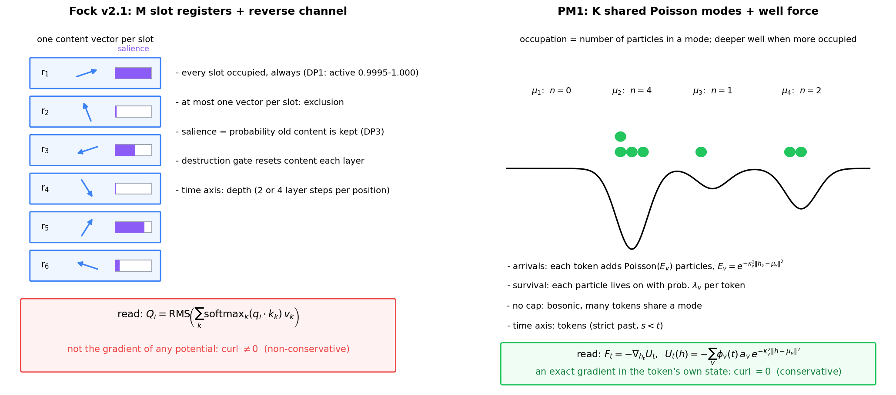
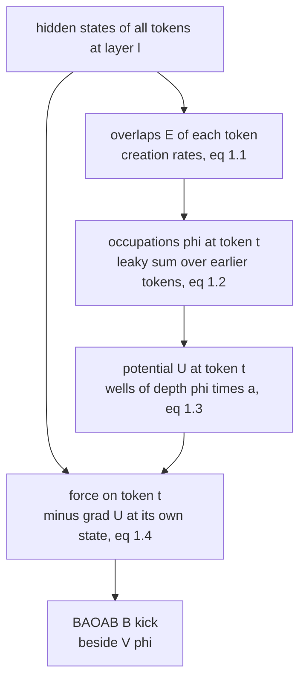
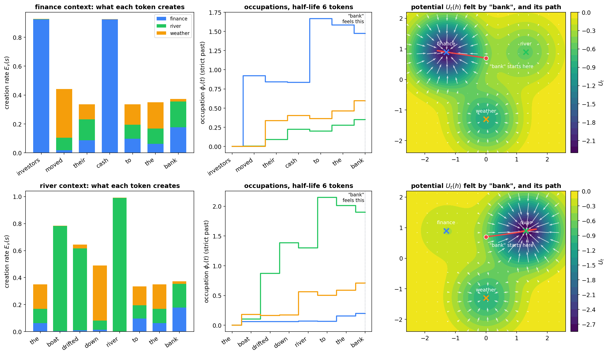
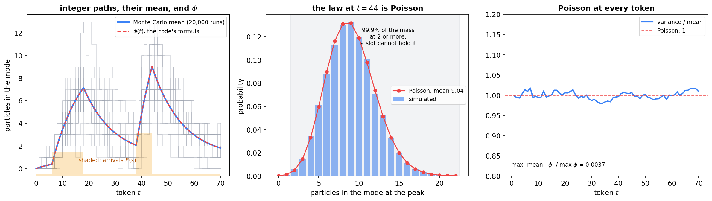
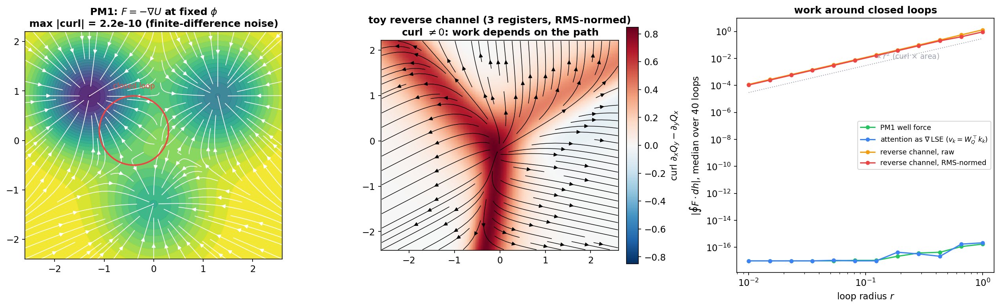
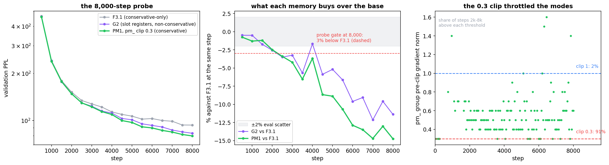

# Poisson-Mode Registers (PM1)

**A bosonic memory for Fock-PARFLM whose occupations are exact Poisson means and whose force is a gradient**

Companion note to [*Doi–Peliti Dynamics of Semantic Particles and Registers*](Doi_Peliti_Dynamics_of_Semantic_Particles_and_Registers.md) (the DP note), whose §7 motivates this mechanism and whose §9 summarises it, and to [*The Single-Particle Hilbert Space in the Semantic Simulation Framework*](Single_Particle_Hilbert_Space_in_Semantic_Simulation.md), which supplies the mode overlaps. The pre-registration, predictions and scores are in protocol §5.15 ([`Depth_Ladder_and_Matched_Baseline_Protocol.md`](Depth_Ladder_and_Matched_Baseline_Protocol.md)). The code is `poisson_mode_occupation` and `poisson_mode_force` in [`model_parf_multixi.py`](../notebooks/conservative_arch/parf/model_parf_multixi.py). Figures: [`figures/_make_poisson_mode_figs.py`](figures/_make_poisson_mode_figs.py).

**Status, 2026-10-06.** The 8,000-step probe at pm_ clip 0.3 reached 79.78 PPL, 14.7% below its conservative base F3.1 and 3.8% below G2, the slot-register model, at the same step (§6). A matched probe at clip 1.0 is running; the full 32,500-step run follows on whichever clip wins at step 8,000.

---

## Contents

0. [Why a different register mechanism](#0-why-a-different-register-mechanism)
1. [The mechanism](#1-the-mechanism)
2. [A worked example: one token, two contexts](#2-a-worked-example-one-token-two-contexts)
3. [The occupation is exactly a Poisson mean](#3-the-occupation-is-exactly-a-poisson-mean)
4. [Why the step stays conservative](#4-why-the-step-stays-conservative)
5. [How PM1 differs from the Fock v2.1 slot registers](#5-how-pm1-differs-from-the-fock-v21-slot-registers)
6. [Results so far](#6-results-so-far)
7. [Open questions](#7-open-questions)

---

## 0. Why a different register mechanism

Three findings set the requirements.

1. **The slot registers are exclusion objects** (DP note §7). In every trained Fock model, all M = 32 registers are active at every layer and position (DP1: 0.9995–1.000). Each slot holds one content vector, slots do not share content (DP2), and salience is the probability that old content is kept, not an intensity (DP3: Spearman between salience and own force −0.41 to 0.0). The book's bosonic, Poisson-mean reading of v2 (book §10.5.2, claims 1–3 of the DP note §0) describes the architecture's capacity, not any trained model.
2. **The slot registers' read side is the one non-conservative path.** The reverse channel turns register content into a force $Q_i$ that is not the gradient of anything. On the Gen 2 no-exchange model it is 1.6–3 times the conservative step at every token (book §37.6, property (C)). Removing it (F3.1, `REVERSE_CHANNEL = False`) gives a conservative model, at a perplexity cost: 57.76 settled against G2's 53.12.
3. **The design principle** (protocol §5.19). Conservative models must be conservative and refinement-ready.

So the question PM1 answers is: **can the conservative line have a memory, and one that is bosonic in the literal Doi–Peliti sense?** That requires three things, each forced by the DP note's §2–§4:

| requirement | why | what PM1 does |
|---|---|---|
| shared modes, not slots | bosons can multiply occupy a mode; a slot cannot (DP note §2.2) | K = 64 prototypes shared by all tokens |
| an occupation that is an unbounded Poisson mean | so that the occupation *is* the Doi field (DP note §4.3) | an immigration–death mean over token time, (1.3) |
| a coupling linear in the occupation | so that carrying the mean is exact | well depths proportional to occupation, (1.4) |
| a force that is a gradient | property (C) | the force is minus the gradient of (1.3) at fixed occupation, §4 |

---

## 1. The mechanism

**Figure 1.** Left: the Fock v2.1 slot bank. Every slot holds one content vector and is always occupied; salience is a retention probability; the reverse channel reads the slots through a softmax and an RMS normalisation, and the result is not a gradient. Right: PM1. Each mode $\mu_v$ holds an occupation, the expected number of particles in it; the mode's well deepens with occupation; the token feels the gradient of the summed wells.

### 1.1 Definitions

The model has $K$ mode prototypes $\mu_v \in \mathbb{R}^d$, each with a width $\kappa_v$ and a per-token survival probability $\lambda_v$, and per-layer well depths $a_{l,v}$. For hidden states $h_1, \dots, h_T$ at layer $l$:

**Creation rate.** Token $s$ creates particles in mode $v$ at its overlap with the mode, the single-particle note's overlap identity:

$$
E_v(s) = e^{-\kappa_v^2\lVert h_s - \mu_v\rVert^2}. \qquad (1.1)
$$

**Survival.** Each particle survives from one token to the next with probability $\lambda_v$, so its half-life is $\ln 2 / \ln(1/\lambda_v)$ tokens.

**Occupation.** The occupation felt at token $t$ uses the strict past only:

$$
\phi_v(t) = \sum_{s \lt t}\lambda_v^{t-1-s}E_v(s), \qquad \text{equivalently} \qquad \phi_v(t+1) = \lambda_v\phi_v(t) + E_v(t), \quad \phi_v(1) = 0. \qquad (1.2)
$$

**Potential and force.** The token at $t$ feels a sum of Gaussian wells whose depths are the occupations times learned per-layer depths:

$$
U_t(h) = -\sum_{v=1}^{K}\phi_v(t) a_{l,v} e^{-\kappa_v^2\lVert h - \mu_v\rVert^2}, \qquad F_t = -\nabla_h U_t\big|_{h = h_t}. \qquad (1.3)
$$

Written out, with the per-mode weights

$$
w_v = 2\kappa_v^2 \phi_v(t) a_{l,v} e^{-\kappa_v^2\lVert h_t - \mu_v\rVert^2},
$$

the force is (1.4):

$$
F_t = -\sum_v w_v (h_t - \mu_v) = -\Big(\sum_v w_v\Big)h_t + \sum_v w_v \mu_v. \qquad (1.4)
$$

This is line for line what `poisson_mode_force` computes (`w = phi * E * (2 k2 a)`; `f = -(w.sum(-1) * h - w @ mu)`).

### 1.2 Parameters, initialisation and placement

| parameter | shape | initialisation | role |
|---|---|---|---|
| `pm_mu` | K × d | standard normal, so ‖μ‖ ≈ √d, the LayerNorm scale | mode centres |
| `pm_log_kappa2` | K | set with the widths | log of the squared width κ² |
| `pm_logit_lambda` | K | half-lives log-spaced from 4 to 128 tokens | survival λ = sigmoid of this logit |
| `pm_depth` | L × K | **0** | well depth per layer and mode |

At K = 64, d = 384, L = 2 that is 24,832 parameters, against about 77M in the model. Because the depths start at zero, **the force is exactly zero at step 0** and a model with the modes on is bit-identical to one without them until training moves the depths (verified). The modes have their own clip group, `pm_` (§6.2).

**Where it enters the step.** The force is added to the conservative pair force as a plain kick, beside V_φ, in the B half-steps of the BAOAB scheme (`_layer_forces`). It does not enter the closed-form low-rank part of the integrator, which handles V_θ's stiff modes. Like V_φ it is recomputed at every force evaluation from that evaluation's hidden states.

**Cost.** The implementation forms the (K, T, T) decay kernel and contracts it with $E$, which is $O(KT^2)$ per evaluation. The recursion in (1.2) would make it an $O(KT)$ scan; that is an optimisation, not a change of model.

---

## 2. A worked example: one token, two contexts

Take a two-dimensional toy space with three modes, *finance*, *river* and *weather*, equal widths, equal depths, and a half-life of 6 tokens. Two sentences end in the same ambiguous token, *bank*, placed at the same point, equidistant from the finance and river modes. Only the context differs.

**Figure 2.** Top row, *investors moved their cash to the bank*; bottom row, *the boat drifted down river to the bank*.
- **Left:** what each token creates, (1.1). Content words load one mode; function words spread a little over all three.
- **Centre:** the occupations, (1.2). They rise at each content word and decay between them. The value at the last position is what *bank* feels; it excludes *bank*'s own contribution, by the strict past.
- **Right:** the potential (1.3) at *bank*, the force field (arrows), and *bank*'s damped trajectory from its starting point. In the finance context the finance well is deepest and *bank* falls into it; in the river context the same token, at the same starting point, falls into the river well.

Three points follow from the example.
- **Disambiguation is a potential, not a lookup.** The context does not choose a reading by attention weights. It reshapes the landscape, and the token's own dynamics settle the reading. This is the framework's picture of meaning, implemented in the memory.
- **Repetition counts.** Two finance words make the finance occupation about twice one; the slot registers have no such count (DP1).
- **Forgetting is per mode.** A mode with a long half-life keeps a topic across a paragraph; a short one tracks the last few tokens. The 64 trained modes start with half-lives spread from 4 to 128 tokens.

---

## 3. The occupation is exactly a Poisson mean

### 3.1 The token-time process

Let $n_v(t)$ be the number of particles in mode $v$ when token $t$ is read. Between tokens, each particle survives independently with probability $\lambda_v$, and token $t$ then adds a Poisson number of new particles with mean $E_v(t)$:

$$
n_v(t+1) = \mathrm{Binomial}\big(n_v(t), \lambda_v\big) + \mathrm{Poisson}\big(E_v(t)\big), \qquad n_v(1) = 0. \qquad (3.1)
$$

**Claim.** $n_v(t)$ is exactly Poisson with mean $\phi_v(t)$ of (1.2), for every $t$.

*Proof by generating functions.* Let $G_t(z) = \mathbb{E}[z^{n(t)}]$. Thinning with survival $\lambda$ maps $G(z) \mapsto G(1 - \lambda + \lambda z)$, and adding an independent Poisson($E$) multiplies by $e^{E(z-1)}$. A Poisson law with mean $\phi$ has $G(z) = e^{\phi(z-1)}$, and

$$
e^{\phi(1 - \lambda + \lambda z - 1)} e^{E(z-1)} = e^{(\lambda\phi + E)(z-1)}, \qquad (3.2)
$$

which is Poisson with mean $\lambda\phi + E$: the recursion (1.2). Starting from $n = 0$, a Poisson law with mean 0, induction gives the claim. ∎

### 3.2 The same statement in Doi–Peliti form

In the DP note's notation, with $\lvert P\rangle = \sum_n P(n)(a^\dagger)^n\lvert 0\rangle$, survival is the decay Liouvillian of DP note Table 1.3 run for the time that gives survival $\lambda$, and arrival is the creation Liouvillian run for unit time at rate $E$. One token is therefore the operator

$$
\lvert P_{t+1}\rangle = e^{E(t)(a^\dagger - 1)} e^{(\ln\lambda)(a^\dagger - 1)a} \lvert P_t\rangle. \qquad (3.3)
$$

On the Doi–Peliti coherent state $\lvert\phi\rangle = e^{\phi(a^\dagger - 1)}\lvert 0\rangle$, which is the Poisson law with mean $\phi$ (single-particle note §7), the second factor gives $\lvert\lambda\phi\rangle$ and the first multiplies by $e^{E(a^\dagger-1)}$, so

$$
\lvert\phi\rangle \mapsto \lvert\lambda\phi + E\rangle. \qquad (3.4)
$$

**Coherent states map to coherent states, and the label follows the rate equation.** This is the DP note's §4.2 statement, that mean-field theory is the Hamiltonian flow on the invariant line $\tilde\phi = 1$, in discrete token time, with no approximation: for creation and decay the noise correlator $B$ of DP note (4.4) vanishes, so the Doi field is deterministic and equals the occupation. All three claims of the DP note §0 then hold literally for PM1:
- the coherent states are the Poisson laws of the occupations;
- the occupation $\phi_v(t)$ *is* the Doi field, and a Poisson mean;
- its update is the rate equation on the invariant line.

### 3.3 Why carrying only the mean is exact

The potential (1.3) is linear in the occupation. For any distribution of $n$, $\mathbb{E}[U(h; n)] = U(h; \mathbb{E}n) = U(h; \phi)$, and likewise for the force. So the deterministic model that carries $\phi$ computes exactly the expected force of the stochastic particle system (3.1).

**Figure 3.** One mode with half-life 8 tokens under two bursts of arrivals (shaded). Left: 25 of 20,000 simulated integer paths of (3.1); their mean and the code's $\phi$ coincide (largest gap 0.4% of the peak). Centre: at the peak the simulated law is the Poisson law with mean 9.04, and almost all of its mass is at two or more particles, which a slot cannot hold. Right: the variance equals the mean at every token, the Poisson signature. The implementation's own check (`debug/verify_pm_switch.py`, check 4) gives the same result on F3.1's trained states: largest gap 0.46%, median variance over mean 1.001.

### 3.4 What is bosonic about PM1, and what is not

- **Bosonic:** the structure. Modes are shared, occupation has no cap, and the occupation is an exact immigration–death mean. The DP note's three claims hold literally.
- **Not consequential:** the fluctuations. Because the coupling is linear (§3.3), the model never sees $n$, only $\phi$. No measurement on PM1 can distinguish its Poisson statistics from any other law with the same mean. A variant that samples $n \sim \mathrm{Poisson}(\phi)$ in training would make them consequential (§7).

---

## 4. Why the step stays conservative

### 4.1 Statement

**Proposition.** At every force evaluation, with the hidden states of all other tokens held at their current values, the PM1 force on token $t$ is the gradient of a scalar function of $h_t$:

$$
F_t(h_t) = -\nabla_{h_t}U_t(h_t), \qquad U_t \text{ as in (1.3), with } \phi(t) \text{ fixed}. \qquad (4.1)
$$

Consequently its Jacobian with respect to $h_t$ is symmetric, its curl vanishes, and its work along any closed path in $h_t$ is zero.

### 4.2 Proof

**Step 1: the occupation does not depend on $h_t$.** By (1.2), $\phi_v(t)$ is a function of $h_1, \dots, h_{t-1}$ only. The sum stops at $s = t-1$, and the code enforces it with the strict mask `lag >= 0` on $t - 1 - s$. So in (1.3) the coefficients

$$
c_v = \phi_v(t) a_{l,v}
$$

are constants with respect to $h_t$.

**Step 2: (1.4) is the gradient.** With $c_v$ constant,

$$
\nabla_h\Big(-\sum_v c_v e^{-\kappa_v^2\lVert h - \mu_v\rVert^2}\Big) = \sum_v 2\kappa_v^2 c_v e^{-\kappa_v^2\lVert h - \mu_v\rVert^2}(h - \mu_v), \qquad (4.2)
$$

whose negative is (1.4). Numerically, the implemented force equals $-\nabla U$ at fixed $\phi$ to a relative error of $2.4\times10^{-7}$ on F3.1's trained states (verification check 3).

**Step 3: the Jacobian is a Hessian.** Differentiating (1.4),

$$
J_t = \frac{\partial F_t}{\partial h_t} = -\sum_v 2\kappa_v^2 c_v e^{-\kappa_v^2\lVert h_t - \mu_v\rVert^2}\Big(I - 2\kappa_v^2 (h_t - \mu_v)(h_t - \mu_v)^\top\Big) = -\nabla^2 U_t, \qquad (4.3)
$$

a sum of symmetric matrices. So $J_t = J_t^\top$.

**Step 4: zero curl, path independence.** In every coordinate plane $(i, j)$ the curl component vanishes:

$$
\partial_i F_j - \partial_j F_i = (J_t)_{ji} - (J_t)_{ij} = 0.
$$

By Stokes' theorem the work around any closed loop $\gamma$ in $h_t$-space vanishes, $\oint_\gamma F_t\cdot dh = 0$, and the work between two points is $U_t(a) - U_t(b)$, independent of the path. ∎

The proof uses nothing about the sign of the depths, the widths or the number of modes. Attractive ($a \gt 0$) and repulsive ($a \lt 0$) wells are equally conservative.

### 4.3 Energy and dissipation

Let the token have mass $m_t$ and velocity $v_t$, and write $V(h)$ for the rest of the conservative potential, V_θ plus V_φ at fixed sources. Define the per-token energy

$$
\mathcal{E}_t = \tfrac12 m_t\lVert v_t\rVert^2 + V(h_t) + U_t(h_t). \qquad (4.4)
$$

In the continuous-time dynamics of one layer, with the sources and occupations held fixed,

$$
m_t\dot{v}_t = -\nabla V - \nabla U_t - \gamma m_t v_t,
$$

the energy changes only by friction:

$$
\frac{d\mathcal{E}_t}{d\tau} = v_t\cdot\big(m_t\dot{v}_t + \nabla V + \nabla U_t\big) = -\gamma m_t\lVert v_t\rVert^2 \le 0. \qquad (4.5)
$$

**All change in energy is friction.** Adding PM1 changes the landscape but adds no source or sink of energy. In the discrete scheme, the PM1 force enters only the B kicks, so the B–A–B part of the step is the velocity-Verlet splitting of a gradient force, the same treatment V_φ receives, and the O step applies the friction. This is property (C): the layer step is a damped geodesic step of the potential $V + U_t$, up to the LayerNorm projection that every arm shares.

### 4.4 Two qualifications, both shared with F3.1

**(a) Conservative per token, not one energy for the whole sequence.** Token $t$'s wells depend on earlier tokens through $\phi(t)$; earlier tokens feel nothing from token $t$. For $s \lt t$,

$$
\frac{\partial F_t}{\partial h_s} \ne 0, \qquad \frac{\partial F_s}{\partial h_t} = 0, \qquad (4.6)
$$

so the joint Jacobian over all tokens is block-triangular, not symmetric, and the joint force is not the gradient of any total potential. This is causality, and V_φ has exactly the same structure in F3.1: causal pair forces that are a gradient in each token's own state and one-way between tokens (DP note §5.3). The book's property (C) is the per-token statement, and both models satisfy it.

**(b) The potential is non-autonomous.** Across a forward pass, $U_t$ changes for two reasons: the depths $a_{l,v}$ differ by layer, and the occupation is recomputed at each layer from that layer's states of the earlier tokens. Energy (4.4) therefore changes across layers by $\partial U_t/\partial\tau$ even without friction. V_θ is already layer-dependent through the depth code, and V_φ's sources move from layer to layer, so this too is shared with F3.1. Within each force evaluation the field is conservative; across evaluations it is a conservative field that changes in time ([*Addendum: Non-Autonomous Fields*](Addendum_Non_Autonomous_Fields_For_Appendix_A.md)).

**What the loss gradient does is a separate matter.** In training, the loss reaches earlier tokens through $\phi$, which makes PM1 a Gen 3 (live-gradient) mechanism. That is backpropagation through the computation, not a force in the forward dynamics, and it does not affect (4.1).

### 4.5 The contrast: why the reverse channel is not conservative

The v2.1 reverse channel computes, for token $i$ and registers $k$ with content $r_k$ (`ReverseChannel`, `model_fock_parf_v2.py`),

$$
Q_i = \sum_k \alpha_k(h_i) v_k, \qquad \alpha = \mathrm{softmax}\Big(\frac{K q_i}{\sqrt{d_k}}\Big), \qquad q_i = W_Q h_i, \quad K_{k\cdot} = (W_K r_k)^\top, \quad v_k = W_V r_k, \qquad (4.7)
$$

followed in the stabilised form by a soft RMS normalisation and a learned per-layer gate. Hold the register content fixed. The Jacobian of (4.7) is

$$
\frac{\partial Q_i}{\partial h_i} = \frac{1}{\sqrt{d_k}} V^\top\big(\mathrm{diag}(\alpha) - \alpha\alpha^\top\big)K W_Q, \qquad (4.8)
$$

where $V$ stacks the $v_k^\top$. **This matrix is not symmetric in general**, because $V$, $K$ and $W_Q$ come from three independent learned maps. Its antisymmetric part gives a non-zero curl, and the work around a closed loop is non-zero.

**When would it be a gradient?** Tie the values to the queries and keys, each value being the key mapped back through the query map:

$$
v_k = W_Q^\top K_{k\cdot}^\top.
$$

Then (4.8) becomes a symmetric matrix, and the readout is the gradient of a log-sum-exp:

$$
\frac{\partial Q_i}{\partial h_i} = \frac{1}{\sqrt{d_k}} W_Q^\top K^\top\big(\mathrm{diag}(\alpha) - \alpha\alpha^\top\big)K W_Q, \qquad Q_i = \nabla_{h_i}\Big(\sqrt{d_k} \mathrm{LSE}\big(K W_Q h_i/\sqrt{d_k}\big)\Big).
$$

This is attention as the gradient of an energy. That is the structure of the book's `attention_potential` exchange field. The reverse channel has independent values and an output normalisation, and both break it.

**Figure 4.** A two-dimensional toy with three PM1 modes and a three-register reverse channel with random weights.
- **Left:** PM1's force field over its potential. The largest finite-difference curl on the grid is $2\times10^{-10}$, which is the step size's noise.
- **Centre:** the reverse channel (RMS-normalised), coloured by its curl, which is of order one.
- **Right:** the work around circles of radius $r$, median over 40 random centres. PM1 and tied-value attention sit at machine precision, about $10^{-16}$, at every radius. The reverse channel, raw or normalised, grows as $r^2$, the curl times the enclosed area.

---

## 5. How PM1 differs from the Fock v2.1 slot registers

| | Fock v2.1 slot registers (G2) | PM1 Poisson modes |
|---|---|---|
| **state** | M = 32 content vectors in ℝᵈ, one per slot, plus a salience per slot | K = 64 scalar occupations per position |
| **time axis** | depth: updated at each layer, per position (prefix-causal) | tokens: a leaky sum over the strict past, recomputed at each layer |
| **creation** | a QKV attention readout from the prefix refills a slot's content | each token adds its overlap E (1.1) to every mode |
| **removal** | a per-layer destruction gate resets content; salience decays by 0.5 per layer | each particle survives a token with probability λ (half-lives 4–128 tokens) |
| **statistics** | exclusion: at most one vector per slot (DP note §2.1) | bosonic: shared modes, no cap (§3) |
| **number dynamics** | none in practice: all slots active (DP1) | the occupation tracks the context, and repetition raises it |
| **meaning of the scalar** | salience = probability old content is kept (DP3) | occupation = expected particle count, the Doi field |
| **read side** | reverse channel Q (4.7): softmax over slots, RMS-normalised | well force, minus the gradient of U (1.3) |
| **conservative step (C)** | no: curl ≠ 0, (4.8) | yes: (4.1)–(4.3) |
| **what reaches the token** | content vectors, through a learned value map | only the landscape: where the wells are and how deep |
| **parameters** | creation gate, destruction gates, register embeddings, reverse channel | 24,832 at K = 64 |
| **refinement (Gate 3)** | G2 +1,274% | to be measured (RR-PM1, RR-PM2) |
| **at step 8,000** | 82.92 | **79.78** (clip 0.3) |

**One structural consequence worth naming.** The slot registers pass *content* to the token: the reverse channel hands it a learned mixture of register vectors, which can point anywhere. PM1 passes only *geometry*: it can pull a token toward places in semantic space that the context has populated, and nothing else. That is a narrower channel, and the probe says it is enough to beat the slot registers at matched steps on this corpus.

**And one about refinement.** H-RR (protocol §5.18) attributes the Fock arms' refinement failure to register state that is reset and rewritten at each layer. PM1's occupation is accumulated over tokens and does not depend on the layer index at all; refining the layer step changes how often its force is applied, not its state. If H-RR is right, PM1 should refine like its base, F3.1 (RR-PM1), and nowhere near the Fock arms (RR-PM2).

---

## 6. Results so far

### 6.1 The 8,000-step probe at clip 0.3

**Figure 5.** Left: validation perplexity of the three runs, same seed, data order and schedule. Centre: G2 and PM1 against F3.1 at the same step; the grey band is the ±2% eval scatter, the dashed line the probe gate. Right: the pm_ group's pre-clip gradient norm on the logged steps where it was the largest group.

| step | **PM1** | F3.1 | PM1 vs F3.1 | G2 | PM1 vs G2 |
| ---: | ---: | ---: | ---: | ---: | ---: |
| 3,000 | 122.34 | 127.73 | −4.2% | 123.59 | −1.0% |
| 5,000 | 97.23 | 106.71 | −8.9% | 101.17 | −3.9% |
| 6,000 | 89.73 | 103.00 | −12.9% | 93.11 | −3.6% |
| 8,000 | **79.78** | 93.57 | **−14.7%** | 82.92 | **−3.8%** |

- **The perplexity gate passed** (90.8 or lower at step 8,000) by 11 PPL. PM1 is below G2 at every eval from step 3,000 on.
- **Not capacity:** 24,832 added parameters in about 77M.
- **SCAF clean** at step 5,000 (leak tax −3.8×10⁻⁵ nats). No spike or watchdog event.
- **Stiffness:** ω·Δt median 3.00 at step 8,000, against F3.1's 4.00 and G2's 2.34.

### 6.2 The clip throttle

The pm_ group was clipped at 0.3, a value copied from the other gates. Its pre-clip norm was steady (median 0.5, p95 0.9, maximum 1.6) and above 0.3 on 91% of logged steps after step 2,000, so the modes trained at a capped effective learning rate for most of the probe. There was no instability. A matched probe at clip 1.0, which the same statistics put at 2% of steps, is running under a pre-registered rule (protocol §5.15): at step 8,000, 81.4 or lower continues clip 1.0 to 32,500; above that, the 0.3 arm continues from its checkpoint.

### 6.3 Still to be measured

All pre-registered in protocol §5.15 before the relevant run:
- the settled perplexity against F3.1 and G2;
- causality, in flight and by the independent check;
- the repetition test: does a mode's occupation track the decay-weighted count of earlier occurrences of the same token;
- the signs of the trained depths: attractive or repulsive wells;
- the DP3 rerun on the modes, the counterpart of the measurement that falsified the Poisson reading of the slots;
- refinement readiness, Gate 3 of 6b-7 (RR-PM1, RR-PM2).

---

## 7. Open questions

1. **A replay of conservativity on trained weights.** §4 is a proof and a build-time check. For F3.1 the same property was confirmed on the trained model by the 6b-9 replay (Gate 0 bit-exact). The replay must include the PM1 force in its conservative arm before it can do the same for PM1.
2. **Sampled occupations.** Drawing $n \sim \mathrm{Poisson}(\phi)$ in training, with a straight-through or score-function gradient, would make the bosonic fluctuations consequential and is the only test of the statistics themselves (§3.4).
3. **What the modes learn.** Do the 64 modes align with recognisable topics, and do the half-lives separate into short and long memory? The trained $\mu_v$ and $\lambda_v$ answer this offline.
4. **PM1 on the SR2 base.** If the exact damped flow (protocol §5.19, Test 2) fixes F3.1's refinement, PM1 on that base (`pm64_sr2`) is the candidate conservative, refinement-ready model with memory.
5. **Depth.** PM1 at L = 4 against the L = 4 Fock model (50.10) is the next rung if the full run holds.
6. **The book.** Protocol §5.15's decision rule sets the edits to Remark 61 and §10.5.2. If the full run beats F3.1 by at least 1%, the book can state that the bosonic Doi–Peliti v2 is trainable, honours the three claims literally, and keeps the step conservative.

**References.** M. Doi, Second quantization representation for classical many-particle system, J. Phys. A 9 (1976). L. Peliti, Path integral approach to birth-death processes on a lattice, J. Physique 46 (1985). U. C. Täuber, M. Howard and B. P. Vollmayr-Lee, Applications of field-theoretic renormalization group methods to reaction-diffusion problems, J. Phys. A 38 (2005). For thinning and superposition of Poisson laws, any text on point processes, e.g. J. F. C. Kingman, *Poisson Processes* (Oxford, 1993).
