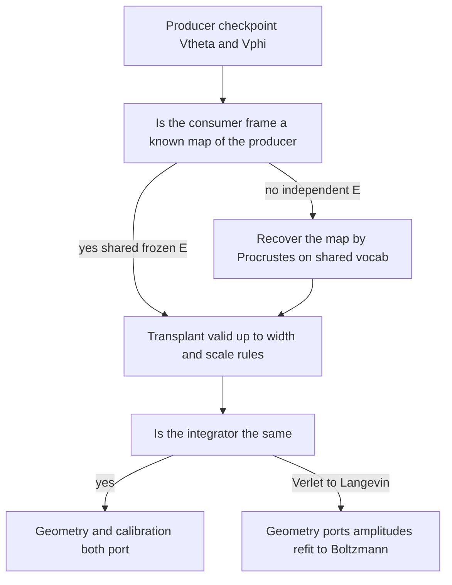
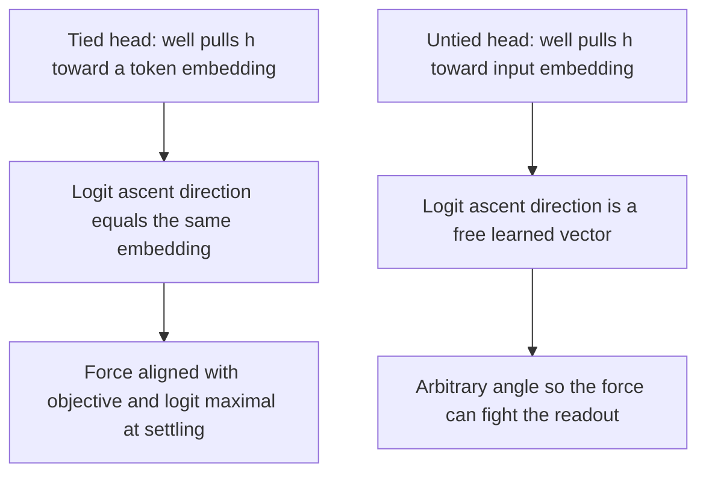
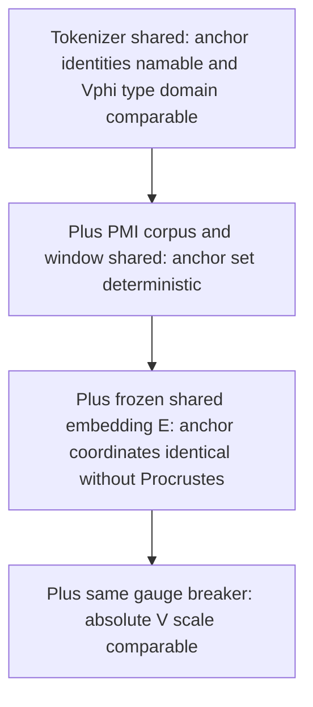
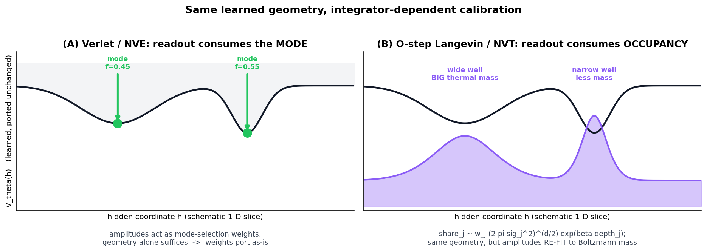
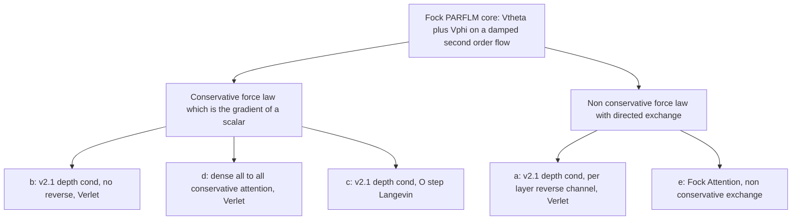
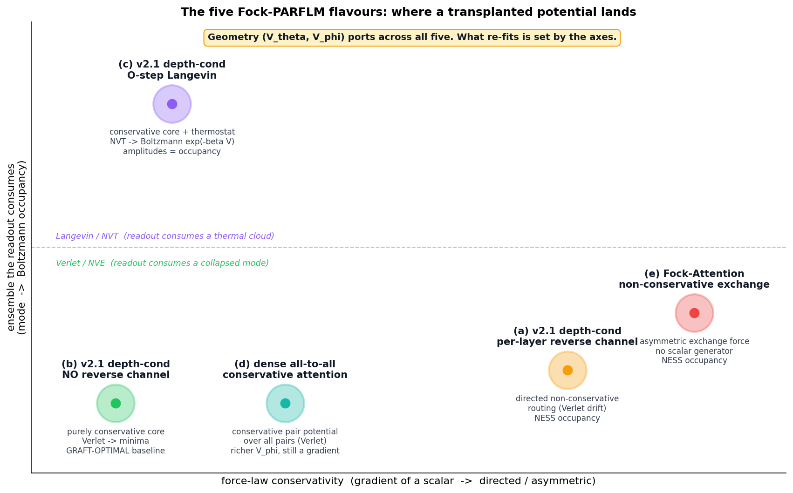
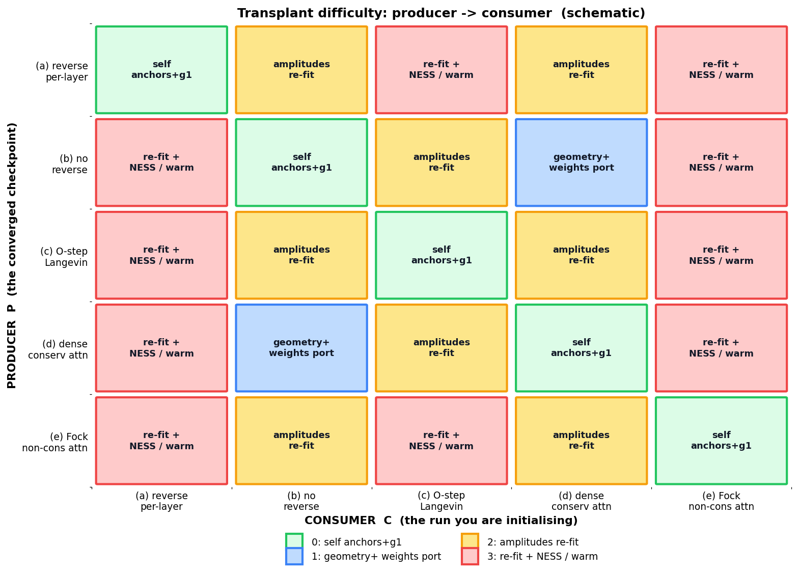
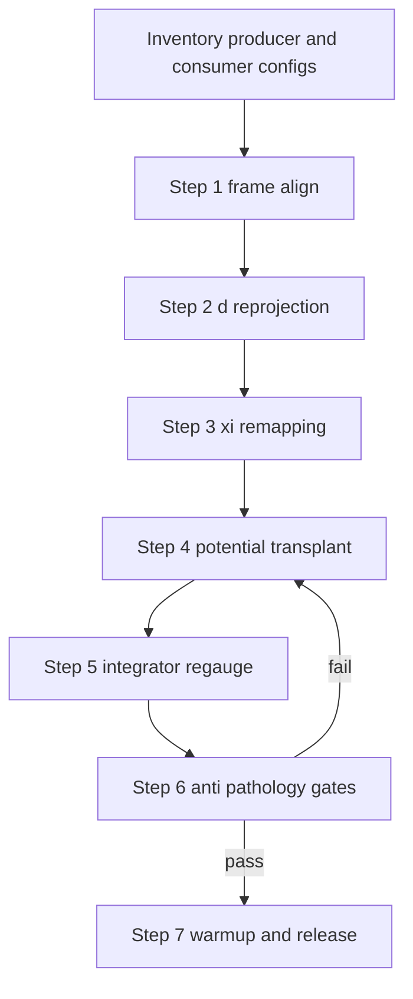
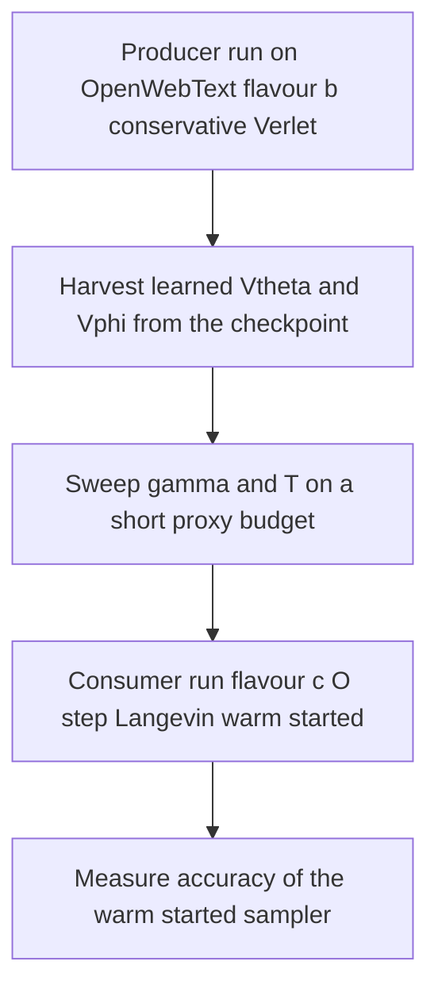

# Portable Learned Potentials: A Transplant Framework for Learned Scalar and Pair Potentials across Fock-PARFLM Flavours

**Technical Report**

Subject: cross-run grafting ("potential harvesting") of learned scalar and pair potentials $V_\theta, V_\phi$ in the SemSimula / Fock-PARFLM framework — portability axes, frame coherence, structured-potential variants, integrator dependence (Velocity-Verlet vs. O-step Langevin), and a concrete transplant procedure, specialised to the five concrete Fock-PARFLM implementations we train on OpenWebText.

This report merges and supersedes two working notes: a theory note on portable potentials and a concrete transplant map. The new material is the treatment of the five Fock mechanism flavours (§10), the cross-flavour compatibility matrix (§11), and the OpenWebText harvest-and-transplant playbook (§16).

---

## Contents

1. [Motivation and scope](#1-motivation-and-scope)
2. [The two potentials and their dynamical role](#2-the-two-potentials-and-their-dynamical-role)
3. [Portability axes: what a transplanted potential depends on](#3-portability-axes-what-a-transplanted-potential-depends-on)
4. [Frame coherence: why tied embeddings are load-bearing](#4-frame-coherence-why-tied-embeddings-are-load-bearing)
5. [Structured variants: anchored vs. free-centre wells](#5-structured-variants-anchored-vs-free-centre-wells)
6. [The confinement question: pure Gaussian vs. hybrid quadratic](#6-the-confinement-question-pure-gaussian-vs-hybrid-quadratic)
7. [Tokenizer sharing and the frame bundle](#7-tokenizer-sharing-and-the-frame-bundle)
8. [Grafting pathologies: the moving target and the init scale](#8-grafting-pathologies-the-moving-target-and-the-init-scale)
9. [Integrator dependence: Verlet (NVE) vs. O-step Langevin (NVT)](#9-integrator-dependence-verlet-nve-vs-o-step-langevin-nvt)
10. [The five Fock-PARFLM flavours](#10-the-five-fock-parflm-flavours)
11. [Cross-flavour transplant: the compatibility matrix](#11-cross-flavour-transplant-the-compatibility-matrix)
12. [The transplant map: procedure](#12-the-transplant-map-procedure)
13. [Anti-pathology gates](#13-anti-pathology-gates)
14. [What ports vs. what re-fits](#14-what-ports-vs-what-re-fits)
15. [Fast paths](#15-fast-paths)
16. [OpenWebText playbook: harvest, sweep, transplant](#16-openwebtext-playbook-harvest-sweep-transplant)
17. [Summary and recommendations](#17-summary-and-recommendations)
18. [Related notes and references](#18-related-notes-and-references)

---

## 1. Motivation and scope

A converged run leaves behind two learned potentials — a single-particle scalar potential $V_\theta$ and a pair potential $V_\phi$ — that are not merely weights minimising cross-entropy but physical potentials governing dynamics in semantic space. Reusing that terrain as a structured, bounded initialisation for a subsequent run is **potential harvesting**: the machine-learned-interatomic-potential programme (Behler–Parrinello, GAP, NequIP, MACE) transposed to semantics, and the direct analogue of AlphaFold's "never fold from scratch" conditioning on evolutionary and template priors (see `Lessons_from_AlphaFold.md`).

The operation recurs throughout the programme: warm-starting the equation-of-motion simulator for RL calibration (`Semantic_Simulator_RL_Calibration_Programme.md`), scaling a configuration up, or migrating from a deterministic to a thermostatted integrator (`Langevin_dynamics_reformulation_of_classical_damped_Lagrangian_flow.md`). Each instance is the same transplant applied under a different configuration change. This report formalises when the transplant is valid, which pathologies it can trigger, and how the answer depends on which of the five Fock flavours the producer and consumer are.

The central organising claim is:

> A learned potential is a geometric object defined over a hidden-state coordinate frame. A transplant is meaningful only insofar as the consumer's frame is a known map of the producer's frame; and its **calibration** to good perplexity depends on whether the consumer integrates the potential as a **minimiser** (Verlet) or a **sampler** (Langevin), and on whether the consumer's force law is **conservative** or carries a **directed non-conservative** component.

Three words summarise the operating rule and recur throughout:

> **Geometry ports. Amplitudes re-fit. Frame must be aligned first, always.**

---

## 2. The two potentials and their dynamical role

### 2.1 The scalar potential $V_\theta$

The single-particle scalar potential is a bounded mixture of Gaussian wells over the hidden state $h \in \mathbb{R}^d$, conditioned on a $K$-channel exponential-moving-average context vector $\xi$ (design in `Structured_VTheta_Design_and_Theory.md`):

$$
V_\theta(\xi, h) = -\sum_{k=1}^{K} w_k(\xi) \exp\Big(-\frac{\lVert h - \mu_k(\xi)\rVert_G^2}{2\sigma_k^2}\Big),
\qquad
w_k(\xi) = \mathrm{softmax}_k(W_w \xi),
$$

where $\lVert \cdot \rVert_G$ is the norm of the induced Riemannian metric. The restoring force is the negative gradient,

$$
-\nabla_h V_\theta = \sum_{k} w_k(\xi) \exp\Big(-\frac{\lVert h-\mu_k\rVert^2}{2\sigma_k^2}\Big)\frac{\mu_k - h}{\sigma_k^2},
$$

a pull from $h$ toward each active centre $\mu_k$, weighted by that well's responsibility.

### 2.2 The pair potential $V_\phi$

The pair potential is an interaction kernel between the current particle and an earlier one, in the factored central-force form (design in `Structured_VPhi_Design_and_Theory.md`):

$$
V_\phi(h_t, h_s) = -\frac{\Theta_\phi(l_t, l_s) \Phi_\phi\big(\tfrac12(l_t+l_s)\big)}{\sqrt{\lVert h_t - h_s\rVert^2 + \varepsilon^2}},
\qquad l = W_l h,
$$

with a bounded value-aligner $\Theta_\phi$, a Gaussian type-gate $\Phi_\phi$ living in the low-rank type-space $l$, and a Plummer-softened $1/r$ radial kernel. Crucially, the knowledge in $V_\phi$ lives in **type-space** $l = W_l h$, not in raw $h$-space.

### 2.3 Dynamical role and readout

The layer update integrates a damped second-order equation of motion. In the STP-linearised form (see `Semantic_Simulator_EOM.md`),

$$
h_{\ell+1} - h_\ell \approx \alpha_\ell v_\ell - \beta_\ell \nabla_h V(h_\ell),
\qquad
\alpha_\ell = \frac{\Delta t}{1+\gamma},
\qquad
\beta_\ell = \frac{\Delta t^2}{(1+\gamma) m_\ell},
$$

so the damping $\gamma$ is baked into the update coefficients under a deterministic integrator. The next-token law is a linear readout of the final hidden state through the token embedding:

$$
p(v \mid h_L) \propto \exp\big(\beta \langle e_v, h_L\rangle\big),
$$

where $\beta$ is the softmax inverse-temperature. This coupling of $\beta$ to the readout is the hinge of the integrator discussion in §9.

---

## 3. Portability axes: what a transplanted potential depends on

Both $V_\theta(\xi, h)$ and $V_\phi(h_t, h_s)$ are defined over the hidden frame $\Sigma$. A transplant from producer $P$ to consumer $C$ therefore inherits a dependence on every quantity that fixes that frame. Four axes decide whether an artefact ports:

| Axis | What it controls | Robust or fragile |
|------|------------------|-------------------|
| Gauge / basis | absolute scale and orientation of Σ | fragile: requires matched gauge-breaker |
| Dimension d | shape of h, μ_k, projection matrices | fragile: requires re-projection |
| ξ structure (K, decay rates) | context-channel semantics | robust: decay rates near-invariant |
| Tokenizer / vocabulary | anchor identities, type-space landmarks | necessary precondition |

The decay-rate stability is worth isolating: learned rates cluster near `[0.11, 0.55, 0.81, 0.97]` across architectures (see `Multi-Channel_vs_Single_Channel_Xi_SPLM_Design.md`), so a channel's **meaning** is stable and matchable by decay value, not by index. The absolute scale, by contrast, is only defined up to an additive constant — $V$ and $V + \text{const}$ generate identical forces — so the gauge must be fixed identically on both sides (§4, §6).

---

## 4. Frame coherence: why tied embeddings are load-bearing

### 4.1 The coherence identity

Weight-tying sets the output projection equal to the input embedding, $W_{\text{out}} = E$. Consider an anchored well centred at $a_j = E[v_j]$. The dynamics pull $h$ toward $a_j$; the readout scores token $v_j$ by

$$
\ell_{v_j} = \langle W_{\text{out}}[v_j], h_L\rangle,
\qquad
\nabla_{h_L} \ell_{v_j} = W_{\text{out}}[v_j].
$$

Under tying, $W_{\text{out}}[v_j] = E[v_j] = a_j$, so the direction that raises the logit for $v_j$ is exactly the direction the well pulls. At settling, $h_L \approx a_j$, hence $\ell_{v_j} = \langle a_j, a_j\rangle = \lVert a_j\rVert^2$, the maximal attainable logit. The attractor **is** the readout target: the geometry of the potential and the geometry of the readout are the same geometry.

### 4.2 The untied-head decoupling

Untie the head and $W_{\text{out}}[v_j]$ becomes a free, independently learned vector. The well still pulls $h$ toward $a_j = E_{\text{in}}[v_j]$, so at settling $h_L \approx E_{\text{in}}[v_j]$ and $\ell_{v_j} = \langle W_{\text{out}}[v_j], E_{\text{in}}[v_j]\rangle$, an inner product between two unrelated vectors. There is no reason it is large; it can be small, zero, or negative. The precise detrimental effect is a **decoupling of the attractor gradient from the readout gradient**: settling into well $j$ no longer implies predicting token $v_j$. Three consequences cascade.

1. **Loss of anchor justification.** The PMI-peak anchor construction places wells at the informationally extremal corners of the embedding space $E_{\text{in}}$. With a free head, the task gradient references $W_{\text{out}}$-space, so the constellation no longer tiles the space the trajectories are scored in.
2. **The force fights the readout.** When the angle between $a_j$ and $W_{\text{out}}[v_j]$ is obtuse, the conservative pull toward the anchor lowers the correct logit. Potential and objective work at cross-purposes.
3. **The burden falls on the rest of the network.** Because the anchors are frozen, they cannot yield to accommodate the free head; the corrective transform $E_{\text{in}} \to W_{\text{out}}$ is pushed onto earlier layers and the metric — re-creating, by the back door, the projection that freezing the centres was meant to eliminate.

**Consequence for grafting.** A shared or frozen input embedding is **not sufficient**: the consumer head must be tied to that same $E$, or the grafted mixing weights $w_j(\xi)$ and widths $\sigma_j$ are calibrated to a coherence that no longer holds and are wrong from step 0.

There is an important subtlety here specific to our recent OpenWebText runs. The production Fock configuration deliberately runs with an **untied** head plus a unigram output bias (`TIE_EMBEDDINGS=False`, `USE_OUTPUT_BIAS=True`; see `Xi_Bottleneck_Diagnosis_Phase5.md`), because untying is a legitimate **post-dynamics** long-tail remediation — it acts after the integration and lifts the copy floor on rare tokens. Untying therefore does not harm a from-scratch run. It does, however, forfeit the anchored-transplant premise: if you intend to **harvest** anchored wells and graft them into a consumer, either tie the consumer head to the shared $E$ for the graft, or insert an explicit learned $E_{\text{in}} \to W_{\text{out}}$ alignment, or re-anchor the wells to $W_{\text{out}}$ instead of $E$ (gate 2, §13).

---

## 5. Structured variants: anchored vs. free-centre wells

Two concrete realisations sit at opposite ends of an expressivity–interpretability trade.

### 5.1 Anchored wells (frozen centres)

$$
a_j = E[v_j],
\qquad
\lbrace a_j\rbrace = \lbrace E[v] : v \in \text{top-}N_S\ \text{PMI}_{\text{peak}}\rbrace,
\qquad
\text{PMI}_{\text{peak}}(v) = \max_{u \neq v}\log\frac{p(u,v)}{p(u) p(v)}.
$$

The centres are frozen at PMI-extremal token embeddings; the model learns only per-anchor widths $\sigma_j$ and context weights $w_j(\xi)$. Because the centres are a deterministic function of the shared embedding, they need not be transplanted as coordinates at all — they are **recomputed** in the consumer's own frame. The anchor-placement recipe is in `SARF_Anchor_Placement_From_Converged_Gaussian_Centres.md`.

### 5.2 Free-optimised centres

$$
\mu_k(\xi) = W_\mu \xi + b_\mu,
\qquad
a_k(\xi)\ \text{capped at}\ a_{\max} = \frac{2}{d},
$$

where the centres are a linear readout of context, so each token in each context produces its own attractor set. This is the more expressive variant — learned centres can track a shifting hidden-state distribution — but the centres are now outputs of a projection, not free parameters, which is the source of the instability analysed in §8.

The two differ sharply on graftability, and the difference is exactly the frozen-vs-dynamic distinction, summarised here and justified in §8.

| Property | Anchored (frozen) | Free-optimised |
|----------|-------------------|----------------|
| What ports | σ_j, w_j; anchors recomputed | W_μ, b_μ, W_w re-projected |
| Coordinate transplant | none needed | required (re-projection) |
| d-change cost | free (a_j = E_C of v_j) | re-embed or latent bridge |
| Feedback loop | broken (centres fixed) | live (see §8) |
| Stability under graft | high | fragile without warmup |
| Reshaping DOF | σ_j, w_j only | full centre mobility |

Our production V_theta is the **multi-context, depth-conditioned** Gaussian bank — a shared free-centre bank per xi-channel with a small per-layer depth code added to $\xi$ before the projections (`Structured_VTheta_Design_and_Theory.md`). It is a free-centre variant and therefore falls under the §8 cautions when grafted with the centres released.

---

## 6. The confinement question: pure Gaussian vs. hybrid quadratic

### 6.1 The escape problem

A bounded Gaussian well has a non-monotone force that peaks at $r = \sigma_k$ and decays exponentially. Beyond the **escape radius**

$$
r_{\text{esc}} = \sigma_k\sqrt{2\ln 100} \approx 3.03\sigma_k,
$$

the restoring force is below 1% of its peak, and a hidden state that drifts past all well radii moves inertially. This is the fundamental trade-off: the log-sum-exp form has global attraction but is unstable, while isolated bounded wells are stable but lack global attraction.

### 6.2 Two cures, and why the quadratic one conflicts with the framework

A natural fix for drift is a global quadratic confiner, $V_\theta \to V_\theta + \tfrac12\kappa\lVert h - c\rVert^2$. But this reintroduces $V(\infty) = \infty$, and the framework's bounded-potential theory explicitly rules out harmonic potentials as global descriptions because a bound state requires $V(\infty) \lt \infty$, i.e. the potential must saturate.

The framework's own cure preserves boundedness: **semantic-anchor coverage**. Choosing the anchors at PMI-extremal tokens makes them span the semantic range, so no trajectory can be far from all of them at once. Formally, with constellation radius $R = \max_j \lVert a_j\rVert$ and minimum inter-anchor distance $\delta = \min_{j\neq k}\lVert a_j - a_k\rVert$, the pigeonhole principle on the anchor Voronoi cells gives

$$
\lVert h\rVert \le R \implies \min_j \lVert h - a_j\rVert \le \delta,
$$

so choosing $\sigma_j \ge \delta/2$ places every interior point within some well's force radius — recovering global attraction without unboundedness.

### 6.3 Impact on grafting

Let $A$ denote the pure Gaussian mixture and $B$ the hybrid with a quadratic confiner.

**$A$ is graft-optimal.** Each well is self-contained; the only coupling is the softmax over weights. Spawning or transplanting well $K{+}1$ is parameter-non-interfering,

$$
\frac{\partial(\mu_k, \sigma_k)}{\partial(\text{spawn of } K{+}1)} = 0 \quad \forall k \le K,
$$

and the responsibility perturbation on existing wells is bounded by the new well's own responsibility, with total-variation shift over the old wells equal to $w_{K+1}(\xi)$ — small wherever the new well is inactive.

**$B$ impacts grafting in three ways.** (i) The confiner adds shared, frame-dependent state: $c$ is a coordinate in $\Sigma$ (needs the same alignment as well centres) and $\kappa$ is a scale tied to the hidden-state norm regime. (ii) Keep the confiner outside the softmax or the responsibility bound above no longer applies verbatim. (iii) The confiner is not depth-preserving for distant wells: the minimum of a Gaussian well plus a quadratic bowl is displaced from $\mu_k$ toward $c$, and shallow wells far from $c$ are washed out.

**Recommendation.** If the goal is anti-drift confinement, prefer anchor coverage (§6.2) or a **wide saturating background well** — a single low-amplitude, large-$\sigma$ Gaussian — over a harmonic term. A background Gaussian gives a gentle global restoring pull, stays bounded, and is just another well, so it inherits the clean grafting formalism directly.

---

## 7. Tokenizer sharing and the frame bundle

"Share the tokenizer" means reusing the exact serialised tokenizer artefact so that token identity, ids, and segmentation are bit-identical — not merely a same-size BPE, which would produce different merges and hence different ids. Sharing the tokenizer is **necessary but not sufficient** for a coordinate-level transplant; there is a hierarchy of increasingly strong conditions:

The key non-obviousness: two independently trained **tied** embeddings still differ by an orthogonal transform on the $\sqrt{d}$ shell, so sharing the tokenizer does not by itself give identical anchor coordinates. The clean packaging is therefore to ship a **frame bundle** — tokenizer artefact, frozen embedding $E$, anchor id-list (if anchored), and the type-projection $W_l$ for $V_\phi$ — versioned together and loaded wholesale. Persist the anchor id-list as part of the artefact: recomputing PMI on a different corpus silently changes the anchor **set**, not just its coordinates.

One cost to check: the consumer inherits the producer's vocabulary. Across corpora of differing character a corpus-specific tokenizer may over-segment consumer text — trading tokenization efficiency for graftability. A broadly trained byte-level BPE (as GPT-2's) minimises this, which is why all our OpenWebText runs share the GPT-2 tokenizer.

---

## 8. Grafting pathologies: the moving target and the init scale

### 8.1 The free-centre moving-target instability

For free-optimised centres, $\mu_k(\xi) = W_\mu \xi + b_\mu$ are context readouts, and $\xi$ is an EMA of (detached) hidden states. This closes a forward feedback loop:

In the producer this loop converged to a self-consistent fixed point: the wells sit where the trajectories go, and the trajectories go where the wells pull. The grafted parameters encode that fixed point. At consumer step 0 the rest of the network is not at the producer's fixed point, so the hidden-state distribution entering $V_\theta$ is displaced. Letting the centres evolve then fails for three compounding reasons.

**(a) Timescale collapse.** The grafted structure is useful only if it is the slow variable that the fast variables equilibrate against. Evolving $W_\mu$ at the same learning rate as everything else collapses the timescale separation: the centre readout chases a distribution that is itself reshaped by the centre readout's own updates — the two-timescale failure familiar from actor–critic and target-network stability.

**(b) Myopic gradient.** Because $\xi$ is detached, gradients do not flow back through the EMA, but the forward dynamical coupling remains live. The optimiser therefore updates $W_\mu$ on a gradient that ignores how moving the centres will move future trajectories through $\xi$.

**(c) Adiabaticity violation.** The framework admits an effectively autonomous (single-potential) description only in the adiabatic regime

$$
\frac{\lVert \partial_\ell V\rVert}{\lVert \nabla^2 V \dot h\rVert} \ll 1,
$$

i.e. the potential must drift slowly relative to hidden-state relaxation. Fast-drifting centres push the system out of this regime; large, noisy early-training gradients can wash out the grafted basin structure before the rest of the network adapts to exploit it.

**Why the anchored variant is immune.** Freezing the centres breaks the loop above: attractors do not move, only $w_j(\xi)$ and $\sigma_j$ adapt, and the trajectories re-converge toward a fixed constellation — a well-posed stationary target. The robustness and the graftability are the same fact.

**Mitigations for the free-centre case.** (1) Staged unfreezing: freeze $(W_\mu, b_\mu)$ for a warmup (run as temporarily anchored), adapt $\sigma$, $w(\xi)$, and the network to the fixed constellation, then release the centres at reduced learning rate. (2) Per-group learning-rate multiplier on the centre readout ($0.1$ to $0.3\times$). (3) Warm-start the rest of the consumer toward the producer. (4) Monitor the adiabaticity ratio; release centres only when it is small and stable.

### 8.2 The initialisation-scale pathology

Independently of centre mobility, a transplant can fail at initialisation. An unregularised or badly scaled scalar potential produces large output magnitudes; under an $L_2$ gauge-breaking penalty $\lambda_V \lVert V_\theta\rVert_2^2$, a large initial $\lVert V_\theta\rVert$ drives a large gradient correction that destabilises the next-token loss. Empirically, a freshly initialised MLP $V_\theta$ averages $\lVert V_\theta\rVert_2 \approx 581$ versus $\lVert V_\theta\rVert_2 \in [1.9, 8.8]$ for structured variants (see `Training_Instabilities_in_Fock-PARFLM_with_structured_V_theta.md`), and the large-output arm diverges while the structured arms exhibit clean monotone descent. Structured wells ship with $V_\theta$ near zero at initialisation by parameterisation, not by hyperparameter — which is precisely what makes them graft-safe. The operational consequence is a mandatory **init-scale gate** (§13, gate 1).

---

## 9. Integrator dependence: Verlet (NVE) vs. O-step Langevin (NVT)

### 9.1 Minimiser vs. sampler

Velocity-Verlet is the symplectic integrator for microcanonical (NVE), energy-conserving dynamics: it conserves a shadow Hamiltonian and **collapses trajectories onto attractors** rather than sampling the ensemble around them — consistent with the observation that a purely conservative core plateaus above the matched-attention baseline. But the object the readout consumes is a distribution, $p(v \mid x_L) \propto \exp(\beta \langle e_v, x_L\rangle)$, so the natural target is the canonical (NVT) stationary density of an underdamped-Langevin flow,

$$
\dot x = m^{-1}p,
\qquad
\dot p = -\nabla_x V(\xi,x) - \gamma p + \sigma \eta(t),
\qquad
\rho_\infty(x,p) \propto \exp\Big[-\beta\big(\tfrac12 p^\top m^{-1} p + V(\xi,x)\big)\Big],
$$

whose configurational marginal $\rho_x \propto \exp(-\beta V)$ is exactly what the readout reads out. The concrete lever is the exact Ornstein–Uhlenbeck substep (the "O" step of BAOAB) inserted around the force step,

$$
p \leftarrow e^{-\gamma \Delta t} p + \sqrt{\frac{1 - e^{-2\gamma \Delta t}}{\beta}} m^{1/2} R,
\qquad R \sim \mathcal{N}(0, I),
$$

with noise and friction coupled through the fluctuation–dissipation relation $\sigma^2 = 2\gamma/\beta$. The full derivation and the Fock-PARFLM retrofit are in `Langevin_dynamics_reformulation_of_classical_damped_Lagrangian_flow.md`; the BAOAB-with-STP forward contraction is in `Modified_BAOAB_with_STP_identity_Detailed_Analysis.md`.

### 9.2 What the switch changes for grafting

The O-step makes the dynamics consistent with a temperature the readout already assumed. Consequently:

- **$\beta$ and $(\gamma, \sigma)$ become matched-state parameters.** A grafted well's occupancy, not just its location, is what the readout consumes. Under Langevin a basin's share is

$$
\text{share}_j \propto w_j (2\pi\sigma_j^2)^{d/2} \exp(\beta \cdot \text{depth}_j),
$$

so a checkpoint fitted under one $\beta$ behaves differently under another. This is a principled axis — $\beta$ is the readout temperature — not an arbitrary knob.

- **The width $\sigma_j$ gains readout significance.** Under Verlet the trajectory collapses to $\mu_j$ largely regardless of $\sigma_j$; under Langevin, $\sigma_j$ sets the thermal cloud width $\sim \sqrt{1/(\beta\kappa_j)}$ and therefore co-determines the output distribution's sharpness.

- **The free-centre instability is ameliorated.** The O-step noise supplies the stochastic-approximation averaging a two-timescale loop needs, and $\gamma$ becomes an explicit relaxation-rate knob ($\tau_{\text{relax}} \sim 1/\gamma$). A **high-$\gamma$ warmup** re-equilibrates the ensemble fast so it snaps onto the grafted constellation — a principled, integrator-level version of the §8.1 slow-centre mitigation. Guardrail: do not drive $\gamma \to \infty$; only the damped second-order regime preserves the Riemannian/Jacobi structure the coverage argument depends on (`The_Overdamped_Limit_and_The_Position_of_The_2nd_Order_Lagrangian_Framework.md`). There is a Goldilocks band.

- **The anchored variant becomes mildly constrained.** Reshaping $V$ from "minima in the right places" to "Boltzmann mass in the right places" needs degrees of freedom; frozen centres leave only $\sigma_j, w_j$ to move mass. The variant that was graft-optimal under Verlet is somewhat less free under Langevin — while the free-centre variant gains exactly the reshaping DOF the sampler rewards.

- **Calibration re-fit when $P$ is Verlet and $C$ is Langevin.** Geometry ports as an integrator-independent object, but the mixing weights, fitted as mode-selection weights, are miscalibrated for Boltzmann occupancy. Re-fit $w_j$ (and possibly $\sigma_j$) under the consumer's $(\beta, \gamma, \sigma)$, or — cleaner — run the producer under the O-step too so both share one stationary measure.

---

## 10. The five Fock-PARFLM flavours

We train five concrete implementations on OpenWebText. They differ along exactly the two axes of §9: whether the force law is **conservative** (a gradient of a scalar) or carries a **directed non-conservative** component, and whether the layer integrator is a **minimiser** (Verlet) or a **sampler** (O-step Langevin). All five share the same $V_\theta$/$V_\phi$ geometry machinery, which is why the transplant framework applies uniformly.

**(a) Fock v2.1, depth-conditioned $V_\theta$, per-layer reverse channel (Verlet).** The reverse channel is the single deliberate non-conservative element: tokens read back from active registers through a separately parameterised attention-like coupling $Q_i = \sum_k \beta_{ik} v_k^{(\text{reg})}$, which is not the gradient of any scalar (`Improving_the_Fock_Mechanism_to_match_Attention.md`, §10). The per-layer variant gives each layer its own gate scalar instead of one global gate, decoupling the gradient aggregation that drove late-training divergence in the global-gate run. The directed component is the only structure the reverse channel adds; the conservative core ($V_\theta, V_\phi$, creation-spring back-reaction) is unchanged.

**(b) Fock v2.1, depth-conditioned $V_\theta$, no reverse channel (Verlet).** The purely conservative core: every token force is either $-\nabla V_\theta$, the pairwise $V_\phi$ force, or the symmetric back-reaction of the creation-spring bundle. Because every force is the gradient of a scalar, the effective token coupling is symmetric and the model sits in the conservative $R^2$ quadrant. This is the **graft-optimal baseline** and the natural producer of harvested potentials (the OpenWebText run this note's workflow harvests from).

**(c) Fock v2.1, depth-conditioned $V_\theta$, O-step Langevin (NVT).** The same conservative core as (b), but the per-layer damped Verlet step is replaced by a BAOAB step: the conservative drift runs with the Rayleigh damping folded out, then a single exact O substep carries both the friction and an FDT-locked thermostat noise. It adds zero parameters; the only new degree of freedom is the temperature $T = 1/\beta$. Implemented as the instance-level retrofit `install_ostep` in `fock_ostep_setup.py`; theory in `Langevin_dynamics_reformulation_of_classical_damped_Lagrangian_flow.md`.

**(d) Fock-PARFLM with dense, all-to-all conservative attention potential (Verlet).** The pair potential $V_\phi$ is evaluated over **all** pairs rather than a sparse top-$k$ set, giving a dense attention-like interaction that nonetheless **stays conservative**: it is still $-\nabla_{h} V_\phi$ of a symmetric scalar kernel, so the coupling matrix is symmetric and no directed routing is introduced. It is more expressive than (b) at the pair level (no sparsity truncation) and strictly more expensive ($O(T^2)$ pair terms).

**(e) Fock-Attention PARFLM with non-conservative Fock attention (Verlet / NESS).** The direct-exchange formulation in which the register mechanism realises a genuine asymmetric attention force with independent query/key/value projections, so $A_{ij} \neq A_{ji}$ and the force is not the gradient of any scalar. This is the most attention-like flavour and the closest analogue of a transformer block; empirically it and (a) are statistically tied with the conservative v2.1 core on OpenWebText, confirming that the QFT-motivated routing improvements are enough to match a direct non-conservative exchange.

The figure places the five on the (conservativity, ensemble-consumed) plane and annotates what each makes the readout consume and what re-fits on a transplant.

Two consequences for grafting follow immediately from the placement:

1. **Non-conservative flavours have no equilibrium measure.** With a reverse channel (a) or Fock attention (e) plus (optionally) a thermostat, the stationary distribution is a **non-equilibrium steady state** (NESS), not $\exp(-\beta V)$ exactly. Well occupancy then depends on the reverse-channel / exchange strength, so that setting joins the matched-state list. The conservative core still ports; the directed part cannot be transplanted as a potential (it is not one) and must be re-parameterised and warmed from near-zero on the consumer.

2. **The directed component is not a scalar and cannot be harvested as geometry.** When a non-conservative producer feeds a conservative consumer, only the symmetric part $S$ (the $V_\theta$/$V_\phi$ geometry) transplants; the directed part $D$ is discarded because the consumer has no place to put it. This is lossy but clean — the discarded object was never a potential.

---

## 11. Cross-flavour transplant: the compatibility matrix

Combining §9 (integrator) with §10 (conservativity) gives a producer-to-consumer difficulty matrix. The geometry always ports; the matrix records what **additionally** must be done, ranging from a trivial anchor recompute (same flavour) to a full amplitude re-fit plus a warmed-from-zero non-conservative channel.

The four difficulty levels are:

- **Level 0 — trivial.** Same flavour: recompute anchors in the consumer frame and run the init-scale gate. Nothing re-fits.
- **Level 1 — geometry and weights port.** Same integrator, both conservative, no directed component to reconcile. Mixing weights carry over as mode-selection weights. Example: (b) to (d) lifts the sparse top-$k$ $V_\phi$ into the dense all-to-all one (the sparse mask is a subset of the dense interaction), and (d) to (b) projects the dense $V_\phi$ back onto the top-$k$ neighbours.
- **Level 2 — amplitudes re-fit.** A change of what the readout consumes (Verlet mode to Langevin occupancy, or the reverse) or a lossy drop of the directed component into a conservative consumer. Re-fit $w_j$ (and possibly $\sigma_j$) per §9.2 / §12 Step 5b. Examples: (b) to (c), any conservative-Verlet to (c); (a) or (e) to a conservative consumer (drop $D$, keep $S$).
- **Level 3 — re-fit plus NESS or warm.** The consumer carries a non-conservative element (target is (a) or (e)) or both endpoints do but with different mechanisms. The conservative core ports, but the reverse-channel / exchange strength is a new matched-state parameter with NESS occupancy and must be warmed from near-zero under a gated schedule; occupancy is then re-fit against the NESS, not $\exp(-\beta V)$.

The single most useful reading of the matrix: the **cheapest** productive transplant in the programme is $(b) \to (c)$ — harvest the graft-optimal conservative Verlet baseline and warm-start the O-step Langevin sampler. It is a level-2 amplitude re-fit with the added bonus that the O-step's noise and tunable $\gamma$ *stabilise* the free-centre graft (§9.2), turning the §8.1 pathology into a controlled knob. This is exactly the OpenWebText workflow in §16.

---

## 12. The transplant map: procedure

The procedure factors into an integrator-agnostic geometric core (Steps 1–4) and a thin re-gauging layer (Step 5), guarded by anti-pathology gates (Step 6) and a warmup (Step 7). Everything downstream of a mis-aligned frame is noise, so Step 1 is the gate on all subsequent steps.

### 12.1 Step 1 — Frame alignment

- **Case A (shared/frozen $E$, tied head both sides, same tokenizer):** frame identical up to the $\lVert\cdot\rVert \approx \sqrt d$ shell. No alignment needed. Engineer for this.
- **Case B (independent embeddings, even if both tied):** recover the orthogonal map by Procrustes on the shared-vocabulary rows. With cross-covariance $M = E_C[\text{shared}]^\top E_P[\text{shared}]$ and its SVD $M = U S V^\top$,

$$
R^{*} = \arg\min_{R \in O(d)} \lVert R E_P - E_C\rVert_F = U V^\top,
\qquad
x_C = R^{*} x_P.
$$

Apply $x_C = R^{*} x_P$ to every producer coordinate (well centres $\mu$, anchors $a$, $V_\phi$ type axes). Scalar widths and precisions are rotation-invariant and pass through untouched. The gauge-breaker (ln-after-step, $\lVert V_\theta\rVert^2$, or attention-norm) must match; alignment fixes orientation, not the additive-constant scale.

### 12.2 Step 2 — $d$-change re-projection

- **Anchored:** recompute $a_j^C = E_C[v_j]$; the $d$-change is free. This is the single strongest reason to prefer anchored wells for cross-$d$ transplant.
- **Free centres, shared tokenizer:** express $\mu_P \approx \sum_v c_v E_P[v]$ (least-squares token weights), then re-synthesise $\mu_C = \sum_v c_v E_C[v]$.
- **Free centres, no shared vocab (latent bridge):** with PCA bases $U_P \in \mathbb{R}^{d_P \times r}$, $U_C \in \mathbb{R}^{d_C \times r}$ and latent Procrustes $R_r \in O(r)$, set $\mu_C = U_C R_r U_P^\top \mu_P$. Lossy but principled; the weakest link, so prefer to hold $d$ fixed across a chain.
- **Width / precision rescale (both variants),** since the ln-after-step shell radius is $\sqrt d$:

$$
\sigma_j^C = \sigma_j^P \sqrt{\frac{d_C}{d_P}},
\qquad
a_{\max}^C = \frac{2}{d_C}\ \text{(re-cap; do not inherit } a_{\max}^P).
$$

- **Projection matrices** compose with the pseudo-inverse of the centre map so type-space and $\xi$-space stay invariant, with $\Pi \in \lbrace R^{*}, U_C R_r U_P^\top\rbrace$:

$$
W_l^C = W_l^P \Pi^{+}.
$$

This preserves $V_\phi$'s grafted type-centres $\nu_m$, which live in type-space and must not be re-derived.

### 12.3 Step 3 — $\xi$-structure re-mapping

Learned decay rates are near-invariant across architectures, so channel semantics are stable and matchable by decay value.

- **Match channels by nearest decay rate,** not by index, via bipartite matching on $\lvert \alpha_P^i - \alpha_C^j\rvert$.
- **Adding channels ($K_C \gt K_P$):** zero-init the new input blocks in $W_\mu$ / $W_w$ so they start inert and grow. Random-init inflates the $V_\theta$ output scale (observed mean $V_\theta \approx 320$ at $K = 8$ vs. $\approx 77$ at $K = 4$) and trips the init-scale gate.
- **Dropping channels ($K_C \lt K_P$):** remove the decay-farthest ones and fold their mean contribution into $b_\mu$; renormalise mixing weights.
- **Anchored variant:** $\xi$ enters only through $w_j(\xi) = \text{softmax}(W_w \xi)$; re-map $W_w$ columns by the decay-matched correspondence, zero-init new columns, centres untouched.

### 12.4 Step 4 — Potential transplant

Carry $(\sigma_j, w_j)$ for anchored (anchors recomputed) or the re-projected $(W_\mu, b_\mu, W_w)$ for free centres (plan to freeze the centre readout for warmup, gate 3). Transplant $V_\phi$ **whole** with $W_l$ re-projected; do not attempt to re-express $V_\phi$ as quadratic wells — its factored central-force form is the correct prior and the quadratic-well recipe does not transfer.

### 12.5 Step 5 — Integrator re-gauge

$\beta$ must equal the readout softmax inverse-temperature in $p(v \mid x_L) \propto \exp(\beta \langle e_v, x_L\rangle)$.

- **Verlet to Verlet:** match effective $(\alpha_\ell, \beta_\ell)$; rescale for any change in $\Delta t$ or $m$. Nothing else re-fits.
- **Verlet to Langevin:** measure the producer's Verlet basin-selection frequency $f_j$ on a validation batch; solve per well (one 1-D solve, not a retrain) for $w_j^C$ so Boltzmann occupancy under $(\beta_C, \gamma_C)$ matches $f_j$; set $\sigma^2 = 2\gamma/\beta$ with $\beta$ fixed to the readout temperature. Cleaner alternative: run the producer under the O-step too, so both share one stationary measure and the graft is occupancy-consistent from step 0 (the "harvest and sample" pairing).
- **Langevin to Langevin:** match $(\beta, \gamma, \sigma)$ via $\sigma^2 = 2\gamma/\beta$; if the reverse channel is active the stationary measure is a NESS, so match its strength.
- **$\gamma$ warmup:** start high (fast re-equilibration), anneal to the underdamped target, staying below the overdamped threshold. Run the O-step inside the modified-BAOAB-with-STP forward contraction so noise enters as an external per-step field and gradients to $W_\mu$ flow through the STP identity rather than backprop-through-a-noisy-trajectory.

---

## 13. Anti-pathology gates

Run in order; each is go/no-go. Gate 1 is the most important and cheapest; never skip it.

| # | Gate | Check | Threshold | Fix on fail |
|---|------|-------|-----------|-------------|
| 1 | Init-scale | ‖Vθ‖₂ on a val batch before any training | in band ~1.9 to 8.8; reject if ≳ 50 (581 is the known failure) | rescale w_j down / re-center bias so mean Vθ ≈ 0 |
| 2 | Readout coherence | head tied; else cos(W_out[v_j], a_j) | tied preferred; else median ≥ 0.5 | tie head, add E_in to W_out alignment, or re-anchor to W_out |
| 3 | Moving-target | adiabaticity ratio (§8.1c) | ≪ 1 and stable before release | freeze centres; high-γ warmup |
| 4 | Integrator stability | energy drift over a few passes | Verlet: bounded shadow-H; Langevin: fluctuates around NVT mean | re-cap a_max = 2/d_C; clip σ_j from below |
| 5 | Occupancy | grafted occupancy vs. target f_j | within tolerance | re-fit w_j (Step 5b) |
| 6 | Coverage | min_j ‖h − a_j‖ ≤ δ; σ_j ≥ δ/2; r_esc ≈ 3.03 σ_j | pigeonhole holds at d_C | add anchors or widen σ_j |

For the non-conservative flavours (a, e) add two standing diagnostics: **register-assignment entropy** (Langevin noise perturbs the creation/annihilation routing) and a **NESS occupancy** check that includes the reverse-channel / exchange strength in the matched state.

---

## 14. What ports vs. what re-fits

| Quantity | Ports as-is | Re-projected (Π / R*) | Re-fit under new integrator | Recomputed in C |
|----------|:-----------:|:---------------------:|:---------------------------:|:---------------:|
| Anchor centres a_j (anchored) | — | — | — | yes: E_C[v_j] |
| Free centres μ_k / W_μ, b_μ | — | yes | — | — |
| Widths σ_j | rescale √(d_C/d_P) | — | — | — |
| Precision cap a_max | — | — | — | yes: 2/d_C |
| Mixing w_j(ξ) / logits | Verlet→Verlet only | — | yes (Verlet→Langevin, occupancy) | — |
| W_w (ξ mixing) | — | yes + decay-match + zero-init new | — | — |
| Vφ module (Θ, Φ, ν_m) | type-space content | yes: W_l Π⁺ | — | — |
| (β, γ, σ) | Verlet→Verlet: γ, Δt, m | — | yes (Langevin FDT σ²=2γ/β) | — |
| Reverse-channel / Fock-attention strength | — | — | yes (NESS occupancy; warm from zero) | — |

---

## 15. Fast paths

Do not run the full pipeline when you do not need to.

- **Shared $E$ + anchored + same integrator, $d$/$K$ unchanged:** recompute anchors, re-map $W_w$, run gate 1. Done.
- **Shared $E$ + anchored + $d$-change, same integrator:** recompute anchors at $d_C$, rescale $\sigma$, re-cap $a_{\max}$, gates 1 and 6. No Procrustes, no re-projection.
- **Same conservative flavour, sparse to dense $V_\phi$ (b to d) or dense to sparse (d to b):** lift or restrict the pair set; geometry and weights port; gate 1. Level 1.
- **Conservative Verlet to O-step Langevin (b/d to c), same frame:** transplant whole; re-fit occupancy (Step 5b) or run producer under the O-step; high-$\gamma$ warmup; gates 1, 3, 5.
- **Full hard case (independent $E$, free centres, $d$ and $K$ change, Verlet to Langevin, or any non-conservative endpoint):** all of Steps 1–7.

---

## 16. OpenWebText playbook: harvest, sweep, transplant

The cheapest productive transplant in §11 — conservative Verlet baseline (b) into O-step Langevin (c) — is exactly the workflow supported by the current tooling. It is a concrete instance of the explore-harvest-exploit curriculum of `Langevin_dynamics_reformulation_of_classical_damped_Lagrangian_flow.md` (§9) and the AlphaFold "never fold from scratch" lesson (`Lessons_from_AlphaFold.md`).

**Phase 0 — produce.** Train the conservative-core flavour (b) on OpenWebText to convergence (`colab_fock_depthcond_vtheta_openwebtext.ipynb`). Because the frame is shared (same GPT-2 tokenizer, same $d$, same $\xi$ preset), this producer feeds the consumer under Case A: no Procrustes, no re-projection.

**Phase 1 — harvest and sweep.** Keep the learned $V_\theta$ (the depth-conditioned multi-context bank) and $V_\phi$; scan the two new O-step degrees of freedom $(\gamma, T)$ on a short proxy budget with `colab_fock_ostep_gammaT_sweep_openwebtext.ipynb`, which reuses the exact model build via `fock_ostep_setup.py` so the swept optimum transfers verbatim. This is Step 5b (occupancy re-fit) implemented as a grid search rather than a per-well solve — appropriate here because the depth-conditioned bank has too many coupled wells for an independent 1-D solve per well.

**Phase 2 — transplant and exploit.** Initialise the O-step Langevin consumer (c) from the harvested $(V_\theta, V_\phi)$ at the selected $(\gamma^{*}, T^{*})$ (`colab_fock_ostep_langevin_openwebtext.ipynb`, `install_ostep`), and run with a high-$\gamma$ warmup annealed to $\gamma^{*}$. Run gates 1 (init-scale), 3 (adiabaticity, since the depth-conditioned bank is a free-centre variant), 4 (NVT energy), and 5 (occupancy). Because the noise supplies the two-timescale averaging (§9.2), the free-centre centres may be released earlier than a pure-Verlet consumer would allow — but only once the adiabaticity ratio is small and stable.

**When the consumer is (a) or (e).** If the target carries a directed non-conservative channel, transplant only the conservative core from (b), then warm the reverse channel / Fock attention from near-zero under a gated schedule (`reverse_channel_stable=True`, warmup ramp; `Improving_the_Fock_Mechanism_to_match_Attention.md`, §10.12). Do not attempt to seed the directed component from any harvested scalar — it is not the gradient of one. Add the register-assignment-entropy and NESS-occupancy diagnostics of §13.

**Cross-corpus / cross-$d$ scale-up.** When the consumer is a larger $d$ or a different corpus, prefer the **anchored** $V_\theta$ variant for the harvest (recompute anchors at $d_C$, free $d$-change), persist the anchor id-list in the frame bundle, and route the free-centre bank through the token-identity re-projection of Step 2 only if you must keep it.

---

## 17. Summary and recommendations

1. **Frame alignment gates everything.** In the shared-$E$, tied-head regime the transplant collapses to recomputing anchors and re-mapping the $\xi$ mixing. This is the decisive argument for engineering a producer-to-consumer chain around a shared frame bundle and a single tokenizer (which all OpenWebText runs already do).
2. **Tied embeddings are load-bearing on the consumer side for anchored grafts.** Untying is a legitimate from-scratch long-tail remediation, but it forfeits the anchored-transplant premise; tie the consumer head, add an $E_{\text{in}} \to W_{\text{out}}$ alignment, or re-anchor to $W_{\text{out}}$ when harvesting anchored wells.
3. **Conservativity decides what can be harvested at all.** The $V_\theta$/$V_\phi$ geometry always ports; the directed non-conservative component of flavours (a) and (e) is not a potential and must be re-parameterised and warmed from zero on the consumer.
4. **The integrator sets what re-fits.** Verlet consumes minima, so geometry alone suffices; Langevin consumes $\exp(-\beta V)$, so amplitudes re-calibrate to Boltzmann occupancy and $(\beta, \gamma, \sigma)$ join the matched-state list. Running producer and consumer under the same integrator removes the re-fit.
5. **The cheapest productive transplant is (b) to (c).** Harvest the conservative Verlet baseline into the O-step Langevin sampler: a level-2 amplitude re-fit whose noise and tunable $\gamma$ also stabilise the free-centre graft. This is the current OpenWebText tooling path (harvest, sweep, exploit).
6. **The gates carry the framework's own thresholds** — the 1.9 to 8.8 init band, $a_{\max} = 2/d$, the adiabaticity ratio, and the $r_{\text{esc}} \approx 3.03\sigma$ coverage condition — turning "grafting without pathologies" into a checklist rather than a re-derivation.

---

## 18. Related notes and references

**Framework and potentials.**
- `Structured_VTheta_Design_and_Theory.md` — the Gaussian well bank, multi-context and depth-conditioned forms.
- `Structured_VPhi_Design_and_Theory.md` — the factored central-force pair potential.
- `SARF_Anchor_Placement_From_Converged_Gaussian_Centres.md` — PMI-peak anchor construction.
- `Semantic_Simulator_EOM.md`, `Semantic_Simulator_RL_Calibration_Programme.md` — the equation of motion and the calibration programme the harvest serves.

**Integrator and thermostat.**
- `Langevin_dynamics_reformulation_of_classical_damped_Lagrangian_flow.md` — the O-step, the FDT amplitude, the accuracy curriculum, and the Fock-PARFLM retrofit.
- `Modified_BAOAB_with_STP_identity_Detailed_Analysis.md` — the forward contraction the O-step runs inside.
- `The_Overdamped_Limit_and_The_Position_of_The_2nd_Order_Lagrangian_Framework.md` — the overdamped guardrail on $\gamma$.

**Fock mechanism and conservativity.**
- `Improving_the_Fock_Mechanism_to_match_Attention.md` — the reverse channel, its non-conservativity, the stabilised and per-layer gate variants, and the conservative-vs-Fock-attention comparison.
- `Conservative_Obstruction_and_Virtual_Particle_Necessity.md` — why a directed component needs a non-conservative force.
- `Xi_Bottleneck_Diagnosis_Phase5.md` — untied head, output bias, and the xi-channel scale-up.
- `Training_Instabilities_in_Fock-PARFLM_with_structured_V_theta.md` — the init-scale pathology.
- `Lessons_from_AlphaFold.md` — the "never fold from scratch" harvesting analogue.

**Tooling (OpenWebText).**
- `notebooks/conservative_arch/scaleup/colab_fock_depthcond_vtheta_openwebtext.ipynb` — the conservative producer (b).
- `notebooks/conservative_arch/scaleup/colab_fock_ostep_gammaT_sweep_openwebtext.ipynb` — the $(\gamma, T)$ sweep (Phase 1).
- `notebooks/conservative_arch/scaleup/colab_fock_ostep_langevin_openwebtext.ipynb` — the O-step Langevin consumer (c).
- `notebooks/conservative_arch/scaleup/fock_ostep_setup.py` — the shared build/retrofit module that keeps producer and consumer configurations identical.
