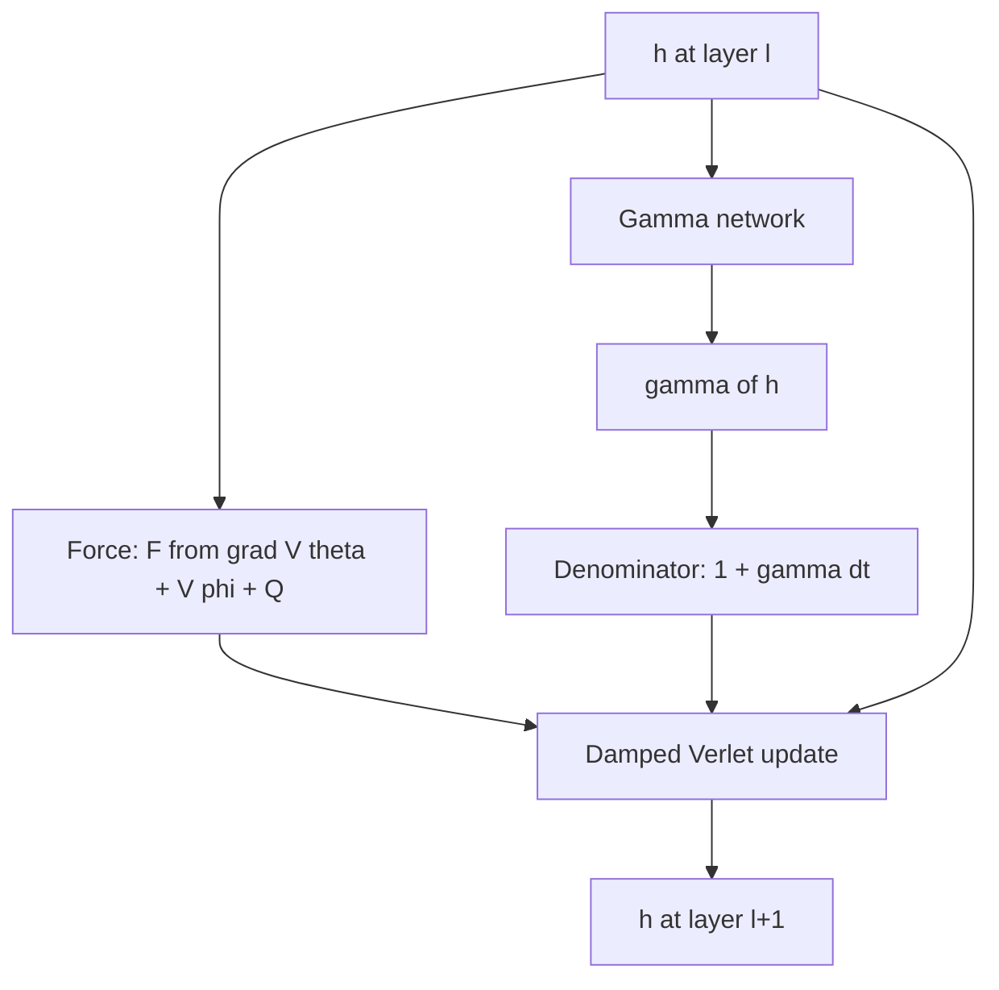
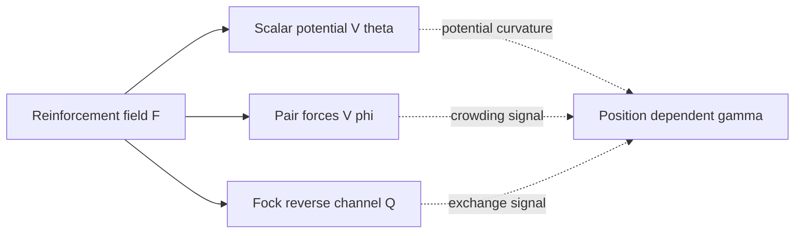
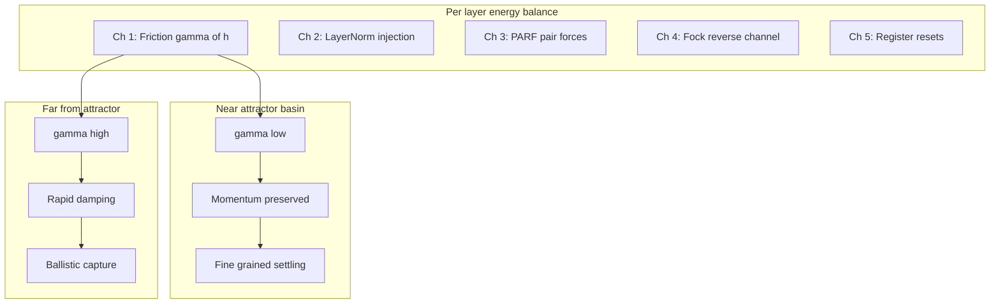
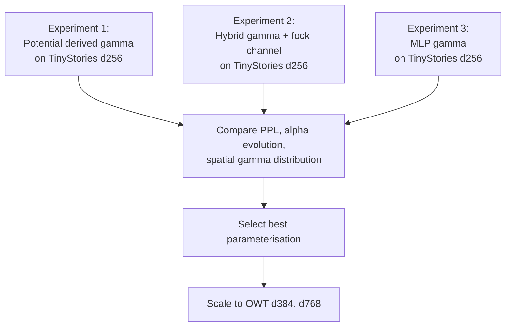

# Position-Dependent Damping $\gamma(h)$ and the Reinforcement Field

> **Status.** Draft, **August 6, 2026**, by Dimitar Gueorguiev with Claude.
> Explores the theoretical and implementation implications of promoting
> the constant damping coefficient $\gamma$ to a position-dependent
> function $\gamma(h)$ and connecting it to the reinforcement field
> $\mathfrak{F}$ of Section 6.2 of the paper.
>
> **Companion documents:**
> - **Damping calibration:** [`Determining_optimal_gamma_for_Fock-PARFLM.md`](Determining_optimal_gamma_for_Fock-PARFLM.md)
> - **SPLM gamma framework:** [`Determining_optimal_gamma_for_SPLM.md`](Determining_optimal_gamma_for_SPLM.md)
> - **Fock mechanism engagement:** [`Fock_Mechanism_Engagement_MLP_vs_Gaussian_VTheta.md`](Fock_Mechanism_Engagement_MLP_vs_Gaussian_VTheta.md)
> - **The well-gap / order-gap analysis and the three optimal dampings:** [`Corpus_Statistics_and_the_First_vs_Second_Order_Well_Gap.md`](Corpus_Statistics_and_the_First_vs_Second_Order_Well_Gap.md) (§13 and §9.5 below)
> - **The gradient-cascade instability:** [`Training_Instabilities_in_Fock-PARFLM_with_structured_V_theta.md`](Training_Instabilities_in_Fock-PARFLM_with_structured_V_theta.md)
> - **Model code:** [`notebooks/conservative_arch/parf/model_parf.py`](../notebooks/conservative_arch/parf/model_parf.py)

---

## Table of Contents

1. [Motivation](#1-motivation)
2. [Theoretical grounding in the Lagrangian framework](#2-theoretical-grounding-in-the-lagrangian-framework)
3. [The reinforcement field connection](#3-the-reinforcement-field-connection)
4. [Concrete parameterisations for gamma of h](#4-concrete-parameterisations-for-gamma-of-h)
5. [Interaction with the five energy channels](#5-interaction-with-the-five-energy-channels)
6. [Implementation sketch](#6-implementation-sketch)
7. [Training considerations](#7-training-considerations)
8. [Impact on the two-regime formula](#8-impact-on-the-two-regime-formula)
9. [Caveats and open questions](#9-caveats-and-open-questions)
10. [Summary and next steps](#10-summary-and-next-steps)

---

## 1. Motivation

All SemSimula models (SPLM, PARFLM, Fock-PARFLM) currently treat the
damping coefficient $\gamma$ as a **global scalar** -- a single number
shared across all layers, tokens, and hidden-state positions. This
scalar is either fixed via `fixed_gamma` or learned through a softplus
reparameterization:

$$\gamma = \text{softplus}(\gamma_{\text{raw}})$$

The empirical evidence from gamma sweeps reveals that the optimal
$\gamma$ depends strongly on the model's hidden dimension $d$, with a
qualitative regime transition between $d \le 384$ (overdamped optimal)
and $d \ge 768$ (underdamped optimal). This dimension dependence is
currently handled by the two-regime formula with different calibration
constants $\rho_{\text{lo}}$ and $\rho_{\text{hi}}$.

However, the framework's own Lagrangian (paper Section 7) **already
admits position-dependent damping**. The Rayleigh dissipation function
(equation 7.9 in the paper) is:

$$\mathcal{R}(\dot{\vec{x}}_i) = \tfrac{1}{2} \eta_i(\vec{x}_i) \lVert \dot{\vec{x}}_i \rVert^2$$

where the friction coefficient is explicitly a function of position:

$$\eta_i(\vec{x}_i) = \eta_0 (1 - H_i(\vec{x}_i))$$

with $H_i$ being the tanh damping factor. This means the theory already
distinguishes between bound-state regions (where $H_i \to 0$ and
friction is maximal) and free-particle regions (where $H_i \to 1$ and
friction vanishes). The constant $\gamma$ in the implementation is a
**simplification** of this richer structure.

The question this note explores: **can we promote $\gamma$ to
$\gamma(h)$, and if so, should the spatial dependence be connected to
the reinforcement field $\mathfrak{F}$ ?**


**Figure 1.** Conceptual illustration of position-dependent damping in
semantic space. Near the attractor basin (potential well center), damping
is low, allowing momentum-driven oscillation and fine-grained settling.
Far from the attractor, damping is high, guiding particles efficiently
toward their bound states. The arrows indicate particle trajectories
with thickness proportional to the local damping strength.

---

## 2. Theoretical grounding in the Lagrangian framework

### 2.1 From the Rayleigh dissipation to the integrator

The full dissipation-adjusted Euler-Lagrange equation (paper eq. 7.6)
reads:

$$\frac{d}{dt}\frac{\partial \mathcal{L}}{\partial \dot{\vec{x}}_i} - \frac{\partial \mathcal{L}}{\partial \vec{x}_i} + \frac{\partial \mathcal{R}}{\partial \dot{\vec{x}}_i} = 0$$

Expanding the Rayleigh term for the tanh damping model:

$$\frac{\partial \mathcal{R}}{\partial \dot{\vec{x}}_i} = \eta_i(\vec{x}_i) \dot{\vec{x}}_i$$

This gives the equation of motion:

$$m_i \ddot{h}_i = -\nabla_{h_i} V_\theta(\xi_i, h_i) + \sum_{j \neq i} F_{ij}^{\text{PARF}} + Q_i - \eta_i(h_i) \dot{h}_i$$

The current implementation **collapses** $\eta_i(h_i)$ to a global
scalar $m_i \gamma$, which is then discretised via the damped
velocity-Verlet update:

$$h_i^{(\ell+1)} = h_i^{(\ell)} + \frac{\Delta t}{1 + \gamma \Delta t} \delta_i^{(\ell)} + \frac{(\Delta t)^2}{(1 + \gamma \Delta t) m_i} f_i^{(\ell)}$$

Promoting $\gamma$ to $\gamma(h)$ makes the denominator
position-dependent:

$$h_i^{(\ell+1)} = h_i^{(\ell)} + \frac{\Delta t}{1 + \gamma(h_i^{(\ell)}) \Delta t} \delta_i^{(\ell)} + \frac{(\Delta t)^2}{(1 + \gamma(h_i^{(\ell)}) \Delta t) m_i} f_i^{(\ell)}$$

### 2.2 What changes mechanically

With constant $\gamma$, the denominator $1 + \gamma \Delta t$ is a
**fixed scalar** computed once per forward pass. With $\gamma(h)$, it
becomes a per-token, per-layer tensor that depends on the current hidden
state. This has three consequences:

1. **Different tokens at the same layer experience different damping.**
   A token deep inside an attractor basin (near its well center) could
   have lower damping than one far from any attractor.

2. **The same token experiences different damping at different layers.**
   As $h_i^{(\ell)}$ evolves layer-by-layer, $\gamma(h_i^{(\ell)})$
   changes, creating an adaptive damping schedule that responds to the
   particle's trajectory.

3. **Gradients flow through $\gamma(h)$.** If $\gamma$ is a
   differentiable function of $h$, the NTP loss can directly shape the
   damping landscape via backpropagation.



**Figure 2.** Data flow for one layer step with position-dependent
damping. The hidden state $h^{(\ell)}$ feeds both the force computation
and the gamma network. The gamma network produces the per-token damping
that enters the Verlet denominator.

---

## 3. The reinforcement field connection

### 3.1 The reinforcement field in the paper

Section 6.2 of the paper defines the reinforcement field
$\mathfrak{F}$ as a **time-dependent, vector-valued force field** at
each point $(\vec{r}, t)$ in semantic space:

$$\vec{f}(\vec{r}, t) \in \mathbb{R}^L$$

This field absorbs the cumulative effect of all existing semantic
structures together with the implicit reinforcement schedule imposed by
ongoing parsing. Each newly formed structure both responds to
$\mathfrak{F}$ and modifies it through the attractive-repulsive
contributions of its constituent properties.

### 3.2 Why $\gamma(h)$ and $\mathfrak{F}$ are naturally linked

The reinforcement field encodes the **local semantic environment** at
each point in the hidden space. A position where $\mathfrak{F}$ is
strong indicates a region rich in semantic structure -- many attractors,
well-established basins, and active interactions. A position where
$\mathfrak{F}$ is weak indicates a sparse or unstructured region.

The physical intuition is that **damping should be environment-aware**:

- In a **structure-rich region** (strong $\mathfrak{F}$), the particle
  has many attractors competing for it. High damping helps it settle
  into the nearest basin rather than oscillating between multiple wells.

- In a **structure-sparse region** (weak $\mathfrak{F}$), the particle
  needs to travel far to find an attractor. Low damping preserves
  momentum, allowing efficient ballistic transport toward a distant
  basin.

This is exactly the behavior the Rayleigh dissipation function
-- with $\eta_i$ equal to $\eta_0 (1 - H_i)$ -- was designed to
produce: friction increases as the particle approaches the bound
state. But $H_i$ depends only on the distance to the **ensemble
centroid**, which is a single-body quantity. Tying $\gamma(h)$ to
$\mathfrak{F}$ makes the damping aware of the **full many-body
environment** rather than just the one-body distance to the centroid.

### 3.3 The connection through $V_\theta$

The most direct bridge between $\gamma(h)$ and the reinforcement field
is through $V_\theta$, the scalar potential. The potential landscape
defines the local curvature of the energy surface, which in turn
determines how quickly a particle should settle. This leads to the
following parameterisation proposals (detailed in Section 4).



**Figure 3.** The reinforcement field $\mathfrak{F}$ manifests through
three force channels. Each channel provides a different signal for
computing position-dependent damping. The potential curvature gives a
single-body signal; the pair forces give a many-body crowding signal;
the Fock reverse channel gives a non-conservative exchange signal.

---

## 4. Concrete parameterisations for $\gamma(h)$

### 4.1 Potential-derived damping

The simplest option uses the scalar potential itself:

$$\gamma(h) = \gamma_0 \cdot g(V_\theta(h))$$

where $g: \mathbb{R} \to \mathbb{R}^+$ is a monotone link function.
The idea is that $V_\theta(h)$ is low near attractor centers (where the
particle is bound) and high far from them, so a monotone function of
$V_\theta$ directly encodes the local semantic environment.

For the Gaussian $V_\theta$, the potential value ranges from 0 at the
well center to 1 far away:

$$V_\theta(h) \propto 1 - e^{-\kappa^2 \lVert h - h_c \rVert^2}$$

A natural choice for the damping function is:

$$\gamma(h) = \gamma_{\min} + (\gamma_{\max} - \gamma_{\min}) \cdot \sigma(\beta \cdot V_\theta(h))$$

where $\sigma$ is the sigmoid function and $\beta$ controls the
sharpness of the transition. This gives low damping near attractors
and high damping far from them -- matching the physics of the Rayleigh
function.

**Advantages:**

- Zero additional parameters (if $\gamma_{\min}$, $\gamma_{\max}$,
  $\beta$ are fixed or shared).
- Analytical gradient available when V_theta is Gaussian
  (no additional autograd overhead).
- Preserves the conservative-by-construction guarantee because $\gamma$
  is computed from, but does not modify, the potential.

**Disadvantages:**

- Ties the damping landscape rigidly to the potential landscape. If the
  optimal damping map differs qualitatively from $V_\theta$, this
  parameterisation cannot express it.

### 4.2 Learned MLP damping

A small MLP maps the hidden state to a per-token scalar:

$$\gamma(h) = \gamma_{\min} + (\gamma_{\max} - \gamma_{\min}) \cdot \sigma(\text{MLP}_\phi(h))$$

where $\text{MLP}_\phi: \mathbb{R}^d \to \mathbb{R}$ is a lightweight
network (e.g. two layers with hidden dimension $d/4$).

**Advantages:**

- Maximum expressivity: the damping landscape is unconstrained by
  $V_\theta$.
- Can learn dimension-dependent and corpus-dependent damping patterns
  from data.
- Could absorb the two-regime formula entirely, eliminating the need
  for manual gamma calibration.

**Disadvantages:**

- Adds parameters and compute.
- Breaks the analytical tractability of the Jacobi metric
  (see Section 9).
- Gradient flow through $\gamma(h)$ creates a two-way coupling between
  damping and the NTP loss that may destabilise training.

### 4.3 Fock-channel-derived damping

For Fock-PARFLM specifically, the reverse channel provides a natural
"exchange pressure" signal:

$$\gamma(h) = \gamma_0 + \gamma_Q \cdot r_Q(h)$$

where $r_Q(h)$ is a normalised measure of the local reverse-channel
activity -- e.g. the ratio of the Fock exchange force magnitude to the
total force magnitude, aggregated over nearby registers. This makes
damping sensitive to the non-conservative energy injection channel.

**Advantages:**

- Directly addresses the five-channel energy balance: regions with
  strong reverse-channel injection get higher damping to compensate.
- Uses information already computed in the forward pass (zero
  additional parameters).

**Disadvantages:**

- Only applicable to Fock-PARFLM, not SPLM or PARFLM.
- The reverse-channel signal is noisy early in training (when Fock
  coupling is weak).

### 4.4 Comparison of parameterisations

| Parameterisation | Extra params | Analytical gradient | Fock-specific | Expressivity |
|:---|:---:|:---:|:---:|:---:|
| 4.1 Potential-derived | 2-3 scalars | Yes (Gaussian V theta) | No | Low |
| 4.2 Learned MLP | ~d/2 | No | No | High |
| 4.3 Fock-channel | 1 scalar | Partial | Yes | Medium |
| Hybrid 4.1 + 4.3 | 3-4 scalars | Partial | Yes | Medium-high |

A **recommended starting point** for experiments is the hybrid of 4.1
and 4.3:

$$\gamma(h) = \gamma_{\min} + \Delta\gamma_V \cdot \sigma(\beta V_\theta(h)) + \gamma_Q \cdot r_Q(h)$$

This has four learnable scalars and uses only quantities already
computed in the forward pass.

---

## 5. Interaction with the five energy channels

The five per-layer energy channels enumerated in
[`Determining_optimal_gamma_for_Fock-PARFLM.md`](Determining_optimal_gamma_for_Fock-PARFLM.md)
are:

1. **Explicit Rayleigh friction** -- dissipates kinetic energy.
2. **LayerNorm counter-damping** -- injects energy by renormalising
   velocities.
3. **PARF pair-force stiffness** -- increases effective landscape
   curvature.
4. **Fock reverse-channel injection** -- non-conservative energy
   input.
5. **Register creation/destruction** -- non-Hamiltonian state resets.

With constant $\gamma$, channel 1 operates uniformly and the
two-regime formula compensates for the dimension-dependent interplay
of channels 2-5 by adjusting a single scalar. With $\gamma(h)$,
channel 1 becomes **spatially adaptive**, which changes the energy
balance differently in different regions of the hidden space:



**Figure 4.** How position-dependent damping interacts with the five
energy channels. The friction channel (1) adapts its strength spatially,
creating distinct dynamical regimes near attractors versus far from them.

The key insight is that **position-dependent $\gamma(h)$ could unify
the two regimes** currently handled by the two-regime formula. Instead
of a global trade-off between overdamped (low $d$) and underdamped
(high $d$), the model could be overdamped in some regions and
underdamped in others -- simultaneously, within the same forward pass.

---

## 6. Implementation sketch

### 6.1 Current implementation: global scalar gamma

The current code in `model_parf.py` stores gamma as a global scalar:

```python
# From model_parf.py, lines 974-984
if cfg.fixed_gamma is not None:
    self.raw_gamma = nn.Parameter(
        torch.tensor(0.0), requires_grad=False,
    )
    self._gamma_value: Optional[float] = float(cfg.fixed_gamma)
else:
    self.raw_gamma = nn.Parameter(
        torch.tensor(_raw_from_positive(cfg.init_gamma)),
        requires_grad=cfg.learn_mgamma,
    )
    self._gamma_value = None
```

The property returns a scalar tensor:

```python
# From model_parf.py, lines 1030-1037
@property
def gamma(self) -> torch.Tensor:
    if self._gamma_value is not None:
        return torch.full(
            (), self._gamma_value,
            device=self.raw_gamma.device, dtype=self.raw_gamma.dtype,
        )
    return F.softplus(self.raw_gamma)
```

And the layer step uses it in the denominator:

```python
# From model_parf.py, lines 1225-1226
denom = 1.0 + dt * gamma
h_new = h_in + delta / denom + (dt * dt / (m_b * denom)) * f
```

### 6.2 Proposed modification: position-dependent gamma

The minimal change replaces the scalar gamma with a callable that maps
hidden states to per-token damping values.

**Step 1: Define a gamma network module.**

```python
class PositionDependentGamma(nn.Module):
    """Compute per-token damping from the hidden state."""
    def __init__(self, d_model: int, gamma_min: float = 0.01,
                 gamma_max: float = 1.0, mode: str = "potential"):
        super().__init__()
        self.gamma_min = gamma_min
        self.gamma_max = gamma_max
        self.mode = mode

        if mode == "mlp":
            self.net = nn.Sequential(
                nn.Linear(d_model, d_model // 4),
                nn.GELU(),
                nn.Linear(d_model // 4, 1),
            )
        elif mode == "potential":
            self.beta = nn.Parameter(torch.tensor(1.0))
        elif mode == "hybrid":
            self.beta = nn.Parameter(torch.tensor(1.0))
            self.gamma_Q = nn.Parameter(torch.tensor(0.01))

    def forward(self, h: torch.Tensor,
                v_theta_val: torch.Tensor = None,
                r_Q: torch.Tensor = None) -> torch.Tensor:
        """
        Args:
            h: hidden states (B, T, d)
            v_theta_val: V_theta(h) per token (B, T)
            r_Q: normalised reverse-channel ratio (B, T)
        Returns:
            gamma: per-token damping (B, T, 1)
        """
        delta = self.gamma_max - self.gamma_min

        if self.mode == "mlp":
            logit = self.net(h)           # (B, T, 1)
            gamma = self.gamma_min + delta * torch.sigmoid(logit)

        elif self.mode == "potential":
            assert v_theta_val is not None
            v = v_theta_val.unsqueeze(-1)  # (B, T, 1)
            gamma = self.gamma_min + delta * torch.sigmoid(
                self.beta * v
            )

        elif self.mode == "hybrid":
            assert v_theta_val is not None
            v = v_theta_val.unsqueeze(-1)
            base = self.gamma_min + delta * torch.sigmoid(
                self.beta * v
            )
            if r_Q is not None:
                base = base + self.gamma_Q * r_Q.unsqueeze(-1)
            gamma = base

        return gamma
```

**Step 2: Modify `_layer_step` to accept per-token gamma.**

```python
# Modified layer step (sketch)
def _layer_step(self, h_in, h_prev, m_b, gamma_fn, dt, layer_idx):
    delta = h_in - h_prev
    # ... force computation unchanged ...

    # Compute per-token gamma from current hidden state
    v_theta_val = self.V_theta(xi_now, h_in)  # already computed
    gamma = gamma_fn(h_in, v_theta_val=v_theta_val)  # (B, T, 1)

    denom = 1.0 + dt * gamma       # (B, T, 1) -- broadcasts
    h_new = h_in + delta / denom + (dt * dt / (m_b * denom)) * f
    return h_new
```

**Step 3: Modify `_stack_forward` to pass the gamma function.**

```python
def _stack_forward(self, h0, x, return_trajectory=False):
    cfg = self.cfg
    dt = cfg.dt
    m_b = self.compute_mass(x)

    h = h0
    h_prev = h0

    for ell in range(cfg.L):
        h_new = self._layer_step(
            h, h_prev, m_b, self.gamma_network, dt, ell
        )
        h_prev = h
        h = h_new
    return h, None
```

### 6.3 Broadcasting and shape considerations

The key change is that `gamma` goes from shape `()` (scalar) to shape
`(B, T, 1)` (per-token). The denominator computation
`1.0 + dt * gamma` is already compatible with broadcasting because `dt`
is a scalar and `delta` has shape `(B, T, d)`. The division
`delta / denom` broadcasts correctly because `denom` has trailing
dimension 1.


**Figure 5.** Architecture diagram showing position-dependent gamma
integrated into the velocity-Verlet layer stack. Each velocity-Verlet
integrator step nests the gamma network, the three force terms
(conservative, pair, damping), the summation, and the velocity/position
updates. The state $(h^{(\ell)}, v^{(\ell)})$ passed between steps is a
plain label, not a separate functional block. Each integrator step
consumes
$(h^{(\ell)}, v^{(\ell)})$ and produces $(h^{(\ell+1)}, v^{(\ell+1)})$.

---

## 7. Training considerations

### 7.1 Gradient flow through gamma

With position-dependent $\gamma(h)$, the NTP loss gradient flows
through the damping coefficient:

$$\frac{\partial \mathcal{L}_{\text{NTP}}}{\partial \gamma_{\text{params}}} = \sum_{\ell=0}^{L-1} \frac{\partial \mathcal{L}_{\text{NTP}}}{\partial h^{(\ell+1)}} \cdot \frac{\partial h^{(\ell+1)}}{\partial \gamma(h^{(\ell)})} \cdot \frac{\partial \gamma(h^{(\ell)})}{\partial \gamma_{\text{params}}}$$

The middle term is:

$$\frac{\partial h^{(\ell+1)}}{\partial \gamma(h^{(\ell)})} = -\frac{\Delta t^2}{(1 + \gamma \Delta t)^2} \left( \delta^{(\ell)} + \frac{\Delta t}{m_i} f^{(\ell)} \right)$$

This gradient has the physically sensible sign: increasing $\gamma$
reduces the update magnitude (more damping means less movement), and the
NTP loss can push $\gamma$ up or down to optimise the trajectory.

### 7.2 Stability concerns

Two potential instabilities arise:

1. **Runaway damping:** If the NTP loss benefits from very high damping
   at certain positions, $\gamma(h)$ could saturate at $\gamma_{\max}$
   in large regions, effectively freezing those tokens. The sigmoid
   parameterisation with bounded $\gamma_{\max}$ prevents this.

2. **Gamma oscillation:** If $\gamma(h)$ changes rapidly between
   layers, the integrator may become unstable. A regulariser on the
   spatial gradient of $\gamma$ could help:

$$\mathcal{L}_{\text{smooth}} = \lambda_{\text{smooth}} \sum_{\ell} \lVert \gamma(h^{(\ell+1)}) - \gamma(h^{(\ell)}) \rVert^2$$

### 7.3 Per-group gradient clipping

The gamma network's parameters should be included in the per-group
gradient clipping scheme. Since the gamma network is small, it could
share a clip group with the mass parameters or have its own group with a
conservative clip value (e.g. `gamma_net: 0.5`).

---

## 8. Impact on the two-regime formula

### 8.1 The current two-regime formula

The current predictor for the optimal explicit $\gamma$ (from
[`Determining_optimal_gamma_for_Fock-PARFLM.md`](Determining_optimal_gamma_for_Fock-PARFLM.md),
Section 7) is:

$$\gamma^{\ast} = \frac{\bar{m}}{L \Delta t} \ln(1 / \rho_d)$$

where the retention factor $\rho_d$ depends on the dimension regime:

$$\rho_d = \begin{cases} \rho_{\text{lo}} \approx 0.06 & d \le 384 \text{ -- overdamped, heavy friction to offset LayerNorm injection} \\\\ \rho_{\text{hi}} \approx 0.565 & d \ge 768 \text{ -- underdamped, SPLM anchor} \end{cases}$$

### 8.2 How position-dependent gamma could eliminate the two regimes

The two-regime formula exists because a single scalar $\gamma$ must
balance competing energy channels whose relative strengths change with
dimension. With $\gamma(h)$, this trade-off can be resolved
**locally**:

- In high-curvature regions of $V_\theta$ (typically near
  well centers), the model can learn the "overdamped" regime locally.
- In flat regions of $V_\theta$ (typically between wells), the model can
  learn the "underdamped" regime locally.
- The dimension-dependent LayerNorm injection is compensated
  position-by-position rather than in aggregate.

If this works empirically, the two-regime formula becomes a
**diagnostic** (to verify that the learned $\gamma(h)$ averages to
roughly the predicted constant $\gamma^{\ast}$) rather than a
**prescriptive** rule.

### 8.3 Expected relationship between $\gamma(h)$ and $\gamma^{\ast}$

Under the hypothesis that position-dependent damping subsumes the
two-regime formula, the spatial average of $\gamma(h)$ should satisfy:

$$\mathbb{E}_{h \sim p_{\text{data}}}[\gamma(h)] \approx \gamma^{\ast}_{\text{two-regime}}$$

This provides a **sanity check** for the learned damping landscape.

---

## 9. Caveats and open questions

### 9.1 Jacobi metric and Riemannian geometry

Paper Section 18 constructs a Jacobi metric from the Lagrangian and
analyses hidden-state trajectories as geodesics. The Jacobi metric
depends on the total energy $E - V$, and the geodesic analysis assumes a
**fixed** conformal factor relating the Jacobi metric to the flat
Euclidean metric.

With position-dependent $\gamma(h)$, the conformal factor itself
becomes position-dependent through $\gamma$. This does not invalidate
the Jacobi metric construction, but it makes the geodesic equations more
complex. Specifically:

- The geodesic residual $R_\ell$ would need to account for the varying
  damping, making $\gamma_{\text{geo}}$ a function of position rather
  than a global fit parameter.
- The clean separation between "explicit $\gamma$" and "effective
  $\gamma_{\text{eff}}$" becomes harder to maintain.

### 9.2 Analytical tractability for BAOAB and Langevin integrators

One motivation for Gaussian $V_\theta$ is the closed-form gradient
needed by BAOAB and Langevin O-Step integrators. If $\gamma$ depends on
$V_\theta$ (parameterisation 4.1), the analytical gradient of the
denominator involves:

$$\nabla_h \frac{1}{1 + \gamma(h) \Delta t} = -\frac{\Delta t}{(1 + \gamma(h) \Delta t)^2} \nabla_h \gamma(h)$$

For the potential-derived parameterisation, $\nabla_h \gamma(h)$ is
proportional to $\nabla_h V_\theta(h)$, which is already computed
analytically. So **the analytical gradient property is preserved** for
parameterisation 4.1 with Gaussian $V_\theta$.

For the MLP parameterisation (4.2), the analytical gradient is lost, and
the integrator falls back to autograd.

### 9.3 Interaction with learned gamma

The current codebase supports `cfg.learn_mgamma = True`, which learns
$\gamma$ as a global scalar via gradient descent. With $\gamma(h)$, the
global scalar is replaced by a function, and the `learn_mgamma` flag
would control whether the gamma network's parameters are trainable.

The two modes are not mutually exclusive: one could initialise
$\gamma(h) \approx \gamma_0$ (constant) and let the network learn
deviations from the constant, with a regulariser penalising large
deviations:

$$\mathcal{L}_{\text{anchor}} = \lambda_{\text{anchor}} \lVert \gamma(h) - \gamma_0 \rVert^2$$

### 9.4 Computational cost

| Parameterisation | FLOPs per layer | Memory per layer |
|:---|:---|:---|
| Constant gamma | 0 | 0 |
| 4.1 Potential-derived | ~3 ops per token | ~B x T x 1 |
| 4.2 Learned MLP | ~d/2 ops per token | ~B x T x d/4 activations |
| 4.3 Fock-channel | ~2 ops per token | ~B x T x 1 |
| 4.1 + 4.3 Hybrid | ~5 ops per token | ~B x T x 1 |

The overhead of parameterisations 4.1, 4.3, and the hybrid is negligible
compared to the attention computation (which is $O(T^2 d)$ per layer).
The MLP parameterisation adds $O(T d^2 / 4)$ per layer, which is
non-trivial at large $d$ but still much smaller than attention.

### 9.5 Interaction with training-time stability: a spatially concentrated cascade risk

Sections 9.1-9.4 above examine how $\gamma(h)$ interacts with the Jacobi
metric, the learned-gamma flag, and compute -- but not with training-time
stability, which is a separate axis developed after this note was
drafted, in
[`Corpus_Statistics_and_the_First_vs_Second_Order_Well_Gap.md`](Corpus_Statistics_and_the_First_vs_Second_Order_Well_Gap.md)
§13 and
[`Training_Instabilities_in_Fock-PARFLM_with_structured_V_theta.md`](Training_Instabilities_in_Fock-PARFLM_with_structured_V_theta.md).
Filling that gap surfaces a real tension, not just a missing
cross-reference, and it is worth recording here because it bears directly
on which parameterisation of §4 is actually safe to run.

**The three targets a damping value can serve.** With a global scalar
$\gamma_{\text{train}}$, three distinct optimisation targets compete for
the same one number: the perplexity-optimal value (dimension-dependent,
§8), the geodesic-optimal value (tracks the realized $\gamma_{\text{geo}}$
of §9.1, pinned near 0.96-0.98 by LayerNorm regardless of the dial), and
the stability-optimal value (governed by the raw, pre-LayerNorm Jacobian
of the `create_graph` force computation, $J_\ell \approx (1+\rho)I +
\beta \nabla^2_h U$, whose spectral radius the dial lowers directly as
$\gamma_{\text{train}}$ rises). These three do not in general coincide,
and they act through different computational paths -- the first two
through the realized, post-LayerNorm kinematics, the third through the
raw backward-pass Jacobian that only ever exists inside the
`create_graph` graph.

**Promoting $\gamma$ to $\gamma(h)$ promotes the cascade Jacobian too.**
$\gamma(h)$ gives the model one damping value per token rather than one
global number, which is exactly the extra degree of freedom the scalar
dial lacks for resolving the perplexity- and geodesic-optimal split (§8.2)
-- but the same promotion turns $J_\ell$ into a per-position quantity,
$J_\ell(h) \approx (1 + \rho(h))I + \beta \nabla^2_h U(h)$. The
potential-derived parameterisation of §4.1 sets the retained momentum
$\rho(h)$ at its **highest** exactly where $\nabla^2_h U(h)$ is
**largest**: at well centers, where an attractive Gaussian well's
curvature $\nabla^2 V(h_c) = w_i P_i$ peaks. The parameterisation
motivated by fine-grained settling therefore places the lowest damping
exactly where the cascade is most dangerous, concentrating stability risk
at well centers rather than diffusing it across the hidden-state
manifold. This is the opposite of what the stability-optimal target
wants: it wants damping to rise, not fall, wherever curvature is largest.

**This concentration lands on the wells that matter most for the other
question this note-family asks.** The well-gap analysis of
`Corpus_Statistics_and_the_First_vs_Second_Order_Well_Gap.md` §7.3 shows
the systematic order gap between first- and second-order dynamics is
detectable only at high-occupancy **head** wells, because occupancy
cancels in the systematic term but not in the noise floor. The wells most
valuable for detecting a second-order imprint and the wells most exposed
to a naive $\gamma(h)$'s stability risk are therefore the same wells.

**Reading this constructively.** Position-dependent damping is the
natural candidate lever for reaching the low-$\gamma_{\text{geo}}$ corner
that §6.4 and §13 of the well-gap note show the scalar dial cannot reach
on its own -- it can lower effective damping locally without lowering it
everywhere. But it does not sidestep the coupling that note's §13.4
flags between $\gamma_{\text{geo}}$ and the cascade margin; it
**relocates** that coupling from a global statement to a per-well one,
sharpening rather than removing it. Left unaddressed, the potential-derived
parameterisation of §4.1 is arguably the *worst* choice from a stability
standpoint precisely because it is the cheapest and most naturally
motivated one.

**A falsifiable prediction.** If the hybrid parameterisation of §4.4 is
trained end to end, the learned $\gamma(h)$ should show damping **rising**
with local curvature or anharmonicity wherever cascade pressure dominates
the settling intuition that motivated §4.1 -- a sign reversal relative to
the potential-derived design. The extent of that reversal is a direct
empirical readout of how much weight training places on stability versus
fine-grained settling, well by well, and it should be logged alongside
watchdog reload frequency whenever any $\gamma(h)$ variant is actually
run (extending the experimental sequence of §10.2 with exactly this
diagnostic).

### 9.6 Could $\gamma(h)$ be used *deliberately* as a gradient-spike governor? (deferred, August 20, 2026)

> **Priority note.** This subsection records an idea raised in discussion,
> not a planned experiment. It is a natural extension of §9.5 but is
> **not on the current agenda** -- the immediate lever for the gradient
> cascade remains the already-working combination of per-group gradient
> clipping and the EMA watchdog
> (`Training_Instabilities_in_Fock-PARFLM_with_structured_V_theta.md`).
> It is written down here so the reasoning -- including two failure modes
> §9.5 does not cover -- is not lost.

§9.5 asks how a $\gamma(h)$ *motivated by fine-grained settling* interacts
with the cascade, and answers that the potential-derived design of §4.1
concentrates risk at well centers. The complementary question is whether
$\gamma(h)$ could be turned around and used **on purpose** to suppress the
training-time gradient spikes of
`Training_Instabilities_in_Fock-PARFLM_with_structured_V_theta.md` §26 and
`Determining_optimal_gamma_for_Fock-PARFLM.md` §12.5. The tentative answer
is *yes in principle, but not with any parameterisation §4 currently
recommends, and only after clearing two failure modes*.

**Why targeting could beat a global dial.** The cascade lives in the
`create_graph` second-order backward pass, where each layer contributes a
raw (pre-LayerNorm) Jacobian $J_\ell(h) \approx (1 + \rho(h))\,I + \beta
\nabla^2_h U(h)$ and the run diverges when the spectral radius of
$\prod_\ell J_\ell$ exceeds 1. A **global** $\gamma_{\mathrm{train}}$ can
only lower the retained-momentum term $\rho$ everywhere at once; §12.5
measured the cost of doing so on the aniso-Gaussian family (higher global
$\gamma$ raised both perplexity, $211.63$ vs $184.11$, *and* reload count,
$5$ vs $2$). $\gamma(h)$ is attractive because it could raise damping only
at the tokens/layers where $(1+\rho) + \beta\,\lambda_{\max}(\nabla^2_h U)$
is about to cross 1, keeping the per-layer spectral radius bounded
*pointwise* while leaving the rest of the manifold underdamped for PPL.
This is the same extra degree of freedom §8.2 invokes for the
PPL/geodesic split, now aimed at stability; conceptually it is a
differentiable, in-the-dynamics cousin of the per-group gradient clipping
the model already uses.

**Failure mode A -- the recommended sign is backwards, and the recommended
signal is the wrong channel.** For spike suppression $\gamma(h)$ must
**rise** with local curvature / force magnitude -- the sign reversal §9.5
predicts -- whereas §4.1 makes it *fall* where $\nabla^2_h U$ is largest.
Worse, in the run that actually spikes (the $d=384$ aniso-Gaussian
$\gamma=0.30$ run of §12.5) the per-group spike attributions are dominated
by the `E`, `P`, `depth_code`, `creation_gate`, and `register` groups,
with `V_theta` consistently near the *bottom* of the contributor list. A
$\gamma(h)$ keyed off $V_\theta$ (§4.1, §4.3) is therefore keyed to a
channel that carries almost none of the spike energy. A spike-suppressing
governor has to read a proxy that tracks the cascade directly -- local
force magnitude $\lVert f(h)\rVert$, retained velocity
$\lVert\delta(h)\rVert$, or an EMA of the per-token pre-clip gradient
contribution -- not the potential value.

**Failure mode B -- $\gamma(h)$ enters its own cascade Jacobian (not
covered by §9.5).** Once $\gamma$ depends on $h$, the second-order
backward pass must differentiate through it, and $J_\ell$ acquires a new
term from
$$\frac{\partial h^{(\ell+1)}}{\partial \gamma(h^{(\ell)})}\,\nabla_h\gamma(h^{(\ell)}) \;\propto\; -\frac{\Delta t^2}{(1+\gamma\Delta t)^2}\,\nabla_h\gamma(h)\otimes(\cdots).$$
For a potential-derived $\gamma$, $\nabla_h\gamma \propto \nabla_h
V_\theta$, so the term needed by `create_graph` re-injects $\nabla^2_h
V_\theta$ -- the very curvature the governor is meant to tame -- back into
the backward chain; for an MLP $\gamma$ it injects the MLP's own Jacobian.
A naive $\gamma(h)$ can therefore be *self-defeating*: it smooths the
forward trajectory while adding fresh second-order structure to the
backward pass. Whether the net effect is stabilising is a genuine
empirical question, which is the main reason not to expect a free win.

**A design constraint that follows: don't leave it to NTP.** Gradient
spikes are rare tail events, so an end-to-end $\gamma(h)$ trained only on
$\mathcal{L}_{\mathrm{NTP}}$ gets almost no signal to grow damping in the
configurations that precede a cascade and is unlikely to become a spike
suppressor spontaneously. Deliberate spike suppression would need either
(a) a **prescribed** (non-learned or lightly-learned) stability governor
$\gamma(h) = \gamma_0 + \kappa\,\phi(\lVert f(h)\rVert\;\text{or}\;
\lambda_{\max}(\nabla^2_h U))$ with $\phi$ monotone increasing, paired with
the §7.2 smoothness regulariser so that $\gamma$-oscillation does not
itself destabilise the integrator, or (b) an explicit auxiliary penalty on
large per-token force / gradient norm added to the loss.

**If it is ever run.** Evaluate it the way §10.3 already prescribes -- by
watchdog-reload frequency at high-occupancy head wells, not aggregate PPL
-- and benchmark it against the honest baseline of *keeping* per-group clip
plus the watchdog, which already suppresses the cascade cheaply in the
outer loop. The bet $\gamma(h)$ is making is that generating fewer spikes
inside the forward dynamics beats catching them after the fact; it only
pays off if it clears failure mode B.

### 9.7 $\gamma(h)$ under a CfC/BAOAB integrator, and the implementation roadmap

> **Priority note.** Unlike §9.6, this subsection *is* on the agenda,
> because it fixes the order in which two already-planned pieces of work
> should land. The CfC/BAOAB propagator
> (`Training_Instabilities_in_Fock-PARFLM_with_structured_V_theta.md` §24)
> is the next major implementation item; this subsection records what it
> changes for $\gamma(h)$ and why $\gamma(h)$ must come *after* it.

Everything in §9.5 and §9.6 assumed the current damped-velocity-Verlet
integrator, in which friction is baked into the force coefficients
$\rho = 1/(1+\Delta t\gamma)$ and $\beta = \Delta t^2/(m_b(1+\Delta
t\gamma))$. A BAOAB/CfC propagator changes the picture qualitatively,
and almost entirely in $\gamma(h)$'s favour.

**What changes: damping leaves the force step and becomes a standalone
operator.** BAOAB splits each layer into $\mathrm{B}$-$\mathrm{A}$-$\mathrm{O}$-$\mathrm{A}$-$\mathrm{B}$
sub-steps, and *all* friction is handled by the $\mathrm{O}$-step alone,
which is the exact closed-form Ornstein-Uhlenbeck solution and contains
**no force evaluation** (§24.1 of the instabilities note). Position-dependent
damping is then implemented as one localized change to the $\mathrm{O}$-step,
$$v \;\leftarrow\; e^{-\gamma(h)\Delta t}\,v \;+\; \sqrt{1-e^{-2\gamma(h)\Delta t}}\,\sigma_{\mathrm{th}}\,\zeta,$$
with $\gamma(h)$ read off the position $h$ that is *frozen within that
sub-step* by the Strang splitting. This is exactly the placement the
Rayleigh dissipation function of §2 implies -- $\gamma$ is friction, and
friction belongs in the $\mathrm{O}$-step -- so the integrator finally
matches the physics instead of smearing $\gamma$ across the force
coefficients of §4.5.

**Why it helps -- three concrete gains.**

1. **$\gamma(h)$ leaves the second-order `create_graph` chain, dissolving
   failure mode B of §9.6.** The $\mathrm{O}$-step is a scalar elementwise
   rescaling of $v$; its backward pass is ordinary first-order autograd.
   Because the CfC substitution has already replaced the $V_\theta$ force
   with a forward-mode analytical propagator (§24.2, no
   `autograd.grad(create_graph=True)`), there is no second-order cascade
   left for $\gamma(h)$ to feed into. The single biggest objection to
   $\gamma(h)$ -- that it adds fresh curvature to its own cascade Jacobian
   -- has nothing to attach to (modulo the residual $V_\phi$ chain of
   §24.3).

2. **CfC hands you the correct-sign control signal analytically, still
   first-order.** §9.6 argued a spike-suppressing $\gamma(h)$ must key off
   local curvature/force, not the potential value -- but reading $\lVert
   \nabla V\rVert$ or $\lambda_{\max}(\nabla^2 V)$ in the Verlet world drags
   a gradient into $\gamma$ and re-introduces a `create_graph` term. CfC
   removes this obstacle too: the propagator already computes the local
   harmonic frequency $\omega_k = \sqrt{2V_0\kappa_k^2}$ near each well,
   which *is* the local curvature. A curvature-keyed governor
   $\gamma(h) = \gamma_0 + \kappa\,\phi(\omega_k)$ is therefore available
   as an analytic byproduct of the $\mathrm{B}$-step, differentiable by
   first-order autograd -- CfC is what makes the "right" parameterization
   cheap.

3. **The $\mathrm{O}$-step is exact for any $\gamma\ge0$, so $\gamma(h)$
   can vary hard.** In explicit/implicit Verlet a large local $\gamma$ can
   push the update out of its stability region, which is why §7.2 needs a
   smoothness regulariser on $\gamma(h)$. The OU $\mathrm{O}$-step is
   unconditionally stable, so strong per-token variation never breaks the
   integrator; the §7.2 smoothness constraint weakens from a stability
   requirement to a mild regularization preference.

**The deeper change: *why* you would use $\gamma(h)$ at all.** §9.5-§9.6
and §13.5 of `Corpus_Statistics_and_the_First_vs_Second_Order_Well_Gap.md`
frame $\gamma(h)$'s central tension this way: the §4.1 fine-settling sign
(lowest damping at well centers) is dangerous *because* it starves damping
exactly where the `create_graph` cascade Jacobian $\beta\nabla^2_h U$ is
largest. Once CfC removes that cascade at its source, the danger
evaporates -- there is no second-order backward blow-up to punish low
damping at well centers, so the §4.1 sign becomes **safe again**. CfC
therefore does not merely help implement $\gamma(h)$; it changes its job
description:

- In the Verlet world the tempting use of $\gamma(h)$ was as a **spike
  governor** (§9.6), which forced the awkward sign reversal and the
  wrong-channel problem.
- Under BAOAB/CfC the cascade is already handled, so $\gamma(h)$ reverts
  to its **original §4.1 purpose**: a per-token knob on the realized
  $\gamma_{\mathrm{geo}}$ for fine-grained settling and for reaching the
  low-$\gamma_{\mathrm{geo}}$ corner that §13.4 of the corpus note shows
  the global dial cannot reach -- an *inference-geometry* knob decoupled
  from training stability.

This is the sense in which CfC **removes** rather than **relocates** the
§13.5 tension: it severs the forward (geodesic) Jacobian from the backward
(cascade) Jacobian so completely that $\gamma(h)$ acts on the former with
no side effect on the latter.

**The roadmap: CfC/BAOAB first, then $\gamma(h)$.** The ordering is
causal, not merely convenient:

1. **CfC/BAOAB removes the obstacle that makes $\gamma(h)$ dangerous.**
   Building $\gamma(h)$ on the current Verlet integrator adds a new
   position-dependent term to a backward pass already sitting near its
   spectral-radius margin -- tuning a stability knob that is itself a
   stability liability.
2. **CfC/BAOAB creates the correct home for $\gamma(h)$.** The standalone
   $\mathrm{O}$-step is the physically faithful site for a friction field;
   without the splitting there is nowhere clean to put it.
3. **CfC/BAOAB supplies the control signal $\gamma(h)$ needs** ($\omega_k$,
   first-order-differentiable), per gain 2 above.
4. **It de-risks attribution.** With CfC landed and a *constant* $\gamma$
   first, one verifies the propagator reproduces the second-order forward
   kinematics (geodesics intact) and kills the spikes; only then is
   $\gamma(h)$ layered on, so any change is attributable to it alone.

The nuance worth flagging: after step 1, $\gamma(h)$'s success criterion
changes. It is no longer justified by spike suppression (CfC owns that)
but by whether the geodesic/settling gains are real, evaluated by the
§10.3 reload-and-geometry diagnostics rather than by aggregate PPL.

---

## 10. Summary and next steps

### 10.1 Key findings

1. The Lagrangian framework **already admits** position-dependent
   damping through the Rayleigh dissipation function. The constant
   $\gamma$ in the implementation is a simplification.

2. The reinforcement field $\mathfrak{F}$ provides a **natural bridge**
   to position-dependent damping through the scalar potential
   $V_\theta$, pair forces $V_\phi$, and the Fock reverse channel $Q$.

3. The **potential-derived parameterisation** (Section 4.1) is the
   cheapest option that preserves analytical tractability for Gaussian
   $V_\theta$ and BAOAB/Langevin integrators.

4. Position-dependent $\gamma(h)$ could **unify the two-regime formula**
   by allowing the model to be simultaneously overdamped and underdamped
   in different regions of the hidden space.

5. The main **caveat** is the impact on the Jacobi metric and geodesic
   analysis, which assumes a fixed conformal factor.

6. **Position-dependent damping does not resolve the three-way tension
   between perplexity-, geodesic-, and stability-optimal damping -- it
   relocates it from global to local** (§9.5). The potential-derived
   parameterisation places the lowest damping exactly where the
   `create_graph` cascade Jacobian is largest (well centers), which are
   also the high-occupancy wells the well-gap analysis needs most for
   detecting a second-order imprint. Any experiment that runs a
   $\gamma(h)$ variant should log watchdog reload frequency alongside
   the learned spatial profile, not just perplexity.

7. **Using $\gamma(h)$ as a deliberate gradient-spike governor is a
   plausible but deferred idea** (§9.6, not on the current agenda). It
   could in principle raise damping pointwise only where the cascade
   Jacobian is about to cross 1, but only after (a) reversing the §4.1
   sign so damping *rises* with local curvature/force, (b) keying off the
   channels that actually carry the spike energy (`E`, `P`, `depth_code`,
   `creation_gate`, `register` -- not `V_theta`), and (c) clearing the
   self-defeating second-order term $\gamma(h)$ adds to its own cascade
   Jacobian. The current, already-working stability lever remains
   per-group gradient clipping plus the EMA watchdog.

8. **The implementation order is CfC/BAOAB first, then $\gamma(h)$**
   (§9.7). A BAOAB/CfC propagator moves damping out of the force
   coefficients into a standalone $\mathrm{O}$-step, takes $\gamma(h)$ out
   of the second-order `create_graph` chain (dissolving §9.6's failure
   mode B), and supplies the local curvature signal $\omega_k$
   analytically and first-order-differentiably. Because it removes the
   cascade at source, it also removes -- not merely relocates -- the §13.5
   tension, and reverts $\gamma(h)$ from a stability governor to its
   original §4.1 role as an inference-geometry / fine-settling knob. The
   ordering is causal: CfC removes the obstacle, creates the correct home,
   supplies the control signal, and de-risks attribution (verify a
   constant-$\gamma$ CfC run first, then layer $\gamma(h)$ on top).

### 10.2 Recommended experimental sequence



**Figure 6.** Proposed experimental sequence. Start with TinyStories
$d = 256$ (cheap, fast iteration) and compare three parameterisations.
Scale the winner to OpenWebText.

1. **Experiment 1** (low risk): Potential-derived $\gamma(h)$ on
   TinyStories $d = 256$ with anisotropic Gaussian $V_\theta$ + Fock
   reg. Compare against the $\gamma = 0.300$ constant baseline
   (PPL = 9.04).

2. **Experiment 2** (medium risk): Hybrid potential + Fock-channel
   $\gamma(h)$ on TinyStories $d = 256$. Verify that the Fock-channel
   signal improves over pure potential-derived damping.

3. **Experiment 3** (high risk): Learned MLP $\gamma(h)$ on TinyStories
   $d = 256$. Test whether unconstrained damping landscapes yield
   further gains.

4. **Diagnostic analysis**: For the best performing variant, extract
   the learned $\gamma(h)$ landscape and compare its spatial average to
   the two-regime formula's prediction. Verify the geodesic residual
   analysis still yields a coherent $\gamma_{\text{geo}}$.

5. **Scale-up**: Apply the winning parameterisation to OWT $d = 384$
   and $d = 768$, where the two-regime transition is most pronounced.

### 10.3 Success criteria

- PPL improvement over constant $\gamma^{\ast}$ on at least one
  configuration.
- Spatial average of $\gamma(h)$ within 2x of the two-regime
  prediction (sanity check).
- No training instability (gradient spikes, alpha collapse) beyond
  what the constant-$\gamma$ baseline exhibits, checked specifically at
  well centers (high-occupancy head wells), not just in aggregate --
  §9.5 predicts this is where any excess risk from $\gamma(h)$ would
  concentrate.
- Geodesic residual analysis remains interpretable (even if the
  interpretation changes).
- Report whether the learned $\gamma(h)$ preserves or reverses the sign
  of the potential-derived design (§9.5's falsifiable prediction), as a
  direct readout of whether stability pressure dominates the
  fine-settling intuition that motivated Section 4.1.

---

**End of note.** This document will be updated with experimental results
as they become available.
