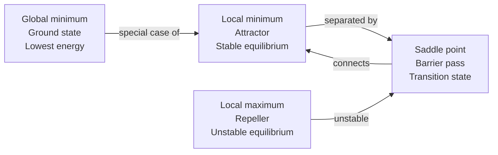
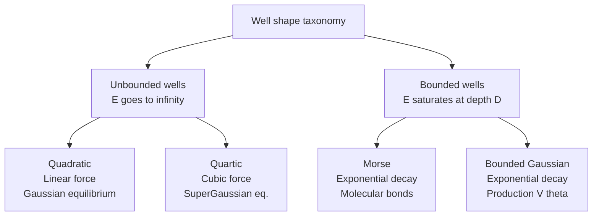
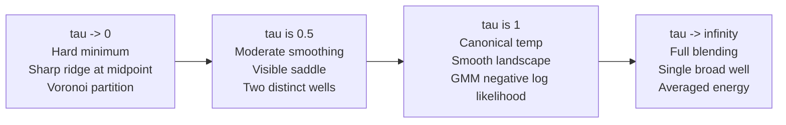
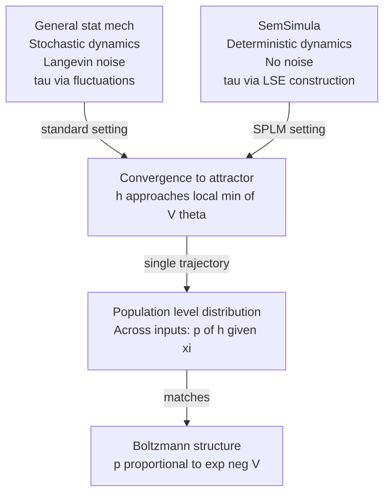
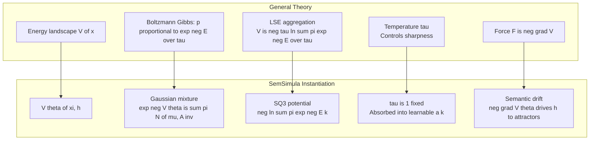

# Potential Wells, Temperature, and the Boltzmann-Gibbs Connection

> **Status.** Living document, drafted **August 2, 2026**, by Dimitar Gueorguiev with Claude. Provides the statistical-mechanical and information-geometric foundations for understanding the structured scalar potential $V\_\theta$ in the SPLM / PARFLM / Fock-PARFLM family. Part I is self-contained general theory; Part II maps it onto SemSimula.
>
> **Companion notes:**
> - **Structured scalar potential deep dive:** [`Structured_Scalar_Potential_Design_and_Theory.md`](deep_dives/Structured_Scalar_Potential_Design_and_Theory.md)
> - **Optimal gamma for SPLM:** [`Determining_optimal_gamma_for_SPLM.md`](Determining_optimal_gamma_for_SPLM.md)
> - **Optimal gamma for Fock-PARFLM:** [`Determining_optimal_gamma_for_Fock-PARFLM.md`](Determining_optimal_gamma_for_Fock-PARFLM.md)
> - **Damped Riemannian geodesics:** [`Damped_Riemannian_Geodesics_in_the_SPLM_family-Comparative_Analysis.md`](Damped_Riemannian_Geodesics_in_the_SPLM_family-Comparative_Analysis.md)

---

# Part I — General Theory

---

## 1. Potential wells as energy landscapes

### 1.1 Scalar fields and force

A **potential energy function** (or simply a "potential") is a scalar field over a state space:

$$V : \mathbb{R}^d \to \mathbb{R}$$

At any point $x$, the **force** is the negative gradient of the potential:

$$F(x) = -\nabla V(x)$$

This is the defining property of a **conservative force field**: the work done along any closed path is zero, and the force is completely determined by the scalar potential.

### 1.2 Minima as attractors

A **potential well** is a local minimum of $V(x)$. At a minimum $x^{\ast}$:

$$\nabla V(x^{\ast}) = 0, \quad \nabla^2 V(x^{\ast}) \succ 0 \quad \text{(positive definite Hessian)}$$

A particle released near $x^{\ast}$ with some friction will settle into the minimum — the force always points "downhill" toward the attractor. The depth of the well determines how strongly the particle is captured; the curvature determines how quickly it settles.

### 1.3 Mechanical analogy

The fundamental image: a ball rolling on a hilly surface under gravity, with friction.

- **Position** = state $x$
- **Height** = potential $V(x)$
- **Gravity component along slope** = force $F = -\nabla V$
- **Friction** = damping $\gamma$ (dissipates kinetic energy)
- **Equilibrium** = ball rests at a local minimum (bottom of a valley)

Without friction, the ball oscillates indefinitely. With too much friction, it barely moves (overdamped). With the right friction (critical damping), it slides smoothly into the minimum in minimum time.

### 1.4 The landscape metaphor

A complex potential $V(x)$ over $\mathbb{R}^d$ defines an **energy landscape** — a d-dimensional surface with valleys (wells), ridges (barriers), and saddle points (passes between valleys). The dynamics of any system governed by $V$ can be understood as motion on this landscape.

---

## 2. Per-component energy functions

### 2.1 Decomposing a complex landscape

A rich energy landscape with many attractors can be decomposed into $K$ elementary **component wells**:

$$V(x) = \mathrm{Aggregate}\bigl(E\_1(x), E\_2(x), \ldots, E\_K(x)\bigr)$$

Each $E\_k(x)$ is a simple, analytically tractable function centred on a location $\mu\_k$ — the "centre" or "attractor" of the $k$-th well. The aggregation rule (Section 5) determines how the wells combine into a single landscape.

### 2.2 Taxonomy of well shapes

The choice of functional form for each $E\_k$ determines the well's geometry: its depth, width, curvature, and asymptotic behaviour. Here are the main families:

#### Quadratic (Harmonic) well

$$E\_k(x) = \frac{1}{2} (x - \mu\_k)^\top A\_k (x - \mu\_k)$$

where $A\_k \succ 0$ is a positive-definite precision matrix.

**Properties:**
- Force: $F\_k = -A\_k(x - \mu\_k)$ — linear restoring force (Hooke's law).
- Equipotential surfaces: ellipsoids centred at $\mu\_k$.
- Unbounded: $E\_k \to \infty$ as $\lVert x - \mu\_k \rVert \to \infty$.
- The simplest and most analytically tractable form.
- Boltzmann distribution: Gaussian $\mathcal{N}(\mu\_k, A\_k^{-1})$.

#### Quartic (Anharmonic) well

$$E\_k(x) = \frac{1}{4} b\_k \lVert x - \mu\_k \rVert^4$$

**Properties:**
- Force: $F\_k = -b\_k \lVert x - \mu\_k \rVert^2 (x - \mu\_k)$ — nonlinear, grows cubically.
- Flat bottom near centre, steep walls far away.
- Unbounded.
- Used when the well should be "forgiving" near the centre but strongly confining at large displacements.

#### Morse potential

$$E\_k(x) = D\_k \bigl(1 - e^{-\alpha\_k \lVert x - \mu\_k \rVert}\bigr)^2$$

**Properties:**
- Depth $D\_k$ (finite) — the well has a maximum energy.
- At small displacements: approximately quadratic ($E \approx D\_k \alpha\_k^2 \lVert x - \mu\_k \rVert^2$).
- At large displacements: saturates to $D\_k$.
- Originally developed for diatomic molecular bonds.
- The particle can "escape" if its kinetic energy exceeds $D\_k$.

#### Bounded Gaussian well

$$E\_k(x) = A\_k \bigl(1 - e^{-\kappa\_k \lVert x - \mu\_k \rVert^2}\bigr)$$

**Properties:**
- Depth $A\_k$ (finite).
- At small displacements: approximately quadratic ($E \approx A\_k \kappa\_k \lVert x - \mu\_k \rVert^2$).
- At large displacements: saturates to $A\_k$.
- Force is bounded: $\lVert F\_k \rVert \le 2 A\_k \kappa\_k / e$.
- Prevents training instabilities from unbounded gradients.
- The "production" form for structured $V\_\theta$ in SemSimula (Section 8).

#### Lennard-Jones potential

$$E\_k(r) = 4\epsilon\_k \Bigl[\bigl(\sigma\_k / r\bigr)^{12} - \bigl(\sigma\_k / r\bigr)^6\Bigr], \quad r = \lVert x - \mu\_k \rVert$$

**Properties:**
- Short-range repulsion ($r^{-12}$) + long-range attraction ($r^{-6}$).
- Minimum at $r = 2^{1/6}\sigma\_k$.
- Used for intermolecular forces.
- Not relevant for structured $V\_\theta$ but included for completeness.

### 2.3 Well shape determines the force profile

The relationship between well shape and the resulting force is:

| Well shape | $E\_k(r)$ as $r \to 0$ | Force $F\_k(r)$ | Restoring behaviour |
|---|---|---|---|
| Quadratic | $\sim r^2$ | Linear in $r$ | Proportional to displacement |
| Quartic | $\sim r^4$ | Cubic in $r$ | Weak near centre, strong far away |
| Morse | $\sim r^2$ (small $r$) | Linear (small), decays at large $r$ | Bounded force |
| Bounded Gaussian | $\sim r^2$ (small $r$) | Linear (small), decays at large $r$ | Bounded force |

The key design choice: **bounded vs unbounded wells**. Unbounded wells (quadratic, quartic) guarantee the particle can never escape, but produce unbounded forces that can destabilise numerical integration. Bounded wells (Morse, bounded Gaussian) produce bounded forces at the cost of allowing escape if kinetic energy exceeds the well depth.

---

## 3. The Boltzmann-Gibbs distribution

### 3.1 The fundamental connection: energy to probability

Given an energy function $E(x)$ and a temperature $\tau \gt 0$, the **Boltzmann-Gibbs distribution** (or **canonical distribution**) assigns to each state $x$ a probability:

$$p(x) = \frac{1}{Z(\tau)} \exp\Bigl(-\frac{E(x)}{\tau}\Bigr)$$

where $Z(\tau)$ is the **partition function** (normalisation constant):

$$Z(\tau) = \int \exp\Bigl(-\frac{E(x)}{\tau}\Bigr) dx$$

This is the most fundamental result in statistical mechanics: **given an energy landscape and a temperature, there is a unique equilibrium probability distribution**.

### 3.2 Derivation from maximum entropy

The Boltzmann-Gibbs distribution is not merely a convenient formula — it is the **unique** distribution that maximises the Shannon entropy

$$H[p] = -\int p(x) \ln p(x) dx$$

subject to the constraint that the expected energy equals a fixed value $\bar{E}$:

$$\int p(x) E(x) dx = \bar{E}$$

The Lagrange multiplier enforcing this constraint is $1/\tau$ — the inverse temperature. Higher temperature means the entropy constraint dominates (distribution spreads out); lower temperature means the energy constraint dominates (distribution concentrates at minima).

### 3.3 The partition function and free energy

The partition function $Z(\tau)$ encodes everything about the system's thermodynamics. The **free energy** is:

$$F(\tau) = -\tau \ln Z(\tau)$$

This is a central quantity because:
- $F$ is the "effective energy" after accounting for entropic effects.
- At $\tau = 0$: $F = \min\_x E(x)$ (ground state energy).
- At $\tau \to \infty$: $F \to -\infty$ (entropy dominates).
- The equilibrium probability can be rewritten as $p(x) = \exp\bigl(-(E(x) - F)/\tau\bigr)$.

### 3.4 Examples: well shape determines the equilibrium distribution

| Energy $E(x)$ | Boltzmann distribution $p(x) \propto e^{-E/\tau}$ | Name |
|---|---|---|
| $\frac{1}{2}(x-\mu)^\top A(x-\mu)$ | $\mathcal{N}(\mu, \tau A^{-1})$ | Gaussian |
| $\frac{1}{4}b\lVert x-\mu\rVert^4$ | $\propto \exp(-b\lVert x-\mu\rVert^4 / 4\tau)$ | Sub-Gaussian (super-exponential tails) |
| $c\lVert x-\mu\rVert$ | $\propto \exp(-c\lVert x-\mu\rVert/\tau)$ | Laplace |
| $-\ln \sum\_k \pi\_k e^{-E\_k/\tau}$ | Mixture $\sum\_k \pi\_k p\_k(x)$ | Gaussian mixture (if $E\_k$ quadratic) |

The quadratic-to-Gaussian correspondence is the most important: **a quadratic energy well at temperature $\tau$ produces a Gaussian equilibrium distribution with covariance $\tau A^{-1}$**. The precision of the Gaussian equals $A/\tau$ — higher temperature widens the distribution, lower temperature sharpens it.

### 3.5 The energy-probability duality

This duality is the conceptual bridge between dynamics and statistics:

$$\text{Energy landscape } E(x) \quad \xleftrightarrow{\tau} \quad \text{Probability distribution } p(x) = Z^{-1} e^{-E/\tau}$$

Moving from left to right: given a potential and a temperature, you get a distribution.

Moving from right to left: given any (strictly positive, integrable) distribution $p(x)$, you can define an energy $E(x) = -\tau \ln p(x) + \text{const}$.

This duality means that designing an energy landscape is equivalent to designing a probability model, and vice versa. The scalar potential $V\_\theta$ in SemSimula is simultaneously an energy function (governing dynamics) and a log-density (governing the equilibrium statistics of the hidden states).

---

## 4. Temperature as a control parameter

### 4.1 Physical meaning

In classical statistical mechanics, temperature is proportional to the average kinetic energy per degree of freedom:

$$\tau = \frac{2}{d} \langle T\_{\text{kin}} \rangle = \frac{1}{d} \langle m \lVert v \rVert^2 \rangle$$

where $d$ is the number of spatial dimensions. Intuitively: temperature measures how much the system "jiggles" around its equilibrium.

### 4.2 The three regimes of temperature

Temperature interpolates between two extremes:

**Zero temperature ($\tau \to 0$):** The distribution collapses to a delta function at the global minimum of $E(x)$:

$$p(x) \to \delta(x - x^{\ast}), \quad x^{\ast} = \arg\min\_x E(x)$$

All probability mass concentrates at the ground state. The system is frozen — perfectly deterministic.

**Finite temperature ($0 \lt \tau \lt \infty$):** The distribution assigns non-zero probability to all states, with probability exponentially decreasing with energy. Higher energy states are accessible but rare. The system fluctuates around minima with excursions proportional to $\tau$.

**Infinite temperature ($\tau \to \infty$):** The distribution becomes uniform over the accessible state space:

$$p(x) \to \text{const}$$

All states are equally likely regardless of their energy. The system is maximally disordered.

### 4.3 Temperature as a sharpness control

For a landscape with multiple minima, temperature controls **selection pressure**:

- **Low $\tau$**: probability concentrates in the deepest well (the global minimum wins overwhelmingly).
- **Moderate $\tau$**: probability distributes across multiple wells, weighted by depth.
- **High $\tau$**: all wells contribute roughly equally regardless of depth.

This is identical to the role of temperature in:
- **Simulated annealing:** start at high $\tau$ (explore broadly), cool to low $\tau$ (exploit the best minimum found).
- **Softmax in neural networks:** $\text{softmax}(z\_i / \tau)$ sharpens ($\tau \to 0$) or flattens ($\tau \to \infty$) the output distribution.
- **Langevin dynamics:** the noise magnitude scales as $\sqrt{2\tau}$, controlling exploration vs exploitation.

### 4.4 Phase transitions

At certain critical temperatures, the equilibrium distribution can undergo qualitative changes — **phase transitions**. In the context of multi-well potentials:

- Above the critical temperature: the particle explores all wells (paramagnetic / disordered phase).
- Below the critical temperature: the particle spontaneously selects one well and stays there (ferromagnetic / ordered phase — symmetry breaking).

The critical temperature is determined by the barrier height between wells relative to the well depths. For a double well with barrier $\Delta E$:

$$\tau\_c \sim \frac{\Delta E}{\ln K}$$

where $K$ is the number of wells.

---

## 5. From single-well to mixture: the log-sum-exp aggregation

### 5.1 The aggregation problem

Given $K$ component wells $E\_1(x), \ldots, E\_K(x)$ with mixture weights $\pi\_1, \ldots, \pi\_K$ ($\pi\_k \gt 0$, $\sum\_k \pi\_k = 1$), how should we combine them into a single potential $V(x)$?

The answer comes from requiring **consistency with the Boltzmann-Gibbs framework**: the equilibrium distribution of the combined potential should be the mixture of the component distributions.

### 5.2 Derivation from the mixture requirement

We want $V(x)$ such that:

$$e^{-V(x)/\tau} \propto \sum\_{k=1}^{K} \pi\_k e^{-E\_k(x)/\tau}$$

Taking the negative log of both sides:

$$\frac{V(x)}{\tau} = -\ln \sum\_{k=1}^{K} \pi\_k e^{-E\_k(x)/\tau} + \text{const}$$

Absorbing the constant (or defining $V$ up to an additive constant which does not affect forces):

$$\boxed{V(x) = -\tau \ln \sum\_{k=1}^{K} \pi\_k \exp\Bigl(-\frac{E\_k(x)}{\tau}\Bigr)}$$

This is the **log-sum-exp (LSE) aggregation rule** — also known as the **free energy of a mixture** or the **soft minimum**.

### 5.3 Properties of the LSE potential

**Property 1: Soft minimum.** The LSE is a smooth approximation to the minimum:

$$\min\_k E\_k(x) \le V(x) \le \min\_k E\_k(x) + \tau \ln K$$

The approximation gap is at most $\tau \ln K$. As $\tau \to 0$, the LSE converges to the hard minimum.

**Property 2: Smoothness.** $V(x)$ is infinitely differentiable (class $C^\infty$) for any $\tau \gt 0$, even if the individual $E\_k$ have discontinuous derivatives at their boundaries. The temperature acts as a smoothing parameter.

**Property 3: Gradient.** The gradient of the LSE potential is a **responsibility-weighted average** of the component forces:

$$\nabla V(x) = \sum\_{k=1}^{K} r\_k(x) \nabla E\_k(x)$$

where the **responsibilities** are:

$$r\_k(x) = \frac{\pi\_k e^{-E\_k(x)/\tau}}{\sum\_{j=1}^{K} \pi\_j e^{-E\_j(x)/\tau}}$$

Note: $r\_k(x) \ge 0$ and $\sum\_k r\_k = 1$ — they are softmax weights over the negative energies. The force at any point is a mixture of the component forces, weighted by which component "claims" that point.

**Property 4: Hessian.** The Hessian of the LSE potential is:

$$\nabla^2 V(x) = \sum\_k r\_k \nabla^2 E\_k + \frac{1}{\tau} \sum\_k r\_k (\nabla E\_k)(\nabla E\_k)^\top - \frac{1}{\tau}\Bigl(\sum\_k r\_k \nabla E\_k\Bigr)\Bigl(\sum\_k r\_k \nabla E\_k\Bigr)^\top$$

The second and third terms form the **responsibility covariance** of the component gradients, scaled by $1/\tau$. At low temperature, this covariance term dominates near the boundaries between well basins, creating ridges in the landscape.

**Property 5: Temperature limits.**

| $\tau$ | $V(x)$ approaches | Force field | Landscape |
|---|---|---|---|
| $\tau \to 0$ | $\min\_k E\_k(x)$ | Piecewise: $\nabla E\_{k^{\ast}}$ where $k^{\ast} = \arg\min\_k E\_k$ | Hard Voronoi partition; ridges at basin boundaries |
| $\tau = 1$ | $-\ln \sum\_k \pi\_k e^{-E\_k}$ | Smooth responsibility-weighted average | Gaussian mixture NLL (if $E\_k$ quadratic) |
| $\tau \to \infty$ | $\sum\_k \pi\_k E\_k / K + \text{const}$ | Average of all component forces | Single blended basin |

### 5.4 Free-energy interpretation

The LSE potential has a direct thermodynamic interpretation. Define the **marginal free energy** of a mixture model:

$$F\_{\text{mix}} = -\tau \ln Z\_{\text{mix}}, \quad Z\_{\text{mix}} = \sum\_k \pi\_k Z\_k$$

where $Z\_k = \int e^{-E\_k(x)/\tau} dx$ is the partition function of each component. The conditional potential at a fixed $x$ is:

$$V(x) = -\tau \ln \sum\_k \pi\_k e^{-E\_k(x)/\tau}$$

This is the **variational free energy** of the mixture at the observation point $x$: it answers "how surprising is $x$ under the mixture model?". Low $V(x)$ means $x$ is well-explained by at least one component; high $V(x)$ means no component explains $x$ well.

### 5.5 Visual summary of LSE aggregation

Consider two quadratic wells $E\_1, E\_2$ in 1D, separated by distance $\Delta$. The LSE potential $V$ transitions smoothly between them:

---

## 6. Information-geometric perspective

### 6.1 The exponential family structure

The Boltzmann-Gibbs distribution $p(x; \beta) = Z(\beta)^{-1} e^{-\beta E(x)}$ (where $\beta = 1/\tau$ is the inverse temperature) is a one-parameter **exponential family** with:
- Natural parameter: $\beta$
- Sufficient statistic: $E(x)$
- Log-partition function: $\ln Z(\beta)$
- Mean: $\langle E \rangle = -\partial\_\beta \ln Z(\beta)$
- Variance: $\mathrm{Var}(E) = \partial^2\_\beta \ln Z(\beta)$

### 6.2 Fisher information on the temperature manifold

The Fisher information metric at inverse temperature $\beta$ is:

$$g(\beta) = \mathrm{Var}\_\beta[E(x)] = \langle E^2 \rangle\_\beta - \langle E \rangle\_\beta^2$$

This has a physical interpretation: the Fisher information equals the **heat capacity** $C\_V = \partial \langle E \rangle / \partial \tau = \tau^2 g(\beta)$. Regions of high Fisher information (high heat capacity) correspond to phase transitions — the system is maximally "sensitive" to temperature changes.

### 6.3 KL divergence between temperatures

The KL divergence between two Boltzmann distributions at different temperatures $\tau\_1$ and $\tau\_2$ (same energy function $E$) is:

$$D\_{\text{KL}}(p\_{\tau\_1} \| p\_{\tau\_2}) = \Bigl(\frac{1}{\tau\_2} - \frac{1}{\tau\_1}\Bigr) \langle E \rangle\_{\tau\_1} + \ln \frac{Z(\tau\_2)}{Z(\tau\_1)}$$

For a quadratic energy with Gaussian equilibrium in $d$ dimensions:

$$D\_{\text{KL}}(\mathcal{N}(\mu, \tau\_1 A^{-1}) \| \mathcal{N}(\mu, \tau\_2 A^{-1})) = \frac{d}{2}\Bigl(\frac{\tau\_1}{\tau\_2} - 1 - \ln \frac{\tau\_1}{\tau\_2}\Bigr)$$

This grows linearly in dimension $d$ — in high dimensions, Boltzmann distributions at different temperatures are very far apart in KL sense, which has implications for temperature-based decoding in language models.

### 6.4 The mixture geometry

When the potential is an LSE aggregate of $K$ components, the equilibrium distribution is a mixture:

$$p(x) = \sum\_k \pi\_k p\_k(x)$$

Mixture models do **not** form an exponential family — the manifold of mixtures is curved. The Fisher information matrix of the mixture is not simply the sum of component Fisher matrices. This curvature is what gives mixture models their expressive power: they can represent multi-modal distributions that no single exponential family member can.

The LSE potential $V(x) = -\tau \ln \sum\_k \pi\_k e^{-E\_k/\tau}$ is the **dual representation** of this mixture in energy space — it converts the convex combination in probability space into a smooth minimum in energy space.

---

# Part II — Connection to SemSimula $V\_\theta$

---

## 7. Mapping the general theory onto SPLM / PARFLM

The Semantic Simulation framework instantiates the potential-well theory with the following correspondence:

| General theory | SemSimula realisation |
|---|---|
| State $x \in \mathbb{R}^d$ | Hidden state $h \in \mathbb{R}^d$ on the unit sphere $\lVert h \rVert = \sqrt{d}$ |
| Energy $E(x)$ | Scalar potential $V\_\theta(\xi, h)$ |
| Component wells $E\_k$ | Gaussian (or bounded-Gaussian) well centres $\mu\_k(\xi)$ |
| Temperature $\tau$ | Fixed at $\tau = 1$ (canonical choice) |
| Mixture weights $\pi\_k$ | Context-dependent mixture coefficients $\pi\_k(\xi)$ |
| Force $F = -\nabla V$ | Semantic drift driving $h$ toward attractors |
| Friction $\gamma$ | Damping coefficient in the Euler-Lagrange equation |
| Time $t$ | Layer index $\ell \in \lbrace 0, 1, \ldots, L-1 \rbrace$ |
| Thermal fluctuations | Absent (deterministic dynamics — no Langevin noise) |
| Thermostat | LayerNorm (re-normalises energy; acts as a non-standard thermostat) |

### 7.1 The key distinction: deterministic dynamics at fixed temperature

Unlike physical statistical mechanics where the particle experiences thermal noise (Langevin dynamics), the SPLM integrator is **deterministic**: given initial conditions $(h\_0, h\_{-1})$ and context $\xi$, the trajectory is uniquely determined. There is no stochastic term.

The temperature $\tau = 1$ enters only in the **construction of the potential** (the LSE aggregation), not in the dynamics. The model does not "sample from a Boltzmann distribution at temperature $\tau$" — instead, it deterministically evolves $h$ under the force field $-\nabla V\_\theta$ until it converges to an attractor.

The statistical interpretation of temperature applies at the **population level**: across many inputs (different sentences, positions, contexts), the distribution of converged hidden states $h^{\ast}$ is expected to approximate $p(h \mid \xi) \propto e^{-V\_\theta(\xi, h)}$ if the model is well-trained.

---

## 8. The structured $V\_\theta$ variants

### 8.1 SQ1: Single quadratic well

The simplest form — a single quadratic well per context:

$$V\_\theta(\xi, h) = \frac{1}{2} a(\xi)^\top (h - \mu(\xi))^2$$

where $a(\xi) \gt 0$ is the learned precision vector and $\mu(\xi)$ is the learned centre.

**Boltzmann interpretation at $\tau = 1$:** the equilibrium distribution is a single Gaussian $\mathcal{N}(\mu(\xi), \mathrm{diag}(a(\xi))^{-1})$. Only one attractor per context — insufficient for the multi-modal nature of language.

**Force:** $F(\xi, h) = -a(\xi) \odot (h - \mu(\xi))$ — linear restoring force toward $\mu(\xi)$.

### 8.2 SQ3: Log-sum-exp of quadratics (Gaussian mixture NLL)

The canonical production form:

$$V\_\theta(\xi, h) = -\ln \sum\_{k=1}^{K} \pi\_k(\xi) \exp\Bigl(-\frac{1}{2} a\_k(\xi)^\top (h - \mu\_k(\xi))^2\Bigr)$$

This is exactly the LSE aggregation (Section 5.2) with $\tau = 1$ and quadratic component energies.

**Boltzmann interpretation at $\tau = 1$:**

$$e^{-V\_\theta(\xi, h)} = \sum\_k \pi\_k(\xi) \exp\Bigl(-\frac{1}{2}a\_k(\xi)^\top(h - \mu\_k(\xi))^2\Bigr) = p(h \mid \xi)$$

This is the density of a **Gaussian mixture model** with $K$ components, context-dependent means $\mu\_k(\xi)$, diagonal precisions $a\_k(\xi)$, and mixture weights $\pi\_k(\xi)$.

**Force (responsibility-weighted):**

$$F(\xi, h) = -\nabla\_h V\_\theta = \sum\_k r\_k(\xi, h) \cdot a\_k(\xi) \odot (h - \mu\_k(\xi))$$

where the responsibilities are $r\_k = \pi\_k e^{-E\_k} / \sum\_j \pi\_j e^{-E\_j}$. The force is a soft-switched linear combination of the $K$ component forces.

**Why $\tau = 1$ is canonical:** at $\tau = 1$, the negative exponential of the potential is a proper (unnormalised) probability density. This means:
- $V\_\theta = -\ln p(h \mid \xi) + \text{const}$ — the potential IS the negative log-likelihood.
- Minima of $V\_\theta$ = modes of $p(h \mid \xi)$ = most probable hidden states.
- The force $-\nabla V\_\theta = \nabla \ln p$ is the **score function** of the density.

**Why $\tau \neq 1$ is redundant:** introducing $\tau$ explicitly gives:

$$V\_\theta^{(\tau)} = -\tau \ln \sum\_k \pi\_k e^{-E\_k/\tau} = -\tau \ln \sum\_k \pi\_k e^{-a\_k^\top(h-\mu\_k)^2 / (2\tau)}$$

But this is equivalent to SQ3 at $\tau = 1$ with rescaled precisions $\tilde{a}\_k = a\_k / \tau$. Since $a\_k$ is learnable, the model can absorb any finite $\tau$ into the precision parameters. Making $\tau$ an additional learnable parameter would be degenerate (non-identifiable).

### 8.3 Bounded-Gaussian wells (production form)

Replace unbounded quadratic wells with saturating wells:

$$E\_k(\xi, h) = A\_k(\xi) \Bigl(1 - \exp\bigl(-\kappa\_k(\xi) \lVert h - \mu\_k(\xi) \rVert^2\bigr)\Bigr)$$

Then:

$$V\_\theta(\xi, h) = -\ln \sum\_k \pi\_k(\xi) \exp(-E\_k(\xi, h))$$

**Advantages over SQ3:**
- Bounded force: $\lVert F\_k \rVert \le 2A\_k\kappa\_k/e$ — prevents gradient explosions.
- Bounded energy: $E\_k \le A\_k$ — prevents $V\_\theta$ from growing unboundedly.
- Near the centre: $E\_k \approx A\_k\kappa\_k \lVert h - \mu\_k \rVert^2$ — approximately quadratic (same local behaviour as SQ3).
- Far from all wells: force → 0 (particle "escapes" rather than being pulled with infinite force toward a distant well).

**Temperature interpretation:** at $\tau = 1$, $e^{-V\_\theta}$ is no longer a Gaussian mixture density (because the component exponentials are not Gaussians). It is a mixture of "quasi-Gaussian" densities with heavier-than-Gaussian tails. The qualitative structure is preserved: minima of $V\_\theta$ are still attractors, the force still drives toward them, but the basin shapes are more forgiving at large displacements.

### 8.4 Depth-conditioned and multi-context forms

The production forms extend the basic SQ3 with:

**Depth conditioning:** $\mu\_k^{(\ell)}$, $a\_k^{(\ell)}$, $\pi\_k^{(\ell)}$ — the well parameters change per layer. The energy landscape evolves as the particle descends through the layer stack.

**Multi-context channels:** $\xi = (\xi^1, \xi^2, \ldots, \xi^{K\_\xi})$ — multiple exponential-moving-average timescales of the input, providing the wells with both local and global context.

---

## 9. Attractors as semantic states

### 9.1 What are the minima of $V\_\theta$?

Each local minimum $h^{\ast}$ of $V\_\theta(\xi, \cdot)$ is a point where the force vanishes and all eigenvalues of the Hessian are positive:

$$\nabla\_h V\_\theta(\xi, h^{\ast}) = 0, \quad \nabla^2\_h V\_\theta(\xi, h^{\ast}) \succ 0$$

In the Gaussian-well form (SQ3), the minima are approximately the well centres $\mu\_k(\xi)$ (exactly so in the $\tau \to 0$ limit; approximately so at $\tau = 1$ when wells are well-separated).

### 9.2 From attractor to token prediction

The model's token prediction is made via the LM head (typically tied to the input embedding matrix $W\_E$):

$$\text{logit}\_v = W\_E[v, :] \cdot h^{\ast} / \sqrt{d}$$

$$p(x\_{t+1} = v \mid x\_{\le t}) = \text{softmax}(\text{logits})\_v$$

The attractors $h^{\ast}$ are learned to be positioned in embedding space such that the inner products $W\_E \cdot h^{\ast}$ produce the correct next-token distribution. Each attractor $\mu\_k(\xi)$ effectively "encodes" a distribution over next tokens — it lives in a region of embedding space where the correct tokens have high dot-product score.

### 9.3 The semantic attractor interpretation

The multi-well structure of $V\_\theta$ means:
- Each context $\xi$ activates a **landscape of possibilities** — multiple attractors representing plausible continuations.
- The particle $h$ falls into one attractor based on its trajectory (initial velocity, preceding context).
- Different trajectories arriving at the same context may settle into different attractors — this is the model's mechanism for capturing the **multi-modality** of language.

| Concept | Energy landscape language | Probability language |
|---|---|---|
| Semantic attractor | Local minimum of $V\_\theta$ | Mode of $p(h \mid \xi)$ |
| Token prediction | Dot product at the minimum | Conditional $p(x\_{t+1} \mid h^{\ast})$ |
| Ambiguity | Multiple wells of similar depth | Multi-modal posterior |
| Commitment | Particle falls into one well | Sampling from the mode |
| Context sensitivity | $\mu\_k(\xi)$ moves with context | Posterior shifts with evidence |

---

## 10. Damped dynamics on the energy landscape

### 10.1 The equation of motion

The SPLM per-layer dynamics are governed by the **damped Euler-Lagrange equation**:

$$m \ddot{h} + \gamma \dot{h} + \nabla\_h V\_\theta(\xi, h) = 0$$

Discretised as the damped Verlet update:

$$h^{(\ell+1)} = h^{(\ell)} + \frac{\Delta t}{1 + \gamma \Delta t} \delta^{(\ell)} + \frac{(\Delta t)^2}{(1 + \gamma \Delta t) m} f^{(\ell)}$$

where $\delta^{(\ell)} = h^{(\ell)} - h^{(\ell-1)}$ is velocity and $f^{(\ell)} = -\nabla V\_\theta$ is the force.

### 10.2 Connection to gradient descent

The equation of motion interpolates between two classical optimisation algorithms:

**Heavy damping ($\gamma \to \infty$):** The inertial term $m\ddot{h}$ becomes negligible. The dynamics reduce to:

$$\gamma \dot{h} = -\nabla V\_\theta \implies \dot{h} = -\frac{1}{\gamma}\nabla V\_\theta$$

This is **gradient descent** on $V\_\theta$ with learning rate $1/\gamma$. The particle follows the steepest descent path to the nearest minimum. No momentum, no overshoot, no oscillation.

**Zero damping ($\gamma = 0$):** Pure Hamiltonian dynamics:

$$m\ddot{h} = -\nabla V\_\theta$$

The total energy $E = \frac{1}{2}m\lVert\dot{h}\rVert^2 + V\_\theta$ is conserved. The particle oscillates forever without settling — it can escape shallow wells via kinetic energy and explore the landscape indefinitely.

**Intermediate damping (optimal $\gamma$):** A compromise — the particle retains enough momentum to traverse saddle points and avoid shallow local minima, but dissipates enough energy to settle into a well within $L$ layers. This is the operating regime of trained SPLM (see companion note on optimal gamma).

### 10.3 The energy budget across layers

At each layer, the total particle energy evolves as:

$$E^{(\ell+1)} - E^{(\ell)} = \underbrace{-\gamma \lVert \dot{h} \rVert^2 \Delta t}\_{\text{friction dissipation}} + \underbrace{\delta V\_{\text{LN}}}\_{\text{LayerNorm injection}}$$

Friction removes kinetic energy; LayerNorm injects potential energy by projecting $h$ back to the sphere. The balance between these determines the effective damping (see the gamma estimation companion notes for the detailed analysis).

### 10.4 Steady-state distribution and temperature

If we were to add Langevin noise $\sqrt{2\gamma\tau} \eta(t)$ to the equation of motion (which SPLM does **not** do), the steady-state distribution would be exactly Boltzmann:

$$p\_\infty(h) \propto e^{-V\_\theta(\xi, h)/\tau}$$

Without noise, the deterministic dynamics do not have a proper steady-state distribution in the statistical sense — they converge to a fixed point (one specific minimum) rather than sampling from the Boltzmann distribution. The temperature $\tau = 1$ in SemSimula's potential construction is therefore a **design choice for the force field geometry**, not a thermal equilibrium temperature.

However, across the population of inputs (different sentences and positions), the distribution of converged $h^{\ast}$ values will approximate the Boltzmann distribution if the model is well-trained — because the loss function (cross-entropy) directly optimises $V\_\theta$ to be a good log-density model.

---

## 11. Temperature in inference vs training

### 11.1 Training: $\tau = 1$ is hardcoded

During training, the SQ3 potential uses $\tau = 1$:

$$V\_\theta = -\ln \sum\_k \pi\_k e^{-E\_k}$$

This ensures that $e^{-V\_\theta} = p(h \mid \xi)$ is a proper density, and the training loss (cross-entropy on next-token prediction) is well-defined. Changing $\tau$ during training would be equivalent to rescaling all precisions, which the model can learn on its own.

### 11.2 Inference: $\tau \neq 1$ as a decoding knob

At inference time, one could introduce an explicit temperature by replacing the force with:

$$F\_{\tau}(h) = -\frac{1}{\tau}\nabla V\_\theta(\xi, h)$$

This scales all forces by $1/\tau$:
- $\tau \lt 1$: **stronger forces**, sharper landscape, particle commits faster to the deepest well (analogous to low-temperature sampling / greedy decoding).
- $\tau \gt 1$: **weaker forces**, flatter landscape, particle explores more broadly before committing (analogous to high-temperature sampling / creative generation).

This is distinct from (but related to) the standard softmax temperature applied to logits. The softmax temperature affects the **output** distribution $p(x\_{t+1} \mid h)$ after the particle has converged; the potential temperature would affect the **convergence process** itself — which attractor the particle falls into.

### 11.3 The full temperature stack in language generation

A complete temperature-controlled generation pipeline would have three temperature parameters:

$$\tau\_{\text{potential}} \to \tau\_{\text{softmax}} \to \tau\_{\text{top-}p}$$

1. **Potential temperature** $\tau\_{\text{potential}}$: controls which attractor the hidden state converges to (force scaling).
2. **Softmax temperature** $\tau\_{\text{softmax}}$: controls the peakedness of the output distribution given the converged hidden state.
3. **Sampling temperature** (top-p, top-k): controls the truncation/rescaling of the output distribution before sampling.

Currently, only layers 2 and 3 are standard practice. Layer 1 (potential temperature) is a novel inference-time knob enabled by the energy-landscape interpretation of SemSimula — it would allow controlling the model's "decisiveness" at the hidden-state level rather than the logit level. This remains an open research direction.

---

## 12. Summary of key relationships

The following diagram summarises the conceptual connections between the general theory (left) and the SemSimula instantiation (right):

| General principle | SemSimula consequence |
|---|---|
| Boltzmann: energy determines probability | $V\_\theta$ simultaneously defines dynamics (force) and statistics (density) |
| LSE: smooth aggregation of wells | Multi-modal potential with K attractors per context |
| $\tau = 1$: natural probability units | $e^{-V\_\theta}$ is directly the hidden-state density; score function = force |
| $\tau$ controls sharpness | Redundant with learnable precision $a\_k$; possible inference knob |
| Critical damping | Optimal $\gamma$ = fastest attractor convergence in $L$ layers |
| Phase transitions at $\tau\_c$ | Ambiguous contexts: particle trajectory depends sensitively on initial conditions |
| Free energy $F = -\tau \ln Z$ | $V\_\theta$ at an attractor $\approx$ negative log-probability of the best continuation |
| Heat capacity $C\_V$ | Sensitivity of the model to temperature perturbation = model uncertainty |

---

## References and further reading

**Statistical mechanics foundations:**
- Jaynes, E.T. (1957). "Information theory and statistical mechanics." — Maximum entropy derivation of Boltzmann-Gibbs.
- Huang, K. (1987). *Statistical Mechanics.* — Canonical ensemble, partition function, free energy.

**Energy-based models in machine learning:**
- LeCun, Y. et al. (2006). "A tutorial on energy-based learning." — Energy functions as the foundation for discriminative and generative models.
- Song, Y. and Ermon, S. (2019). "Generative modeling by estimating gradients of the data distribution." — Score matching = learning $\nabla \ln p = -\nabla V$.

**Log-sum-exp and soft minimisation:**
- Boyd, S. and Vandenberghe, L. (2004). *Convex Optimization.* — Properties of the log-sum-exp function (Section 3.1.5).

**SemSimula-specific:**
- Gueorguiev, D. (2026). *Semantic Simulation* (paper v5). — Sections 4 (structured $V\_\theta$), 15 (trajectory dynamics), 17 (PARFLM).
- Companion notes in this repository: optimal gamma, Riemannian geodesics, structured scalar potential.
