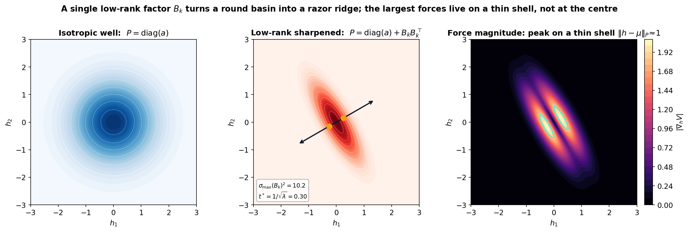
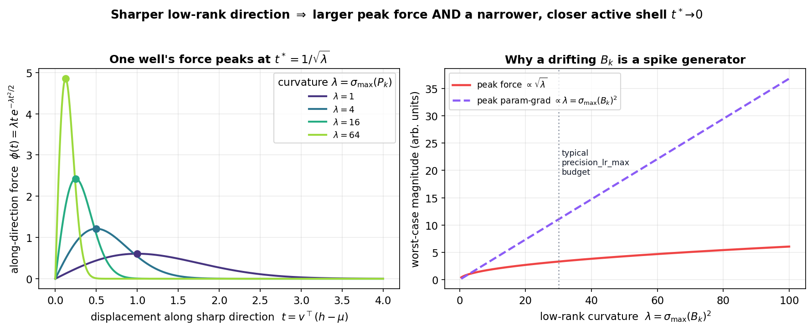
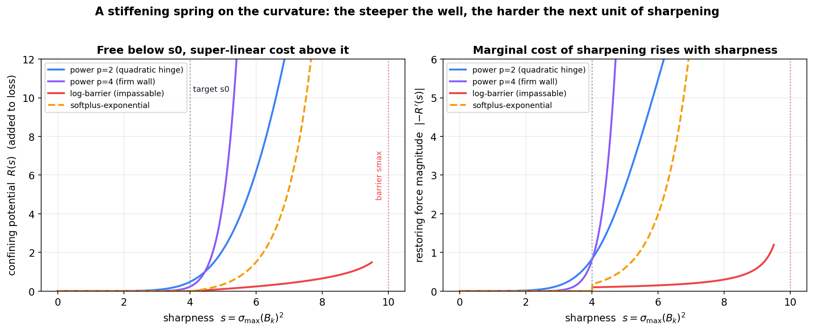
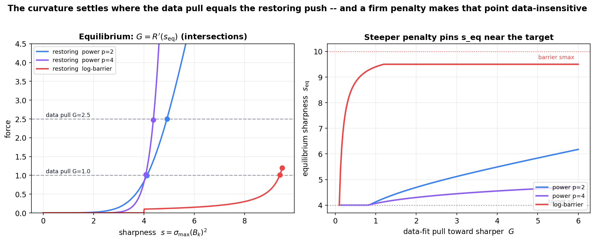
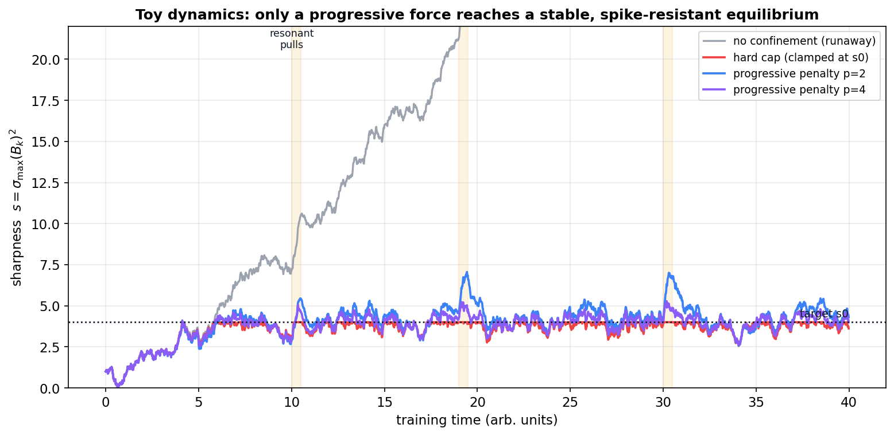
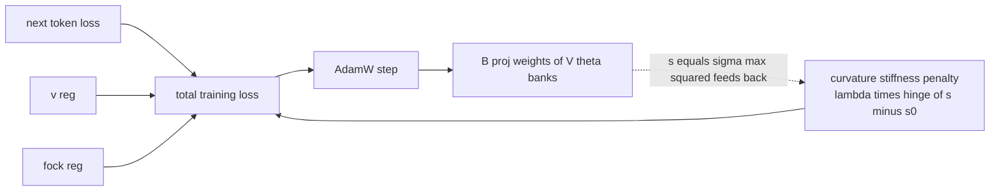
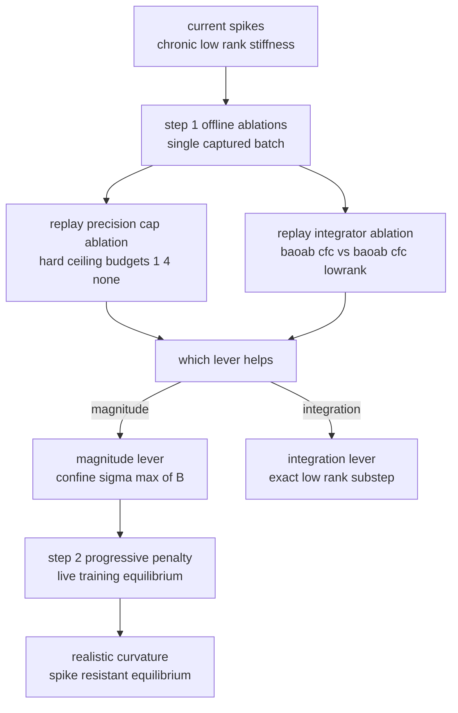

# Progressive Curvature Confinement for the Anisotropic Gaussian $V_\theta$

Companion to
[`CfC_BAOAB_Integrator_and_Mitigations.md`](CfC_BAOAB_Integrator_and_Mitigations.md)
(§40 integrator ablation, §41 chronic low-rank dominance) and to
[`Diagnostic_Programme_in_CfC_BAOAB_Integrator.md`](Diagnostic_Programme_in_CfC_BAOAB_Integrator.md)
(§3 spike-generation derivation, §13 the integrator-ablation replay).

The diagnostic programme established that the violent, chronic gradient
spikes in the `L=8`, `d=384` anisotropic-Gaussian OpenWebText run are the
training gradient of a **sharp, low-rank direction** in the well becoming
briefly resonant with the data. Bounding that sharpness after the fact — a
watchdog reload, or the hard `precision_lr_max` ceiling — treats the symptom.
This note asks the constructive question instead:

> Can we augment the training loop so that the **steeper an anisotropic
> Gaussian becomes, the harder it is to steepen it further** — a
> self-limiting restoring force that grows with curvature, so the well
> settles at a finite, realistic sharpness in equilibrium rather than
> running away? And are there optimisers that promote this behaviour
> natively?

The answer is yes, and the mechanism is an **anharmonic confining prior on
the curvature**: a penalty whose *marginal* cost rises with sharpness. The
`precision_lr_max` cap already in the codebase is a crude, hard-ceiling
precursor of it, and the two ablation experiments queued right now
(`replay_precision_cap_ablation`, `replay_integrator_ablation`) are the first
step of the same programme — they measure, offline and per-batch, whether
confining the curvature is the right lever before committing a live run to it.

---

## Table of Contents

1. [The question: making sharpening self-limiting](#1-the-question-making-sharpening-self-limiting)
2. [What we confine: the sharpness scalar](#2-what-we-confine-the-sharpness-scalar)
3. [Why sharpness runs away without a restoring force](#3-why-sharpness-runs-away-without-a-restoring-force)
4. [`precision_lr_max`: the crude precursor already in the codebase](#4-precision_lr_max-the-crude-precursor-already-in-the-codebase)
5. [Progressive confinement: a stiffening spring on the curvature](#5-progressive-confinement-a-stiffening-spring-on-the-curvature)
6. [The equilibrium: force balance and fluctuation–dissipation](#6-the-equilibrium-force-balance-and-fluctuationdissipation)
7. [A reparameterised self-limiting alternative](#7-a-reparameterised-self-limiting-alternative)
8. [Which optimisers embody this?](#8-which-optimisers-embody-this)
9. [Reference implementation](#9-reference-implementation)
10. [The current ablations are step 1 of this programme](#10-the-current-ablations-are-step-1-of-this-programme)
11. [Scope, caveats, and a decision rule](#11-scope-caveats-and-a-decision-rule)
12. [Status and next steps](#12-status-and-next-steps)

---

## 1. The question: making sharpening self-limiting

The pathology, in one line: under `integrator='baoab_cfc'` the off-diagonal
factor $B_k$ of the anisotropic well grows over training, and once it is
sharp enough a subset of tokens lands on the well's steep flank, producing a
gradient one to three orders of magnitude larger than normal for a single
step. The chronic character — the same low-rank term dominating the well's
exponent at share ≈ 0.999 across every replayed capture (companion note §41)
— tells us this is not a transient of one bad batch; it is a **weight-space
stiffness that keeps drifting upward**.

What we want is not a wall that the curvature slams into (that is the
watchdog and the hard cap), but a **spring**: a force that is negligible
while the curvature is reasonable, then pushes back ever more firmly the
sharper the well becomes, so that ordinary training reaches a stable
equilibrium at a *meaningful* curvature and stays there. The rest of this
note makes that precise, connects it to the machinery already present, and
places the current ablations as its first experimental step.

---

## 2. What we confine: the sharpness scalar

Each context channel's scalar potential is a mixture of $K$ inverted
Gaussians whose precision is diagonal-plus-low-rank:

$$V(h;\xi) = -\sum_{k=1}^{K} w_k \exp\big(-\tfrac{1}{2}(h-\mu_k)^\top P_k (h-\mu_k)\big), \qquad P_k = \mathrm{diag}(a_k) + B_k B_k^\top.$$

Expanding the quadratic form reproduces exactly the two terms the model
computes in `AnisotropicMixtureGaussianVTheta.forward`
(`diag_term` and `lr_term`):

$$(h-\mu_k)^\top P_k (h-\mu_k) = \sum_j a_{k,j}(h_j - \mu_{k,j})^2 + \lVert B_k^\top (h-\mu_k) \rVert^2.$$

The **diagonal** part is a benign per-axis spring; the diagnostic programme
found it contributes essentially nothing to the exponent (its share is under
0.1%). All of the curvature that matters lives in the **off-diagonal**
low-rank part $B_k B_k^\top$. The scalar that measures how sharp that part is
is the top squared singular value of $B_k$:

$$s_k \equiv \sigma_{\max}(B_k)^2 \le \lVert B_k \rVert_F^2 = \mathrm{tr}(B_k B_k^\top).$$

$s_k$ is the object we want to confine. Two cheap, differentiable proxies for
it are available, and both matter below:

- $\lVert B_k \rVert_F^2$ — the Frobenius norm of the *realised* factor for a
  given context (what `_bound_lowrank` already caps; conservative by up to a
  factor `rank`).
- $\sigma_{\max}(W_k^{B})^2$ where $W_k^{B}$ is bank $k$'s `B_proj.weight`
  — a **producible-capacity** bound: since $B_k$ is a linear readout of the
  context, $\sigma_{\max}(W_k^B)$ bounds how sharp $B_k$ can get for bounded
  context. This is exactly the quantity Cell 6 already logs as
  `b_proj_sigma_max` (`bproj_sig` in the step line, sitting around 29.6 in
  the live run), so a penalty built on it confines a number we are already
  watching.



(The well/force geometry above is reproduced from the diagnostic programme
note, where §3 derives it in full; it is the picture the confinement is
meant to keep from degenerating into a razor ridge.)

---

## 3. Why sharpness runs away without a restoring force

The diagnostic programme's §3 derivation (summarised here) is what makes an
unconfined $s_k$ dangerous. Along the sharpest eigendirection $v$ of $P_k$
with curvature $\lambda = \sigma_{\max}(P_k)$, the one-dimensional force of a
single well is

$$\phi(t) = \lambda t \exp(-\tfrac{1}{2}\lambda t^2), \qquad t = v^\top (h - \mu_k),$$

which peaks at $t_\star = 1/\sqrt{\lambda}$ with height $\phi(t_\star) = \sqrt{\lambda/e}$. So the **peak force grows like** $\sqrt{\lambda}$, and the
worst-case gradient with respect to the factor $B_k$ grows like $\lambda = s_k$ itself. Sharper wells therefore both hit harder *and* concentrate their
force on a thinner, closer shell — a spike generator that gets worse
monotonically as $s_k$ drifts up.



Crucially, nothing in the plain training objective opposes this drift: the
data-fit gradient generally *rewards* sharper wells (they lower next-token
loss on the tokens they capture), and the diagonal precision and the
softmax weights do not restrain the off-diagonal factor. Left alone, $s_k$
is a free coordinate under a persistent upward pull. A confining force is
exactly what is missing.

---

## 4. `precision_lr_max`: the crude precursor already in the codebase

The model already ships one restraint on $s_k$:
`AnisotropicMixtureGaussianVTheta._bound_lowrank`. It is a **hard,
reparameterised ceiling** — a differentiable `tanh` cap on the Frobenius
norm of each well's factor:

```python
def _bound_lowrank(self, B: torch.Tensor) -> torch.Tensor:
    if self._precision_lr_max is None or self.rank == 0:
        return B
    budget = self._precision_lr_max ** 0.5
    fro = B.flatten(-2, -1).norm(dim=-1).clamp(min=1e-12)     # (..., K)
    scale = budget * torch.tanh(fro / budget) / fro          # (..., K)
    return B * scale.unsqueeze(-1).unsqueeze(-1)
```

Writing $b = \sqrt{\text{precision-lr-max}}$, the effective factor norm is

$$\lVert B \rVert_F = b\tanh(\lVert B_{\mathrm{raw}} \rVert_F / b),$$

which is the identity for small norms and asymptotes to $b$ from below for
large ones. Because $\sigma_{\max}(B_k) \le \lVert B_k \rVert_F$, this
guarantees $s_k \lt \text{precision-lr-max}$. It is currently `None`
(disabled) in the training config.

This is a genuine curvature restraint, and in the *reparameterisation* sense
it is already "progressively hard": as $\lVert B_{\mathrm{raw}} \rVert_F$
grows, the map's derivative $\to 0$, so additional raw drive buys vanishing
extra output. But it has two limitations that motivate the softer form in §5:

1. **It is a ceiling, not an equilibrium.** The curvature is free right up to
   $b$ and then simply stops; there is no negotiation with the data about
   where a *realistic* sharpness lies. You must know the right cap in
   advance.
2. **It hides growth instead of opposing it.** The cap acts on the *output*;
   it adds no term to the loss, so the optimiser keeps pushing the raw
   `B_proj` weights outward even after the output has saturated. The visible
   $\lVert B \rVert_F$ is pinned, but $\lVert B_{\mathrm{raw}} \rVert_F$ (and
   the raw weights behind it) can drift unboundedly into the saturated
   region, where the gradient through the `tanh` is near zero — a recipe for
   dead gradients and brittle behaviour if the cap is ever relaxed.


The programme's next step (§5) keeps the good part — a bound on $s_k$ — while
replacing the ceiling with a restoring force that (a) negotiates an
equilibrium with the data and (b) pushes the real parameters back rather than
hiding their growth.

---

## 5. Progressive confinement: a stiffening spring on the curvature

Add to the loss a **confining potential** $R(s_k)$ on the sharpness of each
bank, chosen so its restoring force $-R'(s_k)$ is negligible below a target
$s_0$ and grows super-linearly above it. Three families, in increasing
firmness:

**Power (quadratic-hinge and beyond).** The workhorse:

$$R_p(s_k) = \lambda [\mathrm{softplus}(\beta(s_k - s_0))]^p, \qquad p \ge 2.$$

Below $s_0$ the cost is ~0 (the well shapes itself freely); above it the
restoring force

$$-R_p'(s_k) = -\lambda p \beta [\mathrm{softplus}(\beta(s_k - s_0))]^{p-1} \sigma(\beta(s_k - s_0))$$

grows like $(s_k - s_0)^{p-1}$, so each additional unit of sharpening costs
progressively more. Larger $p$ makes the wall firmer; $p=2$ is the gentlest
progressive form, $p=4$ a firm one.

**Log-barrier (a limit that cannot be crossed).** For a genuine impassable
ceiling $s_{\max}$ that is still fully differentiable:

$$R_b(s_k) = -\lambda \log(s_{\max} - s_k), \qquad s_k \lt s_{\max}.$$

The restoring-force magnitude $\lambda/(s_{\max} - s_k) \to \infty$ as
$s_k \to s_{\max}$, so the curvature is mathematically forbidden from
crossing $s_{\max}$ — the smooth realisation of "apply a limit which cannot
be crossed" (an interior-point barrier). It needs $s_k \lt s_{\max}$ at
initialisation and injects large gradients near the wall, so it pairs
naturally with the per-group clip already in place.

**Softplus-exponential (threshold, then steep).** A middle ground:

$$R_e(s_k) = \lambda [\exp(\beta(s_k - s_0)) - 1]_+.$$

Negligible below $s_0$, exponential resistance above — firmer than the power
form, gentler than the pole of the barrier.



All three are **optimiser-agnostic**: they are ordinary loss terms and ride
on the existing AdamW. All three target the same $s_k$ we already log. The
difference from the `precision_lr_max` ceiling is that the force acts on the
*parameters* (it back-propagates into `B_proj`), so it opposes the drift
rather than saturating it.

---

## 6. The equilibrium: force balance and fluctuation–dissipation

The reason a progressive penalty reaches a stable, realistic curvature is a
force balance. Treat $s_k$ as a coordinate under the persistent data-fit pull
$G$ (§3) opposed by the restoring force. At equilibrium

$$G = R'(s_{\mathrm{eq}}),$$

and the steeper $R$ is, the more $s_{\mathrm{eq}}$ is pinned near $s_0$ almost
independently of how hard the data pulls. That data-insensitivity is the
whole point: it converts "curvature is a free coordinate under an upward
pull" into "curvature relaxes to a set point".



For the simplest quadratic confinement $R(s) = \tfrac{\lambda}{2}(s - s_0)^2$
(active above $s_0$), the stochastic-gradient dynamics of $s$ become an
Ornstein–Uhlenbeck process,

$$\mathrm{d}s = (G - \lambda(s - s_0))\mathrm{d}t + \eta\mathrm{d}W,$$

with stationary mean $s_{\mathrm{eq}} = s_0 + G/\lambda$ and stationary
variance $\eta^2/(2\lambda)$ — a fluctuation–dissipation balance in which the
penalty is the dissipative restoring force and the (intermittent) data-fit
gradient is the forcing. Raising $\lambda$ (or the power $p$) tightens both
the mean and the spread, and in particular damps the transient excursions
that a resonant batch would otherwise turn into a spike.



The trajectory panel makes the qualitative claim concrete (it is a
transparent integration of the SDE above, not a drawing): the unconfined
coordinate drifts away under the resonant pulls, the hard cap pins it flat
but tells the data nothing, and the progressive penalties settle near $s_0$
and pull the resonant excursions back — with $p=4$ absorbing them more
tightly than $p=2$.

---

## 7. A reparameterised self-limiting alternative

If a loss term with a coefficient to tune is unwelcome, the same
self-limiting behaviour can be built **by construction**, so no penalty is
needed. Centre a smooth squash on the target rather than a hard ceiling:

$$B_k = s_0^{1/2} \frac{\tilde B_k}{\sqrt{1 + (\lVert \tilde B_k \rVert_F / s_0^{1/2})^2}}.$$

This asymptotes toward $s_0^{1/2}$ with vanishing marginal gain, i.e. the
effective gradient that can push sharpness past $s_0$ shrinks to zero — a
softer cousin of `_bound_lowrank`, but centred on a *target* with graded
resistance rather than a hard budget. Its advantage over the penalty is that
there is no coefficient to balance against the data loss; its disadvantage is
that it shares the ceiling's "hides growth" property (§4) and fixes the
geometry rather than letting the data negotiate $s_{\mathrm{eq}}$. In
practice the penalty (§5) is preferable when you want the curvature to find
its own realistic level, and the reparameterisation is preferable when you
want a guaranteed bound with no tuning.

A useful third option is to **anneal** the penalty coefficient $\lambda$ (or
lower the target $s_0$) on a schedule: permissive early, so the wells can
find useful shape while the model is still forming, then progressively
confining. This matches the "settle into equilibrium" intent and avoids
over-constraining a half-trained model.

---

## 8. Which optimisers embody this?

The user's second question — are there optimisers that promote this approach?
No mainstream optimiser targets *output-space Gaussian curvature* directly;
optimisers act in parameter space. But several families embody "harder to
move where the geometry is stiff", in decreasing order of fit to this
problem:

| Family | What it does | Fit to curvature confinement |
| --- | --- | --- |
| Spectral-norm regularisation / normalisation | penalise or normalise the top singular value of a weight matrix (Lipschitz control) | closest match; §5's power/barrier penalties on sigma-max of B-proj are exactly this, specialised to the well factor |
| Decoupled weight decay on B-proj, mu-proj | a linear restoring force toward zero | cheapest version, one extra param group; but linear only, and shrinks the useful part too |
| Natural gradient, K-FAC, Shampoo | precondition by curvature, taking smaller steps in stiff directions | damps the stiff mode in principle, but the spikes are intermittent and Fisher estimates are averaged, so reaction can lag; heavy |
| Trust-region, proximal, mirror / Riemannian | encode a metric or proximal cost that grows toward high sharpness | the same equilibrium idea in the optimiser geometry; more machinery than the explicit penalty for the same result |

The honest summary: the **explicit confining penalty of §5 is the most
direct, controllable, optimiser-agnostic route**, and it *is* the mechanism
behind spectral-norm regularisation. Second-order and Riemannian methods
express the same intuition indirectly, at higher cost, with a real risk of
not catching intermittent spikes. Decoupled weight decay on the `B_proj` /
`mu_proj` groups is a cheap linear special case worth trying as a baseline.

---

## 9. Reference implementation

A drop-in penalty that confines the producible-capacity proxy
$s_k = \sigma_{\max}(W_k^B)^2$ — the same `b_proj_sigma_max` Cell 6 already
logs — with a power-hinge, computed cheaply by a couple of power-iteration
steps and back-propagated into the `B_proj` weights:

```python
def _spectral_norm(W, n_iter=2, eps=1e-12):
    """Largest singular value of a 2D weight via power iteration.
    Cheap, differentiable, deterministic given the fixed init vector."""
    v = W.new_ones(W.shape[1])
    v = v / (v.norm() + eps)
    for _ in range(n_iter):
        u = W @ v
        u = u / (u.norm() + eps)
        v = W.t() @ u
        v = v / (v.norm() + eps)
    return u @ (W @ v)            # u^T W v  ~= sigma_max(W)


def curvature_stiffness_penalty(model, s0, lam, p=2, n_iter=2):
    """Progressive confinement of the off-diagonal curvature (this note,
    sections 5-6). Penalises each V_theta bank's producible sharpness
    proxy s_k = sigma_max(B_proj_k.weight)^2 -- the SAME quantity Cell 6
    logs as b_proj_sigma_max -- with a power-hinge whose restoring force
    grows like (s_k - s0)_+^(p-1). Below s0 the term is ~0 (wells shape
    freely); above it, each further unit of sharpening costs progressively
    more, so training settles at a finite equilibrium instead of running
    away. Optimiser-agnostic: add lam-weighted to the loss next to
    fock_reg. s0 is in units of sigma_max(B_proj.weight)^2, so set it from
    the logged b_proj_sigma_max trajectory (currently ~29.6, i.e. s ~ 875)
    and the precision-cap ablation, NOT from a first-principles target."""
    total = None
    for bank in model.V_theta.banks:
        if getattr(bank, "B_proj", None) is None:
            continue
        sig = _spectral_norm(bank.B_proj.weight, n_iter=n_iter)
        s_k = sig * sig
        term = torch.nn.functional.softplus(s_k - s0) ** p
        total = term if total is None else total + term
    if total is None:
        return model.E.weight.new_zeros(())
    return lam * total
```

Wire it into the existing loss composition (mirroring the `fock_reg`
plumbing) with an optional warmup on the coefficient:

```python
loss = ntp_loss + LAMBDA_V * v_reg + LAMBDA_FOCK_REG * fock_reg
if CURV_PENALTY_LAM > 0.0:
    curv_lam_now = CURV_PENALTY_LAM * min(1.0, step / max(1, CURV_WARMUP))
    loss = loss + curvature_stiffness_penalty(
        model, s0=CURV_S0, lam=curv_lam_now, p=CURV_P)
```

Because the penalty is a function of the same `b_proj_sigma_max` already in
every step line, you can watch $s_k$ relax toward equilibrium directly in the
existing log with no new instrumentation:



---

## 10. The current ablations are step 1 of this programme

The two ablations queued right now are not a detour from this idea — they are
its **first, offline, per-batch measurement**, taken before committing a live
run to any confinement. Framed against this note:

- `replay_precision_cap_ablation(step_tag, budgets=[1.0, 4.0, None])` applies
  the **hard-ceiling precursor** (§4) at several budgets to a captured spike
  batch and reports whether bounding $s_k$ collapses the pre-clip gradient.
  It answers "does confining the curvature help at all, and roughly where is
  the useful ceiling?" — i.e. it **brackets** $s_0$ for the progressive
  penalty.
- `replay_integrator_ablation(step_tag, lowrank_layers={0,1,2})` swaps
  `baoab_cfc` for the exact `baoab_cfc_lowrank` substep on the same batch. It
  answers a different question: is the spike a **magnitude** problem (the
  factor is too sharp, so confinement is the right lever) or an
  **integration-error** problem (the explicit off-diagonal kick is wrong, so
  exact integration is the right lever)?

Together they tell you which lever to pull. If the precision cap collapses the
spike, the progressive penalty of §5 is the principled live form of that same
lever — with `precision_lr_max` recognised as its crude, hard-ceiling
precursor. If instead only the exact integrator helps, the fix is
integration, not confinement, and this programme is the wrong track for that
particular mode.



---

## 11. Scope, caveats, and a decision rule

**This targets mechanism A only.** Companion note §41 found two mechanisms:
the chronic low-rank / $V_\theta$ stiffness (mechanism A), which this note
addresses, and an episodic reverse-channel-led early-layer cascade
(mechanism B, event 48,917), which confining $B_k$ does nothing for. A
reverse-channel-side restraint is a separate track.

**You are choosing what "realistic curvature" means.** The target $s_0$ (and
barrier $s_{\max}$) is a modelling decision. Pick it empirically, not
arbitrarily: `Cell 6b-2` brackets $\sigma_{\max}(B_k)^2$, the logged
`b_proj_sigma_max` trajectory shows where the run actually sits (~29.6, so
$s \approx 875$ in producible-capacity units), and the precision-cap ablation
shows which cap tames the spike without hurting the fit. Recall that >99.9%
of well–token pairs are currently numerically dead (their exponent
underflows to a true zero), so $s_0$ should be low enough to un-saturate
them, not merely low enough to stop the spikes.

**Do not over-flatten.** A penalty that is too strong or a target that is too
low removes the anisotropy the well needs to be expressive. The equilibrium
should sit where the data genuinely wants moderate sharpness; the annealing
schedule of §7 is the safeguard against clamping a half-formed model.

**Decision rule.** If `replay_precision_cap_ablation` shows a cap collapses
the mechanism-A spikes with little damage to the loss, adopt the progressive
penalty of §5 for the live run, seeding $s_0$ from the ablation's useful
budget and annealing $\lambda$ over the warmup. If the cap does not help but
`replay_integrator_ablation` does, the lever is integration, not confinement,
and the effort moves to the integrator track (companion note §40). If neither
helps, the mechanism is not the off-diagonal curvature at all and the search
returns to the diagnostic programme.

---

## 12. Status and next steps

- **Now (offline):** run the two ablations of §10 on the captured bundles
  (47,116 / 48,507 / 48,917) to bracket $s_0$ and identify the lever.
- **If confinement is the lever (live):** add `curvature_stiffness_penalty`
  (§9) to the loss with a warmup, seed $s_0$ from the ablation, and watch
  `b_proj_sigma_max` relax toward equilibrium in the existing step line.
- **Baseline to try in parallel:** decoupled weight decay on the `B_proj` /
  `mu_proj` parameter groups (§8) — the cheap linear special case.
- **Open:** a mechanism-B restraint on the reverse channel, tracked
  separately from this curvature work.

---

Provenance. The well energy/force in §2-§3 and the `_bound_lowrank` excerpt
in §4 are the exact code of
`notebooks/conservative_arch/parf/model_aniso_gaussian_vtheta.py`
(`AnisotropicMixtureGaussianVTheta.forward` / `analytical_grad` /
`_bound_lowrank`). The spike-generation derivation and the well/force figures
(`dp_well_landscape.png`, `dp_force_profile.png`) are reproduced from
companion note
[`Diagnostic_Programme_in_CfC_BAOAB_Integrator.md`](Diagnostic_Programme_in_CfC_BAOAB_Integrator.md)
§3. The four confinement figures (`cc_confining_potentials.png`,
`cc_equilibrium.png`, `cc_cap_vs_penalty.png`, `cc_trajectory.png`) are
produced by `figures/_make_curvature_confinement_figs.py`: the potential,
force, equilibrium, and tanh-cap panels are exact evaluations of the
functions defined in this note, and the trajectory panel is a transparent
integration of the sharpness SDE of §6 (seeded, not fit). The chronic
low-rank dominance, the two-mechanism taxonomy, and the two ablation helpers
(`replay_precision_cap_ablation`, `replay_integrator_ablation`) are documented
in companion note
[`CfC_BAOAB_Integrator_and_Mitigations.md`](CfC_BAOAB_Integrator_and_Mitigations.md)
§40-§41.

Last updated: 31 August 2026 (initial version: derives progressive curvature
confinement as a self-limiting restoring force on the anisotropic-Gaussian
off-diagonal sharpness, describes the existing `precision_lr_max` cap as its
crude hard-ceiling precursor, surveys the optimiser families that embody the
idea, gives a drop-in `curvature_stiffness_penalty` reference implementation,
and places the current `replay_precision_cap_ablation` /
`replay_integrator_ablation` runs as step 1 of the programme).
