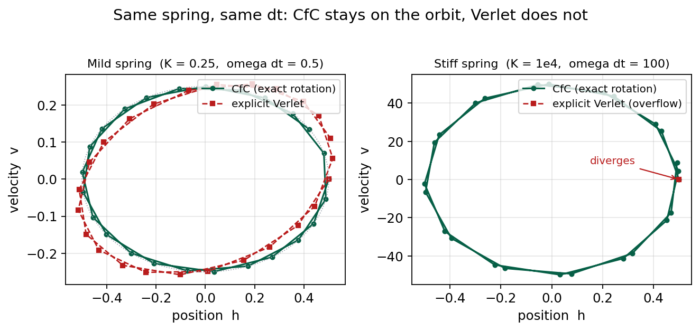
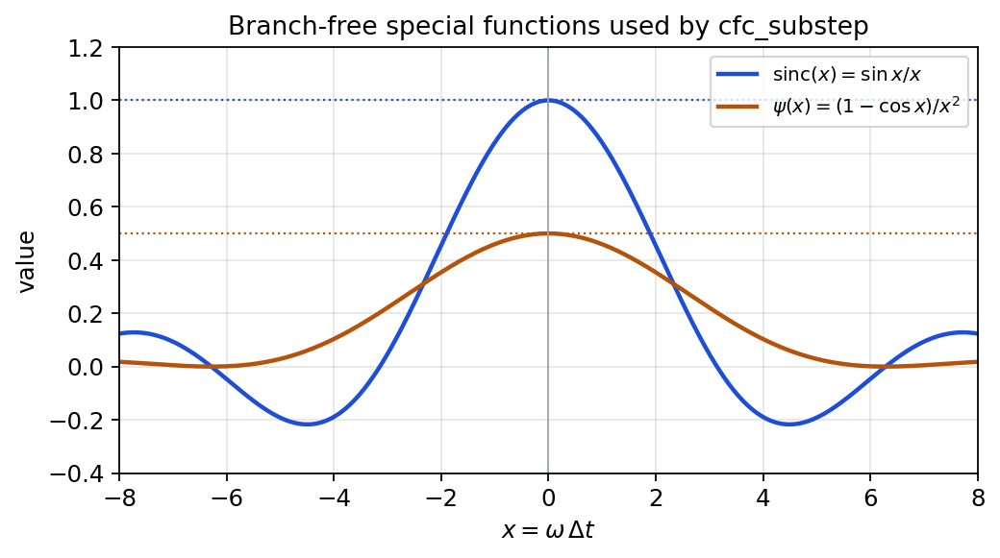
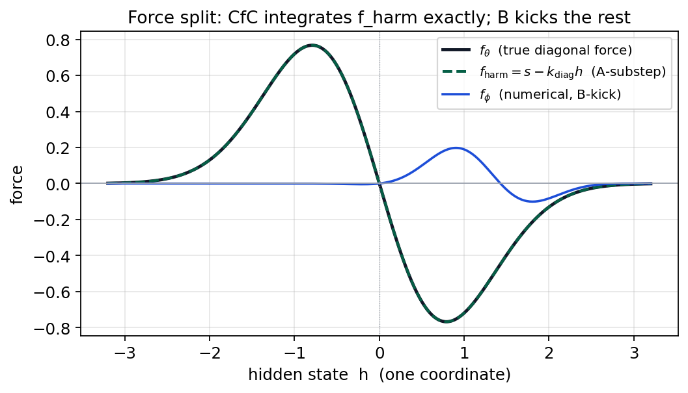
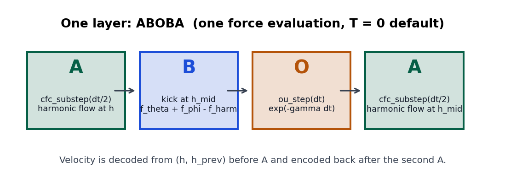

# PyTorch Implementation of CfC + BAOAB in Fock-PARFLM

A code-level deep dive into the production integrator that replaced
damped velocity-Verlet in Fock-PARFLM. The mathematics of the split
already live in the companion notes listed below; this document is
about how those equations are realised as PyTorch tensors, how
autograd is kept honest, and which primitives do the work.

**Date:** August 2026

> **Provenance note.** This file mirrors the canonical copy at
> [`docs/BAOAB/PyTorch_Implementation_of_CfC_BAOAB_in_Fock-PARFLM.md`](https://github.com/dimitarpg13/semantic_simulation/blob/main/docs/BAOAB/PyTorch_Implementation_of_CfC_BAOAB_in_Fock-PARFLM.md)
> in [`dimitarpg13/semantic_simulation`](https://github.com/dimitarpg13/semantic_simulation),
> copied here so the CfC/BAOAB implementation deep dive sits alongside the
> theory companions it documents. Figure and cross-reference paths below
> are relative to this repository (`semsimula-paper`), not the source copy.

**Implementation (semsimula-paper):**
`notebooks/conservative_arch/parf/cfc_baoab.py`,
`model_parf_multixi.py`,
`model_aniso_gaussian_vtheta.py`,
`model_fock_parf_multixi.py`,
`test_cfc_baoab.py`,
`scaleup/colab_fock_cfc_baoab_aniso_gaussian_openwebtext_d384.ipynb`

**Theory companions (semsimula-paper):**
[Closed-Form and Hybrid Integration Strategies](Closed_Form_and_Hybrid_Integration_Strategies_for_Fock-PARFLM.md)
(§4–5, §10),
[Blended CfC BAOAB Deep Dive](Blended_CfC_BAOAB_Deep_Dive.md)
(§3–5, §10),
[Modified BAOAB with STP Identity](Modified_BAOAB_with_STP_identity_Detailed_Analysis.md)
(§1.2, §3).

> **Rendering note.** This document uses GitHub-native `$...$` / `$$...$$`
> math and fenced `mermaid` blocks. Figures live in
> [`companion_notes/images/`](images/) and are generated by
> [`_make_cfc_baoab_impl_figures.py`](images/_make_cfc_baoab_impl_figures.py).

---

## Table of Contents

1. [What this document is, and is not](#1-what-this-document-is-and-is-not)
2. [File map](#2-file-map)
3. [The equation being integrated](#3-the-equation-being-integrated)
4. [Why Verlet is the wrong default](#4-why-verlet-is-the-wrong-default)
    - [The Verlet stability bound](#41-the-verlet-stability-bound)
    - [Why this bound was not checked before the OWT runs](#42-why-this-bound-was-not-checked-before-the-owt-runs)
    - [Why not a different explicit symplectic integrator?](#43-why-not-a-different-explicit-symplectic-integrator)
5. [The integrator switch](#5-the-integrator-switch)
6. [The pure-maths module](#6-the-pure-maths-module)
7. [Velocity encoding](#7-velocity-encoding)
8. [Exposing the harmonic part of V_theta](#8-exposing-the-harmonic-part-of-v_theta)
9. [Force evaluation and autograd](#9-force-evaluation-and-autograd)
10. [One layer: `_layer_step_langevin`](#10-one-layer-_layer_step_langevin)
11. [Fock threading and per-layer checkpointing](#11-fock-threading-and-per-layer-checkpointing)
12. [Why the layer is fatter than Verlet](#12-why-the-layer-is-fatter-than-verlet)
13. [What the tests actually certify](#13-what-the-tests-actually-certify)
14. [The training notebook](#14-the-training-notebook)
15. [Notation](#15-notation)
16. [References](#16-references)

---

## 1. What this document is, and is not

The companion notes construct a **blended** CfC propagator
([Blended CfC, §5.4](Blended_CfC_BAOAB_Deep_Dive.md))
and a textbook **BAOAB** sequence with two B-kicks
([Blended CfC, §3](Blended_CfC_BAOAB_Deep_Dive.md);
[Modified BAOAB, §1.2](Modified_BAOAB_with_STP_identity_Detailed_Analysis.md)).
The production code implements a close cousin that is cheaper to
differentiate and cheaper to compare against Verlet:

| Theory note | Production code |
| --- | --- |
| BAOAB (B at both ends) | **ABOBA**: one force evaluation per layer |
| Blended multi-well $\Phi_{\mathrm{blend}}$ | **Diagonal** CfC of $k_{\mathrm{diag}}$, residual in the B-kick |
| Isotropic Gaussian $V\_\theta$ | Anisotropic wells (diagonal + rank - $r$ $B_k$) |
| Active thermostat | $T = 0$ by default (exact friction, no FDT noise) |

The split is constructed so that **the force field is unchanged**.
CfC changes how the stiff diagonal of $V\_\theta$ is propagated, not
what force is being integrated. That is the property
`test_cfc_force_preservation` checks, and it is what makes a
Verlet-versus-CfC PPL comparison interpretable
([Closed-Form Strategies, §5](Closed_Form_and_Hybrid_Integration_Strategies_for_Fock-PARFLM.md);
[Blended CfC, §5.1](Blended_CfC_BAOAB_Deep_Dive.md)).

---

## 2. File map

The integrator is deliberately factored so the mathematics can be
tested without constructing a Fock stack.

```mermaid
flowchart TB
    cfc["cfc&#95;baoab.py<br>sinc psi cfc&#95;substep ou&#95;step"]
    aniso["model&#95;aniso&#95;gaussian&#95;vtheta.py<br>harmonic&#95;terms analytical&#95;grad"]
    multixi["model&#95;parf&#95;multixi.py<br>&#95;layer&#95;forces, &#95;layer&#95;step&#95;langevin"]
    fock["model&#95;fock&#95;parf&#95;multixi.py<br>&#95;fock&#95;layer&#95;step, &#95;stack&#95;forward"]
    tests["test&#95;cfc&#95;baoab.py"]
    nb["colab d384 OWT notebook"]

    cfc --> multixi
    aniso --> multixi
    multixi --> fock
    cfc --> tests
    aniso --> tests
    fock --> tests
    fock --> nb
```



- `cfc_baoab.py` does not import the model. Every function maps tensors
  to tensors. That is why the exactness and stiffness tests are cheap.
- `harmonic_terms` lives on $V\_\theta$, not on the integrator: the
  propagator is written in terms of a force and a stiffness, so any
  well family that can expose those two tensors can use CfC.
- `MultiXiPARFLM._layer_step_langevin` is the only place the pieces
  are composed.
- `FockMultiXiPARFLM._fock_layer_step` calls `_layer_step_ex` and
  threads the outgoing `h_prev` so velocity survives the Fock
  wraparound.

---

## 3. The equation being integrated

Per token, per layer, the hidden state $h \in \mathbb{R}^d$ and
velocity $v \in \mathbb{R}^d$ obey the damped Newton equation of
[Closed-Form Strategies, §2](Closed_Form_and_Hybrid_Integration_Strategies_for_Fock-PARFLM.md):

$$
\mathfrak{m}\ddot{h} + \gamma\dot{h} = -\nabla_h V_\theta(h;\xi) - \nabla_h V_\phi(h) + Q(h, r).
$$

$V\_\theta$ is the depth-conditioned anisotropic Gaussian well bank
(conservative, closed form). $V\_\phi$ is the sparse pairwise
potential (conservative, numerical). $Q$ is the Fock reverse-channel
generalised force (non-conservative, numerical). $\xi$ is the
multi-horizon context. $r$ is the register state.

The historical discretisation is damped velocity-Verlet, one force
evaluation per layer:

$$
h^{+} = h + \frac{h - h_{\mathrm{prev}}}{1 + \gamma\Delta t} + \frac{(\Delta t)^{2}}{\mathfrak{m}(1 + \gamma\Delta t)} f, \qquad f = -\nabla_h(V_\theta + V_\phi).
$$

Friction is the first-order padé factor $1/(1+\gamma\Delta t)$, and
$f$ is obtained from `torch.autograd.grad(..., create_graph=True)`.
Both choices are what the new path undoes.

---

## 4. Why Verlet is the wrong default

Two structural facts, stated in the module docstring of
`cfc_baoab.py` and derived in
[Closed-Form Strategies, §4–5](Closed_Form_and_Hybrid_Integration_Strategies_for_Fock-PARFLM.md).

**Stiffness.** A token in a sharp well has local curvature $K$. The
explicit update is stable only while

$$
\omega\Delta t \lt 2, \qquad \omega = \sqrt{K/\mathfrak{m}}.
$$

When a well sharpens during training the layer step crosses that
bound and the state amplifies geometrically down the remaining
layers. From outside that is a gradient spike. The next subsection
is the unit-circle argument that produces the factor of $2$.

### 4.1 The Verlet stability bound

Near a well of curvature $K$ and mass $\mathfrak{m}$ the force is
locally linear,

$$
\mathfrak{m}\ddot{h} = -K(h - \mu).
$$

Shift coordinates so the centre sits at the origin, and write
$\omega = \sqrt{K/\mathfrak{m}}$. The continuous equation is then
$\ddot{h} = -\omega^{2} h$. Its exact flow is a rotation in the
$(h, v)$ plane and never grows.

The production Verlet step at $\gamma = 0$ is

$$
h_{n+1} = 2h_n - h_{n-1} + \frac{(\Delta t)^{2}}{\mathfrak{m}} f_n, \qquad f_n = -K h_n,
$$

which is the two-step recurrence

$$
h_{n+1} = \bigl(2 - (\omega\Delta t)^{2}\bigr) h_n - h_{n-1}.
$$

(The damped form used in training,

$$
h_{n+1} = h_n + \frac{h_n - h_{n-1}}{1 + \gamma\Delta t} + \frac{(\Delta t)^{2} f_n}{\mathfrak{m}(1 + \gamma\Delta t)},
$$

reduces to the undamped recurrence at $\gamma = 0$. Damping only
moves the bound slightly; the sharp statement is for the
conservative step.)

Seek geometric modes $h_n = \lambda^n$. The characteristic
equation is

$$
\lambda^{2} - (2 - \theta)\lambda + 1 = 0, \qquad \theta := (\omega\Delta t)^{2}.
$$

The product of the roots is $1$, so the map is area-preserving:
either both roots lie on the unit circle, or one has
$|\lambda| \gt 1$ and the other is its reciprocal. Equivalently,
the companion matrix

$$
\begin{pmatrix} h_{n+1} \cr h_n \end{pmatrix} = \begin{pmatrix} 2-\theta & -1 \cr 1 & 0 \end{pmatrix} \begin{pmatrix} h_n \cr h_{n-1} \end{pmatrix}
$$

has determinant $1$ and is stable if and only if the absolute
value of its trace is at most $2$. The roots are

$$
\lambda_{\pm} = \frac{2 - \theta \pm \sqrt{(2-\theta)^{2} - 4}}{2}.
$$

They are complex conjugates of modulus $1$ precisely when the
discriminant is non-positive,

$$
|2 - \theta| \le 2 \qquad\Longleftrightarrow\qquad 0 \le \theta \le 4 \qquad\Longleftrightarrow\qquad \omega\Delta t \le 2.
$$

Past the bound ($\omega\Delta t \gt 2$, hence $\theta \gt 4$) both
roots are real and

$$
\lambda_{-} = \frac{2 - \theta - \sqrt{\theta(\theta-4)}}{2} \lt -1.
$$

Each layer therefore multiplies that mode by a factor greater
than $1$ in magnitude. Across $L = 16$ layers the state — and
then the gradient through `create_graph` — grows like
$|\lambda_{-}|^{L}$. That is the geometric cascade that reads as
a gradient spike from outside the stack.

The same inequality is a step-size restriction on the well
curvature,

$$
\Delta t \lt 2\sqrt{\frac{\mathfrak{m}}{K}} = \frac{2}{\omega}.
$$

The local period is $T = 2\pi/\omega$, so the bound is
$\Delta t \lt T/\pi$: Verlet is stable only while the layer step
is shorter than about a third of an oscillation. As training
sharpens a well, $K$ rises, $\omega$ rises, and a fixed
$\Delta t = 1$ eventually crosses $2$.

The exact harmonic flow that CfC uses instead,

$$
\begin{pmatrix} h(t+\Delta t) - \mu \cr v(t+\Delta t) \end{pmatrix} = \begin{pmatrix} \cos(\omega\Delta t) & \omega^{-1}\sin(\omega\Delta t) \cr -\omega\sin(\omega\Delta t) & \cos(\omega\Delta t) \end{pmatrix} \begin{pmatrix} h - \mu \cr v \end{pmatrix},
$$

has determinant $1$ and eigenvalues $e^{\pm i\omega\Delta t}$ for
every $\omega\Delta t$. A rotation cannot amplify, which is why
the closed-form A-substep is unconditionally stable in $K$
([Blended CfC, §5.1](Blended_CfC_BAOAB_Deep_Dive.md)).
This is what `test_cfc_stiffness_immunity` certifies, and what
Figure 1 shows.

**Second-order autograd.** $V\_\theta$ sits inside
`autograd.grad(U, h, create_graph=True)`. The force is itself a
graph node, so `loss.backward()` differentiates through the force:
a Hessian-vector product, once per layer, with every well-bank
intermediate saved. Aniso-Gaussian $V\_\theta$ (diagonal plus
rank-$r$ factor $B_k$) makes those intermediates large.

CfC removes the first problem by integrating the locally-harmonic
part of $V\_\theta$ exactly: a harmonic flow is a rotation in phase
space, so it cannot amplify
([Blended CfC, §5.1](Blended_CfC_BAOAB_Deep_Dive.md)).
The analytic force removes $V\_\theta$ from the `create_graph`
chain; only the much smaller $V\_\phi$ graph is differentiated
twice.



**Figure 1.** Twelve steps of the same linear spring. Left: mild
stiffness, both integrators stay on the orbit. Right:
$\omega\Delta t = 100$. Explicit Verlet overflows; CfC remains a
bounded rotation. This is `test_cfc_stiffness_immunity`.

### 4.2 Why this bound was not checked before the OWT runs

It is fair to ask why $\omega\Delta t \lt 2$ was not enforced, or
even evaluated, before Verlet was used as the production integrator
across every isotropic-Gaussian and Aniso-Gaussian $+$ Fock-Reg run
to date. Two things are true at once here, and neither is a good
excuse on its own.

**The bound itself is not new.** $\omega\Delta t \le 2$ is the
textbook stability limit of velocity-Verlet/leapfrog on a harmonic
oscillator — the same criterion that governs time-step choice in
every symplectic-integrator and molecular-dynamics setting (see e.g.
Hairer, Lubich & Wanner, *Geometric Numerical Integration*, or any
MD leapfrog treatment). Nothing in §4.1 required this project's data
to derive; it could have been written down before the first Verlet
run of Fock-PARFLM was ever launched.

**What was missing is a runtime number to compare it against.**
$\omega = \sqrt{K/\mathfrak{m}}$ is not a static hyperparameter fixed
at model-definition time; $K$ is the local curvature of a *learned*
$V\_\theta$ well (the amplitude $a\_k$, the diagonal stiffness, and
for Aniso-Gaussian the rank-$r$ factor $B\_k$), and it moves every
optimiser step as the well sharpens to fit the corpus. A single
pre-flight check at initialisation — with wells still broad and
$K$ small — would have reported $\omega\Delta t \ll 2$ and looked
completely safe, and would not have predicted the crossing that
later happens mid-training as training itself sharpens the wells.
The quantity that needed watching was not a config value to validate
once; it was a distribution over (layer, token, dimension) that had
to be monitored *continuously through training*, and no such
instrumentation existed until `harmonic_terms()` gave $V\_\theta$ a
closed-form way to expose $K$ (§3). Until then, every Verlet run —
the isotropic-Gaussian d384 history, the gamma sweeps, both
Aniso-Gaussian $+$ Fock-Reg OWT arms — was diagnosed purely from
downstream symptoms (raw gradient-norm spikes, watchdog reload
counts, EMA thresholds in
[Training Instabilities](Training_Instabilities_in_Fock-PARFLM_with_structured_V_theta.md)).
That is monitoring the effect, not the mechanism, and it is a real
gap in the original methodology, not a subtlety to gloss over.

The gap is now closed going forward: `stiffness_report()` in the
CfC/BAOAB notebook computes the $\omega\Delta t$ distribution
(median, $p\_{90}$, $p\_{99}$, $p\_{99.9}$, max) over every layer,
token and dimension from `harmonic_terms()` at any point in
training, for **any** integrator arm — it needs `harmonic_terms()`
and $\Delta t$, not the CfC step itself. What it cannot do is
retroactively cover the runs made before it existed. The concrete
way to actually close that loop, rather than leave the connection
between §4.1 and the historical spikes as a plausible-sounding
story, is to reload the surviving Verlet checkpoints (the
`scaf_checkpoint_analysis.ipynb` pipeline already loads exactly
these) at steps bracketing each logged watchdog reload and run
`stiffness_report`-style scoring against them. If $\omega\Delta t$
is at or past $2$ at those steps and comfortably below it in
between, that turns the mechanism argued for above into a
checkpoint-verified fact instead of an inference from the
recurrence alone. That analysis has not been run yet; it is the
natural next step to fully substantiate this section, and is
tracked as open follow-up work rather than settled.

### 4.3 Why not a different explicit symplectic integrator?

A natural objection to §4.1: is $\omega\Delta t \lt 2$ a weakness of
Verlet specifically, or would some other explicit, Euler-family,
symplectic integrator push the bound higher and let us avoid the
CfC rewrite? The short answer is no — the bound is close to the
ceiling for the whole design space Verlet belongs to, not a defect
particular to Verlet's derivation.

**Symplectic (semi-implicit) Euler has the identical bound.** This is
the other classic Euler-family symplectic scheme, one force
evaluation per step:

$$
v_{n+1} = v_n - \omega^{2}\Delta t h_n, \qquad h_{n+1} = h_n + \Delta t v_{n+1}.
$$

Writing one step as $(h_{n+1}, v_{n+1})^{\top} = M(h_n, v_n)^{\top}$,

$$
M = \begin{pmatrix} 1-\omega^{2}\Delta t^{2} & \Delta t \cr -\omega^{2}\Delta t & 1 \end{pmatrix}, \qquad \det M = 1, \qquad \mathrm{tr}(M) = 2-\omega^{2}\Delta t^{2}.
$$

For a $2\times2$ map with $\det M = 1$, both eigenvalues sit on the
unit circle exactly while $\lvert\mathrm{tr}(M)\rvert \le 2$ —
which is $\omega\Delta t \le 2$, the same characteristic equation
shape and the same threshold as §4.1's Verlet recurrence. That is
not a coincidence: velocity-Verlet applied to the harmonic
oscillator is algebraically two symplectic-Euler half-steps glued
together, so of course the two share a bound.

**Higher-order explicit symplectic composition does not raise the
bound — it typically lowers it.** Yoshida- and Forest-Ruth-style
integrators compose several Verlet substeps with carefully chosen
(some negative) substep lengths to cancel the leading local-error
term and reach fourth order. The Suzuki-Sheng theorem says any
*symmetric* composition method of order $\ge 3$ must contain at
least one negative substep, and a negative substep is a
destabilising direction for a stiff linear mode. Composition raises
the *order* of accuracy; it does not raise, and generally shrinks,
the *stability* threshold that matters here.

**This is not an accident of any particular scheme — it is what
"explicit" means.** For a one-step method applied to the linear
equation $\ddot h=-\omega^{2}h$, one step is
$y_{n+1}=R(i\omega\Delta t) y_n$ for some stability function $R$.
An **explicit** method — Verlet, symplectic Euler, any finite
composition of them — evaluates the force a fixed number of times
per step with no matrix inversion, so $R$ is always a *polynomial*
in $z=i\omega\Delta t$. A polynomial is unbounded as
$\lvert z\rvert\to\infty$ along the imaginary axis, so
$\lvert R(i\theta)\rvert$ must exceed $1$ for some finite $\theta$
— there is no explicit method, symplectic or not, for which that
threshold is infinite. This is the imaginary-axis specialisation of
the standard fact that no explicit Runge-Kutta method is A-stable
(Dahlquist): A-stability needs $\lvert R(z)\rvert\le1$ on the entire
closed left half-plane, and only a *rational* $R$ (implicit — a
matrix inverse per step) can do that.

**What actually removes the bound, and at what price.** Two escape
routes exist, and CfC is deliberately the second one, not the first:

- *Implicit symplectic collocation* (implicit midpoint, and its
  higher-stage Gauss-Legendre generalisations) makes $R$ a rational
  Padé approximant to $e^{z}$ instead of a polynomial. Implicit
  midpoint's $R$ has $\lvert R(i\theta)\rvert = 1$ for every real
  $\theta$ — unconditionally stable, for any $\omega\Delta t$. The
  cost: a genuinely implicit, nonlinear equation to solve at every
  layer step for a general (non-quadratic) $V\_\theta$, and even
  where it converges the *phase* is wrong at large $\omega\Delta t$
  — right energy, wrong oscillation frequency, because a Padé[1/1]
  approximant to $e^{i\theta}$ matches modulus exactly but not
  argument.
- *Exact propagation of the locally-frozen linear part* — what
  `cfc_substep` does (§6.2) — replaces the rational
  *approximation* to $e^{i\theta}$ with the true $\cos/\mathrm{sinc}$
  solution. This is unconditionally stable for the same reason
  (§4.1's rotation-matrix argument) **and** phase-exact in the
  frozen-coefficient limit, with no implicit solve, because the
  local model is linear by construction — only $K$ itself changes
  from step to step, not the equation being solved within a step.

CfC is therefore not one adequate fix picked among several
comparably good alternatives to Verlet's bound; within
"explicit, Euler-family, one global $\Delta t$" the $2$ in §4.1 is
close to the best achievable, and the only two ways past it both
require giving up explicitness — CfC gives it up in the strictly
cheaper and more accurate of the two available ways.

---

## 5. The integrator switch

`MultiXiPARFConfig` (and the Fock subclass) gained four fields:

```python
integrator: str = "verlet"          # verlet | baoab | baoab_cfc
vtheta_analytic_force: bool = False # closed-form -grad V_theta
langevin_T: float = 0.0             # thermostat temperature
langevin_noise_eval: bool = False   # sample FDT noise in eval
```

The notebook exposes a single `INTEGRATOR` knob that writes those
fields:

| `INTEGRATOR` | $V\_\theta$ force | Layer step | What it isolates |
| --- | --- | --- | --- |
| `verlet` | autograd | damped Verlet | existing baseline |
| `analytic_vtheta` | closed form | damped Verlet | the `create_graph` cascade alone |
| `baoab` | closed form | ABOBA, free A-drift | the split, no CfC |
| `baoab_cfc` | closed form | ABOBA + `cfc_substep` | the full fix |

`_layer_step_ex` is the dispatcher. Verlet still returns
$(h_{\mathrm{new}}, h)$ so the next layer sees the historical
implicit velocity. The Langevin arms return
$(h_{\mathrm{new}}, h_{\mathrm{prev,out}})$.

```python
def _layer_step_ex(self, h, h_prev, m_b, gamma, dt, layer_idx=0):
    if getattr(self.cfg, "integrator", "verlet") == "verlet":
        return self._layer_step(h, h_prev, m_b, gamma, dt, layer_idx), h
    return self._layer_step_langevin(h, h_prev, m_b, gamma, dt, layer_idx=layer_idx)
```

`_use_analytic_vtheta` turns the closed-form force on whenever the
caller asks for it **or** the integrator is not Verlet (the BAOAB
arms need the force split). It also refuses if
`ln_before_vtheta` is set: that LayerNorm's Jacobian is not in
`analytical_grad`.

---

## 6. The pure-maths module

`cfc_baoab.py` is the whole of the new numerics. It uses four
PyTorch primitives heavily: `torch.sinc`, `torch.cos`,
`torch.exp`, and `torch.randn_like`.

### 6.1 Branch-free special functions

The exact flow of $m\ddot{h} = -K(h-\mu)$ can be written without
ever dividing by $K$ or subtracting a large $\mu$. In terms of the
force $f = -K(h-\mu)$ and $\omega = \sqrt{K/m}$:

$$
h(t+\Delta t) = h + \Delta t\mathrm{sinc}(\omega\Delta t) v + \frac{(\Delta t)^{2}}{m}\psi(\omega\Delta t) f
$$

$$
v(t+\Delta t) = \cos(\omega\Delta t) v + \frac{\Delta t}{m}\mathrm{sinc}(\omega\Delta t) f
$$

with $\mathrm{sinc}(x) = \sin(x)/x$ and
$\psi(x) = (1-\cos x)/x^{2}$. Both limits as
$\omega \to 0$ are finite: $\mathrm{sinc}\to 1$, $\psi\to 1/2$,
and the update degenerates to free drift plus a constant force.
A token far from every well is therefore integrated exactly as an
unforced particle, with no special case
([Closed-Form Strategies, §5.2 and the free-particle limit in §5](Closed_Form_and_Hybrid_Integration_Strategies_for_Fock-PARFLM.md);
[Blended CfC, §5.2](Blended_CfC_BAOAB_Deep_Dive.md)).

PyTorch's `torch.sinc` is the **normalised** $\mathrm{sinc}(x) = \sin(\pi x)/(\pi x)$.
The unnormalised functions are recovered by a change of argument:

```python
def _sinc(x: torch.Tensor) -> torch.Tensor:
    return torch.sinc(x / math.pi)

def _psi(x: torch.Tensor) -> torch.Tensor:
    half = torch.sinc(x / (2.0 * math.pi))
    return 0.5 * half * half
```

`torch.sinc` is defined and smooth at the origin (the kernel
returns $1$ at $x=0$). That is why there is no `torch.where`,
no epsilon, and no branch that would break `create_graph`.



**Figure 2.** The two special functions actually called by
`cfc_substep`. Both are even, both are $C^{\infty}$ at zero, and
both are evaluated with a single `torch.sinc`.

### 6.2 `cfc_substep`

```python
def cfc_substep(h, v, f_harm, k_diag, m, dt):
    if k_diag is None:
        h_new = h + dt * v + (0.5 * dt * dt / m) * f_harm
        v_new = v + (dt / m) * f_harm
        return h_new, v_new

    omega = (k_diag / m).clamp(min=0.0).sqrt()
    wt = omega * dt
    cos_wt = torch.cos(wt)
    sinc_wt = _sinc(wt)
    psi_wt = _psi(wt)
    h_new = h + (dt * sinc_wt) * v + (dt * dt / m) * psi_wt * f_harm
    v_new = cos_wt * v + (dt / m) * sinc_wt * f_harm
    return h_new, v_new
```

Every arithmetic op here is elementwise and broadcasts over
`(B, T, d)`. Stiffness is a **per-coordinate** tensor, not a
scalar: anisotropic wells have a different $\omega$ on each axis.
`.clamp(min=0)` before `.sqrt()` is the discrete counterpart of
the theory statement that every Gaussian well is attractive, so
$\omega$ is always real and the map is always a rotation
([Blended CfC, §5.1, properties of $\Phi_k$](Blended_CfC_BAOAB_Deep_Dive.md)).
The Jacobian determinant of the $(h, v)$ map is

$$
\cos^{2}(\omega\Delta t) + \sin^{2}(\omega\Delta t) = 1
$$

which is the symplectic / area-preserving property: a sharp well
rotates the phase-space point faster, it does not amplify it.

`k_diag is None` is the free-particle / constant-force A-step used
by plain `baoab` (no CfC). It is also the $\omega\to 0$ limit of
the general formula, which the self-test checks.

### 6.3 `ou_step`

[Modified BAOAB, §1.2](Modified_BAOAB_with_STP_identity_Detailed_Analysis.md)
and [Blended CfC, §3](Blended_CfC_BAOAB_Deep_Dive.md)
both insist that dissipation lives **only** in the O-step, and
that the O-step is exact:

$$
v \leftarrow e^{-\gamma\Delta t} v + \sqrt{\frac{T}{m}\bigl(1 - e^{-2\gamma\Delta t}\bigr)}\xi, \qquad \xi\sim\mathcal{N}(0, I).
$$

```python
def ou_step(v, gamma, dt, m=None, T=0.0, training=True, noise_eval=False):
    c1 = torch.exp(-gamma * dt) if isinstance(gamma, torch.Tensor) else math.exp(-float(gamma) * dt)
    v_new = c1 * v
    if T > 0.0 and (training or noise_eval):
        std = torch.sqrt((T / m) * (1.0 - c1 * c1))
        v_new = v_new + std * torch.randn_like(v_new)
    return v_new
```

At the default $T = 0$ this is pure deterministic friction. The
only difference from Verlet's $1/(1+\gamma\Delta t)$ is that the
decay is exact. At $\gamma=0.3$, $\Delta t=1$ the two factors
differ by about 4 percent (`test_ou_exact_decay`).
`torch.exp` on a tensor $\gamma$ keeps the O-step inside the
autograd graph, so a learned per-token $\gamma$ would receive
gradients. `torch.randn_like` is the FDT noise; it is a leaf, so
it does not pollute parameter gradients. SCAF's deterministic
context forces `langevin_noise_eval=False` so bit-exact causality
probes still work.

---

## 7. Velocity encoding

The rest of the model, the checkpoints, and the inference path
all assume the state is the pair $(h, h_{\mathrm{prev}})$. Verlet
encodes velocity implicitly as $v = (h - h_{\mathrm{prev}})/\Delta t$
and passes the incoming $h$ forward as the next layer's
$h_{\mathrm{prev}}$. BAOAB/CfC need an **explicit** $v$ during the
step and must put it back into the same pair afterwards:

```python
def decode_velocity(h, h_prev, dt):
    return (h - h_prev) / dt

def encode_velocity(h_new, v_new, dt):
    return h_new - dt * v_new
```

This is an exact round-trip (`test_velocity_encoding_roundtrip`).
It is also why `_fock_layer_step` had to start calling
`_layer_step_ex` and threading `h_prev_out`: dropping the second
return value would silently train a Verlet model under a BAOAB
tag. The notebook has a stale-checkout guard that asserts
`_layer_step_ex` appears in `_fock_layer_step`'s source.

---

## 8. Exposing the harmonic part of $V\_\theta$

[Blended CfC, §2.1 and §5.1](Blended_CfC_BAOAB_Deep_Dive.md)
writes the isotropic single-well force as a linear spring near
the centroid. The production $V\_\theta$ is an anisotropic
mixture. For each well $k$ the precision is the sum of a diagonal and a
low-rank term,

$$
P_k = \mathrm{diag}(a_k) + B_k B_k^{\top},
$$

and the force is **exactly** a sum of linear springs with
state-dependent coefficients:

$$
f_\theta(h) = -\sum_k g_k P_k(h - \mu_k), \qquad g_k = w_k\exp\bigl(-\tfrac{1}{2}(h-\mu_k)^{\top}P_k(h-\mu_k)\bigr).
$$

Keeping only the diagonal of each $P_k$ gives a per-dimension
spring the CfC propagator can integrate:

$$
k_{\mathrm{diag}} = \sum_k g_k\mathrm{diag}(P_k), \qquad s = \sum_k g_k\mathrm{diag}(P_k)\mu_k, \qquad f_{\mathrm{harm}}(h') = s - k_{\mathrm{diag}} h'.
$$

At $h' = h$ this reproduces the diagonal part of the true force
exactly. The off-diagonal (low-rank) remainder plus $f_\phi$
goes into the B-kick. The two parts sum to the unmodified total
force: the split is exact, only the *way the two parts are
propagated* differs.

```python
def harmonic_terms(self, xi, h, *, comps=None):
    mu, a, w, B = self._components(xi) if comps is None else comps
    diff = h.unsqueeze(-2) - mu
    Bt_diff = torch.einsum("...kd,...kdr->...kr", diff, B)
    g = w * torch.exp(-0.5 * ((a * diff * diff).sum(-1) + (Bt_diff * Bt_diff).sum(-1)))
    p_diag = a + (B * B).sum(dim=-1)
    gp = g.unsqueeze(-1) * p_diag
    return gp.sum(dim=-2), (gp * mu).sum(dim=-2)   # k_diag, s
```

`torch.einsum` is the primitive that keeps the well axis and the
rank axis explicit. The same contraction appears in
`analytical_grad`. `context_components` caches
$(\mu, a, w, B)$ — they depend only on $\xi$ — so the CfC step
does not rebuild the rank-$r$ factor $B$ a second time at
$h_{\mathrm{mid}}$. At production shapes that factor is 503 MB
per evaluation.

Depth-conditioned $V\_\theta$ adds a learned per-layer code to
$\xi$ and then delegates. `install_aniso_depth_routing` patches
`_fock_layer_step` so `set_active_layer(ell)` runs before each
layer; without that, every layer would see layer 0's wells.



**Figure 3.** Schematic of the split on one coordinate. The A-substep
integrates $f_{\mathrm{harm}}$ exactly. The B-kick carries
$f_\theta$ minus $f_{\mathrm{harm}}$ plus $f_\phi$. Their sum is the true
force at the evaluation point.

---

## 9. Force evaluation and autograd

This is the PyTorch-heavy part of the path.

### 9.1 Verlet: one joint `autograd.grad`

```python
U = V_theta(xis, h_in).sum() + U_pair
with torch.autocast(device_type="cuda", enabled=False):
    grad_U, = torch.autograd.grad(
        U.float(), h_in, create_graph=self.training, retain_graph=self.training,
    )
f = -grad_U
```

Three primitives, three jobs:

- `torch.autograd.grad(outputs, inputs)` is the VJP of a scalar
  potential with respect to the hidden state. Unlike
  `loss.backward()`, it returns the cotangent as a tensor instead
  of writing `.grad` on leaves, so the force can be used *inside*
  the forward.
- `create_graph=True` in training records a graph **on the
  gradient itself**. `loss.backward()` will later walk that graph
  and produce parameter gradients through $f$. This is reverse-over-reverse:
  a Hessian-vector product. See
  [Autograd mechanics](https://pytorch.org/docs/stable/notes/autograd.html)
  and the autograd deep dive
  ([`docs/pytorch/autograd_deep_dive.md`](https://github.com/dimitarpg13/semantic_simulation/blob/main/docs/pytorch/autograd_deep_dive.md)
  in [`dimitarpg13/semantic_simulation`](https://github.com/dimitarpg13/semantic_simulation),
  not part of this companion-notes set).
- `retain_graph=self.training` is required only when
  `create_graph=True`. In eval, `retain_graph=True` would keep
  every layer's buffers alive with no outer `backward()` to free
  them — the historical eval-time OOM. Gating on
  `self.training` (and gating checkpointing on
  `torch.is_grad_enabled()`) is load-bearing.

`torch.autocast(..., enabled=False)` plus `.float()` keeps the
gradient in fp32 under bf16 autocast. The cast is in-graph, so
autograd still traces through the bf16 ops to the parameters.

### 9.2 Analytic $V\_\theta$: split the chain

```python
f_theta = -self.V_theta.analytical_grad(xis, h_in, comps=vtheta_comps)
with torch.autocast(device_type="cuda", enabled=False):
    grad_phi, = torch.autograd.grad(
        U_pair.float(), h_in, create_graph=self.training, retain_graph=self.training,
    )
f_phi = -grad_phi
```

$V\_\theta$ never enters the second-order graph. Its parameters
still receive first-order gradients: `analytical_grad` is an
ordinary differentiable PyTorch expression (`Linear`,
`softplus`, `einsum`, `exp`), so `loss.backward()` flows through
$f_\theta$ into $\mu, a, w, B$ in the usual way.
`test_analytic_vtheta_equivalence` asserts that switching this
path on, under Verlet, leaves the loss and **every** parameter
gradient unchanged (worst relative error $\sim 10^{-6}$). The
analytic arm is the same model, not a different one.

$V\_\phi$ remains on `autograd.grad` + `create_graph` because it
has no closed-form force. That graph is the gathered top-$k$
pair potential, much smaller than the well bank.

`h_in.requires_grad_(True)` is the in-place leaf-ification that
makes `autograd.grad(..., h_in)` legal when the incoming $h$
was produced by a previous checkpoint (no `grad_fn` on the
boundary tensor). `_` is the in-place form; it mutates the flag
without copying the storage.

---

## 10. One layer: `_layer_step_langevin`



**Figure 4.** The production composition. Textbook BAOAB is B-A-O-A-B
and needs the force at both ends of the step
([Blended CfC, §3](Blended_CfC_BAOAB_Deep_Dive.md)).
The code uses **ABOBA** because the potential changes per layer
(depth code, per-layer $V\_\phi$ scale, register injections), so
the usual force-caching trick that makes BAOAB one-eval in MD is
invalid here. Both orderings are second-order and palindromic.
BAOAB's sampling advantage over ABOBA is a high-friction
thermostat effect and does not apply at $T = 0$.

```mermaid
flowchart TB
    h["h, h&#95;prev"]
    dec["decode&#95;velocity"]
    xi["xi&#95;module"]
    comps["context&#95;components"]
    harm["harmonic&#95;terms at h"]
    A1["cfc&#95;substep dt/2"]
    force["&#95;layer&#95;forces at h&#95;mid"]
    kick["B kick: f minus f&#95;harm"]
    O["ou&#95;step"]
    A2["cfc&#95;substep dt/2"]
    enc["encode&#95;velocity"]
    out["h&#95;new, h&#95;prev&#95;out"]

    h --> dec
    h --> xi
    xi --> comps
    comps --> harm
    dec --> A1
    harm --> A1
    A1 --> force
    comps --> force
    force --> kick
    harm --> kick
    kick --> O
    O --> A2
    harm --> A2
    A2 --> enc
    enc --> out
```



Walk-through of the tensors, in order.

**1. Context and velocity.** $\xi$ is computed from a detached $h$
when `causal_force=True` (the historical leak fix). Velocity is
decoded from the pair. Both are `(B, T, d)`-shaped, except $\xi$
which is `(B, T, n_ctx, d)`.

**2. Frozen linearisation.** `context_components(xis)` then
`harmonic_terms(xis, h, comps=...)` produce $k_{\mathrm{diag}}$
and $s$, both `(B, T, d)`. They are frozen for the rest of the
layer, as in any exponential integrator: the linearisation is
taken once, at the incoming $h$.

**3. First A-substep.**

```python
h_mid, v_mid = cfc_substep(h_in, v, s - k_diag * h_in, k_diag, m_b, half)
```

`s - k_diag * h_in` is $f_{\mathrm{harm}}$ evaluated at $h$.
Plain `baoab` skips this and does $h_{\mathrm{mid}} = h + \frac{\Delta t}{2}v$.

**4. B-kick at $h_{\mathrm{mid}}$.** Forces are evaluated at the
drifted position, which is what makes ABOBA second-order.

```python
f_theta, f_phi = self._layer_forces(h_mid, xis, layer_idx, split=True, vtheta_comps=vtheta_comps)
f_kick = f_theta + f_phi - (s - k_diag * h_mid)
v_mid = v_mid + (dt / m_b) * f_kick
```

The subtracted term is $f_{\mathrm{harm}}$ **re-evaluated at
$h_{\mathrm{mid}}$** with the frozen $(k, s)$. Whatever the
A-substeps already carried is not kicked again. The identity

$$
f_{\mathrm{kick}} + f_{\mathrm{harm}}(h_{\mathrm{mid}}) = f_\theta + f_\phi
$$

is the force-preservation statement.

**5. O-step.** Exact friction on $v_{\mathrm{mid}}$, $T=0$ by
default.

**6. Second A-substep and encode.** Same `cfc_substep` at
$h_{\mathrm{mid}}$, then `encode_velocity` so the next layer
decodes $v_{\mathrm{new}}$. If `ln_after_step` is on, LayerNorm
runs on $h_{\mathrm{new}}$ only (not on the encoded velocity);
this matches Verlet.

---

## 11. Fock threading and per-layer checkpointing

`FockMultiXiPARFLM._fock_layer_step` does register
create/destroy, then:

```python
h_new, h_prev_out = super()._layer_step_ex(h, h_prev, m_b, gamma, dt, layer_idx=layer_idx)
```

under `prefix_causal_registers=True` (registers are not
concatenated into the Verlet state). `_stack_forward` walks $L$
layers and, when `use_layer_checkpoint` is on **and**
`torch.is_grad_enabled()`, wraps each layer in

```python
h_new, h_prev_out, r, salience = torch.utils.checkpoint.checkpoint(
    _ckpt_step, h, h_prev, r, salience, m_b, gamma, use_reentrant=False,
)
```

`torch.utils.checkpoint` is the primitive that makes $L=16$
fit. In the forward it runs the layer, discards interior
activations, and saves only the boundary tensors
$(h, h_{\mathrm{prev}}, r, \mathrm{salience})$. In the backward
it **recomputes** the layer under `create_graph` so the
second-order $V\_\phi$ graph can be walked. `use_reentrant=False`
is the current recommended API: it supports `autograd.grad`
inside the region (reentrant checkpointing does not, reliably).

Gating on `torch.is_grad_enabled()` rather than `self.training`
matters because `evaluate()` runs this forward inside
`torch.enable_grad()` (the force still needs `autograd.grad`)
while `model.eval()` is set. Gating on `self.training` would
silently disable checkpointing during eval and OOM.

Checkpointing bounds **cross-layer** memory. It does not shrink
the peak **inside** one layer. That peak is §12.

---

## 12. Why the layer is fatter than Verlet

Verlet evaluates $V\_\theta$ at one position. CfC evaluates it at
two: `harmonic_terms` at $h$ and `analytical_grad` at
$h_{\mathrm{mid}}$. Well parameters that depend only on $\xi$ are
shared (`context_components`). Everything that depends on $h$
cannot be:

$$
\mathrm{diff} = h - \mu \in \mathbb{R}^{B\times T\times n_{\mathrm{ctx}}\times K\times d}.
$$

At the d384 production shape ($B=4$, $T=512$, $n_{\mathrm{ctx}}=5$,
$K=8$, $d=384$, $r=4$) that tensor is 126 MB, the rank factor $B$
is 503 MB, and autograd must save **both** $h$-stacks because both
$(k, s)$ and $f_\theta$ depend on $V\_\theta$'s parameters.

Measured saved-for-backward bytes for $V\_\theta$ alone at that
shape:

| Path | MB |
| --- | --- |
| Verlet, one autograd force | 1294 |
| CfC, bank built twice | 2695 |
| CfC, $\xi$-components shared | 1924 |

End-to-end the layer peaks at about $2.5\times$ Verlet, which is
why the d384 OWT notebook trains at microbatch 4 with accumulation
8 rather than Verlet's 16 with accumulation 2. The **effective**
batch stays 32. Fock prefix readout and gathered $V\_\phi$ are the
same size in both arms; they are not the regressor.

An attempted `einsum` fusion that contracted the well axis inside
`analytical_grad` **increased** saved memory by about 40 percent:
autograd then had to save both einsum operands instead of reusing
buffers the per-well form already held. The per-well reduction
stayed.

---

## 13. What the tests actually certify

`test_cfc_baoab.py` is ordered from "the maths is right" to "the
model still trains." Three tests are load-bearing for any
CfC-versus-Verlet comparison.

**`test_analytic_vtheta_equivalence`.** Verlet + autograd force
versus Verlet + `analytical_grad`: identical loss, identical
parameter gradients. If this failed, `analytic_vtheta` would be a
different model.

**`test_cfc_force_preservation`.** Plain `baoab` versus
`baoab_cfc`, float64, LayerNorm off. Both expand as

$$
h + \Delta t v + \frac{(\Delta t)^{2}}{2m} f + O((\Delta t)^{3})
$$

with the **same** $f$. Their difference must therefore fall as
$(\Delta t)^{3}$ when $\Delta t$ is halved. A
$(\Delta t)^{2}$ discrepancy would mean the propagator changed
the physics. The test asserts the measured exponent is $3.01$.
Float32 hides this under rounding; that is why it runs in
`model.double()`.

**`test_cfc_stiffness_immunity`.** A spring with $K=10^{4}$
($\omega\Delta t = 100$): twelve explicit steps overflow float32,
twelve CfC steps stay on the initial orbit. This is Figure 1.

Also present: harmonic exactness against the analytic oscillator,
OU exact decay, velocity round-trip, Verlet formula unchanged by
the refactor, and an end-to-end forward+backward through the
Fock stack for every integrator, with and without checkpointing.

---

## 14. The training notebook

`colab_fock_cfc_baoab_aniso_gaussian_openwebtext_d384.ipynb`
is the Verlet aniso-Gaussian OWT notebook with an `INTEGRATOR`
switch. Stale-module guards assert, from source, that

- `_stack_forward` gates checkpointing on `torch.is_grad_enabled()`
- `_layer_step` uses `retain_graph=self.training`
- `_fock_layer_step` calls `_layer_step_ex`
- $V\_\theta$ exposes `harmonic_terms` and `context_components`

The batch probe measures a **train-shaped** step (stack + $V\_\theta$
regularizer + backward) at microbatch 2, then only attempts a
larger size when a linear estimate plus the AdamW reserve sits
under 80 percent of `total_memory`. CUDA OOM on this model is not
recoverable in-process; a failed larger-batch probe used to pin
60-plus GB and poison every later tier. On an 80 GiB card the
CfC arm lands at `batch=4, accum=8` (effective 32), matching
Verlet's effective batch.

---

## 15. Notation

| Symbol | Meaning in the code |
| --- | --- |
| $h$, $v$ | hidden state and velocity, shape `(B, T, d)` |
| $h_{\mathrm{prev}}$ | implicit-velocity partner; `decode` / `encode` |
| $\xi$ | multi-horizon context, `(B, T, n_ctx, d)` |
| $K$, $a_k$, $B_k$, $\mu_k$, $w_k$ | wells per head, diagonal precision, low-rank factor, centre, weight |
| $k_{\mathrm{diag}}$, $s$ | frozen diagonal stiffness and mean-shift, `(B, T, d)` |
| $f_{\mathrm{harm}}$ | $s - k_{\mathrm{diag}} h$ |
| $f_\theta$, $f_\phi$ | closed-form well force; autograd pair force |
| $\gamma$, $\Delta t$, $m$, $T$ | damping, step, mass, thermostat temperature |
| $L$ | number of layers (typically 16) |

---

## 16. References

### 16.1 Companion notes (theory this code realises)

1. [Closed-Form and Hybrid Integration Strategies for Fock-PARFLM](Closed_Form_and_Hybrid_Integration_Strategies_for_Fock-PARFLM.md)
   — §2 the damped Newton equation and Verlet; §4 three propagator
   regimes of the Gaussian well; §5 exact harmonic / matrix-exponential
   propagator and the free-particle limit; §10 why the CfC programme
   is the next engineering step after Verlet.
2. [Deep Dive: The Blended CfC BAOAB Integrator](Blended_CfC_BAOAB_Deep_Dive.md)
   — §3 textbook BAOAB and the exact OU constants $c_1, c_2$;
   §4 the $V\_\theta$ versus $V\_\phi+Q$ force split;
   §5.1 the undamped single-well propagator $\Phi_k$ (the identity
   `cfc_substep` implements, rewritten in force form);
   §5.2 the free-particle propagator (the `k_diag is None` branch);
   §10.2 why the BAOAB A-step is **undamped** (dissipation lives
   only in O).
3. [Modified BAOAB with STP Identity](Modified_BAOAB_with_STP_identity_Detailed_Analysis.md)
   — §1.2 why BAOAB rather than semi-implicit Euler for a
   simulator whose integrator **is** the model: second-order weak
   accuracy, configurational measure, exact OU;
   §3 the A/B/O generators. The production path does not use the
   STP algebraic identity; it uses `analytical_grad` + `einsum`
   for $V\_\theta$ and `autograd.grad` for $V\_\phi$.
4. [BAOAB Deep Dive](https://github.com/dimitarpg13/semantic_simulation/blob/main/docs/BAOAB/BAOAB_Deep_Dive.md)
   (`docs/BAOAB/BAOAB_Deep_Dive.md` in
   [`dimitarpg13/semantic_simulation`](https://github.com/dimitarpg13/semantic_simulation),
   not part of this companion-notes set) — operator splitting,
   Trotter / Strang, why ordering matters, the BAOAB-versus-ABOBA zoo.

### 16.2 Implementation files

5. [`cfc_baoab.py`](https://github.com/dimitarpg13/semsimula-paper/blob/main/notebooks/conservative_arch/parf/cfc_baoab.py)
   — `_sinc`, `_psi`, `cfc_substep`, `ou_step`, `decode_velocity`,
   `encode_velocity`.
6. [`model_aniso_gaussian_vtheta.py`](https://github.com/dimitarpg13/semsimula-paper/blob/main/notebooks/conservative_arch/parf/model_aniso_gaussian_vtheta.py)
   — `analytical_grad`, `harmonic_terms`, `context_components`.
7. [`model_parf_multixi.py`](https://github.com/dimitarpg13/semsimula-paper/blob/main/notebooks/conservative_arch/parf/model_parf_multixi.py)
   — `_use_analytic_vtheta`, `_layer_forces`, `_layer_step`,
   `_layer_step_langevin`, `_layer_step_ex`.
8. [`model_fock_parf_multixi.py`](https://github.com/dimitarpg13/semsimula-paper/blob/main/notebooks/conservative_arch/parf/model_fock_parf_multixi.py)
   — `_fock_layer_step` threading `h_prev_out`; `_stack_forward`
   checkpoint gate.
9. [`test_cfc_baoab.py`](https://github.com/dimitarpg13/semsimula-paper/blob/main/notebooks/conservative_arch/parf/test_cfc_baoab.py).

### 16.3 PyTorch primitives used on this path

| Primitive | Where | Role |
| --- | --- | --- |
| `torch.sinc` | `_sinc`, `_psi` | Normalised sinc; smooth at 0, so $\omega\to 0$ needs no branch |
| `torch.cos` | `cfc_substep` | Rotation block of $\Phi$ |
| `torch.exp` | `ou_step`; `harmonic_terms` / `analytical_grad` | Exact OU decay; Gaussian envelope $g_k$ |
| `torch.sqrt` / `.clamp` | `cfc_substep` | $\omega = \sqrt{K/m}$ with $K\ge 0$ |
| `torch.randn_like` | `ou_step` | FDT noise leaf when $T\gt 0$ |
| `torch.einsum` | `harmonic_terms`, `analytical_grad` | Well-axis and rank-axis contractions |
| `F.softplus`, `F.softmax` | `_components` | Positive precision $a_k$; well weights $w_k$ |
| `nn.Linear` | $\mu, a, w, B$ projections | Well parameters from $\xi$ |
| `Tensor.requires_grad_` | `_layer_step`, `_layer_step_langevin` | Make the force-evaluation point a grad-tracking tensor |
| `torch.autograd.grad` | `_layer_forces` | $f = -\nabla_h U$ as a tensor, not a `.grad` write |
| `create_graph=` | same | Second-order graph so `loss.backward()` trains through $f$ |
| `retain_graph=` | same | Keep that graph only when training |
| `torch.autocast(..., enabled=False)` | same | fp32 force under bf16 autocast |
| `Tensor.float()` | same | In-graph cast of the scalar potential |
| `torch.utils.checkpoint.checkpoint` | `_stack_forward` | Recompute each layer in backward; `use_reentrant=False` |
| `torch.is_grad_enabled()` | `_stack_forward` | Checkpoint whenever a graph is being built, including eval-under-grad |
| `Tensor.detach()` | $\xi$ input when `causal_force` | Stop the context channel from leaking the future |
| `Tensor.gather` | `_pair_potential` | Stage-1.5b sparse $V\_\phi$ |
| `torch.autograd.graph.saved_tensors_hooks` | memory probes | Count unique saved storages without a GPU |

### 16.4 PyTorch documentation and tutorials

10. [Autograd mechanics](https://pytorch.org/docs/stable/notes/autograd.html)
    — `create_graph`, saved tensors, how `grad_fn` is built. Required
    reading for §9.
11. [`torch.autograd.grad`](https://pytorch.org/docs/stable/generated/torch.autograd.grad.html)
    — the API `_layer_forces` actually calls. Note the
    `create_graph` / `retain_graph` interaction and the requirement
    that `inputs` require grad.
12. [Automatic differentiation tutorial](https://pytorch.org/tutorials/beginner/blitz/autograd_tutorial.html)
    — shortest official introduction to the define-by-run graph.
13. [Optional: using `autograd.grad` for higher-order derivatives](https://pytorch.org/tutorials/intermediate/autograd_saved_tensors_hooks_tutorial.html)
    (saved-tensors hooks) — how the memory probes in this work
    counted activation bytes without a GPU.
14. [`torch.utils.checkpoint`](https://pytorch.org/docs/stable/checkpoint.html)
    — `use_reentrant=False`, and why checkpointing is compatible
    with `autograd.grad` inside the region only on the
    non-reentrant path.
15. [How to save memory with checkpointing, a tutorial](https://pytorch.org/tutorials/recipes/recipes/tuning_guide.html#enable-activation-checkpointing)
    — the performance-tuning recipe that `_stack_forward` follows.
16. [`torch.sinc`](https://pytorch.org/docs/stable/generated/torch.sinc.html)
    — normalised definition, value at 0. The reason `_sinc` divides
    by $\pi$.
17. [Automatic Mixed Precision](https://pytorch.org/docs/stable/amp.html)
    — why the force `autograd.grad` is wrapped in
    `autocast(enabled=False)`: the Hessian-vector product compounds
    across $L$ layers and must stay fp32.
18. [Broadcasting semantics](https://pytorch.org/docs/stable/notes/broadcasting.html)
    — how `(B, T, d)` stiffness, `(B, T, 1)` mass, and scalar
    $\Delta t$ meet inside `cfc_substep` without a Python loop.
19. [A Deep Dive into PyTorch's Autograd Computation Graph](https://github.com/dimitarpg13/semantic_simulation/blob/main/docs/pytorch/autograd_deep_dive.md)
    (`docs/pytorch/autograd_deep_dive.md` in
    [`dimitarpg13/semantic_simulation`](https://github.com/dimitarpg13/semantic_simulation),
    not part of this companion-notes set).
