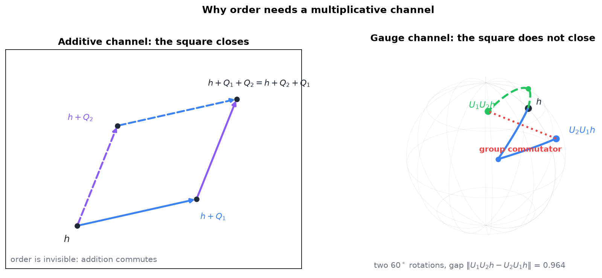
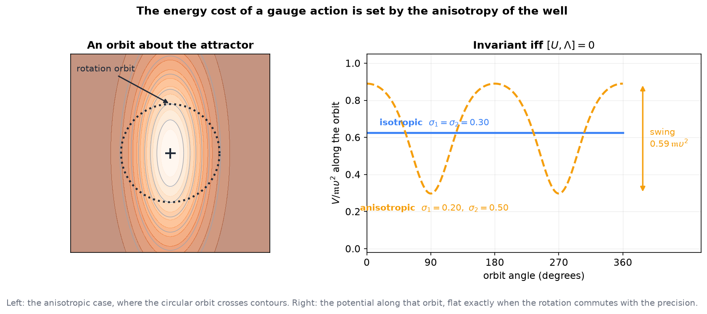
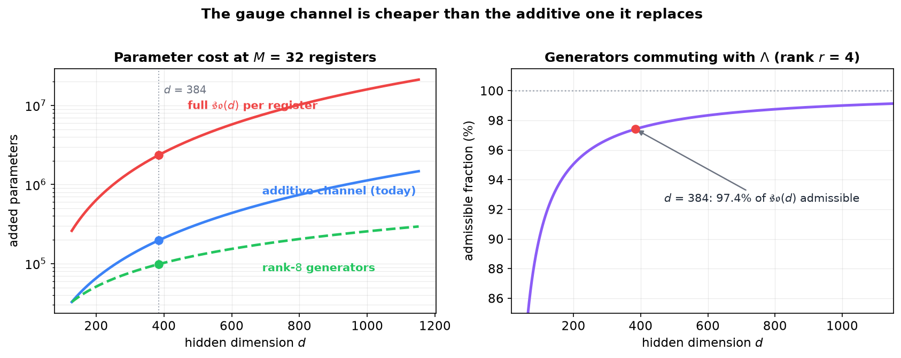

# Realizing Execution: a Gauge Channel against Causal Ordering

**Two routes from the Fock-PARFLM as trained to an architecture that can execute, with the mathematics of each and the experiment that separates them**

Companion note to [*Semantic Templates as Doi–Peliti Reactions*](Semantic_Templates_as_Doi_Peliti_Reactions.md) §7 and to [*The Execution Problem*](The_Execution_Problem.md). The first established that the obstruction to execution is **not** sequencing — a control particle hopping on the atom tree sequences perfectly well — but **commutativity**: every additive update commutes, so the outcome cannot depend on the order in which registers acted. This note takes that obstruction as the design constraint and works out the two ways around it.

Book context: §10.5.3 assigns order-dependence to a non-abelian operator algebra (v3), and F4 (cross-serial $a^nb^nc^n$) and F5 (bounded copy $ww$) are named as the empirical witnesses of v3's necessity. Nothing here has been run.

---

## Contents

0. [Scope](#0-scope)
1. [The constraint, restated](#1-the-constraint-restated)
2. [Route A: the gauge channel](#2-route-a-the-gauge-channel)
3. [Route B: keep the gradient, put order in the dynamics](#3-route-b-keep-the-gradient-put-order-in-the-dynamics)
4. [The experiment that separates them](#4-the-experiment-that-separates-them)
5. [Derived relations, collected](#5-derived-relations-collected)
6. [Risks and open questions](#6-risks-and-open-questions)

---

## 0. Scope

| Claim | Status |
|---|---|
| The present reverse channel is additive, $Q_i=\sum_k \mathrm{softmax}_k(q_i\cdot k_k/\sqrt{d_k})\,v_k$ | **In the code**, `ReverseChannel` in `model_fock_parf_v2.py` |
| Additive updates commute, so order cannot change the outcome | **Derived**, §1 |
| Rotations are the unique linear action commuting with the layer's LayerNorm | **Derived**, §2.3 |
| A centred rotation leaves $V_\theta$ invariant exactly when it commutes with the precision | **Derived**, §2.4 |
| A gauge action is a change of frame, not a force, so the conservativity claim may survive it | **Conjectured**, §2.4 — the sharpest thing here, and unproven |
| Rank-$2\rho$ generators cost less than the additive channel they replace | **Computed**, §2.5 |
| Either route clears F4 or F5 | **Not known.** No experiment has been run |

Every number quoted is an exact computation at the live configuration ($d=384$, $M=32$, $d_k=64$, aniso rank $r=4$). No predicted accuracy appears anywhere in this note, in text or in figures.

---

## 1. The constraint, restated

Write the layer update of the Fock-PARFLM schematically, with $F$ the conservative force and $Q$ the register channel:

$$
h^{(\ell+1)} = \Pi\left[\,h^{(\ell)} + \frac{\Delta t}{1+\gamma\Delta t}\left(h^{(\ell)}-h^{(\ell-1)}\right) + \frac{\Delta t^2}{(1+\gamma\Delta t)\,\mathfrak{m}}\Bigl(-\nabla V_\theta + Q^{(\ell)}\Bigr)\right], \qquad (1.1)
$$

with $\Pi$ the LayerNorm projection. Suppose two registers $k_1,k_2$ contribute $Q_1$ and $Q_2$ at the same layer. Then

$$
h + Q_1 + Q_2 \;=\; h + Q_2 + Q_1 \qquad (1.2)
$$

identically. The contributions are vectors in the same tangent space and addition is commutative; no schedule, gate or ordering of the registers can make (1.2) fail. This is the formal content of §7.3 of the templates note, and it is why "John gave Mary a book" and "Mary gave John a book" cannot be separated by the channel itself — only by what reaches it.

**Figure 1.** Left: the additive channel. Whichever register acts first, the state lands on the same point, so the channel is blind to order. Right: two $60^\circ$ rotations applied in the two orders from the same start, on the unit sphere. The endpoints differ by 0.964 in norm — the group commutator. The gap is what an architecture needs in order to represent "who did what to whom".

---

## 2. Route A: the gauge channel

### 2.1 The present channel

`ReverseChannel` computes, per token $i$,

$$
Q_i \;=\; \sum_{k \in \mathrm{active}} \mathrm{softmax}_k\left(\frac{q_i\cdot k_k^{\mathrm{reg}}}{\sqrt{d_k}}\right) v_k^{\mathrm{reg}}, \qquad (2.1)
$$

and adds $Q_i$ to the force in (1.1). Each register contributes a **vector**, through the learned $W_V^{\mathrm{rev}}$.

### 2.2 The proposal

Keep the routing weights and replace what the register contributes: a **group element** instead of a vector. Give register $k$ a generator $A_k$ in the Lie algebra $\mathfrak{g}\subset\mathfrak{so}(d)$, and let the token pick up

$$
U_i^{(\ell)} \;=\; \exp\left(\varepsilon^{(\ell)} \sum_{k \in \mathrm{active}} w_{ik}^{(\ell)} A_k\right), \qquad
w_{ik}^{(\ell)} = \mathrm{softmax}_k\left(\frac{q_i\cdot k_k^{\mathrm{reg}}}{\sqrt{d_k}}\right), \qquad (2.2)
$$

with $\varepsilon^{(\ell)}$ the existing per-layer gate (`reverse_channel_scale`), initialised at zero so the model starts exactly where it is today. The state is then transported rather than pushed:

$$
h_i^{(\ell+1)} \;\longmapsto\; \mu_i^{(\ell)} + U_i^{(\ell)}\left(h_i^{(\ell+1)} - \mu_i^{(\ell)}\right), \qquad (2.3)
$$

where $\mu_i^{(\ell)}$ is the centre of the attractor currently binding the token (§2.4 explains why the action is centred there rather than at the origin).

**Where non-commutativity enters.** Within a layer, (2.2) exponentiates a weighted *sum*, so the registers of one layer do not fight each other. Across the stack the token accumulates

$$
U_i = U_i^{(L)}U_i^{(L-1)}\cdots U_i^{(1)}, \qquad (2.4)
$$

and this product depends on the order of the factors precisely when the generators fail to commute, $[A^{(\ell)}, A^{(\ell')}] \neq 0$. Depth is what carries order. To second order in $\varepsilon$,

$$
U^{(2)}U^{(1)}\left(U^{(1)}U^{(2)}\right)^{-1} = \exp\left(\varepsilon^2\bigl[A^{(2)},A^{(1)}\bigr] + O(\varepsilon^3)\right), \qquad (2.5)
$$

so the commutator is both the mechanism and the measurable: §4 uses it as the primary diagnostic.

### 2.3 Why rotations, and not some other group

The layer ends in a LayerNorm projection $\Pi$, so an action that does not commute with $\Pi$ is partly undone by it. Write $m(h)=\tfrac1d\mathbf 1^\top h$ and $s(h)^2=\tfrac1d\lVert h-m(h)\mathbf 1\rVert^2$, so $\Pi(h) = (h-m(h)\mathbf 1)/s(h)$. Let $R$ be orthogonal with $R\mathbf 1=\mathbf 1$. Then $R^\top\mathbf 1 = R^{-1}\mathbf 1 = \mathbf 1$, hence

$$
m(Rh) = \tfrac1d(R^\top\mathbf 1)^\top h = m(h), \qquad
s(Rh)^2 = \tfrac1d\lVert R\left(h-m\mathbf 1\right)\rVert^2 = s(h)^2, \qquad (2.6)
$$

and therefore

$$
\Pi(Rh) = \frac{R\left(h-m(h)\mathbf 1\right)}{s(h)} = R\,\Pi(h). \qquad (2.7)
$$

**The transport passes through the projection untouched.** The admissible group is the stabiliser of $\mathbf 1$, that is $SO(d-1)$ acting on $\mathbf 1^{\perp}$; generators are antisymmetric with $A\mathbf 1 = 0$. No other linear action has this property: a scaling changes $s$, a shear changes both, and a general $GL(d)$ element changes the manifold $\Pi$ projects onto.

### 2.4 The energy question, and what conservativity actually forbids

Take the anisotropic well the scale-up runs actually use, with precision $\Lambda_v = D + \sum_{j=1}^{r}\lambda_j u_j u_j^\top$:

$$
V_v(h) = \mathfrak{m}\upsilon^2\left(1 - \exp\left(-\tfrac12 (h-\mu_v)^\top\Lambda_v (h-\mu_v)\right)\right). \qquad (2.8)
$$

Under the centred transport (2.3), $h-\mu_v \mapsto U(h-\mu_v)$, so the quadratic form becomes $(h-\mu_v)^\top U^\top\Lambda_v U (h-\mu_v)$ and

$$
V_v \text{ is invariant along the orbit} \iff U^\top \Lambda_v U = \Lambda_v \iff [U,\Lambda_v]=0. \qquad (2.9)
$$

For an isotropic well ($\Lambda = \lambda I$) every rotation qualifies and the transport is free. For the anisotropic bank, the admissible generators are those commuting with $\Lambda_v$: rotations inside the eigenspaces of $D$ and orthogonal to the low-rank directions $\lbrace u_j\rbrace$. Their span is $\mathfrak{so}(d-r-1)$ once $\mathbf 1$ is also excluded, of dimension $(d-r-1)(d-r-2)/2$ — **97.41% of $\mathfrak{so}(d)$ at $d=384$, $r=4$**. The restriction costs almost nothing.

**Figure 2.** Left: the circular orbit traced by a centred rotation, drawn over an anisotropic well. Right: the potential along that orbit. For the isotropic well it is exactly flat, so the transport does no work. For the anisotropic well with $\sigma_1=0.20$, $\sigma_2=0.50$ it swings by $0.59\,\mathfrak{m}\upsilon^2$ over a full turn — which is why (2.9) matters and why the generators are restricted to the commutant.

**The conjecture.** The framework's central claim is that every per-layer **force** derives from one shared scalar potential. A group action is not a force: it appears in (2.3) as a transport of the state, not as a term in the acceleration of (1.1). If the admissible generators of (2.9) are used, the transport also leaves $V_\theta$ invariant, and applying the same $U$ to the incoming velocity preserves the kinetic term, so the total energy is unchanged. The conjecture is therefore:

> A gauge channel built from generators commuting with $\Lambda_v$ and with $\mathbf 1$ adds order-dependence **without** violating the conservative-by-construction claim, because it changes the frame rather than the force.

This is the sharpest claim in the note and it is unproven. What would have to be checked: that the existing conservativity diagnostic, which tests whether the per-layer forces are consistent with a single potential, is insensitive to a transport applied after the force is computed; and that the discrete update (2.3) composed with $\Pi$ does not smuggle in work through the finite step $\Delta t$. Either check could sink it.

### 2.5 Cost: a closed form, and the parameter count

Full generators are unnecessary. Take $A_k$ of rank $2\rho$, a sum of $\rho$ plane generators $A = uv^\top - vu^\top$ with $u\perp v$ orthonormal. Then $A^2 = -(uu^\top + vv^\top) = -P$, the projector on the plane, and $A^3 = -A$, so the exponential is a Rodrigues rotation in that plane:

$$
\exp(\theta A) = I + \sin\theta\,A - (1-\cos\theta)\,P, \qquad (2.10)
$$

$$
\exp(\theta A)h = h + \sin\theta\bigl(u\langle v,h\rangle - v\langle u,h\rangle\bigr) - (1-\cos\theta)\bigl(u\langle u,h\rangle + v\langle v,h\rangle\bigr). \qquad (2.11)
$$

No matrix exponential and no $d\times d$ matrix is ever formed: (2.11) is two inner products and four axpy per plane, so $O(\rho d)$ per token per layer.

**Figure 3.** Left: added parameters at $M=32$ registers. At $d=384$ the full-$\mathfrak{so}(d)$ variant costs 2,353,152, the existing additive channel 196,608, and rank-8 generators ($\rho=4$) **98,304 — half the channel they would replace**. Right: the fraction of $\mathfrak{so}(d)$ that commutes with a rank-4 precision and with $\mathbf 1$, reaching 97.4% at $d=384$.

### 2.6 What Route A predicts, and how it fails

It predicts order-sensitivity where there is currently none, and it should show up first on F4 and F5 and not on perplexity. It fails if: the gate $\varepsilon$ stays at zero under training (the channel is not useful and the model declines it); or the commutator diagnostic of §4 stays at numerical zero (the learned generators commute, so the group is effectively abelian and nothing was bought); or F4/F5 are unmoved at matched $M$.

---

## 3. Route B: keep the gradient, put order in the dynamics

### 3.1 What causality already does

The trained models restrict the partners of token $t$ to positions $s\lt t$ (`causal_force=True`) and summarise the prefix through the multi-channel EMAs $\xi_t = \sum_{s\le t}\alpha^{\,t-s}h_s$. The composite map from a token sequence to the final hidden states is therefore already order-dependent: permuting the input changes the output. The book makes exactly this point — the causal models break the permutation symmetry of the framework's force law, and that is where they carry word order.

### 3.2 The precise reach, and the precise limit

The distinction that matters is between two senses of order-dependence:

| | Carried by causality | Needs a non-abelian action |
|---|---|---|
| Order of the **input** changes the output | yes | — |
| Order in which two **registers act at one layer** changes the output | no, by (1.2) | yes |
| Composition of two **operators** along the stack is non-commutative | no: additive updates commute | yes |

Route B accepts the second and third rows as permanent. Its wager is that they are not needed: a prefix summary of sufficient dimension, plus $M$ register slots with LIFO discipline, might reach the targets by *storage* rather than by *composition*.

That wager is plausible for **F5** and implausible for **F4**. The bounded copy language $\lbrace ww : \lvert w\rvert \le L\rbrace$ requires retrieving the $j$-th symbol of $w$ at position $\lvert w\rvert + j$; with $M$ addressable registers this is reachable by storage alone whenever $\lvert w\rvert \le M$, with no operator composition anywhere. The book's own statement of F5 bounds $\lvert w\rvert$ for the same reason. So **F5 at $\lvert w\rvert\le M$ does not discriminate between the routes** — it is a capacity test, not an algebra test. F4's $a^nb^nc^n$ demands two coupled counters whose relation must hold for $n$ beyond any fixed slot count, which storage of this kind does not supply.

This is the single most important design consequence in the note, and §4 builds on it.

### 3.3 The case for Route B

It is free. No parameters, no architectural change, no risk to the conservativity claim, and the models already exist. If the discriminating experiment shows the gauge channel buys nothing beyond what matched-$M$ storage already buys, Route B is simply the right answer and the v3 apparatus is not needed at this scale.

---

## 4. The experiment that separates them

Design only; no results, and no predicted numbers.

**Arms.** (i) Additive channel, as trained today. (ii) Gauge channel of (2.2)–(2.3) with admissible generators, $\rho=4$. (iii) Additive channel with $M$ raised so its parameter count matches arm (ii).

**The confound to kill.** Arm (iii) exists because register count and channel type are otherwise confounded: a gauge model with more effective capacity could clear F5 for reasons that have nothing to do with non-commutativity. $M$ is held fixed between (i) and (ii), and the budget is matched in (iii).

**Primary diagnostic — order sensitivity.** For a trained model, a layer $\ell$, and two active registers $k,k'$, define

$$
\Omega^{(\ell)} = \mathbb{E}_{i}\left[\frac{\lVert U_kU_{k'}h_i - U_{k'}U_kh_i\rVert}{\lVert h_i\rVert}\right]. \qquad (4.1)
$$

$\Omega \equiv 0$ identically for the additive channel, which makes it a clean null rather than a baseline to beat. A gauge arm whose learned generators commute would also report $\Omega\approx0$, and that is the honest failure signal of §2.6.

**Targets.** F4 accuracy against $n$; F5 accuracy against $\lvert w\rvert$, reported separately for $\lvert w\rvert\le M$ and $\lvert w\rvert\gt M$, since §3.2 says only the second is discriminating. **Guard:** OpenWebText perplexity, to detect the case where order-sensitivity is bought by damaging ordinary language modelling.

**What falsifies what.**

| Outcome | Reading |
|---|---|
| $\Omega\gt 0$ and F4 improves at matched $M$ | Route A is doing what it was built to do |
| $\Omega\gt 0$ and F4 flat | Non-commutativity is realizable but not sufficient; the bottleneck is elsewhere |
| $\Omega\approx0$ after training | The model declines the group structure; Route A is not refuted but is not engaged either |
| Both arms equal on F5 for $\lvert w\rvert\le M$ | Expected, and not evidence either way — this is the capacity regime of §3.2 |
| Arm (iii) matches arm (ii) everywhere | Capacity, not algebra, was the operative variable; prefer Route B |
| Perplexity degrades in arm (ii) | The conservativity conjecture of §2.4 needs re-examination before anything else is concluded |

---

## 5. Derived relations, collected

| Relation | Where | Content |
|---|---|---|
| $h+Q_1+Q_2 = h+Q_2+Q_1$ | (1.2) | the obstruction: additive channels are order-blind |
| $U_i=\exp(\varepsilon\sum_k w_{ik}A_k)$ | (2.2) | the gauge channel, reusing the existing routing weights |
| $U^{(2)}U^{(1)}(U^{(1)}U^{(2)})^{-1}=\exp(\varepsilon^2[A^{(2)},A^{(1)}])$ | (2.5) | the commutator is the mechanism and the measurable |
| $\Pi(Rh)=R\,\Pi(h)$ for $R\mathbf 1=\mathbf 1$ | (2.7) | rotations are the unique action commuting with LayerNorm |
| $V_v$ invariant $\iff [U,\Lambda_v]=0$ | (2.9) | the admissibility condition; 97.41% of $\mathfrak{so}(d)$ at $d=384$, $r=4$ |
| $\exp(\theta A)=I+\sin\theta A-(1-\cos\theta)P$ | (2.10) | closed-form exponential, $O(\rho d)$ per token per layer |
| $\Omega^{(\ell)}$ | (4.1) | order-sensitivity, identically zero for the additive channel |

---

## 6. Risks and open questions

- **The conjecture of §2.4 may be false.** If the discrete update plus $\Pi$ injects work at finite $\Delta t$, the gauge channel becomes a non-conservative force after all, and the framework's central claim is in play. This should be checked numerically on a single layer before any training run.
- **Training stability.** Multiplicative actions compose across $L$ layers, so a gate that grows can produce exponential sensitivity in depth. The existing warmup and per-layer gate machinery (`reverse_channel_warmup_steps`, `reverse_channel_per_layer`) exists because the additive channel already had this problem in a milder form.
- **Which attractor is $\mu_i^{(\ell)}$?** (2.3) centres the rotation on the binding attractor, but with a multi-well $V_\theta$ the token's assignment to a well is soft. Using the responsibility-weighted mean of the well centres is the obvious choice and is not derived here.
- **$\mathfrak{g}$ is shared or per-register?** (2.2) gives each register its own generator. Tying them across registers, or across layers, is untested and would change the parameter counts of Figure 3.
- **Route B's wager is not formally settled.** §3.2 argues F5 falls to storage at $\lvert w\rvert\le M$; that is an argument, not a proof, and a counting bound on what $M$ registers with LIFO can address would settle it.
