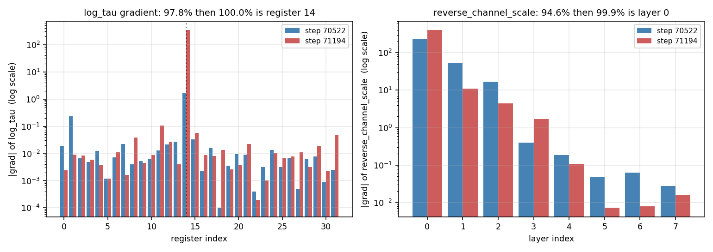
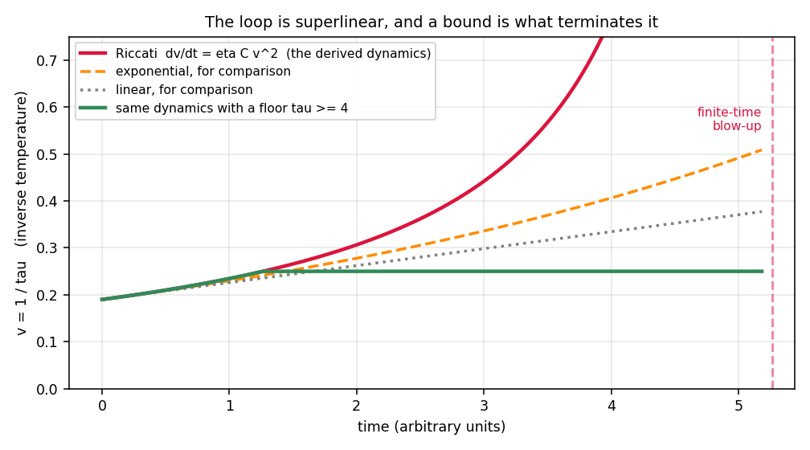
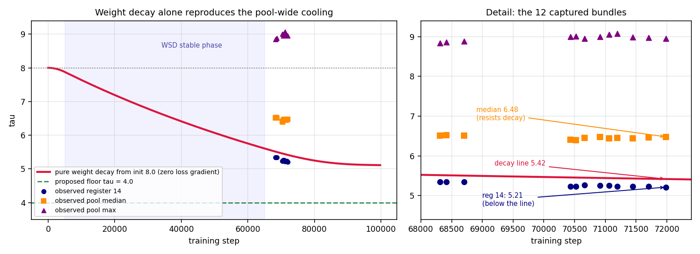
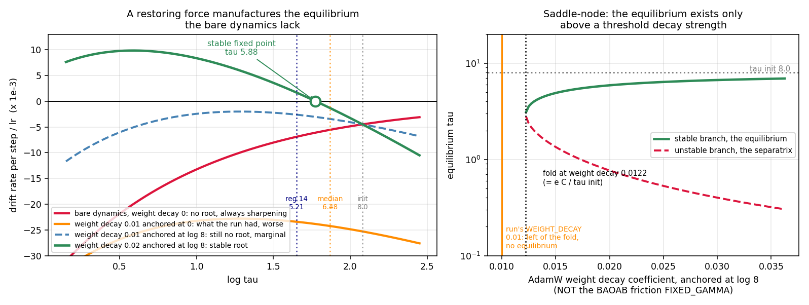
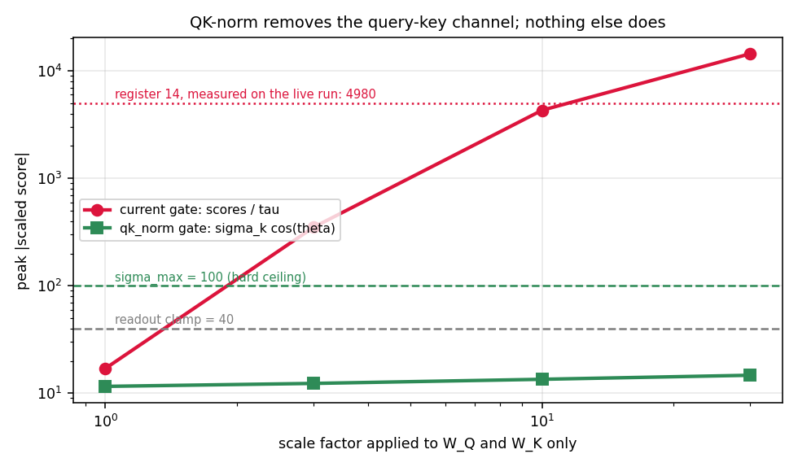

# Register Temperature Instability in the Fock Creation Gate

**A technical report on the `creation_gate_qkv.log_tau` gradient spikes: what we measured, what we got wrong twice, the covariance identity and Riccati equation that explain the dynamics, the AdamW configuration error that turned out to dominate them, and the six mitigations that follow.**

Companion to `CfC_BAOAB_Integrator_and_Mitigations.md` (§48-§51) and
`Diagnostic_Programme_in_CfC_BAOAB_Integrator.md`. This report consolidates
material that is scattered across those sections into a single narrative,
and adds the analysis that neither of them contains: the existence and
stability conditions for the interior equilibrium, and a quantitative
estimate of the covariance coefficient from the observed drift.

---

## Contents

- [0. Executive summary](#0-executive-summary)
- [1. The system under study](#1-the-system-under-study)
- [2. The observation](#2-the-observation)
- [3. The diagnostic apparatus](#3-the-diagnostic-apparatus)
- [4. Two falsified predictions, and why both failed the same way](#4-two-falsified-predictions-and-why-both-failed-the-same-way)
- [5. The mechanism: one register is colder than the pool](#5-the-mechanism-one-register-is-colder-than-the-pool)
- [6. The temperature gradient is a covariance](#6-the-temperature-gradient-is-a-covariance)
- [7. The Riccati equation: the loop is superlinear](#7-the-riccati-equation-the-loop-is-superlinear)
- [8. The third force: AdamW was decaying a logarithm](#8-the-third-force-adamw-was-decaying-a-logarithm)
- [9. How a restoring force manufactures the missing equilibrium](#9-how-a-restoring-force-manufactures-the-missing-equilibrium)
- [10. QK-normalisation: what it fixes and what it does not](#10-qk-normalisation-what-it-fixes-and-what-it-does-not)
- [11. The remediation ladder](#11-the-remediation-ladder)
- [12. Predictions stated in advance](#12-predictions-stated-in-advance)
- [13. Deployment planning across future arms](#13-deployment-planning-across-future-arms)
- [14. Limitations and threats to validity](#14-limitations-and-threats-to-validity)
- [15. Provenance: code, bundles, and diagnostic outputs](#15-provenance-code-bundles-and-diagnostic-outputs)

---

## 0. Executive summary

Between steps 70,000 and 72,000 of the d384 CfC/BAOAB OpenWebText run, the
gradient watchdog began reporting a parameter that had never previously led
a spike: `creation_gate_qkv.log_tau`, the per-register softmax temperature
of the Fock creation gate. Its full-batch gradient norm went from 1.65 at
step 70,522 to 345.38 at step 71,194 — a factor of 211 in 672 steps.

Six findings, in the order they were established:

1. **The gradient is concentrated on a single register.** Register 14 of 32
   carries 97.8% of `log_tau`'s gradient at step 70,522 and 100.0% at step
   71,194. The next-largest register is three to four orders of magnitude
   down. The same pattern holds for `reverse_channel_scale`, where layer 0
   of 8 carries 94.6% and then 99.9%.

2. **Two proposed explanations were falsified by measurement**, and both
   failed for the same methodological reason: the test statistic was
   computed on the row axis, and the quantity does not live on that axis.

3. **The mechanism is score magnitude at register granularity.** Register 14
   has the coldest learned temperature in the pool, so its scaled scores run
   an order of magnitude above every other register's, and the temperature
   derivative is proportional to score magnitude.

4. **The temperature gradient is exactly a covariance** under the register's
   own attention distribution, and under gradient flow the inverse
   temperature obeys a **Riccati equation** with finite-time blow-up. The
   bare dynamics have **no interior equilibrium**: the temperature is always
   driven toward one of two degenerate ends.

5. **Most of the measured drift was not that loop.** AdamW had been
   constructed from a flat parameter list, so `weight_decay=0.01` was
   applied to `log_tau` — and decoupled decay on a *logarithm* pulls the
   temperature toward 1 from an initialisation of 8.0. Integrating the real
   schedule with zero loss gradient accounts for ≈70% of the observed
   register-14 drift, and the pure-decay line passes through the middle of
   the observed pool.

6. **The missing equilibrium is a configuration error, not a law of
   nature.** Any restoring term anchored at a target creates a stable
   interior fixed point, subject to a threshold condition derived in §9. The
   run already had such a term; it was anchored at the wrong place
   (temperature 1) and pointed the wrong way.

Applied: a `log_tau` clip group split, a live temperature monitor, a
post-step projected floor, and exclusion of all 1-D parameters from weight
decay with an explicit Adam-moment remap. Specified but not deployed on the
live run: QK-normalisation of the creation gate, which is not retrofittable,
and decay re-anchored at the initialisation, which is retrofittable and
low-risk but was deliberately deferred to the fresh arm once the projected
benefit over the live run's remaining steps came out to +0.15 in $\tau$ —
see §11.6. §13 records the deployment planning for the two runs after this
one: QK-normalisation and the anchored pull are mutually exclusive on the
model's own `log_tau=None` code path, so Run 2 must choose one, and neither
of §11.6's projection numbers transfer to Run 2's longer, differently
scheduled run.

> **The one-line version.** The creation gate's temperature had two forces
> acting on it and both pointed the same way: a covariance term with no
> interior zero, and a weight-decay term aimed at temperature 1 from an
> initialisation of 8. Removing the second one and re-aiming it is a larger
> and cheaper intervention than anything we designed for the first.

---

## 1. The system under study

### 1.1 Where the temperature lives

`QKVCreationGate_v21` decides, for each of the $M = 32$ Fock registers,
which token positions that register should read from when it is created.
It is a single attention-like head per register: a query derived from the
register state, keys derived from the token stream, a dot product, a
temperature scaling, and a softmax over positions.

The temperature is **learned and per-register**, stored in log space:

```python
# model_fock_parf_v2.py -- QKVCreationGate_v21._scale_scores (legacy path)
if self.log_tau is not None:
    tau = self.log_tau.exp().clamp(min=1e-4)             # (M,)
    return scores / tau.view(1, self.M, 1)
return scores / (self.d_k ** 0.5)
```

Three properties of this design matter for everything that follows.

- The parameter is a **logarithm**, so anything acting additively on
  `log_tau` acts multiplicatively on the temperature.
- The 32 temperatures are **independent**, with nothing in the model, the
  loss, or the initialisation constraining them to stay comparable to one
  another. They are initialised identically (`tau_create_init = 8.0`) and
  then free to separate without bound.
- The divisor is **unbounded below**. The `clamp(min=1e-4)` is a numerical
  guard four orders of magnitude below the operating point, not a
  regulariser.

Downstream, the readout applies a hard ceiling before subtracting it:

```python
s32 = scores.float().clamp(max=clamp) - clamp             # <= 0
```

which is important later, because `clamp(max=.)` passes **zero** gradient
above the ceiling and therefore looked, for a while, like it might be the
gate that explained everything.

### 1.2 The training configuration

| setting | value |
|---|---|
| model | Fock-PARFLM, d384, 8 layers, 32 registers |
| integrator | CfC with BAOAB propagator |
| corpus | OpenWebText |
| optimizer | AdamW, betas 0.9 / 0.95 |
| peak learning rate | 3e-4 |
| schedule | WSD: warmup to step 5,000; stable to 65,000; cosine to a 5% floor at 100,000 |
| weight decay | 0.01, applied to **every** parameter (this is the §8 defect) |
| temperature init | tau_create_init 8.0, identical for all 32 registers |
| gradient clipping | per-group, with `clip_then_sum` on the embedding groups |
| readout ceiling | clamp at 40.0 |

The events analysed here occur at steps 70,522 and 71,194, i.e. inside the
cosine-decay phase, where the learning rate is ≈2.86e-4.

---

## 2. The observation

### 2.1 What the watchdog reported

The per-group gradient log at step 71,194 showed `creation_gate` leading
with a group norm of 432.16 against a clip threshold of 0.3. Decomposing
that group, `log_tau` alone accounted for 345.38 of it — the projections
$W_Q$, $W_K$, $W_V$ contributed only

$$\sqrt{432.16^2 - 345.38^2} = 259.8.$$

At step 70,522, 672 steps earlier, the same parameter contributed 1.65 of a
429.52 group norm. The parameter had gone from negligible to dominant
without any change in the training configuration.

### 2.2 Per-element decomposition

Both `log_tau` (shape 32) and `reverse_channel_scale` (shape 8) are small
enough to decompose element by element from the full-batch backward pass.
The result is the single most striking measurement in this investigation.



| parameter | step 70522 | step 71194 |
|---|---|---|
| log_tau, register 14 share of squared norm | 0.9783 | 1.0000 |
| log_tau, register 14 gradient | +1.6326 | +345.3764 |
| log_tau, next-largest register | 0.2335 (reg 1) | 0.1073 (reg 11) |
| reverse_channel_scale, layer 0 share | 0.9463 | 0.9991 |
| reverse_channel_scale, layer 0 gradient | +230.87 | +406.16 |

Two independent parameters, each with its entire gradient on one element.
Both gradients **positive**, in both events. Note the sign: descent on a
positive `log_tau` gradient *lowers* the temperature, so whatever is driving
this is driving register 14 to become sharper still.

This is not the aggregate over a noisy batch. It is the actual gradient the
optimizer was handed, decomposed along an axis the parameter genuinely has.

---

## 3. The diagnostic apparatus

Two probes were written for this investigation and added to the notebook's
Cell 6d alongside the existing replay helpers. Both follow the same
snapshot-and-restore invariant every other helper in that cell uses: save
gradients, state dict, and RNG state; monkey-patch; run; restore
unconditionally in a `finally` block.

### 3.1 `probe_gate_saturation`

Measures per-register by per-layer clamp occupancy, per-register peak scaled
score, salience, and temperature — all from **one** replayed microbatch of a
`_spikebatch.pt` bundle.

The core is a patch on the readout that intercepts the scores on their way
in, tagged with the currently executing layer:

```python
def _make_patched(orig):
    def _patched(scores, V, *a, **kw):
        with torch.no_grad():
            s = scores.detach().float()                      # (B, M, T)
            ell = _cur_layer[0]
            ge = (s >= clamp).sum(dim=(0, 2)).cpu()          # (M,)
            tot = s.shape[0] * s.shape[2]
            mx = s.amax(dim=(0, 2)).cpu()                    # (M,)
            _n_ge[ell] = ge if ell not in _n_ge else _n_ge[ell] + ge
            _n_tot[ell] = tot if ell not in _n_tot else _n_tot[ell] + tot
            _smax[ell] = mx if ell not in _smax else torch.maximum(_smax[ell], mx)
        return orig(scores, V, *a, **kw)
    return _patched
```

The creation gate is **one shared module invoked once per layer**, so the
layer index has to come from outside the gate. It is captured by wrapping
`_fock_layer_step`, the same pattern `replay_spike_batch` uses for its
layer-resolved captures.

One design note worth recording. The probe only needs forward-side
quantities, so a backward pass is strictly unnecessary — but a grad-enabled
forward with **no** backward leaves the entire autograd graph pinned, which
is precisely the eval-time out-of-memory pattern this notebook has already
fought once. The probe therefore runs the full backward, trading runtime for
consistency with the rest of Cell 6d.

### 3.2 `sweep_log_tau_history`

Reads `creation_gate_qkv.log_tau` and `register_embed` out of every
`_spikebatch.pt` bundle on disk. The bundles carry a full `model_state_dict`
but no optimizer state, which makes them roughly an order of magnitude
cheaper to sweep than real checkpoints on Drive — 12 historical snapshots
for the cost of loading model weights only.

```python
rec = {'step': step, 'kind': kind,
       'log_tau_focus': float(lt[focus]),
       'tau_focus': float(tau[focus]),
       'tau_median': float(tau.median()),
       'tau_max': float(tau.max()),
       'tau_focus_rank': 1 + int((tau > tau[focus]).sum()),
       'emb_focus_norm': float(re_emb[focus].float().norm()),
       'emb_median_norm': float(re_emb.float().norm(dim=-1).median())}
```

This turned out to be the highest-value line of diagnostic code in the whole
investigation, because it converted a pair of isolated snapshots into a
**trajectory**, and the trajectory is what §8 was later able to compare
against a closed-form integration of the weight-decay schedule.

### 3.3 Why these probes had power where the earlier ones did not

The distinguishing property of both probes is that they decompose along an
axis the measured object actually has: registers for `log_tau`, layers for
`reverse_channel_scale`. §4.3 explains why the earlier row-axis probes could
not have worked no matter what was true.

---

## 4. Two falsified predictions, and why both failed the same way

This section is kept in full because the failures are more instructive than
the eventual success, and both were stated in advance and therefore falsify
cleanly.

### 4.1 Falsified: the gradient-hot row is a score outlier

The first hypothesis was that the rows carrying the concentrated gradient
are rows whose creation-gate scores are unusually large. Measured, taking
peak scaled score per row and ranking within the batch:

| event | hot row | peak scaled score for that row | rank in batch | batch median | batch max |
|---|---|---|---|---|---|
| 70522 | mb 3, row 2 | 1176.55 | 8 of 32 | 993.38 | 1363.12 |
| 71194 | mb 1, row 5 | 1020.54 | 26 of 32 | 1189.24 | 1918.61 |
| 71194 | mb 2, row 2 | 899.79 | **31 of 32** | 1189.24 | 1918.61 |

The row that owns register 14's entire temperature gradient at step 71,194
has the second-*smallest* scaled-score maximum in its own batch. The
prediction was not merely unsupported; at 71,194 it was close to inverted.

### 4.2 Falsified: the readout clamp is gating the gradient

The second hypothesis was raised to explain the first failure. Since
`clamp(max=40.0)` passes zero gradient above the ceiling, perhaps gradient
survives only on sub-clamp entries — which would explain both the extreme
concentration and the inversion. It makes a sharp prediction: register 14
should be the **least** clamped register in the pool, rank 1 of 32.

Measured, it fails on both counts.

| quantity | step 70522 | step 71194 |
|---|---|---|
| fraction of all score entries at or above the ceiling | 2.32% | 3.70% |
| register 14's un-clamped rank, 1 equals most un-clamped | 27 of 32 | 31 of 32 |

Batch-wide the clamp touches under 4% of entries, so it cannot be the
dominant gate on anything. And register 14 sits in the *most*-clamped tail,
at 71,194 the second-most-clamped register of the 32. The prediction was
rank 1.

### 4.3 The methodological lesson

Both tests used a statistic computed **per row**, and in both cases the
statistic marginalised out the axis that carried the signal.

The §4.1 statistic was peak scaled score per row — a maximum taken over all
32 registers. Register 14 appears in every row, and its scores exceed every
other register's by roughly an order of magnitude. So that maximum is
essentially register 14's own score in every single row, and the row-to-row
variation left over is noise. The batch medians confirm this after the fact:
993.38 at step 70,522 against register 14's own 952.3, and 1189.24 at step
71,194 against 659.1.

The statistic was near-constant by construction. It could not have separated
rows regardless of what was true.

This is the second failure of the same shape in this investigation. The
row-attribution helper reconstructs under 1% of the real gradient, because
replaying one row in isolation is not the same experiment as the gradient of
a batch. Both are cases of **measuring on the row axis a quantity that does
not live there**. The per-register and per-layer decompositions of §2.2 have
neither problem.

> **Rule extracted.** Before designing a test statistic, ask which axes the
> parameter actually has, and decompose along one of those. If the statistic
> requires a reduction over an axis, check whether one element of that axis
> dominates the reduction in every sample — if it does, the statistic is a
> constant wearing a disguise.

---

## 5. The mechanism: one register is colder than the pool

The answer was already in the §4.2 table, in the columns that were only
there as context.

| quantity | register 14 | the eight least-clamped registers |
|---|---|---|
| temperature at step 70522 | 5.231 | 6.58 to 9.01, pool median 6.389, max 9.006 |
| temperature at step 71194 | 5.225 | 6.17 to 9.08, pool median 6.450, max 9.075 |
| peak scaled score at 70522 | **952.3** | 12.1 to 143.8 |
| peak scaled score at 71194 | **659.1** | 10.9 to 160.3 |

Register 14's temperature has drifted to the bottom of the pool, so its
scaled scores run roughly an order of magnitude above every other
register's. That is also, mechanically, why it is the most-clamped register
despite the clamp being irrelevant pool-wide — a fact that only looks
paradoxical if you have the causal arrow backwards.

Feed this into the temperature derivative. Writing $\ell_k = \log \tau_k$
for register $k$, and using that the scaled score is the raw score times
$e^{-\ell_k}$:

$$\frac{\partial L}{\partial \ell_k} = -\sum_t \tilde{s}_{kt} \frac{\partial L}{\partial \tilde{s}_{kt}}$$

The gradient is a **score-weighted** sum of backward signals. A register
whose scores are ten times larger than everyone else's gets ten times the
temperature gradient from the same backward signal, and that is before any
of the dynamics in §6 and §7. The concentration follows immediately, with no
appeal to rows, tokens, or clamping at all.

**The score-magnitude mechanism is confirmed — at register granularity, not
row granularity.** That single change of axis is what turned a confusing
pile of row statistics into a one-sentence explanation.

Two supporting observations, for completeness:

- Register 14's embedding norm drifts mildly in the same direction, from
  1.2139 to 1.3026 against a pool median moving 1.1898 to 1.2059, so ≈1.02x
  to ≈1.08x the median.
- Its salience is unremarkable to low, 0.1983 at step 71,194, at the bottom
  of the sampled set.

Register 14 is a **cold, sharply selective, low-salience** register. It is
not a dominant register that happens to be loud.

---

## 6. The temperature gradient is a covariance

§5's derivative is correct but uninformative about dynamics, because the
backward signal is left as an opaque symbol. Pushing one step further turns
it into an object with interpretable sign, magnitude, and zeros.

### 6.1 The identity

Let $a_{kt}$ be register $k$'s attention weight on token $t$, obtained by
applying $\mathrm{softmax}$ over $t$ to the scaled scores. Let

$$u_{kt} = \frac{\partial L}{\partial a_{kt}}$$

be the **utility** of putting attention weight on token $t$ — negative
utility means placing weight there reduces the loss, since $u$ is a loss
derivative. The softmax Jacobian gives

$$\frac{\partial L}{\partial \tilde{s}_{kt}} = a_{kt}\left(u_{kt} - \bar{u}_k\right), \qquad \bar{u}_k = \sum_j a_{kj} u_{kj}.$$

Substituting into §5's expression, the sum collapses into a single
statistical object:

$$\frac{\partial L}{\partial \log \tau_k} = -\mathrm{Cov}_{a_k}\left(\tilde{s}_k, u_k\right)$$

the covariance of the scaled scores with the utilities, taken under
register $k$'s own attention distribution.

This is the central identity of the report. Everything downstream is a
consequence of it.

### 6.2 What the sign means

Under gradient descent the log temperature moves as

$$\dot{\ell}_k = +\eta \mathrm{Cov}_{a_k}(\tilde{s}_k, u_k).$$

A **negative** covariance means high-scoring tokens are the useful ones
(useful being negative utility). That drives the temperature **down**,
sharpening attention. Which is the correct thing to do: if your score
function already ranks tokens well, you should trust it more.

Both measured gradients on register 14 are positive, so the covariance is
negative, so:

> **Register 14's scores are informative, and the optimizer is deliberately
> sharpening it.** The runaway is not the model malfunctioning. It is the
> model correctly pursuing a preference that has no interior optimum.

This reframing matters for the choice of mitigation. We are not suppressing
a bug; we are bounding a legitimate optimisation direction that would
otherwise run to a degenerate endpoint.

### 6.3 Two regimes

- **Diffuse.** When attention is near uniform, the covariance scales with
  the spread of the scaled scores, so it grows in magnitude as scores
  sharpen. This is the regime that closes the loop.
- **Saturated.** When attention collapses toward a point mass, the
  covariance goes to zero, because a degenerate distribution has zero
  covariance in anything.

### 6.4 No interior zero

Setting $\dot{\ell}\_k = 0$ requires the covariance to vanish, which happens
in exactly two situations: the scores carry no information about utility, or
the attention distribution has already collapsed. Nothing in between is
stationary.

**The bare temperature dynamics have no interior equilibrium.** The
temperature is always being driven toward one of two degenerate ends, and
which one depends only on whether the register's score function is
informative. Register 14's is.

Read this precisely, because it is easy to over-read and §8 will need the
precision: it is a statement about the *bare* gradient dynamics of one
scalar with everything else held fixed. Any external restoring term added to
$\dot{\ell}\_k$ changes the conclusion, and §9 works out exactly when.

---

## 7. The Riccati equation: the loop is superlinear

### 7.1 Derivation

Work in the diffuse regime and factor the temperature out of the covariance.
Since the scaled score is the raw score divided by $\tau_k$,

$$\mathrm{Cov}_{a_k}(\tilde{s}_k, u_k) \approx \tau_k^{-1} \mathrm{Cov}(s_k, u_k) =: -C_k / \tau_k$$

with $C_k \gt 0$ for an informative register. Gradient flow on the log
temperature is then

$$\dot{\ell}_k = -\eta C_k e^{-\ell_k}.$$

Change variables to the **inverse** temperature $v_k = 1/\tau_k$, whose time
derivative is the negative product of $v_k$ with the log temperature's own
rate of change:

$$\dot{v}_k = \eta C_k v_k^{2}, \qquad v_k(t) = \frac{v_k(0)}{1 - \eta C_k v_k(0) t}, \qquad t^{\ast} = \frac{1}{\eta C_k v_k(0)}.$$

A Riccati equation. The inverse temperature blows up in **finite time**, not
merely exponentially.



Three things intervene before the literal singularity: Adam's per-parameter
normalisation makes the effective step size adaptive rather than
proportional to the gradient, the per-group clip bounds the applied update,
and saturation eventually collapses the covariance to zero. So this is a
statement about the **tendency**, not a prediction of an actual blow-up
time. What it does say is that the drift should be *accelerating* rather
than linear, and that the endpoint absent intervention is a point-mass
attention distribution rather than any healthy interior value.

### 7.2 What the loop does not explain

Between the two events the temperature barely moved, from 5.2310 to 5.2254,
and the peak scaled score actually *fell*, from 952.3 to 659.1. Yet the
gradient rose by a factor of 211. The $1/\tau$ amplification over a 0.1%
temperature change is nowhere near enough to produce that.

The resolution is that the loop and the event size are different phenomena
on different timescales:

- **The loop** governs the slow monotone drift of the temperature — the
  $v^2$ term, visible across 3,672 steps of history.
- **The event size** is set by $C_k$ itself, which is batch-dependent. Its
  fluctuation is what produces order-of-magnitude swings in any individual
  step's gradient.

Score magnitude sets *which* register is exposed. It does not set the size
of any individual event.

The other half of the answer is upstream. `reverse_channel_scale`'s gradient
is 94.6% then 99.9% layer 0, and the saturation probe shows layer 0 is the
one layer with **no** clamping whatsoever — un-clamped fraction 1.000000 for
every register at both events — so nothing attenuates what layer 0 sends
backward. Two independently discovered concentrations, on different
parameters and different axes, share one amplifier: early-layer backward
gain.

A related reconciliation, previously unexplained: creation entropy is ≈6.0
at layer 0 against 0.47 to 0.74 at layers 2 through 7. Layer 0 is diffuse
and entirely un-clamped; the deeper layers are both peaked and partially
clamped. Register 14's un-clamped fraction at layer 2 falls from 0.840 to
0.574 between the two events, and at layer 4 from 0.964 to 0.604. The
register is progressively saturating in the mid-stack even as layer 0 stays
wide open — which is §6.3's two regimes coexisting at different depths in
the same model at the same time.

---

## 8. The third force: AdamW was decaying a logarithm

§6 derived a mechanism that could produce a drift, and §7 showed it would be
superlinear. §5 measured a drift. The two were read together as cause and
effect. Checking the third force acting on the parameter — the optimizer's
own weight decay, which neither section had accounted for — shows it
dominates.

### 8.1 The defect

```python
_trainable = [p for p in model.parameters() if p.requires_grad]
optim = torch.optim.AdamW(_trainable, lr=LR,
                          weight_decay=WEIGHT_DECAY, betas=(0.9, 0.95))
```

A flat parameter list, no exclusions. `WEIGHT_DECAY = 0.01` therefore applied
to every parameter, including every 1-D scale-like one.

For most parameters that is merely a departure from conventional practice.
For `creation_gate_qkv.log_tau` it is a **category error**. Decoupled decay
shrinks the parameter toward zero; the parameter is a *logarithm*; so decay
drives the temperature toward $e^0 = 1$, from an initialisation of 8.0.
Weight decay was a standing sharpening pressure on all 32 registers for the
entire run, and it had nothing to do with the loss.

### 8.2 The pure-decay trajectory

AdamW's decoupled update multiplies the parameter by $(1 - \eta\gamma)$ each
step. Integrating that along the actual WSD schedule with **zero loss
gradient at all**:

| step | temperature under pure weight decay |
|---|---|
| 5,000 | 7.88 |
| 30,000 | 6.79 |
| 65,000 | 5.61 |
| 71,985 | **5.42** |
| 100,000 | 5.11 |

Against the measured pool at step ≈71,985: minimum 5.21 (register 14),
median 6.48, maximum 8.95.



The decay line at 5.42 sits *between* register 14 and the pool median. The
pool-wide cooling from the initial 8.0 — which §5 noted but did not explain,
and which was tacitly read as a learned preference — is simply weight decay,
with individual registers displaced above or below that line by their own
loss gradients.

### 8.3 The decomposition

Splitting the observed change in log temperature across steps 68,313 to
71,985 into the exactly computable decay part and the residual:

| | observed change in log tau | weight decay | residual, loss gradient |
|---|---|---|---|
| register 14 | −0.0247 | −0.0174, i.e. 70% | **−0.0073** |
| pool median | −0.0044 | −0.0195 | **+0.0151** |

Two conclusions that pull in opposite directions, and both are worth
stating plainly.

**Against the runaway reading.** Most of register 14's absolute drift is
decay, not a covariance runaway. "Self-reinforcing divergence" as an account
of the *drift* claims more than the data supports.

**For the runaway reading.** The *differential* between register 14 and the
pool is entirely loss gradient, and it is large. The median register's own
gradient pushes the temperature **up**, actively resisting decay. Register
14's does not. So register 14 is distinguished not by being driven down
hardest but by being **the register that fails to resist a pool-wide
pull** — and the mechanism that distinguishes it is exactly §6's covariance.

§2.2's per-step gradient concentration, 97.8% then 100.0% on one register,
is a per-step measurement of the loss gradient and is untouched by any of
this.

### 8.4 A second, independent argument against the universal-runaway reading

31 of 32 registers have loss gradients pushing their temperature *upward*.
If sharpening were an inescapable attractor for informative registers, they
would not. §6.4's "no interior equilibrium" is a correct statement about a
zero-decay system; it is not a description of what this run's registers are
actually doing.

---

## 9. How a restoring force manufactures the missing equilibrium

This is the analysis that neither §6 nor §8 contains, and it is what turns
"there is no interior equilibrium" from an alarming structural claim into a
design problem with a threshold and a number.

> **Naming note, read before the symbols below.** This section's $\gamma$ is
> **AdamW's `WEIGHT_DECAY` coefficient (0.01 in this run)**, treated as a
> restoring-force strength on `log_tau`. It has no relationship whatsoever
> to `FIXED_GAMMA` (0.10), the BAOAB integrator's physical friction
> coefficient that damps momentum in the propagator — a different symbol
> collision between two documents that happen to share a companion-note
> folder. To avoid re-triggering that confusion, every occurrence in this
> section is written $\gamma_{\mathrm{wd}}$ rather than a bare $\gamma$.

### 9.1 The general form

Add a restoring term anchored at $\ell_0$ to the bare dynamics:

$$\dot{\ell}_k = \eta \mathrm{Cov}_{a_k}(\tilde{s}_k, u_k) - \eta\gamma_{\mathrm{wd}}(\ell_k - \ell_0).$$

In the diffuse regime, using §7's parameterisation of the covariance and
dividing through by $\eta$, define

$$g(\ell) = -C e^{-\ell} - \gamma_{\mathrm{wd}}(\ell - \ell_0).$$

Fixed points are the roots of $g$. Note that AdamW's decoupled decay is
exactly this term with $\gamma_{\mathrm{wd}}$ the weight decay coefficient
and $\ell_0 = 0$.

### 9.2 Existence: a saddle-node bifurcation

$g$ tends to $-\infty$ at both ends: as $\ell \to -\infty$ the exponential
term dominates and drives it down, and as $\ell \to +\infty$ the linear term
does. So $g$ has a single interior maximum, at

$$\ell_{\max} = \log(C/\gamma_{\mathrm{wd}}), \qquad g(\ell_{\max}) = -\gamma_{\mathrm{wd}}\left(1 + \log(C/\gamma_{\mathrm{wd}}) - \ell_0\right).$$

Roots exist if and only if that maximum is non-negative, which rearranges to
a clean threshold on the restoring strength:

$$C \lt \frac{\gamma_{\mathrm{wd}} \tau_0}{e} \qquad\Longleftrightarrow\qquad \gamma_{\mathrm{wd}} \gt \frac{e C}{\tau_0}, \qquad \tau_0 = e^{\ell_0}.$$

Below the threshold there is **no fixed point at all** and the runaway
proceeds regardless of the decay. At the threshold two roots appear
together — a **saddle-node bifurcation** — and above it they separate.

### 9.3 Stability: the one-nat criterion

Differentiating, $g'(\ell) = C e^{-\ell} - \gamma_{\mathrm{wd}}$, so a root
is stable when $C e^{-\ell} \lt \gamma_{\mathrm{wd}}$. At a root the
fixed-point condition gives
$C e^{-\ell} = \gamma_{\mathrm{wd}}(\ell_0 - \ell)$, and substituting
collapses the stability test to something with no free parameters at all:

$$\ell_0 - \ell^{\ast} \lt 1.$$

> **An interior equilibrium is stable if and only if it sits less than one
> nat below the anchor** — that is, if and only if the equilibrium
> temperature exceeds the anchor temperature divided by $e$.

The upper root always satisfies this and is the equilibrium; the lower root
never does and is a **separatrix**. Below the separatrix the restoring force
is too weak to overcome the exponentially growing covariance term, and the
temperature runs away to zero. So the fix does not merely create an
equilibrium; it creates an equilibrium **with a basin of attraction**, and
the size of that basin is a thing we can check.

### 9.4 The numbers for register 14

The covariance coefficient can be estimated directly from §8.3's residual,
and this is the one place in the report where a derived quantity is
back-fitted rather than measured, so the reasoning is spelled out.

Register 14's loss-gradient residual over the window is −0.0073 in log
temperature across 3,672 steps, i.e. −1.988e-6 per step. Dividing by the
window-mean learning rate of 2.86e-4 gives a dimensionless drift rate of
$A \approx 6.95 \times 10^{-3}$, and since the model says $A = C/\tau$ with
$\tau = 5.23$,

$$C_{\mathrm{eff}} \approx 0.036.$$

The units deserve one sentence of justification, because the Riccati
derivation is for gradient flow and this run uses Adam. The estimate is in
units of "change per step, divided by the learning rate". AdamW's
**decoupled** decay lives in exactly the same units — it is
$-\eta\gamma_{\mathrm{wd}}\ell$, with no division by the second-moment
estimate — so comparing $C_{\mathrm{eff}}$ against $\gamma_{\mathrm{wd}}$ is
apples to apples even though neither is a raw gradient-flow quantity.

With that in hand ($\gamma_{\mathrm{wd}}$ throughout, i.e. `WEIGHT_DECAY`,
never `FIXED_GAMMA`):

| quantity | value |
|---|---|
| estimated covariance coefficient C | 0.036 |
| threshold decay strength gamma_wd, anchored at log 8 | 0.0122 |
| the run's actual WEIGHT_DECAY | 0.0100 |
| ratio, actual over threshold | **0.82, below the fold** |
| equilibrium at gamma_wd 0.02, anchored at log 8 | temperature 5.89 |
| separatrix at gamma_wd 0.02 | temperature 0.77 |



Read the left panel from the bottom up. The orange curve is what the run
actually had: decay anchored at zero *adds* to the sharpening everywhere
above temperature 1, which is everywhere the model has ever operated. The
red curve is the bare dynamics with decay removed — better, but still
negative everywhere, so still no equilibrium. The dashed blue curve
re-anchors decay at the initialisation but keeps the strength at 0.01: it
comes close to the axis and does not cross, which is the numerical content
of the 0.82 ratio above. Only the green curve, at strength 0.02, crosses.

Three things follow that are not obvious from the prose alone.

1. **Re-anchoring alone is not sufficient** at the current decay strength.
   It falls about 20% short, which is close enough that the estimate's
   error bars matter, but the honest reading is that it is marginal.
2. **The equilibrium lands where we would want it.** At strength 0.02 the
   fixed point is temperature 5.89 — essentially the current pool median.
   The intervention is not fighting the model; it is holding register 14
   where the other 31 registers already sit.
3. **The basin is enormous.** The separatrix at 0.77 is a factor of seven
   below the current operating point. There is no realistic path by which
   the register falls out of the basin before the equilibrium catches it.

### 9.5 The anchor matters more than the strength

The fixed point always sits strictly below the anchor, because the
covariance term is strictly negative and something has to balance it. As the
strength grows the equilibrium approaches the anchor from below but never
reaches it. So the anchor sets *where* the register settles and the strength
sets *whether* it settles at all.

This is why the applied fix in §11.4 — setting the decay strength to zero
for 1-D parameters — is the right first move even though it does not create
an equilibrium. It removes a term that was aimed at the wrong target and
made things worse. Re-anchoring at the initialisation is the natural second
move, and §9.4 says it should come with a strength increase to roughly 0.02
if it is to do more than slow the drift.

---

## 10. QK-normalisation: what it fixes and what it does not

### 10.1 Two multiplicative channels

The scaled score is bounded by

$$\lvert \tilde{s}_{kt} \rvert \le \frac{\lVert q_k \rVert \lVert k_t \rVert}{\tau_k}$$

which is a product of two factors, **both unbounded**: the query-key norm
product in the numerator, and the reciprocal temperature in the denominator.

```mermaid
flowchart TB
    Q["query q from W&#95;Q, norm unbounded"]
    K["key k from W&#95;K, norm unbounded"]
    RAW["raw score, the dot product"]
    TAUC["divide by learned tau, unbounded below"]
    STIL["scaled score, no ceiling in either factor"]
    SOFT["softmax over token positions"]
    QH["query, L2 normalised"]
    KH["key, L2 normalised"]
    COS["cosine similarity, bounded in minus one to one"]
    SIG["multiply by sigma, clamped at sigma max"]
    STH["scaled score bounded by sigma max"]
    SFT["softmax over token positions"]

    subgraph LEG [Current gate, both channels open]
        Q
        K
        RAW
        TAUC
        STIL
        SOFT
    end
    subgraph HARD [QK norm gate, one bounded channel]
        QH
        KH
        COS
        SIG
        STH
        SFT
    end

    Q --> RAW
    K --> RAW
    RAW --> TAUC
    TAUC --> STIL
    STIL --> SOFT
    QH --> COS
    KH --> COS
    COS --> SIG
    SIG --> STH
    STH --> SFT
```



### 10.2 The defect: a bounded scale on top of an unbounded divisor

The first implementation of the hardening added a clamped per-register scale
and **kept** the learned temperature, so the scaled score became a bounded
$\sigma$ multiplied onto an unbounded reciprocal temperature.

Redo §6.1 for that form. Nothing in the derivation used the shape of the raw
score — only that the scaled score is the raw score divided by $\tau$. So
the covariance identity still holds, in the diffuse regime it is still
proportional to $\sigma / \tau_k$, and the inverse temperature still obeys
the same Riccati equation, with $C_k$ merely rescaled by $\sigma$:

$$\dot{v}_k = \eta C_k v_k^{2}.$$

> **The loop is driven by a ratio, and bounding the numerator does not bound
> a ratio whose denominator is still free to fall.**

Register 14 would keep cooling, its scaled scores would grow past
$\sigma_{\max}$ anyway, and every measurement in this report would
reproduce. The implementation was corrected so that under QK-norm the
clamped per-register scale **replaces** the temperature: `log_tau` is not
registered at all, and `logit_scale` is shape $(M,)$ precisely so the
per-register granularity that §2.2's attribution depends on is preserved.

```python
# model_fock_parf_v2.py -- QKVCreationGate_v21.__init__
# The clamped per-register scale REPLACES log_tau rather than
# stacking on top of it: the loop is driven by the RATIO sigma/tau
# and tau is still free to fall. Only one temperature-like knob may
# survive, and it has to be the bounded one.
if qk_norm:
    self.logit_scale = nn.Parameter(torch.full((M,), math.log(logit_scale_init)))
    self.log_tau = None
else:
    self.logit_scale = None
```

### 10.3 The corrected form has the identical Riccati equation

With the scaled score now $\sigma_k \cos\theta_{kt}$ and
$\sigma_k = e^{\lambda_k}$ below the ceiling, the derivative flips sign
because $\sigma$ multiplies where $\tau$ divided:

$$\frac{\partial L}{\partial \lambda_k} = +\mathrm{Cov}_{a_k}\left(\tilde{s}_k, u_k\right).$$

Repeating §7.1 verbatim in the variable $w_k = \sigma_k$ gives

$$\dot{w}_k = \eta C_k' w_k^{2}.$$

**The same Riccati equation.** QK-normalisation does not damp the feedback,
does not change its order, and does not introduce a stable interior fixed
point. The dynamics are structurally identical.

What changes is the boundary condition. Under the clamp the trajectory runs
into a ceiling chosen in advance, and the bound on the scaled score holds
for every register, token, batch, and weight configuration.

### 10.4 The measured bound

Verified directly on the implementation by scaling only $W_Q$ and $W_K$,
leaving the temperature alone, and reading the scaled scores out of a
patched readout:

| W_Q and W_K scaled by | current gate, peak scaled score | qk_norm gate, peak scaled score |
|---|---|---|
| 1x | 17.0 | 11.6 |
| 3x | 351.2 | 12.3 |
| 10x | 4303.1 | 13.5 |
| 30x | 14461.0 | 14.7 |



The current gate grows quadratically in the weight scale, unbounded. The
hardened gate is flat, with the residual variation being initialisation
noise across freshly constructed modules rather than any dependence on the
scale.

The 10x row is also a sanity check on the live measurement: 4303 is the same
order as register 14's actual raw dot product of ≈4980, which says the live
run's query-key projections really have drifted about an order of magnitude
beyond their initialisation scale. The two channels of §10.1 are both open
and both have been used.

### 10.5 The honest statement

> QK-normalisation does not stop the runaway. It converts the runaway's
> endpoint from an unbounded numerical accident into a bounded design
> parameter, and — because it removes the query-key norm channel — it makes
> bounding a single scalar **sufficient**, which it is not otherwise.

That last clause is the whole point, and it is why the temperature floor and
the QK-norm are complementary rather than alternative:

| intervention | bounds the query-key channel | bounds the temperature channel | resulting bound on the scaled score |
|---|---|---|---|
| none, today | no | no | none |
| temperature floor alone | no | yes | norm product over tau min, still unbounded |
| QK-norm on top of tau, the defect | yes | no | sigma max over tau, still unbounded |
| QK-norm replacing tau | yes | yes | sigma max, hard |

Two consequences worth recording, both analytical rather than measured.

**The clamp is an absorbing state; a projection is not.** Once the scale
exceeds the ceiling, the clamp zeroes its gradient and the parameter is
frozen there permanently, modulo weight decay — that register's sharpness
stops adapting. `ReverseChannel` has had exactly this property for a long
time without trouble and it is standard practice, so it is inherited
deliberately. But it is a real loss of adaptivity, and the alternative —
projecting back into the box after the optimizer step, as §11.3 does for the
temperature — leaves the gradient alive and lets the parameter leave the
boundary again if the covariance reverses.

**The floor blocks one channel and should push the drift into the other.**
If the two-channel model is right, then once the temperature floor engages,
register 14's raw dot product should *begin growing*, because the optimizer
still wants a sharper register and the norm product is the only remaining
route. That is prediction 2 in §12, and it is the cleanest available test of
whether the decomposition is the right one.

---

## 11. The remediation ladder

```mermaid
flowchart LR
    M1["Mechanism A: covariance has no interior zero"]
    M2["Mechanism B: query and key norms unbounded"]
    M3["Mechanism C: temperature unbounded below"]
    M4["Mechanism D: weight decay aimed at temperature 1"]
    M5["Mechanism E: joint clipping starves the projections"]
    M6["Mechanism F: the runaway was invisible in the logs"]

    R1["Split log&#95;tau into its own clip group"]
    R2["Live temperature monitor at log interval"]
    R3["Projected floor after optim step"]
    R4["Exclude all 1D parameters from weight decay"]
    R5["QK norm replacing the temperature, fresh arm"]
    R6["Reanchor decay at the initialisation, deferred to fresh arm"]

    M5 --> R1
    M6 --> R2
    M3 --> R3
    M4 --> R4
    M2 --> R5
    M3 --> R5
    M1 --> R6
    R4 -.->|removes wrong signed term, no equilibrium yet| R6
    R3 -.->|inert circuit breaker once decay is removed| R6
```



| # | mitigation | addresses | forward change | resume safe | status |
|---|---|---|---|---|---|
| 1 | log_tau clip group split | E | no | yes | applied |
| 2 | live temperature monitor | F | no | yes | applied |
| 3 | projected temperature floor | C | no | yes | applied, inert |
| 4 | no weight decay on 1-D parameters | D | no | yes, with remap | applied |
| 5 | QK-norm replacing the temperature | A boundary, B, C | yes | **no** | implemented, off by default |
| 6 | decay re-anchored at the initialisation | A | no | yes | specified, deferred to the fresh arm — low projected benefit on the current run (+0.15 in tau by step 100k), see §11.6 |

### 11.1 Split the temperature into its own clip group

`clip_grads_per_group` clips each group **jointly**. At step 71,194 the
`creation_gate` group's norm was 432.16, of which the temperature alone was
345.38. The rescale factor applied to the whole group was therefore
$0.3 / 432.16 = 6.94\times10^{-4}$, and the projections — whose own
contribution was 259.8 — received an effective update of 0.180 instead of
the 0.300 they would have received on their own. About 60%.

At step 70,522 the effect was negligible, the temperature being only 1.65 of
429.52. So this is an *emerging* tax that grows with the drift, and it is
collateral damage to parameters that are not themselves misbehaving.

The fix is one dictionary entry, with one non-obvious ordering requirement:

```python
GRAD_CLIP_OVERRIDES = {
    'V_phi': GRAD_CLIP_VPHI,
    # MUST precede 'creation_gate': assign_clip_group returns the FIRST
    # substring hit while iterating this dict, and the full parameter name
    # 'creation_gate_qkv.log_tau' matches both keys. Placed any lower, this
    # would be dead config that silently never fires.
    'log_tau': 0.3,
    'creation_gate': 0.3,
    'destruction_gate': 0.3,
}
```

Note what this does **not** do. Adam is close to scale-invariant per
parameter in steady state, so rescaling the temperature's gradient changes
its step size far less than the factor suggests. This stops the collateral
damage and makes the runaway a first-class line in the per-group log. It
does not slow the drift.

### 11.2 The live monitor

The drift is a property of the weights alone — no batch needed, one
exponential over 32 elements — so it is essentially free even at
`LOG_INTERVAL` cadence, unlike the weight-space stiffness probe that runs
beside it.

```python
_tau_min = _tau_argmin = _tau_med = None
try:
    _lt = model.creation_gate_qkv.log_tau.detach().float()
    _tau = _lt.exp().clamp(min=1e-4)
    _tau_argmin = int(torch.argmin(_tau))
    _tau_min = float(_tau[_tau_argmin])
    _tau_med = float(_tau.median())
    _top_grp += f'tau_min={_tau_min:.3f}@r{_tau_argmin}  '
except Exception as _e:
    if GRAD_SPIKE_DEBUG:
        print(f'[warn] log_tau monitor failed: {_e}')
```

with the three values also written to the JSONL record. This is deliberately
falsifiable: if the single-register claim is right, the argmin stays pinned
at 14 and the minimum keeps declining against a flat median. If the argmin
wanders between registers, the phenomenon is not what this report says it
is.

### 11.3 The projected floor

```python
optim.step()
for bank in model.V_theta.banks:
    if hasattr(bank, 'clamp_params'):
        bank.clamp_params()
# Project log_tau back into [log(TAU_CREATE_MIN), inf). Sits here, next to
# clamp_params(), because it is the same kind of thing: a feasible-set
# projection applied after the update, not a change to the forward function.
if TAU_CREATE_MIN is not None and _log_tau_param is not None:
    with torch.no_grad():
        _log_tau_param.clamp_(min=_LOG_TAU_MIN)
```

Two deliberate choices here.

**A projection, not a forward clamp.** A forward clamp on the temperature
would zero its gradient at the boundary, reproducing precisely the
gradient-killing behaviour of the readout's own ceiling that §4.2 examined.
Projected gradient descent instead lets the gradient flow normally and
pushes the parameter back into the feasible set afterwards.

**A floor at 4.0.** That is 23% below the current minimum of 5.21 and
roughly 20,000 steps of headroom at the observed drift rate — a no-op today
and a circuit breaker later. In light of §8, it is now expected **never to
bind**: pure decay only reaches 5.11 by step 100,000, and removing decay
from the parameter slows that further. It stays in as insurance, and the
honest assessment is that the real lever was the optimizer configuration,
not this.

### 11.4 Exclude 1-D parameters from weight decay

Standard practice that this notebook had simply never applied.

```python
def split_decay_params(mdl):
    """(decay, no_decay) -- standard practice: weight-decay only >=2-D."""
    decay, no_decay = [], []
    for _n, p in mdl.named_parameters():
        if not p.requires_grad:
            continue
        (decay if p.ndim >= 2 else no_decay).append(p)
    return decay, no_decay
```

The no-decay set is biases, norm gains, and the scale-like scalars:
`log_tau`, `reverse_channel_scale`, `ReverseChannel.logit_scale`, and
`depth_code`.

That list is worth pausing on. Those are, almost exactly, the parameters that
have dominated the top-groups line of every captured spike in this
investigation. `reverse_channel_scale` in particular is initialised at
*zeros* and ramped by a warmup, so decay has been pulling directly against
its ramp for the whole run.

**Carrying Adam moments across the split.** Splitting one parameter group
into two re-indexes the optimizer state, because torch keys it by each
parameter's position in the flattened `param_groups`. Both checkpoint-load
sites previously did `optim.load_state_dict(...)` inside
`except (ValueError, KeyError): pass`, so on the first resume after this
change every Adam moment would have been silently discarded at step ≈72,000.

A helper rebuilds the mapping explicitly, old position to `Parameter` to new
position, using the recorded legacy ordering. Verified on a toy model with a
negative control, because the failure mode here is silence rather than an
exception:

| approach | outcome |
|---|---|
| direct load_state_dict | raises ValueError on group-count mismatch; previously swallowed, moments lost |
| naive sequential re-index | loads **without error**, silently mis-assigns 4 of 6 parameters |
| explicit remap | every moment and step counter reproduced exactly, 0 dropped, per-group decay 0.01 and 0.0 |

The middle row is why this needed an explicit remap rather than a
plausible-looking one-liner. The emitted param groups deliberately carry the
**new** optimizer's hyperparameters, because torch's `load_state_dict` keeps
the saved group's hyperparameters and substitutes only the live group's
parameter list — emitting bare groups would have silently discarded the
per-group weight decay that is the entire point of the change.

### 11.5 QK-norm, fresh arm only

Off by default and **not retrofittable**. It caps raw scores at 100 while
register 14 currently reaches ≈4980, so enabling it on the live checkpoint
compresses the gate's scores by roughly 50x in a single step. No warmup
schedule repairs that, because the new parameterisation cannot represent the
current operating point at all — this is not a large perturbation, it is a
different function.

### 11.6 Re-anchored decay, specified but deferred

§9 gives the design: a restoring term anchored at the initialisation rather
than at zero, with strength $\gamma_{\mathrm{wd}}$ around 0.02 rather than
0.01 in order to clear the saddle-node threshold with margin. This is the
only mitigation on the list that creates a genuine interior equilibrium
rather than bounding the endpoint of a runaway.

**This is a specification, not code that has run.** No version of it exists
in the training notebook: `LOG_TAU_ANCHOR_GAMMA`, `_LOG_TAU_ANCHOR`, and every
other name below appear nowhere in
`colab_fock_cfc_baoab_aniso_gaussian_openwebtext_d384.ipynb`, in Cell 6 or
any other cell. Everything implemented and running is §11.1 through §11.4;
this and §11.5 are the two items still on paper.

**The design.** Structurally identical to §11.3's floor — a plain tensor op
inserted immediately after `optim.step()`, touching no gradient, no
optimizer state, and no forward function:

```python
# next to the existing TAU_CREATE_MIN projection, i.e. right after
# optim.step(). Implements SS9's restoring term directly: NOT an AdamW
# weight_decay value (that always anchors at zero -- see the SS9 naming
# note), but a separate additive pull anchored at tau_create_init.
if _log_tau_param is not None and LOG_TAU_ANCHOR_GAMMA is not None:
    with torch.no_grad():
        _log_tau_param.sub_(
            lr_now * LOG_TAU_ANCHOR_GAMMA * (_log_tau_param - _LOG_TAU_ANCHOR)
        )
```

with `LOG_TAU_ANCHOR_GAMMA = 0.02` and
`_LOG_TAU_ANCHOR = math.log(TAU_CREATE_INIT)`, and `lr_now` reused from the
value the training loop already computes every step for the scheduler. It is
resume-safe by the same argument as §11.3: no forward-function change, and
no interaction with `NO_DECAY_1D`'s group split, since it is additive
alongside AdamW rather than a change to any `weight_decay` value.

**Why it is deferred rather than applied: a quantitative risk check specific
to finishing this run conclusively from step 72,000.** Two numbers settle
it. First, the proposed pull's own per-step magnitude in log-tau units —
the learning rate times $\gamma_{\mathrm{wd}}$ times the distance from the
anchor — evaluated at step 72,000 with $\gamma_{\mathrm{wd}} = 0.02$, is
**2.34e-6** — smaller than the weight decay
already removed by §11.4 (4.50e-6 per step, at 0.01, run for the preceding
70,000 steps with no turbulence attributable to it) and about 1.2x
register 14's own loss-gradient drift at that step (1.90e-6). It is a
same-order, overdamped correction, not a new force of a different character.
Second, its relaxation timescale, $1/(\eta_t\gamma_{\mathrm{wd}})$, is
**≈183,000 steps** against **28,000 steps remaining** in the schedule — six
times too slow to complete even one relaxation before the run ends, which
rules out oscillation or overshoot on structural grounds (a first-order
linear pull outside the optimizer's momentum has no overshoot mechanism in
the first place, but the timescale mismatch means it would not even be
capable of driving a large net excursion in the time available).

Integrating the actual WSD schedule with the covariance term at its §9.4
back-fitted value from steps 72,000 to 100,000 makes the smallness concrete:

| scenario at step 100,000 | projected tau, register 14 |
|---|---|
| `NO_DECAY_1D` only, i.e. what is actually running | 5.09 |
| plus anchored pull, gamma_wd = 0.02 | 5.24 |
| plus anchored pull, gamma_wd = 0.03 | 5.31 |
| counterfactual: decay had not been removed (pre-§11.4) | 4.81 |
| `TAU_CREATE_MIN` floor (§11.3), for reference | 4.00 |

The entire projected benefit over the remaining run is **+0.15 in $\tau$**, a
3% shift, because the cosine-decay schedule is simultaneously shrinking every
force in this system — the learning rate falls from 2.7e-4 at step 72,000 to
1.5e-5 by step 100,000, and the residual drift scales with it directly. The
runaway does not have enough remaining steps at a decaying learning rate to
reach anywhere near the floor, let alone anything pathological, whether or
not the pull is added.

**Advice given, and followed.** With the intervention itself assessed as
low-risk but low-value on the *current* run, and the actual risk in this
project having come from session interrupts rather than from any mechanism
this report analyses (§46: 4,252 steps lost to a checkpoint-recompute
divergence during an interrupt-and-resume cycle; a separate 24-hour session
expiry), the recommendation was to let the current run finish
un-intervened and move this design to the fresh arm instead, where three
things improve at once: it can be active from step 0 rather than retrofitted
at 72,000, it can be paired with `creation_qk_norm` for a hard bound rather
than a soft equilibrium, and $C$ — back-fitted here from one register's
residual (§9.4, §14) — can instead be measured directly by accumulating the
covariance inside the gate, removing the largest source of uncertainty in
choosing $\gamma_{\mathrm{wd}}$.

---

## 12. Predictions stated in advance

Each of these is measurable from the monitor added in §11.2 or from one
replay, and each would falsify a specific claim in this report.

1. **Single-register persistence.** The temperature argmin stays pinned at
   register 14 and the minimum keeps declining against a flat median. If the
   argmin wanders between registers, §5's single-register claim is wrong and
   this is a diffuse pool-level phenomenon.

2. **Channel migration.** Once the temperature floor engages, register 14's
   raw query-key dot product starts growing. If it does not, §10.1's
   two-channel decomposition is incomplete. This is the discriminating
   prediction: it is the only one that separates the two-channel model from
   the simpler story that the temperature is the whole mechanism.

3. **Decay removal, the cleanest test available.** With decay removed from
   the temperature, the pool's downward drift should largely stop and the
   median should **rise**, since its loss gradient was already pushing up at
   +0.0151 against decay's −0.0195. If the pool keeps cooling at a similar
   rate, §8.3's accounting is wrong and the original runaway reading is
   closer to correct after all.

4. **Saturation endpoint.** Register 14's contribution to creation entropy
   should keep falling toward a point mass while the loop runs, since §6.4
   says that is the only terminal state available to it.

5. **QK-norm arm.** Single-register gradient dominance of the §2.2 kind
   should be absent entirely, because no register's scaled scores can exceed
   the ceiling and therefore none can dominate the covariance by an order of
   magnitude.

Prediction 3 is the highest-value one, because it costs nothing to measure
and it discriminates between the two competing accounts of the drift.

---

## 13. Deployment planning across future arms

Everything above analyses one run. This section records the planning
discussion for what comes after it, so the reasoning behind Run 2 and
Run 3's mitigation choices is on the record rather than left in chat.

### 13.1 Run 1 (current, finishing at 100,000 steps): no changes

§11.6 already gives the quantitative case: the projected benefit of the
anchored pull over this run's remaining steps is +0.15 in tau, against a
project history where the dominant realised risk has been session
interrupts (§46 of the Mitigations note: 4,252 steps lost to a
checkpoint-recompute divergence during an interrupt-and-resume cycle, plus a
separate 24-hour session expiry), not any mechanism this report analyses.
The run finishes on what is already in the notebook: the clip-group split,
the live monitor, the floor, and `NO_DECAY_1D` with the moment remap.

### 13.2 Run 2 (continuation, roughly 4B tokens, its own WSD schedule): a fork, not a superset

`creation_qk_norm` and the anchored pull are **alternatives, not an
additive pair** — the model code enforces this directly, since
`qk_norm=True` sets `self.log_tau = None` (§10.2), so the parameter the
anchored pull acts on does not exist on that path:

| | creation_qk_norm = True | anchored pull, log_tau kept |
|---|---|---|
| bound type | hard: scaled score bounded by sigma max, unconditional | soft: a stable equilibrium, conditional on gamma_wd clearing the §9.2 threshold |
| what needs tuning | logit_scale_init, logit_scale_max | gamma_wd, and ideally C measured directly rather than back-fit |
| removes mechanism B, unbounded query-key norm product | yes | no |
| retrofit risk on a fresh arm | none | none |
| recommendation | **preferred** for Run 2, since it also closes mechanism B | fallback if QK-norm measurably costs quality, already the framing in §10.6 |

**The numbers in §11.6 do not transfer to Run 2, for two reasons.** First,
the equilibrium's *location* is schedule-independent — setting the
log-temperature's drift to zero cancels the learning rate out of both terms
of §9.1's dynamics — but *whether it is reached in time* is not, and a
4B-token run with its own schedule gives the loop far more cumulative time
to run than the 28,000 steps §11.6's projection table was computed against.
That argues for taking the loop more seriously on Run 2, not less. Second,
$C_{\mathrm{eff}} \approx 0.036$ (§9.4) was back-fitted from one register's
residual on Run 1's specific data and configuration. A new run has a new
$C$, and whichever path is chosen for Run 2, $C$ should be measured
directly — by accumulating the covariance inside the gate over a batch —
rather than reusing this number against the §9.2 threshold.

### 13.3 Run 3 (new arm, joint multi-channel V-theta coupling): orthogonal, but a sequencing choice

`Analytic_Multi_Channel_Integration_in_Structured_Vtheta.md` describes a
change to how $V_\theta$'s wells are computed from context
(`coupling="joint"`), which feeds the BAOAB force. It shares no parameters
and no architecture with the creation gate this report analyses, so nothing
prevents combining `coupling="joint"` with `creation_qk_norm` in the same
arm, and the diagnostics do not confound each other: the
`tau_min`/`tau_median`/`tau_argmin` monitor reads
`creation_gate_qkv.log_tau` regardless of what $V_\theta$ is doing, and
that note's own predictions are read off validation perplexity and the
channel-input Hessian, not off the creation gate.

That note's own analysis flags joint coupling as independently more
spike-prone — precision sums across channels, so curvature concentrates —
and its own stated next step is characterising `coupling="joint"` with
`precision_lr_max` on, before anything else changes. Combining all three
changes in one arm (a new coupling mode, its own recommended confinement,
and creation-gate hardening) is defensible if the goal is the best
achievable stable system, since each piece is independently validated and
the per-mechanism monitors can disentangle a problem after the fact if one
occurs. It is a real choice, not a default, if the goal is a clean causal
story: in that case, the joint-coupling note's own plan argues for landing
`coupling="joint"` plus `precision_lr_max` first, and adding the
creation-gate mitigations in a subsequent arm once that combination is
characterised.

This is recorded as an open decision, not resolved here.

---

## 14. Limitations and threats to validity

**The covariance coefficient is back-fitted, not measured.** §9.4's value of
0.036 comes from dividing an observed drift by an assumed model. It inherits
the assumption that the diffuse-regime approximation holds over the whole
window, and it treats the Adam ratio as if it were a constant. A direct
measurement — accumulating the covariance over a batch inside the gate — is
straightforward to add and has not been done. Every conclusion in §9 that
depends on the *number* rather than the *structure* should be read with that
in mind, in particular the claim that re-anchoring at strength 0.01 is
marginal rather than sufficient.

**Gradient flow is not Adam.** The Riccati derivation assumes the parameter
moves proportionally to its gradient. Adam normalises by the second moment,
which for a consistently-signed gradient makes the step size roughly
constant rather than proportional. This does not change the *sign* structure
or the absence of an interior zero, both of which are properties of the
covariance itself, but it does mean the finite-time blow-up is a statement
about a related system rather than about the run.

**Twelve snapshots over 3,672 steps.** The history sweep reads only the
bundles that happened to be captured by the spike watchdog, which is a
biased sample — they are, by construction, steps at which something was
already unusual. The monitor added in §11.2 gives unbiased regular sampling
going forward, and the trajectory claims should be re-checked against it.

**One microbatch for the saturation probe.** Saturation is a distributional
property and 8 by T entries is a reasonable sample, but the per-layer
un-clamped fractions in §7.2 are single-microbatch estimates.

**The confirmatory evidence and the mechanism share a source.** §5's table
and §4.2's falsification come from the same probe run. They are independent
*claims* but not independent *measurements*, and a systematic error in the
readout patch would affect both.

---

## 15. Provenance: code, bundles, and diagnostic outputs

### 15.1 Code

| artifact | location |
|---|---|
| creation gate, temperature and QK-norm paths | `notebooks/conservative_arch/parf/model_fock_parf_v2.py`, `QKVCreationGate_v21` |
| gate construction and config plumbing | `notebooks/conservative_arch/parf/model_fock_parf_multixi.py` |
| training loop, clip groups, monitor, floor, optimizer split | `notebooks/conservative_arch/scaleup/colab_fock_cfc_baoab_aniso_gaussian_openwebtext_d384.ipynb`, Cell 6 |
| replay and probe helpers | same notebook, Cell 6d |
| figure generation for this report | `companion_notes/figures/register_temperature/make_figures.py` |

### 15.2 Primary evidence

The per-register and per-layer decompositions, the saturation map, and the
temperature history all derive from the `_spikebatch.pt` bundles for steps
68313, 68415, 68701, 70431, 70522, 70660, 70915, 71063, 71194, 71448, 71703,
and 71985. Each carries a full model state dict, the microbatches, and the
RNG state, which is what makes the replays bit-reproducible.

### 15.3 Archived diagnostic outputs

The following are already captured as text and are slated for upload
alongside the checkpoints and model code, under these exact filenames:

- `replay_spike_batch_attribute_spike_rows_52940_output.txt`
- `replay_spike_batch_attribute_spike_rows_55919_output.txt`
- `replay_clip_ablation_52940_output.txt`
- `replay_clip_ablation_55919_output.txt`
- `replay_spike_batch_47116_output.txt`
- `replay_spike_batch_48507_output.txt`
- `replay_spike_batch_48917_output.txt`
- `replay_spike_batch_37763_41318_output.txt`
- `replay_spike_batch_and_inspect_spike_tokens_39983_41837_output.txt`
- `attribute_spike_rows_47116_output.txt`
- `attributes_spike_batch_37763_output.txt`
- `bracket_precision_lr_max_47116_48507_48917_output.txt`
- `replay_precision_cap_and_integration_ablations_47116_48507_48917_output.txt`
- `sigma_lr_report_output.txt`
- `spike_replay_reports.json`
- `training_log.jsonl`
- `replay_spike_batch_and_attribute_spike_rows_70522_71194_71703_output.txt` (backs §2.1)
- `decode_hot_rows_probe_hot_rows_70522_71194_output.txt` (backs §2.2, §4.1)
- `probe_gate_saturation__sweep_log_tau_history_70522_71194_output.txt` (backs §4.2, §5, §7.2, §8.2-§8.3)

The last three are captured locally (`~/Downloads/results/`) as of 9
September 2026 and pending upload to Hugging Face alongside this run's
checkpoints; once the upload lands each filename above should gain a raw
URL so the numbers quoted in those sections are traceable to their console
output rather than to this document.

### 15.4 Outputs this report depends on that are not yet archived

The register-temperature investigation ran interactively; two pieces of
console output referenced in this report still have not been captured:

| proposed filename | backs |
|---|---|
| `qk_norm_score_bound_sweep_output.txt` | §10.4 |
| `test_optim_remap_output.txt` | §11.4 |

Once uploaded, each row above should gain a raw URL so the numbers quoted
here are traceable to their console output rather than to this document.

---

Last updated: 9 September 2026. Consolidates and extends §49, §50, and §51
of `CfC_BAOAB_Integrator_and_Mitigations.md`. New material relative to those
sections: the saddle-node existence condition and one-nat stability
criterion for the interior equilibrium (§9.2, §9.3), the estimate of the
covariance coefficient from the observed drift and the resulting finding
that the run's decay strength sits at 82% of the threshold required for an
equilibrium to exist at all (§9.4), the consolidated limitations audit
(§14), and a deployment-planning section for Run 2 and Run 3 recording the
QK-norm/anchored-pull fork, the caveat that §11.6's projection numbers do
not transfer to a new schedule, and the Run 3 sequencing question against
the joint multi-channel $V_\theta$ coupling note (§13). Also moves three
raw diagnostic outputs from "proposed" to "captured, pending upload" in
§15.3 (`replay_spike_batch_and_attribute_spike_rows_70522_71194_71703_output.txt`,
`decode_hot_rows_probe_hot_rows_70522_71194_output.txt`,
`probe_gate_saturation__sweep_log_tau_history_70522_71194_output.txt`),
leaving only `qk_norm_score_bound_sweep_output.txt` and
`test_optim_remap_output.txt` genuinely un-run in §15.4.
