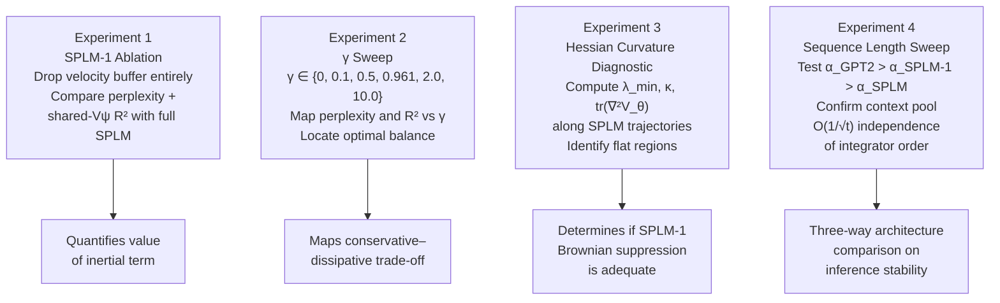

# Replacing the Conservative Mechanism of SPLM with a First-Order ODE

> **Context:** This document examines whether the ScalarPotentialLM (SPLM) — whose
> layer-wise dynamics are governed by a damped second-order (symplectic Euler) integrator
> of a learned scalar potential $V_\theta(\xi_t, h)$ — can be effectively replaced by a
> first-order gradient flow ODE. The analysis covers the mathematical reduction, what is
> preserved and lost, the spectrum of possible regimes, conditions under which the
> first-order approximation is adequate, and a concrete experimental programme to
> empirically quantify the trade-offs.

---

## Table of Contents

1. [SPLM's Current Dynamical Character](#1-splms-current-dynamical-character)
2. [SPLM is Already a First-Order System — In Disguise](#2-splm-is-already-a-first-order-system--in-disguise)
3. [The First-Order Reduction: Gradient Flow (SPLM-1)](#3-the-first-order-reduction-gradient-flow-splm-1)
4. [What Is Preserved](#4-what-is-preserved)
5. [What Is Lost](#5-what-is-lost)
6. [The Conservative–Dissipative Spectrum](#6-the-conservativedissipative-spectrum)
7. [When Is SPLM-1 Effective Enough?](#7-when-is-splm-1-effective-enough)
8. [Experimental Recommendations](#8-experimental-recommendations)
9. [Summary](#9-summary)

---

## 1. SPLM's Current Dynamical Character

The ScalarPotentialLM (SPLM) implements the Euler–Lagrange equations of a single learned
scalar potential $V_\theta(\xi_t, h)$ via a **damped symplectic Euler integrator** at each
layer $\ell$:

$$h_t^{(\ell+1)} = h_t^{(\ell)} - \beta_\ell \,\nabla_h V_\theta\!\left(\xi_t,\, h_t^{(\ell)}\right) - \gamma\, v_t^{(\ell)} \tag{1}$$

$$v_t^{(\ell+1)} = \nabla_h V_\theta\!\left(\xi_t,\, h_t^{(\ell)}\right) \tag{2}$$

where:
- $\xi_t = \frac{1}{t}\sum_{s \leq t} h_s$ is the causal cumulative-mean context vector
- $V_\theta(\xi_t, h)$ is a learned 2-layer MLP scalar potential with hidden dimension 512
- $\beta_\ell$ is the per-layer step size scalar
- $\gamma$ is the learned scalar damping coefficient (empirically: $\gamma = 0.961$)
- $v_t^{(\ell)}$ is the velocity (momentum) buffer at layer $\ell$

The per-layer operator satisfies:

$$M_\ell(h) = -\beta_\ell\, \nabla^2_h V_\theta(\xi_t, h_\ell)$$

for the **same** $V_\theta$ at every layer, making SPLM conservative by construction.
This is empirically confirmed by the shared-$V_\psi$ test: $R^2 = 0.90$ for SPLM
vs. $R^2 = 0.19$ for GPT-2.

The learned $\gamma = 0.961 < 1$ places SPLM in the **near-underdamped regime** —
close to conservative, with mild dissipation. This is the regime where the
conservative-dissipative balance supporting the Semantic Simulation Lagrangian
prescription is maintained.

---

## 2. SPLM is Already a First-Order System — In Disguise

The damped second-order ODE that equations (1)–(2) discretize is:

$$\ddot{h} + \gamma\, \dot{h} + \beta\, \nabla_h V_\theta(\xi, h) = 0 \tag{3}$$

This is second-order in $h$. However, by introducing the augmented state
$\mathbf{z} = (h, v)^\top \in \mathbb{R}^{2d}$, equation (3) is exactly equivalent to
the **first-order system in phase space**:

$$\frac{d}{d\ell}\begin{pmatrix} h \\ v \end{pmatrix}
= \begin{pmatrix} v \\ -\gamma\, v - \beta\, \nabla_h V_\theta(\xi, h) \end{pmatrix}
\tag{4}$$

In this sense, SPLM is already a first-order ODE — just in the **doubled state space**
$\mathbb{R}^{2d}$ tracking both position $h$ and velocity $v$. The question of whether
SPLM can be replaced by a first-order ODE is therefore a question of whether the
**velocity component $v$ can be dropped** without material loss.

---

## 3. The First-Order Reduction: Gradient Flow (SPLM-1)

### 3.1 The Overdamped Limit

The natural first-order reduction is obtained by taking the **overdamped limit**
$\gamma \to \infty$, where inertia $\ddot{h}$ becomes negligible relative to damping.
Equation (3) reduces to:

$$\gamma\, \dot{h} = -\beta\, \nabla_h V_\theta(\xi, h)$$

Absorbing $\gamma$ into a rescaled step size $\tilde{\beta} = \beta / \gamma$:

$$\boxed{\dot{h} = -\tilde{\beta}\, \nabla_h V_\theta(\xi, h)} \tag{5}$$

This is **gradient flow** — the continuous-time steepest descent on the energy landscape
$V_\theta(\xi, h)$.

### 3.2 The SPLM-1 Architecture

Discretizing equation (5) with step size $\beta_\ell$ gives the layer-wise update rule
for **SPLM-1** (the first-order variant):

$$\boxed{h_t^{(\ell+1)} = h_t^{(\ell)} - \beta_\ell\, \nabla_h V_\theta\!\left(\xi_t,\, h_t^{(\ell)}\right)} \tag{6}$$

SPLM-1 retains:
- The scalar potential $V_\theta(\xi_t, h)$ as architectural primitive
- The causal context pool $\xi_t$
- The shared-$V_\psi$ geometric structure

SPLM-1 **drops**:
- The velocity buffer $v_t^{(\ell)}$ entirely
- The damping parameter $\gamma$
- All inertial dynamics

---

## 4. What Is Preserved

### 4.1 Scalar Potential as Architectural Primitive

SPLM-1 still uses $V_\theta(\xi_t, h)$ as its sole governing function. Every layer still
computes $-\beta_\ell \nabla_h V_\theta$ from the **same** shared potential. The
shared-$V_\psi$ test argument survives:

$$M_\ell(h) = -\beta_\ell\, \nabla^2_h V_\theta(\xi_t, h_\ell) \quad \forall\, \ell$$

The $R^2$ metric from the shared-$V_\psi$ test should remain high, since the geometric
structure of the energy landscape is unchanged.

### 4.2 Context Pool and $O(1/\sqrt{t})$ Noise Suppression

The causal cumulative-mean context:

$$\xi_t = \frac{1}{t} \sum_{s \leq t} h_s$$

and its Brownian noise suppression property are unchanged. The context pool noise at
inference still scales as:

$$\left\|\tilde{\xi}_t - \xi_t^*\right\|_2 \propto \frac{\sigma}{\sqrt{t}}$$

This $O(1/\sqrt{t})$ self-correction — the inverse of the $O(\sqrt{t})$ Brownian cone
growth in standard transformers — is a property of the averaging operator, not of the
order of the integrator.

### 4.3 Restoring Force Toward the Energy Minimum

Gradient flow always moves $h$ in the direction of steepest descent of $V_\theta$.
The restoring force:

$$\mathbf{F}_\text{restore} = -\beta_\ell\, \nabla_h V_\theta(\xi_t, h_t^{(\ell)})$$

is preserved and is in fact the **only** force in SPLM-1 (no damping term to compete
with). For perturbations that move $h$ away from a minimum of $V_\theta$, the restoring
force is at least as strong as in the full SPLM — the velocity term in the full SPLM
can actually fight the gradient near the minimum.

### 4.4 Strictly Dissipative Layer-Space Dynamics

In SPLM-1, the divergence of the gradient flow vector field is:

$$\nabla_h \cdot \mathbf{f} = -\beta_\ell\, \text{tr}\!\left(\nabla^2_h V_\theta(\xi_t, h)\right)$$

For a locally convex $V_\theta$ (positive definite Hessian), this is strictly negative —
SPLM-1 is **strictly dissipative** at the layer level. Layer-wise perturbations are
always contracted. In the full SPLM, this contraction was tunable via $\gamma$; in
SPLM-1 it is determined purely by the curvature of $V_\theta$.

---

## 5. What Is Lost

### 5.1 The Conservative-Dissipative Balance

This is the most fundamental loss. The current SPLM's learned $\gamma = 0.961$ sits
deliberately in the near-underdamped regime — close to conservative
($\gamma = 0$, Hamiltonian) but with mild dissipation. The shared-$V_\psi$ $R^2 = 0.90$
result reflects this balance.

SPLM-1 (pure gradient flow) is **strictly dissipative** everywhere:

$$\nabla_h \cdot \mathbf{f}_\text{SPLM-1} < 0 \quad \forall\, h$$

There is no tunable $\gamma$ to recover the conservative limit. The trajectory is always
attracted strictly downhill — the system cannot orbit a minimum, only converge to it.
While the shared-$V_\psi$ test may still pass geometrically (same $V_\theta$), the
**dynamical character** has fundamentally changed from the Semantic Simulation
prescription, which requires a regime consistent with a Lagrangian / variational
principle, not a purely dissipative one.

### 5.2 Inertia and Energy-Barrier Traversal

The second-order system (equation 3) allows trajectories to **overshoot** local minima,
building up kinetic energy $T = \frac{1}{2}\|v\|^2$ to traverse energy barriers and
explore the landscape beyond the nearest basin:

$$E_\text{total} = T + V_\theta(\xi, h) = \frac{1}{2}\|v\|^2 + V_\theta(\xi, h)$$

In gradient flow (SPLM-1), kinetic energy is identically zero. The trajectory is always
attracted strictly downhill and cannot escape a local minimum once it enters the basin
of attraction. For language modeling, where semantic trajectories must traverse complex,
multi-modal energy landscapes, this limitation is non-trivial.

### 5.3 Brownian Suppression for Small Perturbations

The layer-space Brownian suppression argument for the full SPLM relied on $-\gamma v_t$
actively contracting perturbations regardless of where $h$ sits on the energy landscape.
In SPLM-1, suppression operates only via $-\beta_\ell \nabla_h V_\theta$ — which is weak
near flat regions (saddles, plateaux) of $V_\theta$ where:

$$\nabla_h V_\theta(\xi_t, h) \approx 0$$

Concretely, the layer-$\ell$ contraction factor for a perturbation $\delta h$ in SPLM-1 is:

$$\|\delta h^{(\ell+1)}\|_2 \approx \left\|\left(I - \beta_\ell\, \nabla^2_h V_\theta\right) \delta h^{(\ell)}\right\|_2$$

When $\nabla^2_h V_\theta \approx 0$ (flat region), this approaches $\|\delta h^{(\ell)}\|_2$
— no suppression. The full SPLM always has $\gamma \|\delta v^{(\ell)}\|$ as an
additional contraction independent of landscape curvature.

### 5.4 Near-Underdamped Oscillatory Dynamics

The learned $\gamma = 0.961 < 1$ in the full SPLM places it in the underdamped regime,
where the characteristic equation of (3):

$$\lambda^2 + \gamma \lambda + \beta \kappa = 0, \quad \kappa = \nabla^2_h V_\theta$$

has complex roots $\lambda = -\frac{\gamma}{2} \pm i\sqrt{\beta\kappa - \frac{\gamma^2}{4}}$
when $\beta\kappa > \frac{\gamma^2}{4}$. This gives **oscillatory decay** — trajectories
spiral toward the minimum, encoding rhythmic, compositional structure in the dynamics.

Gradient flow has only real negative eigenvalues — monotone convergence, no oscillation.
This oscillatory capacity may be important for representing the rhythmic and compositional
structure of language sequences.

---

## 6. The Conservative–Dissipative Spectrum

The transition from SPLM to SPLM-1 sweeps the full range of dynamical character,
parameterized by $\gamma$:

```mermaid
flowchart LR
    A["$$\\gamma \\to 0$$\nHamiltonian\nConservative\n$$\\nabla \\cdot F = 0$$\nPhase-volume preserved\nOscillatory / symplectic"]
    --> B["$$\\gamma = 0.961$$\nCurrent SPLM\nNear-underdamped\nConservative–dissipative\nbalance\nOscillatory decay"]
    --> C["$$\\gamma \\to \\infty$$\nSPLM-1 / Gradient flow\nOverdamped\nPurely dissipative\n$$\\nabla \\cdot F < 0$$\nMonotone convergence"]
```

| Parameter | Hamiltonian ($\gamma = 0$) | SPLM ($\gamma = 0.961$) | SPLM-1 ($\gamma \to \infty$) |
|---|---|---|---|
| Phase-space volume | Preserved | Mildly contracted | Strongly contracted |
| Eigenvalues of $M_\ell$ | Purely imaginary | Complex (underdamped) | Real negative |
| Trajectory character | Oscillatory | Oscillatory decay | Monotone descent |
| Layer-space Brownian suppression | None | Tunable via $\gamma$ | Via $\nabla^2 V_\theta$ only |
| Energy-barrier traversal | Full | Partial | None |
| Semantic Simulation prescription | Marginal | ✅ Satisfies | Borderline |
| Shared-$V_\psi$ $R^2$ | High | $0.90$ (confirmed) | Predicted high |

---

## 7. When Is SPLM-1 Effective Enough?

There are three scenarios where the first-order reduction is a reasonable trade-off:

### Scenario 1: Geometric Structure is the Primary Goal

If the objective is to satisfy the shared-$V_\psi$ test and the Semantic Simulation
geometric prescription — demonstrating that all layers are governed by a single energy
landscape — SPLM-1 achieves this. The geometric pillar of the SPLM argument survives,
since $V_\theta$ is still the architectural primitive. The dynamical pillar (Brownian
suppression, oscillatory capacity) is weakened.

### Scenario 2: Computational Efficiency Dominates

Dropping $v_t^{(\ell)}$ halves the per-layer state from $\mathbb{R}^{2d}$ to
$\mathbb{R}^d$ and eliminates equation (2). The per-layer computation reduces from:

$$\text{SPLM cost: } 2 \times \nabla_h V_\theta + \text{velocity update}$$

to:

$$\text{SPLM-1 cost: } 1 \times \nabla_h V_\theta$$

For large $d$, this is meaningful. If perplexity is comparable, SPLM-1 is the more
parsimonious architecture.

### Scenario 3: $V_\theta$ Has Large Uniform Curvature

If the learned potential has strong, consistent curvature $\nabla^2_h V_\theta \gg 0$
everywhere, the gradient flow restoring force is strong at all points on the landscape,
and the Brownian suppression argument survives without the $-\gamma v_t$ term. This is
empirically testable by examining the eigenvalue spectrum of the Hessian $\nabla^2_h V_\theta$
along SPLM trajectories.

---

## 8. Experimental Recommendations

### 8.1 The SPLM-1 Ablation (Primary Experiment)

**Design.** Train SPLM-1 (equation 6) on Tiny Shakespeare with identical hyperparameters
to the full SPLM ($d=128$, $L=8$, same learning rate and epochs). The only change is
replacing equations (1)–(2) with equation (6) — dropping $v_t^{(\ell)}$ and $\gamma$.

**Metrics.**

| Metric | Prediction |
|---|---|
| Shared-$V_\psi$ $R^2$ | Stays high — same $V_\theta$ governs all layers |
| Validation perplexity | Increases — inertia lost, mode exploration reduced |
| Training loss curve | Similar or slightly slower convergence |

**Interpretation.** The perplexity gap between SPLM and SPLM-1 directly quantifies the
value of the second-order (inertial) component. If the gap is small, SPLM-1 is a viable
lightweight alternative. If large, the velocity term is essential.

### 8.2 The $\gamma$ Sweep Experiment

**Design.** Train a family of SPLM models with $\gamma \in \{0, 0.1, 0.5, 0.961, 2.0, 10.0\}$,
sweeping from Hamiltonian ($\gamma = 0$) through current SPLM ($\gamma = 0.961$) to
near-overdamped ($\gamma = 10$).

**Metrics per $\gamma$:**

1. Validation perplexity
2. Shared-$V_\psi$ $R^2$
3. Trajectory deviation $\|h_t - h_t^*\|_2$ vs. sequence length (Brownian suppression)

**Expected results.** Perplexity should be convex-shaped in $\gamma$ — too low $\gamma$
(conservative) leads to poor optimization, too high $\gamma$ (overdamped) leads to poor
exploration, with a minimum near the empirically learned $\gamma = 0.961$. The
shared-$V_\psi$ $R^2$ should remain high across the sweep, since the potential $V_\theta$
is shared regardless of $\gamma$.

**Key plot.** Plot perplexity vs. $\gamma$ on a log scale. The minimum identifies the
empirically optimal conservative–dissipative balance. The value at $\gamma \to \infty$
is the SPLM-1 baseline.

### 8.3 The Hessian Curvature Diagnostic

**Design.** Along SPLM trajectories (teacher-forced, inference mode), compute the
eigenvalue spectrum of the Hessian $\nabla^2_h V_\theta(\xi_t, h_t^{(\ell)})$ at each
layer and token position.

**Metrics:**

1. Minimum eigenvalue $\lambda_\text{min}$ — identifies flat/saddle regions where SPLM-1
   would fail to suppress perturbations
2. Condition number $\kappa = \lambda_\text{max} / \lambda_\text{min}$ — quantifies
   landscape anisotropy
3. Distribution of $\text{tr}(\nabla^2_h V_\theta)$ — determines layer-space contraction
   rate in SPLM-1

**Interpretation.** If $\lambda_\text{min} \gg 0$ everywhere, SPLM-1 suppresses Brownian
perturbations as effectively as full SPLM. If significant flat regions exist ($\lambda_\text{min} \approx 0$), the full SPLM's $-\gamma v_t$ term is essential.

### 8.4 The Sequence Length Sweep for SPLM-1

Extend the sequence length sweep experiment (from the Brownian motion document) to
include SPLM-1 as a third architecture alongside GPT-2 and full SPLM.

**Testable predictions for SPLM-1:**

$$\|h_t - h_t^*\|_2 \propto \sigma\, t^\alpha$$

with $\alpha$ predicted to satisfy:

$$\alpha_\text{GPT-2} \approx 0.5 \quad > \quad \alpha_\text{SPLM-1} \quad > \quad \alpha_\text{SPLM}$$

SPLM-1 should suppress Brownian growth better than GPT-2 (context pool $O(1/\sqrt{t})$
suppression intact) but worse than full SPLM (no $-\gamma v_t$ contraction). The ordering
of the three slopes on a log-log plot is a clean, falsifiable three-way prediction.

The context pool noise diagnostic applies identically:

$$\left\|\tilde{\xi}_t - \xi_t^*\right\|_2 \propto \frac{\sigma}{\sqrt{t}}$$

This should be **identical** between SPLM and SPLM-1, since the context pool is
independent of the integrator order.

### 8.5 Full Experiment Summary



---

## 9. Summary

### 9.1 Core Results

| Question | Answer |
|---|---|
| Can SPLM be a first-order ODE? | Yes — gradient flow $\dot{h} = -\nabla_h V_\theta(\xi, h)$ |
| Is SPLM already first-order? | Yes — in augmented phase space $(h, v) \in \mathbb{R}^{2d}$ |
| What does SPLM-1 preserve? | $V_\theta$, $\xi_t$, shared-$V_\psi$ geometry, restoring force |
| What does SPLM-1 lose? | $\gamma$ balance, inertia, energy-barrier traversal, oscillatory dynamics |
| Is layer-space Brownian suppression preserved? | Partially — only near regions of high curvature $\nabla^2_h V_\theta$ |
| Is context pool $O(1/\sqrt{t})$ suppression preserved? | Yes — independent of integrator order |
| When is SPLM-1 adequate? | Geometric tests only; high-curvature $V_\theta$; compute-constrained settings |
| Key empirical discriminator | Perplexity gap between SPLM and SPLM-1; $\gamma$ sweep minimum location |

### 9.2 The Central Tension

SPLM-1 is a geometrically faithful but dynamically impoverished version of SPLM. It
preserves the architectural argument that all layers are governed by a single scalar
energy landscape — but sacrifices the conservative–dissipative balance that places the
current SPLM in the near-underdamped regime consistent with the Semantic Simulation
Lagrangian prescription. The learned $\gamma = 0.961$ is not an incidental parameter —
it is evidence that the system has self-organized into the specific dynamical regime the
Semantic Simulation framework prescribes.

### 9.3 One-Sentence Answer

> *SPLM can be realized as first-order gradient flow $\dot{h} = -\nabla_h V_\theta(\xi, h)$,
> preserving the geometric and energy-landscape arguments while sacrificing the
> conservative–dissipative balance encoded in $\gamma$, the inertial dynamics enabling
> energy-barrier traversal, and the curvature-independent Brownian suppression of the
> $-\gamma v_t$ term — making SPLM-1 an effective approximation for geometric purposes
> but a structurally distinct and dynamically weaker system.*

---

## References

- Huang, H., LeCun, Y., & Balestriero, R. (2026). *Semantic Tube Prediction: Beating
  LLM Data Efficiency with JEPA.* arXiv:2602.22617.
- Yang, G. & Littwin, E. (2021). Tensor Programs IIb: Architectural universality of
  neural tangent kernel training dynamics. *ICML*.
- Khalil, H. K. (2002). *Nonlinear Systems.* Prentice Hall.
- Lanczos, C. (1966). *The Variational Principles of Mechanics.* University of Toronto
  Press.
- Tong, A. et al. (2025). Neural ODE Transformers: Analyzing internal dynamics and
  adaptive fine-tuning. *ICLR*.
