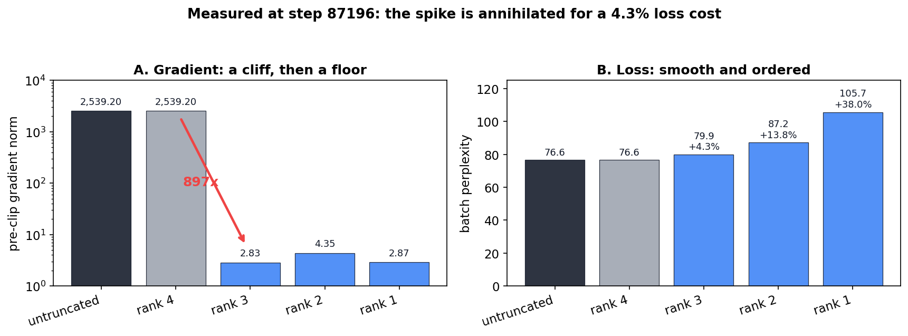
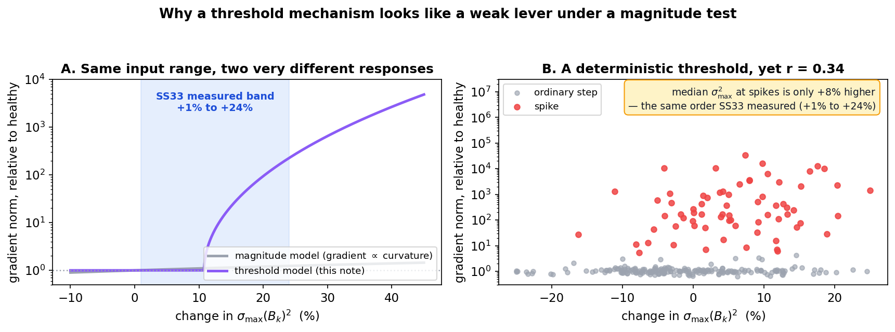
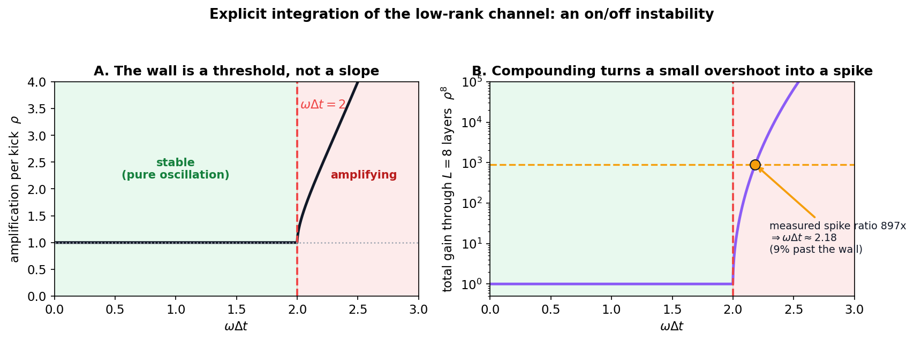
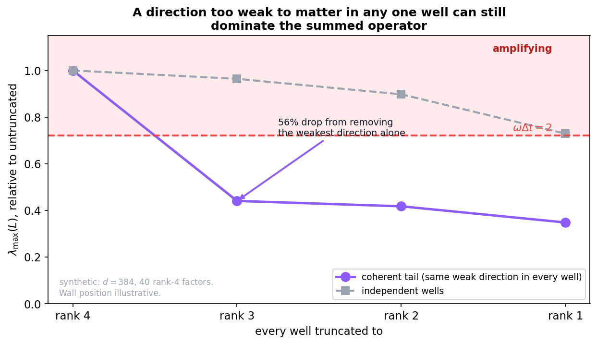
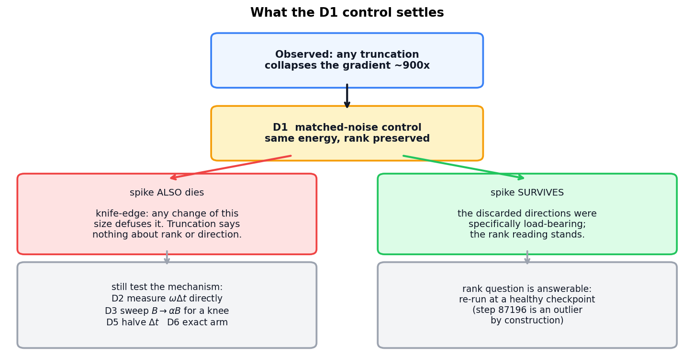

# Resonance, Not Magnitude: a Threshold Hypothesis for Gradient Spikes in the Low-Rank Kick

**Status: hypothesis under test.** One strong observation, a mechanism that
would explain it and would reconcile two previously awkward findings, and a
cost-ordered programme to confirm or kill it. Nothing here is established.
The decisive control has not yet been run.

---

## 1. The observation

Stage 2 of the rank-selection procedure (see
`Curvature_Diagnostics_and_Rank_Selection_for_Aniso_Gaussian_Vtheta.md` §7.3)
was run against the step-87196 spikebatch capture with
`replay_rank_truncation_ablation`. Each arm replays the identical captured
batch with every realised $B_k$ replaced by its rank-$r'$ SVD truncation.

| arm | pre-clip grad norm | ntp | batch PPL |
|---|---|---|---|
| untruncated | 2539.20 | 4.3385 | 76.6 |
| rank = 4 (no-op) | 2539.20 | 4.3385 | 76.6 |
| rank = 3 | 2.83 | 4.3808 | 79.9 |
| rank = 2 | 4.35 | 4.4682 | 87.2 |
| rank = 1 | 2.87 | 4.6609 | 105.7 |

The `rank = 4` arm is a built-in fidelity check — the truncation is a true
no-op at full rank — and it reproduces the untruncated arm exactly, so the
harness is sound. The untruncated arm also reproduces the value training
recorded live, 2539.2.

Three things about this table are hard to explain with the account of spikes
we currently hold:

1. **Dropping only the smallest of four directions collapses the gradient by
   a factor of about 900**, from 2539 to 2.83. It does not attenuate it
   proportionately; it returns the network to an ordinary, healthy gradient
   norm.
2. **The loss barely notices.** That same truncation costs 4.3% batch
   perplexity. A change that annihilates the spike is nearly free in the
   objective.
3. **The collapse does not deepen with more aggressive truncation.** Ranks
   3, 2 and 1 give 2.83, 4.35 and 2.87 — noise around a common floor, not a
   trend. Whatever is switched off is switched off entirely by the first
   step.

Meanwhile `ntp` behaves perfectly smoothly across the same arms (4.3385,
4.3808, 4.4682, 4.6609), so the forward pass is responding continuously to
truncation. Only the gradient is discontinuous.

> Note on the fourth column of the probe's output. Its
> `relative_force_error` reads 0.9999, 1.0002 and 0.9998 for ranks 3, 2 and
> 1, and those numbers are uninformative here. Writing $g$ for the full
> gradient and $g'$ for a truncated one, the metric is
> $\lVert g' - g \rVert / \lVert g \rVert$; once $g'$ collapses to about
> 0.1% of $g$, the triangle inequality pins the ratio into
> $[0.9989, 1.0011]$ regardless of which directions were removed. All three
> observed values sit inside that band. Read `ntp` and the gradient norm
> instead.

---

## 2. Why the magnitude account does not fit

The working account of these spikes has been a magnitude one: the low-rank
curvature channel grows too sharp, and sharpness drives the gradient. That
account has never sat comfortably with the bracket measurement in
`CfC_BAOAB_Integrator_and_Mitigations.md` §33, which found
$\sigma_{\max}(B_k)^2$ — the very quantity the sharpness story indicts —
elevated by only +1% to +24%, and non-monotonically, between a healthy
checkpoint and both hard-trigger snapshots. §34.4 drew the reasonable
conclusion that the off-diagonal channel is a weak lever and that `E`, `P`
and `depth_code` lead the real triggers.

The table above is hard to square with "weak lever". A 4.3% perturbation of
the objective, applied to that same off-diagonal channel, removes the spike
completely.

Both results are explained at once if the spike is **not a smooth function
of curvature magnitude but a threshold crossing**. A threshold correlates
weakly with the magnitude of its argument — the argument only has to cross,
and by how much is nearly irrelevant — while remaining exquisitely sensitive
to any change that moves it back across.

The right-hand panel is the point worth dwelling on. It is generated by a
*purely deterministic* threshold, and yet the correlation between spike size
and $\sigma_{\max}(B_k)^2$ comes out at 0.34, with the median elevation at
spikes only about +8% — the same order §33 measured. Weak correlation is not
evidence against the mechanism here; it is what the mechanism predicts. The
reason is in the next section: $\omega \Delta t$ is set by the *summed*
operator, so any single well's $\sigma_{\max}^2$ is only one of its inputs.

---

## 3. The mechanism this would be

`baoab_cfc` splits $V_\theta$'s local curvature into two channels and treats
them differently, as described in
`Analytic_Multi_Channel_Integration_in_Structured_Vtheta.md` and in the
integrator note. The diagonal part is integrated **exactly** by the
closed-form harmonic propagator and carries no stability constraint. The
off-diagonal part,

$$L = \sum_k g_k B_k B_k^\top, \qquad g_k = w_k \exp\left(-\frac{1}{2} e_k\right),$$

is integrated as an **explicit kick**. Explicit integration of a harmonic
mode of frequency $\omega$ at step $\Delta t$ is stable only while

$$\omega \Delta t \lt 2,$$

and the relevant frequencies are $\omega_i = \sqrt{\lambda_i}$ for the
eigenvalues $\lambda_i$ of $L$. So the governing quantity is

$$\omega_{\max} \Delta t = \Delta t \sqrt{\lambda_{\max}(L)}.$$

This is a hard threshold. Below it the mode oscillates and the kick is
merely inaccurate; above it the mode amplifies geometrically, once per
application. Through $L = 8$ layers an amplification factor $\rho \gt 1$
compounds as $\rho^8$.

### A number this predicts

The amplification per application is exact, not a modelling choice. The
leapfrog recurrence for a harmonic mode is

$$x_{n+1} - (2 - h^2) x_n + x_{n-1} = 0, \qquad h = \omega \Delta t,$$

whose roots have modulus 1 while $h \lt 2$. Beyond the wall one root is real
and larger, giving the per-layer amplification

$$\rho = |a| + \sqrt{a^2 - 1}, \qquad a = 1 - \frac{h^2}{2}.$$

Inverting $\rho^8$ against the measured ratio $2539.20 / 2.83 = 897$ gives
$\rho = 2.34$ per layer and

$$\omega \Delta t \approx 2.18,$$

about 9% past the wall. That is a genuine prediction for D2 below, and a
sharp one: the hypothesis does not merely say "something exceeded a
threshold", it says the excursion should be *small*. If a direct measurement
finds the top mode at $\omega \Delta t$ of 5 or 10, the compounding
arithmetic does not work and the mechanism is wrong. Three caveats — the
estimate assumes undamped leapfrog (BAOAB's friction adds margin), a uniform
excursion across layers, and amplification as the sole source of the 897x
ratio — so treat it as an order-of-magnitude consistency check rather than a
precise target.

Four consequences, matching the four puzzles above:

**It explains the weak magnitude correlation.** If the model normally
operates just below the wall, a 10% rise in $\sigma_{\max}^2$ is enough to
carry $\omega \Delta t$ from 1.95 to 2.05 and flip stability. Correlation
between spike size and curvature size is then expected to be poor, which is
what §33 measured.

**It explains why removing the smallest direction is enough.** $\lambda_{\max}(L)$
is the top eigenvalue of a *sum* over $K = 8$ wells and $n_c = 5$ channels —
up to 160 rank-one contributions in a $d = 384$ space. The relevant quantity
is therefore not any single well's spectrum but the alignment structure of
the sum, and those two can come apart completely.

The sharp case is a **coherent tail**: a direction that is individually
negligible in every single well, the smallest singular direction of each
$B_k$, yet placed similarly by all 40 factors. Individually it is beneath
notice. Collectively it adds as $40 c^2$ while the incoherent bulk adds only
as $\sqrt{40}$, so it can dominate $\lambda_{\max}$ outright. Truncation
removes it from all 40 factors simultaneously — which is exactly what
truncating each well by one direction does.

A synthetic construction at the deployed shape puts numbers on the gap. With
independent wells, truncating rank 4 to rank 3 costs 4% of
$\lambda_{\max}(L)$ — the gentle, proportional loss one would expect. With a
coherent tail it costs **56%**, and the curve then flattens, with ranks 2 and
1 taking it only a little further. That shape — one cliff, then a floor — is
the shape the measured gradient column has, and nothing in the construction
was fitted to it.

This also reframes what a "small" direction means. Under the participation
ratio, a well spreading its budget evenly across four directions
(`pr_p50 = 3.68/4`) looks healthy and unconcentrated. Coherence across wells
is invisible to that statistic, because it is a per-well measure. Two wells
can each be perfectly well-conditioned while their fourth directions point
the same way.

**It explains why the loss barely moves.** The potential's *value* is
dominated by the leading directions; the integrator's *stability* is
governed by the operator norm of the summed curvature. These are different
functionals of the same $B_k$, and one can be changed sharply while the
other barely moves.

**It explains the all-or-nothing floor.** A spike under this account is an
amplification event, not a large-but-ordinary gradient. Switch the
amplification off and what remains is the baseline the network would have
produced anyway — about 3 — with no dependence on how far past the wall the
system had been.

It also explains the otherwise awkward fact that the spike's largest
contributors are `register`, `depth_code` and `creation_gate` rather than
$V_\theta$ itself. Amplification in $h$ propagates backward into every
parameter upstream of the hidden state, so the groups that *report* the
spike need not be the ones that *cause* it.

---

## 4. What would falsify it

The hypothesis is worth exactly as much as the tests that could kill it.

**F1. The perturbation control collapses too.** The truncation confounds two
things: it removes specific directions, and it changes $B$ by a particular
magnitude. `replay_rank_perturbation_control` holds the magnitude and drops
the specificity — isotropic noise carrying exactly the discarded energy,
leaving $B$ full rank. If the spike also dies under matched noise, then
*any* perturbation of that size defuses it, the truncation result says
nothing about rank or direction, and the resonance reading needs the
independent evidence of F2 and F3 to survive at all. **This has not been
run. It should be run first.**

**F2. No token or layer is over the wall.** If a direct measurement of
$\Delta t \sqrt{\lambda_{\max}(L)}$ at the spike checkpoint finds nothing
near 2, the mechanism is simply absent and the hypothesis is dead.

**F3. The transition is smooth, not sharp.** A threshold implies a knee.
Scaling $B \mapsto \alpha B$ continuously should show the gradient norm
jumping at some $\alpha^\ast \lt 1$, not ramping.

Three alternatives to keep live:

- **A1. Generic fragility.** The spike is sensitive to any perturbation of
  $V_\theta$, with no threshold involved. F1 addresses this.
- **A2. Occupancy reshuffling.** Truncation changes $B_k$, hence the
  exponent $e_k$, hence $g_k$ — so which wells are active shifts, and the
  spike may be a property of one particular occupancy pattern rather than of
  stiffness. Distinguishable by recording $g_k$ occupancy alongside each arm
  and checking whether the defused arms differ in *which* wells fire.
- **A3. Something outside the well potential.** The spike is genuinely a
  register or
  depth-code phenomenon and $V_\theta$ truncation disturbs it only
  incidentally. The layer-profile prediction in D4 separates this.

---

## 5. Diagnostic programme, cost-ordered

**D1. Run the perturbation control.** `replay_rank_perturbation_control` at
step 87196 with `ranks=(1, 2, 3)`, matching the truncation run. Minutes, same
harness, settles F1. Everything below is worth doing only if the spike
survives matched noise.

**D2. Measure the wall directly.** `lowrank_modes` in `cfc_baoab.py` already
returns the mode stiffnesses `kappa` for exactly this operator; the quantity
wanted is $\Delta t \sqrt{\kappa_{\max}}$ per token, per layer. Compare the
distribution at the spike capture against a healthy checkpoint. The
prediction is specific: a tail crossing 2 at the spike and nothing near it
when healthy. This needs no replay, only a forward pass, and it is the
single most informative measurement available.

**D2b. Measure cross-well coherence of the tail directions.** Implied by the
coherent-tail mechanism in §3 and not covered by any existing statistic: for
each layer and channel, take the last right-singular vector of every well's
$B_k$ and compute the pairwise cosine matrix across wells, or equivalently
the participation ratio of the 40 tail directions taken together. The
prediction is that this coherence is elevated at the spike capture relative
to a healthy checkpoint, *while per-well participation ratios stay flat*.
That combination is the signature, and it is a weight-only measurement
needing no replay at all — the same cost class as `stiffness_report`. It is
also the measurement most likely to be *newly* informative, since every
statistic collected so far has been per-well and is blind to this by
construction.

**D3. Sweep the scale for a knee.** Replay with $B \mapsto \alpha B$ for
$\alpha$ across roughly 0.90 to 1.00. A sharp transition confirms a
threshold; a smooth ramp refutes it. A small variant of the truncation
harness, and it also locates how far past the wall the spike sits.

**D4. Per-layer amplification profile.** Compounding predicts geometric
growth of the boundary gradient through the stack at a spike and a flat
profile when healthy. `replay_spike_batch(per_layer=True)` already records
`per_layer_h_grad`, so this may be answerable from captures already in hand.
A flat profile at the spike would also support A3 over the resonance story.

**D5. Halve the step.** The wall is on $\omega \Delta t$, not on $\omega$.
Replaying the identical weights and batch at reduced $\Delta t$ should defuse
the spike at some $\Delta t^\ast$, with no change to the model at all. This
is as close to a controlled experiment on the mechanism as the setup allows.

**D6. Replay the spike batch under `baoab_cfc_lowrank`.** That arm
integrates the low-rank channel exactly and therefore has no
$\omega \Delta t$ wall, so under this hypothesis it should defuse the spike
outright. Note the reframing this implies: §34 retired the arm as too
expensive for *training* — about 120 s/step against 10-15 s/step, see
§7 of `Anisotropic_Rank_r_Frozen_Force_and_LowRank_CfC_BAOAB.docx` for the
cost analysis — but its cost is irrelevant for a *single replayed step*. It
becomes a perfectly practical diagnostic instrument. §34.4's separate
judgement that the arm is "aimed at the wrong target" rests on
$\sigma_{\max}(B_k)^2$ being a weak correlate, which is precisely the
inference a threshold mechanism would invalidate. The cost verdict stands
regardless; the targeting verdict may not.

---

## 6. If it holds

The mitigation implied is different from the one currently pursued, and
cheaper. Bounding curvature magnitude (`precision_lr_max`) controls the
threshold's argument only indirectly and pays for it in expressivity
everywhere, including in the great majority of steps that were never near
the wall. A threshold mechanism instead suggests acting on the wall itself:
integrating the stiff low-rank subspace exactly when and only when it
approaches the limit, which is what the impulse/RESPA split of
`baoab_cfc_lowrank` already does, restricted to the few modes and the few
steps that need it. `lowrank_max_modes` and `lowrank_layers` exist and were
measured as insufficient for making the arm affordable across *all* steps;
they were never evaluated as a *conditional* mechanism gated on a measured
$\omega \Delta t$.

That is speculation until D1 and D2 are done. It is recorded here so that
the measurement is made with the question in view.

---

## 7. Provenance

The observation arose from the first successful GPU run of
`replay_rank_truncation_ablation` (step 87196, A100, 2026-09-13), built to
answer Stage 2 of the rank-selection procedure. It does not answer that
question: with any truncation defusing the spike wholesale, the ablation
cannot report what the tail directions contribute. The `ntp` column still
carries a usable Stage 2 reading — each discarded direction costs real
perplexity, 4.3% for the smallest alone, which argues the rank budget is not
idle and is consistent with Stage 1's saturated `pr_p50 = 3.68/4` — but the
rank question should be re-asked at a healthy checkpoint, since step 87196 is
an outlier by construction and the worst possible place to ask what the model
does ordinarily.

The probe implementations live in `semsimula-diag`
(`probes/precision_cap.py`); `MIGRATION.md` there records the measurement and
the several implementation hazards met on the way to it.

Provenance: figures generated by
`companion_notes/figures/_make_resonance_hypothesis_figs.py`. Figure 1 and
the $\omega \Delta t \approx 2.18$ estimate are exact evaluations of the
leapfrog stability formula; Figure 3 reproduces the measured step-87196
table; Figures 2 and 4 are clearly-labelled synthetic illustrations at the
deployed shape, fitted to nothing. Integrator code in
`notebooks/conservative_arch/parf/cfc_baoab.py`
(`lowrank_modes`, `harmonic_terms_lowrank`); well parameters in
`notebooks/conservative_arch/parf/model_aniso_gaussian_vtheta.py`.

Last updated: September 2026 — initial version. States the threshold
mechanism, the compounding estimate, the coherent-tail explanation for why
truncating the weakest direction suffices, and the D1-D6 programme.
