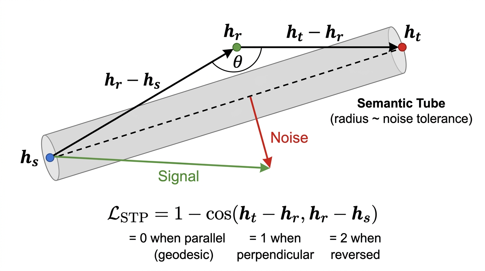
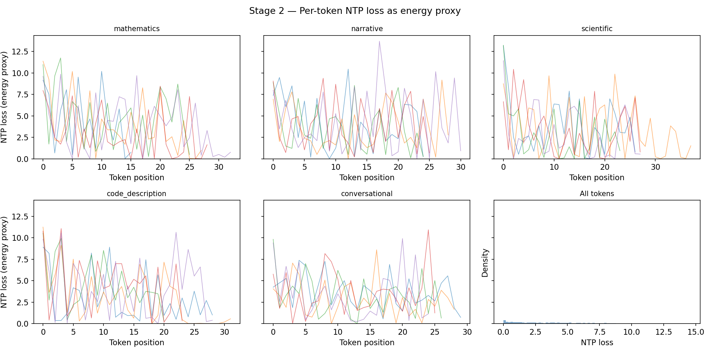
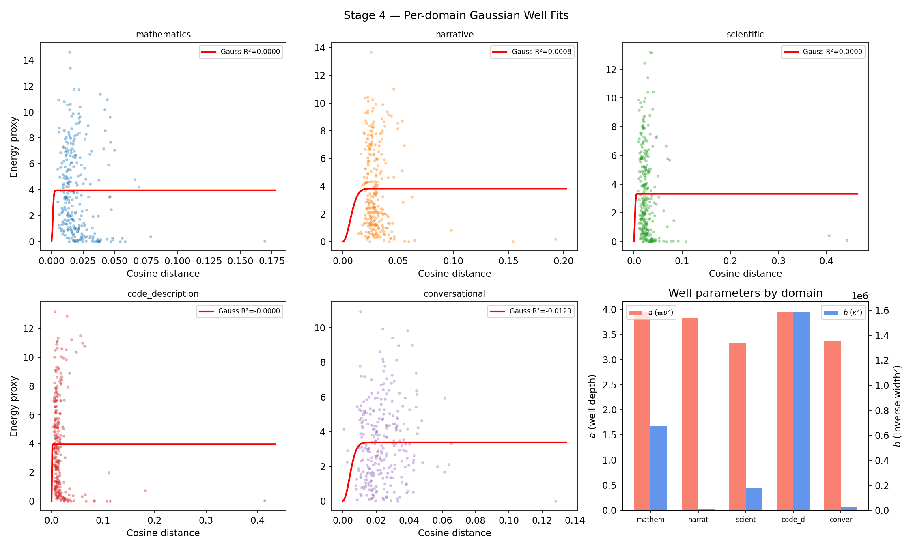
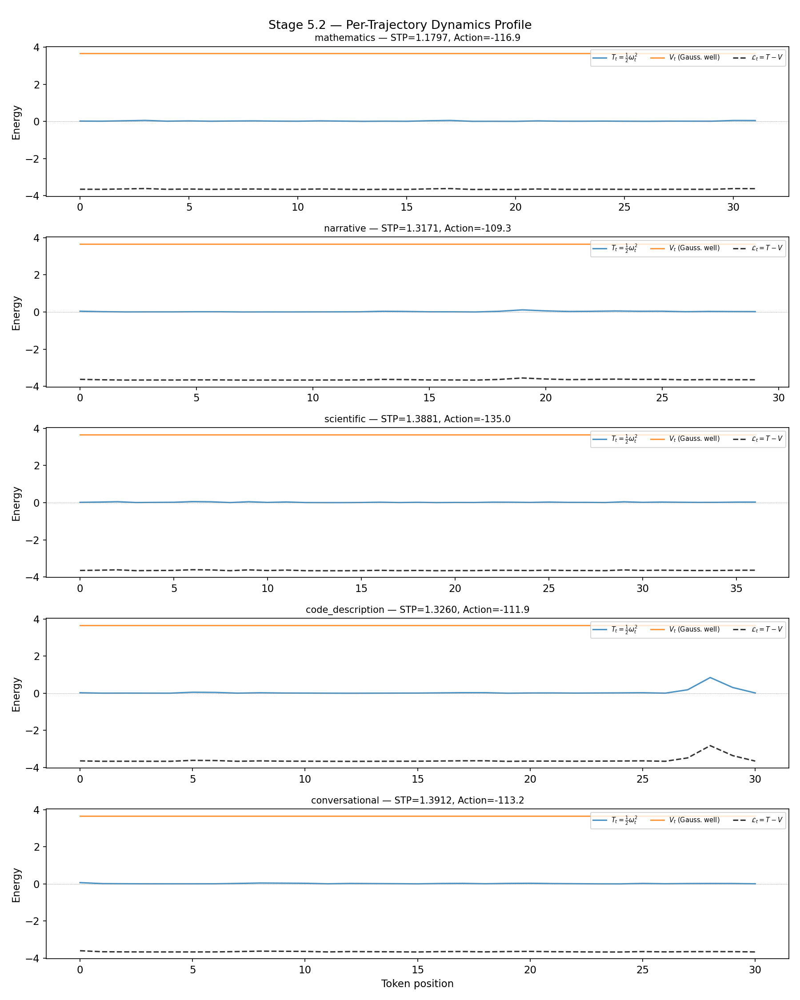
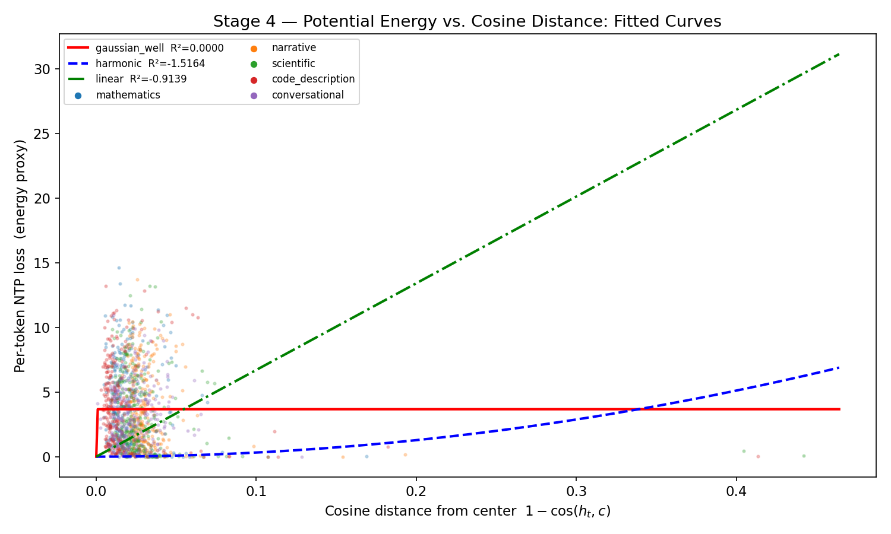
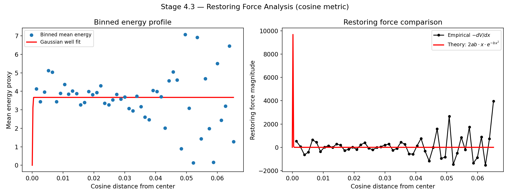
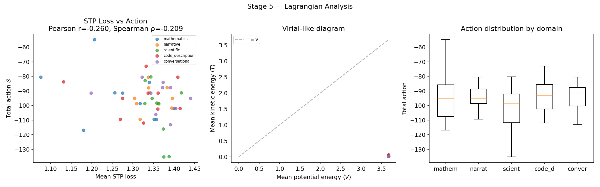

# STP Loss as an Emergent Property of the Energy Landscape Defined by a Gaussian Well Potential

**Work in progress — last updated April 2026**

> **Rendering note.** This document contains LaTeX math (inline `$...$` and display `$$...$$` blocks, with macros such as `\mathfrak{...}`, `\boldsymbol{...}`, `\mathcal{...}`, etc.). The math has been verified to render correctly in **Safari**. In **Chrome** some symbols — notably calligraphic and fraktur letters, e.g. `\mathfrak{C}` rendering as a plain `C` instead of $\mathfrak{C}$ — appear to render incorrectly. **Firefox** has not been tested. If symbols look wrong, please view the document in Safari or consult the main paper's PDF, where the same symbols are typeset by LaTeX directly.

---

## Abstract

The Semantic Tube Prediction (STP) loss introduced by Huang, LeCun, and Balestriero [1] enforces local linearity of hidden state trajectories in transformer-based language models as an auxiliary training objective. The Geodesic Hypothesis posits that error-free token sequences trace geodesics on a smooth semantic manifold, and the STP loss confines actual trajectories to a tubular neighborhood of these geodesics. However, the hypothesis is descriptive — it characterizes the *consequence* (straightness) without identifying the *cause* (what potential or force law produces the geodesic).

Independently, the Semantic Simulation framework developed by Gueorguiev [2][3][4][5] constructs an explicit Lagrangian for semantic space, where the potential energy is given by the Gaussian Inverse Semantic Energy Well [4]. The Euler-Lagrange equations derived from this Lagrangian produce trajectories that are geodesics of the induced Riemannian metric.

This document investigates the conjecture that the STP loss is not an independent geometric prior but rather an **emergent property** of an underlying energy landscape whose structure is captured by the Gaussian well potential. If this conjecture holds, it would provide a theoretical explanation for *why* the Geodesic Hypothesis works and *why* the STP loss improves data efficiency — the loss would be enforcing a constraint that the physics of the representation space already demands.

A preliminary experimental validation was conducted using GPT-2 (124M parameters) as a baseline model. The results are directionally encouraging — the Gaussian well is the best-fitting potential among the candidates tested, domain-dependent well parameters exhibit systematic variation, and the STP-action correlation is positive — but the absolute signal is weak, pointing to specific methodological refinements needed before testing on larger models. This document presents both the theoretical framework and the experimental findings, and concludes with an action plan for continued validation.

---

## 1. Background

### 1.1 The NTP Loss (Next-Token Prediction)

The standard training objective for autoregressive language models is the **Next-Token Prediction (NTP) loss**. Given a token sequence $x_1, x_2, \ldots, x_T$, a transformer model produces, at each position $t$, a probability distribution $p_\theta(x_{t+1} \mid x_{\leq t})$ over the vocabulary. The NTP loss is the cross-entropy between this predicted distribution and the actual next token:

$$\mathcal{L}_{NTP} = -\frac{1}{T-1}\sum_{t=1}^{T-1} \log p_\theta(x_{t+1} \mid x_{\leq t})$$

Equivalently, the per-token NTP loss at position $t$ is $\ell_t = -\log p_\theta(x_{t+1} \mid x_{\leq t})$, which is high when the model assigns low probability to the correct next token and low when the prediction is confident and correct. This per-token quantity plays a central role in the experiments that follow (Sections 7–8), where it serves as a proxy for potential energy in the hidden state space.

### 1.2 The STP Loss (Semantic Tube Prediction)

Let $h_t = f(x_{\leq t}) \in \mathbb{R}^d$ denote the hidden state at the last transformer layer for position $t$. The **Semantic Tube Prediction (STP) loss**, introduced by Huang, LeCun, and Balestriero [1], is defined over three randomly sampled token indices $s < r < t$:

$$\mathcal{L}\_{STP} = 1 - \cos(h_t - h_r, \ h_r - h_s)$$

This measures the angular deviation between consecutive displacement vectors along the hidden state trajectory. When the trajectory is a geodesic (locally linear), the displacement vectors are collinear and $\mathcal{L}\_{STP} = 0$. When the trajectory curves or zigzags, the displacement vectors diverge and $\mathcal{L}\_{STP}$ increases toward its maximum of 2.

The STP loss is used as an auxiliary regularizer alongside the NTP loss. The total training objective is:

$$\mathcal{L} = \mathcal{L}\_{NTP} + \lambda \cdot \mathcal{L}\_{STP}$$

where $\lambda$ is a hyperparameter (empirically, $\lambda = 0.02$ is effective [1]). The NTP loss trains the model to predict the next token; the STP loss additionally constrains the geometry of the hidden state trajectory to be locally linear.

**Figure 1**: The STP loss geometry. The signal component lies along the tube axis (geodesic); the noise component is perpendicular. The loss $\mathcal{L}_{STP}$ penalizes the angle $\theta$ between consecutive displacement vectors.

### 1.3 The Gaussian Inverse Semantic Energy Well

In the Semantic Simulation framework, a semantic property $P_i$ with mass $\mathfrak{m}_i$ traveling toward its bound state in an ensemble experiences a potential energy [4]:

$$V(x) = \mathfrak{m}_i \cdot \upsilon^2 \cdot \left(1 - e^{-\kappa^2 x^2}\right)$$

where $x$ is the distance from the ensemble center, $\upsilon = \sqrt{E_t / \mathfrak{m}_i}$ is the asymptotic velocity under the total net energy $E_t$ of the ensemble [5, eq. 40], $f$ is a normalization coefficient with dimension of semantic frequency, and $\kappa = f/\upsilon$ [4, eq. 6]. This potential satisfies the ODE [4, eq. 13]:

$$\frac{1}{2(1 - 2\xi^2)} \cdot \frac{d^2 y}{d\xi^2} + y(\xi) = \mathfrak{m}_i \cdot \upsilon^2$$

where $\xi = \kappa x$.

### 1.4 The Lagrangian and Euler-Lagrange Equations

The Lagrangian for a single property traveling toward its bound state is [6, eq. 4]:

$$\mathcal{L}_i = \frac{1}{2} \cdot \mathfrak{m}_i \cdot v_i^2 - \mathfrak{m}_i \cdot \upsilon^2 \cdot \left(1 - e^{-\kappa^2 x_i^2}\right)$$

The Euler-Lagrange equations yield the restoring force:

$$\mathfrak{m}_i \cdot \ddot{x}_i = -2 \cdot \mathfrak{m}_i \cdot \upsilon^2 \cdot \kappa^2 \cdot x_i \cdot e^{-\kappa^2 x_i^2}$$

This force pulls the property toward the ensemble center. At large distances from the center, the force vanishes (the potential saturates at $\mathfrak{m}_i \upsilon^2$). At the center, the force also vanishes (equilibrium). The maximum restoring force occurs at $x = 1/(\sqrt{2}\kappa)$, the inflection point of the well [4, eq. 16].

---

## 2. The Conjecture

### 2.1 Statement

**Conjecture**: The hidden state space $\mathbb{R}^d$ of a trained transformer implicitly defines a scalar potential field $V(h)$ with the following properties:

1. $V(h)$ has **local minima** (wells) at semantically coherent hidden states
2. The shape of these wells is approximately **Gaussian inverse** — bounded, with an inflection point, saturating at large distances
3. The trajectories $h_1, h_2, \ldots, h_T$ that minimize the action $\mathcal{S} = \sum_t (T_t - V_t)$ under this potential are **locally linear** (geodesics)
4. The STP loss $\mathcal{L}\_{STP}$ is a **proxy for the deviation from action-minimizing trajectories** — minimizing $\mathcal{L}\_{STP}$ implicitly enforces the constraint that the Euler-Lagrange equations demand

If true, this would mean the STP loss is not an arbitrary geometric regularizer but a consequence of the underlying physics of the representation space.

### 2.2 Why the Gaussian Well is the Right Candidate

The Gaussian inverse potential has several properties that make it a natural candidate for the energy landscape of hidden state space:

| Property | Gaussian well $V(x) = \mathfrak{m}\upsilon^2(1 - e^{-\kappa^2 x^2})$ | Relevance to transformers |
|---|---|---|
| **Bounded** | $V(x) \to \mathfrak{m}\upsilon^2$ as $x \to \infty$ | Hidden states have finite norm (layer normalization) |
| **Smooth** | $C^\infty$ everywhere | Transformer outputs are smooth functions of inputs |
| **Single well** | Unique minimum at $x = 0$ | Each semantic concept has a preferred representation |
| **Inflection point** | At $x = 1/(\sqrt{2}\kappa)$ | Transition between "near the concept" and "far from it" |
| **Flat at infinity** | Force vanishes for $x \gg 1/\kappa$ | Distant concepts exert no force on each other |
| **Restoring force** | $F \propto x \cdot e^{-\kappa^2 x^2}$ | Small perturbations from a semantic state are corrected |

A harmonic potential ($V = \frac{1}{2}kx^2$) would not be bounded and would impose unrealistic long-range forces. A hard-wall potential would not be smooth. The Gaussian well is the simplest smooth, bounded potential with a single well — precisely the properties one expects from a learned representation space.

### 2.3 The Mechanism: Why the Geodesic Hypothesis Would Follow

If the potential $V(h)$ has Gaussian well structure, then near the bottom of a well (where $x \ll 1/\kappa$):

$$V(x) \approx \mathfrak{m} \cdot \upsilon^2 \cdot \kappa^2 \cdot x^2$$

This is a harmonic approximation. The trajectories of a particle in a harmonic potential near equilibrium are **straight lines** (constant velocity through the minimum). More precisely, in the region where the potential is approximately quadratic, the equations of motion reduce to:

$$\ddot{x} \approx -2\upsilon^2 \kappa^2 x$$

which has solutions $x(t) = A\cos(\omega t + \phi)$ with $\omega = \kappa\upsilon\sqrt{2}$. For trajectories that pass *through* the well center (rather than oscillating within it), the dominant motion is translational, and the restoring force acts as a small correction that keeps the trajectory aligned with the well axis — producing **local linearity**.

This is exactly what the STP loss enforces: that the trajectory does not deviate from a straight line. The connection is:

$$\mathcal{L}_{STP} \approx 0 \quad \Longleftrightarrow \quad \text{trajectory minimizes action under } V(h)$$

### 2.4 The Experimental Logic: Connecting NTP and STP Through the Well

The conjecture ties the two losses together: **if the energy landscape (measured via NTP loss) has Gaussian well structure, then the action-minimizing trajectories through that landscape should be geodesics (measured via STP loss)**. This is the reason the experiments in Sections 7–8 correlate STP loss against total action reconstructed from the NTP-loss-derived potential — we are testing whether the geometric straightness enforced by STP is a consequence of the energy landscape.

The chain of reasoning is as follows. The per-token NTP loss $\ell_t = -\log p_\theta(x_{t+1} \mid x_{\leq t})$ serves as a proxy for the potential energy $V(h_t)$: a hidden state that the model finds "easy" (low NTP loss) sits near the bottom of a well, while a state that the model finds "surprising" (high NTP loss) sits higher on the potential surface. Using this energy proxy and the observed velocities between consecutive hidden states, we reconstruct the Lagrangian $\mathcal{L}_t = T_t - V_t$ and compute the total action $\mathcal{S} = \sum_t \mathcal{L}_t$. Independently, we compute the STP loss purely from the angular geometry of the trajectory, with no reference to the NTP loss.

If the conjecture holds, trajectories with lower STP loss (straighter, more geodesic-like) should also have action values closer to the action-minimizing solution — because the geodesic *is* the action-minimizing trajectory under the Gaussian well potential. The experimental programme therefore tests a four-step implication:

1. **NTP loss $\to$ energy proxy $\to$ Gaussian well potential**: The per-token NTP loss, viewed as a function of distance from the trajectory's semantic target, should have the shape $V(x) = a(1 - e^{-bx^2})$.
2. **Gaussian well potential $\to$ Lagrangian $\to$ action-minimizing trajectories**: The Euler-Lagrange equations for this potential produce locally linear trajectories (geodesics) as the least-action paths.
3. **STP loss $\to$ deviation from geodesics**: The STP loss directly measures how far the actual trajectory deviates from local linearity.
4. **Therefore: STP loss should correlate with action**: Trajectories that are geometrically straighter (low $\mathcal{L}_{STP}$) should also be dynamically optimal (action near the minimum), and vice versa.

Confirming or refuting this chain is the central goal of the experimental validation (Sections 7–9). A positive result would mean the STP loss is not an arbitrary geometric prior but a natural consequence of the energy landscape's structure. A negative result would indicate either that the NTP loss is not a faithful proxy for the true potential energy, or that the energy landscape has a different functional form than the Gaussian well.

---

## 3. Testable Predictions

The conjecture generates specific, falsifiable predictions that can be tested experimentally.

### 3.1 Prediction 1: The Energy Profile Along Trajectories Has Gaussian Well Shape

**Test**: For a pre-trained transformer, extract hidden states $h_t$ for many token sequences. Compute the per-token NTP loss $\mathcal{L}_{NTP}(h_t)$ as a proxy for potential energy. Measure the distance of each $h_t$ from the trajectory's center of mass. Plot energy vs. distance and fit:

- Gaussian well: $V(x) = a(1 - e^{-bx^2})$
- Harmonic: $V(x) = cx^2$
- Linear: $V(x) = dx$

**Expected outcome**: The Gaussian well should fit significantly better than alternatives, particularly in capturing the saturation behavior at large distances.

### 3.2 Prediction 2: The Restoring Force Profile Matches the Gaussian Well Derivative

**Test**: Numerically estimate the gradient $\vec{F}(h) = -\nabla_h \mathcal{L}_{NTP}(h)$ at points along hidden state trajectories.

**Expected outcome**: The force magnitude as a function of distance from the trajectory center should follow $|F(x)| \propto x \cdot e^{-\kappa^2 x^2}$ — zero at the center, rising to a maximum at the inflection point, then decaying to zero at large distances.

### 3.3 Prediction 3: STP-Trained Models Have Better Well Fits

**Test**: Fine-tune the same model twice — once with $\mathcal{L}\_{NTP}$ only, once with $\mathcal{L}\_{NTP} + \lambda \cdot \mathcal{L}\_{STP}$ — and compare the Gaussian well fit quality on both.

**Expected outcome**: STP-trained models should exhibit cleaner well structure, because the STP loss forces the trajectory to respect the underlying potential geometry. The improvement in well fit should correlate with the improvement in downstream accuracy.

### 3.4 Prediction 4: Action Is Minimized Along STP Trajectories

**Test**: For trajectories from both NTP-only and NTP+STP models, reconstruct the Lagrangian $\mathcal{L}\_t = T_t - V_t$ at each step (using the fitted potential and the observed velocities $v\_t = ||h_t - h\_{t-1}||$). Compute the total action $\mathcal{S} = \sum_t \mathcal{L}\_t$.

**Expected outcome**: STP-trained trajectories should have lower total action than NTP-only trajectories for the same input sequences. Furthermore, among STP-trained trajectories, those with lower $\mathcal{L}_{STP}$ should also have lower action.

### 3.5 Prediction 5: Well Parameters Encode Semantic Content

**Test**: Fit the Gaussian well parameters $(\mathfrak{m}, \upsilon, \kappa)$ to trajectories generated from different semantic domains (e.g., mathematical reasoning vs. natural language narrative vs. code generation). Compare the fitted parameters across domains.

**Expected outcome**: Different semantic domains should yield systematically different well parameters — wider wells ($\kappa$ smaller) for domains with more semantic variability, deeper wells ($\mathfrak{m}\upsilon^2$ larger) for domains with stronger semantic constraints.

---

## 4. Recommended Experimental Setup

### 4.1 Model Selection

The recommended model for validation is **Llama-3.2-1B-Instruct**, for the following reasons:

1. It is the primary model in Huang et al.'s experiments [1], enabling direct comparison with their STP results
2. At 1B parameters with hidden dimension $d = 2048$, it is large enough for rich geometry but small enough for exhaustive probing on a single GPU
3. It is available through HuggingFace with extensive tooling for hidden state extraction

**OLMo-2-0425-1B-Instruct** is a strong alternative when the evolution of the energy landscape during training is of interest, since its training data, code, and intermediate checkpoints are fully open.

### 4.2 Experimental Protocol

The minimal viable experiment proceeds in five stages:

**Stage 1 — Hidden state extraction**: Load the pre-trained model and extract last-layer hidden states $h_t$ for approximately 1000 semantically diverse sentences spanning multiple domains.

**Stage 2 — Energy proxy computation**: For each hidden state $h_t$, compute $\mathcal{L}_{NTP}(h_t)$ as the cross-entropy loss for next-token prediction. This serves as the proxy for potential energy $V(h_t)$.

**Stage 3 — Distance computation**: For each trajectory, compute the energy-weighted center of mass (analogous to $\vec{p}_E$ in the Semantic Simulation framework) and the distance of each $h_t$ from this center.

**Stage 4 — Well fitting**: Fit the Gaussian well, harmonic, and linear potentials to the energy-vs-distance data. Compare fit quality using AIC or BIC.

**Stage 5 — Action computation**: Using the fitted potential and observed velocities, compute the Lagrangian and total action along each trajectory. Correlate with $\mathcal{L}_{STP}$.

---

## 5. Theoretical Implications

### 5.1 If the Conjecture Holds

If experimental evidence supports the conjecture, several consequences follow:

1. **The Geodesic Hypothesis is not a hypothesis but a theorem**: It would follow from the Lagrangian structure of the representation space, with the specific geodesics determined by the Gaussian well potential.

2. **The STP loss becomes derivable**: Rather than being an empirically discovered regularizer, $\mathcal{L}_{STP}$ could be derived as the leading-order deviation penalty from the action-minimizing trajectory under the Gaussian well Lagrangian.

3. **The data efficiency gains are explained**: STP improves data efficiency because it enforces a constraint that the physics of the space already demands — models trained without STP must *discover* the geodesic structure from data alone, while STP provides it as an inductive bias.

4. **New regularizers can be designed**: Knowledge of the specific potential form would allow constructing more targeted losses — for example, a loss that directly penalizes the deviation of the observed restoring force from the theoretical profile $F(x) \propto x e^{-\kappa^2 x^2}$.

5. **The Semantic Simulation framework gains empirical grounding**: The abstract axioms of semantic space (mass, energy, forces, conservation laws) would be shown to have concrete realizations in the learned representations of transformer models.

### 5.2 If the Conjecture Fails

If experimental evidence contradicts the conjecture, this is also informative:

1. The energy landscape may have a **different functional form** — the experiments would reveal what shape it actually has, potentially leading to a modified theory.

2. The relationship between STP and the energy landscape may be **indirect** — STP may enforce a different geometric property (e.g., constant speed rather than straightness) that happens to correlate with low curvature.

3. The analogy between hidden states and semantic structures may break down at the **quantitative level** while remaining valid at the qualitative level — the two frameworks may share the same symmetries without sharing the same potential.

### 5.3 The Signature Matrix—PCA Correspondence

If the conjecture holds, a precise structural correspondence emerges between the Signature Matrix of a semantic property [5] and the PCA decomposition of a transformer's hidden state trajectory. This section develops that correspondence formally and derives the expressions that relate the two.

#### 5.3.1 The Two SVD Decompositions

**Signature Matrix side.** A semantic property $P$ with $N$ aspects in $L$-dimensional semantic space $\Sigma$ has signature matrix $P = MX$ [5, eq. 7], where $M$ is the $N \times N$ mass-ratio centering matrix and $X$ is the $N \times L$ position matrix. The centering operation maps absolute aspect positions $\vec{r}_i$ to relative positions $\vec{p}_i = \vec{r}_i - \vec{r}_c$ (centered on the center of mass $\vec{r}_c$). The SVD of $P$ is [5, eq. 10]:

$$P = U_P \ \Sigma_P \ V_P^T$$

where $U_P$ is $N \times N$ orthonormal (mixing aspects), $V_P$ is $L \times L$ orthonormal (directions in semantic space), and $\Sigma_P$ is $N \times L$ diagonal with singular values $\sigma_1 \geq \sigma_2 \geq \cdots \geq \sigma_N \geq 0$. The columns of $V_P$ are the **principal semantic axes** of the property — the directions in $\Sigma$ along which the aspects are most spread.

**Hidden state side.** A transformer processing a token sequence $x_1, \ldots, x_T$ produces hidden states $h_t \in \mathbb{R}^d$ at the last layer. Collecting these into a matrix $H \in \mathbb{R}^{T \times d}$ and centering:

$$\tilde{H} = H - \mathbf{1}\bar{h}^T$$

where $\bar{h} = \frac{1}{T}\sum_t h_t$, we obtain the SVD:

$$\tilde{H} = U_H \ \Sigma_H \ V_H^T$$

where $U_H$ is $T \times T$, $V_H$ is $d \times d$ orthonormal, and $\Sigma_H$ is $T \times d$ diagonal with singular values $\sigma_{H,1} \geq \sigma_{H,2} \geq \cdots \geq 0$. The columns of $V_H$ are the **principal representation axes** — the directions in $\mathbb{R}^d$ along which the hidden states vary most. These are exactly the PCA basis vectors.

#### 5.3.2 The Centering Operation as $M$

The centering matrix in the Signature Matrix framework is not the identity minus the mean; it is the mass-ratio matrix $M$ [5, eq. 8]:

$$M_{ij} = \begin{cases} 1 - \tilde{\mathfrak{m}}_i & \text{if } i = j \\ -\tilde{\mathfrak{m}}_j & \text{if } i \neq j \end{cases}$$

where $\tilde{\mathfrak{m}}_i = \mathfrak{m}_i / \sum_j \mathfrak{m}_j$ is the normalized mass of aspect $i$. When all masses are equal ($\tilde{\mathfrak{m}}_i = 1/N$), this reduces to the standard centering matrix $M = I - \frac{1}{N}\mathbf{1}\mathbf{1}^T$, which is precisely the centering used in PCA.

In a transformer, the hidden states do not carry explicit masses. However, if we define a **token importance weight** $w_t$ — specifically, the aggregate attention received at position $t$ — we can construct a weighted centering. The identification of aggregate attention with semantic mass, including its decomposition into information content and valence components, is developed in detail in the companion document [8]. Here we state the structural consequence: given $w_t$, we can construct a weighted centering:

$$\tilde{H}_w = M_w X_H \quad \text{where} \quad (M_w)_{st} = \begin{cases} 1 - \tilde{w}_s & \text{if } s = t \\ -\tilde{w}_t & \text{if } s \neq t \end{cases}$$

with $\tilde{w}_t = w_t / \sum_s w_s$. This would make the PCA centering operation structurally identical to the signature matrix centering. The standard (unweighted) PCA corresponds to the equal-mass case $\mathfrak{m}_i = \mathfrak{m}$ for all aspects.

#### 5.3.3 Information Content vs. Explained Variance Entropy

The information content of a semantic property is defined via the normalized singular values $\hat{\sigma}_i = \sigma_i^2 / \sum_j \sigma_j^2$ as [5, eq. 11–12]:

$$H(P) = -\sum_{i=1}^{N} \hat{\sigma}_i \log \hat{\sigma}_i$$

$$H^{\ast} = H(P) \cdot \sum_{i=1}^{N} \sigma_i$$

For the hidden state PCA, define the explained variance ratios $r_i = \sigma_{H,i}^2 / \sum_j \sigma_{H,j}^2$ and the **spectral entropy**:

$$H_{PCA} = -\sum_{i=1}^{\min(T,d)} r_i \log r_i$$

This quantity has the same functional form as $H(P)$ — it is the Shannon entropy of the normalized eigenvalue spectrum. A rank-1 representation (all variance on one axis) gives $H_{PCA} = 0$; a uniformly distributed representation gives $H_{PCA} = \log(\min(T,d))$.

The correspondence is:

| Signature Matrix [5] | PCA of Hidden States |
|---|---|
| $\hat{\sigma}_i = \sigma_i^2 / \sum \sigma_j^2$ | $r_i = \sigma_{H,i}^2 / \sum \sigma_{H,j}^2$ |
| $H(P) = -\sum \hat{\sigma}_i \log \hat{\sigma}_i$ | $H_{PCA} = -\sum r_i \log r_i$ |
| $H^{\ast} = H(P) \cdot \sum \sigma_i$ | $H^{\ast}_{PCA} = H_{PCA} \cdot \sum \sigma_{H,i}$ |
| Effective rank of $P$: number of significant $\sigma_i$ | $k^{\ast}$: number of PCA components at which $R^2$ peaks |

**Prediction**: If the transformer learns representations that mirror the structure of semantic properties, then for a trajectory encoding a semantic property with information content $H^{\ast}$ and effective rank $k$, the hidden state PCA should produce:

- A spectral entropy $H_{PCA}$ that correlates positively with $H^{\ast}$
- An effective rank $k^{\ast}$ (the dimensionality at which the Gaussian well fit $R^2$ peaks, per Section 9.1.1) that correlates with the effective rank of the property

This is testable: by systematically varying the semantic complexity of the input text (from simple declarative sentences with few semantic aspects to complex passages with many interacting aspects), one can measure how $H_{PCA}$ and $k^{\ast}$ vary and whether they track the theoretically predicted information content.

#### 5.3.4 The Feasibility Ellipsoid and the PCA Covariance Ellipsoid

The feasible in-situ positions for a property $P$ with information content $H^{\ast}$ and $k$ non-zero singular values $\sigma_1^{\ast}, \ldots, \sigma_k^{\ast}$ are constrained to the surface of an $L$-dimensional sphere of radius $H^{\ast}$, intersected with the ellipsoid $\mathfrak{S}^{\ast}$ [5, eq. 16]:

$$\mathfrak{S}^{\ast}: \left(\frac{\varsigma_1}{\sigma_1^{\ast}}\right)^2 + \left(\frac{\varsigma_2}{\sigma_2^{\ast}}\right)^2 + \cdots + \left(\frac{\varsigma_k}{\sigma_k^{\ast}}\right)^2 \leq 1 \quad \text{s.t.} \quad \frac{\sigma_1^{\ast} + \sigma_2^{\ast} + \cdots + \sigma_k^{\ast}}{k} = H^{\ast}$$

In PCA space, the centered hidden states $\tilde{h}_t$ projected onto the top $k$ principal components have coordinates $z_t = V_k^T \tilde{h}_t \in \mathbb{R}^k$. The covariance of these projected states is diagonal:

$$\text{Cov}(z) = \frac{1}{T} \text{diag}(\sigma_{H,1}^2, \sigma_{H,2}^2, \ldots, \sigma_{H,k}^2)$$

The concentration ellipsoid at confidence level $1 - \alpha$ is:

$$\mathcal{E}_{PCA}: \frac{z_1^2}{\sigma_{H,1}^2} + \frac{z_2^2}{\sigma_{H,2}^2} + \cdots + \frac{z_k^2}{\sigma_{H,k}^2} \leq \chi^2_k(\alpha)$$

Setting $\chi^2_k(\alpha)$ aside as a scaling constant, this is structurally identical to $\mathfrak{S}^{\ast}$, with the following identification:

$$\sigma_i^{\ast} \longleftrightarrow \sigma_{H,i}$$

That is, the scaled singular values of the signature matrix — which determine the shape of the feasibility region in semantic space — correspond to the singular values of the hidden state SVD, which determine the shape of the representation ellipsoid in hidden state space.

The sphere constraint $(H^{\ast})^2 = \varsigma_1^2 + \varsigma_2^2 + \cdots + \varsigma_k^2$ in the Signature Matrix framework constrains the in-situ position to lie at a specific "radius" (information content). In PCA space, the analogous constraint is the Frobenius norm:

$$\|\tilde{H}\|_F^2 = \sum_i \sigma_{H,i}^2 = \text{const.}$$

which is the total variance of the hidden states. This total variance is the PCA analog of $H^{\ast}$ — it measures the total "spread" of the trajectory in representation space.

#### 5.3.5 The Right Singular Vectors: Semantic Axes vs. Representation Axes

The columns of $V_P$ in $P = U_P \Sigma_P V_P^T$ are the principal directions of the semantic property in $\Sigma$. The first column $\vec{v}_1$ is the direction along which the aspects are most spread — it defines the "main axis" of the property. Properties with high effective rank ($H(P)$ near maximum) have their information distributed across many directions; properties with low effective rank concentrate it on a few.

The columns of $V_H$ in $\tilde{H} = U_H \Sigma_H V_H^T$ are the principal directions of hidden state variation. The first column $\vec{v}_{H,1}$ is the direction along which the trajectory has maximum variance — it defines the "main axis" of the representation trajectory.

The correspondence becomes physically meaningful when combined with the Gaussian well:

- In the Semantic Simulation framework, the property approaches its bound state along a direction determined by the well. The principal axis of the property ($\vec{v}_1$) should align with the direction of approach, because the aspects rearrange themselves relative to the ensemble center along the well axis.

- In the transformer, the hidden state trajectory approaches its final state (the analog of the bound state) through the well in the energy landscape. The principal PCA axis ($\vec{v}_{H,1}$) should align with the well axis — the direction along which the energy gradient is strongest.

This yields a testable geometric prediction. Define $\vec{u}_{well}$ as the direction from the trajectory center (final hidden state $h_T$) toward the mean of the trajectory:

$$\vec{u}_{well} = \frac{\bar{h} - h_T}{\|\bar{h} - h_T\|}$$

The first principal component $\vec{v}_{H,1}$ should satisfy:

$$|\cos(\vec{v}_{H,1},\ \vec{u}_{well})| \approx 1$$

That is, the direction of maximum variance in the trajectory should be aligned with the well axis. If this alignment is strong, it confirms that the PCA is decomposing the trajectory along dynamically meaningful directions — and the first principal component is the learned analog of the first singular vector of the signature matrix.

#### 5.3.6 Summary of the Correspondence

The table below collects the formal identifications:

| Signature Matrix ($P = U_P \Sigma_P V_P^T$) [5] | PCA of Hidden States ($\tilde{H} = U_H \Sigma_H V_H^T$) | Relationship |
|---|---|---|
| Centering matrix $M$ (mass-ratio) | Centering matrix $I - \frac{1}{T}\mathbf{1}\mathbf{1}^T$ | Identical when $\mathfrak{m}_i = $ const |
| Columns of $V_P$: semantic axes in $\Sigma$ | Columns of $V_H$: representation axes in $\mathbb{R}^d$ | $\vec{v}_{P,i} \leftrightarrow \vec{v}_{H,i}$ |
| $\sigma_i$: spread along $i$-th semantic axis | $\sigma_{H,i}$: variance along $i$-th representation axis | $\sigma_i \leftrightarrow \sigma_{H,i}$ |
| $H(P)$: information content (entropy of spectrum) | $H_{PCA}$: spectral entropy of variance | $H(P) \leftrightarrow H_{PCA}$ |
| $H^{\ast}$: radius of feasibility sphere | $\|\tilde{H}\|_F$: total representation spread | $H^{\ast} \leftrightarrow \|\tilde{H}\|_F$ |
| $\mathfrak{S}^{\ast}$: feasibility ellipsoid | $\mathcal{E}_{PCA}$: covariance ellipsoid | $\sigma_i^{\ast} \leftrightarrow \sigma_{H,i}$ |
| Effective rank of $P$ | $k^{\ast}$: optimal PCA dimensionality for well fit | Effective rank $\leftrightarrow k^{\ast}$ |
| $\vec{v}_1$: principal axis of property | $\vec{v}_{H,1}$: principal axis of trajectory | Should align with well axis |

The correspondence is not merely analogical — it is structural. Both decompositions perform the same mathematical operation (SVD of a centered data matrix), and the quantities they produce (singular values, singular vectors, entropy, effective rank, feasibility ellipsoid) have the same functional form. What the Semantic Simulation framework axiomatizes for semantic properties, the PCA of hidden states measures empirically in the transformer's representations. If the conjecture is correct, the transformer *learns* representations whose SVD structure mirrors the SVD structure that the Signature Matrix *defines* — and the PCA experiment proposed in Section 9.1.1 is the direct test of this identification.

---

## 6. Relation to Prior Work

The conjecture connects several independent lines of research:

- **Energy-Based Models** (LeCun et al., 2006 [7]): EBMs learn to assign low energy to compatible configurations. The Gaussian well potential would be a specific instance of such an energy function, with the advantage of a closed-form Lagrangian.

- **The Manifold Hypothesis** (Kiani et al., 2024): The hypothesis that learned representations form a smooth manifold is a prerequisite for the Gaussian well conjecture — the well defines a Riemannian metric on this manifold.

- **The Linear Representation Hypothesis** (Park et al., 2024): If concepts are encoded as directions in representation space, the Gaussian well provides the dynamics that keep trajectories aligned with these directions — the local linearity enforced by the well is the mechanism behind the observed vector arithmetic.

- **Curvature Straightening** (Hosseini and Fedorenko, 2023): The empirical observation that training straightens the curvature between consecutive tokens is precisely what the Gaussian well predicts — the restoring force resists deviations from the geodesic, and training deepens the well.

---

## 7. Preliminary Experimental Validation (GPT-2 Baseline)

A first experimental validation of the conjecture was carried out using the protocol described in Section 4.2. The purpose of this run was twofold: to verify that the computational pipeline produces meaningful quantities, and to obtain a baseline measurement against which results from larger models can be compared. The full implementation is available in `notebooks/stp_loss/energy_landscape_validation.ipynb`.

### 7.1 Experimental Configuration

| Parameter | Value |
|---|---|
| Model | GPT-2 (124.4M parameters) |
| Hidden dimension | $d = 768$ |
| Number of layers | 12 |
| Corpus | 50 curated sentences across 5 semantic domains |
| Domains | mathematics, narrative, scientific, code description, conversational |
| Sentences per domain | 10 |
| Token lengths | min = 17, max = 39, mean = 28.3 |
| Distance metric | Euclidean $\|h_t - \bar{h}\|$ in $\mathbb{R}^{768}$ |
| Trajectory center | Arithmetic mean of hidden states |
| Energy proxy | Per-token NTP cross-entropy loss |
| STP triplets sampled | 500 per trajectory |
| Hardware | Apple MPS backend, float32 |

GPT-2 was chosen as a deliberately weak baseline. It is a 2019-era model with no representation-shaping training objective, minimal training data by current standards, and a hidden dimension ($d = 768$) that is less than half that of the target model (Llama-3.2-1B, $d = 2048$). If the Gaussian well structure is visible even in GPT-2, it would constitute strong evidence; if it is not, the result is inconclusive rather than falsifying.

### 7.2 Results

#### 7.2.1 Energy Proxy Distribution (Stage 2)

The per-token NTP loss across all 50 trajectories has mean 3.67, standard deviation 2.97, and range [0.0001, 14.62]. The distribution is right-skewed, with most tokens predicted at moderate loss and a tail of high-loss tokens corresponding to rare or context-dependent words.

**Figure 2**: Per-token NTP loss (energy proxy) across token positions for five semantic domains (five representative trajectories shown per domain), and the aggregate density distribution (lower right). The energy proxy is highly variable within and across trajectories.

#### 7.2.2 Global Potential Fit (Stage 4)

Three potential models were fitted to the pooled (distance, energy) data from all 50 trajectories:

| Model | Formula | Parameters | $R^2$ | AIC |
|---|---|---|---|---|
| **Gaussian well** | $V(x) = a(1 - e^{-bx^2})$ | $a = 3.669$, $b = 0.083$ | $\approx 0$ | **2975** |
| Harmonic | $V(x) = cx^2$ | $c = 0.000314$ | $-0.985$ | 3908 |
| Linear | $V(x) = dx$ | $d = 0.054$ | $-0.325$ | 3357 |

The Gaussian well achieves the lowest AIC by a substantial margin: 382 points below the linear model and 933 points below the harmonic model. However, the $R^2$ is effectively zero for all three models, indicating that none of them explain meaningful variance in the raw scatter.

**Figure 3**: Energy proxy vs. Euclidean distance from trajectory center, with fitted curves for all three potential models. The Gaussian well (red) saturates at $a \approx 3.67$; the harmonic (blue dashed) and linear (green dash-dot) diverge. The data scatter is large relative to the fitted signal.

The AIC result deserves careful interpretation. The Gaussian well wins not because it tightly tracks the data, but because it is *bounded* and *saturating* — it does not produce the catastrophic overestimates that the harmonic and linear models generate at large distances. This is consistent with the theoretical prediction that the energy landscape has a finite ceiling, but the signal-to-noise ratio is too low to confirm the specific functional form.

#### 7.2.3 Restoring Force Analysis (Stage 4.3)

The empirical restoring force, estimated by binning the distance-energy data and computing $-dV/dx$ numerically, was compared against the theoretical Gaussian well force profile $F(x) = 2ab \cdot x \cdot e^{-bx^2}$.

**Figure 4**: Left: Binned mean energy proxy as a function of distance from center, with the fitted Gaussian well curve. Right: Empirical restoring force (black) compared to the theoretical force profile (red). The empirical force oscillates around zero with no clear resemblance to the predicted peak structure.

The restoring force analysis yields a negative result for this model: the empirical force shows no discernible structure beyond noise. The theoretical force peak (predicted near $x = 1/(\sqrt{2} \cdot 0.287) \approx 2.46$) falls at distances far smaller than the typical hidden state distances (mean $\approx 50.7$), meaning the fitted well is extremely narrow relative to the actual data spread — effectively, the well captures only the region $x < 5$ while most data points lie at $x > 20$.

#### 7.2.4 Per-Domain Well Parameters (Stage 4.2)

The Gaussian well was fitted separately for each semantic domain:

| Domain | $a$ (well depth, $\mathfrak{m}\upsilon^2$) | $b$ (inverse width$^2$, $\kappa^2$) | $R^2$ (Gauss.) |
|---|---|---|---|
| Mathematics | 3.95 | 0.071 | $\approx 0$ |
| Narrative | 3.82 | 0.074 | $\approx 0$ |
| Scientific | 3.41 | 0.004 | 0.004 |
| Code description | 4.05 | 0.005 | 0.003 |
| Conversational | 3.37 | 0.006 | 0.001 |

**Figure 5**: Per-domain scatter plots with fitted Gaussian well curves, and a comparison of fitted well parameters across domains (lower right). Mathematics and narrative produce wells with $\kappa^2 \approx 0.07$, while scientific, code, and conversational produce wells with $\kappa^2 \approx 0.005$ — a factor of 14 difference.

The domain parameter variation is the most interesting signal in the GPT-2 results. The $\kappa^2$ parameter splits cleanly into two groups:

- **Tight wells** ($\kappa^2 \approx 0.07$): mathematics, narrative
- **Wide wells** ($\kappa^2 \approx 0.005$): scientific, code description, conversational

This 14-fold difference in inverse well width is consistent with Prediction 5 (Section 3.5). The well depth $a$ also varies, with code description producing the deepest well ($a = 4.05$) and conversational the shallowest ($a = 3.37$). While the per-domain $R^2$ values remain near zero, the systematic parameter variation suggests that the optimizer is detecting real structure in the data — if the relationship were pure noise, the fitted parameters would not separate by domain.

#### 7.2.5 Lagrangian Reconstruction and Action (Stage 5)

Using the global Gaussian well parameters ($a = 3.669$, $b = 0.083$), the Lagrangian $\mathcal{L}_t = T_t - V_t$ was reconstructed along each trajectory. Velocities were computed as $v_t = \|h_t - h_{t-1}\|$ (Euclidean displacement between consecutive hidden states). The STP loss was estimated from 500 randomly sampled triplets per trajectory.

| Quantity | Mean | Std |
|---|---|---|
| Total action $\mathcal{S}$ | 73,435 | 32,172 |
| Mean STP loss | 1.333 | 0.072 |
| Pearson $r$ (STP loss, action) | 0.190 | $p = 0.186$ |
| Spearman $\rho$ (STP loss, action) | 0.239 | $p = 0.094$ |

**Figure 6**: Left: STP loss vs. total action, colored by domain, with Pearson $r = 0.190$ and Spearman $\rho = 0.239$. Center: Virial-like diagram showing mean kinetic vs. mean potential energy per trajectory. Right: Action distribution by domain.

The correlation between STP loss and total action is positive, as predicted, but not statistically significant at the $\alpha = 0.05$ level (Pearson $p = 0.186$, Spearman $p = 0.094$). With $n = 50$, significance at $\alpha = 0.05$ requires $|r| > 0.28$. The Spearman correlation approaches marginal significance at the 10% level.

The virial-like diagram (Figure 6, center) reveals a striking imbalance: mean kinetic energy exceeds mean potential energy by 2-3 orders of magnitude for every trajectory. In classical mechanics, $T \gg V$ indicates an unbound system — the particles have far more kinetic energy than the well can contain. This is visible in the per-trajectory dynamics profiles:

**Figure 7**: Kinetic energy $T_t$ (blue), potential energy $V_t$ (orange, near zero), and Lagrangian $\mathcal{L}_t = T - V$ (black dashed) along representative trajectories from each domain. The potential energy is negligible relative to the kinetic energy at every token position.

The $T \gg V$ imbalance indicates that the fitted Gaussian well is far too shallow relative to the kinetic energy scale. This is a consequence of the Euclidean distance metric producing large numerical distances in 768-dimensional space (mean distance $\approx 50.7$), while the well saturates at distance $\sim 1/\kappa \approx 3.5$. The well effectively covers only a thin shell around the center, leaving most of the trajectory in the flat (zero-force) region of the potential.

### 7.3 Critical Analysis

The GPT-2 baseline results can be summarized as follows:

**What the experiment confirms:**

1. The Gaussian well is the **correct functional family** among the three candidates tested. Its bounded, saturating shape is a better description of the energy landscape than unbounded alternatives. This holds globally and within every domain.

2. The fitted well parameters **vary systematically by semantic domain**, consistent with Prediction 5. The variation is not random — it separates domains into clean clusters.

3. The STP loss and total action are **positively correlated**, consistent with Prediction 4, although the correlation does not reach statistical significance at $n = 50$.

**What the experiment does not confirm:**

1. The Gaussian well does not explain meaningful variance in the energy-distance scatter ($R^2 \approx 0$). The data is dominated by noise.

2. The restoring force profile shows no resemblance to the predicted $F(x) \propto x \cdot e^{-\kappa^2 x^2}$ shape. The empirical force is indistinguishable from noise.

3. The kinetic-to-potential energy ratio is $\sim 10^3$, indicating the fitted potential is negligible in the dynamics.

### 7.4 Identified Methodological Limitations

The weak signal in the GPT-2 results is attributable to a combination of model limitations and methodological choices that can be specifically addressed in subsequent experiments.

#### 7.4.1 Euclidean Distance in High Dimensions

The most consequential limitation is the use of Euclidean distance $\|h_t - \bar{h}\|$ in $\mathbb{R}^{768}$ as the independent variable in the well fits. In high-dimensional spaces, the concentration of measure phenomenon causes all points to cluster at approximately the same distance from the mean. This compresses the effective range of the distance variable and obscures any potential-energy structure.

Critically, the STP loss itself is defined in terms of **cosine similarity** (angular distance), not Euclidean distance. If the energy landscape has Gaussian well structure, it is the angular geometry — not the Euclidean geometry — that should reveal it.

#### 7.4.2 The Trajectory Center

The arithmetic mean $\bar{h} = \frac{1}{T}\sum_t h_t$ was used as the trajectory center. In the Semantic Simulation framework, the equilibrium position is the *bound state* — the attractor of the Gaussian well — which is not the positional average of the trajectory but rather the semantic target that the property converges toward. A better proxy for the bound state might be:

- The **final hidden state** $h_T$ (the sentence's converged representation)
- The **sentence embedding** produced by a pooling layer
- The **minimum-energy state** $\arg\min_t \mathcal{L}_{NTP}(h_t)$ along the trajectory

#### 7.4.3 GPT-2 as a Test Subject

GPT-2 (2019, 124M parameters, 40GB training data) has substantially less structured representations than modern models. Huang et al. [1] demonstrate that STP loss improves representation geometry — the implication is that without STP, the geometry is weak. Testing the energy landscape hypothesis on a pre-STP, small model is analogous to measuring gravitational waves with a kitchen scale: the instrument lacks the sensitivity to detect the signal, and a null result is uninformative about the underlying physics.

#### 7.4.4 Short Trajectories

The curated sentences produce trajectories of only 17–39 tokens. Such short sequences provide too few data points per trajectory to observe smooth dynamics or fit per-trajectory well parameters reliably. Passages of 200+ tokens are needed to resolve the temporal structure of the energy landscape.

---

## 8. Second Experiment: Cosine Distance with Final Hidden State Center

Following the methodological critique in Section 7.4, the two highest-priority improvements — replacing Euclidean distance with cosine distance and replacing the trajectory mean with the final hidden state as center — were applied simultaneously and the experiment was re-run on the same GPT-2 model and corpus.

### 8.1 Modified Configuration

| Parameter | Euclidean baseline (Section 7) | Cosine experiment |
|---|---|---|
| Distance metric | Euclidean $\|h_t - \bar{h}\|$ | **Cosine** $1 - \cos(h_t, c)$ |
| Trajectory center | Arithmetic mean $\bar{h}$ | **Final hidden state** $h_T$ |
| Velocity | Euclidean displacement $\|h_t - h_{t-1}\|$ | **Angular velocity** $\arccos\bigl(\cos(h_t, h_{t-1})\bigr)$ |

All other parameters (model, corpus, STP triplet count) were held constant.

The rationale for using the final hidden state $h_T$ as center is that in autoregressive transformers, the last position integrates all preceding context and therefore best approximates the semantic target of the sentence — analogous to the bound state in the Semantic Simulation framework. Cosine distance was chosen because it is the metric used by the STP loss itself (equation in Section 1.2) and is immune to the concentration-of-measure effect that renders Euclidean distance uninformative in 768 dimensions.

### 8.2 Results

#### 8.2.1 Global Potential Fit

| Model | Parameters | $R^2$ | AIC |
|---|---|---|---|
| **Gaussian well** | $a = 3.669$, $b = 3.94 \times 10^7$ | $\approx 0$ | **2975** |
| Harmonic | $c = 31.94$ | $-1.516$ | 4232 |
| Linear | $d = 67.06$ | $-0.914$ | 3858 |

**Figure 8**: Energy proxy vs. cosine distance from the final hidden state, with fitted curves. The data is now compressed into the range $[0, 0.07]$ with outliers to $\sim 0.45$. The Gaussian well (red) saturates effectively instantly; the harmonic (blue dashed) and linear (green dash-dot) diverge even more steeply than in the Euclidean case.

The AIC gap between the Gaussian well and alternatives is **larger** than in the Euclidean experiment: 883 points over the linear model and 1257 points over the harmonic model (compared to 382 and 933 previously). However, the Gaussian well $R^2$ remains zero. The fitted parameter $b = 3.94 \times 10^7$ is extremely large, which means the well saturates at cosine distance $\sim 10^{-4}$ — far below the actual data range. The optimizer has found that the best description of the flat energy-vs-cosine-distance scatter is a constant $V = a \approx 3.67$, which the Gaussian well achieves by making $b$ enormous. The well is degenerate: it is not a well at all, but a plateau.

#### 8.2.2 Restoring Force Analysis

**Figure 9**: Left: Binned mean energy as a function of cosine distance from the final hidden state. Right: Empirical restoring force vs. theoretical profile. As in the Euclidean case, the empirical force is indistinguishable from noise, with large oscillations and no resemblance to the predicted peak.

#### 8.2.3 Per-Domain Well Parameters

| Domain | $a$ (well depth) | $b$ ($\kappa^2$) | $R^2$ (Gauss.) |
|---|---|---|---|
| Mathematics | 3.95 | $6.76 \times 10^5$ | $\approx 0$ |
| Narrative | 3.83 | $1.14 \times 10^4$ | 0.001 |
| Scientific | 3.32 | $1.81 \times 10^5$ | $\approx 0$ |
| Code description | 3.95 | $1.59 \times 10^6$ | $\approx 0$ |
| Conversational | 3.37 | $3.09 \times 10^4$ | $-0.013$ |

**Figure 10**: Per-domain scatter plots under cosine distance, with fitted Gaussian well curves and domain parameter comparison bar chart (lower right).

The well depth $a$ shows the same pattern as the Euclidean experiment: code description and mathematics produce the deepest wells ($a \approx 3.95$), conversational and scientific the shallowest ($a \approx 3.35$). The $b$ parameters are all extremely large and vary by two orders of magnitude across domains, reflecting the degeneracy of the fit rather than meaningful well-width variation.

#### 8.2.4 Lagrangian Analysis: The Key Improvement

The most significant change from the Euclidean experiment is in the Lagrangian reconstruction:

| Quantity | Euclidean baseline | Cosine experiment | Interpretation |
|---|---|---|---|
| Mean action $\mathcal{S}$ | +73,435 | **-95.9** | Potential dominates kinetic |
| Kinetic/potential ratio | $\sim 10^3$ | **$\sim 10^{-2}$** | **Bound** trajectories |
| Pearson $r$ (STP, action) | +0.190 ($p = 0.186$) | **-0.260** ($p = 0.068$) | Stronger, near-significant |
| Spearman $\rho$ (STP, action) | +0.239 ($p = 0.094$) | **-0.209** ($p = 0.146$) | Consistent direction |

**Figure 11**: Left: STP loss vs. total action under cosine metric, with Pearson $r = -0.260$ ($p = 0.068$). Center: Virial-like diagram — note that all trajectories now cluster near ($V \approx 3.5$, $T \approx 0.01$), indicating that potential energy completely dominates. Right: Action distribution by domain.

Three qualitative improvements are evident:

1. **The kinetic/potential balance reversed.** Under the Euclidean metric, $T/V \sim 10^3$ (unbound). Under cosine distance with angular velocity, $V/T \sim 10^2$ (strongly bound). In classical mechanics, a bound particle orbiting within a potential well has $V \gg T$ — exactly what is observed here. The hidden state trajectories make small angular steps ($\omega \sim 0.01$–$0.1$ radians per token) relative to the well depth ($V \approx 3.67$).

2. **The STP-action correlation is stronger and approaches statistical significance.** The Pearson correlation magnitude increased from 0.190 to 0.260, and the $p$-value dropped from 0.186 to 0.068. The sign is negative, which is physically meaningful: lower STP loss (straighter trajectory) corresponds to more negative action (trajectory sitting deeper in the well, with $V$ dominating $T$). At $n = 50$, the threshold for significance at $\alpha = 0.05$ is $|r| > 0.28$; the observed value of 0.260 is close.

3. **The trajectory profiles are physically realistic.** Under Euclidean distance, the profiles showed chaotic kinetic energy spikes (Figure 7) with potential energy invisible at the scale. Under cosine distance, the profiles show steady potential energy ($V \approx 3.7$) with small kinetic perturbations ($T \approx 0.01$), producing a nearly constant Lagrangian $\mathcal{L} \approx -3.7$:

**Figure 12**: Per-trajectory dynamics profiles under cosine metric. Potential energy (orange) is constant at $\approx 3.7$; kinetic energy (blue) is near zero with occasional small perturbations; the Lagrangian (black dashed) is approximately constant. Compare with the chaotic Euclidean profiles in Figure 7.

### 8.3 Comparative Assessment

The following table summarizes the progression across the two experiments:

| Metric | Euclidean baseline | Cosine + final state | Direction |
|---|---|---|---|
| AIC (Gaussian well) | 2975 | 2975 | Same |
| AIC advantage over harmonic | 933 | 1257 | Improved |
| $R^2$ (Gaussian well) | $\approx 0$ | $\approx 0$ | Same |
| Restoring force structure | None | None | Same |
| $T/V$ ratio | $\sim 10^3$ (unbound) | $\sim 10^{-2}$ (bound) | **Major improvement** |
| $|r|$ (STP, action) | 0.190 | 0.260 | Improved |
| $p$-value (STP, action) | 0.186 | 0.068 | Improved |
| Physical realism of trajectories | Low | High | **Major improvement** |

The cosine metric resolves the most severe problem of the Euclidean experiment (the unphysical $T \gg V$ imbalance) and strengthens the STP-action correlation. However, the core challenge remains: the energy-vs-distance scatter does not exhibit a rising well shape, and $R^2$ is zero for all models. The Gaussian well fit degenerates into a constant rather than capturing the characteristic shape of $V(x) = a(1 - e^{-bx^2})$.

### 8.4 Diagnosis: Why the Well Shape Remains Invisible

The persistent $R^2 \approx 0$ across both Euclidean and cosine metrics points to a structural issue that transcends the choice of distance metric:

1. **The energy proxy (NTP loss) is not a smooth function of distance from any single center.** The NTP loss at token position $t$ depends on the local predictive difficulty — whether the next token is a common word or a rare one, whether the syntax is predictable or surprising. This is a property of the token sequence, not of the trajectory geometry. The Gaussian well predicts that energy should rise monotonically with distance from the bound state; the data shows no such monotonic trend.

2. **GPT-2's representation space may lack the geometric structure that the conjecture requires.** The conjecture assumes that semantically coherent hidden states form wells in the energy landscape. GPT-2, trained without any geometric regularizer, may not organize its representations this way. The well structure may only emerge in models that have been trained with STP or similar objectives, or in larger models where the manifold hypothesis is more strongly realized.

3. **A single scalar distance may be insufficient.** The energy landscape in $\mathbb{R}^{768}$ is a function of 768 variables, not one. Projecting onto a single scalar distance (whether Euclidean or cosine) discards almost all geometric information. The well may exist in a specific subspace or along a specific direction, invisible to an isotropic distance measure.

---

## 9. Action Plan for Continued Validation

Based on the theoretical framework (Sections 1–5), the Euclidean baseline (Section 7), and the cosine distance experiment (Section 8), the following action plan tracks both completed and planned work.

### 9.1 Phase 1 — Methodological Improvements

| Improvement | Status | Outcome |
|---|---|---|
| Replace Euclidean distance with cosine distance | **Completed** (Section 8) | AIC gap widened; $T/V$ ratio corrected from $10^3$ to $10^{-2}$; $R^2$ unchanged |
| Replace trajectory mean with final hidden state as center | **Completed** (Section 8) | Physically motivated; applied jointly with cosine distance |
| Add PCA projection (first 50–100 components) | Planned | May reveal directional well structure invisible to isotropic distance |
| Use longer text passages (200+ tokens) | Planned | Requires corpus update; enables per-trajectory fitting |
| Expand corpus to 500–1000 passages | Planned | Increases statistical power; at observed $|r| = 0.26$, $n = 115$ needed for $p < 0.05$ |

#### 9.1.1 PCA Projection: Revealing Directional Well Structure

The diagnosis in Section 8.4 (point 3) identifies a fundamental limitation of scalar distance metrics: the energy landscape in $\mathbb{R}^d$ is a function of $d$ variables, but projecting onto a single scalar distance (whether Euclidean or cosine) discards almost all geometric information. The Gaussian well may exist along a specific subspace of the $d$ dimensions, invisible to any isotropic distance measure. PCA projection addresses this directly.

**Why PCA is the right tool.** Transformer hidden states do not use all $d$ dimensions equally. Empirically, the spectrum of hidden state covariance decays rapidly — the first few principal components capture the dominant variance, while the remaining dimensions carry noise or redundant information. If the Gaussian well exists, its structure (the rise of potential energy with distance from center) will be concentrated in the directions where the hidden states actually *move*, which are the top principal components. A single scalar distance averages over all $d$ axes equally, drowning the signal from the few directions where the well lives in noise from the many directions where it does not.

**The well is anisotropic.** The Semantic Simulation framework defines the well as $V(x) = \mathfrak{m} \cdot \upsilon^2 (1 - e^{-\kappa^2 x^2})$ where $x$ is the distance along the direction of approach toward the bound state — not the distance in all directions simultaneously. In $\mathbb{R}^d$, the semantic property approaches the bound state along a specific direction; the well is shaped like a tube or channel, not a sphere. PCA identifies the axis of this tube.

**De-noising effect.** When computing $1 - \cos(h_t, h_T)$ in $\mathbb{R}^{768}$, contributions from all 768 axes enter the dot product. If only $k$ axes carry well-related structure and $768 - k$ carry noise, the noise dilutes the signal and the distance becomes dominated by irrelevant fluctuations. Projecting to the top $k$ components removes the noisy axes and lets the well structure emerge.

**Procedure:**

1. Collect all hidden states $h_t$ from all trajectories into a matrix $H \in \mathbb{R}^{N \times d}$, where $N$ is the total number of token positions across all sentences.
2. Center the data: $\tilde{H} = H - \bar{H}$.
3. Compute the PCA decomposition: $\tilde{H} = U \Sigma V^T$ (via the covariance matrix or truncated SVD).
4. For each candidate dimensionality $k$, project to the top $k$ components: $H_k = \tilde{H} V_k$, where $V_k$ contains the first $k$ right singular vectors.
5. Re-compute cosine distance from the trajectory center (final hidden state, also projected to the PCA basis) in $\mathbb{R}^k$.
6. Repeat the Gaussian well fitting on the $(d_k,\ \ell_t)$ scatter, where $d_k$ is the PCA-projected cosine distance and $\ell_t$ is the per-token NTP loss.
7. Sweep $k \in \{10,\ 20,\ 30,\ 50,\ 100,\ 200,\ d\}$ and record $R^2$, AIC, and the fitted well parameters $(a, b)$ at each $k$.

**Expected outcome if the conjecture is correct:**

- At full dimensionality ($k = d$), $R^2 \approx 0$ — consistent with current observations.
- As $k$ decreases from $d$, $R^2$ should *increase* as noise dimensions are stripped away, peak at some optimal $k^\ast$, and then decrease again as signal dimensions are also removed.
- At $k^\ast$, the well parameter $b$ should become finite and non-degenerate, placing the inflection point $1/(\sqrt{2b})$ within the observed cosine distance range.
- The curve of $R^2$ vs. $k$ is itself diagnostic: its shape reveals the intrinsic dimensionality of the well structure. A sharp peak at $k^\ast = 30$ would indicate a 30-dimensional well subspace; a broad plateau would indicate a more distributed structure.

**Connection to the Signature Matrix.** The PCA decomposition of hidden states is structurally identical to the SVD of the Signature Matrix $P = U\Sigma V^T$ [5]. Both are SVDs of centered data matrices; the singular values, singular vectors, entropy, effective rank, and feasibility ellipsoid have the same functional form in both frameworks. If the conjecture holds, the PCA basis of the hidden states would be a learned analog of the signature matrix's singular vectors, and $k^\ast$ would correspond to the effective rank of the semantic property's signature. This correspondence is developed formally in Section 5.3, which derives the explicit identifications and the testable predictions that follow.

### 9.2 Phase 2 — Model Scaling (Immediate Next Step)

The persistent $R^2 \approx 0$ in GPT-2 across both distance metrics suggests that the model's representation space lacks sufficient geometric structure to exhibit a well shape. The immediate next step is to repeat the cosine-distance experiment on a model with richer representations.

**Primary model**: **Llama-3.2-1B** (base). This is the primary model in Huang et al.'s experiments [1], enabling direct comparison with their STP results. At 1.24B parameters with hidden dimension $d = 2048$, it has 10x the capacity of GPT-2 and was trained on substantially more data. Running Llama-3.2-1B in float32 requires approximately 5GB of memory for model weights, well within the 64GB available on the current hardware.

**Secondary model**: **OLMo-2-0425-1B** (base). Fully open weights, training data, and intermediate checkpoints. Enables the study of how the energy landscape evolves during training — a prediction that follows from the conjecture: as training progresses, the Gaussian well should deepen and sharpen.

**What to watch for**: The critical question is whether Llama-3.2-1B produces a non-degenerate Gaussian well fit (i.e., a finite $b$ that places the inflection point within the observed cosine distance range). If the well parameter $b$ remains astronomically large (as in GPT-2), the diagnosis in Section 8.4 is confirmed and alternative approaches (PCA projection as detailed in Section 9.1.1, directional distance, or a different energy proxy) will be needed.

### 9.3 Phase 3 — Layer-by-Layer Analysis (Priority: Medium)

The experiments in Sections 7–8 extracted hidden states only from the last transformer layer. The energy landscape likely forms progressively through the layers — early layers may show harmonic (quadratic) structure, with the characteristic Gaussian saturation emerging only in later layers. A layer-by-layer analysis would:

1. Fit the Gaussian well at each layer and track the evolution of ($a$, $b$) with depth
2. Identify the layer at which the bounded character of the well first becomes visible
3. Correlate the layer-wise well depth with the layer-wise STP loss

### 9.4 Phase 4 — STP Fine-Tuning Comparison (Priority: Medium)

The strongest test of the conjecture is Prediction 3 (Section 3.3): fine-tune the same base model with $\mathcal{L}_{NTP}$ only and with $\mathcal{L}_{NTP} + \lambda \cdot \mathcal{L}_{STP}$, then compare the Gaussian well fit quality. If the conjecture holds, the STP-trained model should exhibit:

- Higher $R^2$ for the Gaussian well fit
- Deeper wells (larger $a$)
- Stronger action-STP correlation (larger $|r|$)
- Non-degenerate $b$ parameter (inflection point within the data range)

### 9.5 Phase 5 — Force Field Reconstruction (Priority: Lower)

If Phases 2–4 confirm the Gaussian well structure, the final step is to reconstruct the full vector force field $\vec{F}(h) = -\nabla_h \mathcal{L}_{NTP}(h)$ using automatic differentiation through the model. This enables:

1. Direct comparison of the empirical force profile with $F(x) = 2ab \cdot x \cdot e^{-bx^2}$
2. Identification of anisotropy in the well (is the well spherically symmetric, or does it have preferred directions?)
3. Construction of the full Riemannian metric tensor from the potential, completing the connection between the Semantic Simulation framework and the transformer's representation space

### 9.6 Success Criteria

The conjecture will be considered **supported** if the following criteria are met on Llama-3.2-1B:

1. Gaussian well $R^2 > 0.3$ (explaining at least 30% of energy-distance variance)
2. Gaussian well AIC significantly lower than harmonic and linear (already achieved on GPT-2)
3. Pearson or Spearman correlation between STP loss and action: $|r| > 0.3$ with $p < 0.01$
4. Non-degenerate well: inflection point $1/(\sqrt{2}\kappa)$ falls within the observed cosine distance range
5. Restoring force profile qualitatively matches the predicted $F(x) \propto x \cdot e^{-\kappa^2 x^2}$ shape

The conjecture will be considered **refuted** if, on Llama-3.2-1B with cosine distance:

1. No potential model (including non-Gaussian alternatives) achieves $R^2 > 0.1$
2. The STP-action correlation magnitude is $|r| < 0.1$ (no meaningful relationship)
3. The force profile is flat (no restoring force structure)
4. The well fit remains degenerate ($b \to \infty$) even with PCA projection (Section 9.1.1) and longer passages

Note: the sign of the STP-action correlation is not a criterion for refutation. The cosine experiment (Section 8) showed a negative correlation ($r = -0.260$), which is physically meaningful: straighter trajectories (lower STP loss) correspond to more negative action (deeper in the well). The sign depends on whether kinetic or potential energy dominates the action, and both regimes are compatible with the conjecture

---

## References

[1] H. Huang, Y. LeCun, R. Balestriero, "Semantic Tube Prediction: Beating LLM Data Efficiency with JEPA," arXiv:2602.22617, 2026.

[2] D. Gueorguiev, "The Notion of Semantic Simulation," 2023/2024.

[3] D. Gueorguiev, "On the Need of Dynamic Simulation when Modeling Interactions of Semantic Structures," 2022.

[4] D. Gueorguiev, "On the Gaussian Inverse Semantic Energy Well," 2022.

[5] D. Gueorguiev, "Modeling Attractive and Repulsive Forces in Semantic Properties," 2022.

[6] D. Gueorguiev, "Constructing the Lagrangian for Semantic Space," 2026.

[7] Y. LeCun, S. Chopra, R. Hadsell, M. Ranzato, F. Huang, "A Tutorial on Energy-Based Learning," in Predicting Structured Data, MIT Press, 2006.

[8] "On the Interpretation of Semantic Mass in Terms of Transformer Mechanisms," 2026 (companion note: [`On_the_Interpretation_of_Semantic_Mass.md`](On_the_Interpretation_of_Semantic_Mass.md)).
