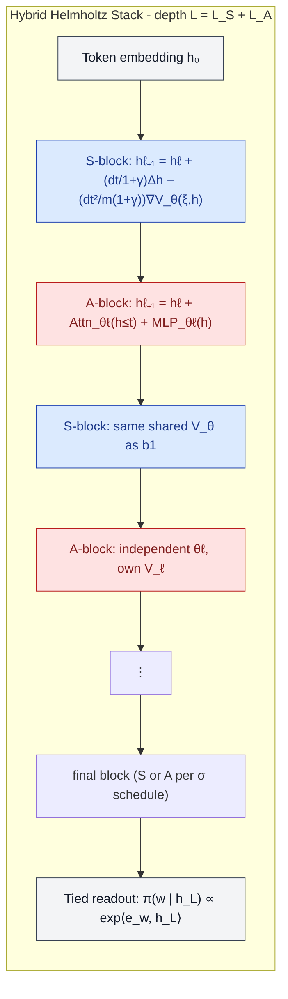
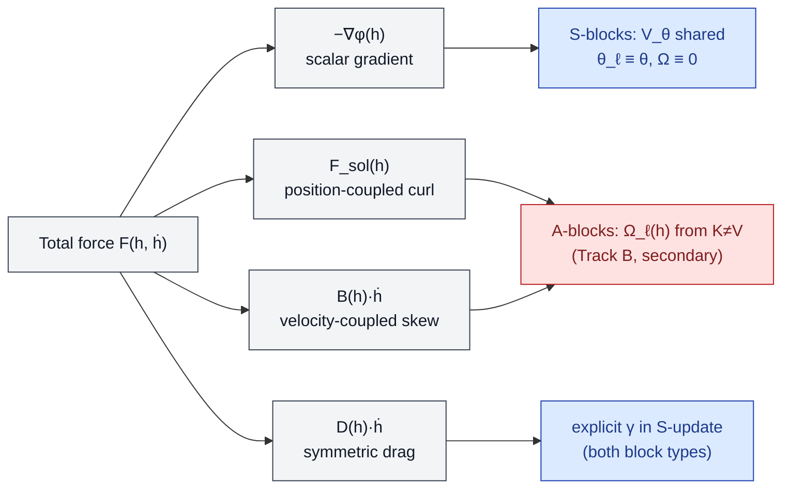

# A Scalar-Potential-Based Helmholtz Architecture: SPLM + Attention as an Explicit Phase-Space Decomposition

**Status:** working note, post-v3 of *Semantic Simulation: A Prescriptive Lagrangian Framework for Efficient Semantic Inference* (Gueorguiev, 2026).
**Position:** fourth candidate construction for the **hybrid programme** of §17.3 Q9, alongside (a) attention as a learned mass-weighted context summary, (b) attention-derived per-token semantic mass with a fixed pool, and (c) Hamiltonian attention. We label this **Q9(d): the layer-type Helmholtz hybrid**.
**Audience:** internal — collaborators, reviewers, and the companion-notes track of the paper.

---

## 1. Motivation: why the Helmholtz framing earns its name

The v3 paper closes a precise theoretical statement (§15.5, §15.6, Appendix A): trained attention transformers are *outside* the autonomous Helmholtz decomposition class. The full phase-space force on a hidden-state trajectory admits the canonical decomposition

$$
F(h, \dot h) = -\nabla \phi(h) + F_{\mathrm{sol}}(h) + B(h) \dot h + D(h) \dot h,
$$

where $\phi$ is a scalar potential, $F_{\mathrm{sol}}$ is solenoidal in position ($\nabla\cdot F_{\mathrm{sol}}=0$ but $\nabla \times F_{\mathrm{sol}} \neq 0$), $B$ is skew (gyroscopic / electromagnetic-analogue), and $D$ is symmetric (Rayleigh damping, absorbed into $\gamma$). Experiments E1–E5 of §15.5 closed the autonomous menu by testing each of these terms — at constant, affine-rank-1, and affine-rank-2 dependence on $h$ — and finding that every fitted addition either ties the static-null floor or shrinks to zero under TRAIN-optimal calibration. Appendix A explains the negative outcome: the *correct* governing equation in trained attention is Eq. (A.130),

$$
m \ddot h = -\nabla_h V(h;\theta_\ell, \xi_t) + \Omega_\ell(h) \dot h - m\gamma \dot h, \qquad \theta_\ell \in \Theta, \quad \xi_t \in \Xi,
$$

a **non-autonomous conservative system** (Class F) — conservative in $h$ at each fixed layer, with the layer-varying $\theta_\ell$ and the prefix-conditioning $\xi_t$ generating depth-indexed and context-indexed non-autonomy respectively.

SPLM committed to the autonomous limit by erasing both non-autonomy mechanisms: $\theta_\ell \equiv \theta$ (weight tying) and $\xi_t$ entering only as a fixed conditioning argument. The leak-free v3 result is that this commitment costs roughly $7$ PPL ($\sim 1.85\times$) at matched scale on TinyStories. The information-bottleneck ladder of §15.2 (R6) localises the gap to **$V_\theta$-MLP-fit-difficulty on the multi-channel $\xi$**, and the v3 abstract's own conclusion is that closing the residual *requires a categorical change* — token-token routing comparable to attention.

The hybrid programme of Q9(a)–(c) all preserve a *single* governing scalar (or pair-scalar in (c)). The construction proposed here moves orthogonally: rather than augment SPLM with one routing primitive everywhere, it **splits the Helmholtz components across layer types**. The stack contains $L_S$ SPLM blocks contributing the autonomous, single-shared-scalar gradient flow $-\nabla_h V_\theta(\xi, h)$ and $L_A$ attention blocks contributing the non-autonomous Hopfield potential plus the small solenoidal correction of (A.130). The paper has *named* this object — the *autonomous Helmholtz decomposition class* — but never built one whose conservative and non-conservative halves were carried by *different layers*. That is what Q9(d) does.

The architectural claim is precise: the hybrid is the *first* language model in which a learned Helmholtz decomposition exists at the *block-type* granularity, with each component certifiable against the diagnostics already developed in §15.7–§15.15.

---

## 2. Theoretical foundation: layer-type-as-component

### 2.1 The decomposition target

Let $\mathcal{F}_S$ denote the autonomous, conservative force class

$$
\mathcal{F}_S = \lbrace F: \mathbb{R}^d \times \mathbb{R}^d \to \mathbb{R}^d \mid F(h,\dot h) = -\nabla_h V_\theta(\xi, h), V_\theta \text{ shared across all } \ell \rbrace,
$$

and $\mathcal{F}_A$ the non-autonomous Hopfield class derived from §A.2,

$$
\mathcal{F}_A = \lbrace F_\ell(h) = -\nabla_h V_\ell(h) + \Omega_\ell(h) \dot h \mid V_\ell(h) = -\tfrac{1}{\beta}\log\sum_\mu \exp(\beta K_{\ell,\mu}\cdot h) + \tfrac{1}{2}\lVert h \rVert^2, \theta_\ell = \lbrace W_Q^\ell, W_K^\ell, W_V^\ell, W_{\mathrm{MLP}}^\ell \rbrace \rbrace.
$$

The two classes differ in exactly two structural axes: $\mathcal{F}\_S$ has $\theta_\ell \equiv \theta$ and $\Omega \equiv 0$; $\mathcal{F}\_A$ has both $\theta_\ell$ and $\Omega_\ell$ varying with depth and context. Section A.8 establishes their empirical magnitudes: Track A (the layer-varying $\theta_\ell$) is the dominant non-conservativity channel; Track B (the within-layer $\Omega_\ell(h)\dot h$ from $W_K \neq W_V$) is secondary, contributing roughly $0.04$ above the SPLM floor in the velocity-aware Jacobian-symmetry test (§15.7).

### 2.2 The architectural commitment

The Helmholtz architecture is the language model whose forward update applies $\mathcal{F}\_S$-type and $\mathcal{F}\_A$-type forces in alternation at the *block* level. Concretely, fix a depth schedule $\sigma: \{0,1,\dots,L-1\} \to \{S, A\}$ that assigns each layer index a block type. The update rule at layer $\ell$ is then

$$
h^{(\ell+1)}_t = \begin{cases}
h^{(\ell)}_t + \tfrac{dt}{1+\gamma}\bigl(h^{(\ell)}_t - h^{(\ell-1)}_t\bigr) - \tfrac{dt^2}{(1+\gamma) m} \nabla_h V_\theta\bigl(\xi^{(\ell)}_t, h^{(\ell)}_t\bigr) & \text{if } \sigma(\ell) = S, \\[1.2ex]
h^{(\ell)}_t + \mathrm{Attn}_{\theta_\ell}\bigl(h^{(\ell)}_{\le t}\bigr) + \mathrm{MLP}_{\theta_\ell}\bigl(h^{(\ell)}_t\bigr) & \text{if } \sigma(\ell) = A.
\end{cases}
$$

Three commitments distinguish this from a generic decoder with some weight-tied blocks:

1. **All $S$-blocks share a single $V_\theta$.** Not "weight-tied within the SPLM substack" — *one* scalar field for the entire SPLM half. This is what guarantees the SPLM substack lives in $\mathcal{F}_S$ and passes a substack-restricted shared-$V_\psi$ test by construction.
2. **The $A$-blocks' Hopfield potentials $V_\ell$ are not constrained to share parameters.** They occupy $\mathcal{F}_A$ exactly as in a standard decoder; their per-layer parameters $\theta_\ell$ are the explicit non-autonomy budget the architecture admits.
3. **The context summary $\xi^{(\ell)}_t$ in $S$-blocks is the SPLM-native causal cumulative-mean pool** (or its multi-channel R6 generalisation — K-EMA, HiPPO-LegT, S4D, learnable-$\Delta t$). It does not depend on the attention sublayer's output except through the running hidden state, so the SPLM update remains pointwise conservative under $V_\theta$.

### 2.3 Block diagram

The colour code carries through the rest of the document: blue = $\mathcal{F}\_S$ (autonomous, single shared $V_\theta$), red = $\mathcal{F}\_A$ (non-autonomous, per-layer $V_\ell$ + small $\Omega_\ell$ skew).

### 2.4 Which terms of (A.130) does each block type carry?

The diagram clarifies the *theoretical* claim of the architecture: the hybrid is not "SPLM with attention bolted on." It is an *explicit Helmholtz decomposition* in which each of the four canonical force components has a dedicated architectural carrier, with the autonomous part globally shared and the non-autonomous part allocated a finite, measurable budget of $L_A$ blocks.

---

## 3. Relation to Appendix A's Class F: an autonomous + non-autonomous synthesis

Section A.1 lists six candidate dynamical classes for transformer hidden states. Class F (non-autonomous conservative) is the one that fits trained attention; classes A–D (pure scalar, constant skew, constant gauge, position-dependent gauge) all tie the static-null floor; class E (Riemannian geodesic) is deferred to §16.

The Helmholtz architecture realises a **convex combination of Class A (the SPLM half) and Class F (the attention half)**, with the combination structure being block-sequential rather than additive:

$$
\underbrace{\lbrace m\ddot h = -\nabla V_\theta(h;\xi) \rbrace}_{\text{Class A on } S\text{-blocks}} \circ \underbrace{\lbrace m\ddot h = -\nabla V_\ell(h;\theta_\ell,\xi_t) + \Omega_\ell(h)\dot h \rbrace}_{\text{Class F on } A\text{-blocks}}.
$$

The composition $\circ$ is layer composition through the depth schedule $\sigma$. Two consequences are immediate.

**Holonomy decomposition.** Section A.6 defines the global non-conservativity of an attention stack as the holonomy of the connection one-form $A_\ell(h) = -\nabla_h V(h;\theta_\ell)$ on the trivial bundle $\Sigma \times \{0,\dots,L\}$:

$$
\mathrm{Hol}[\gamma] = \oint_\gamma A_\ell \cdot dh, \qquad F_\ell(h) = \partial_\ell A_\ell(h) = -\nabla_h \partial_\ell V.
$$

For the hybrid, the curvature $F_\ell$ vanishes identically on every $S$-block (because $\partial_\ell V \equiv 0$ there) and is generically non-zero on every $A$-block. The total holonomy is therefore a sum of $L_A$ contributions:

$$
\mathrm{Hol}_{\mathrm{hybrid}}[\gamma] = \sum_{\ell: \sigma(\ell)=A} \oint_\gamma A_\ell \cdot dh \le \frac{L_A}{L} \mathrm{Hol}_{\mathrm{attn}}[\gamma],
$$

with equality in the limit where the $A$-blocks are pulled from a fully-attention reference model. The hybrid's holonomy is therefore *budgeted*: the architect chooses $L_A/L$ and pays for routing in proportion. This is a quantitative refinement of the SPLM-vs-attention comparison: instead of "no routing" vs. "routing everywhere," one tunes the routing budget continuously.

**Adiabaticity (§A.7).** The adiabatic condition $\lVert \partial_\ell V \rVert / \lVert \nabla^2 V \dot h \rVert \ll 1$ is satisfied trivially on every $S$-block. The hybrid is therefore *piecewise adiabatic*: any segment of consecutive $S$-blocks admits an effective single-potential summary, while $A$-block segments do not. This predicts that the strict shared-$V_\psi$ separator (§15.8), restricted to a contiguous run of $S$-blocks, should attain the SPLM-substack-only $R^2 \approx 0.90$, dropping to the GPT-2-like middle-band on the $A$-block segments.

---

## 4. Predictions and falsifiers

A construction is interesting only if it makes contact with the diagnostics of the parent paper. The following predictions are testable on the leak-free SPLM infrastructure with no modification beyond the schedule $\sigma$.

### 4.1 Substack-restricted shared-potential separator

Let $R^2_\psi(\ell)$ denote the per-layer $R^2$ of the strict shared-$V_\psi$ fit (§15.8). Then:

$$
\boxed{ R^2_\psi(\ell) =
\begin{cases}
 0.90 \pm 0.05 & \text{if } \sigma(\ell) = S, \\
 \sim 0.45 \text{–} 0.56 & \text{if } \sigma(\ell) = A,
\end{cases} }
$$

with the $S$-block value matching the SPLM positive control of §15.13 and the $A$-block value matching the GPT-2 / scale-matched-baseline middle-band of §15.9–§15.11. The profile of $R^2_\psi(\ell)$ across depth then has a **block-type-indexed signature**: a step function rather than a uniform plateau (SPLM) or a bathtub (GPT-2). This is a sharp prediction, distinguishable from the three baselines in the existing separator figure.

### 4.2 Velocity-aware Jacobian-symmetry test (§15.7)

The local symmetry test is universal across architectures in v3 (it passes on SPLM, matched GPT-2, and pretrained GPT-2). It should continue to pass on every layer of the hybrid, because the within-layer force at each block type is locally a Hessian (Eq. (132) of §A.2 for $A$-blocks; Hessian of $V_\theta$ for $S$-blocks). The Jacobian-symmetry gap of $\sim 0.04$ above the SPLM floor on $A$-blocks is the only expected inhomogeneity.

### 4.3 Resonance-condition predictor for the hybrid

The §15.20 closed form

$$
\gamma^{*} = \frac{m}{L \Delta t} \ln\frac{1}{\rho}
$$

has matched the buggy and leak-free SPLM operating points to three decimal places, with $L$ being the *integrator depth* and $\rho$ a single empirical calibration constant. For the hybrid, the natural prediction is that the *effective integrator depth* is $L_S$, not $L$, because only the $S$-blocks integrate the conservative flow:

$$
\boxed{ \gamma^{*}_{\mathrm{hybrid}} = \frac{m}{L_S \Delta t} \ln\frac{1}{\rho_{\mathrm{hybrid}}} }
$$

with $\rho_{\mathrm{hybrid}}$ inheriting the leak-free SPLM value $0.565$ to first approximation. A 3-seed sweep over $\gamma \in \{0.05, 0.10, 0.15, 0.20\}$ at fixed $L_S$ and varied $L_A$ would test this directly. A double match here would be the **third independent confirmation** of the resonance methodology (after the buggy and leak-free SPLM matches), and would do so on a model class not in the original calibration set — a strong external-validity result.

### 4.4 Decision $\beta$ (Markov-order regression)

The pre-registered Markov-order regression of trajectory predictability (§15.20, also reproduced on natural transformers at 21/24 and 24/24 cells) should return Decision $\beta$ (lag-1 representation preferred over lag-2) on every $\gamma$ value of the hybrid sweep. This diagnostic is *structurally independent* of any training run — it tests a property of the hidden-state trajectory geometry — and so functions as a free check on whether the hybrid's flow remains within the regime where the framework's first-order reductions apply.

### 4.5 Information-bottleneck ladder (R6)

The leak-free §15.2 result is that the K-EMA pool wins on val PPL despite being information-poorer than HiPPO-LegT, S4D, and learnable-$\Delta t$ — because the binding constraint is downstream MLP fit difficulty, not channel summary information content. The hybrid's $A$-blocks bypass the MLP-fit constraint on routing entirely (attention does not consume $\xi$ through an MLP). The prediction is therefore that **the K-EMA-vs-orthogonal-basis ranking inverts in the hybrid**: HiPPO-LegT and S4D should now match or beat K-EMA, because the routing capacity that previously had to be funnelled through the $V_\theta$ MLP is partially absorbed by the $A$-blocks. This is a sharp, falsifiable prediction with a clean a priori mechanism.

---

## 5. FLOP and parameter cost: a continuous interpolation

§B of the paper gives the per-new-token autoregressive cost as $O(L d d_V)$ for SPLM (no KV cache, $O(d)$ state per integration step) and $O(L T d)$ for an attention transformer with KV cache. The hybrid's per-token cost interpolates linearly:

$$
\mathrm{cost}_{\mathrm{hybrid}}(T) = O\bigl(L_S d d_V + L_A T d\bigr).
$$

Two crossover regimes follow:

- For $T \ll d_V \cdot (L_S/L_A)$, the $A$-blocks are essentially free and the hybrid inherits SPLM's prefix-length-independent decoding cost.
- For $T \gg d_V \cdot (L_S/L_A)$, the $A$-blocks dominate and the hybrid's cost approaches that of a depth-$L_A$ attention transformer.

The architect's lever is the ratio $L_S / L_A$, which controls *both* the holonomy budget (§3) *and* the asymptotic decoding cost. This is an unusually clean coupling — the same hyperparameter governs the framework-theoretic non-conservativity allowance and the engineering cost.

The non-embedding parameter count is

$$
P_{\mathrm{hybrid}} = \underbrace{P(V_\theta)}_{O(d \cdot d_V)} + \underbrace{L_A \cdot P_{\mathrm{block}}^{\mathrm{attn}}}_{O(L_A \cdot d^2)},
$$

so adding $S$-blocks beyond the first costs nothing in parameters (because $V_\theta$ is shared) and only adds integrator FLOPs — a useful asymmetry for depth ablations.

---

## 6. Design variants: schedule space

The depth schedule $\sigma$ is the design space. Five canonical patterns are worth distinguishing.

| Pattern | $\sigma$ | Interpretation |
| --- | --- | --- |
| **All-S** | $S^L$ | Pure SPLM (the v3 control). |
| **All-A** | $A^L$ | Standard decoder. |
| **Sandwich** | $S^k A^{L-2k} S^k$ | Conservative input/output processing; attention in the middle band where Track A is dominant. |
| **Inverse sandwich** | $A^k S^{L-2k} A^k$ | Routing at boundaries; conservative middle. |
| **Interleaved** | $(SA)^{L/2}$ | Maximally mixed; tests block-type-indexed step function. |
| **Top-A** | $S^{L_S} A^{L_A}$ | Conservative early processing, late routing. |
| **Bottom-A** | $A^{L_A} S^{L_S}$ | Early routing, late conservative integration. |

The §A.5 K = V boundary case offers a pre-registered prediction: the *anomalous layer-11 recovery* of pretrained GPT-2 to $R^2 \approx 0.99$ arises because the final pre-logit layer ties keys to values. In a hybrid, *placing an $S$-block at the readout position* should be the natural analogue — the readout-adjacent layer is forced into the autonomous-conservative limit by construction, replicating the boundary-case mechanism on a chosen layer rather than relying on it to emerge from training.

The minimum viable empirical programme is therefore:

1. **Sandwich-1** ($k=1$): a single $S$-block at each end with attention in between. Tests whether the boundary-case mechanism is reproducible by construction.
2. **Interleaved-half** ($\sigma = (SA)^{L/2}$): tests the block-type-indexed step-function $R^2_\psi$ prediction directly.
3. **Top-A with $L_A = 1$**: the *single-attention-block* hybrid. Tests how much PPL one block of routing buys over pure SPLM, isolating the marginal value of attention.

The third configuration is the cleanest for the paper's narrative: it identifies the *first PPL of the gap* and ties it to a single, localised architectural insertion, in the same way that §15.5's negative-results chain identifies what *cannot* close the gap.

---

## 7. Training: standard backpropagation, with optional RL for schedule search

The layer-type Helmholtz architecture is **fully differentiable end-to-end** by construction. Every $S$-block is differentiable through the symplectic Euler integrator (smooth $V_\theta$, smooth chain rule across $L_S$ steps under the §15.20 $\gamma$-damping resonance condition); every $A$-block is differentiable through standard softmax attention plus residual MLP; the schedule $\sigma: \{0, \dots, L-1\} \to \{S, A\}$ is a *fixed design-time hyperparameter* rather than a learned quantity. Training therefore reduces to standard NTP cross-entropy backpropagation through the unrolled stack, with no special infrastructure required beyond what trains a vanilla decoder.

### 7.1 Why standard backpropagation suffices here, in contrast to PARF-augmented SPLM

The §7 training story for the layer-type Helmholtz architecture is materially simpler than the §7 training story for PARF-augmented SPLM (Q9(c), see *PARF_Augmented_SPLM_Architecture.md*), and the asymmetry is informative. Three observations:

**No discrete selection, hence no RL-natural component.** PARF training has a framework-native reinforcement-learning component because the §5.2 quantile cutoff is intrinsically a discrete selection over past tokens — at each (token, layer), choose which of the past pairs to retain. This selection problem maps cleanly onto the framework's RL substrate of §8.6–§8.7 (executive atoms, target points, policy-based and action-value-based readings) and admits unbiased policy-gradient training via REINFORCE on a Bernoulli mask (PS-PARF, Algorithm C of *PARF_Augmented_SPLM_Architecture.md* §7). The layer-type Helmholtz architecture has no analogous discrete selection: attention's softmax routing inside $A$-blocks is differentiable by construction, $S$-blocks' integrator is differentiable by construction, and the schedule $\sigma$ is fixed before training begins. There is no point in the forward pass at which a discrete sampling step is taken on the training trajectory, so REINFORCE-style estimators are unnecessary.

**No multi-objective reward beyond NTP.** PARF training admits a framework-native four-component reward (NTP improvement, joint pair-fit $R^2$, energy drift, §5.2 truncation residual) that PPO and PS-PARF combine more cleanly than backpropagation does as a multi-objective loss. The layer-type Helmholtz architecture has no analogous bouquet of training-time diagnostics: the substack-restricted separator $R^2$ on the $S$-blocks is a *post-training* diagnostic (the strict shared-$V_\psi$ test of §15.8 applied to the $S$-substack only), not a training-time loss component, because the layer-type decomposition is *architectural* rather than *learned*. Once $\sigma$ is fixed, $V_\theta$ on the $S$-blocks and the per-layer $\theta_\ell$ on the $A$-blocks are independent learnable parameter groups, and standard NTP cross-entropy gives full gradient signal to both.

**Inheritance of training stability.** The architecture inherits SPLM's training stability on the $S$-blocks (via the §15.20 $\gamma^* = (m/L_S \Delta t) \ln(1/\rho)$ resonance condition, scaled to the substack depth $L_S$) and standard transformer training stability on the $A$-blocks. The only schedule-specific tuning is the relative learning rate for the *shared* $V_\theta$ (which receives gradient signal from $L_S$ separate blocks per step) versus the *per-layer* attention parameters $\theta_\ell$ (each of which receives gradient signal from one block per step). A 1:$L_S$ learning-rate ratio for $V_\theta$ vs. $\theta_\ell$ is the natural starting point.

### 7.2 The training-side trade-off between Q9(c) and Q9(d)

The training-side asymmetry between PARF-augmented SPLM (Q9(c)) and the layer-type Helmholtz architecture (Q9(d)) is itself a measurable architectural axis of the v4 deposit:

- **Q9(c) PARF-augmented SPLM** makes the §8.6–§8.7 RL substrate empirically active for the first time at LM scale, but at the cost of REINFORCE-style estimators for the discrete §5.2 selection (PS-PARF) or full PPO on the trajectory-level reward (Algorithm B). Higher variance, more infrastructure, but framework-native at every level.
- **Q9(d) layer-type Helmholtz** is trained by standard backpropagation alone, with the framework's prescriptive content carried entirely by the *architectural decomposition* (autonomous $S$-blocks, non-autonomous $A$-blocks) rather than by the training algorithm. Lower variance, simpler infrastructure, but the §8.6–§8.7 substrate is not empirically active.

From a v4-deposit standpoint, the Helmholtz architecture is the **easier-to-train** hybrid; the PARF-augmented architecture is the **more framework-native-to-train** hybrid. Both should be deposited in parallel; the empirical question of which yields a smaller PPL gap *per unit of training-side complexity* is one of the natural cross-comparisons of the v4 deposit's empirical agenda.

### 7.3 Optional extension: schedule as a learned policy

The schedule $\sigma$ is a fixed hyperparameter in the prescriptive architecture above. A natural extension — and one that *does* make the framework's RL substrate empirically active in this hybrid as well — is to make $\sigma$ itself a learned policy. The MDP structure: state is the layer index together with current hidden-state statistics; action is the block type for that layer ($S$ or $A$); reward combines val-PPL improvement, the substack-restricted separator $R^2$, and a sparsity term penalising $L_A$ (the attention-budget cost). PPO with the same four-component framework-native reward as Algorithm B of *PARF_Augmented_SPLM_Architecture.md* §7.2 trains $\sigma$ end-to-end. We treat this as the §8 *Stage 3* extension below; it is not required for a first deposit but converts the layer-type Helmholtz hybrid from a *fixed-architecture experiment* into a *learned-architecture experiment* in which the framework discovers the optimal allocation of conservative-vs-non-conservative budget given the data. The §8.6–§8.7 executive substrate that PARF training activates at the **routing** scale is here activated at the **architecture-search** scale; both proposals draw on the same framework-RL machinery, applied to different architectural decisions.

A non-framework-native alternative — differentiable architecture search of the DARTS family (Liu et al., 2019), with a soft mixing weight at each layer that selects $S$- vs $A$-block dynamics and is annealed toward one-hot at convergence — is also available, with the standard caveats (DARTS is known to suffer from skip-connection collapse and validation-set overfitting). We prefer the framework-RL formulation because it instantiates the §8.6–§8.7 substrate; we mention DARTS only as the standard NAS comparison.

---

## 8. Empirical agenda

A two-stage programme on the existing TinyStories pilot (§15.2) is sufficient for a first paper:

**Stage 1 — separator and resonance match.**
At the leak-free 4000-step, 16.5M-parameter pilot configuration, train the seven schedules of §6 above with $L_S + L_A = 8$ throughout (matched depth to v3). Run the strict shared-$V_\psi$ diagnostic on each. Report:

- Per-layer $R^2_\psi(\ell)$ and the block-type-indexed signature.
- Velocity-aware Jacobian-symmetry gaps per layer.
- Val PPL with seeds, against the v3 SPLM (val ppl 14.78) and attention (val ppl $\sim 8$) reference points.
- The resonance prediction $\gamma^*_{\mathrm{hybrid}} = (m/L_S\Delta t)\ln(1/\rho)$ at the optimal schedule.

**Stage 2 — information-bottleneck ladder under hybrid.**
Repeat §15.2's R6 ladder (K-EMA, HiPPO-LegT, learnable-$\Delta t$ HiPPO, S4D) with the best Stage-1 schedule. Test the inversion prediction of §4.5: orthogonal bases should now match or beat K-EMA on val PPL.

**Stage 3 — schedule as a learned policy (RL extension).**
Per §7.3, the schedule $\sigma$ can additionally be made a learned policy via PPO with framework-native reward (paralleling Algorithm B of *PARF_Augmented_SPLM_Architecture.md* §7.2). Stage 3 reports val PPL and the discovered schedule against the best fixed schedule from Stage 1, the substack-restricted separator $R^2$ on the discovered policy's $S$-substack, and the policy-entropy decay during training as a stability diagnostic. This is the optional framework-RL extension; the prescriptive deposit can stop at Stages 1–2.

The combined output is a five-axis result table: (schedule × basis × seed × $\gamma$ × trainer), with the separator $R^2$ profile, the resonance match, the val PPL, and (under Stage 3) the discovered schedule reported. This is structured to extend §15 of the paper as a new §15.24 (or a Section 16 *post* the Riemannian programme) without disturbing the §15.21 implications already drawn. Note that for v4 deposit, Q9(c) (PARF-augmented SPLM) is the prescriptive primary and Q9(d) (this layer-type Helmholtz hybrid) is the architectural fallback; the empirical work in §15.24.8 of the v4 deposit runs Q9(c) first.

---

## 9. Open questions and risks

**OQ-1. Energy bookkeeping across block boundaries.**
The $S$-block update conserves a discrete proxy of the Lagrangian $L = T - V_\theta$ up to integrator error and the explicit $\gamma$-damping. The $A$-block update has no analogous conservation law (the Hopfield potential $V_\ell$ changes between blocks). What is the right object to track across the full stack? One candidate: the *total* energy

$$
E^{(\ell)}_t = \tfrac{1}{2}m \lVert h^{(\ell)}_t - h^{(\ell-1)}_t \rVert^2 + V_\theta(\xi^{(\ell)}_t, h^{(\ell)}_t),
$$

is well-defined inside any contiguous $S$-block segment. Its value at the entry and exit of an $A$-segment is the *energy injection by routing*, a direct architectural-level analogue of §A.6's holonomy. Logging this on the existing pipeline is cheap.

**OQ-2. Does the hybrid recover Q9(a)–(c)?**
Q9(a) (attention as context summary) is closely related but architecturally distinct: there, attention enters *inside* $\xi$ and the per-layer force remains $-\nabla_h V_\theta$. Here, attention is a separate block with its own non-autonomous potential. A direct comparison at matched $L_A$ would resolve whether the routing signal is better placed *inside* the conservative gradient (Q9a) or *between* gradient steps (Q9d). I expect Q9d to win on the separator (because Q9a still has $\theta_\ell \equiv \theta$ everywhere) and Q9a to win on parameter efficiency (because attention is amortised through $V_\theta$).

**OQ-3. Reframing risk vs. competitive framing.**
The v3 paper's strategic move was to position SPLM as a *maximally-structured counterfactual*, not a competitor. A hybrid that closes the PPL gap pivots the rhetoric back toward competition. Two ways to keep the framework story dominant:

- Frame the hybrid as a **measurement instrument**: each schedule and each $L_A$ value reports *how much non-autonomy* is needed to recover each PPL of the gap. This is a controlled study of attention's structural budget, in the spirit of §15.21's "attention transformers do not satisfy the framework — but they are not far from it, and we can measure the distance."
- Lead with the **substack-restricted separator** as the headline result, not the val PPL. The separator is the framework-native object; PPL is a downstream consequence.

**OQ-4. Block-boundary discontinuities in the trajectory.**
The trajectory $\{h^{(\ell)}_t\}_\ell$ is smooth within each block type (verified for SPLM in §15.20's Decision-$\beta$ analysis, for attention in §14). At a $S\to A$ or $A\to S$ boundary the *governing equation* changes. Whether the trajectory inherits a measurable discontinuity in $\lVert \dot h \rVert$ or $\lVert a_\perp \rVert$ at the boundary is an open empirical question. The §13 STP–acceleration identity is layer-local and continues to hold; the prediction for the framework's deceleration statistics (§14: 97.9 % of triplets decelerate) at boundaries is unclear and worth measuring.

**OQ-5. Should the $S$-block's $V_\theta$ depend on the most recent $A$-block's output?**
Three options: (i) share one $V_\theta$ across all $S$-blocks regardless of attention output (cleanest, current proposal); (ii) make $V_\theta(\xi, h, c)$ where $c$ is a learned pooled summary of intermediate attention outputs (richer, but may break the strict shared-potential test on the $S$-substack); (iii) use a small $V_\theta$ family indexed by *position relative to the last $A$-block* (a middle ground). Option (i) is the right starting point because it preserves the §4.1 separator prediction. Options (ii) and (iii) are the natural follow-ups if (i) underperforms.

---

## 10. Position in the framework

The Helmholtz architecture is a strict **specialisation** of the framework's prescriptive content, not a softening. It commits to:

- The *autonomous Helmholtz decomposition class* as the architectural target (the paper's named object).
- A *finite, measurable budget of non-autonomy* allocated to a designated subset of layers, with a quantitative cost-benefit measured by the substack-restricted separator and the holonomy decomposition.
- The *single shared $V_\theta$* on the conservative substack — the original SPLM commitment, retained at full strength on $L_S$ blocks instead of $L$ blocks.

The contribution to the framework is therefore not a retreat from SPLM but the construction of an **architectural Helmholtz decomposition** in which the four phase-space force components of (A.130) are carried by physically distinct architectural carriers, with each carrier admitting an independent diagnostic and a cost-budget knob. This converts the v3 paper's negative result on the autonomous Helmholtz class — that no autonomous gradient-plus-curl combination fits attention trajectories — into a positive constructive procedure: build the decomposition explicitly, with one half autonomous-by-construction and the other half non-autonomous-by-construction, and measure the trade-off.

In TMLR-submission sequencing terms: this work is a **§15.24 / Section 16 follow-up**, not part of the focused submission of §13–§14 + §15. The recommended path is to land the focused TMLR submission first (the STP–acceleration identity, the §14 GPT-2 validation, the §15 separator), then write Q9(d) as a standalone paper whose contribution is precisely the architectural Helmholtz decomposition and its predictions §4.1–§4.5 above. A follow-up paper of that shape inherits the existing §15.7–§15.20 diagnostics infrastructure and earns its own framing rather than diluting the focused submission.

---

## 11. Summary

The Helmholtz architecture is the simplest construction that splits the v3 paper's named decomposition

$$
F(h,\dot h) = -\nabla\phi(h) + F_{\mathrm{sol}}(h) + B(h)\dot h + D(h)\dot h
$$

across layer types, with $S$-blocks carrying the autonomous gradient component under a single shared $V_\theta$ and $A$-blocks carrying the non-autonomous Hopfield + small-skew components. It is not yet enumerated in §17.3 Q9 of v3 and slots in naturally as Q9(d). The construction inherits every diagnostic of §15 (the strict shared-$V_\psi$ separator, the velocity-aware Jacobian test, the resonance-condition predictor, Decision $\beta$, the R6 information-bottleneck ladder) and makes five sharp predictions (§4.1–§4.5) that distinguish it from each of the three v3 architectures (SPLM, matched GPT-2, pretrained GPT-2) and from the existing Q9(a)–(c) hybrids. Training is by standard NTP backpropagation alone (§7), in contrast to the framework-native RL training of PARF-augmented SPLM (Q9(c), *PARF_Augmented_SPLM_Architecture.md* §7), with the asymmetry itself serving as a measurable axis of the v4 deposit. The empirical programme of §8 is three stages on the existing TinyStories infrastructure: Stages 1 and 2 with fixed schedules require no new code beyond $\sigma$; Stage 3 (the schedule-as-learned-policy extension) reuses the same framework-RL machinery that PARF-augmented SPLM (Q9(c)) uses for its routing-policy training (§15.24.7 of the v4 deposit), applied here to architecture search rather than to per-token routing.

The recommended v4 deposit positioning: **Q9(c) PARF-augmented SPLM is the prescriptive primary** (the framework's own recommendation, with the architecture deriving from §5 and the training algorithm activating §8.6–§8.7), and **Q9(d) the layer-type Helmholtz hybrid is the architectural fallback** (a measurement instrument for the conservative-vs-non-conservative routing trade-off, with a continuously-budgeted holonomy decomposition). Both are deposited at v4 with empirical validation deferred to forthcoming companion work; the focused TMLR submission of §13–§15 of v3 is unaffected.

---

*Companion documents:*
*— `PARF_Augmented_SPLM_Architecture.md` — Q9(c), the prescriptive primary, including the §7 framework-native RL training story.*
*— `Section_15_24_PARF_Augmented_SPLM_v4_draft.docx` — the paper-register v4 deposit text for Q9(c).*

*Companion notes referenced:*
*— `Causal_Leak_in_SPLM_Integrate_Bug_and_Fix.md`*
*— `Restructuring_paper_v3_after_causal_leak_bug.md`*
*— `Reducing_Information_Bottleneck_In_Multi-Channel_Xi_SPLM.md`*
*— `Evidence_for_second_order_ODE_governing_evolution.md`*
