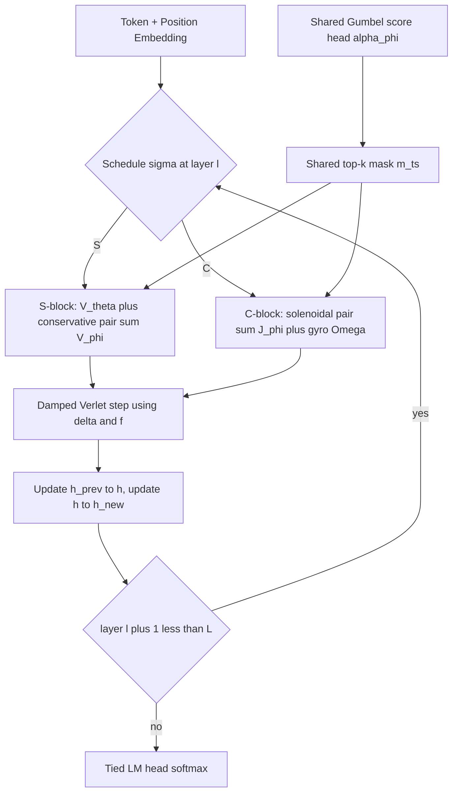

# A Scalar-Potential-Based Helmholtz Architecture, v3: The Attention-Free Realization

**Status:** working note, post-v3 of *Semantic Simulation: A Prescriptive Lagrangian Framework for Efficient Semantic Inference* (Gueorguiev, 2026).
**Position:** fifth candidate construction for the hybrid programme of the v3 paper section 17.3 (Q9), and a successor to [`Scalar_Potential_based_Helmholtz_Architecture.md`](./Scalar_Potential_based_Helmholtz_Architecture.md). We label this **Q9(e): the attention-free Helmholtz hybrid**, also called **Solenoidal-Pair Hybrid SPLM (SP-HSPLM)** or, more colourfully, **Maxwell-PARFLM**.
**Audience:** internal — collaborators, reviewers, and the companion-notes track of the paper.
**Companion docs:**

- [`Scalar_Potential_based_Helmholtz_Architecture.md`](./Scalar_Potential_based_Helmholtz_Architecture.md) — Q9(d), the attention-using Helmholtz hybrid.
- [`PARF_Augmented_SPLM_Architecture_v2.md`](./PARF_Augmented_SPLM_Architecture_v2.md) — PARFLM design doc (the conservative pair scalar $V_\phi$).
- [`On_Gumbel_softmax_sparsity_applied_to_V_phi.md`](./On_Gumbel_softmax_sparsity_applied_to_V_phi.md) — the routing primitive reused here.
- [`SP_HSPLM_Stage_0_Literature_Check.md`](./SP_HSPLM_Stage_0_Literature_Check.md) — Stage 0 originality assessment (precedes this doc).

---

## 0. TL;DR

Q9(d) splits the Helmholtz decomposition across **block types**, but assigns the non-conservative half to **transformer attention blocks** — borrowing from a paradigm the v3 paper has already demonstrated lies *outside* the autonomous Helmholtz class. **Q9(e) closes that loop**: it replaces the attention block with a **vector-field-theoretic primitive** that realizes the solenoidal and gyroscopic terms of Eq. (A.130) directly, by construction, with no attention anywhere.

The architecture is a depth-$L$ stack of two block types:

- **S-blocks** carry the autonomous conservative class $\mathcal{F}\_S$. The force is the SPLM gradient flow given by the per-token scalar potential $V\_\theta$, optionally enriched by the PARFLM pair scalar $V\_\phi$.
- **C-blocks** (for **circulation**) carry the autonomous solenoidal class $\mathcal{F}\_{\mathrm{sol}}$. The force is a causal pair-interaction skew-matrix force on the velocity proxy, defined below.

Concretely, the C-block force at position $t$ takes the form

$$
F^{\mathrm{C}}_t = \sum_{s \lt t} \alpha_\phi(h_t, h_s) J_\phi(h_t - h_s) (\dot h_s - \dot h_t),
$$

with $J_\phi = J_+ - J_+^\top$ guaranteed skew by construction, and optionally a per-token gyroscopic term $\Omega(h_t) \dot h_t$.

Both block types share the SPLM damped-Verlet integrator shell, the kinematic-memory propagation rule from Q9(d), and the Gumbel-softmax top-$k$ routing infrastructure from SparsePARFLM. **No attention block is allocated.**

The architectural claim of Q9(e) is precise: it is the first language model in which **every** force component of the canonical Helmholtz decomposition

$$
F(h, \dot h) = -\nabla \phi(h) + F_{\mathrm{sol}}(h) + B(h) \dot h + D(h) \dot h
$$

has a dedicated **vector-field-theoretic** architectural carrier — and where routing is realised by **causal pair interactions on those vector fields**, not by softmax attention.

The empirical bet is that the v3 paper's E1-E5 negative result against per-token non-conservative additions does **not** extend to **pair-interaction** non-conservative additions, because the pair structure provides the routing capacity that the per-token additions lack.

---

## 1. Table of contents

1. [Motivation: why the attention-free realization](#2-motivation-why-the-attention-free-realization)
2. [Theoretical foundation](#3-theoretical-foundation)
3. [Architecture: components and forward pass](#4-architecture-components-and-forward-pass)
4. [Training and inference](#5-training-and-inference)
5. [Cost analysis](#6-cost-analysis)
6. [Diagnostic protocol](#7-diagnostic-protocol)
7. [Risks and mitigations](#8-risks-and-mitigations)
8. [Pre-registered experimental protocol](#9-pre-registered-experimental-protocol)
9. [Recommendations and timeline](#10-recommendations-and-timeline)
10. [References](#11-references)

---

## 2. Motivation: why the attention-free realization

### 2.1 What the v3 paper actually closed

The v3 paper E1-E5 result (section 15.5) tested every per-token non-conservative addition to SPLM at constant, affine-rank-1, and affine-rank-2 dependence on $h$ — and found that every fitted addition either tied the static-null floor or shrank to zero under TRAIN-optimal calibration. Appendix A's diagnosis (Eq. A.130) is that trained attention sits in **Class F** — *non-autonomous conservative* — and that the non-autonomy comes from **per-layer parameters** $\theta_\ell$ and **prefix conditioning** $\xi_t$, not from a richer per-token vector field.

The natural reading is "you cannot beat attention with a richer per-token force." But the actual v3 finding is sharper: **per-token** non-conservative additions are routing-poor, and routing is the bottleneck. The closing sentence of the v3 abstract makes this explicit — closing the residual *requires a categorical change* — token-token routing comparable to attention.

This invites two distinct architectural responses:

1. **Q9(d), v2 doc**: borrow the routing primitive directly from transformers. Use real attention blocks for the non-conservative half. Costs: the model now contains components from a paradigm the paper has demonstrated is *outside* the Helmholtz class; the architectural narrative becomes "the Helmholtz machine plus attention" rather than "the Helmholtz machine."

2. **Q9(e), this doc**: build a **vector-field-theoretic routing primitive** that realises the missing Class F structure (non-autonomy via $\theta_\ell$ and $\xi_t$) **inside** the Helmholtz framework. The routing comes from **causal pair interactions** on a **non-conservative pair-interaction field**. The narrative remains "the Helmholtz machine, but with all four force components carried by dedicated vector-field primitives."

Q9(d) is the hedge; Q9(e) is the prescriptive bet.

### 2.2 What PARFLM achieves and what it leaves uncovered

PARFLM realises routing via the conservative pair scalar that combines $V\_\theta(\xi_t, h_t)$ with the causal sum $\sum_{s \lt t} V\_\phi(h_t, h_s)$. The pair force is curl-free in $h_t$ at every layer, so PARFLM stays inside $\mathcal{F}\_S$. The TinyStories-scale empirical ceiling is at val PPL $\approx 26.4$ (P10g, $k=4$) — a meaningful improvement over dense PARF (~30 PPL) but still some distance from the SPLM em-ln family floor.

Two gaps remain:

- **The conservative pair-only ceiling.** Pure conservative pair routing cannot generate solenoidal force loops. There is no $V_\phi$ such that $\nabla \times \nabla V_\phi \ne 0$ — by definition.
- **No velocity-coupled routing.** $V_\phi$ depends only on positions $h_t, h_s$, not on velocities $\dot h_t, \dot h_s$. The Lorentz-like piece $\Omega_\ell(h)\dot h$ of Eq. (A.130) has no architectural carrier.

Q9(e) adds exactly the missing pieces — pair-interaction solenoidal force and pair-interaction velocity coupling — without leaving the vector-field-theoretic class.

### 2.3 What Q9(e) commits to

The architectural commitment is two-part:

- **At the block level:** every block in the stack is either an **S-block** (the SPLM gradient-flow integrator, optionally PARFLM-enriched) or a **C-block** (the new pair-interaction non-conservative integrator). No attention layer is instantiated anywhere.
- **At the force level:** each of the four force components of the canonical Helmholtz decomposition has a designated architectural carrier — given by the equation below.

The carrier assignment, written out, is

$$
F = \underbrace{-\nabla \phi(h)}_{\text{S-block: } V_\theta + V_\phi} + \underbrace{F_{\mathrm{sol}}(h, h_s)}_{\text{C-block: } J_\phi \text{ pair force}} + \underbrace{B(h) \dot h}_{\text{C-block: } \Omega(h) \dot h} + \underbrace{D(h) \dot h}_{\text{shared } \gamma}.
$$

Q9(e) is the first instance in this codebase, and to our knowledge in the published literature, where this assignment is realised at the architectural level for a causal sequence model.

---

## 3. Theoretical foundation

### 3.1 The decomposition target revisited

Recall the canonical phase-space force decomposition (paper section 15.6):

$$
F(h, \dot h) = -\nabla \phi(h) + F_{\mathrm{sol}}(h) + B(h) \dot h + D(h) \dot h ,
$$

with $\phi$ a scalar potential, $F_{\mathrm{sol}}$ solenoidal in position ($\nabla \cdot F_{\mathrm{sol}} = 0$), $B$ skew, and $D$ symmetric (Rayleigh damping). Q9(d) assigned the entire non-conservative budget ($F_{\mathrm{sol}} + B(h)\dot h + D(h)\dot h$ minus what is absorbed into $\gamma$) to the attention block. Q9(e) decomposes that budget into vector-field-theoretic components and assigns each a dedicated parameterisation.

### 3.2 Force classes used by Q9(e)

We define three non-conservative force classes Q9(e) needs.

**Conservative pair class** $\mathcal{F}\_S^{\mathrm{pair}}$: the PARFLM force class.

$$
\mathcal{F}_S^{\mathrm{pair}} = \lbrace F_t(h) = -\nabla_{h_t}\bigl[V_\theta(\xi_t, h_t) + \sum_{s \lt t} V_\phi(h_t, h_s)\bigr] \mid V_\theta, V_\phi \text{ shared across } \ell \rbrace.
$$

This is autonomous and conservative because the force is the gradient of a sum of scalars; PARFLM lives here.

**Solenoidal pair class** $\mathcal{F}\_{\mathrm{sol}}^{\mathrm{pair}}$: the new piece.

$$
\mathcal{F}_{\mathrm{sol}}^{\mathrm{pair}} = \lbrace F_t(h, \dot h) = \sum_{s \lt t} \alpha_\phi(h_t, h_s)  J_\phi(h_t - h_s) (\dot h_s - \dot h_t) \mid J_\phi = J_+ - J_+^\top \rbrace .
$$

The skew constraint $J_\phi = -J_\phi^\top$ guarantees two structural properties:

- **Divergence-free in position** (per pair): the linear map $v \mapsto J_\phi v$ has zero trace, so the per-pair force has no source / sink in position space.
- **Pairwise zero-work**: the contribution to kinetic energy from a single pair $(t,s)$ is $\langle \dot h_t - \dot h_s, J_\phi (\dot h_s - \dot h_t)\rangle = 0$ by skew-symmetry.

The pair affinity $\alpha_\phi$ is the same Gumbel-softmax-routed score head used in SparsePARFLM. It carries the "which sources matter" half of the routing; $J_\phi$ carries the "what rotational interaction" half.

**Per-token gyroscopic class** $\mathcal{F}\_{\mathrm{gyro}}$:

$$
\mathcal{F}_{\mathrm{gyro}} = \lbrace F_t(h, \dot h) = \Omega(h_t) \dot h_t \mid \Omega = \Omega_+ - \Omega_+^\top \rbrace .
$$

This is the per-token analogue of the $B(h)\dot h$ term in the canonical decomposition. Optional in the first cells; included for completeness because the v3 paper Class B/C/D ablations tested per-token versions of this term and found them ineffective at per-token granularity. Q9(e) reintroduces it but does **not** rely on it for the routing; routing is done by the pair force.

### 3.3 The architectural commitment

Fix a depth schedule $\sigma: \lbrace 0, 1, \ldots, L-1 \rbrace \to \lbrace S, C \rbrace$. The update rule at layer $\ell$ is

$$
h^{(\ell+1)}_t = h^{(\ell)}_t + \frac{\delta^{(\ell)}_t}{1 + dt \gamma} + \frac{dt^2}{m_t (1 + dt \gamma)} f^{(\ell)}_t ,
$$

with the kinematic memory $\delta^{(\ell)}\_t = h^{(\ell)}\_t - h^{(\ell-1)}\_t$. The force at layer $\ell$ depends on the block type as follows.

If $\sigma(\ell) = S$ (S-block, conservative):

$$
f^{(\ell)}_t = -\nabla_{h_t}\Bigl[V_\theta(\xi_t, h_t) + \sum_{s} m^{(\ell)}_{ts} V_\phi(h_t, h_s)\Bigr],
$$

where $m^{(\ell)}_{ts}$ is the Gumbel-softmax top-$k$ routing mask.

If $\sigma(\ell) = C$ (C-block, solenoidal + gyroscopic):

$$
f^{(\ell)}_t = \sum_{s} m^{(\ell)}_{ts} J_\phi(h_t - h_s) (\delta^{(\ell)}_s - \delta^{(\ell)}_t) + \Omega(h_t) \delta^{(\ell)}_t.
$$

The kinematic memory $h\_{\mathrm{prev}}$ is updated **after every layer** (S or C), so the velocity proxy $\delta$ is well-defined regardless of the schedule. The damping $\gamma$ and learnable mass $m_t$ are **shared across both block types**, which makes the integrator shell identical and the implementation a single shared loop with two possible force routines.

### 3.4 Conservativity audit

The conservativity diagnostics of the v3 paper (sections 15.7-15.15) apply directly to Q9(e). Their predicted readings:

| Probe | Expected Q9(e) reading | What it proves |
|---|---|---|
| Causal probe (`causal_probe_parf.py` in the main repo) | $0.0$ leak floor | The .detach() points are preserved across the C-block forward |
| Velocity-aware Jacobian symmetry (15.7) | Asymmetric, with controlled magnitude proportional to the Frobenius norm of J_phi | The asymmetry is a **predicted**, not parasitic, signature of the solenoidal pair class |
| Holonomy budget (15.13) | Non-zero, scaled by $L_C / L$ and routing density $k / T$ | Closed-loop integrals over the hidden-state manifold pick up the curl of the pair-skew force |
| Static-null floor (15.5 family) | Below floor by a margin proportional to the pair-skew expressivity | The whole point — routing capacity should let SP-HSPLM beat the floor that pure per-token non-conservative additions could not |

Crucially, the asymmetry signature in the velocity-aware Jacobian-symmetry test is a **falsifiable prediction**: if Q9(e) trains and lands a quality result with a Jacobian that **looks symmetric**, then the $J_\phi$ kernel has collapsed to zero and the model is functionally equivalent to PARFLM. The diagnostic provides a clean go / no-go for whether the new force class is doing real work.

---

## 4. Architecture: components and forward pass

### 4.1 Component-by-component design

| Component | Role | Parameters | Cost |
|---|---|---|---|
| Token + position embedding $E + P$ | Standard | $|V| d + T_{\max} d$ | $O(B T d)$ |
| Per-token scalar potential V_theta(xi, h) | Conservative single-particle force; shared across all S-blocks | small MLP, ~2k params | O(B · T · d · H_theta) |
| Conservative pair scalar V_phi(h_t, h_s) | Conservative routing; reused from PARFLM, shared across all S-blocks | structural or MLP, ~4-28k params | O(B · T · k · d) at k-sparsity |
| Gumbel score head alpha_phi(h_t, h_s) | Pair affinity for both V_phi and J_phi routing; shared | small MLP on (h_t, h_s, h_t - h_s), ~8-16k params | O(B · T² · d · H_s) |
| Solenoidal pair kernel J_phi(Δh) | Skew-matrix-valued pair force; new component, shared across all C-blocks | low-rank, J_+ = U V^T, U,V in R^(d × r) | O(B · T · k · d · r) at sparsity |
| Per-token gyroscopic kernel Ω(h_t) | Optional skew velocity coupling; per-token | low-rank, similar to J_phi | O(B · T · d · r) |
| Mass m_t | Per-token effective mass (logfreq + scale) | \|V\| + 1 | O(B · T) |
| Damping gamma | Global Rayleigh damping | 1 | O(1) |
| LM head | Tied to E | shared | O(B · T · d · \|V\|) |

The **routing mask** $m\_{ts}$ is shared between the $V_\phi$ pair sum and the $J_\phi$ pair sum: a single Gumbel-softmax top-$k$ pass on the score head $\alpha_\phi$ produces one mask, used by both the conservative and solenoidal pair branches. This both (a) saves one $O(T^2)$ score-head pass per layer and (b) couples the conservative and solenoidal routings at the architectural level — they always agree on which $k$ source positions matter for token $t$.

### 4.2 Forward pass

The **shared mask** is regenerated each layer (because the score head reads the current $h^{(\ell)}$), but produces a single tensor used for both the conservative and solenoidal pair branches if both are active in that layer. For a pure C-block, only the $J_\phi$ branch is summed; for a pure S-block, only the $V_\phi$ branch.

### 4.3 The S-block in detail

Given $(h_t, h\_{\mathrm{prev},t})$ at layer $\ell$:

1. Compute $\delta_t = h_t - h\_{\mathrm{prev},t}$.
2. Compute the leak-fix invariant $\xi_t$ as the causal cumulative mean of the detached prefix $h_1, \ldots, h_t$ (i.e., apply `causal_cumulative_mean` to `h.detach()`).
3. Compute the per-token energy $V_\theta(\xi_t, h_t)$.
4. If pair routing is enabled at this layer, compute the score-head logits $\alpha_\phi(h_t, h_s)$ for all $s \lt t$, sample the Gumbel top-$k$ mask $m\_{ts}$, and accumulate the conservative pair sum $\sum_s m\_{ts} V_\phi(h_t, h_s)$.
5. Sum to form the layer's effective potential $U_t$.
6. Compute the force $f_t = -\nabla\_{h_t} U_t$ via `autograd.grad(create_graph=True)`.
7. Apply the damped-Verlet update $h_t^{\mathrm{new}} = h_t + \delta_t / (1 + dt \gamma) + (dt^2 / (m_t (1 + dt \gamma))) f_t$.
8. Optional LayerNorm.

This is identical to the SparsePARFLM `_layer_step_sparse` pattern.

### 4.4 The C-block in detail

Given $(h_t, h\_{\mathrm{prev},t})$ at layer $\ell$:

1. Compute $\delta_t = h_t - h\_{\mathrm{prev},t}$ for all $t$.
2. Compute the score-head logits $\alpha_\phi(h_t, h_s)$ for all $s \lt t$, sample the Gumbel top-$k$ mask $m\_{ts}$.
3. For each retained pair $(t, s)$ in the mask, compute $J_\phi(h_t - h_s) (\delta_s - \delta_t)$. The skew constraint $J_\phi = J_+ - J_+^\top$ is enforced **inside** the kernel forward (not as a soft penalty); the user-facing parameters are $U, V$ with $J_+ = U V^\top$ low-rank.
4. Sum: $f_t^{\mathrm{sol}} = \sum_s m\_{ts} J_\phi(h_t - h_s) (\delta_s - \delta_t)$.
5. If the per-token gyroscopic kernel is enabled, add $f_t^{\mathrm{gyro}} = \Omega(h_t) \delta_t$.
6. Apply the damped-Verlet update with $f_t = f_t^{\mathrm{sol}} + f_t^{\mathrm{gyro}}$.
7. Optional LayerNorm.

The C-block does **not** call `autograd.grad` — its force is computed directly, not as a gradient of a scalar. This is faster than the S-block (no second-order graph) and is the principal source of the C-block's compute saving relative to a dense PARFLM S-block.

### 4.5 Schedule registry

Q9(e) reuses the schedule machinery of Q9(d) (`make_schedule(name, L, ...)`), with `S` and `C` replacing `S` and `A`:

- `all_s`: $S^L$ — pure SparsePARFLM, baseline.
- `all_c`: $C^L$ — pure solenoidal, falsifier (should be very poor; isolates the conservative half's contribution).
- `interleaved`: $(SC)^{L/2}$ — alternating; the natural first cell.
- `bottom_c_LC`: $C^{LC} S^{L-LC}$ — non-conservative routing first, then conservative refinement (the SP-HSPLM analogue of Variant A).
- `top_c_LC`: $S^{L-LC} C^{LC}$ — conservative routing first, then non-conservative refinement (the analogue of Variant B).
- `sandwich_LC`: $S^{LC} C^{L-2 LC} S^{LC}$ — conservative input/output, non-conservative middle (the v2 doc's prediction is that this is a good prior for the conservative-on-edges hypothesis).

---

## 5. Training and inference

### 5.1 Training loss

The Stage 2 training loss is the standard NTP cross-entropy plus optional auxiliary terms inherited from SparsePARFLM:

$$
\mathcal{L} = \mathcal{L}\_{\mathrm{NTP}} + \lambda\_{\mathrm{entropy}} \mathcal{L}\_{\mathrm{entropy}} + \lambda\_{\mathrm{skew}} \mathcal{L}\_{\mathrm{skew}} ,
$$

with:

- $\mathcal{L}\_{\mathrm{entropy}}$: routing-mask entropy regulariser (prevents collapse onto a single $s$). Standard SparsePARFLM term, $\lambda \sim 10^{-3}$.
- $\mathcal{L}\_{\mathrm{skew}}$: a calibration term that penalises the **Frobenius norm** of the skew matrix $J_\phi$ at initialisation, decaying to zero over a warm-up window. This is a **stability** term, not a regularisation term — it prevents the velocity-coupled term from dominating the gradient signal in the first ~100 training steps before the score head learns to route. Concrete schedule: $\lambda\_{\mathrm{skew}}(t) = \lambda_0 \max(0, 1 - t / t_w)$ with $\lambda_0 = 10^{-2}$ and warm-up window $t_w = 200$ steps.

### 5.2 Three training algorithms (parallel to PARFLM's A / B / C)

Following the structure of [`On_Training_the_PARF_Force.md`](./On_Training_the_PARF_Force.md):

**Algorithm A (forward NTP + autograd through everything):** the default. The full unrolled stack — both S and C blocks — is differentiated end-to-end through the cross-entropy loss. The C-block force is computed directly (no inner `autograd.grad`), so the only second-order graph is on the S-blocks (same as SparsePARFLM). Memory and compute are dominated by the second-order S-block graph.

**Algorithm B (alternating S / C):** the C-block parameters $\lbrace U, V, \Omega \rbrace$ are updated only on alternate batches, with the S-block parameters frozen during those updates and vice versa. Useful if the joint optimisation lands a degenerate solution (e.g., $J_\phi \to 0$ with the score head doing all the work).

**Algorithm C (REINFORCE-style on the routing mask):** the score head is trained via policy gradient on a reward = negative cross-entropy. Higher variance, harder debugging; **deferred** until Algorithm A lands.

Stage 2a uses Algorithm A. Algorithm B is the fallback if Algorithm A produces a $J_\phi$ that collapses to zero (the "Jacobian-symmetry test passes" failure mode).

### 5.3 Initialisation

The skew kernel $J_\phi = U V^\top - V U^\top$ is initialised with $U, V$ drawn from $\mathcal{N}(0, 0.02^2 / \sqrt{r})$, so that the initial skew matrix has Frobenius norm ~0.02 and the initial pair force is small relative to the conservative pair force. This is the standard "the new component starts as a small perturbation of a known-good baseline" pattern.

The score head $\alpha_\phi$ is initialised exactly as in SparsePARFLM (near-uniform logits via a tanh-bounded readout), so the initial routing is essentially random and the Gumbel noise drives initial exploration.

### 5.4 Inference

At inference, the Gumbel noise is disabled; the hard top-$k$ mask is computed from the deterministic score-head logits. The C-block force is computed identically to training (no autograd needed since no gradient flows through inference). KV-cache equivalent for SP-HSPLM is the **per-token state** $(h, h\_{\mathrm{prev}})$ for each layer plus the per-token mass $m_t$ — same as SparsePARFLM, no separate KV cache for routing.

---

## 6. Cost analysis

### 6.1 Per-layer pair-sum cost (training, with second-order graph on S-blocks)

| Block type | Pair score | Conservative pair eval | Solenoidal pair eval | Force computation | Total per layer |
|---|---|---|---|---|---|
| Dense PARFLM (S, current) | — | O(B · T² · d_phi) | — | O(B · T² · d · d_phi) via 2nd-order graph | O(B · T² · d · d_phi) |
| SparsePARFLM (S, P10) | O(B · T² · d · H_s) | O(B · T · k · d_phi) | — | O(B · T · k · d · d_phi) | O(B · T² · d · H_s) |
| Q9(e) C-block | O(B · T² · d · H_s) | — | O(B · T · k · d · r) | O(B · T · k · d) direct | O(B · T · k · d · r) + O(B · T² · d · H_s) |
| Q9(e) S-block (PARF-enriched) | O(B · T² · d · H_s) | O(B · T · k · d_phi) | — | O(B · T · k · d · d_phi) via 2nd-order graph | O(B · T² · d · H_s) |

Score-head sharing means each layer pays one O(B · T² · d · H_s) pass even when both branches are active.

### 6.2 Inference cost

Per new token, the cost is

$$
O(L \cdot d \cdot d_V) + O(L \cdot T \cdot d \cdot H_s) + O(L \cdot T \cdot k \cdot d \cdot (d_\phi + r))
$$

with $T$ the prefix length, dominated by the score-head pass — same asymptotic order as PARFLM. There is **no KV-cache regime** for the score head (it is recomputed at each new token's prefix), so SparsePARFLM and Q9(e) inherit the same long-context cost; this is a structural difference from attention transformers where the KV cache makes per-token cost $O(L \cdot T \cdot d)$ without the $H_s$ multiplier.

### 6.3 Parameter count comparison

Setting: d = 256, L = 8, k = 4, r = 16, H_s = 32, H_theta = 32, H_phi = 32.

| Component | SparsePARFLM | Q9(e) interleaved (4S + 4C) |
|---|---|---|
| V_theta | ~2k | ~2k |
| V_phi | ~4k | ~4k |
| Score head | ~8k | ~8k |
| J_phi low-rank | — | ~8k (2 · d · r) |
| Ω low-rank (optional) | — | ~8k |
| Mass + damping | ~50k (logfreq table) | ~50k |
| Embedding + LM head (tied) | ~6.4M | ~6.4M |
| **Total** | ~6.5M | ~6.5M (within 1%) |

The new components (J_phi, optionally Ω) add ~16k parameters — negligible at the 6.5M scale. Q9(e) is essentially a parameter-matched architectural variant of SparsePARFLM.

---

## 7. Diagnostic protocol

The Q9(e) architecture is designed to be **diagnostically transparent** — every conservativity probe in the v3 paper has a predicted reading, and the diagnostics provide go / no-go signals at every stage.

### 7.1 Causal probe

The `causal_probe_parf.py` script (in the main repo) must pass with $0.0$ leak floor. The C-block introduces no new causal pathways: the $J_\phi(h_t - h_s)$ kernel reads $h_s$ via the same `.detach()` pattern as PARFLM, and the $(\delta_s - \delta_t)$ velocity-coupled term reads $\delta_s$ via a `.detach()` on the previous-layer hidden state.

This is a **hard gate**: if the causal probe fails, the C-block implementation has a bug; do not proceed to training.

### 7.2 Velocity-aware Jacobian-symmetry test (paper section 15.7)

The classical SPLM Jacobian-symmetry test asks: is $\partial f_t / \partial h_s$ symmetric under the $(t, s) \leftrightarrow (s, t)$ swap, after symmetrising over a velocity-aware weighting? PARFLM passes this with a controlled non-zero residual ($\sim 0.04$); pure SPLM passes essentially exactly.

Q9(e) is **predicted** to fail this test by a controlled, **calibratable** margin:

$$
\Delta\_{\mathrm{sym}}^{\mathrm{Q9(e)}} \approx \Delta\_{\mathrm{sym}}^{\mathrm{PARF}} + c \cdot L_C \cdot \lVert J_\phi \rVert_F .
$$

The $c$ constant depends on the weighting scheme of section 15.7. The relationship is **predicted**, not parasitic — the probe should land at a value that scales linearly with $L_C$ and the trained Frobenius norm of $J_\phi$. If $\Delta\_{\mathrm{sym}}$ matches PARFLM exactly with no $L_C$ scaling, $J_\phi \to 0$ (the failure mode). If it explodes ($\gg c \cdot L \cdot \lVert J_\phi\rVert$), the architecture is generating asymmetry from somewhere unintended (likely a bug in the implementation of `.detach()` for the velocity-coupled branch).

### 7.3 Holonomy budget audit (paper section 15.13)

The closed-loop integral of the force around a cycle in $h$-space measures the global non-conservativity. Pure SPLM has zero holonomy (closed-form, since $f = -\nabla V$). Q9(d) has non-zero holonomy bounded by the holonomy of the attention stack. Q9(e) is predicted to have holonomy:

$$
H\_{\mathrm{Q9(e)}} \approx (L_C / L) \cdot (k / T) \cdot \lVert J_\phi \rVert_F \cdot \rho ,
$$

where $\rho$ is a geometry-dependent constant. The $L_C/L$ factor is the architectural budget; the $k/T$ factor is the routing-density budget; the $\lVert J_\phi\rVert_F$ is the kernel-norm budget. **Holonomy is therefore architecturally tunable** — the architect chooses $L_C$ and $k$ explicitly.

This is a **theoretical advantage** over the Q9(d) attention-based hybrid, where the holonomy is bounded by the holonomy of the attention stack but not directly tunable.

### 7.4 Static-null floor

The static-null floor (paper section 15.5) is the val PPL of a pure SPLM model with the integration step disabled. Pure conservative models cannot beat this floor by much; PARFLM beats it modestly via routing. Q9(e)'s prediction is that it beats the floor by a **larger** margin proportional to $\lVert J_\phi \rVert_F$ — this is the empirical version of the "non-zero holonomy is doing real work" claim.

### 7.5 Ablation cells (built into the protocol)

- **All-S baseline** (`all_s` schedule): Q9(e) reduces to SparsePARFLM. PPL should match SparsePARFLM exactly. Sanity check.
- **All-C falsifier** (`all_c` schedule): no conservative core, only solenoidal + gyroscopic. PPL should be very poor (no scalar energy landscape to define a coherent direction). Quantifies the conservative half's contribution.
- **$J_\phi$-zeroed C-block**: replace $J_\phi$ with a fixed zero matrix; the C-block then reduces to a per-token gyro + damping. If this matches Q9(e), the pair-skew force is not contributing.
- **Score-head-shared off**: separate score heads for $V_\phi$ and $J_\phi$ routing. If this beats the shared-mask baseline, the two routings should not be coupled (rare but possible).

---

## 8. Risks and mitigations

The Stage 0 literature check ([`SP_HSPLM_Stage_0_Literature_Check.md`](./SP_HSPLM_Stage_0_Literature_Check.md)) flagged three categories of risk. Each is addressed here with a concrete pre-registered mitigation.

### 8.1 Risk: Pure per-token Helmholtz components are routing-poor

**Source:** the v3 paper E1-E5 negative result.

**Mitigation:** Q9(e) does **not** rely on per-token non-conservative additions for its routing. The pair-skew force $\sum_s J_\phi(h_t - h_s)(\delta_s - \delta_t)$ has explicit token-token routing structure via the score-head mask. The per-token gyroscopic term $\Omega(h_t)\dot h_t$ is **optional** and is included only as the per-token analogue of the canonical Helmholtz decomposition, not as the routing primitive.

**Falsifier:** if Stage 2 does not improve on SparsePARFLM, examine whether the score head learned anything beyond the SparsePARFLM baseline. If the routing is identical, the C-block's $J_\phi$ is contributing nothing. This is the failure mode the Jacobian-symmetry probe should flag.

### 8.2 Risk: Skew-matrix learnability

**Source:** port-Hamiltonian NN literature reports skew-matrix learning is hard.

**Mitigation:** low-rank parameterisation $J_\phi = U V^\top - V U^\top$ with $r \ll d$. At $d = 256, r = 16$, the kernel has 8k parameters versus the 65k of a full $d \times d$ skew matrix. The $J_+ = U V^\top$ form is a single linear layer; the skew projection is a closed-form post-processing step. Standard PyTorch initialisation and Adam optimisation should suffice.

**Falsifier:** training-curve diagnostics on $\lVert J_\phi \rVert_F$ over training. If the norm collapses to zero or explodes, the optimisation is failing. The ${10}^{-2}$ Frobenius warm-up regulariser ($\mathcal{L}\_{\mathrm{skew}}$) controls early dynamics.

### 8.3 Risk: Velocity coupling and stability

**Source:** Stable Port-Hamiltonian NN literature.

**Mitigation:** the SPLM damping $\gamma$ is **shared** between S and C blocks and is bounded below by a hyperparameter floor $\gamma\_{\min} = 0.05$ (enforced via softplus + offset). This guarantees the symmetric Rayleigh damping dominates the skew velocity coupling at long times, which is the sufficient condition for Lyapunov stability in the Stable PHNN paper.

**Falsifier:** the standard SPLM trajectory-divergence diagnostic. Run the model for $\sim 4 L$ layers in inference; the hidden-state norm should remain bounded. If it diverges, the damping floor is too low or the kernel norm is too large.

### 8.4 Risk: PARFLM-PPL ceiling is the routing ceiling

**Source:** P10 ladder result (P10g, $k=4$, val PPL $\approx 26.4$ on TinyStories).

**Hypothesis:** the PARFLM ceiling is a **conservative-routing ceiling** — the best you can do with conservative pair-interaction forces. The Q9(e) bet is that the ceiling lifts when the non-conservative pair contribution is added.

**Falsifier:** if Q9(e) at the same $(d, T, k, L)$ as P10g lands at val PPL $\ge 26.4$ (within 1 PPL noise band), the bet is wrong. The natural follow-up is then either (a) increase the C-block kernel rank $r$, (b) add the per-token gyroscopic term, or (c) increase the routing density $k$.

### 8.5 Risk: Naming collision

**Source:** there are several "Maxwell" NNs in the literature (MaxwellNet, JefiAtten), all of which **solve** Maxwell's equations as a PDE problem rather than mimic Maxwell-style dynamics in a ML architecture.

**Mitigation:** the doc uses **SP-HSPLM** as the formal name (descriptive, unambiguous). **Maxwell-PARFLM** is retained as a colloquial nickname for the conservative-pair-plus-skew-pair structure (the "Coulomb-like $V_\phi$ + magnetic-like $J_\phi$" reading). The paper section can use either; a paper title is recommended to use the formal name.

---

## 9. Pre-registered experimental protocol

### 9.1 Stage 1: Leak-fixed E1-E5 rerun (per-token classes B, C, D)

**Goal:** confirm whether the v3 paper's E1-E5 negative result on per-token non-conservative additions reproduces under the leak-fixed v3 codebase. This establishes the empirical floor that Q9(e) must beat to justify the pair-skew construction.

**Cells:**

- **E1-fix:** SPLM + per-token constant skew $\Omega \equiv \Omega_0$ (constant matrix), no pair structure.
- **E2-fix:** SPLM + per-token affine-rank-1 skew $\Omega(h) = u h^\top - h u^\top$ for learned $u$.
- **E3-fix:** SPLM + per-token affine-rank-2 skew $\Omega(h) = U H^\top - H U^\top$ for learned $U$, $H$ low-rank.
- **E4-fix:** SPLM + per-token solenoidal field $F_{\mathrm{sol}}(h) = (J_+(h) - J_+(h)^\top) g(h)$ (the $J_+ = U V^\top$ low-rank construction, **per-token, no pair structure**).
- **E5-fix:** SPLM + per-token gauge $\Omega(h)\dot h$ low-rank.

**Setup:** TinyStories scale-up, $d = 256, T = 512, L = 8$, 16k steps (matched to P10g for direct comparison).

**Expected outcomes:**

- **Reproduces negative result:** all cells tie SPLM em_ln floor. This is the v3 paper's expected outcome and motivates Q9(e).
- **Surprise positive on E4-fix (per-token solenoidal):** if the leak-fix flips the result, the per-token solenoidal field was contributing under the leaked v2 setup but its signal was masked. Q9(e)'s pair-skew force is then a **strict generalisation** of a known-positive primitive, and the bet's prior is much better.

**Cost:** 5 cells $\times$ 16k steps $\approx$ 5 GPU-days at H100/A100. Cheap.

### 9.2 Stage 2: Q9(e) cell ladder

**Goal:** isolate the Q9(e) routing-via-skew-pair contribution.

**Cells (in order):**

- **Q9e-A:** schedule `interleaved`, $k = 4$, $r = 16$, no per-token gyro. The first cell to run.
- **Q9e-B:** schedule `interleaved`, $k = 8$, $r = 16$. Routing-density sweep.
- **Q9e-C:** schedule `interleaved`, $k = 4$, $r = 32$. Kernel-rank sweep.
- **Q9e-D:** schedule `interleaved`, $k = 4$, $r = 16$, **with** per-token gyro $\Omega$. Tests whether the per-token term adds anything.
- **Q9e-E:** schedule `bottom_c_4` (4 C-blocks, then 4 S-blocks), $k = 4$, $r = 16$. Tests the C-then-S ordering.
- **Q9e-F:** schedule `top_c_4`, $k = 4$, $r = 16$. Tests the S-then-C ordering.
- **Q9e-G:** schedule `sandwich_2` ($S^2 C^4 S^2$), $k = 4$, $r = 16$. Tests the conservative-on-edges hypothesis.

**Setup:** TinyStories scale-up, $d = 256, T = 512, L = 8$, 16k steps. Single seed (S=1) per cell.

**Pre-registered predictions:**

- **Q9e-A** beats SparsePARFLM P10g (val PPL $\lt 26.4$): the central bet of this doc.
- **Q9e-D** does not beat **Q9e-A** by more than 1 PPL: per-token gyro is a small effect on top of the pair-skew routing.
- **Q9e-G** $\ge$ **Q9e-A**: the sandwich schedule is at least as good as interleaved (the v2 doc's prior on conservative-on-edges).
- The best cell among {A, B, C, D, E, F, G} achieves val PPL $\le 24$ — a meaningful improvement over the PARFLM ceiling.

**Cost:** 7 cells $\times$ 16k steps $\approx$ 7 GPU-days. Modest.

### 9.3 Stage 3: power-up + ablation

**Goal:** if Stage 2 succeeds, establish a paper-quality effect-size estimate.

**Cells:**

- **Q9e-power:** best Stage-2 cell at S=3 (three random seeds). Provides the central headline number.
- **Q9e-jacobian-probe:** run the velocity-aware Jacobian-symmetry test on the Q9e-power model. The probe is the falsifier of the "is the skew kernel doing real work" question.
- **Q9e-holonomy-probe:** run the holonomy-budget audit. Verifies the predicted $L_C$ and $\lVert J_\phi \rVert_F$ scaling.
- **Q9e-zero-J:** the $J_\phi$-zeroed ablation from section 7.5. Quantifies the contribution of the skew kernel.

**Cost:** 3 seeds + diagnostics $\approx$ 4 GPU-days.

### 9.4 Total budget

Stage 1 + Stage 2 + Stage 3 $\approx$ 16 GPU-days at H100/A100. This is comparable to a single P10 sub-row of PARFLM.

---

## 10. Recommendations and timeline

### 10.1 Sequencing

The recommended order is **strictly sequential**:

1. **Stage 0** (literature check) — **complete** as of this doc's date.
2. **Stage 1** (leak-fixed per-token rerun) — must run first. The result determines the empirical motivation for Stage 2.
3. **Stage 2** (cell ladder) — only if Stage 1 confirms the negative result on per-token classes.
4. **Stage 3** (power-up + diagnostics) — only if Stage 2 lands a positive result.

**Skipping Stage 1** is tempting (the v3 paper has already published the negative result) but is unwise because (a) the leak-fix may have shifted the empirical baseline and (b) Stage 1 doubles as the implementation sanity check on the new low-rank skew kernel before it is wired into the pair structure.

### 10.2 Implementation order

1. Write the standalone low-rank skew module $J_\phi(\Delta h) = U V^\top - V U^\top$ acting on $(\delta_s - \delta_t)$. Unit-test the skew property and the gradient flow.
2. Add a per-token solenoidal cell to `model_parf_sparse.py` (in the main repo) — this is the **E4-fix** cell of Stage 1.
3. Write the C-block (`_c_block_step`) parallel to `_s_block_step` in `model_helmholtz.py` (in the main repo), reusing the SparsePARFLM score head and Gumbel mask.
4. Wire the schedule registry to support `S` and `C` block tokens.
5. Add the C-block training cell to a new `model_sphsplm.py` file (separate from `model_helmholtz.py`, which retains its A-block attention path).
6. Cell-ladder Stage 2 as above.

### 10.3 Hard go / no-go gates

- **After Stage 1:** if E1-fix through E5-fix all match SPLM em_ln floor (within 1 PPL), proceed to Stage 2. If E4-fix is significantly better, pause and re-design Stage 2 around the per-token solenoidal cell rather than the pair-skew cell.
- **After Stage 2 cell A:** if Q9e-A does not beat SparsePARFLM P10g by at least 1 PPL, the Q9(e) construction is provisionally falsified. The natural follow-up is the "increase $r$, increase $k$" sweep of cells B-D before declaring the architecture dead.
- **After Stage 2 full ladder:** if no cell beats P10g, the construction is falsified. Document the result (negative results matter — this would be a clean architectural dead-end with strong v3 paper consistency).
- **After Stage 3:** if the Jacobian-symmetry probe shows $\lVert J_\phi\rVert_F \to 0$, the C-block is doing nothing and the PPL improvement is from the parameter increment alone. This is a known degenerate solution; switch to Algorithm B (alternating training) and rerun.

### 10.4 Companion notes to write

If Stage 2 succeeds, the following docs should follow:

- `On_the_Skew_Pair_Force_implementation.md` — the implementation deep-dive ($J_\phi$ kernel, low-rank parameterisation, skew enforcement, gradient checkpointing).
- `On_the_Conservativity_Audit_for_SP_HSPLM.md` — full diagnostic protocol with empirical readings.
- A paper subsection (`paper_v5/sections/16_hybrid_splm.tex` or its successor) — the SP-HSPLM as the attention-free realisation of the Helmholtz programme.

---

## 11. References

### Internal documents

- [`Scalar_Potential_based_Helmholtz_Architecture.md`](./Scalar_Potential_based_Helmholtz_Architecture.md) — Q9(d), the attention-using Helmholtz hybrid; the predecessor of this doc.
- [`PARF_Augmented_SPLM_Architecture_v2.md`](./PARF_Augmented_SPLM_Architecture_v2.md) — PARFLM design doc. Source of the conservative pair scalar $V_\phi$ and its Algorithm A training pipeline.
- [`PARF-SPLM_Path_Forward_and_Experiments.md`](./PARF-SPLM_Path_Forward_and_Experiments.md) — P5/P10 ladder; the empirical baseline Q9(e) must beat.
- [`On_Gumbel_softmax_sparsity_applied_to_V_phi.md`](./On_Gumbel_softmax_sparsity_applied_to_V_phi.md) — Stage 1.5 design; the score-head and Gumbel-routing infrastructure reused here.
- [`Gumbel_sparsity_method.md`](./Gumbel_sparsity_method.md) — pedagogical explainer for the routing mechanism.
- [`SP_HSPLM_Stage_0_Literature_Check.md`](./SP_HSPLM_Stage_0_Literature_Check.md) — the originality assessment.
- [`Causal_Leak_in_SPLM_Integrate_Bug_and_Fix.md`](./Causal_Leak_in_SPLM_Integrate_Bug_and_Fix.md) — the inherited `causal_force` invariant. Both `.detach()` points must be preserved by the C-block.
- [`Helmholtz-HSPLM_Path_Forward_and_Experiments.md`](./Helmholtz-HSPLM_Path_Forward_and_Experiments.md) — the experimental path for Q9(d); Q9(e) follows the same scaling ladder.
- Paper section 15.5 (Class B-D autonomous menu), 15.6 (E1-E5 ablations), Appendix A (Eq. A.130, the non-autonomous conservative class) — the v3 negative results Q9(e) is responding to.

### External literature (the most directly relevant — full bibliography in the Stage 0 doc)

- **D-HNN** (Sosanya & Greydanus, ICLR 2022) — the closest published cousin; conservative + dissipative split as an "implicit Helmholtz decomposition" for low-dimensional dynamical systems. [arXiv:2201.10085](https://arxiv.org/abs/2201.10085).
- **Port-Hamiltonian NNs** (Desai et al., Phys. Rev. E 2021); **Stable PHNNs** (2025) — the $J - R$ skew-plus-symmetric structure. [arXiv:2502.02480](https://arxiv.org/abs/2502.02480).
- **GFINNs** (Lee et al., 2021); **Metriplectic NNs** (Gruber et al., 2024) — the GENERIC formalism. [arXiv:2109.00092](https://arxiv.org/abs/2109.00092), [arXiv:2405.16305](https://arxiv.org/html/2405.16305v3).
- **Constrained HNN** (Finzi et al., NeurIPS 2020); **Hamilton-Dirac NNs** (2024); **Gauge Flow Models** (2025) — magnetic / gyroscopic / gauge primitives in NNs.
- **MACE / PAINN / ENINet** — equivariant pair-interaction networks for molecular ML. The closest analogue for the pair-interaction half of Q9(e), but conservative.
- **HDNet** (2024) — explicit Helmholtz decomposition in flow estimation. [arXiv:2406.08570](https://arxiv.org/abs/2406.08570).
- **Mamba** (Gu & Dao, 2023); **RWKV-7** (2025) — attention-free LMs as the strong empirical baseline. [arXiv:2312.00752](https://arxiv.org/pdf/2312.00752), [arXiv:2503.14456](https://arxiv.org/abs/2503.14456v2).
- **Physical Transformer** (2026); **Thermodynamic Isomorphism** (2026) — recent physics-interpreted transformers; SP-HSPLM is in the same conceptual neighbourhood but architecturally distinct.

---

*Last updated: 15 May 2026. Stage 0 complete (originality assessment passed); this doc concludes the design phase and pre-registers the Stage 1 + Stage 2 protocol. Stage 1 ready to begin.*

