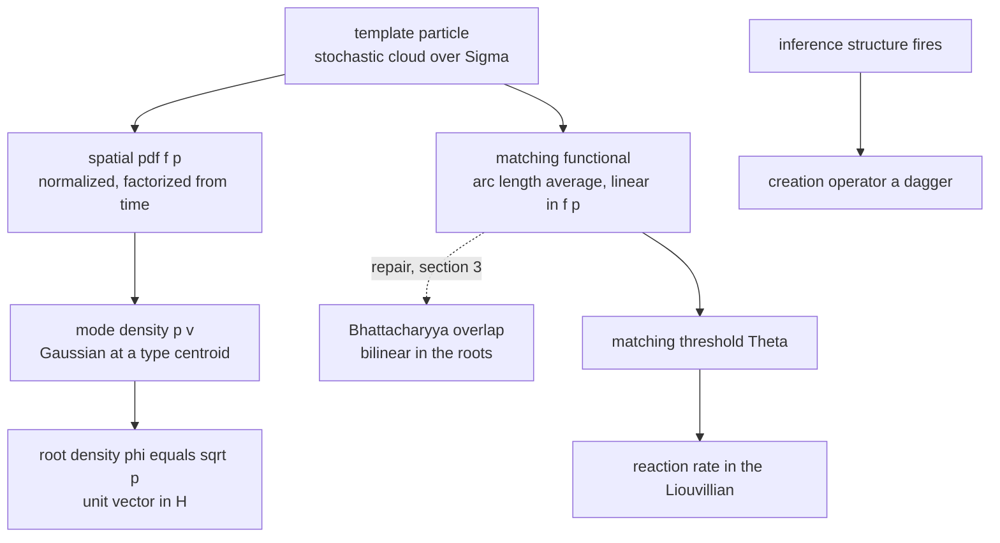
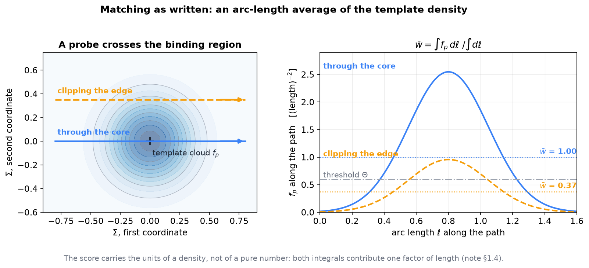
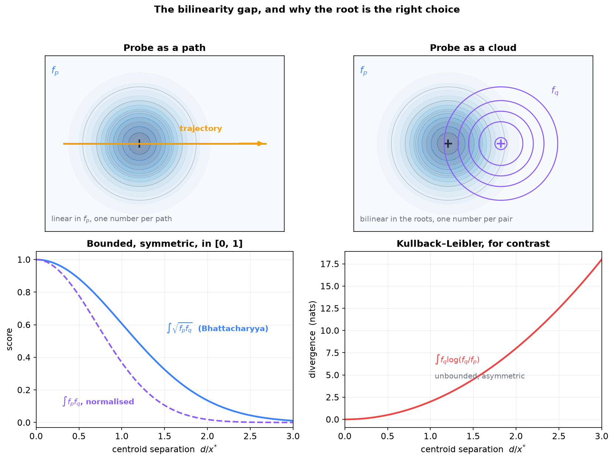
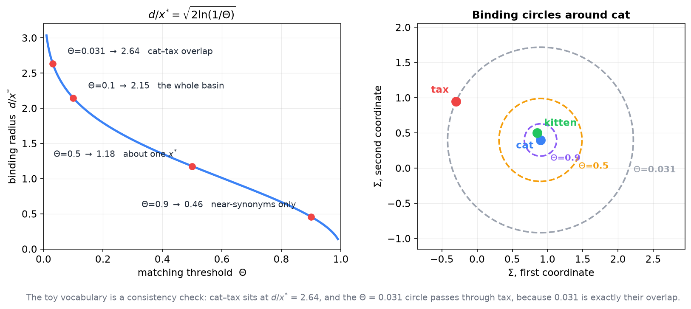
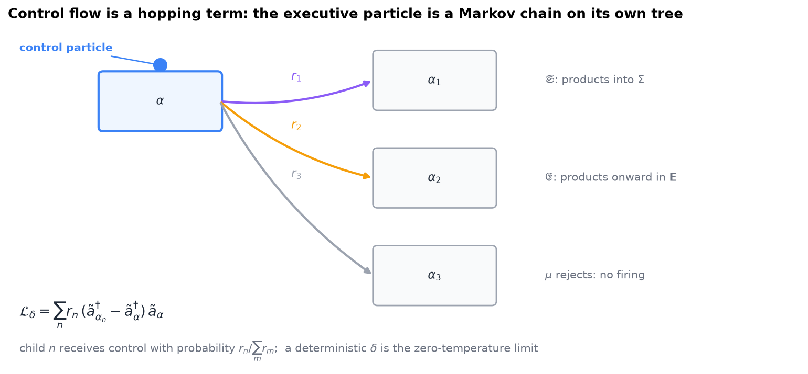

# Semantic Templates as Doi–Peliti Reactions

**The 2022 template-particle apparatus supplies the reaction rules the Liouvillian leaves abstract — and the one repair the join requires**

Companion note to [*The Single-Particle Hilbert Space in the Semantic Simulation Framework*](Single_Particle_Hilbert_Space_in_Semantic_Simulation.md) and [*Doi–Peliti Dynamics of Semantic Particles and Registers*](Doi_Peliti_Dynamics_of_Semantic_Particles_and_Registers.md), and to the unpublished manuscript *Semantic Templates* (D. Gueorguiev, 9 May 2022, `manuscripts/Semantic_Templates.docx`). The single-particle note fixes the geometry, the Doi–Peliti note the dynamics; both carry reaction rates as free parameters. The template manuscript, written four years earlier, already contains a probabilistic apparatus that determines them. This note states the correspondence, and the one structural repair it needs.

Book context: Definition 8 (*Semantic template*, §2.6) gives the minimal definition and defers "a metric on $\mathfrak{T}$ and the operational mechanics of template matching and inference firing" to a companion manuscript. §10.5.2 builds the Fock apparatus but takes its reactions as given. This note is about the join between those two deferrals.

---

## Contents

0. [Scope: what is established and what is proposed](#0-scope-what-is-established-and-what-is-proposed)
1. [The template apparatus as written](#1-the-template-apparatus-as-written)
2. [Template particle and mode are the same object](#2-template-particle-and-mode-are-the-same-object)
3. [The bilinearity gap](#3-the-bilinearity-gap)
4. [Firing is a creation operator](#4-firing-is-a-creation-operator)
5. [What each side gains](#5-what-each-side-gains)
6. [What remains open](#6-what-remains-open)
7. [Execution: how far the reaction reading reaches](#7-execution-how-far-the-reaction-reading-reaches)
8. [Dictionary](#8-dictionary)

---

## 0. Scope: what is established and what is proposed

| Claim | Status |
|---|---|
| A template particle is a density over semantic space-time, not a point | **In the manuscript**, ¶54, ¶61–62 |
| Spatial and temporal distributions factorize; the spatial factor is a normalized pdf | **In the manuscript**, ¶116–126 |
| Matching is an arc-length average of the template density along a probe trajectory, gated by a threshold | **In the manuscript**, Eqs. (17)–(20) |
| A mode is a root density $\phi_v=\sqrt{p_v}$ whose overlap is the Bhattacharyya coefficient | **In the single-particle note**, §1.2–§1.3 |
| A reaction $kA\to lA$ has Liouvillian $\kappa((a^\dagger)^l-(a^\dagger)^k)a^k$ | **In the Doi–Peliti note**, §1.3 |
| Template density $f_p$ and mode density $p_v$ are the same object | **Proposed here**, §2 |
| The matching functional should be bilinear in the roots, not linear in the density | **Proposed here**, §3 — this is the repair |
| Template firing is a creation term in the Liouvillian, and the threshold is its rate | **Proposed here**, §4 |

Nothing in §2–§4 is derived from either source document; the correspondence is a modelling proposal, and the arguments for it are arguments of fit, not proofs. The manuscript is also an explicit working draft: it carries `//TODO` markers at ¶189 (finish the matching-threshold definition), ¶205, ¶208 (repulsion between template properties) and ¶212 (primitive template particle) — four of the places the join would need filled in.

---

## 1. The template apparatus as written

### 1.1 The cloud replaces the point

The founding move is ¶54:

> A template particle can be viewed as stochastic generalization of regular semantic particles. Instead of a single semantic particle on a given position in semantic space and semantic time a template particle will define a **cloud of stochastic semantic particles** in a region of semantic space-time.

A template property carries two sets of aspects (¶61–62): a set of *deterministic* aspects, each with a definite mass and position, and a set of *stochastic* aspects forming a cloud, each with a stochastic mass and a stochastic location, where a postscript marker denotes a quantity "characterized by a probability distribution". The centroid of the cloud is itself stochastic (¶65–71), as is the time at which the centroid reaches a given position.

### 1.2 Normalization and factorization

For a stochastic quantity with joint space-time distribution, the probability of finding it in a region $\mathcal{R}$ during $[t_1,t_2]$ is the integral of the joint density over that region (¶108–112). The manuscript then assumes (¶116) that the spatial and temporal dependences are independent:

$$
\mathcal{P}(\vec r, t) = f_p(\vec r)\,\tau(t), \qquad \int_\Sigma f_p(\vec r)\,d\vec r = 1. \qquad (1.1)
$$

$f_p$ is called the spatial probability density function (¶120).

### 1.3 The binding region

The *binding region* of a template property (¶128–130) is the region of semantic space where the density of at least one of its stochastic quantities is non-negligible. It is the support of the cloud, and it is what makes a template a local object rather than a global one.

### 1.4 Matching: an arc-length average, gated

Let a semantic property $P_1$ traverse the binding region along a trajectory $S_1$ between $t_0-\tfrac{\Delta T}{2}$ and $t_0+\tfrac{\Delta T}{2}$, with tangential velocity $v_{1,t}$. The manuscript defines the ordinary trajectory length (Eq. 17) and the **template-weighted trajectory length** (Eq. 18) as

$$
l_1 = \int v_{1,t}\,dt, \qquad w_1 = \int f_p\bigl(s(t)\bigr)\,v_{1,t}\,dt, \qquad (1.2)
$$

the **average trajectory weight** (Eq. 19) as their ratio, and the firing rule (Eq. 20) as a threshold test:

$$
\bar w_1 = \frac{w_1}{l_1}, \qquad \text{template } \mathcal{T}_P \text{ is triggered by } S_1 \iff \bar w_1 \gt \Theta. \qquad (1.3)
$$

Written geometrically, since $v_{1,t}\,dt = d\ell$ is the arc-length element, (1.2)–(1.3) say

$$
\bar w_1[S_1] = \frac{\int_{S_1} f_p\,d\ell}{\int_{S_1} d\ell}, \qquad (1.4)
$$

the **arc-length average of the template density along the probe's path**. The threshold $\Theta$ is declared part of the template's signature: it is what "uniquely characterizes the behavior of the template property" (¶185).

**Figure 1.** What Eqs. (17)–(20) compute. Left: a template cloud at the framework's width ($\sigma = x^\ast/2$) and two probe paths, one through the core and one clipping the edge. Right: the template density sampled along each path, with the arc-length average $\bar w$ of (1.4) as a dotted line and a threshold $\Theta$ for comparison. The core path scores 1.00 and the edge path 0.37, so the threshold shown fires on the first and not the second. Note the $y$ axis: the score inherits the units of a density.

**A units remark.** ¶173 states that $\bar w_1$ is dimensionless. With $f_p$ a probability density over $\mathbb{R}^L$ as in (1.1), it is not: the ratio in (1.4) has the dimensions of $f_p$, namely $(\text{length})^{-L}$, because both integrals carry one factor of length. The claim holds only if the weight in (1.2) is a dimensionless *membership* weight, such as $f_p/\max f_p$, rather than a normalized density. The two readings diverge as soon as templates of different widths are compared, since $\max f_p$ scales as $\sigma^{-L}$. §3 resolves this differently, by changing the functional rather than rescaling it.

---

## 2. Template particle and mode are the same object

Three correspondences, all immediate:

| Template manuscript | Single-particle note |
|---|---|
| stochastic cloud with spatial pdf $f_p$, $\int f_p = 1$ | semantic density $p$ on $\Sigma$, $\int p = 1$ (§1.2) |
| spatial/temporal factorization (1.1) | the configuration-space choice: geometry on $\Sigma$, time left to the dynamics (§3.2) |
| binding region = support of the cloud | the resolution the well sets, $\sigma = x^\ast/2$ (§1.3) |

The second is worth dwelling on. The single-particle note weighs configuration-space against phase-space states and recommends configuration space for v2, on the grounds that "semantic similarity is a statement about *where* meanings are". The template manuscript reached the same split in 2022 and for a compatible reason, calling it "a reasonable assumption" in a first-order dynamic model (¶137). The two documents independently made the same modelling choice.

So **a template particle is a mode, presented as a density rather than as a root density**. The only thing the single-particle note adds at this level is the square root — and that turns out to matter, which is §3.

What the template formalism has that the mode picture does not: a template carries *both* deterministic and stochastic aspects (¶61), a hybrid the note has no counterpart for. In mode terms a deterministic aspect is a delta, i.e. a mode of zero width, which is Choice A of the note (§2.1), reached there as the $\sigma\to0$ limit (§2.3) — perfect distinguishability, no similarity. A template is therefore a mixed-resolution object: some of its constituents are matched exactly, others up to a tolerance.

---

## 3. The bilinearity gap

This is the one structural difference between the two apparatuses, and the repair the join requires.

### 3.1 What the matching functional is

(1.4) is **linear in $f_p$** and evaluated on a **one-dimensional curve**. It answers: *how much template mass does this particular path traverse, per unit length?* That is a detector response to a deterministic probe. The probe enters only through its geometry $S_1$; its own uncertainty, if it has any, is nowhere in the formula.

### 3.2 What the overlap is

The Bhattacharyya coefficient of the single-particle note (§1.2) is

$$
\mathrm{BC}(p_a,p_b) = \int_\Sigma \sqrt{p_a p_b}\,d\vec r, \qquad (3.1)
$$

**bilinear in the roots** and integrated over all of $\Sigma$. It answers a different question: *how much do two states resemble each other?* It is a geometry, not a detector.

### 3.3 The repair

The template formalism already contains everything needed to close the gap, because the probe is not really a point. The matched property $P_1$ has, in the template reading, its own cloud: ¶83 defines the aggregate characteristics of a template property as the *stochastic* centre and *stochastic* mass of the matched semantic property. Once the probe is a density $f_q$ rather than a curve, the functional has to be a functional of two densities, and there are three canonical choices:

$$
\int f_p f_q \,d\vec r, \qquad \int \sqrt{f_p f_q}\,d\vec r, \qquad \int f_q \log\frac{f_q}{f_p}\,d\vec r. \qquad (3.2)
$$

The first keeps linearity in each argument and is the $L^2$ inner product of densities; the third is the Kullback–Leibler divergence. The middle one is (3.1). The single-particle note's §1.2 gives three reasons to take it, all of which apply verbatim here: only the root makes states unit vectors, only then is the pairing an inner product on a Hilbert space, and only then is the induced distance canonical — $\sqrt2$ times Hellinger, locally one half of Fisher–Rao. The $L^2$ pairing fails the first (a density is not a unit vector in $L^2$) and the KL divergence fails all three (not symmetric, not a metric, unbounded).

Taking the middle choice also repairs §1.4's units problem for free: (3.1) is a pure number in $[0,1]$ for any widths, with no rescaling required, because both densities contribute one half-power each.

**Figure 2.** Top: the two readings of a probe. As a path (left) the score is linear in $f_p$ and there is one number per trajectory; as a cloud (right) it is bilinear in the roots and there is one number per pair of states. Bottom: the three candidates of (3.2) against centroid separation in inflection radii. The Bhattacharyya coefficient and the normalized $L^2$ pairing are both bounded in $[0,1]$, but only the first equals $1 - V/(\mathfrak{m}\upsilon^2)$ and induces a metric; the $L^2$ pairing decays with twice the exponent and is not an inner product of unit vectors. The Kullback–Leibler divergence is plotted separately because it is unbounded, and it is also asymmetric.

### 3.4 The payoff: the threshold becomes a distance

With the framework's Gaussian states, the repair turns the matching rule into a statement about semantic distance. By (1.4) of the single-particle note, for a template centred at $\mu_p$ and a probe centred at $\mu_q$, both at the framework's width,

$$
\mathrm{BC} = e^{-\kappa^2 d^2} = 1 - \frac{V(d)}{\mathfrak{m}\upsilon^2}, \qquad d = \lVert \mu_p - \mu_q\rVert, \qquad (3.3)
$$

so the firing rule $\mathrm{BC} \gt \Theta$ is exactly

$$
d \;\lt \; \frac{1}{\kappa}\sqrt{\ln\tfrac1\Theta} \qquad\text{i.e.}\qquad \frac{d}{x^\ast} \;\lt \; \sqrt{2\ln\tfrac1\Theta}. \qquad (3.4)
$$

**The matching threshold is a binding radius, measured in inflection radii.** It is no longer a free scalar attached to each template: it is fixed by the well that binds the type, through the same $\kappa$ that sets the dynamics.

| $\Theta$ | binding radius $d/x^\ast$ | reading |
|---|---|---|
| 0.9 | 0.46 | fires only on near-synonyms |
| 0.5 | 1.18 | fires inside roughly one inflection radius |
| 0.1 | 2.15 | fires across the whole basin |
| 0.031 | 2.63 | the cat–tax overlap of the toy vocabulary: fires on anything |

**Figure 3.** Left: (3.4), with the four thresholds of the table marked. Right: the same three thresholds as binding circles around *cat*, on the toy vocabulary shared with the single-particle note. *kitten* lies inside every circle, including the strictest; *tax* lies on the $\Theta = 0.031$ circle, because 0.031 is exactly the cat–tax overlap of §2.3 there. The threshold is no longer a free scalar per template: it is a radius in units of the inflection radius of the well.

This also supplies the metric on template space $\mathfrak{T}$ that Definition 8 of the book defers: the overlap distance $\lVert\phi_p - \phi_q\rVert = \sqrt{2(1-\mathrm{BC})}$ of the overlap-distance note, restricted to template clouds.

---

## 4. Firing is a creation operator

### 4.1 The reaction form

A semantic template binds two structures (book Definition 8): a Pattern Matching Structure monitoring a region, and an Inference Structure that *constructs and places a new semantic structure whenever the matcher activates*. In reaction notation, with matched types $\mathbf{k}$ and inferred types $\mathbf{l}$, that is

$$
\sum_v k_v A_v \;\longrightarrow\; \sum_v (k_v + l_v) A_v, \qquad (4.1)
$$

a catalytic, non-consuming reaction: the matched structures persist, and new ones appear beside them. In the Doi–Peliti note's convention (§1.3 there), the Liouvillian term is

$$
\mathcal{L}_\mathcal{T} = r_\mathcal{T}\left(\prod_v (\tilde a_v^\dagger)^{k_v + l_v} - \prod_v (\tilde a_v^\dagger)^{k_v}\right)\prod_v \tilde a_v^{k_v}. \qquad (4.2)
$$

The simplest case, one matched type $u$ and one inferred type $v$, is $A_u \to A_u + A_v$, with

$$
\mathcal{L}_\mathcal{T} = r_\mathcal{T}\left(\tilde a_v^\dagger - 1\right)\tilde a_u^\dagger \tilde a_u, \qquad (4.3)
$$

the catalytic-creation entry that the Doi–Peliti note's reaction table does not list but its construction rule generates. Probability conservation is automatic by §1.4 of that note: the term is a difference of creators times annihilators, and both collapse against $\langle\mathbf{1}\rvert$.

### 4.2 The threshold is a zero-temperature rate

(1.3) is a hard gate; (4.2) wants a rate. The two are reconciled by reading the gate as the sharp limit of a rate:

$$
r_\mathcal{T} = r_0\,\sigma\left(\beta\left(\mathrm{BC} - \Theta\right)\right) \;\xrightarrow[\beta\to\infty]{}\; r_0\,\mathbb{1}\left[\mathrm{BC} \gt \Theta\right]. \qquad (4.4)
$$

The manuscript's threshold rule is the $\beta\to\infty$ limit. For a stochastic formalism the finite-$\beta$ version is the natural object, and it is also the differentiable one, which matters if templates are ever to be learned rather than specified. Note that $\Theta$ sets *where* the rate turns on — by (3.4), a radius — while $r_0$ sets *how fast* it fires once on. The manuscript has only the first; Doi–Peliti needs both.

### 4.3 Templates without precursors are the prior

A template whose Pattern Matching Structure is trivial — one that fires unconditionally — reduces (4.1) to $\varnothing \to A_v$, spontaneous creation at rate $r_0$. That is exactly the mechanism §6.3 of the single-particle note identifies as the reason the long-run state is **not** the vacuum:

$$
\mathcal{L} = c(a^\dagger - 1) + d(a - a^\dagger a), \qquad \lvert P_\mathrm{st}\rangle = e^{(c/d)(a^\dagger-1)}\lvert 0\rangle, \qquad (4.5)
$$

a Poisson distribution of mean $c/d$. Under the correspondence, **a model's prior is the stationary state of its unconditional templates**: which types appear without being triggered, and how fast. The note's interpretive link between that stationary state and initializing the output bias to log-unigram frequencies (§6.3 there, flagged there as interpretive rather than derived) acquires a mechanism on this reading — the bias is the stationary occupancy that the unconditional template bank produces.

### 4.4 The template bank is the Liouvillian

Summing (4.2) over a bank of templates, together with the transport term of the Doi–Peliti note §5 and whatever destruction the register scheme supplies, gives a complete Liouvillian. The content of the proposal is that **the template bank is not an additional structure sitting beside the Doi–Peliti dynamics; it is the specification of that dynamics.** Semantic inference and the reaction term are the same thing described twice.

---

## 5. What each side gains

**The Doi–Peliti apparatus gains** its missing content. §1.3 of that note gives a construction rule for turning reactions into operators, and a table of generic reactions — creation, decay, branching, annihilation, hopping — but nothing that says *which* reactions a semantic model runs. The template bank answers that, and the threshold-to-radius result (3.4) ties the rates to the same $\kappa$ that sets the well, so they are not free parameters either.

**The template apparatus gains** four things it does not have:

1. **A principled matching functional**, bilinear in the roots, bounded in $[0,1]$, dimensionally consistent, with a metric attached (§3.3).
2. **Variable particle number.** Templates fire, but the manuscript has no bookkeeping for how many structures of a type exist. The Fock state $\lvert P\rangle$ supplies it, and expectations are linear in it.
3. **Multi-particle correlation.** A template that matches several aspects jointly is a multi-particle object; §4 of the single-particle note (non-product states as classical correlation, disambiguation as Bayesian conditioning) is the language for what such a template asserts about the joint distribution. The manuscript's matching is one template against one trajectory.
4. **A finished definition of the threshold**, which ¶189 marks as a `//TODO`. Equation (3.4) is a candidate completion.

---

## 6. What remains open

- **The deterministic/stochastic hybrid.** ¶61 lets a template carry both kinds of aspects. In mode terms that mixes zero-width and finite-width constituents, and the Gram matrix of such a family is singular in the zero-width limit. Whether to admit the hybrid, or to treat deterministic aspects as the $\sigma\to0$ idealization of narrow ones, is unresolved.
- **The rigidity assumption.** ¶95 assumes matched aspects are rigid, so the aspect–centroid distance does not depend on time. Under the mode correspondence that fixes the template's shape while it is being matched, which is what makes a single $f_p$ well defined; a deformable template would need a time-dependent mode and is outside the configuration-space choice of §2.
- **Calibrating $r_0$.** (3.4) fixes where a template fires, not how often. Nothing in either document determines the absolute rate scale.
- **Template space geometry.** §3.4 proposes the overlap distance as the metric on $\mathfrak{T}$ that book Definition 8 defers. That covers template *clouds*; it says nothing about the pairing of a Pattern Matching Structure with its Inference Structure, which is the part of a template that is not a density at all.
- **Repulsion between templates** (¶207) and the **primitive template particle** (¶211) are `//TODO` in the manuscript and have no counterpart here.
- **Empirical status.** Nothing in this note is measured. The DP series (Doi–Peliti note §7) measured the register scheme and found it is exclusion-like rather than bosonic; no comparable probe exists for templates, because the trained models do not implement them.

---

## 7. Execution: how far the reaction reading reaches

The companion note [*The Execution Problem*](The_Execution_Problem.md) already establishes the template–execution duality: matching is analysis and execution is synthesis, the latch $\mu$ is a stimulus detector in the first mode and an input validator in the second, the inversion runs at three levels, and the asymmetry is that matching is local in $\Sigma$ while execution is global in $S$ and lands in a space $\mathbf{E}$ of different dimension. None of that is revisited here. This section asks one narrower question: **which slots of the executive atom the reaction apparatus of §4 already expresses, and which it cannot.**

### 7.1 The executive atom, slot by slot

Book Definition 54 gives the executive atom as $\alpha = (\mu, \mathfrak{I}, \mathfrak{S}, \mathfrak{E}, \delta)$.

| Slot | What it is | Reaction-expressible? |
|---|---|---|
| $\mu$, matching mode | stimulus detector: fires when the trajectory weight clears $\Theta$ | **Yes** — a state-dependent rate gate, (4.4) |
| $\mu$, execution mode | validator of input directed by the parent | **Yes** — not a detector but a precondition: the annihilator side of a reaction whose precursor is the parent's product |
| $\mathfrak{I}$ | inference template | **Yes** — a template, hence a creation term (4.2) |
| $\mathfrak{S}$ | semantic transfer template, output back into $\Sigma$ | **Yes** — a reaction whose products are modes of $\mathcal{H}$ |
| $\mathfrak{E}$ | executive transfer template, output onward in $\mathbf{E}$ | **Form yes, modes no** — same shape, but it needs a mode set over $\mathbf{E}$ (§7.4) |
| $\delta$ | action function selecting which child receives control | **Partly** — §7.2 and §7.3 |

The second row is worth stating plainly, because it is where the execution note's distinction does real work. In matching mode, $\mu$ asks "is there anything for me?"; in execution mode, "is what was sent to me valid?". Doi–Peliti draws no such distinction: both are the annihilator side of a reaction. What differs is *what occupies the precursor mode* — an environmental structure in the first case, the parent atom's output in the second. A chain of reactions is the formalism's most ordinary object, so execution-mode $\mu$ costs nothing extra.

### 7.2 Control flow is a hopping term

Treat control itself as a particle: one token occupying the mode of the atom currently executing. Then $\delta$'s branch selection is exactly the hopping entry of the Doi–Peliti note's reaction table (§1.3 there),

$$
\mathcal{L}_\delta = \sum_{n} r_n\left(\tilde a_{\alpha_n}^\dagger - \tilde a_\alpha^\dagger\right)\tilde a_\alpha, \qquad (7.1)
$$

with the branching ratio $r_n/\sum_m r_m$ giving the probability that child $n$ receives control. The executive particle is then a continuous-time Markov chain on its own tree, which is what the formalism is built to describe. The significance vectors $\vec\sigma_{i,j}$ that Definition 54 puts on the arcs are the natural carriers of the $r_n$.

**Figure 4.** The control particle occupies the atom currently executing; the arcs of the executive particle carry the rates $r_n$ of (7.1), which the significance vectors of Definition 54 supply. Branch selection is then an ordinary hopping reaction, and the executive particle is a continuous-time Markov chain on its own tree. What this picture does not contain is any dependence of the *outcome* on the order in which atoms fired — that is §7.3.

This makes $\delta$ stochastic, where Definition 54 writes it as a function $\mathbf{E}\to\mathbb{N}$. The two agree in the same limit as before: a deterministic $\delta$ is the $\beta\to\infty$ case of (4.4), a branch rule at zero temperature.

### 7.3 The obstruction is commutativity, not sequencing

It is tempting to say that Doi–Peliti cannot reach execution because an occupation-number formalism cannot order events. That is wrong, and (7.1) is why: events are ordered, by the hopping of control. The real obstruction is finer, and it is worth stating exactly.

**Every reaction of the form (4.2) changes the state by adding and removing occupation numbers, and occupation updates are additive — hence they commute.** If two reactions both fire, the resulting configuration does not depend on which fired first. Execution requires the opposite: "John gave Mary a book" $\neq$ "Mary gave John a book" with the participant sets identical, which is the book's own motivation for v3 (§10.5.3). Order-dependence of the *result*, as against order of *events*, needs particles that carry transformations acting on other particles' states — the $G$-valued tag of the non-abelian apparatus.

So the v3-shaped hole in the reaction reading is **not** control flow, which (7.1) supplies. It is the non-commutativity of what the atoms do once control reaches them. Doi–Peliti sequences the firings; it cannot make the outcome depend on the sequence.

### 7.4 What a reaction reading of $\mathbf{E}$ would require

The modes of §2 are densities over $\Sigma$, calibrated by the well that binds each type. $\mathfrak{E}$ sends output onward inside $\mathbf{E}$, a space of different dimension carrying computational rather than representational meaning (book Definition 53). A reaction reading of that slot therefore needs a mode set over $\mathbf{E}$ — the whole single-particle construction repeated there, with its own width calibration, and nothing plays the role of the Gaussian well. Neither note supplies this, and the book flags the map $S\mapsto\tau$ itself as an open question. This is the largest gap in §7, larger than $\delta$.

### 7.5 A remark on the NDTM conjecture

Under (7.1) every enabled branch carries positive rate, so every path through the executive tree has positive probability, and the non-determinism of an NDTM appears as branching ratios rather than as an oracle. That is a reformulation of the conjecture stated in *The Execution Problem*, not evidence for it: it says the reaction reading is **compatible** with the conjecture, and it says nothing about the simulation overhead, which is where a proof would have to do its work.

---

## 8. Dictionary

| Template manuscript | This framework |
|---|---|
| Template particle | A mode, presented as a density $f_p$ rather than a root density $\sqrt{f_p}$ |
| Stochastic cloud of aspects | The semantic density $p$ of single-particle note §1.2 |
| Deterministic aspect | A zero-width mode; the $\sigma\to0$ limit of Choice A (single-particle note §2.1) |
| Binding region | Support of the mode; at the framework's width, a ball of a few inflection radii |
| Spatial/temporal factorization (¶116) | The configuration-space choice (single-particle note §3.2) |
| Template-weighted trajectory length (Eq. 18) | A linear detector response; replaced by the Bhattacharyya overlap in §3.3 |
| Average trajectory weight (Eq. 19) | Arc-length average of the density; dimensionally inconsistent as written (§1.4) |
| Matching threshold $\Theta$ (Eq. 20) | A binding radius $d/x^\ast = \sqrt{2\ln(1/\Theta)}$ (3.4), and the turn-on point of a reaction rate (4.4) |
| Pattern Matching Structure | The annihilator side of a reaction: which occupations are required |
| Inference Structure fires | The creator side: $\tilde a_v^\dagger$ acting on the Doi–Peliti state |
| A template with no precursor | Spontaneous creation $\varnothing\to A$; its stationary state is the model's prior (4.5) |
| The template bank | The Liouvillian $\mathcal{L}$ |
| Executive atom's latch $\mu$, execution mode | A precondition on a precursor: the parent's product must occupy the mode (§7.1) |
| Executive atom's $\delta$ | Hopping of a control particle on the atom tree (7.1); deterministic $\delta$ is its zero-temperature limit |
| Significance vectors $\vec\sigma_{i,j}$ on the arcs | The branching rates $r_n$ of (7.1) |
| What v3 supplies and reactions cannot | Non-commutativity of the *result*, not ordering of events (§7.3) |

**Summary.** The template manuscript and the Fock apparatus are two halves of one construction. The manuscript supplies the measure-theoretic half — densities over semantic space-time, binding regions, a matching functional and a firing threshold — and the Fock apparatus supplies the algebraic half — occupations, creation and annihilation, correlations, and a linear evolution for the probability. They meet at the identification of a template particle with a mode. One repair is needed to make the meeting exact: the matching functional must be bilinear in the root densities rather than linear in the density, which costs nothing the manuscript relied on and delivers a bounded score, a metric on template space, and a reading of the matching threshold as a binding radius fixed by the well. With that in place, template firing is a creation term, the threshold sets where it turns on, and the bank of unconditional templates is the model's prior.
