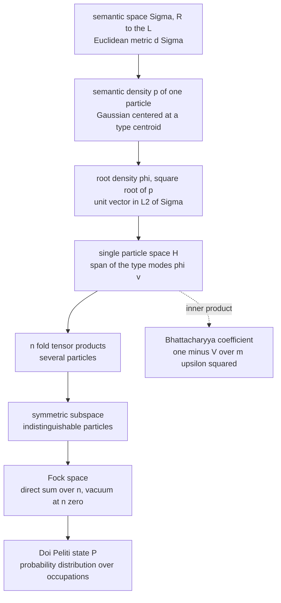
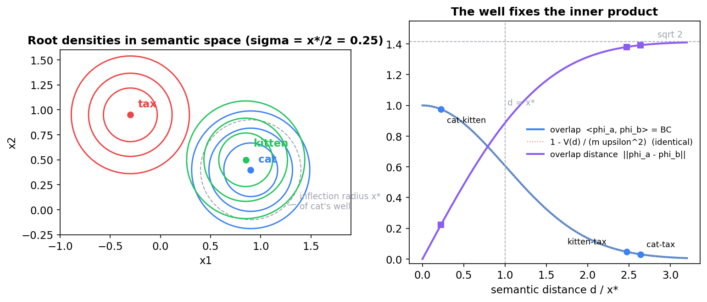
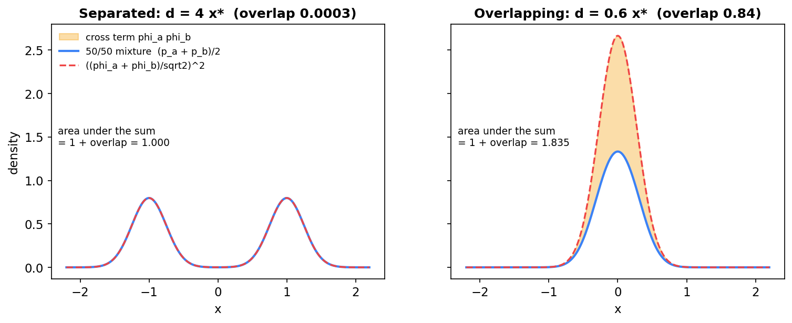
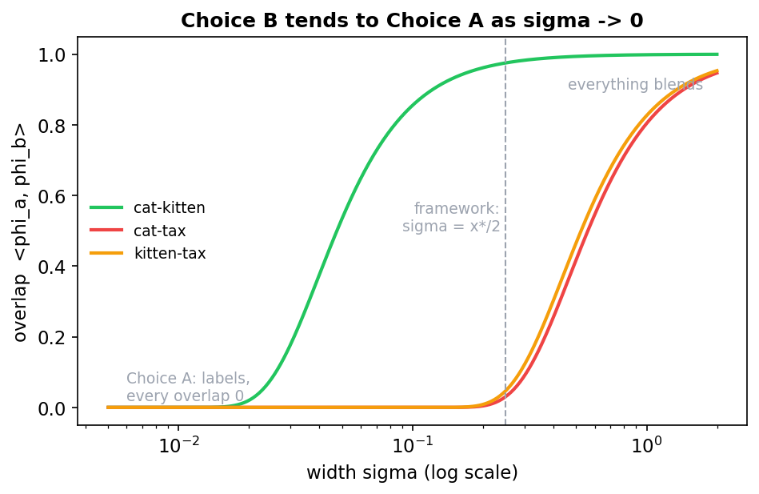
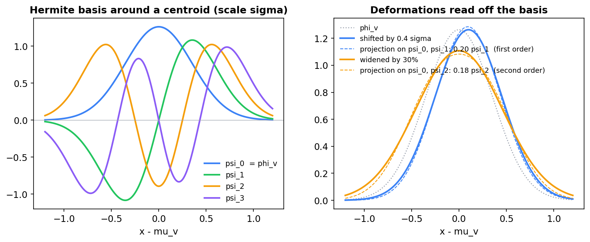
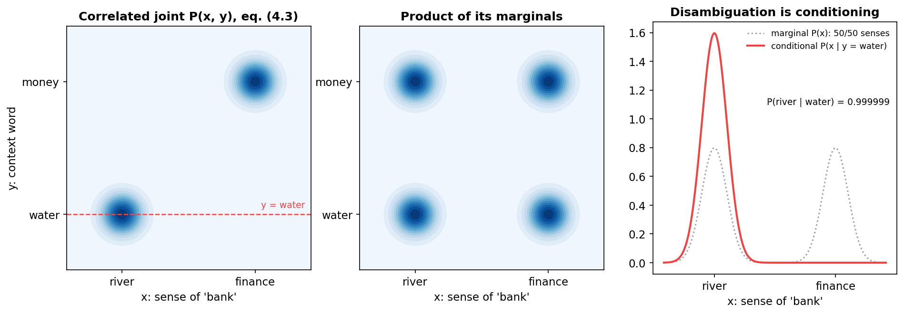
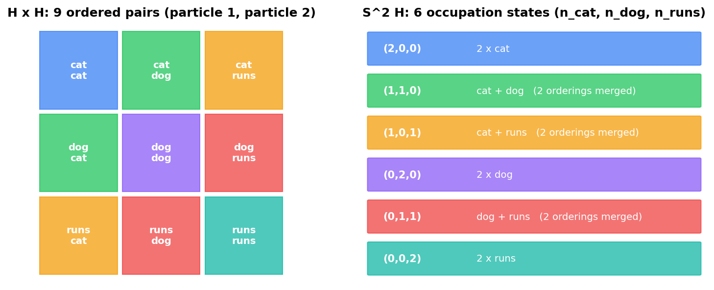
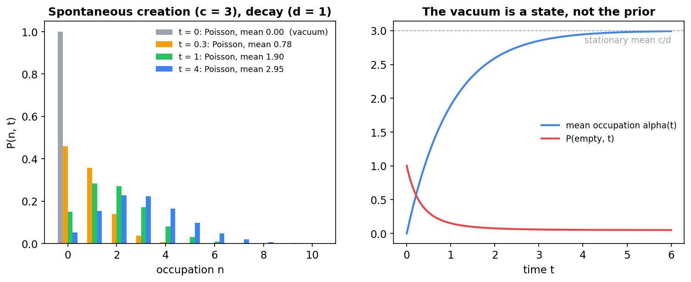
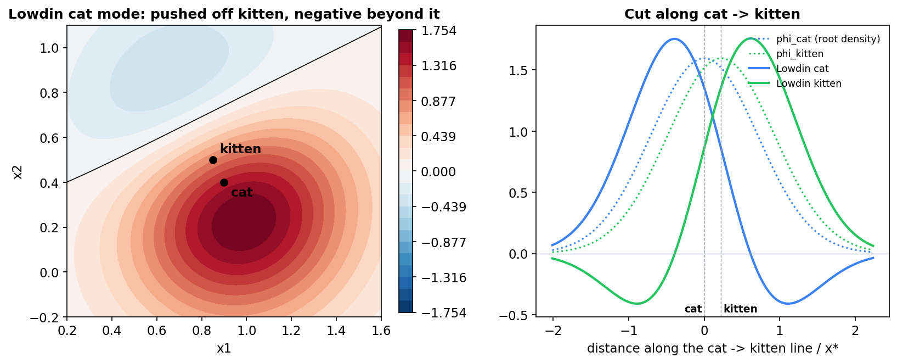

# The Single-Particle Hilbert Space in the Semantic Simulation Framework

**From semantic densities to Fock space, under the framework's classical (Doi–Peliti) commitment**

Companion note to Section 10.5.2 of the book and to [*Overlap Distance in the Semantic Simulation Framework*](Overlap_Distance_in_Semantic_Simulation.md). Notation follows the book: semantic space $\Sigma = (\mathbb{R}^L, d_\Sigma)$ with $d_\Sigma(x,y) = \lVert x-y\rVert_2$ (Definition 1), and the Gaussian semantic energy well $V(x) = m\upsilon^2\left(1 - e^{-\kappa^2x^2}\right)$ with inflection radius $x^{\ast} = 1/(\kappa\sqrt2)$ (Definition 13). Here $L$ is the dimension of semantic space, as in the book, not a layer count.

---

## Contents

0. [Scope: what changes under a classical reading](#0-scope-what-changes-under-a-classical-reading)
1. [What a single-particle state is in SemSimula](#1-what-a-single-particle-state-is-in-semsimula)
2. [Candidate single-particle spaces](#2-candidate-single-particle-spaces)
3. [Refinements: position labels and velocity](#3-refinements-position-labels-and-velocity)
4. [Tensor products: several particles](#4-tensor-products-several-particles)
5. [The symmetrized n-fold tensor product](#5-the-symmetrized-n-fold-tensor-product)
6. [The vacuum](#6-the-vacuum)
7. [From the single-particle space to Doi–Peliti states](#7-from-the-single-particle-space-to-doipeliti-states)
8. [Dictionary and summary](#8-dictionary-and-summary)

---

## 0. Scope: what changes under a classical reading

The book commits to **classical** semantic particles; the Fock-space machinery enters through the Doi–Peliti formalism, which was built for classical stochastic particle systems. An earlier informal discussion of the single-particle space used quantum vocabulary: amplitudes, superposition, "prepared" states, measurement, and the Born rule. Under the classical commitment those notions have no referent. Nobody prepares a semantic particle and nothing measures it.

This note rebuilds the discussion so that every object has a classical meaning. The mathematics (Hilbert spaces, tensor products, symmetrization, creation and annihilation operators) is unchanged. What changes is the **interpretation** of states and inner products:

| Concept | Quantum reading (dropped) | SemSimula reading (adopted) |
|---|---|---|
| Unit vector $\phi\in\mathcal{H}$ | probability amplitude | square root of a semantic density, $\phi = \sqrt p$ |
| Inner product $\langle\phi_a,\phi_b\rangle$ | transition amplitude | Bhattacharyya coefficient of two densities |
| $\lvert\langle\phi_a,\phi_b\rangle\rvert^2$ | transition probability (Born rule) | no direct meaning |
| Linear combination of states | coherent superposition | in $\mathcal{H}$: the root of a mixture only approximately, for disjoint supports (§1.4). In the Doi–Peliti state: exactly a mixture (§7) |
| Probabilistic uncertainty | encoded in amplitudes | encoded in the Doi–Peliti Fock state $\lvert P\rangle$ (§7) |
| Non-product joint state | entanglement | classical statistical correlation |
| Learning one particle's state | wavefunction collapse | Bayesian conditioning |
| Scalars | complex | real suffice |

The classical reading gives $\mathcal{H}$ two distinct roles, and most of what follows depends on keeping them apart.

- **Geometry.** Unit vectors of $\mathcal{H}$, the root densities, are the **modes**: one per semantic type, with overlaps that measure resemblance (§1–§2).
- **Probability.** Probabilities live in the Doi–Peliti state. Its one-particle sector is a probability vector over modes, normalized by summing to 1 rather than by having unit length (§7).

---

## 1. What a single-particle state is in SemSimula

### 1.1 The abstract object

$\mathcal{H}$ is an inner-product space, complete in its norm. In the Semantic Simulation framework a unit vector $\phi\in\mathcal{H}$ represents the state of one semantic particle. Choosing $\mathcal{H}$ amounts to answering two modeling questions:

1. **What can one semantic particle be?** Which degrees of freedom does its state carry: a type label, a location in $\Sigma$, a position in the text, a velocity?
2. **When are two particle states the same, and how similar are they?** That is, which inner product correctly measures semantic resemblance?

Everything in the Fock construction is then forced by this choice.

### 1.2 States as root densities

In the dynamics each particle sits at a point $h$ of $\Sigma$. The single-particle space describes it at the resolution its well sets: a probability density $p$ on $\Sigma$, spread around the type's centroid by the width of the well that binds it. We take as the state the **root density**

$$
\phi = \sqrt{p}, \qquad \lVert\phi\rVert^2 = \int_\Sigma p dx = 1. \qquad (1.1)
$$

Three reasons motivate the square root.

- **States become unit vectors.** Normalization of $p$ becomes unit norm of $\phi$, so states form the unit sphere of $L^2(\Sigma)$ and Hilbert-space geometry applies.
- **The inner product gets a meaning.** For root densities, the inner product (1.2) is the Bhattacharyya coefficient: the degree to which the two states occupy the same region of $\Sigma$. It equals 1 for identical states and approaches 0 for states with disjoint support.

$$
\langle\phi_a,\phi_b\rangle = \int_\Sigma\sqrt{p_a p_b} dx = \mathrm{BC}(p_a,p_b). \qquad (1.2)
$$

- **The induced distance is canonical.** The distance $\lVert\phi_a-\phi_b\rVert$ is $\sqrt2$ times the Hellinger distance between $p_a$ and $p_b$. Locally its square is one quarter of the Fisher–Rao line element, so $\lVert\phi_a-\phi_b\rVert$ is about half the Fisher–Rao distance (overlap-distance note, §6.4).

**The three quantities, explicitly.** Take the Hellinger convention $\mathrm{He}^2(p,q) = \tfrac12\int(\sqrt p-\sqrt q)^2dx$. Expanding the square and using unit norms gives (1.2a):

$$
\lVert\phi_a-\phi_b\rVert^2 = \int\left(\phi_a^2+\phi_b^2-2\phi_a\phi_b\right)dx = 2\left(1-\mathrm{BC}(p_a,p_b)\right) = 2\mathrm{He}^2(p_a,p_b). \qquad (1.2a)
$$

For a smooth family of densities, with the parameter shifted from $\theta$ to $\theta+d\theta$, write $\partial\sqrt p = \tfrac12\sqrt p\partial\log p$. Squaring and integrating turns the expected squared score into the Fisher information $\mathcal{I}(\theta)$:

$$
\lVert\phi_{\theta+d\theta}-\phi_\theta\rVert^2 = \tfrac14 d\theta^\top\mathcal{I}(\theta)d\theta + O(\lVert d\theta\rVert^3). \qquad (1.2b)
$$

For the location family of (1.3) below, the Fisher information is the identity divided by $\sigma^2$. Then (1.2b) reads $\lVert d\mu\rVert^2/(4\sigma^2) = 2\kappa^2\lVert d\mu\rVert^2$, which is exactly the small-distance expansion of $2(1-e^{-\kappa^2d^2})$ from (1.4). The local and the exact pictures agree.

All scalars here are real and all root densities are non-negative, so a **real** Hilbert space suffices.

### 1.3 The Gaussian states of the framework

For a type $v$ with centroid $\mu_v$, take $p_v = \mathcal{N}(\mu_v,\sigma^2I)$:

$$
\phi_v(x) = (2\pi\sigma^2)^{-L/4}\exp\left(-\frac{\lVert x-\mu_v\rVert^2}{4\sigma^2}\right),\qquad \sigma = \frac{1}{2\sqrt2\kappa} = \frac{x^{\ast}}{2}. \qquad (1.3)
$$

The width is fixed by the well: the spread of a semantic particle's state is half the inflection radius of its well. The overlap (1.4) of the states of two types with centroids $a$ and $b$ is fixed by the well too:

$$
\langle\phi_a,\phi_b\rangle = e^{-\kappa^2\lVert a-b\rVert^2} = 1 - \frac{V(\lVert a-b\rVert)}{m\upsilon^2}. \qquad (1.4)
$$

**Where (1.4) comes from.** The product of two root densities (1.3) is a single Gaussian. Complete the square: $\lVert x-a\rVert^2+\lVert x-b\rVert^2 = 2\lVert x-m\rVert^2 + \tfrac12\lVert a-b\rVert^2$, with $m$ the midpoint of $a$ and $b$. Then

$$
\langle\phi_a,\phi_b\rangle = (2\pi\sigma^2)^{-L/2}e^{-\lVert a-b\rVert^2/(8\sigma^2)}\int e^{-\lVert x-m\rVert^2/(2\sigma^2)}dx = e^{-\lVert a-b\rVert^2/(8\sigma^2)}, \qquad (1.4a)
$$

with no dimension-dependent prefactor, because both states have the same width.

**What "fixed by the well" means.** Equation (1.4a) has the Gaussian shape of the well for every width; the width only sets its scale. For any $\sigma$,

$$
\langle\phi_a,\phi_b\rangle = \left(1 - \frac{V(\lVert a-b\rVert)}{m\upsilon^2}\right)^{1/(8\sigma^2\kappa^2)}, \qquad (1.4b)
$$

a monotone reparametrization that keeps the ordering of pairs. The calibration $\sigma = x^{\ast}/2$ is the unique width that makes the exponent 1, so that the overlap equals one minus the normalized well potential exactly. It is a choice, made so that a single shape parameter governs both the dynamics and the geometry of $\mathcal{H}$. It is not a consequence of the dynamics. The overlap-distance note derives (1.3) and (1.4) in full (§3.2–§3.3 there).

**Figure 1.** Left: the root densities of the toy vocabulary of §2 (contours at 25, 50 and 75% of peak), at the framework's width, half the inflection radius. Right: the overlap (1.4) and the overlap distance against semantic distance in units of the inflection radius. The overlap curve and one minus the normalized well potential coincide exactly. The three pairs of the §2.3 table are marked.

### 1.4 What linear combinations do and do not mean

In a quantum reading, $\tfrac{1}{\sqrt2}(\phi_a + \phi_b)$ is a superposition. In the classical reading it needs care. The root of the 50/50 **mixture** of $p_a$ and $p_b$ is

$$
\phi_{\mathrm{mix}} = \sqrt{\tfrac12 p_a + \tfrac12 p_b}, \qquad (1.5)
$$

which is not a linear combination of $\phi_a$ and $\phi_b$. Compare it with the sum scaled by $1/\sqrt2$, whose square and squared norm are

$$
\left(\frac{\phi_a+\phi_b}{\sqrt2}\right)^2 = \tfrac12 p_a + \tfrac12 p_b + \phi_a\phi_b,\qquad \Big\lVert\frac{\phi_a+\phi_b}{\sqrt2}\Big\rVert^2 = 1 + \langle\phi_a,\phi_b\rangle. \qquad (1.6)
$$

The scaled sum differs from the mixture by the cross term $\phi_a\phi_b$, whose integral is the overlap, and it is a unit vector only when the overlap is zero. So:

- When the two states have **nearly disjoint support** (overlap near 0), the scaled sum is approximately the root of the mixture, and the bimodal shape is a faithful picture of "either $a$ or $b$."
- When they **overlap**, the linear structure of $\mathcal{H}$ should not be read as probabilistic combination. The scaled sum is not a unit vector, its norm being the square root of $1+\mathrm{BC}$. Coefficients no longer translate into mixture weights. The cross term moves mass toward the region between the two states.

**How good is "approximately"?** Normalize the squared scaled sum to a density, $q = (\phi_a+\phi_b)^2/(2(1+\mathrm{BC}))$, and let $m = \tfrac12(p_a+p_b)$ be the mixture. By (1.6), $q - m = (\phi_a\phi_b - \mathrm{BC}\cdot m)/(1+\mathrm{BC})$, and both terms in the numerator integrate to BC. So the total-variation distance obeys (1.7):

$$
\tfrac12\int\lvert q-m\rvert dx \le \frac{\mathrm{BC}}{1+\mathrm{BC}}. \qquad (1.7)
$$

The overlap controls the error. For the separated pair of Figure 2 (overlap 0.0003) the mixture reading holds to within 0.0003. For the overlapping pair (overlap 0.84) the bound is 0.46, while the actual distance is only 0.037. Two strongly overlapping Gaussians and their mixture are all nearly the same bump, so the shapes differ little. What fails there is the bookkeeping (norm and weights), not the shape.

**Figure 2.** The squared scaled sum (dashed) against the 50/50 mixture (solid). For separated states (left, four inflection radii apart) the two coincide. For overlapping states (right, 0.6 inflection radii apart) the cross term, shaded, adds the overlap to the total mass, 1.835 instead of 1, and concentrates it between the two states. Normalized, the sum is within 0.037 of the mixture in total variation.

**Example: "bank."** The river sense and the finance sense sit in different basins of $V_\theta$, far apart relative to $x^{\ast}$. Their root densities barely overlap, so the bimodal state is a good approximation to the classical 50/50 mixture of senses. The exact classical representation of that uncertainty, however, lives one level up: in the Doi–Peliti Fock state, as a probability distribution over which mode is occupied (§7.3). The single-particle space carries geometry; the Fock state carries probability.

---

## 2. Candidate single-particle spaces

The three candidates below share the vocabulary {cat, kitten, tax} and the toy two-dimensional embeddings *cat* $= (0.90, 0.40)$, *kitten* $= (0.85, 0.50)$, *tax* $= (-0.30, 0.95)$.

### 2.1 Choice A: type labels, $\mathcal{H} = \ell^2(\mathcal{V})$

Each type is a basis vector, $|\text{cat}\rangle = (1,0,0)$, $|\text{kitten}\rangle = (0,1,0)$, $|\text{tax}\rangle = (0,0,1)$, with $\langle v|w\rangle = \delta_{vw}$.

The embeddings do not enter at all. These are the one-hot vectors at the input of an embedding layer, before the lookup into $\mathbb{R}^L$. Every pair of distinct types is orthogonal, so *cat*–*kitten* and *cat*–*tax* have the same overlap: zero. This is not a claim about semantics; it is the defect of a space built from labels, which carry no similarity.

**Classical reading.** Choice A is Doi–Peliti on a lattice whose sites are types. It is a legitimate model, but similarity must then be put into the reaction rates, because the single-particle space is blind to it.

### 2.2 The embedding vector itself, $\mathcal{H} = \mathbb{R}^L$

A tempting middle option is to use the normalized embedding as the state, with cosine similarity as the inner product: *cat*–*kitten* $\approx 0.994$, *cat*–*tax* $\approx 0.112$. Similarity is now visible, but two problems remain.

1. **Too few distinguishable states.** $\mathbb{R}^L$ holds at most $L$ mutually orthogonal states. At $L = 768$ that is fewer than the vocabulary, let alone composite senses. Exponentially many *nearly* orthogonal directions exist, but nearly orthogonal is not orthogonal: their small overlaps accumulate in every sum over the vocabulary, and point 2 remains.
2. **No representation of uncertainty.** The normalized sum of the *cat* and *tax* vectors is just another direction, indistinguishable from the embedding of a word that happens to lie between them. "Either cat or tax" and "a word halfway between" collapse into the same state. Root densities avoid this, since by §1.4 two well-separated states sum to a bimodal function.

### 2.3 Choice B: Gaussian root densities, $\mathcal{H}\subset L^2(\mathbb{R}^L)$

The space is the closed span of the root densities (1.3):

$$
\mathcal{H} = \overline{\mathrm{span}}\lbrace\phi_v : v\in\mathcal{V}\rbrace \subset L^2(\mathbb{R}^L). \qquad (2.1)
$$

With $\sigma = 0.25$ (so $\kappa^2 = 1/(8\sigma^2) = 2$ and $x^{\ast} = 0.5$):

| Pair | squared distance | overlap $e^{-\kappa^2 d^2}$ | overlap distance $\sqrt{2(1-\text{overlap})}$ |
|---|---|---|---|
| cat–kitten | 0.0125 | 0.975 | 0.222 |
| kitten–tax | 1.525 | 0.047 | 1.380 |
| cat–tax | 1.7425 | 0.031 | 1.392 |

The inner product of $\mathcal{H}$ now reflects semantic geometry, and by (1.4) it is fixed by the well. **This is the recommended choice.**

**Dimension and conditioning.** Unlike §2.2, the dimension of $\mathcal{H}$ is not capped by $L$. The Gaussian kernel is strictly positive definite, so root densities at distinct centroids are linearly independent and $\dim\mathcal{H}$ equals the size of the vocabulary even at $L = 2$. The price is conditioning: near-synonyms make the Gram matrix nearly singular. For two modes with overlap $c$, the Gram matrix has eigenvalues $1+c$ and $1-c$, so its condition number is $(1+c)/(1-c)$. For a close pair $1-c$ is about $\kappa^2d^2$, so the condition number is about $2/(\kappa^2d^2)$, growing as the inverse square of the distance. Cat–kitten has $c = 0.9753$ and condition number 80.0. The third mode, tax, raises the toy triple's only to 81.

**Relation between A and B.** As $\sigma\to0$, every overlap between distinct centroids tends to 0 and Choice B tends to Choice A. Choice A is the infinite-resolution limit, in which every distinction between types is perfect and no similarity survives. As $\sigma$ grows, overlaps rise and nearby meanings blend. In the framework $\sigma$ is not free: $\sigma = x^{\ast}/2$.

**Figure 3.** The three overlaps of the toy vocabulary as the width varies. Below a width of about 0.015 every overlap is zero (Choice A). At the framework's width the near-synonyms overlap at 0.975 and the unrelated pairs at 0.03–0.05; at large widths everything blends.

### 2.4 A computational basis for $L^2(\mathbb{R}^L)$: Hermite functions

In a quantum reading, the energy eigenstates of the harmonic approximation to the well would form a physically meaningful basis. Classically, the well has no energy eigenstates. The same functions are still useful as a **computational basis**. The Hermite functions (2.2), centered at $\mu_v$ with scale $\sigma$,

$$
\psi^{(v)}\_{\mathbf{n}}(x) = (\sqrt2\sigma)^{-L/2}\prod_{i=1}^{L} h_{n_i}\left(\frac{x_i - \mu_{v,i}}{\sqrt2\sigma}\right), \qquad (2.2)
$$

with $h_n$ the normalized one-dimensional Hermite functions, form an orthonormal basis of $L^2(\mathbb{R}^L)$, and the lowest one, $\mathbf{n} = 0$, is exactly $\phi_v$. Higher Hermite functions describe deformations of a semantic density away from the Gaussian shape: shifts (first order), squeezes and anisotropy (second order). They are a natural vocabulary for the anisotropic and multi-well generalizations of $V_\theta$.

**The first two deformations, explicitly.** In one dimension, differentiating (1.3) with respect to the centroid and to the width gives (2.3):

$$
\partial_\mu\phi_v = \frac{1}{2\sigma}\psi_1, \qquad \partial_\sigma\phi_v = \frac{1}{\sqrt2\sigma}\psi_2. \qquad (2.3)
$$

So, to first order, a shift by $\delta$ adds $\delta/(2\sigma)$ times the first Hermite function, and a relative widening by $\epsilon$ adds $\epsilon/\sqrt2$ times the second. Both corrections are orthogonal to $\phi_v$, as derivatives of a unit-norm family must be. For Figure 4 they are 0.20 and 0.21. The exact projection of the 30% widening is 0.18; the difference is second order in $\epsilon$.

In $L$ dimensions, a shift along one axis excites the first-order function along that axis. An isotropic widening excites the sum of the second-order functions along all axes. A density stretched or tilted off the axes also excites the mixed functions, first order in two axes at once. The Hermite coefficients are therefore a direct readout of how a learned density departs from the isotropic Gaussian.

**Figure 4.** Left: the first four one-dimensional Hermite functions at the framework's scale; the lowest is the root density itself. Right: a root density shifted by 0.4 widths is captured, to first order, by its projection onto the lowest two functions. A root density widened by 30% is captured, to second order, by its projection onto the lowest function and the second-order one.

**Bound versus unbound.** The quantum split $\mathcal{H}\_{\text{bound}}\oplus\mathcal{H}\_{\text{scatter}}$ has a classical counterpart in **phase space**, not in $\mathcal{H}$. A particle with total energy below $m\upsilon^2$ stays in the well; one at or above it escapes. That is a partition of states of motion, belonging to the dynamics rather than to the single-particle space of semantic content.

---

## 3. Refinements: position labels and velocity

### 3.1 Position in the text

For token particles in a sequence, one may add the text position as a label, as in (3.1),

$$
\mathcal{H}\_{\text{tok}} = L^2(\mathbb{R}^L)\otimes\ell^2(\lbrace 1,\dots,T\rbrace), \qquad (3.1)
$$

so that $\phi_{\text{dog}}\otimes e_2$ means "the meaning *dog* at position 2."

The book assigns order-dependence of meaning to the non-abelian operator algebra of v3 (Section 10.5.3), not to the single-particle space. Under that choice, (3.1) is unnecessary for v2. It remains available if a model needs position at the level of particle states, for example to make the symmetric product order-aware (§5.4).

### 3.2 Velocity: configuration space or phase space

The SemSimula dynamics is second order: each particle carries a position $h$ and a velocity $v$, and the BAOAB integrator updates both. A complete classical one-particle state is therefore a point in phase space, and a spread-out state is a density on $\Sigma\times\mathbb{R}^L$. That gives two options.

**Configuration-space $\mathcal{H}$** (recommended for v2): root densities on $\Sigma$ only. Semantic similarity is a statement about *where* meanings are, so this is where the overlap belongs. Velocity is dynamical and handled by the integrator.

**Phase-space $\mathcal{H}$**: root densities on $\Sigma\times\mathbb{R}^L$. This is needed only if one wants the Fock-level description to carry momentum, for example to model "where a meaning is heading" as part of a particle's identity.

Doi–Peliti in its standard form describes overdamped (position-only) stochastic dynamics, which matches the configuration-space choice. The match is an idealization for the trained models. The live-gradient ladder runs at constant friction γ = 0.1, a damping ratio near 0.05, deep in the underdamped regime. The momentum carries real weight there: resetting the velocity entering each layer costs 33–55% in perplexity on the Gen 3 models (Gate 1 of the flow-or-maps probe). Whether a first-order (overdamped) model would suffice on OpenWebText is an open, pre-registered question (the FO series).

The earlier argument that complex numbers are needed to package $(h,v)$ into a single amplitude belongs to the quantum reading and is dropped. Classically, velocity is either part of the configuration (phase-space option) or part of the dynamics (configuration-space option), and real scalars suffice either way.

---

## 4. Tensor products: several particles

### 4.1 Joint states

For two **labeled** particles, the joint space (4.1) is

$$
\mathcal{H}\otimes\mathcal{H}\subset L^2(\Sigma\times\Sigma), \qquad (4.1)
$$

whose elements are functions $\Phi(x,y)$ of both particles' semantic positions. Under the root-density reading, $\Phi = \sqrt{P}$ for a joint density $P(x,y)$.

**Product states are independence.**

$$
(\phi_a\otimes\phi_b)(x,y) = \phi_a(x)\phi_b(y) = \sqrt{p_a(x)p_b(y)}, \qquad (4.2)
$$

the root of a product density: the two particles' semantic positions are statistically independent.

### 4.2 Non-product states are correlations

A joint density that is not a product cannot be written as $\phi_a\otimes\phi_b$. **Example: disambiguation of "bank."** Let particle 1 be "bank" and particle 2 its context word:

$$
P(x,y) = \tfrac12 p_{\text{river}}(x)p_{\text{water}}(y) + \tfrac12 p_{\text{finance}}(x)p_{\text{money}}(y). \qquad (4.3)
$$

This is a classical correlated mixture. Its marginal on $x$ is a 50/50 mixture of senses. Conditioning on the context word gives (4.4):

$$
P(x\mid y) = \frac{p_{\text{river}}(x)p_{\text{water}}(y) + p_{\text{finance}}(x)p_{\text{money}}(y)}{p_{\text{water}}(y) + p_{\text{money}}(y)} \approx p_{\text{river}}(x) \quad \text{for } y \text{ near water}, \qquad (4.4)
$$

since the money density is negligible there. Conditioning selects the river sense. Contextual disambiguation is **Bayesian conditioning on a correlated joint distribution**, with no collapse and no measurement.

**Figure 5.** Left: the correlated joint density (4.3), with mass only on river–water and finance–money. Centre: the product of its marginals, which puts equal mass on all four combinations; the joint is not a product. Right: the marginal of the sense (two equal peaks) and the conditional given the context word water, which keeps only the river sense.

When the two product terms in (4.3) have nearly disjoint supports in $\Sigma\times\Sigma$, the cross terms in $\sqrt P$ are negligible and, by the same argument as (1.6),

$$
\sqrt{P} \approx \tfrac{1}{\sqrt2}\left(\phi_{\text{river}}\otimes\phi_{\text{water}} + \phi_{\text{finance}}\otimes\phi_{\text{money}}\right), \qquad (4.5)
$$

which is not a product. So the two-sense picture survives the classical reading, but its meaning is correlation, not entanglement.

**How much correlation, exactly.** A function of two arguments is a product exactly when its Schmidt rank is 1. The Schmidt rank is the rank of the integral operator with that function as its kernel. The right side of (4.5) has Schmidt rank 2 whenever the river and finance modes are linearly independent, and so are the water and money modes. In information terms, when the supports are disjoint the context word carries exactly one bit about the sense, (4.6):

$$
I(X;Y) = H(X) + H(Y) - H(X,Y) = \ln 2. \qquad (4.6)
$$

Each entropy splits into a $\ln 2$ for the 50/50 choice plus the average entropy of the blobs. The blob terms cancel, and one $\ln 2$ survives. The product of the marginals (Figure 5, centre) has the same marginals and zero mutual information.

### 4.3 Correlations and the connected four-point function

If the effective dynamics of the particle system is linear, with a quadratic potential and Gaussian noise, its stationary statistics are Gaussian. All connected cumulants beyond second order then vanish, in particular $G_c^{(4)} = 0$. A Gaussian joint density cannot be bimodal, so correlated structures like (4.3) need a non-quadratic potential.

This must not be read as "conservative means free." The framework's conservative forces come from **anharmonic** potentials: the Gaussian well $V$ and the pair potential $V_\phi$. Under the Langevin thermostat the stationary density of a conservative system is the Boltzmann density, proportional to $e^{-U/T}$, which is non-Gaussian whenever $U$ is not quadratic. It can carry exactly the correlation of (4.3).

The free/interacting partition that the book draws alongside the Conservative Obstruction Theorem (Section 20.4) concerns a different ensemble. There, $G_c^{(4)}$ is the connected four-point function of an attention head's output, averaged over its random initialization in the neural-network/QFT correspondence. It is a statement about how attention couples its inputs, not about the stationary statistics of semantic particles.

---

## 5. The symmetrized n-fold tensor product

### 5.1 Definition

The symmetric group $S_n$ acts on $\mathcal{H}^{\otimes n}$ by permuting factors,

$$
U_\pi(f_1\otimes\cdots\otimes f_n) = f_{\pi^{-1}(1)}\otimes\cdots\otimes f_{\pi^{-1}(n)}, \qquad (5.1)
$$

and the symmetrizer averages over all permutations:

$$
P_+ = \frac{1}{n!}\sum_{\pi\in S_n}U_\pi. \qquad (5.2)
$$

$P_+$ is an orthogonal projection ($P_+^2 = P_+ = P_+^\top$). The symmetric $n$-fold product is its range,

$$
S^n\mathcal{H} = P_+\mathcal{H}^{\otimes n}, \qquad (5.3)
$$

which, as functions, is the set of $\Phi(x_1,\dots,x_n)$ invariant under every reordering of the arguments.

**Why $P_+$ is an orthogonal projection.** Each permutation operator is orthogonal, and they compose as the group does, $U_\pi U_\rho = U_{\pi\rho}$. For a fixed $\pi$, the product $\pi\rho$ runs once over the group as $\rho$ does, so

$$
P_+^2 = \frac{1}{(n!)^2}\sum_{\pi}\sum_{\rho}U_{\pi\rho} = \frac{1}{n!}\sum_{\tau\in S_n}U_\tau = P_+, \qquad (5.2a)
$$

and $P_+$ is symmetric because the transpose of each permutation operator is the operator of the inverse permutation, and inversion also runs once over the group.

**Counting.** An orthonormal basis of the symmetric product is labeled by multisets of $n$ elements drawn from the $N$ basis vectors, which stars-and-bars counts as in (5.4). For $n = 2$ the count is $N(N+1)/2$: $N$ doubly occupied states plus $N(N-1)/2$ unordered pairs. If $\dim\mathcal{H} = N$, then for $n \geq 2$ and $N \geq 2$

$$
\dim S^n\mathcal{H} = \binom{N+n-1}{n} \lt N^n. \qquad (5.4)
$$

### 5.2 What symmetrization means classically

Labeling particles "1, 2, …" is bookkeeping. Physically, only the **configuration** matters: which semantic states are occupied, and how many times. Symmetrization removes the bookkeeping. A state in $S^n\mathcal{H}$ says "there is one *cat* and one *dog*," never "particle 1 is *cat*."

Classically this is the passage from labeled trajectories to **occupation numbers**, which is exactly the variable the Doi–Peliti formalism tracks.

### 5.3 Worked example

Take an orthonormal toy basis {cat, dog, runs}, so $N = 3$, and $n = 2$ particles. The full product $\mathcal{H}^{\otimes2}$ has 9 basis states, including both orderings of *cat* and *dog*. The symmetric subspace has $\binom{4}{2} = 6$, labeled by occupation numbers $(n_{\text{cat}}, n_{\text{dog}}, n_{\text{runs}})$ summing to 2:

$$
(2,0,0),\quad (0,2,0),\quad (0,0,2),\quad (1,1,0),\quad (1,0,1),\quad (0,1,1).
$$

The normalized states are, for example,

$$
\lvert 1,1,0\rangle = \tfrac{1}{\sqrt2}\left(e_{\text{cat}}\otimes e_{\text{dog}} + e_{\text{dog}}\otimes e_{\text{cat}}\right),\qquad \lvert 2,0,0\rangle = e_{\text{cat}}\otimes e_{\text{cat}}. \qquad (5.5)
$$

**Figure 6.** Left: the 9 ordered pairs of the full product, colored by occupation. Right: the 6 occupation states of the symmetric subspace. Each off-diagonal color appears twice on the left: the two orderings of the same configuration merge.

Doi–Peliti uses an unnormalized convention, described in §7.1, in which configurations are created directly by powers of creation operators.

With the overlapping Gaussian modes of Choice B, the basis is not orthonormal. Two consequences follow, both derived in the overlap-distance note (§8 there). The commutator becomes the Gram matrix, $[a_v, a_w^\dagger] = G_{vw}$. Doi–Peliti is applied in the Löwdin-orthonormalized basis $\tilde\phi = G^{-1/2}\phi$ (§7.1, §7.4).

**Overlap changes the two-particle norms.** Using the Gram commutator twice,

$$
\Big\lVert a_v^\dagger a_w^\dagger\lvert 0\rangle\Big\rVert^2 = G_{vv}G_{ww} + G_{vw}G_{wv} = 1 + G_{vw}^2, \qquad \Big\lVert (a_v^\dagger)^2\lvert 0\rangle\Big\rVert^2 = 2. \qquad (5.5a)
$$

A pair of near-synonyms is almost as heavy as a doubly occupied mode: for cat and kitten, 1.95 against 2. Bosonic statistics and semantic similarity interact. Two particles in near-identical modes behave almost like two particles in the same mode (overlap-distance note, §8.6).

### 5.4 Why symmetrization is justified, and the word-order question

**Justification.** The framework's force law treats every particle with the same functions and sums symmetrically over partners, as in (5.6).

$$
F_i = -\nabla V_\theta(h_i) - \sum_{s\neq i}\nabla_{h_i} V_\phi(h_i,h_s). \qquad (5.6)
$$

So the many-particle dynamics commutes with every relabeling. The symmetric sector is therefore invariant under the dynamics: restricting to it is consistent with the equations of motion, not an extra assumption.

**The causal language models break this symmetry.** As trained, they restrict the partners of the token at position $t$ to earlier positions, $s \lt t$, in place of every $s$ other than $t$. Their context channels are moving averages over the past. Both make the dynamics depend on order. The argument above therefore applies to the framework's force law, not to the causal models as trained. Causality is also where those models actually carry word order.

**Word order.** Over type labels alone, the symmetric product cannot distinguish "dog bites man" from "man bites dog": both have occupations (1, 1, 1) over {dog, bites, man}. Three remedies exist.

1. **Order in the single-particle state**, via the position label (3.1). Then the two sentences occupy different single-particle states, (dog, 1), (bites, 2), (man, 3) versus (man, 1), (bites, 2), (dog, 3), and are orthogonal configurations.
2. **Order in the operator algebra**, as the book does in v3, through non-abelian operators.
3. **Order in the dynamics**, through the causal force law of the trained models, as described above.

Since the book takes the second route at the level of the formalism, the bosonic Fock space of v2 does not need to encode order itself.

### 5.5 What repeated occupation means

Bosonic statistics allow several particles in the same state.

- **Registers** carry no position, so repeated occupation of one mode means *more of the same meaning*: intensity. In Doi–Peliti, a mode whose occupation is Poisson with mean $\alpha$ is described by a coherent state (§7.2), so a register's continuous salience is naturally read as that Poisson mean. (The book writes the salience as $\sigma_k$; it is unrelated to the mode width $\sigma$.)
- **Token particles with position labels** fill each text slot exactly once. In the position label they behave like excluded particles (at most one per slot), while their semantic content can still be shared. A hybrid statistic, bosonic in content and exclusive in slot, is the accurate description.

---

## 6. The vacuum

### 6.1 Definition

By convention the 0-fold tensor product is the scalar field, $\mathcal{H}^{\otimes0} = \mathbb{R}$ (the book writes $\mathbb{C}$; real scalars suffice here, §1.2), so

$$
S^0\mathcal{H} = \mathbb{R}\lvert 0\rangle, \qquad (6.1)
$$

spanned by a single unit vector, the vacuum. Three facts are worth stating precisely.

1. **The vacuum is not the zero vector.** $\langle0|0\rangle = 1$; the vacuum is a legitimate state.
2. **It is annihilated by every annihilator.** $a(f)|0\rangle = 0$ for all $f\in\mathcal{H}$.
3. **It generates the Fock space.** Every Fock state is a limit of polynomials in creation operators applied to $|0\rangle$.

### 6.2 Classical meaning

In Doi–Peliti, $|0\rangle$ is the configuration with **no particles**, held with probability 1. Semantically:

- at the level of **language**, the empty discourse, before any token is read;
- at the level of **registers**, every salience zero: no working-memory content.

### 6.3 The prior is a stationary state, not the vacuum

An earlier informal discussion described an "interacting vacuum" containing virtual pairs and identified it with the model's prior. That picture is quantum and is dropped. Its classical replacement is cleaner. Suppose the creation–destruction process includes **spontaneous creation**, particles appearing without a precursor ($\varnothing\to A$). Then the long-run distribution of the master equation is not the empty configuration. It is a stationary distribution with non-zero occupancy (6.2), where $\mathcal{L}$ is the Doi–Peliti Liouvillian (§7.1):

$$
\mathcal{L}\lvert P_{\text{st}}\rangle = 0,\qquad \lvert P_{\text{st}}\rangle \neq \lvert 0\rangle. \qquad (6.2)
$$

**The simplest case, worked out.** One mode, spontaneous creation at rate $c$ and decay of each particle at rate $d$. The Liouvillian and its stationary state are given by (6.3):

$$
\mathcal{L} = c(a^\dagger - 1) + d(a - a^\dagger a), \qquad \lvert P_{\text{st}}\rangle = e^{(c/d)(a^\dagger - 1)}\lvert 0\rangle. \qquad (6.3)
$$

Each term has a direct reading:
- $c a^\dagger$ moves probability from $n-1$ particles to $n$, and $-c$ removes it from $n$ at the same rate.
- $d a$ moves probability from $n+1$ to $n$ with weight $n+1$, and $-d a^\dagger a$ removes it from $n$ at rate $dn$.

To check (6.3), use $a\lvert\alpha\rangle = \alpha\lvert\alpha\rangle$ for the coherent state $\lvert\alpha\rangle = e^{\alpha(a^\dagger-1)}\lvert 0\rangle$:

$$
\mathcal{L}\lvert\alpha\rangle = c(a^\dagger-1)\lvert\alpha\rangle + d\alpha(1-a^\dagger)\lvert\alpha\rangle = (c-d\alpha)(a^\dagger-1)\lvert\alpha\rangle, \qquad (6.3a)
$$

which vanishes exactly when $\alpha = c/d$. The stationary state is therefore the coherent state of §7.2, a Poisson distribution with mean $c/d$. With a time-dependent mean, the time derivative of the coherent state is the rate of change of $\alpha$ times $(a^\dagger-1)\lvert\alpha\rangle$. Matching it to (6.3a), the coherent form is preserved and the mean obeys $d\alpha/dt = c - d\alpha$. Started from the vacuum, the distribution therefore stays Poisson at every time, with a mean that rises to $c/d$, as in (6.4):

$$
P(n,t) = e^{-\alpha(t)}\frac{\alpha(t)^n}{n!}, \qquad \alpha(t) = \frac{c}{d}\left(1 - e^{-dt}\right). \qquad (6.4)
$$

**Figure 7.** Left: the occupation distribution at four times, from the vacuum (all mass at zero) to the stationary Poisson state of mean 3. Right: the mean occupation rises to its stationary value, and the probability of the empty configuration falls to its stationary value, about 0.05.

**Semantic reading.** The empty discourse is a state; the prior is the stationary distribution the dynamics settles into without input. This gives a principled home to the output-bias correction from the OpenWebText diagnostics: initializing the output bias to log-frequencies supplies an explicit unconditional distribution, which plays the role of the stationary state at the output. That link is interpretive rather than derived.

---

## 7. From the single-particle space to Doi–Peliti states

### 7.1 Doi–Peliti conventions

Doi–Peliti works with orthonormal modes. With overlapping Gaussians, use the Löwdin modes $\tilde\phi_v$ and their operators $\tilde a_v$, with $[\tilde a_v,\tilde a_w^\dagger] = \delta_{vw}$.

The Löwdin modes are unit vectors, but they are **not root densities**: they take negative values (§7.4). That is all Doi–Peliti needs, since it uses them only to label sites.

Configurations are created **without** normalizing factors:

$$
\lvert\mathbf{n}\rangle = \prod_v(\tilde a_v^\dagger)^{n_v}\lvert 0\rangle. \qquad (7.1)
$$

A probability distribution $P(\mathbf{n})$ over configurations is encoded as

$$
\lvert P\rangle = \sum_{\mathbf{n}}P(\mathbf{n})\lvert\mathbf{n}\rangle. \qquad (7.2)
$$

Observables are evaluated with the **projection state** (7.3):

$$
\langle\mathbf{1}| = \langle 0|e^{\sum_v\tilde a_v},\qquad \langle\mathbf{1}|\mathbf{n}\rangle = 1 \quad \text{for every } \mathbf{n}. \qquad (7.3)
$$

**Why (7.3) holds.** Moving $e^{a}$ past a creation operator shifts it by one, $e^{a}a^\dagger e^{-a} = a^\dagger + 1$, mode by mode. Since $e^{a}\lvert 0\rangle = \lvert 0\rangle$ and $\langle 0\rvert a^\dagger = 0$,

$$
\langle 0|e^{a}(a^\dagger)^n|0\rangle = \langle 0|(a^\dagger+1)^n e^{a}|0\rangle = \langle 0|(a^\dagger+1)^n|0\rangle = 1. \qquad (7.3a)
$$

So $\langle\mathbf{1}|P\rangle = \sum_{\mathbf{n}}P(\mathbf{n}) = 1$ expresses normalization of probability, and mean occupations are given by (7.4):

$$
\mathbb{E}[n_v] = \langle\mathbf{1}|\tilde a_v^\dagger\tilde a_v|P\rangle. \qquad (7.4)
$$

The same shift identity gives $\langle\mathbf{1}|\tilde a_v^\dagger = \langle\mathbf{1}|$, so (7.4) reduces to $\langle\mathbf{1}|\tilde a_v|P\rangle$. The annihilator returns each configuration with weight $n_v$ and one particle fewer, which the projection state counts as 1. What remains is the sum of $n_v P(\mathbf{n})$: the mean. Every observable that is a function of the occupations is computed the same way, as a sum weighted by $P$, which is why expectations are linear.

The normalization is a sum, not a length. In the one-particle sector, $\lvert P\rangle = \sum_v P(v)\tilde a_v^\dagger\lvert 0\rangle$ is a probability vector over modes. Its coefficients sum to 1, and its squared length is the sum of the squared probabilities, which is less than 1 unless one mode is certain. This is the second role of $\mathcal{H}$ from §0, distinct from the unit-vector root densities of §1.

The master equation becomes a linear evolution, $\partial_t|P\rangle = \mathcal{L}|P\rangle$, with the Liouvillian $\mathcal{L}$ built from creation and annihilation operators encoding the reaction and transport rates. Expectations are linear in $|P\rangle$, not quadratic, which is why no Born rule appears.

### 7.2 Coherent states are Poisson distributions

The Doi–Peliti coherent state (7.5) with mean $\alpha\ge0$ in mode $v$ is

$$
\lvert\alpha\rangle_v = e^{\alpha(\tilde a_v^\dagger - 1)}\lvert 0\rangle = \sum_{n\geq0}e^{-\alpha}\frac{\alpha^n}{n!}(\tilde a_v^\dagger)^n\lvert 0\rangle, \qquad (7.5)
$$

which by (7.2) is exactly the Poisson distribution with mean $\alpha$. Product coherent states over modes are product Poisson distributions. This is the classical meaning of the mean-field approximation, and the reason a continuous register salience is naturally a Poisson mean. The stationary state of the creation–decay process in §6.3 is such a coherent state, with $\alpha = c/d$.

### 7.3 "Bank" at the Fock level

The uncertainty between the two senses of "bank," as one particle that is either in the river mode or in the finance mode, is represented exactly by (7.6):

$$
\lvert P_{\text{bank}}\rangle = \tfrac12\tilde a_{\text{river}}^\dagger\lvert 0\rangle + \tfrac12\tilde a_{\text{finance}}^\dagger\lvert 0\rangle, \qquad (7.6)
$$

a probability distribution over which mode is occupied. This is the precise classical counterpart of the bimodal single-particle function in §1.4. The single-particle space supplies the geometry of the two senses; the Fock state supplies the probabilities.

### 7.4 The Löwdin modes, explicitly

**The Löwdin modes are not root densities.** The Löwdin step removes overlap by subtracting neighbors: $G^{-1/2}$ has negative off-diagonal entries wherever modes overlap. So each Löwdin mode takes negative values on the far side of its near-synonyms. It is a unit vector, but not the square root of any density. The root-density reading of §1 belongs to the original modes $\phi_v$. The Löwdin modes are an orthonormal bookkeeping basis, which is all Doi–Peliti requires: it uses them only to label sites.

**Figure 8.** Left: the Löwdin cat mode for the toy vocabulary. It is pushed off kitten, positive at kitten's centroid (0.86 against a peak of 1.75), and negative beyond it, down to −0.41; the black line is its zero contour. Right: a cut along the cat–kitten line. The original modes (dotted) are non-negative and overlap at 0.975. Each Löwdin mode (solid) is negative on the far side of the other.

**Two modes, explicitly.** For two modes with overlap $c$, the Löwdin matrix has equal diagonal entries $\alpha$ and equal off-diagonal entries $\beta$, given by (7.7):

$$
G^{-1/2} = \begin{pmatrix} \alpha & \beta \cr \beta & \alpha \end{pmatrix}, \qquad \alpha = \tfrac12\left((1+c)^{-1/2} + (1-c)^{-1/2}\right), \qquad \beta = \tfrac12\left((1+c)^{-1/2} - (1-c)^{-1/2}\right). \qquad (7.7)
$$

For overlapping modes $\beta$ is negative, so the Löwdin mode of $a$ is $\alpha\phi_a - \lvert\beta\rvert\phi_b$. It is negative wherever $\phi_b/\phi_a$ exceeds $\alpha/\lvert\beta\rvert$. For isotropic Gaussians that ratio depends on $x$ only through its coordinate $s$ along the line from $a$ to $b$, measured from $a$. With $d$ the distance between the centroids, the squared distances differ by $2sd - d^2$. So the zero set is a hyperplane at the coordinate given by (7.8):

$$
s_0 = \frac{d}{2} + \frac{2\sigma^2}{d}\ln\frac{\alpha}{\lvert\beta\rvert}. \qquad (7.8)
$$

For cat and kitten, $c = 0.9753$, so $\alpha = 3.538$ and $\beta = -2.826$. The zero sits 0.307 from cat, 0.195 beyond kitten: the straight zero contour of Figure 8.

**The negative lobe never goes away.** As the pair merges ($c \to 1$), $\alpha/\lvert\beta\rvert$ tends to 1, approximately $1 + \sqrt2\kappa d$, so the second term of (7.8) tends to $2\sqrt2\kappa\sigma^2$. At the framework's width that is exactly $\sigma$. The zero therefore stays one width beyond the midpoint, however close the near-synonyms come, while the coefficients $\alpha$ and $\lvert\beta\rvert$ diverge together. Orthonormalizing near-synonyms always produces signed modes with large, cancelling coefficients. This is the conditioning cost of §2.3 seen in function space.

---

## 8. Dictionary and summary

| Abstract object | SemSimula meaning |
|---|---|
| $\mathcal{H}$ | Root densities of one semantic particle over $\Sigma$; recommended: span of the Gaussian modes, width half the inflection radius |
| Unit vector $\phi = \sqrt p$ | State of one semantic particle at the resolution its well sets |
| $\langle\phi_a,\phi_b\rangle$ | Bhattacharyya coefficient, equal to one minus the normalized well potential |
| $\lVert\phi_a-\phi_b\rVert$ | Overlap distance, √2 times the Hellinger distance |
| Hermite functions around a centroid | Computational basis; deformations of a semantic density |
| $\mathcal{H}^{\otimes n}$ | Labeled particles; product states mean independence, others correlation |
| $S^n\mathcal{H}$ | Indistinguishable particles; configurations by occupation number. Justified by the framework's symmetric force law; the causal models break it |
| Position label | Optional; the book places order in v3 instead |
| Vacuum $\lvert 0\rangle$ | Empty discourse; all registers inactive |
| Stationary state | The prior, under spontaneous creation; Poisson in the simplest case |
| Löwdin modes | Orthonormal bookkeeping basis for Doi–Peliti; not root densities |
| Doi–Peliti $\lvert P\rangle$ | Probability distribution over configurations, normalized by a sum |
| Coherent state | Poisson distribution; salience as Poisson mean |

**Summary.** In the Semantic Simulation framework, the single-particle Hilbert space is a space of **root densities over semantic space**, not a space of quantum amplitudes. Its inner product is the Bhattacharyya coefficient. For the framework's Gaussian states that coefficient equals one minus the normalized well potential, so semantic similarity is built into $\mathcal{H}$ and fixed by the dynamics through $\sigma = x^{\ast}/2$.

Tensor products describe several particles: non-product states mean classical correlation, and disambiguation is Bayesian conditioning. Such correlations need anharmonic potentials, which the framework's conservative forces supply. Symmetrization replaces particle labels by occupation numbers. It is justified by the permutation symmetry of the framework's force law; the causal language models break that symmetry and carry word order through causality. In the formalism, order is carried by v3 or, optionally, by a position label.

The vacuum is the empty discourse. The prior is a stationary distribution of the creation–destruction dynamics rather than a property of the vacuum. All probabilistic content lives in the Doi–Peliti Fock state, built on the orthonormal Löwdin modes, which are not themselves root densities. There coherent states are Poisson distributions and expectations are linear, so no Born rule is ever needed.
