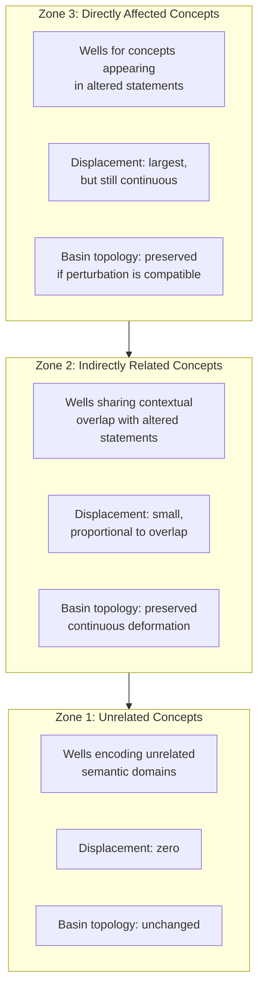
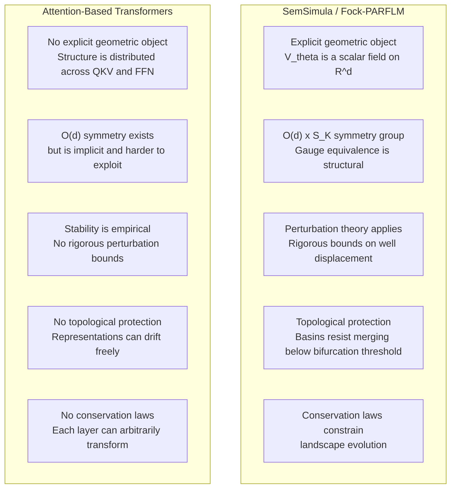

# Structural Stability of Learned Potentials in Semantic Simulation

**Technical Report — Companion Note for the SemSimula Mega-Paper**
**Date:** July 2026
**Status:** Working Draft

---

## Abstract

The SemSimula framework models token evolution via deterministic or
stochastic equations of motion over a learned scalar potential
$V\_\theta$.  A natural question arises: is the learned potential
landscape — and therefore the semantic structure it encodes — stable
under perturbations of the training data, random initialisation, or
model configuration?  This note develops the stability theory of
learned potentials in the SemSimula framework.  We show that for fixed
hidden dimension $d$, the learned potential is unique up to the
symmetry group $O(d) \rtimes S\_K$ (rotations of the hidden space
times permutations of wells), and that semantically compatible data
perturbations produce continuous deformations of the landscape that
preserve basin topology.  We contrast this structural guarantee with the
empirical (but architecturally unguaranteed) representational stability
of attention-based transformers, and draw out the practical consequences
for potential harvesting, continuous learning, and domain adaptation.

---

## Table of Contents

1. [Introduction and Motivation](#1-introduction-and-motivation)
2. [The Symmetry Group of the Learned Potential](#2-the-symmetry-group-of-the-learned-potential)
3. [Same Model, Different Runs: Gauge Equivalence](#3-same-model-different-runs-gauge-equivalence)
4. [Perturbation Theory Under Data Shifts](#4-perturbation-theory-under-data-shifts)
5. [Three Zones of Impact](#5-three-zones-of-impact)
6. [Topological Protection of Basin Structure](#6-topological-protection-of-basin-structure)
7. [Cross-Configuration Stability (Different $d$)](#7-cross-configuration-stability-different-d)
8. [Comparison with Attention-Based Transformers](#8-comparison-with-attention-based-transformers)
9. [Consequences for Potential Harvesting](#9-consequences-for-potential-harvesting)
10. [Consequences for Continuous Learning](#10-consequences-for-continuous-learning)
11. [Summary](#11-summary)
12. [Related Notes](#12-related-notes)

---

## 1. Introduction and Motivation

The SemSimula framework defines token evolution through equations of
motion on the hidden-state space $\mathbb{R}^d$:

$$
\frac{dh}{dt} = v, \qquad \frac{dv}{dt} = -\nabla\_h V\_\theta(h) - \gamma v + \sigma \eta(t),
$$

where $V\_\theta$ is a learned scalar potential (a bounded mixture of
Gaussian wells), $\gamma$ is the damping coefficient, $\sigma$ satisfies
the fluctuation-dissipation relation (in the Langevin formulation), and
$\eta(t)$ is white noise.

The potential $V\_\theta$ is the central learned object in the
framework.  It defines:

- **Attractor basins** — regions of semantic space where tokens
  settle (word meanings, syntactic categories, discourse roles).
- **Barrier heights** — energy costs for transitioning between
  semantic categories.
- **Well curvatures** — the precision with which semantic distinctions
  are made within a category.
- **Basin topology** — the connectivity graph of semantic regions.

A fundamental question for the entire programme — from potential
harvesting (`Portable_Learned_Potentials_and_Transplant_Map.md`) to
continuous learning
(`Continuous_Learning_in_Semantic_Simulation-based_models_vs_with_Transformer_models.md`)
to domain adaptation — is whether this landscape is **structurally
stable**: does the same variational problem, solved under different
conditions, produce the same landscape?

---

## 2. The Symmetry Group of the Learned Potential

### 2.1 The full symmetry group

The model's input-output map (input tokens $\to$ output logits) is
invariant under a symmetry group $\mathcal{G}$ that acts on the hidden
space $\mathbb{R}^d$ without changing the model's predictions.

**Rotation symmetry $O(d)$.**  If $R \in O(d)$ is an orthogonal
transformation, then applying $h \to Rh$ to all hidden states and
simultaneously transforming all parameters that touch $h$ — embeddings
$E$, projection $P$, well centres $\mu\_k$, context projections, Fock
gate weights — leaves the logit vector $z = P h$ unchanged (since
$P \to P R^{-1}$ and $h \to Rh$ give $z = P R^{-1} R h = Ph$).  The
potential transforms as:

$$
V\_\theta(h) \to V\_\theta(R^{-1} h).
$$

Same landscape, different coordinate system.

**Well permutation symmetry $S\_K$.**  The Gaussian mixture

$$
V\_\theta(h) = -\sum\_{k=1}^{K} w\_k \exp\left(-\frac{\lVert h - \mu\_k \rVert^2}{2\sigma\_k^2}\right)
$$

is invariant under any permutation $\pi \in S\_K$ of the well indices:
relabelling $(w\_k, \mu\_k, \sigma\_k) \to (w\_{\pi(k)}, \mu\_{\pi(k)}, \sigma\_{\pi(k)})$ produces the same
function.

**The full group** is therefore the semidirect product:

$$
\mathcal{G} = O(d) \rtimes S\_K.
$$

### 2.2 Spontaneous symmetry breaking

The random initialisation of model parameters at the start of training
**breaks** the $O(d)$ symmetry by selecting a specific coordinate
frame.  One run might encode "tense" along dimension 47 and "animacy"
along dimension 203; another run encodes them along dimensions 312 and
89.  This is spontaneous symmetry breaking in the standard physics
sense: the equations are symmetric, but each solution is not.

The $S\_K$ symmetry is similarly broken by the initialisation of well
parameters: different runs assign different index labels to what are
functionally the same semantic basins.

---

## 3. Same Model, Different Runs: Gauge Equivalence

### 3.1 The claim

For fixed architecture ($d$, $L$, $M$, potential form, integrator) and
fixed data $\mathcal{D}$, two converged training runs produce
potentials $V\_{\theta\_1}$ and $V\_{\theta\_2}$ that are related by a
gauge transformation $g \in \mathcal{G}$:

$$
V\_{\theta\_2}(h) \approx V\_{\theta\_1}(g \cdot h),
\qquad g \in O(d) \rtimes S\_K.
$$

### 3.2 Why this holds

Both runs solve the same variational problem: minimise
$\mathcal{L}[\theta] = \mathbb{E}\_{x \sim \mathcal{D}}[-\log p\_\theta(x)]$
subject to the same dynamical constraints.  The loss is invariant under
$\mathcal{G}$ (since logits are invariant), so the set of optimal
$\theta^{\ast}$ forms an orbit under $\mathcal{G}$.  Different runs
sample different points on this orbit — different coordinate frames —
but the underlying geometric object (the potential landscape) is the
same.

### 3.3 Geometric invariants

The following quantities are invariant under $\mathcal{G}$ and
therefore identical across runs:

- **Inter-well distances**: $d\_{ij} = \lVert \mu\_i - \mu\_j \rVert$
- **Well depths**: $w\_k$ (after permutation alignment)
- **Well curvatures**: $1/\sigma\_k^2$
- **Barrier heights**: $\Delta V\_{ij} = V\_\theta(h^{\ast}\_{ij}) - V\_\theta(\mu\_i)$
  where $h^{\ast}\_{ij}$ is the saddle point between wells $i$ and $j$
- **Basin volumes**: $\text{Vol}(\mathcal{B}\_k) = \int\_{\mathcal{B}\_k} dh$
- **Boltzmann occupation probabilities**:
  $p\_k \propto \exp(-\beta V\_\theta(\mu\_k)) \cdot \text{Vol}(\mathcal{B}\_k)$

These invariants are the **physical content** of the learned potential —
they encode the semantic structure of the training data.

### 3.4 Frame alignment

Given two runs, the aligning transformation $g = (R, \pi)$ can be
recovered by:

1. **Procrustes alignment** of the embedding matrices:
   find $R^{\ast} = \arg\min\_{R \in O(d)} \lVert E\_2 - E\_1 R \rVert\_F$.
2. **Hungarian matching** of well centres: find the permutation
   $\pi^{\ast}$ that minimises $\sum\_k \lVert R^{\ast} \mu\_k^{(1)} - \mu\_{\pi(k)}^{(2)} \rVert^2$.

After alignment, the potentials should satisfy
$V\_{\theta\_2}(h) \approx V\_{\theta\_1}(R^{\ast -1} h)$ to within
training noise.

### 3.5 Caveats

The gauge equivalence claim assumes:

1. **Convergence**: both runs have converged to a neighbourhood of the
   global optimum (or the same basin in a multi-basin landscape).
2. **Unique basin**: the loss landscape has a single dominant basin (up
   to $\mathcal{G}$).  If multiple genuinely distinct local minima exist
   (not related by symmetry), different runs may find structurally
   different solutions.
3. **Sufficient capacity**: the model is large enough that the
   variational problem is not severely under-determined.

In practice, for well-trained models on large corpora, these conditions
appear to be satisfied — but this is an empirical observation supported
by representation similarity studies (CKA, Procrustes alignment), not
a formal theorem.

---

## 4. Perturbation Theory Under Data Shifts

### 4.1 Setup

Consider two datasets $\mathcal{D}$ and $\mathcal{D}'$ that differ by
a small, semantically compatible perturbation — some statements
rephrased, augmented, or substituted without contradiction.  The
learned potentials $V\_\theta^{\ast}(\mathcal{D})$ and
$V\_\theta^{\ast}(\mathcal{D}')$ are solutions to variational problems
that differ by the perturbation:

$$
\delta \mathcal{L} = \mathcal{L}[\theta; \mathcal{D}'] - \mathcal{L}[\theta; \mathcal{D}] = \mathbb{E}\_{x \sim \mathcal{D}'}[-\log p\_\theta(x)] - \mathbb{E}\_{x \sim \mathcal{D}}[-\log p\_\theta(x)].
$$

### 4.2 First-order response

By standard perturbation theory on the optimality conditions
($\nabla\_\theta \mathcal{L} = 0$), the shift in the optimal parameters
is:

$$
\delta \theta^{\ast} \approx -H^{-1} \nabla\_\theta (\delta \mathcal{L}),
$$

where $H = \nabla\_\theta^2 \mathcal{L}$ is the Hessian of the loss at
the optimum.  The magnitude of the shift is controlled by:

1. **The norm of the gradient perturbation**
   $\lVert \nabla\_\theta(\delta \mathcal{L}) \rVert$ — small when the
   distributional shift is small.
2. **The conditioning of the Hessian** $\kappa(H)$ — determines how
   sensitive the optimum is to perturbations.  Well-regularised models
   with bounded potentials have well-conditioned Hessians.

### 4.3 Sparsity of the gradient perturbation

The gradient $\nabla\_\theta(\delta \mathcal{L})$ has a specific
structure: it is non-zero only for parameters that are **causally
connected** to the altered statements.  In the Fock-PARFLM architecture:

- **Well centres $\mu\_k$**: only wells whose basins contain hidden
  states influenced by the altered tokens receive a non-zero gradient
  perturbation.
- **Well depths $w\_k$**: similarly, only wells visited by trajectories
  that pass through the altered contexts are perturbed.
- **Embedding rows $E\_i$**: only rows corresponding to tokens that
  appear in the altered statements are affected.
- **Fock gates**: only gates activated by the altered token contexts
  are perturbed.

This sparsity is the key to stability: most of the potential landscape
is **not touched** by the gradient perturbation, and therefore does not
shift.

### 4.4 Bound on well-centre displacement

For a Gaussian well $k$ with centre $\mu\_k$, the first-order
displacement under a data perturbation is:

$$
\delta \mu\_k \approx -\left(\frac{\partial^2 \mathcal{L}}{\partial \mu\_k^2}\right)^{-1} \frac{\partial (\delta \mathcal{L})}{\partial \mu\_k}.
$$

The Hessian block $\partial^2 \mathcal{L} / \partial \mu\_k^2$ is
dominated by the curvature of the well (the second derivative of the
Gaussian), which is $\sim w\_k / \sigma\_k^2$.  The gradient perturbation
$\partial(\delta \mathcal{L}) / \partial \mu\_k$ is proportional to the
fraction of training tokens that are (a) altered and (b) route through
well $k$.

For a dataset with $N$ total tokens and $\delta N$ altered tokens, and
a well $k$ that captures a fraction $f\_k$ of all tokens:

$$
\lVert \delta \mu\_k \rVert \lesssim \frac{\sigma\_k^2}{w\_k} \cdot \frac{\delta N \cdot f\_k}{N} \cdot G,
$$

where $G$ is a typical gradient scale.  For small perturbations
($\delta N / N \ll 1$), the displacement is proportionally small.

---

## 5. Three Zones of Impact

A semantically compatible data perturbation creates three concentric
zones of impact in the potential landscape:

### 5.1 Zone 1 — Unrelated concepts

Wells encoding semantic domains with no contextual connection to the
altered statements receive $\delta \mu\_k \approx 0$.  Their depths,
curvatures, and inter-well barriers are unchanged.  These structures
remain in the same positions up to the global frame rotation $R$.

**Example**: if cooking-related statements are altered, wells encoding
astronomical concepts (star classifications, orbital mechanics
terminology) are unaffected.

### 5.2 Zone 2 — Indirectly related concepts

Concepts sharing contextual overlap with the altered statements receive
small, non-zero displacements.  The wells shift continuously — a smooth
deformation of the landscape that preserves basin topology.

**Example**: altering cooking statements may slightly shift wells for
"food" or "nutrition" concepts (which co-occur with cooking in some
contexts), but the basins remain intact with the same neighbours and
barrier structure.

### 5.3 Zone 3 — Directly affected concepts

Concepts appearing in the altered statements receive the largest
displacements.  However, if the alterations are semantically compatible
(non-contradicting), the shifts are continuous deformations: wells move
but do not vanish, merge, or undergo bifurcation.

**Example**: rephrasing a cooking instruction changes the embedding
context for the tokens involved, shifting the corresponding wells
slightly, but the basin capturing "cooking" semantics remains a basin
with the same topological connectivity to related concepts.

### 5.4 The physics analogy

This three-zone structure is directly analogous to **gravitational
perturbation theory** in celestial mechanics:

- Slightly perturbing the mass distribution in a stellar system leaves
  distant orbits unaffected (Zone 1).
- Nearby orbits deform smoothly by an amount proportional to the
  gravitational coupling (Zone 2).
- Orbits passing through the perturbed region change appreciably but
  remain bound as long as the perturbation does not change the
  potential's topology — no new stable/unstable equilibria appear
  (Zone 3).

The KAM theorem (Kolmogorov-Arnold-Moser) formalises this for
Hamiltonian systems: sufficiently small perturbations of an integrable
Hamiltonian preserve most invariant tori (quasi-periodic orbits).  The
analogue here is that sufficiently small data perturbations preserve
most attractor basins of the learned potential.

---

## 6. Topological Protection of Basin Structure

### 6.1 Structural stability

A dynamical system is **structurally stable** if small perturbations of
the vector field produce a topologically conjugate system — the same
qualitative dynamics (same number and type of fixed points, same basin
connectivity).

For the gradient flow $\dot{h} = -\nabla V\_\theta(h)$ (the overdamped
limit of the full dynamics), structural stability requires that all
fixed points are **hyperbolic** — i.e. the Hessian $\nabla^2 V\_\theta$
at each fixed point has no zero eigenvalues.

For the Gaussian well potential, the minima (well centres $\mu\_k$) are
hyperbolic with all-negative eigenvalues (attractors), and the saddle
points between wells are hyperbolic with mixed-sign eigenvalues.  Small
perturbations shift these fixed points but cannot change their type
(attractor $\to$ saddle or vice versa) without passing through a
**bifurcation** — a zero eigenvalue.

### 6.2 Bifurcation threshold

A bifurcation (topological change) requires the perturbation to be
large enough to drive a Hessian eigenvalue through zero.  For two
adjacent wells $i$ and $j$ separated by a barrier of height
$\Delta V\_{ij}$, the perturbation must satisfy:

$$
\lVert \delta V\_\theta \rVert \gtrsim \Delta V\_{ij}
$$

to merge the two basins.  For a well-trained potential with
well-separated semantic categories, $\Delta V\_{ij}$ is
$\mathcal{O}(1)$ in natural units, so the data perturbation would need
to be of order unity — i.e. a wholesale replacement of the training
data, not a small compatible modification.

### 6.3 Formal statement

**Proposition (Topological Stability).**
Let $V\_\theta^{\ast}(\mathcal{D})$ be the learned potential for
dataset $\mathcal{D}$, with $K$ non-degenerate minima and $J$
non-degenerate saddle points.  Let $\mathcal{D}'$ be a semantically
compatible perturbation with
$\lVert \delta \mathcal{L} \rVert \lt \min\_{ij} \Delta V\_{ij}$.
Then $V\_\theta^{\ast}(\mathcal{D}')$ has the same number $K$ of
minima and $J$ of saddle points, each within an
$\mathcal{O}(\lVert \delta \mathcal{L} \rVert)$ neighbourhood of the
corresponding fixed point of $V\_\theta^{\ast}(\mathcal{D})$.

This is a direct consequence of the implicit function theorem applied
to the criticality conditions $\nabla V\_\theta = 0$ at hyperbolic
fixed points.

---

## 7. Cross-Configuration Stability (Different $d$)

When the hidden dimension changes ($d\_{\text{small}} \to d\_{\text{large}}$),
the symmetry group changes and direct gauge equivalence no longer
holds.  Stability depends on the **intrinsic dimensionality**
$d\_{\text{int}}$ of the semantic manifold $\mathcal{M}$ that the model
learns to represent.

### 7.1 Three regimes

**Regime A: $d\_{\text{int}} \ll d\_{\text{small}} \lt d\_{\text{large}}$**
(both models have excess capacity).

Both models learn the same manifold $\mathcal{M}$, embedded in
different ambient spaces.  The embeddings are related by a linear map
$\Phi: \mathbb{R}^{d\_{\text{small}}} \hookrightarrow \mathbb{R}^{d\_{\text{large}}}$
(rotation + zero-padding), and the potentials satisfy:

$$
V^{(d\_{\text{large}})}(h) \approx V^{(d\_{\text{small}})}(\Pi h) + \frac{\epsilon}{2} \lVert h\_\perp \rVert^2,
$$

where $\Pi$ projects onto the $d\_{\text{small}}$-dimensional subspace
and $h\_\perp$ is the orthogonal complement.  Transplantation is clean.

**Regime B:
$d\_{\text{small}} \lt d\_{\text{int}} \lt d\_{\text{large}}$**
(smaller model is a bottleneck).

The smaller model learns a compressed projection — it folds or distorts
the manifold to fit.  The larger model captures additional structure.
The potentials are related by:

$$
V^{(d\_{\text{large}})}(h) \approx V^{(d\_{\text{small}})}(\Pi h) + \Delta V(h),
$$

where $\Delta V$ captures the additional semantic structure that
$d\_{\text{small}}$ could not represent.  Transplantation provides a
warm-start (correct basin topology in the shared subspace) but the
residual $\Delta V$ must be learned from scratch.

**Regime C:
$d\_{\text{small}} \lt d\_{\text{large}} \lt d\_{\text{int}}$**
(both models are bottlenecked).

Both models learn compressed projections that may capture different
aspects of $\mathcal{M}$.  Transplantation is less reliable — the
harvested potential captures some correct structure but may need
significant adaptation.

### 7.2 Identifying the regime

The current Fock-PARFLM experiments (d=384 projecting to final PPL
~85-95 vs d=768 projecting to PPL ~40-45) suggest we are in
**Regime B**: the d=384 model is capacity-limited and d=768 provides
genuine new representational capacity.  The PPL gap indicates that
additional dimensions are being used productively, not merely padded
with noise.

---

## 8. Comparison with Attention-Based Transformers

### 8.1 Empirical similarity

Attention-based transformers do show representational stability under
compatible data perturbations.  This is documented by:

- **CKA (Centered Kernel Alignment)** studies showing high similarity
  between representations learned by different runs of the same
  architecture.
- **Procrustes alignment** analyses confirming that representations are
  related by near-orthogonal transformations.
- **The Platonic Representation Hypothesis** (Huh et al. 2024)
  suggesting convergence of representations across architectures and
  modalities.

So the empirical observation is qualitatively similar to the
SemSimula case.

### 8.2 Mechanistic difference

The stability arises from fundamentally different mechanisms:

### 8.3 Where the difference matters

The architectural stability guarantees of SemSimula provide advantages
in three specific scenarios:

**Catastrophic forgetting under fine-tuning.**
When fine-tuning an attention transformer on new data, nothing prevents
the model from overwriting previously learned representations.  The
gradients from new data can freely modify any weight.  In Fock-PARFLM,
the well structure acts as an anchor: a well encoding a semantic
category has a basin of attraction that resists perturbation from
unrelated gradients.  The perturbation must exceed the barrier height
$\Delta V\_{ij}$ to destroy the basin.

**Context-dependent representation drift.**
In attention transformers, token representations are context-dependent
through the attention mechanism — the "position" of a concept in
representation space is a distribution, not a fixed point.  Under data
perturbation, this distribution can shift unpredictably because
attention patterns can reorganise.  In Fock-PARFLM, the wells are fixed
points of the potential landscape.  Context modifies the trajectory
through the landscape (via depth-conditioned routing and the $\xi$
context vector) but not the landscape itself.

**Absence of topological protection.**
Attention transformers have no notion of basin topology.  The
representation space is flat $\mathbb{R}^d$ with no intrinsic structure
beyond what the weights impose.  A small weight perturbation can, in
principle, merge two clusters or split one — there is no energy barrier
preventing it.  In Fock-PARFLM, merging two basins requires the barrier
height between them to go to zero, which requires a large, coordinated
change in the potential parameters.

### 8.4 Summary comparison

| Property | SemSimula / Fock-PARFLM | Attention Transformers |
|---|---|---|
| Stability mechanism | Structural (geometry of potential) | Empirical (implicit regularisation) |
| Symmetry group | Explicit: O(d) x S\_K | Implicit: O(d) (less exploitable) |
| Perturbation bounds | Rigorous (first-order response theory) | None (observed but not guaranteed) |
| Topological protection | Yes (bifurcation threshold) | No |
| Conservation laws | Yes (Hamiltonian / Langevin) | No |
| Catastrophic forgetting resistance | Architectural (barrier heights) | Requires external mitigation (EWC, LoRA) |
| Frame alignment for transplant | Clean (Procrustes + Hungarian) | Harder (no canonical geometric object) |

---

## 9. Consequences for Potential Harvesting

The stability results have direct implications for the transplant
framework documented in
`Portable_Learned_Potentials_and_Transplant_Map.md`.

### 9.1 Same $d$, same architecture, different runs

Gauge equivalence implies that harvested potentials are equivalent up
to frame alignment.  The transplant procedure reduces to:

1. **Procrustes alignment** of embedding matrices (find $R$).
2. **Hungarian matching** of well centres (find $\pi$).
3. **Direct insertion** of the transformed potential.

No retraining of $V\_\theta$ is needed.  This is the strongest form of
transplantation — **lossless transfer**.

### 9.2 Same $d$, different data (compatible)

The perturbation theory guarantees that the transplanted potential is
a good approximation to the target potential.  Zone 1 concepts are
exact; Zone 2 concepts require minor adaptation; Zone 3 concepts may
need some fine-tuning.

The transplant provides a **warm-start** that avoids the cold-start
penalty of random initialisation.  The fine-tuning adapts only the
$\delta \theta^{\ast}$ correction, which is much cheaper than training
from scratch.

### 9.3 Different $d$

In Regime B (the most likely scenario for scaling from d=384 to d=768),
the transplant provides correct basin topology in the shared subspace.
The procedure requires:

1. **Dimensional embedding**: pad the d=384 potential parameters with
   zeros in the new dimensions.
2. **Frame alignment**: align the shared subspace.
3. **Residual learning**: train the $\Delta V$ in the new dimensions
   from scratch.

The warm-start is partial but valuable — the model starts with the
right basin structure rather than random noise.

---

## 10. Consequences for Continuous Learning

The stability theory connects directly to the continuous learning
programme documented in
`Continuous_Learning_in_Semantic_Simulation-based_models_vs_with_Transformer_models.md`.

### 10.1 Non-interference guarantee

The three-zone analysis provides a **non-interference guarantee** for
continuous learning: incorporating new knowledge (Zone 3) through
well spawning or well modification does not disturb unrelated knowledge
(Zone 1) and only mildly perturbs indirectly related knowledge (Zone 2).

This is the fundamental property that elastic weight consolidation
(EWC) and other catastrophic forgetting mitigations attempt to achieve
externally in attention transformers.  In SemSimula, it is a structural
property of the potential landscape.

### 10.2 The topological stability bound

The bifurcation threshold provides a quantitative bound on how much new
knowledge can be incorporated before existing knowledge is disrupted:
the accumulated perturbation to any barrier height must remain below
$\Delta V\_{ij}$.  This translates the abstract "stability" guarantee
into a concrete engineering constraint on the well management policy.

---

## 11. Summary

The structural stability of learned potentials in SemSimula rests on
three pillars:

1. **Gauge equivalence**: for fixed $d$ and data, the learned potential
   is unique up to the symmetry group $O(d) \rtimes S\_K$.  Different
   runs learn the same geometric object in different coordinate frames.

2. **Perturbation continuity**: semantically compatible data
   perturbations produce continuous deformations of the landscape.  The
   three-zone impact structure ensures that unrelated concepts are
   unaffected, indirectly related concepts shift proportionally, and
   directly affected concepts deform but preserve basin topology.

3. **Topological protection**: the basin structure (number and type of
   fixed points, connectivity) is protected by the bifurcation
   threshold.  Destroying a basin requires a perturbation larger than
   the surrounding barrier heights — a large, coordinated change, not
   an incidental side effect of data augmentation.

These properties are **architectural guarantees** of the SemSimula
framework, following from the geometric nature of the learned potential
and the conservation laws of the dynamics.  They stand in contrast to
the empirically observed but architecturally unguaranteed
representational stability of attention-based transformers.

The practical consequences are direct:

- **Potential harvesting** across runs is lossless (same $d$) or
  provides a high-quality warm-start (different $d$).
- **Continuous learning** has built-in non-interference guarantees
  bounded by the bifurcation threshold.
- **Domain adaptation** preserves the topology of the base potential
  and only modifies the zones directly affected by the new domain.

---

## 12. Related Notes

**Potential harvesting and transplant.**
- `Portable_Learned_Potentials_and_Transplant_Map.md` — the transplant
  procedure, anti-pathology gates, and the five-flavour compatibility
  matrix.

**Continuous learning.**
- `Continuous_Learning_in_Semantic_Simulation-based_models_vs_with_Transformer_models.md`
  — well spawning, well management policy, and the MCS-preserving
  conjecture.

**Potential design.**
- `Structured_VTheta_Design_and_Theory.md` — the Gaussian well bank,
  multi-context and depth-conditioned forms.
- `STP_Loss_Is_An_Emergent_Property_Of_The_Energy_Landscape_Defined_By_Gaussian_Well_Potential.md`
  — energy landscape properties.

**Dynamics and integrators.**
- `Langevin_dynamics_reformulation_of_classical_damped_Lagrangian_flow.md`
  — the O-step Langevin formulation.
- `The_Overdamped_Limit_and_The_Position_of_The_2nd_Order_Lagrangian_Framework.md`
  — the overdamped limit.

**Conservativity and obstruction.**
- `Conservative_Obstruction_and_Virtual_Particle_Necessity.md` — the
  conservative constraint and the necessity of the Fock mechanism.
- `Fock_PARFLM_Conservativity_Diagnostic.md` — diagnostic tools for
  conservative dynamics.

**Training instabilities.**
- `Training_Instabilities_in_Fock-PARFLM_with_structured_V_theta.md`
  — instabilities arising from the potential structure and from
  embedding spikes (distinct from the stability theory here, which
  concerns the final converged landscape rather than the training path).

---

*Last updated: July 2026*
