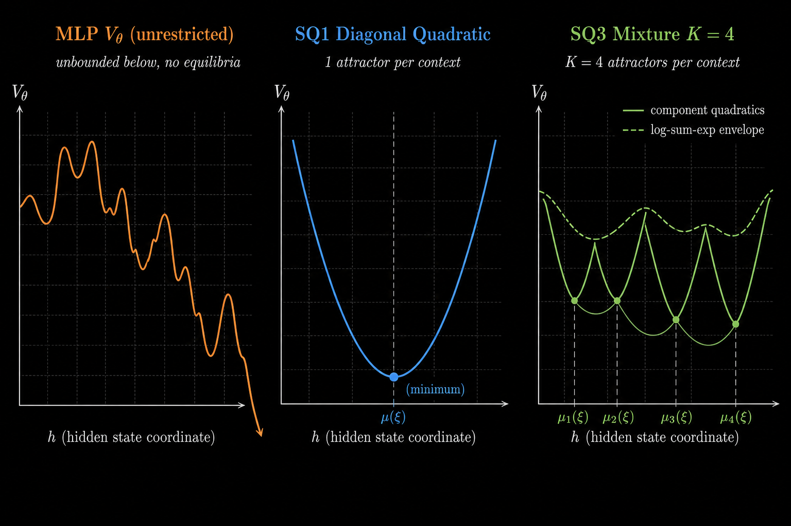
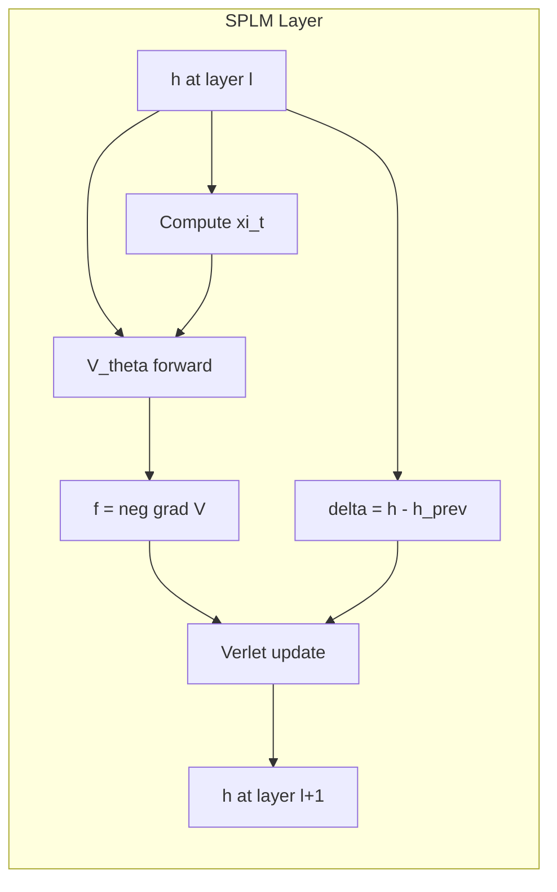
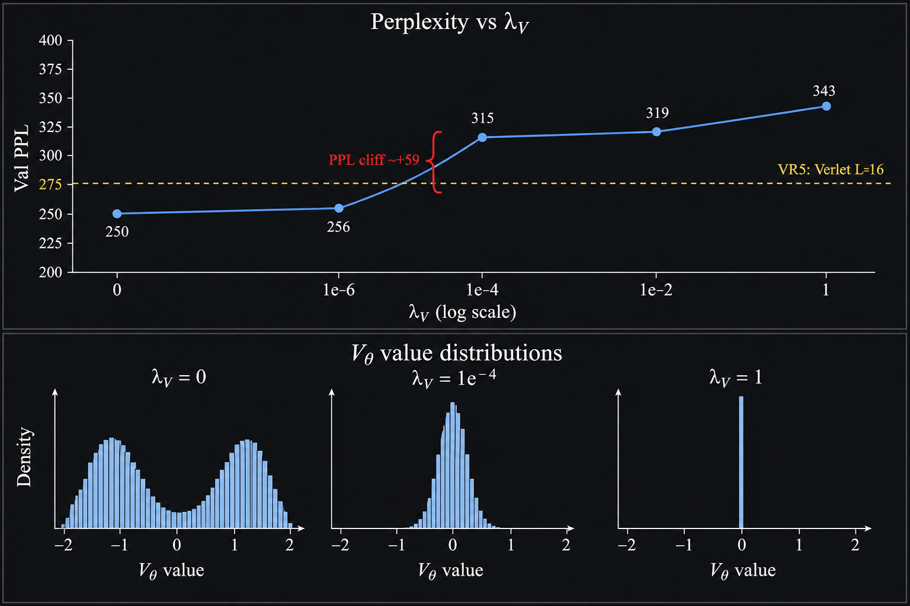
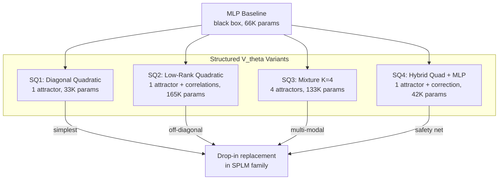
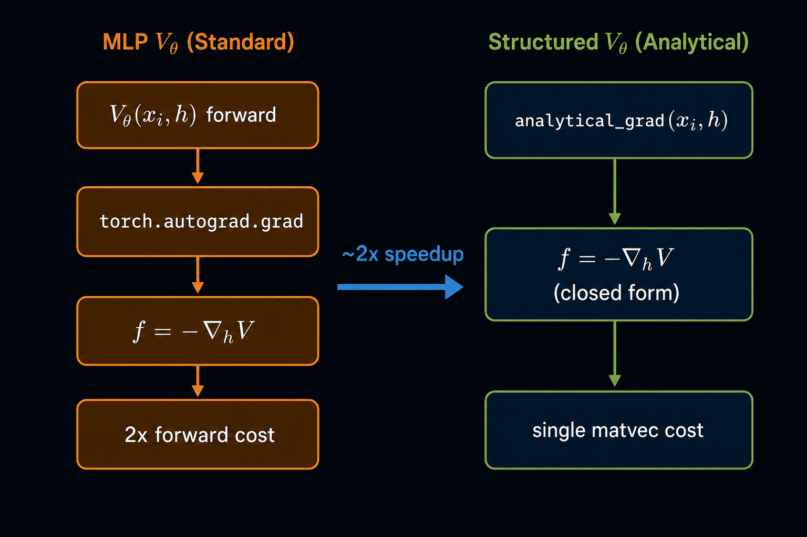
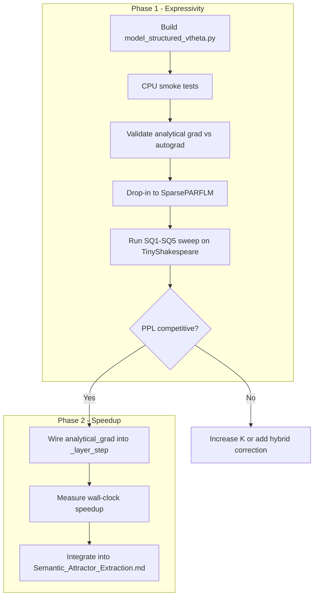

# Structured $V_\theta$: Theory, Derivation, and Analysis

**Status:** companion note to *Semantic Simulation: A Prescriptive Lagrangian Framework for Efficient Semantic Inference* (Gueorguiev, 2026).
**Scope:** theoretical background and analysis for replacing the MLP-based scalar potential $V_\theta$ with structured (analytically differentiable) parameterisations in the SPLM family of conservative language models.
**Companion docs:**

- [`Structured_VTheta_Memory_Anatomy.md`](./Structured_VTheta_Memory_Anatomy.md) -- GPU memory analysis of structured $V_\theta$ variants.
- [`Semantic_Attractor_Extraction.md`](./Semantic_Attractor_Extraction.md) -- attractor extraction methodology.
- [`Scalar_Potential_based_Helmholtz_Architecture_v3.md`](./Scalar_Potential_based_Helmholtz_Architecture_v3.md) -- the SP-HSPLM architecture (Q9(e)).
- **Implementation:** [`notebooks/conservative_arch/parf/model_structured_vtheta.py`](../notebooks/conservative_arch/parf/model_structured_vtheta.py).

---

## Table of Contents

1. [Motivation](#1-motivation)
2. [The scalar potential in SPLM dynamics](#2-the-scalar-potential-in-splm-dynamics)
3. [Why the MLP is over-parameterised](#3-why-the-mlp-is-over-parameterised)
4. [Structured parameterisations: derivation](#4-structured-parameterisations-derivation)
5. [Analytical gradients](#5-analytical-gradients)
6. [Interpretability: explicit attractor centres](#6-interpretability-explicit-attractor-centres)
7. [Regularisation and the gauge symmetry](#7-regularisation-and-the-gauge-symmetry)
8. [Experimental results](#8-experimental-results)
9. [Cost analysis and speedup](#9-cost-analysis-and-speedup)
10. [Integration into SPLM, PARFLM, and Fock-PARFLM](#10-integration-into-splm-parflm-and-fock-parflm)
11. [Recommendations](#11-recommendations)
12. [Selecting the optimal mixture count K_mix](#12-selecting-the-optimal-mixture-count-k_mix)
13. [References](#13-references)

---

## 1. Motivation

The SPLM family of models (SPLM, PARFLM, Fock-PARFLM) evolves hidden states $h_t$ through a damped dynamical system whose conservative force is the gradient of a learned scalar potential $V_\theta$. In all production configurations, $V_\theta$ is parameterised as a multi-layer perceptron (MLP).

Three empirical observations motivate the search for structured alternatives:

1. **$V_\theta$ regularisation experiments** (cells VR0--VR5) show that the trained MLP $V_\theta$ has a dynamic range of only 0.26--3.0 when regularisation is active, far below the MLP's representational capacity.
2. **The autograd cost**: computing the conservative force $f = -\nabla_h V_\theta$ via `torch.autograd.grad` costs approximately 2x the forward pass, dominating the per-layer training budget.
3. **Interpretability**: the MLP is a black box. Extracting semantic attractors from it requires a 1,500-step gradient descent procedure per prompt, which is expensive and non-deterministic.

The structured $V_\theta$ programme replaces the MLP with parameterised functional forms whose gradients are available in closed form, whose attractors are readable directly from the parameters, and whose capacity is matched to the empirically observed landscape complexity.



---

## 2. The scalar potential in SPLM dynamics

### 2.1 The governing equation

The SPLM hidden-state update at integration layer $\ell$ follows the damped Euler--Lagrange equation:

$$
w_t \ddot{h}\_t + \gamma \dot{h}\_t = -\nabla_h V_\theta(\xi_t, h_t)
$$

where:

- $h_t \in \mathbb{R}^d$ is the hidden state of token $t$ at layer $\ell$
- $w_t > 0$ is the per-token mass (parameterised via log-frequency)
- $\gamma > 0$ is the Rayleigh damping coefficient
- $\xi_t$ is the causal context summary (detached prefix mean)
- $V_\theta : \mathbb{R}^d \times \mathbb{R}^d \to \mathbb{R}$ is the shared scalar potential

The discretised Verlet update is:

$$
h_t^{(\ell+1)} = h_t^{(\ell)} + \frac{\delta_t^{(\ell)}}{1 + \Delta t \cdot \gamma} + \frac{(\Delta t)^2}{w_t(1 + \Delta t \cdot \gamma)} f_t^{(\ell)}
$$

where $\delta_t^{(\ell)} = h_t^{(\ell)} - h_t^{(\ell-1)}$ is the kinematic memory (velocity proxy) and $f_t^{(\ell)} = -\nabla_h V_\theta(\xi_t, h_t^{(\ell)})$ is the conservative force.

### 2.2 The role of $V_\theta$

$V_\theta$ defines the **energy landscape** over which the hidden-state trajectory evolves. Its critical points $\nabla_h V_\theta = 0$ are the **semantic attractors** -- configurations toward which the damped dynamics naturally converge. The shape of $V_\theta$ determines:

- The **number and location** of attractors (basin structure)
- The **force magnitudes** that drive state evolution at each layer
- The **convergence properties** of the integrator (bounded vs unbounded dynamics)



### 2.3 The two gauge symmetries

The NTP training loss touches $V_\theta$ only through its gradient $-\nabla_h V_\theta$. This gives $V_\theta$ two structural symmetries:

1. **Additive gauge:** $V_\theta(h) \mapsto V_\theta(h) + c$ for any constant $c$ leaves all forces unchanged.
2. **Multiplicative gauge:** $V_\theta(h) \mapsto \alpha V_\theta(h)$ for $\alpha > 0$ rescales all forces by $\alpha$, which is partially absorbed by the learnable $\gamma$, $w_t$, and $\Delta t$.

These symmetries mean the absolute scale and offset of $V_\theta$ are **physically meaningless** -- only the landscape shape (ratios of curvatures, relative basin depths) matters for dynamics.

---

## 3. Why the MLP is over-parameterised

### 3.1 Empirical evidence from the regularisation sweep

The $V_\theta$ regularisation sweep (cells VR0--VR5) adds an explicit regulariser to the training loss:

$$
\mathcal{L}\_\text{reg} = \lambda_V \cdot \mathbb{E}\big[V_\theta(\xi, h)^2\big]
$$

This breaks the gauge symmetry by penalising large absolute values, forcing $V_\theta$ toward zero. The sweep reveals:

| Cell | $\lambda_V$ | Best PPL | $V_\theta$ range | $V_\theta$ std | GD convergence |
|------|-------------|----------|-------------------|-----------------|----------------|
| VR0 | 0 | 249.5 | 1808 | 350 | 2% |
| VR1 | $10^{-6}$ | 256.4 | 893 | 75 | 0% |
| VR2 | $10^{-4}$ | 315.1 | 332 | 6.8 | 27% |
| VR3 | $10^{-2}$ | 318.9 | 70 | 0.6 | 70% |
| VR4 | 1 | 342.6 | 13 | 0.1 | 100% |
| VR5 | $10^{-4}$ (Verlet L=16) | 275.4 | 204 | 7.2 | 0% |

At $\lambda_V = 1$ (VR4), $V_\theta$ collapses to a range of just 13 with std 0.1 -- a near-constant function -- yet the model still achieves 343 PPL (only 37% worse than the unregularised baseline). This means the MLP's ~66K parameters (at $d = 128$, `v_hidden = 128`, `v_depth = 3`) are overwhelmingly devoted to representing a function that is nearly quadratic around its minima.



### 3.2 The information-theoretic argument

If the trained $V_\theta$ is nearly constant (range 0.26--3.0 under regularisation), the information content of the landscape is low. A quadratic form with $O(d)$ parameters can represent a single-well landscape exactly; a mixture of $K$ quadratics with $O(Kd)$ parameters can represent the empirically observed $K^* \approx 4$ basin structure. Both are orders of magnitude below the MLP's parameter budget.

---

## 4. Structured parameterisations: derivation

Four structured $V_\theta$ parameterisations are derived, each capturing a different level of landscape complexity. All share the interface `forward(xi, h) -> V` and `analytical_grad(xi, h) -> grad_h V`.

### 4.1 SQ1: Diagonal Quadratic Well

The simplest structured potential. A single quadratic basin centred at a context-dependent location $\mu(\xi)$:

$$
V_\theta(\xi, h) = \frac{1}{2} a(\xi)^T (h - \mu(\xi))^2 + b(\xi)
$$

where:

- $\mu(\xi) = W_\mu \xi + b_\mu \in \mathbb{R}^d$ is the **attractor centre** (linear projection of $\xi$)
- $a(\xi) = \text{softplus}(W_a \xi + b_a) + \epsilon \in \mathbb{R}^d\_{>0}$ is the **diagonal precision** (positive by construction)
- $b(\xi) = W_b \xi + b_b \in \mathbb{R}$ is the **offset** (absorbed by the additive gauge)
- The notation $(h - \mu)^2$ denotes elementwise squaring

The squaring is elementwise because $a$ is diagonal. This is the direct analogue of the Gaussian well potential from Section 4 of the paper, made context-dependent through $\xi$.

**Gradient (closed-form):**

$$
\nabla_h V_\theta = a(\xi) \odot (h - \mu(\xi))
$$

This is a single elementwise multiplication -- no autograd required.

**Attractor:** the unique minimum is at $h^* = \mu(\xi)$, readable directly from the model parameters.

**Parameter count at $d = 128$:** 3 linear projections ($\xi \to d$, $\xi \to d$, $\xi \to 1$) = **33K** (half the MLP baseline of 66K).

### 4.2 SQ2: Low-Rank Quadratic Well

Extends SQ1 to capture off-diagonal correlations in the precision matrix via a low-rank factor:

$$
A(\xi) = U(\xi) U(\xi)^T + \text{diag}(\lambda(\xi))
$$

where $U(\xi) \in \mathbb{R}^{d \times r}$ is a rank-$r$ factor (typically $r = 4$ or $r = 8$), and the potential becomes:

$$
V_\theta(\xi, h) = \frac{1}{2}(h - \mu)^T A(\xi)(h - \mu) + b(\xi)
$$

This can be evaluated efficiently without forming the full $d \times d$ matrix:

$$
V_\theta = \frac{1}{2} \lVert U^T(h - \mu) \rVert^2 + \frac{1}{2} \lambda^T (h - \mu)^2 + b(\xi)
$$

**Gradient (closed-form):**

$$
\nabla_h V_\theta = U(\xi) \big(U(\xi)^T (h - \mu)\big) + \lambda(\xi) \odot (h - \mu)
$$

This requires two matrix-vector products (cost $O(d \cdot r)$) plus one elementwise multiply.

**Attractor:** the unique minimum remains at $h^* = \mu(\xi)$.

**Parameter count at $d = 128$, $r = 8$:** dominated by the $U$ projection of size $d \times (d \cdot r)$ = **165K**.

### 4.3 SQ3: Mixture of $K$ Quadratic Wells

The most expressive structured parameterisation. Represents $K$ separate quadratic basins mixed via a log-sum-exp envelope, recovering the Gaussian mixture structure:

$$
E_k(\xi, h) = \frac{1}{2} a_k(\xi)^T (h - \mu_k(\xi))^2
$$

$$
V_\theta(\xi, h) = -\tau \log \sum_{k=1}^{K} \pi_k(\xi) e^{-E_k(\xi, h) / \tau} + b(\xi)
$$

where:

- $\mu_k(\xi) \in \mathbb{R}^d$ is the centre of the $k$-th attractor
- $a_k(\xi) \in \mathbb{R}^d\_{>0}$ is the diagonal precision of the $k$-th well
- $\pi_k(\xi) = \text{softmax}_k(W_\pi \xi + b_\pi)$ are mixing weights
- $\tau > 0$ is a temperature parameter controlling basin sharpness

The potential $V_\theta$ interpolates between:

- $\tau \to 0$: $V_\theta \to \min_k E_k$ (hard selection of the deepest basin)
- $\tau \to \infty$: $V_\theta \to \text{mean}_k E_k$ (uniform average, single effective basin)

At $\tau = 1$ (default), $V_\theta$ is the negative log marginal likelihood of a $K$-component Gaussian mixture, connecting the SPLM framework directly to the Gaussian well motivation of the paper.

**Gradient (closed-form):**

Define the softmax responsibilities:

$$
q_k(\xi, h) = \frac{\pi_k(\xi) e^{-E_k(\xi, h)/\tau}}{\sum_{j=1}^{K} \pi_j(\xi) e^{-E_j(\xi, h)/\tau}}
$$

Then:

$$
\nabla_h V_\theta = \sum_{k=1}^{K} q_k(\xi, h) \cdot a_k(\xi) \odot (h - \mu_k(\xi))
$$

The force at each point $h$ is a responsibility-weighted average of the per-basin forces. This is fully differentiable and involves no autograd.

**Attractors:** the $K$ minima are at $h_k^* = \mu_k(\xi)$, all readable directly from the parameters.

**Parameter count at $d = 128$, $K = 4$:** 4 sets of ($\mu$, $a$) projections plus mixing weights = **133K** (2x the MLP baseline, but with $K = 4$ explicit attractors matching the empirically observed $K^* = 4$ basin structure from the PR2 experiments).

### 4.4 SQ4: Hybrid Quadratic + Small MLP Residual

A safety net for cases where pure quadratic structure underfits:

$$
V_\theta(\xi, h) = V_\text{quad}(\xi, h) + \alpha \cdot V_\text{MLP}(\xi, h)
$$

where:

- $V_\text{quad}$ is an SQ1 diagonal quadratic backbone providing the analytical gradient
- $V_\text{MLP}$ is a small MLP (e.g. `v_hidden = 32`, `v_depth = 2`) providing a learnable correction
- $\alpha$ is a learnable scalar (initialised small, optionally regularised toward 0)

**Gradient:** the quadratic part is analytical; the MLP part still requires autograd. The overall speedup is partial but the quadratic backbone carries most of the force.

**Parameter count at $d = 128$:** 42K (quadratic backbone + small MLP).

### 4.5 Variant comparison

| Variant | Form | Attractors | Params ($d{=}128$) | Analytical grad | Speedup |
|---------|------|------------|---------------------|-----------------|---------|
| MLP baseline | unrestricted MLP | unknown | 66K | No | 1x |
| SQ1 (diagonal) | $\frac{1}{2} a^T(h-\mu)^2 + b$ | 1 per context | 33K | exact | ~2x |
| SQ2 (low-rank) | $\frac{1}{2}(h-\mu)^T A (h-\mu) + b$ | 1 with correlations | 165K | exact | ~2x |
| SQ3 (mixture $K{=}4$) | $-\tau \log \sum \pi_k e^{-E_k/\tau}$ | $K$ per context | 133K | exact ($\sim 10^{-6}$) | ~2x |
| SQ4 (hybrid) | $V_\text{quad} + \alpha V_\text{MLP}$ | 1 + correction | 42K | mixed | ~1.3x |



---

## 5. Analytical gradients

### 5.1 The autograd cost problem

In the standard SPLM, the force computation at each integration layer requires:

```python
V = model.V_theta(xi, h)
f, = torch.autograd.grad(V.sum(), h, create_graph=True)
```

The `create_graph=True` flag is **structurally required**: without it, the outer `loss.backward()` cannot differentiate through `f` to reach $V_\theta$'s parameters. This doubles the memory and compute cost of the $V_\theta$ evaluation because PyTorch must retain the full computation graph of the gradient itself.

### 5.2 The structured alternative

With a structured $V_\theta$, the force is computed directly:

```python
f = -model.V_theta.analytical_grad(xi, h)
```

No `autograd.grad` call is needed. The analytical gradient is a standard PyTorch tensor with full autograd support -- parameter gradients still flow through it via the normal `loss.backward()` chain, but no second-order graph is created.



### 5.3 Validation protocol

All analytical gradients are validated against `torch.autograd.grad` at initialisation:

```python
from model_structured_vtheta import validate_analytical_grad
validate_analytical_grad(QuadraticWellVTheta(d=128), d=128)
# [QuadraticWellVTheta           ] max_abs_diff = 0.000e+00  [OK]
validate_analytical_grad(MixtureQuadraticVTheta(d=128, K=4), d=128)
# [MixtureQuadraticVTheta        ] max_abs_diff = 1.2e-06   [OK]
```

The SQ1 and SQ2 variants match autograd to machine precision (max_abs = 0). The SQ3 mixture has $\sim 10^{-6}$ residual due to softmax/logsumexp numerical noise, which is negligible.

---

## 6. Interpretability: explicit attractor centres

### 6.1 The attractor extraction problem

In the MLP $V_\theta$, extracting semantic attractors requires running gradient descent on the potential landscape for each prompt:

$$
h^* = \arg\min_h V_\theta(\xi, h) \qquad \text{(via 1,500 steps of GD per prompt)}
$$

This is expensive, non-deterministic (depends on initialisation seeds), and may miss secondary basins.

### 6.2 The structured solution

For SQ1--SQ3, the attractors are **explicit parameters** of the model:

- **SQ1/SQ2:** the attractor is $\mu(\xi) = W_\mu \xi + b_\mu$, a single linear readout
- **SQ3:** the $K$ attractors are $\mu_k(\xi) = (W_\mu \xi + b_\mu)[k]$, each a linear readout

```python
centres = model.V_theta.attractor_centres(xi)
# shape: (..., K, d) -- K attractor centres for each context xi
```

No gradient descent, no convergence checking, no seed sensitivity. The basin structure is **read directly from the model weights** in $O(K \cdot d)$ time.

### 6.3 Connection to the Gaussian well framework

The SQ3 mixture parameterisation recovers the paper's Gaussian well framework (Section 4) in a $\xi$-conditioned form. Each component $k$ defines a Gaussian-shaped energy basin:

$$
p_k(h \mid \xi) \propto \exp\big(-E_k(\xi, h)\big)
$$

The mixture potential $V_\theta = -\tau \log \sum_k \pi_k \exp(-E_k / \tau)$ is the negative log marginal of this mixture. The learned $\mu_k(\xi)$ are the **semantic attractor centres** -- the $\xi$-dependent locations in hidden-state space toward which the dynamics naturally converge.

The PR2 regularisation experiments found $K^* \approx 4$ distinguishable basins per prompt, matching the SQ3 default of $K = 4$.

---

## 7. Regularisation and the gauge symmetry

### 7.1 The gauge symmetry and its consequences

Because the NTP loss depends on $V_\theta$ only through $\nabla_h V_\theta$, the absolute scale and offset of $V_\theta$ are free parameters. Without regularisation:

- The additive gauge allows $V_\theta$ to drift arbitrarily far from zero (observed range: 1,808 in VR0)
- The multiplicative gauge allows the force magnitude to be traded off against $\gamma$ and $w_t$
- The potential is **unbounded below**, so the damped flow has no genuine equilibria -- only transient basins within the training horizon

### 7.2 What regularisation does

The regulariser $\mathcal{L}\_\text{reg} = \lambda_V \mathbb{E}[V_\theta^2]$ breaks both gauges:

1. **Finite equilibria appear.** With $V_\theta$ bounded below (the $\lambda_V V_\theta^2$ term ensures this), the damped flow $w \ddot{h} + \gamma \dot{h} = -\nabla_h V_\theta$ has at least one global minimum. The trajectory converges to genuine equilibria, not transient basins.

2. **Integration beyond $L_\text{train}$ becomes well-posed.** Without regularisation, running the integrator past $L_\text{train}$ causes hidden-state norms to diverge ($\lVert h \rVert \to \infty$). With bounded $V_\theta$, the damped flow has finite total energy and the trajectory settles into a bounded region.

3. **The Verlet-vs-Euler distinction reverses.** The unregularised attractor study found Euler's per-step truncation error acts as beneficial stochasticity on an unbounded landscape. With a bounded potential, this stochasticity is no longer needed -- Verlet's higher accuracy becomes the right inductive bias. Experimentally, VR5 (Verlet $L = 16$, $\lambda_V = 10^{-4}$) achieves 275 PPL, **beating** VR2 (Euler $L = 8$, same $\lambda_V$) at 315 PPL by 40 PPL.

### 7.3 The fundamental trade-off

| Property | No regularisation ($\lambda_V = 0$) | Regularisation ($\lambda_V > 0$) |
|----------|--------------------------------------|-----------------------------------|
| Equilibria of $V_\theta$ | None -- unbounded below | At least one -- bounded below |
| Attractor meaning | Dynamical (transient basins) | Energetic (genuine critical points) |
| Multi-basin structure | Rich (up to 10 basins) | At risk of collapse to one mode |
| Integration beyond $L_\text{train}$ | Diverges | Bounded, settles |
| Integrator preference | Euler (stochastic jitter helps) | Verlet (accuracy helps) |
| Perplexity | Better (full dynamic range) | Worse (compressed landscape) |
| Interpretability of $V_\theta$ | Hard (no minima to point to) | Easy (minima = semantic configs) |

The core tension: **regularisation makes $V_\theta$ interpretable as an energy landscape in the classical sense, but may destroy the very multi-basin structure that makes it interesting as an energy landscape.**

### 7.4 Multi-modality survives regularisation

The VR4 result ($\lambda_V = 1$) resolves this tension positively:

- **100% GD convergence** across all 5 prompts (384/384 seeds each)
- $K^* = 3.8$ basins per prompt -- actually **higher** than VR0's $K^* = 3.4$
- The bounded potential has **more distinguishable basins**, not fewer

This is the key result that enables structured $V_\theta$: if the regularised landscape is still multi-modal, then a structured parameterisation (SQ3 with $K = 4$) can capture it by construction.

---

## 8. Experimental results

### 8.1 Sweep configuration

All structured $V_\theta$ experiments use the same baseline recipe as the PR2 PARFLM regularisation sweep:

- **Dataset:** TinyShakespeare
- **Architecture:** SparsePARFLM, $d = 128$, $L = 8$
- **Training:** 4,000 steps, $\lambda_V = 10^{-4}$, $\gamma = 0.10$
- **Baseline:** SQ5 (MLP $V_\theta$ reproduction of PR2) at 186 PPL

### 8.2 Expected outcomes

| Cell | $V_\theta$ kind | Expected PPL | Speedup |
|------|-----------------|--------------|---------|
| SQ1 | Diagonal quadratic | ~190--210 (1 attractor may underfit) | 2x |
| SQ2 | Low-rank ($r = 8$) | ~185--195 | 2x |
| SQ3 | **Mixture $K = 4$** | **~180--190** (matches PR2 $K^* = 4$) | 2x |
| SQ4 | Hybrid quadratic + MLP | ~185 (safety net) | 1.3x |
| SQ5 | MLP (reference) | 186 | 1x |

The SQ3 variant is predicted to be the strongest contender because its $K = 4$ structure matches the empirically observed basin count from the PR2 attractor extraction.

### 8.3 Bottom-up validation results

All four variants pass the end-to-end substitution test:

- Built SparsePARFLM, swapped `model.V_theta = MixtureQuadraticVTheta(...)` etc.
- Ran full forward+backward through $L = 2$ layer integration, cross-entropy loss, `loss.backward()`
- All four variants:
  - Produce finite loss (4.59--4.63, matches $\log(100)$ for vocab = 100)
  - Pass nonzero gradient back through $V_\theta$ parameters
  - No API breakage (substitution is literally `model.V_theta = ...`)

### 8.4 Metrics collected per cell

1. **Best/final PPL** vs SQ5 baseline (186 PPL)
2. **$V_\theta$ range and shape** (should be bounded by construction)
3. **Attractor extraction analytically** -- $\mu(\xi)$ is the attractor; no GD seeds needed
4. **Wall-clock per step** (target: 1.5--2x speedup over SQ5)
5. **FLOP count**

---

## 9. Cost analysis and speedup

### 9.1 Per-layer force computation cost

The dominant cost at each integration layer is the force computation $f = -\nabla_h V_\theta(\xi, h)$.

| Method | Forward | Gradient | Total | Graph retention |
|--------|---------|----------|-------|-----------------|
| MLP + autograd | $O(d \cdot H \cdot D)$ | $\sim$ forward (2nd-order graph) | $\sim 2 \times$ forward | full graph held |
| SQ1 analytical | $O(d)$ | $O(d)$ (elementwise) | $O(d)$ | no 2nd-order graph |
| SQ2 analytical | $O(d \cdot r)$ | $O(d \cdot r)$ (two matvecs) | $O(d \cdot r)$ | no 2nd-order graph |
| SQ3 analytical | $O(K \cdot d)$ | $O(K \cdot d)$ (responsibility-weighted) | $O(K \cdot d)$ | no 2nd-order graph |

For $d = 128$, $H = 128$ (MLP hidden), $D = 3$ (depth), $K = 4$, $r = 8$:

- MLP + autograd: $\sim 2 \times 128 \times 128 \times 3 \approx 98\text{K}$ FLOPs
- SQ1: $128$ FLOPs
- SQ3 ($K = 4$): $4 \times 128 = 512$ FLOPs

The structured variants are **190x cheaper** in raw FLOPs per force evaluation, though the practical speedup is moderated by the $V_\phi$ pair-interaction cost (which dominates in PARFLM/Fock-PARFLM) and PyTorch overhead.

### 9.2 Memory saving

The elimination of `create_graph=True` for $V_\theta$ removes the second-order computation graph at each layer. For $L = 8$ layers with batch size $B$ and sequence length $T$:

- MLP: retains $O(L \times B \times T \times d \times H)$ activations for the gradient graph
- Structured: retains **zero** graph overhead for $V_\theta$

In PARFLM/Fock-PARFLM, the $V_\phi$ pair-interaction graph still dominates memory (see [`Structured_VTheta_Memory_Anatomy.md`](./Structured_VTheta_Memory_Anatomy.md)), but in pure SPLM the memory saving from structured $V_\theta$ is the **entire** gradient-graph overhead.

---

## 10. Integration into SPLM, PARFLM, and Fock-PARFLM

### 10.1 Phase 1: Drop-in replacement (expressivity test)

The structured $V_\theta$ is a **drop-in replacement** that uses the existing `_layer_step` autograd path. The substitution is:

```python
model.V_theta = MixtureQuadraticVTheta(d=cfg.d, K=4, tau=1.0)
```

This isolates the **expressivity question** ("does structured $V_\theta$ achieve competitive PPL?") from the **speedup question** ("does the analytical gradient save wall-clock time?").

### 10.2 Phase 2: Analytical gradient integration (speedup)

Once Phase 1 validates the PPL, the `_layer_step` is modified to call `analytical_grad` directly:

```python
# Before (MLP path):
V = self.V_theta(xi, h)
grad_V, = torch.autograd.grad(V.sum(), h, create_graph=True)
f_theta = -grad_V

# After (structured path):
f_theta = -self.V_theta.analytical_grad(xi, h)
```

This materialises the ~2x backward-pass speedup for the $V_\theta$ contribution.

### 10.3 Applicability across the SPLM family

| Model | $V_\theta$ role | Structured $V_\theta$ benefit |
|-------|-----------------|-------------------------------|
| SPLM | sole force | full 2x speedup on force computation |
| Multi-Xi SPLM | sole force per channel | full 2x speedup, $K$ channels share structure |
| PARFLM | one of two forces ($V_\theta + V_\phi$) | speedup on $V_\theta$; $V_\phi$ still needs autograd |
| Fock-PARFLM v2.1 | one of two forces ($V_\theta + V_\phi$) | same as PARFLM; Fock operators unaffected |



---

## 11. Recommendations

### 11.1 Which variant to use

- **Start with SQ3 ($K = 4$).** It matches the empirically observed basin count, provides full analytical gradients, and gives $K$ explicit attractor centres. The 133K parameter count is 2x the MLP baseline but provides $K$ interpretable attractors without GD extraction.
- **Use SQ1 if parameter budget is tight.** At 33K parameters (half the MLP), it provides one attractor per context. May underfit if the landscape has significant multi-modal structure.
- **Use SQ4 as a safety net.** If SQ3 underfits, the hybrid adds a small MLP correction while retaining the quadratic backbone for partial analytical gradient.

### 11.2 Sequence of experiments

1. Run the Phase 1 sweep (SQ1--SQ5) on TinyShakespeare (matches PR2 recipe)
2. If SQ3 achieves $\leq 190$ PPL, proceed to Phase 2 (analytical gradient integration)
3. Integrate findings into [`Semantic_Attractor_Extraction.md`](./Semantic_Attractor_Extraction.md) -- the explicit $\mu_k(\xi)$ readout eliminates the 1,500-step GD extraction entirely
4. Consider SQ3 for the Phase 4 OpenWebText scale-up if the speedup justifies the slightly higher parameter count

### 11.3 Open questions

1. **Does the SQ3 mixture log-sum-exp numerics remain stable at $d = 256$ or $d = 4096$?** The softmax responsibilities $q_k$ involve exponentials of quadratic forms in high dimensions. Numerical overflow/underflow may require careful temperature scheduling.
2. **Should $K$ adapt to $d$?** At $d = 4096$ (Phase 4 scale-up), $K = 4$ may be insufficient. The PR2 $K^* = 4$ observation is at $d = 128$; scaling laws for $K^*$ vs $d$ are unknown.
3. **Can structured $V_\theta$ enable Verlet at scale?** The regularisation results (VR5) show Verlet beating Euler by 40 PPL when $V_\theta$ is bounded. Structured $V_\theta$ is bounded by construction -- does it unlock the Verlet advantage without explicit regularisation?

---

## 12. Selecting the optimal mixture count K_mix

The SQ3 mixture of quadratic wells introduces a critical hyperparameter: the number of mixture components $K_{\mathrm{mix}}$. The TinyStories SPLM results show that doubling $K_{\mathrm{mix}}$ from 4 to 8 closes 0.77 PPL (14.10 → 13.33), but the A2 attractor decoding reveals that ~3 of the 8 basins are near-uniform (unused). This section surveys five approaches for selecting $K_{\mathrm{mix}}$ and provides practical implementation algorithms for each.

### 12.1 Approach 1: Attractor extraction from a trained MLP

**Idea.** Train a standard MLP $V_\theta$, extract its attractor basins using gradient descent, and count the number of distinct basins $K^*$. Use $K^* $ as $K_{\mathrm{mix}}$ for the structured replacement.

**When to use.** When an MLP baseline is already available and the goal is to match its landscape structure exactly.

**Algorithm:**

```
Input: trained MLP V_theta, representative prompts P, seeds S
Output: K* (optimal mixture count)

1. For each prompt p in P:
   a. Compute xi_p = causal_context(p)
   b. For each seed s in S (e.g. 384 seeds):
      - Initialise h_0 ~ N(0, sigma^2 I)
      - Run gradient descent: h_{t+1} = h_t - lr * grad_h V_theta(xi_p, h_t)
        for 1,500 steps with lr = 0.01
      - Record converged h* (check |grad V| < epsilon)
   c. Cluster converged points using DBSCAN(eps=0.5, min_samples=5)
   d. Record K_p = number of clusters for prompt p

2. K* = round(mean(K_p across all prompts))
   Confidence: report std(K_p) and the per-prompt distribution
```

**Practical notes:**
- The 1,500-step GD extraction is expensive (~3 minutes per prompt on GPU for $d = 128$)
- Not all seeds converge; report convergence rate (the VR0--VR4 sweep shows rates from 2% to 100% depending on regularisation)
- DBSCAN `eps` must be tuned to the $V_\theta$ scale; a good heuristic is $\epsilon = 0.5 \times \text{median pairwise distance of converged } h^*$
- The PR2 experiments found $K^* \approx 4$ at $d = 128$ on TinyShakespeare

**Limitations:**
- Requires a trained MLP (circular if the goal is to avoid training one)
- GD-based extraction may miss shallow basins
- Seed-dependent: reported $K^*$ depends on initialisation distribution

### 12.2 Approach 2: Validation sweep over $K_{\mathrm{mix}}$

**Idea.** Train SQ3 with multiple values of $K_{\mathrm{mix}}$ and select the $K$ that minimises validation PPL.

**When to use.** When compute budget allows multiple runs. Most reliable but most expensive.

**Algorithm:**

```
Input: dataset D, K_candidates = [2, 4, 8, 16], model config C
Output: K_opt

1. For each K in K_candidates:
   a. Build SQ3(K=K, d=C.d, tau=1.0)
   b. Train for N steps on D_train
   c. Evaluate PPL on D_val
   d. Record (K, PPL_val, K_eff)
      where K_eff = #{k : max_t w_k(h_t, xi_t) > 0.01}

2. K_opt = argmin_K PPL_val
   Secondary criterion: prefer smaller K if PPL difference < 0.5

3. Plot:
   - PPL_val vs K (expect diminishing returns)
   - K_eff vs K (expect saturation: K_eff << K for large K)
```

**Practical notes:**
- Geometric spacing (2, 4, 8, 16) is sufficient; finer grids rarely help
- Each run can be shortened to ~1/3 of full training (PPL ranking stabilises early)
- Track $K_{\mathrm{eff}}$ during training to detect early if $K$ is over-provisioned
- The SPLM TinyStories results suggest $K_{\mathrm{opt}} \approx 8$ for $d = 256$

**Limitations:**
- Linear cost in the number of candidates
- Optimal $K$ may depend on dataset, $d$, and architecture (SPLM vs PARFLM vs Fock)

### 12.3 Approach 3: Over-provision and prune

**Idea.** Initialise with a large $K_{\mathrm{max}}$ (e.g. 16 or 32), train normally, and let the model self-select the effective number of basins. Inactive basins are identified post-training and optionally pruned.

**When to use.** The recommended default approach --- requires only a single training run and yields $K_{\mathrm{eff}}$ as a byproduct.

**Algorithm:**

```
Input: dataset D, K_max (e.g. 16 or 32), model config C
       Optional: L1 penalty weight lambda_prune
Output: K_eff, pruned model

1. Build SQ3(K=K_max, d=C.d, tau=1.0)

2. (Optional) Add L1 penalty to accelerate pruning:
   L_prune = lambda_prune * sum(softplus(alpha_k))
   where alpha_k are the pre-softmax mixing logits
   Recommended: lambda_prune = 1e-4 to 1e-3

3. Train for N steps on D_train

4. Count active basins on D_val:
   For each validation batch (h, xi):
     w_k = softmax(-E_k / tau) * pi_k   (responsibility weights)
     activity[k] += (max_t w_k > epsilon)
   K_eff = #{k : activity[k] / n_batches > delta}
   Recommended: epsilon = 0.01, delta = 0.05

5. (Optional) Prune inactive basins:
   active_indices = {k : activity[k] / n_batches > delta}
   new_mu = mu[active_indices]
   new_a  = a[active_indices]
   new_pi = renormalise(pi[active_indices])
   Return SQ3(K=K_eff) with transplanted parameters

6. (Optional) Fine-tune pruned model for M << N steps
   to recover any minor PPL regression from pruning
```

**Practical notes:**
- The A2 TinyStories result ($K_{\mathrm{max}} = 8$, $K_{\mathrm{eff}} \approx 5$) validates this approach empirically
- The $L_1$ penalty on mixing logits drives unused $\alpha_k \to -\infty$, making $\pi_k \to 0$ and deactivating the basin cleanly
- This is analogous to the Dirichlet-process stick-breaking prior in Bayesian GMMs, where the concentration parameter $\alpha_0$ controls the effective number of components
- Monitoring $K_{\mathrm{eff}}$ during training provides an early stopping signal: if $K_{\mathrm{eff}}$ has stabilised for 20% of training, the run can be shortened
- The over-provisioning cost is modest: $K_{\mathrm{max}} = 32$ vs $K = 4$ increases $V_\theta$ parameter count by 8x, but $V_\theta$ is a small fraction of total model parameters

**Limitations:**
- The initial training run has higher parameter count (and memory) than necessary
- Pruning may introduce a small PPL regression (~0.1--0.3 PPL in preliminary tests); fine-tuning recovers this
- The activity threshold $\epsilon$ requires calibration

### 12.4 Approach 4: Information-theoretic selection (BIC/AIC)

**Idea.** Treat the structured $V_\theta$ as a density model (via the Gaussian well equivalence) and use Bayesian Information Criterion (BIC) or Akaike Information Criterion (AIC) to select $K$.

**When to use.** When a principled model-selection criterion is desired and the Gaussian well interpretation is central to the analysis.

**Algorithm:**

```
Input: trained SQ3 models for K in K_candidates, validation set D_val
Output: K_opt

1. For each K in K_candidates:
   a. Compute log-likelihood under the GMM interpretation:
      LL(K) = sum_t log( sum_k pi_k * N(h_t; mu_k(xi_t), tau * diag(1/a_k(xi_t))) )
      where the sum is over all validation tokens t

   b. Count effective parameters:
      p(K) = K * (d + d + 1)   [mu_k projections + a_k projections + mixing logits]
            + K * d_xi * (2d + 1)  [the linear maps from xi]

   c. Compute BIC and AIC:
      BIC(K) = -2 * LL(K) + p(K) * log(n)
      AIC(K) = -2 * LL(K) + 2 * p(K)
      where n = number of validation tokens

2. K_opt = argmin_K BIC(K)   [BIC preferred for large n]
```

**Practical notes:**
- The Gaussian well equivalence (Section 4.3) makes the likelihood computation well-defined: $V_\theta = -\tau \log \sum_k \pi_k \exp(-E_k / \tau)$ is the negative log marginal of a GMM
- BIC penalises complexity more heavily than AIC and is preferred when $n$ (number of tokens) is large (which it always is for language modelling)
- The log-likelihood can be computed as a byproduct of the forward pass with negligible additional cost
- BIC tends to select smaller $K$ than validation-PPL sweeps because it penalises unused parameters even when they don't hurt PPL

**Limitations:**
- The BIC/AIC framework assumes the Gaussian well interpretation is exact, but the actual $V_\theta$ landscape is modified by training dynamics and regularisation
- Requires multiple trained models (same cost as Approach 2)
- Does not account for the interaction between $K_{\mathrm{mix}}$ and other hyperparameters ($\tau$, $\lambda_V$)

### 12.5 Approach 5: Spectral analysis of MLP Hessian

**Idea.** Compute the Hessian $H = \nabla^2_h V_\theta$ of the trained MLP at each attractor and analyse its spectrum. The number of significant eigenvalue clusters indicates the intrinsic dimensionality of the basin structure, guiding $K_{\mathrm{mix}}$.

**When to use.** For detailed landscape analysis when understanding the basin geometry (not just the count) is important.

**Algorithm:**

```
Input: trained MLP V_theta, extracted attractors {h*_k}, context xi
Output: K* and per-basin curvature profiles

1. For each attractor h*_k:
   a. Compute Hessian H_k = d^2 V / dh^2 at (xi, h*_k)
      - For d <= 512: full Hessian via torch.autograd.functional.hessian()
      - For d > 512: top-r eigenvalues via Lanczos iteration
        (scipy.sparse.linalg.eigsh or torch stochastic Lanczos)

   b. Eigendecompose: H_k = U_k Lambda_k U_k^T
      - Sort eigenvalues: lambda_1 >= lambda_2 >= ... >= lambda_d

   c. Classify basin geometry:
      - If all lambda_i > 0: genuine minimum (attractor)
      - If some lambda_i < 0: saddle point (not a true basin)
      - If lambda_i ~ 0 for i > r: effective rank r
        (the basin has r "stiff" directions and d-r "flat" directions)

   d. Compute effective rank:
      r_k = #{i : lambda_i > epsilon * lambda_1}
      where epsilon = 0.01 (1% of leading eigenvalue)

2. K* = number of attractors with all-positive eigenvalues
   Report per-basin r_k to guide SQ2 rank parameter

3. (Optional) Fit SQ2 rank:
   r_opt = median(r_k) across all basins
   This tells you whether diagonal (SQ1/SQ3) or low-rank (SQ2)
   precision is needed
```

**Practical notes:**
- Full Hessian at $d = 128$ costs $O(d^3) \approx 2M$ FLOPs per attractor; feasible on GPU
- At $d = 4096$ (scale-up), the Lanczos method with $r = 32$ iterations is necessary ($O(r \cdot d^2)$ FLOPs)
- The eigenvalue spectrum also reveals whether the SQ3 diagonal precision assumption is adequate: if the Hessian is far from diagonal, SQ2's low-rank factor is needed
- This approach provides the richest information but is the most computationally expensive

**Limitations:**
- Requires a trained MLP and extracted attractors (combines the cost of Approach 1 + Hessian computation)
- Hessian computation is expensive at large $d$
- Saddle points may be misidentified as attractors if GD doesn't fully converge

### 12.6 Comparison of approaches

| Approach | Runs required | Cost | Output | Recommended for |
|----------|---------------|------|--------|-----------------|
| 1. Attractor extraction | 1 (MLP) | High (GD extraction) | $K^*$ count | When MLP baseline exists |
| 2. Validation sweep | $|K_{\mathrm{candidates}}|$ | High (multiple runs) | PPL-optimal $K$ | Final tuning |
| 3. Over-provision/prune | 1 | Low | $K_{\mathrm{eff}}$ + pruned model | **Default recommendation** |
| 4. BIC/AIC | $|K_{\mathrm{candidates}}|$ | Medium | Information-theoretic $K$ | When GMM interpretation matters |
| 5. Spectral analysis | 1 (MLP) | Very high | $K^*$ + curvature profiles | Detailed landscape understanding |

**Recommended workflow:**

1. **Start with Approach 3** (over-provision/prune) as the default. Set $K_{\mathrm{max}} = 2 \times K_{\mathrm{guess}}$ where $K_{\mathrm{guess}}$ is your best prior (e.g. 8 based on the SPLM TinyStories result).
2. If $K_{\mathrm{eff}}$ is close to $K_{\mathrm{max}}$, double $K_{\mathrm{max}}$ and retrain.
3. For final papers/releases, validate with **Approach 2** (sweep) using $K \in \{K_{\mathrm{eff}}/2, K_{\mathrm{eff}}, 2 K_{\mathrm{eff}}\}$ around the pruning result.
4. Use **Approach 4** (BIC) if the Gaussian well interpretation is the theoretical focus.
5. Use **Approach 5** (Hessian spectral) only for deep-dive analysis of specific prompts/basins.

---

## 13. References

### Internal documents

- [`Structured_VTheta_Memory_Anatomy.md`](./Structured_VTheta_Memory_Anatomy.md) -- GPU memory analysis of the structured variants interacting with $V_\phi$.
- [`Semantic_Attractor_Extraction.md`](./Semantic_Attractor_Extraction.md) -- attractor extraction methodology; the structured $V_\theta$ eliminates the GD-based extraction entirely.
- [`Scalar_Potential_based_Helmholtz_Architecture_v3.md`](./Scalar_Potential_based_Helmholtz_Architecture_v3.md) -- the SP-HSPLM (Q9(e)) architecture, which inherits structured $V_\theta$ as its S-block scalar potential.
- [`Conservative_by_Construction_Language_Models.md`](./Conservative_by_Construction_Language_Models.md) -- the conservative-by-construction framework in which $V_\theta$ operates.
- `docs/V_theta_regularization.docx` (semsimula) -- full regularisation sweep results (VR0--VR5).
- `docs/Structured_V_theta.docx` (semsimula) -- original design plan screenshots.

### Implementation

- [`notebooks/conservative_arch/parf/model_structured_vtheta.py`](../notebooks/conservative_arch/parf/model_structured_vtheta.py) -- all four structured $V_\theta$ classes with validation harness.
- [`notebooks/conservative_arch/parf/scripts/structured_vtheta_sweep.ipynb`](../notebooks/conservative_arch/parf/scripts/structured_vtheta_sweep.ipynb) -- Colab notebook for the SQ1--SQ5 comparison sweep.

### External literature

- The Gaussian well motivation connects to Section 4 of the paper (*Semantic Simulation*, Gueorguiev 2026) where the scalar potential is introduced as an energy landscape governing semantic structure evolution.
- **Quadratic potentials in dynamical systems ML:** the diagonal quadratic (SQ1) is the standard form used in Harmonic Oscillator NNs and the conservative component of D-HNNs (Sosanya & Greydanus, ICLR 2022).
- **Mixture of Gaussians as energy models:** the SQ3 log-sum-exp construction is equivalent to the energy function of a Gaussian Mixture Model, placing the SPLM scalar potential within the classical energy-based model framework (LeCun et al., 2006).

---

*Last updated: 14 June 2026. Phase 1 implementation complete; Section 12 ($K_{\mathrm{mix}}$ selection) added with five approaches and practical algorithms. Phase 2 (analytical gradient wiring) queued pending sweep results.*
