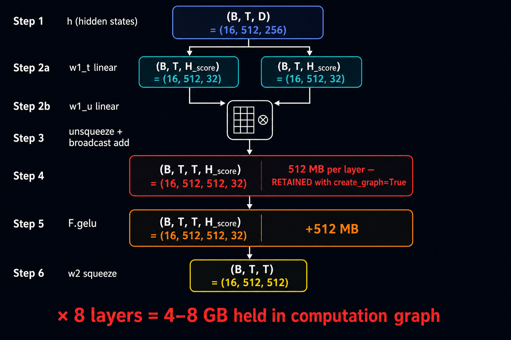
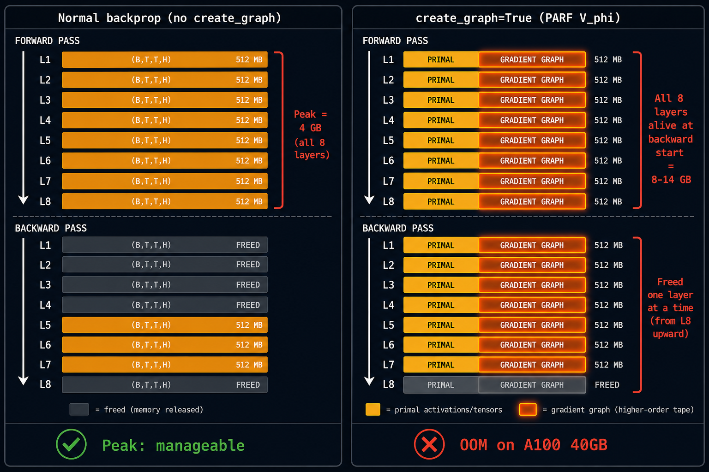
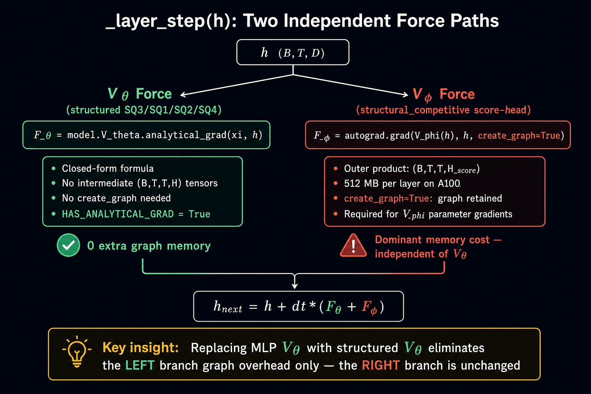
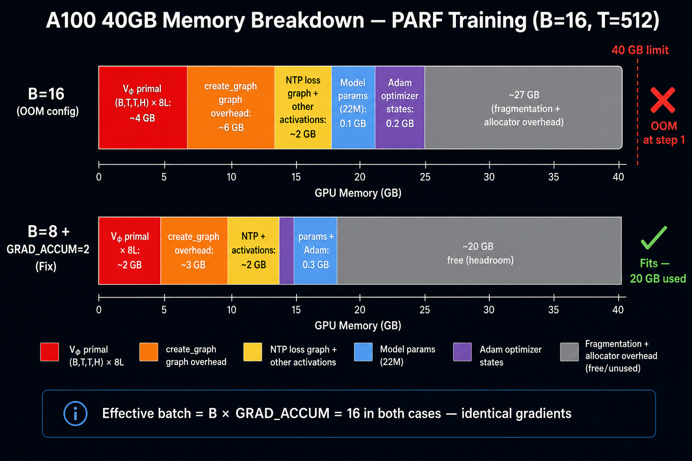

# Structured V_θ and GPU Memory: Why Parameter Reduction Does Not Prevent OOM

**Status:** Design-note explaining a common source of confusion when running
`notebooks/conservative_arch/parf/scripts/structured_vtheta_tinystories_sweep.ipynb`
on a 40 GB A100.

**Symptom:** Cell A1 (`SQ3 K=4, ~167K params`) raises
`CUDA out of memory. Tried to allocate 512.00 MiB`
at the first training step, despite the model having far fewer parameters
than the MLP baseline (22.6M total after V_θ swap).

**Short answer:** The OOM has nothing to do with V_θ's parameterisation.
It is caused by the V_φ pair-interaction force computation, which is
**quadratic in sequence length** and must retain its computation graph
for the full duration of every backward pass.

---

## 1. What structured V_θ actually saves

The whole point of replacing the MLP V_θ (v_hidden=2048, ~9.4M params)
with a structured variant is to reduce parameter count and enable
analytical gradient computation:

| Variant | V_θ params | V_θ forward memory | Analytical grad? |
|---------|-----------|-------------------|-----------------|
| MLP baseline | 9.4 M | ~37 MB (weights + activations) | No — autograd needed |
| SQ3 K=4 | 167 K | < 1 MB | Yes — closed form |
| SQ1 | 66 K | < 1 MB | Yes |
| SQ2 rank=4 | 198 K | < 1 MB | Yes |

With `HAS_ANALYTICAL_GRAD = True`, the model switches to Phase 2 in
`_layer_step`: V_θ's force is computed as a closed-form expression
(`module.analytical_grad(xi, h)`) and **no computation graph is retained
for V_θ**. This is a real win: V_θ contributes zero graph-holding overhead
to the backward pass.

---

## 2. The actual OOM source: V_φ and `create_graph=True`



Each `_layer_step` also computes the V_φ force — the pair-interaction term
that distinguishes PARF from plain SPLM:

```python
# model_parf_sparse.py (simplified)
V_phi_val = self.V_phi(h_in)          # score-head forward
grad_phi, = torch.autograd.grad(
    V_phi_val, h_in,
    create_graph=self.training,        # ← structurally required
    retain_graph=True,
)
```

`create_graph=True` is **non-negotiable**: without it, the outer
`loss.backward()` cannot differentiate through `grad_phi` to reach V_φ's
parameters, and the pair-interaction network would receive no gradients.

Inside the `structural_competitive` score-head, V_φ's forward pass creates
an outer-product tensor at every layer:

```python
# model_parf_sparse.py line ~200
proj_t = self.w1_t(h)                        # (B, T, H_score)
proj_u = self.w1_u(h)                        # (B, T, H_score)
hidden = proj_t.unsqueeze(2) + proj_u.unsqueeze(1)  # (B, T, T, H_score)
hidden = F.gelu(hidden)                              # (B, T, T, H_score) — another copy
```

The `(B, T, T, H_score)` shape is **quadratic in sequence length T**.
At the default training config (`B=16, T=512, H_score=32`):

```
16 × 512 × 512 × 32 × 4 bytes = 512 MB   per layer
                               × 8 layers = 4 GB   (forward tensors)
```

---

## 3. Why `create_graph=True` prevents early freeing



In normal backprop, PyTorch frees each layer's intermediates as soon as the
backward pass processes that layer. Peak memory equals the full-forward
high-water mark (all layers simultaneously), then it descends:

```
Normal backprop:
  forward → [L1][L2]...[L8]   ← all 8 (B,T,T,H) tensors in memory at peak
  backward →  L8 freed → L7 freed → ... → L1 freed
```

With `create_graph=True`, PyTorch must also materialise the **computation
graph of the gradient itself** — i.e., store enough structure to allow
differentiating through `autograd.grad` in the outer backward. This means
the V_φ forward-pass tensors at every layer are held in a live graph object
and cannot be freed until the full outer `loss.backward()` completes:

```
create_graph=True backprop:
  forward → [L1 graph][L2 graph]...[L8 graph]   ← all retained + graph overhead
  backward →  L8 graph freed → L7 graph freed → ... → L1 graph freed
             (but all must be alive at the start of backward)
```

The graph overhead approximately doubles the footprint of each layer's V_φ
computation:

| Memory item | Size |
|-------------|------|
| 8 × (B,T,T,H) primal tensors | ~4 GB |
| 8 × `create_graph` gradient-graph overhead | ~4–8 GB |
| Other activations (h, logits, NTP graph) | ~2 GB |
| Model parameters + Adam states | ~0.3 GB |
| **Peak total** | **~10–14 GB + fragmentation** |

The discrepancy between this estimate and the 38 GB reported in practice is
partly CUDA allocator reservation (blocks are reserved in multiples of 2 MB
and are not immediately returned to the OS) and partly the true cost of the
gradient-of-gradient graph, which stores temporaries for every op inside
V_φ's backward, including additional (B,T,T,H)-shaped objects.

---

## 4. Why structured V_θ does not help



Structured V_θ eliminates `create_graph` overhead only for the V_θ branch.
The two force computations are fully independent code paths:

```
_layer_step(h):
  ├── F_θ = model.V_theta.analytical_grad(xi, h)   ← SQ3/SQ1/SQ2/SQ4:
  │                                                    no graph, no (B,T,T,H)
  └── F_φ = autograd.grad(V_phi(h), h,             ← always:
                           create_graph=True)           (B,T,T,H) × 2 retained
```

Even with V_θ = a constant function, V_φ would still create and retain the
full `(B, T, T, H_score)` outer-product tensors at every layer. The OOM
therefore affects every cell (A1–A10, B1, B2) equally on an A100 40 GB
with `B=16, T=512`.

---

## 5. The fix: micro-batch + gradient accumulation



Halving `B` halves every `(B, T, T, H_score)` tensor:

```
B=8:  8 × 512 × 512 × 32 × 4 = 256 MB per layer  (vs 512 MB)
      × 8 layers                = 2 GB              (vs 4 GB)
```

To preserve the effective batch size of 16, we accumulate gradients over
2 micro-steps before calling `opt.step()`. The current notebook uses:

```python
BATCH      = 8       # micro-batch per accumulation step
GRAD_ACCUM = 2       # effective batch = BATCH * GRAD_ACCUM = 16
```

This is mathematically identical to `B=16` in a single step — the gradient
update is exactly the same — and brings peak memory within the 40 GB A100
budget.

---

## 6. Remedies if a larger effective batch is needed

| Approach | Effect | Complexity |
|----------|--------|-----------|
| `BATCH=8, GRAD_ACCUM=2` *(current)* | Halves (B,T,T,H); effective B unchanged | Low |
| Reduce `SCORE_HEAD_HIDDEN` (H_score) | Reduces (B,T,T,H) proportionally | Medium — affects V_φ capacity |
| Reduce `BLOCK` (sequence length T) | Reduces (B,T,T,H) quadratically | Medium — affects context length |
| Gradient checkpointing on `_stack_forward` | Recomputes intermediates during backward | Medium — ~30% slower |
| H100 80 GB | Fits `B=16` without accumulation | Zero code change |

---

## 7. Relation to the existing OOM catalogue

This document is a companion to
`docs/CUDA_Memory_Errors_with_SPLM_Designs.md`, which catalogues five OOM
events from the `colab_pilot` scale-up run. The mechanism is identical —
`create_graph=True` interacting with `(B, T, T, H_score)` outer products in
V_φ — but the context here is the structured V_θ sweep notebook rather than
the pilot training script. The pilot avoided OOM by using `--grad-accum 2`
in `train_parf_scaleup.py`; this notebook now mirrors that setting.
