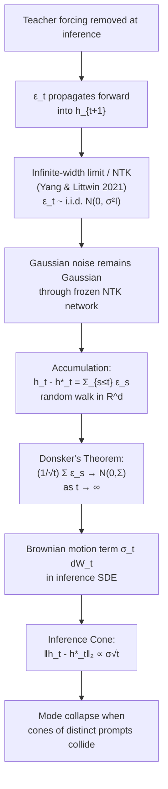
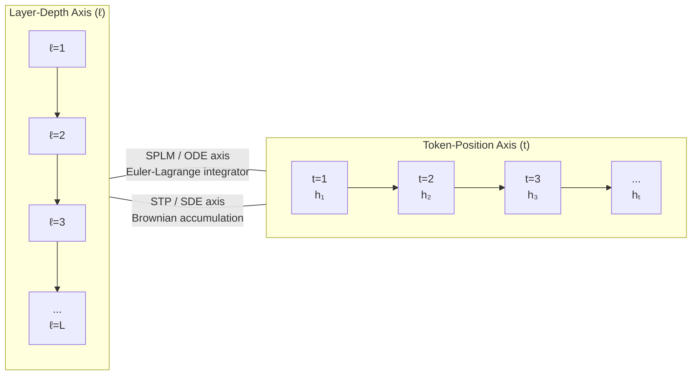
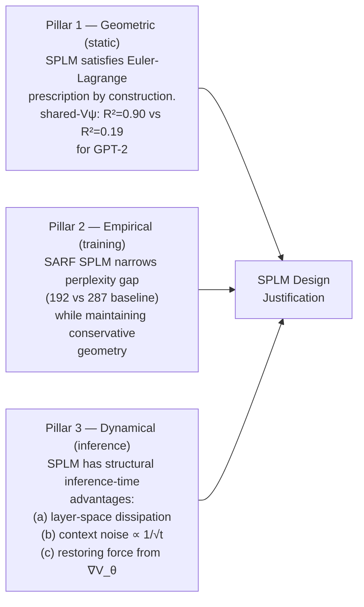

# The Impact of Brownian Motion on Perplexity in Attention-Based Transformers and SPLM

> **Context:** This document synthesizes the theoretical analysis arising from the Semantic Tube Prediction (STP) paper (Huang, LeCun & Balestriero, 2026) and its implications for the ScalarPotentialLM (SPLM) architecture developed in the Semantic Simulation framework. It covers the complete derivation of the training ODE and inference SDE, the role of Brownian motion in perplexity degradation, and the structural advantages of SPLM-like designs over classic attention-based transformers.

---

## Table of Contents

1. [Dynamical Systems Taxonomy](#1-dynamical-systems-taxonomy)
2. [The Training ODE — Complete Derivation](#2-the-training-ode--complete-derivation)
3. [The Inference SDE — Complete Derivation](#3-the-inference-sde--complete-derivation)
4. [Where Does the Brownian Motion Come From?](#4-where-does-the-brownian-motion-come-from)
5. [Impact on Attention-Based Transformers](#5-impact-on-attention-based-transformers)
6. [SPLM vs. Standard Transformers — Structural Comparison](#6-splm-vs-standard-transformers--structural-comparison)
7. [Brownian Motion as an Argument for SPLM Design](#7-brownian-motion-as-an-argument-for-splm-design)
8. [Proposed Experiment: Sequence Length Sweep](#8-proposed-experiment-sequence-length-sweep)
9. [Summary and Open Questions](#9-summary-and-open-questions)

---

## 1. Dynamical Systems Taxonomy

Before deriving the equations, it is important to establish the correct vocabulary for classifying the dynamics.

### 1.1 Dissipative vs. Conservative vs. Ballistic

For a first-order ODE dynamical system:

$$\dot{\mathbf{x}} = \mathbf{f}(\mathbf{x}), \quad \mathbf{x} \in \mathbb{R}^n$$

the character of the system is determined by the divergence of the vector field via **Liouville's theorem**:

$$\nabla \cdot \mathbf{f} = \sum_{i=1}^{n} \frac{\partial f_i}{\partial x_i}$$

| Condition | Phase-space volume | Classification |
|---|---|---|
| $\nabla \cdot \mathbf{f} < 0$ | Contracts | **Dissipative** |
| $\nabla \cdot \mathbf{f} = 0$ | Preserved | **Conservative / Hamiltonian** |
| $\nabla \cdot \mathbf{f} > 0$ | Expands | Expansive |

### 1.2 The STP Paper's Term: Ballistic

The STP paper (Proposition 2.1, Section 2.2) uses the term **ballistic** to describe the training-time trajectory. A ballistic trajectory is one that propagates freely under the Principle of Least Action — no damping, no friction, no energy loss. This is consistent with:

- **Conservative dynamics** — phase-space volume is preserved
- **Geodesic flow** — trajectories are geodesics on the semantic manifold $(\mathcal{M}, g)$
- **Variational / Euler-Lagrange** — derived from minimizing the action $\mathcal{S} = \int \mathcal{L}(\mathbf{h}, \dot{\mathbf{h}}) dt$

The full vocabulary hierarchy is:

| Term | Scope |
|---|---|
| **Ballistic** | The STP paper's own term — free propagation, no damping |
| **Geodesic flow** | Geometric interpretation on $(\mathcal{M}, g)$ |
| **Variational / Euler-Lagrange** | Derived from Principle of Least Action |
| **Conservative** | Phase-space volume preserved; $\nabla \cdot \mathbf{f} = 0$ |
| **Autonomous ODE with Lipschitz vector field** | Technical guarantee via Picard-Lindelöf |

---

## 2. The Training ODE — Complete Derivation

### 2.1 Setup and Notation

Let $x_{\leq t}$ denote a token sequence of length $t$. Each token $x_t$ has an embedding $x_t \in \mathbb{R}^{d_\text{model}}$, so the full sequence resides in $\mathbb{R}^{T \times d_\text{model}}$ where $T$ is the maximum sequence length.

Define:
- $\mathring{f}(\cdot)$: the converged neural network mapping sequences to hidden states
- $\mathring{u}(\cdot)$: the converged unembedding function $\mathring{u}: \mathbb{R}^d \to \mathbb{R}^{d_\text{model}}$
- $h_t = \mathring{f}(x_{\leq t}) + \epsilon_t$: the hidden state at position $t$, with residual error $\epsilon_t$
- $h_t^* = \mathring{f}(x_{\leq t})$: the optimal (error-free) hidden state

At a converged network where training loss is minimized, the sequence dynamics satisfy:

$$x_{t+1} = \mathring{u} \circ \mathring{f}(x_{\leq t}) $$

$$h_t = \mathring{f}(x_{\leq t}) + \epsilon_t $$

### 2.2 From Difference Equation to ODE

The sequence update rule is:

$$x_{\leq t+1} = x_{\leq t} \oplus \mathring{u} \circ \mathring{f}(x_{\leq t})$$

where $\oplus$ denotes concatenation. Define $v(x, t) : \mathbb{R}^{d_\text{model}} \times \mathbb{N} \to \mathbb{R}^{T \times d_\text{model}}$ as the operator that places a vector at position $t+1$ in a zero-padded sequence:

$$v(x, t) = [0, \ldots, 0, \underbrace{x}_{\text{index } t+1}, 0, \ldots, 0]$$

Define the prefix-removal operator $\ominus$ such that:

$$x_{\leq t+1} \ominus x_{\leq t} = v(x_{t+1}, t) = x_{\leq t+1} - x_{\leq t}$$

This gives the difference equation:

$$x_{\leq t+1} - x_{\leq t} = \mathring{u} \circ \mathring{f}(x_{\leq t})$$

This has the form $z_{t+1} - z_t = g(z_t, t)$, which approximates the continuous ODE $dz_t = g(z_t, t) dt$ in the limit of small steps.

### 2.3 Proposition 2.1 (Training ODE)

> **Proposition.** The LLM training process can be modeled as a solution in the token sequence space $\mathbb{R}^{T \times d_\text{model}}$ to the ODE:
>
> $$\boxed{dx_{\leq t} = \mathring{u} \circ \mathring{f}(x_{\leq t}) dt}$$

**Interpretation.** This is a **first-order autonomous ODE** in the token sequence space. The vector field $\mathbf{f}(x_{\leq t}) = \mathring{u} \circ \mathring{f}(x_{\leq t})$ has no explicit time dependence.

### 2.4 Picard-Lindelöf Guarantee

If $\mathring{u} \circ \mathring{f}(\cdot)$ and its partial derivatives with respect to $x_{\leq t}$ are continuous (i.e., the vector field is Lipschitz), then by the **Picard-Lindelöf (Existence and Uniqueness) Theorem**, the ODE admits a unique solution for any given initial condition. Consequently:

$$x_{\leq t}^{(A)} \neq x_{\leq t}^{(B)} \text{ at } t=0 \implies x_{\leq t}^{(A)} \neq x_{\leq t}^{(B)} \text{ for all } t > 0$$

Trajectories originating from distinct prompts (initial conditions) **never intersect** — this is the theoretical basis for diversity preservation and the ruling-out of mode collapse at training time.

### 2.5 Ballistic Character of the Training ODE

Under the **Principle of Least Action**, the training ODE trajectories are geodesics on the semantic manifold $(\mathcal{M}, g)$. The geodesic equation on $\mathcal{M}$ is:

$$\ddot{\gamma}^k + \Gamma^k_{ij} \dot{\gamma}^i \dot{\gamma}^j = 0$$

where $\Gamma^k_{ij}$ are the Christoffel symbols of the metric $g$. Written as a first-order system on the tangent bundle $T\mathcal{M}$:

$$\dot{x}^i = v^i, \qquad \dot{v}^k = -\Gamma^k_{ij} v^i v^j$$

For a Riemannian geodesic flow, the kinetic energy $T = \frac{1}{2} g_{ij} v^i v^j$ is a conserved first integral, and by Liouville's theorem for Hamiltonian systems:

$$\nabla \cdot \mathbf{F} = 0$$

Phase-space volume is **preserved** — the training ODE is conservative, not dissipative.

---

## 3. The Inference SDE — Complete Derivation

### 3.1 The Asymmetry Introduced by Teacher Forcing Removal

At **training time**, teacher forcing feeds the ground-truth token $x_{t+1}$ as input regardless of the model's prediction. The unembedding error $\epsilon_t$ at step $t$ never propagates forward — each step starts from the true sequence. Errors remain independent.

At **inference time**, there is no teacher forcing. The predicted token becomes the next input, so $h_{t+1}$ depends (indirectly) on $h_t$, which already carries $\epsilon_t$. Errors **accumulate** through the sequence.

### 3.2 The Gaussian Character of $\epsilon_t$ (NTK / Infinite-Width Limit)

Yang & Littwin (2021) established that in the **infinite-width limit**, the pre-activations of a neural network converge to a Gaussian process determined by the Neural Tangent Kernel (NTK). This implies the unembedding errors are well-approximated as i.i.d. Gaussian:

$$\epsilon_t \sim \mathcal{N}(0, \sigma^2 I)$$

Furthermore, Gaussian noise **remains Gaussian** when passed through a randomly initialized network frozen in the infinite-width limit. So the Gaussian character of $\epsilon_t$ is preserved as errors propagate through $\mathring{f}$.

### 3.3 Accumulation to Brownian Motion via Donsker's Theorem

At inference time, the hidden state distortion accumulates as:

$$h_t - h_t^* = \sum_{s \leq t} \epsilon_s$$

This is a **sum of i.i.d. Gaussian random variables** — a random walk in $\mathbb{R}^d$. By **Donsker's theorem** (the functional central limit theorem), as $t \to \infty$:

$$\frac{1}{\sqrt{t}} \sum_{s \leq t} \epsilon_s \xrightarrow{d} \mathcal{N}(0, \Sigma)$$

which means the running sum converges in distribution to a **Brownian motion** $W_t$. The magnitude of the distortion scales as:

$$\left\lVert \sum_{s \leq t} \epsilon_s \right\rVert_2 \propto \sigma\sqrt{t}$$

### 3.4 Proposition B.1 (Inference SDE)

> **Proposition.** The inference process of an LLM can be modeled by a **first-order Itô SDE** in the token sequence space $\mathbb{R}^{T \times d_\text{model}}$:
>
> $$\boxed{dx_{\leq t} = \mathring{u} \circ \mathring{f}(x_{\leq t}) dt + \sigma_t dW_t}$$

where $W_t$ is a standard Brownian motion (Wiener process) and $\sigma_t$ is the diffusion coefficient determined by the accumulated unembedding error variance.

**This remains a first-order equation** — only $dx_{\leq t}$ (the first "derivative") appears. The addition of $\sigma_t dW_t$ promotes the equation from an ODE to an Itô SDE without changing the order.

### 3.5 The Inference Cone (Proposition F.1)

The distortion between $h_t$ and $h_t^*$ grows as a Gaussian process:

$$\lVert h_t - h_t^* \rVert_2 \propto \sigma\sqrt{t}$$

**Proof sketch.** According to the inference SDE, at inference time the token sequence trajectory follows $dx_{\leq t} = \mathring{u} \circ \mathring{f}(x_{\leq t}) dt + \sigma_t dW_t$. Let $x_{\leq t}^*$ be the error-free generation satisfying $dx_{\leq t}^* = \mathring{u} \circ \mathring{f}(x_{\leq t}^*) dt$, and $h_t^* = \mathring{f}(x_{\leq t}^*)$. Since Brownian motion remains Brownian motion when passed through $\mathring{f}$ (by the NTK result), we have:

$$h_t - h_t^* = \sum_{s \leq t} \epsilon_s$$

By Donsker's theorem, $\frac{1}{\sqrt{t}} \sum_{s \leq t} \epsilon_s \sim \mathcal{N}(0, \Sigma)$, giving $\lVert h_t - h_t^* \rVert_2 \propto \sigma\sqrt{t}$. $\square$

### 3.6 Derivation Flow

---

## 4. Where Does the Brownian Motion Come From?

The derivation chain above reveals that the Brownian motion is not an architectural artifact — it is a **fundamental consequence of three compounding facts**:

1. **Discreteness of tokens vs. continuity of hidden states.** Training only requires $h_t$ to land in the correct Voronoi cell (the region that decodes to the correct next token). This leaves enormous freedom within the cell — the exact location $h_t$ within the correct Voronoi cell is unconstrained by $\mathcal{L}_\text{NTP}$ alone.

2. **Teacher forcing removal.** During training, the next ground-truth token is always fed as input, breaking the error chain at every step. At inference, this chain is intact, so $\epsilon_t$ accumulates.

3. **Gaussianity of neural network activations** at scale (NTK limit). This turns the accumulation into a bona fide random walk, and Donsker's theorem then promotes it to a Brownian motion.

Critically, this accumulation is over **token positions** $t$, not over network layers $\ell$. The STP paper makes this explicit by distinguishing from Tong et al. (2025), who model ODE evolution over layer depth.

---

## 5. Impact on Attention-Based Transformers

### 5.1 SNR Degradation (Appendix H, STP Paper)

Under the Gaussian channel approximation, decompose the hidden state as $X = Z + N$ where $Z$ is the latent signal and $N \sim \mathcal{N}(0, \sigma^2 I)$ is the accumulated Brownian noise. Define:

$$\text{SNR} = \frac{\mathbb{E}[\lVert Z \rVert^2]}{\mathbb{E}[\lVert N \rVert^2]}$$

Since $\mathbb{E}[\lVert N \rVert^2] \propto \sigma^2 t$, the SNR **degrades monotonically with sequence length**. By Shannon's channel capacity formula:

$$I(X; Y) = \frac{1}{2} \log(1 + \text{SNR})$$

The data efficiency bound (Lemma H.1) gives:

$$H(Y | X_m) \geq H(Y) - m \cdot I(Y; X)$$

Substituting the SNR expression (Corollary H.2):

$$\boxed{m \geq \frac{H(Y) - \epsilon}{\frac{1}{2}\log(1 + \text{SNR})}}$$

As $\sigma_t$ grows with sequence length, SNR shrinks, $I(X;Y)$ drops, and the model requires **exponentially more data** to maintain the same accuracy.

By Fano's inequality ($|V| \gg 1$):

$$P_e \gtrsim \frac{H(Y) - m \cdot \frac{1}{2}\log(1 + \text{SNR})}{\log|V|}$$

### 5.2 Attention Score Corruption

In a standard transformer, attention computes:

$$\text{Attn}(Q, K, V) = \text{softmax}\left(\frac{QK^\top}{\sqrt{d_k}}\right)V$$

where $Q = h_t W_Q$, $K = h_s W_K$, $V = h_s W_V$. At inference time, accumulated Brownian distortion $\delta_t = \sum_{s \leq t} \epsilon_s$ corrupts every hidden state. The actual attention logit between positions $t$ and $s$ becomes:

$$\tilde{q}_t \cdot \tilde{k}_s = q_t \cdot k_s + \underbrace{q_t \cdot (\delta_s W_K) + (\delta_t W_Q) \cdot k_s + (\delta_t W_Q)\cdot(\delta_s W_K)}_{\text{noise terms} \propto \sigma\sqrt{t}}$$

The softmax distributes attention weight to **semantically wrong positions**, and the value aggregation carries corrupted semantic content into the next hidden state — compounding the error.

### 5.3 Compounding via Causal Attention

In autoregressive (causal) transformers, each new token $h_{t+1}$ attends over all previous positions $h_1, \ldots, h_t$. Since each $h_s$ carries distortion $\delta_s \propto \sigma\sqrt{s}$, the value aggregation:

$$\sum_s \alpha_{ts} (h_s + \delta_s) W_V$$

mixes all prior accumulated errors, creating a compounding effect beyond the simple $\sigma\sqrt{t}$ picture. The effective noise is super-linear in the naive estimate.

### 5.4 Mode Collapse via Cone Collision

Two semantically distinct prompts with geodesics $h^*$ and $g^*$ have inference cones of radius $\propto \sigma\sqrt{t}$. As $t$ grows, these cones eventually overlap:

$$\lVert h^* - g^* \rVert_2 \leq c \cdot \sigma\sqrt{t} \quad \text{with probability } \geq 1 - \varepsilon$$

At this point, $h_t \approx g_t$ — the model can no longer distinguish the two semantic trajectories — and **mode collapse** occurs.

---

## 6. SPLM vs. Standard Transformers — Structural Comparison

### 6.1 SPLM Architecture Recap

The ScalarPotentialLM (SPLM) implements the Euler-Lagrange equations of a single learned scalar potential $V_\theta(\xi_t, h)$. Each layer performs:

$$h_t^{(\ell+1)} = h_t^{(\ell)} - \beta_\ell \nabla_h V_\theta(\xi_t, h_t^{(\ell)}) - \gamma v_t^{(\ell)}$$

where:
- $\xi_t = \frac{1}{t} \sum_{s \leq t} h_s$ is the causal cumulative-mean context vector
- $V_\theta(\xi_t, h)$ is a learned 2-layer MLP scalar potential
- $\gamma$ is the learned damping coefficient
- $\beta_\ell$ is the per-layer step size

The per-layer operator satisfies $M_\ell(h) = -\beta_\ell \nabla^2_h V_\theta(\xi_t, h_\ell)$ for the **same** $V_\theta$ at every layer — conservative by construction. Empirically validated: shared-$V_\psi$ test $R^2 = 0.90$ for SPLM vs. $R^2 = 0.19$ for GPT-2.

### 6.2 The Two Orthogonal Axes

| Axis | Dynamics | Standard Transformer | SPLM |
|---|---|---|---|
| **Token-position** $t$ | Brownian accumulation | grows ~$\sigma\sqrt{t}$ | Same |
| **Layer depth** $\ell$ | Per-step transformation | Conservative (attention is symplectic) | **Dissipative** via $-\gamma v_t$ |

### 6.3 Three Structural Differences at Inference

#### Difference 1: Layer-Space Dissipation

Standard attention transformers are conservative at the layer level — a perturbation $\delta$ entering layer $\ell$ is transformed but not contracted ($\nabla \cdot F = 0$ at the layer level). SPLM's explicit damping term $-\gamma v_t^{(\ell)}$ actively **contracts** layer-wise perturbations. When the token-position Brownian distortion $\delta_t$ enters a fresh forward pass at step $t+1$, SPLM dissipates it through layers while the standard transformer propagates it conservatively.

This makes the SPLM layer-space dynamics **dissipative** by construction, providing structural inference-time robustness unavailable to standard transformers.

#### Difference 2: Context Pool Noise Has Opposite Scaling

SPLM's context vector accumulates noise as:

$$\tilde{\xi}_t = \frac{1}{t} \sum_{s \leq t} (h_s^* + \delta_s) = \xi_t^* + \frac{1}{t} \sum_{s \leq t} \delta_s$$

where $\delta_s \propto \sigma\sqrt{s}$. The noise in $\xi_t$ scales as:

$$\left\lVert \frac{1}{t} \sum_{s \leq t} \delta_s \right\rVert_2 \propto \frac{\sigma}{\sqrt{t}}$$

This is a **law-of-large-numbers suppression** — the context noise *decreases* with sequence length. This is the exact opposite of the $O(\sqrt{t})$ cone-widening in standard transformers.

| Noise term | Standard Transformer | SPLM |
|---|---|---|
| Token-position Brownian | ~$\sigma\sqrt{t}$ (grows) | ~$\sigma\sqrt{t}$ (grows — same) |
| Context pool perturbation | Absent | ~$\sigma/\sqrt{t}$ (**shrinks**) |
| Net inference stability | Monotonically degrades | Partial self-correction |

#### Difference 3: Potential Gradient as Restoring Force

Because SPLM's forward pass is governed by $-\beta_\ell \nabla_h V_\theta(\xi_t, h_t^{(\ell)})$, the trajectory at inference is always being pulled toward the minimum of the learned energy landscape. This is a **restoring force** that standard attention lacks entirely. Even if $\delta_t$ pushes $h_t$ off the geodesic, the gradient flow of $V_\theta$ at the next layer pulls it back toward the energy minimum.

### 6.4 Complete Structural Comparison

```mermaid
flowchart TD
    subgraph StandardTransformer["Standard Attention Transformer (Inference)"]
        ST1["Token error ε_t"] --> ST2["Accumulates freely\nh_t - h*_t = Σε_s"]
        ST2 --> ST3["Brownian cone grows\n∝ σ√t"]
        ST3 --> ST4["Attention score corruption\nq̃·k̃ = q·k + noise(σ√t)"]
        ST4 --> ST5["Causal attention\nre-mixes all prior errors"]
        ST5 --> ST6["Mode collapse when\ncones collide"]
    end

    subgraph SPLM_["SPLM (Inference)"]
        SP1["Token error ε_t"] --> SP2["Same Brownian accumulation\nh_t - h*_t = Σε_s ∝ σ√t"]
        SP2 --> SP3["Layer damping -γv_t\nDissipates perturbations\nthrough depth"]
        SP3 --> SP4["Gradient restoring force\n-β∇V_θ pulls toward\nenergy minimum"]
        SP4 --> SP5["Context pool averaging\nξ̃_t noise ∝ σ/√t\n(shrinks with t)"]
        SP5 --> SP6["Attenuated mode collapse\nSelf-correcting dynamics"]
    end
```

---

## 7. Brownian Motion as an Argument for SPLM Design

This analysis constitutes a **third pillar** of evidence for SPLM's advantages over standard attention transformers, complementing the existing geometric and empirical pillars:

### 7.1 Summary of the Argument

Standard attention transformers suffer from monotonically growing Brownian distortion at inference (scaling as $\lVert h_t - h_t^* \rVert_2 \propto \sigma\sqrt{t}$), which corrupts attention scores, compounds through causal mixing, and eventually causes mode collapse. SPLM's Euler-Lagrange architecture provides three structural countermeasures unavailable to standard transformers:

1. **Layer-space dissipation** via $-\gamma v_t$: actively contracts Brownian perturbations as they propagate through network depth
2. **Context pool self-correction**: $\xi_t$ noise scales as $O(1/\sqrt{t})$ — the inverse of the Brownian growth
3. **Restoring force** from $\nabla_h V_\theta$: gradient flow pulls perturbed trajectories back toward the energy minimum at every layer

### 7.2 Honest Caveat

The full Brownian argument for standard transformers relies on the NTK / infinite-width limit to establish $\epsilon_t \sim \text{i.i.d. Gaussian}$. For SPLM, $V_\theta$ is a **learned 2-layer MLP**, not a randomly initialized network frozen at its NTK. The Gaussianity of $\epsilon_t$ is therefore approximate — the noise statistics depend on the learned curvature $\nabla^2_h V_\theta(\xi_t, h_t)$ along the trajectory.

This opens a productive open question: a rigorous characterization of SPLM's inference-time noise statistics under the learned potential $V_\theta$ would substantially strengthen the argument.

---

## 8. Proposed Experiment: Sequence Length Sweep

### 8.1 Motivation

The theory makes **quantitative, directional predictions** about how inference quality scales with sequence length for each architecture. A sequence length sweep directly tests whether the $O(\sqrt{t})$ vs. $O(1/\sqrt{t})$ scaling laws hold empirically.

### 8.2 Testable Hypotheses

**H1 (Standard transformer):** Perplexity and trajectory deviation degrade as ~$\sqrt{t}$ with sequence length.

$$\lVert h_t - h_t^* \rVert_2 \propto \sigma\sqrt{t} \quad \text{(log-log slope} \approx 0.5\text{)}$$

**H2 (SPLM):** Degradation is slower than $\sqrt{t}$, potentially plateauing, due to the $O(1/\sqrt{t})$ context suppression partially canceling the $O(\sqrt{t})$ Brownian growth.

$$\lVert h_t - h_t^* \rVert_2 \propto \sigma t^\alpha, \quad \alpha < 0.5 \quad \text{(log-log slope} < 0.5\text{)}$$

**H3 (Crossover):** At short sequences, GPT-2 outperforms SPLM (lower perplexity at baseline). The **gap narrows** as sequence length increases, because SPLM's structural advantages compound while GPT-2's Brownian penalty grows.

**H4 (Context pool):** SPLM's context noise $\lVert \tilde{\xi}_t - \xi_t^* \rVert_2$ scales as $O(1/\sqrt{t})$ — log-log slope ~$-0.5$.

### 8.3 Experimental Design

#### Primary Metric: Perplexity vs. Sequence Length

Evaluate both models on held-out sequences of varying lengths:

$$t \in \{32, 64, 128, 256, 512, 1024\}$$

Plot perplexity vs. $t$ for both architectures. Theory predicts the curves diverge — GPT-2 curving upward faster than SPLM.

#### Secondary Metric: Trajectory Deviation

Run each test sequence in two modes:
1. **Teacher-forced** (training mode): produces $h_t^*$
2. **Free-running inference** (no teacher forcing): produces $h_t$

Measure:

$$D(t) = \lVert h_t - h_t^* \rVert_2$$

at each position $t$. Fit a power law $D(t) = c \cdot t^\alpha$ via log-log regression. Theory predicts:

$$\alpha_\text{GPT-2} \approx 0.5, \qquad \alpha_\text{SPLM} < 0.5$$

#### Tertiary Metric: Context Pool Noise (SPLM only)

Directly measure:

$$N_\xi(t) = \lVert \tilde{\xi}_t - \xi_t^* \rVert_2$$

where $\tilde{\xi}_t$ is the context vector from free-running inference and $\xi_t^*$ is from teacher-forced inference. Theory predicts log-log slope ~$-0.5$.

### 8.4 Outcome Interpretation

| Outcome | Interpretation |
|---|---|
| H1 confirmed, H2 confirmed | Strong support — both architectures behave as theory predicts |
| H2 partially confirmed ($\alpha < 0.5$ but not $O(1/\sqrt{t})$) | Context suppression real but other noise sources dominate |
| H3 confirmed (gap narrows with length) | Most practically significant — SPLM advantage is a long-sequence property |
| H4 confirmed (context noise ~$1/\sqrt{t}$) | Direct empirical confirmation of context pool suppression |
| No difference | NTK assumption breaks for SPLM, or $\gamma$ too small at this scale |
| SPLM degrades faster | Context pool corruption dominates — important falsification |

### 8.5 Practical Note on Scale

The scaling law argument is **architectural, not scale-dependent**. The existing SPLM (7.1M parameters, $d=128$, $L=8$, Tiny Shakespeare) is sufficient. The $\sqrt{t}$ vs. $1/\sqrt{t}$ distinction should be visible at $t \in \{128, 256, 512, 1024\}$. No large-scale retraining is required.

### 8.6 Significance

This experiment would be the **first empirical verification** of the $\lVert h_t - h_t^* \rVert_2 \propto \sigma\sqrt{t}$ scaling law predicted by the STP paper — done comparatively across two architectures. The STP paper establishes this scaling theoretically (Proposition F.1) but never runs the sequence-length sweep to confirm it empirically. A confirmed log-log slope measurement is a precise, falsifiable result that constitutes a contribution in its own right.

### 8.7 Caveats: Why Interpretation Requires Care

The three hypotheses above rest on assumptions that must be examined before assigning strong evidential weight to any outcome.

---

#### Caveat A — The NTK assumption holds for neither model

The Brownian derivation in §3 invokes the NTK / infinite-width limit to claim $\epsilon_t \sim \mathcal{N}(0, \sigma^2 I)$ i.i.d. and to assert that noise remains Gaussian after passing through the network. Both claims hold for a *randomly initialized*, *frozen*, *infinite-width* network — none of those conditions apply here. Both GPT-2 and SPLM are:

- **finite-width** ($d_\text{model} = 768$ for GPT-2, $d = 128$ for SPLM),
- **trained** (weights have moved far from the NTK regime),
- **active at inference** (the network is not frozen — it is evaluated, not held constant).

In particular, for SPLM, $V_\theta$ is a learned 2-layer MLP whose curvature $\nabla^2_h V_\theta(\xi_t, h_t)$ depends on the trajectory itself. The argument that noise stays Gaussian as it passes through $\nabla_h V_\theta$ has no rigorous foundation in this setting.

**Practical consequence:** the experiment is more accurately described as testing whether the STP paper's *predicted asymptotic scaling* holds in the sub-asymptotic finite-width trained regime — a legitimately interesting empirical question — rather than verifying the NTK-derived derivation itself. Any confirmed slope should be reported as an empirical regularity, not as proof of the theoretical chain.

---

#### Caveat B — The $1/\sqrt{t}$ context suppression requires independent errors, which inference destroys

The argument that $\lVert \tilde{\xi}_t - \xi_t^* \rVert_2 \propto 1/\sqrt{t}$ (§6.3, Difference 2) rests on the law of large numbers applied to the average $\frac{1}{t}\sum_{s \leq t} \delta_s$. The LLN suppression is valid when $\delta_s$ are *independent*. At inference time they are not: $\delta_s = h_s - h_s^*$ and $h_s$ is computed from the corrupted predecessor $h_{s-1}$, so successive errors are positively autocorrelated.

Under **positive autocorrelation** with correlation $\rho$ between successive errors, the variance of the average scales as:

$$\text{Var}\left(\frac{1}{t}\sum_{s=1}^{t} \delta_s\right) \propto \frac{1 + 2\rho(1 - 1/t)}{t}$$

which approaches $1/t$ only when $\rho = 0$. For persistent autocorrelation ($\rho \to 1$) the suppression vanishes entirely and the context noise grows rather than shrinks. The actual slope of $N_\xi(t)$ therefore lies somewhere in the range $[-0.5, +0.5]$ depending on the empirical autocorrelation of inference errors — and measuring this slope is the most informative single output of the sweep, precisely because it directly probes whether the averaging argument survives autocorrelation.

**Design implication:** the context-pool noise metric $N_\xi(t)$ should be the primary diagnostic rather than a tertiary one. If the slope is close to $-0.5$, the independence assumption approximately holds and the LLN suppression is real. If the slope is near zero or positive, autocorrelation dominates and the Brownian advantage argument requires revision.

---

#### Caveat C — The three claimed SPLM advantages are coupled to $\gamma$, and the default $\gamma$ is suboptimal

The three structural advantages (§6.3) are not equal partners:

- **Advantage 1** (layer-space dissipation, $-\gamma v_t$) is proportional to $\gamma$. At $\gamma \approx 0.85$ (the freely-trained default), dissipation is substantial but not maximal. At $\gamma = 0.30$ (the empirically optimal value from the E4 damping sweep), the model is in the *mildly underdamped* regime — momentum is larger, so the restoring force and the context averaging carry more relative weight than the damping term.
- **Advantage 2** (context suppression, $1/\sqrt{t}$) does not depend on $\gamma$ at all — it is a property of the cumulative-mean pooling.
- **Advantage 3** (restoring force, $-\beta\nabla V_\theta$) is always active and independent of $\gamma$.

Running the sweep only at the freely-trained $\gamma \approx 0.85$ therefore conflates all three mechanisms and cannot attribute any observed advantage to a specific one. The recommended design adds at minimum three $\gamma$ values:

| $\gamma$ | Regime | Primary active mechanism |
|---|---|---|
| 0.30 | Mildly underdamped (E4 optimum) | Restoring force + context averaging; moderate damping |
| 0.85 | Strongly overdamped (freely-trained) | Damping dominant; momentum nearly zeroed |
| 5.00 | Quasi-static (E4 extreme) | Gradient flow only; velocity effectively zero each step |

This converts the sweep from a 2-cell experiment (SPLM vs. matched) into a $3 \times N_t$ grid ($3\gamma \times N_t$ length cells) for the SPLM side plus $N_t$ cells for the matched baseline. The marginal compute cost is small — the SPLM checkpoints at these three $\gamma$ values already exist from the E4 sweep. The diagnostic gain is large: if the slope improves most sharply going from $\gamma = 0.85$ to $\gamma = 0.30$, the inertial/restoring mechanism is doing the work; if it is insensitive to $\gamma$, the context averaging is the driver.

---

#### Caveat D — The training context window limits the usable sequence-length range

Both models are trained at `block_size = 128` (SPLM) and with positional encodings up to `max_len = 256` (SPLM) / 1024 (GPT-2). The proposed sweep extends to $t = 1024$, which means:

| Length $t$ | SPLM | GPT-2 |
|---|---|---|
| 32, 64, 128 | Within training distribution | Within training distribution |
| 256 | At positional-encoding limit, outside training distribution | Within training distribution |
| 512, 1024 | Beyond `max_len` — undefined behaviour without retraining | Within training distribution |

The asymmetric coverage means that for $t > 128$, any SPLM degradation is partly a context-length extrapolation failure rather than pure Brownian noise accumulation, while GPT-2 is still in-distribution. A fair comparison requires either (a) restricting the sweep to $t \leq 128$ (gives only a factor-of-4 span, poor for log-log slope estimation) or (b) retraining SPLM at `block_size = 512` or `block_size = 1024` before running the sweep. Option (b) is a multi-hour MPS job but is the correct choice if the goal is a publishable slope measurement; option (a) is appropriate for a quick sanity check.

**Recommended grid given this constraint:** run first at $t \in \{16, 32, 64, 96, 128\}$ on existing checkpoints to obtain a factor-of-8 slope estimate. If the slope is directionally consistent with H1/H2, retrain SPLM at `block_size = 512` and extend to $t \in \{64, 128, 256, 512\}$. Only then report as a slope measurement.

---

## 9. Summary and Open Questions

### 9.1 Core Results

| Result | Statement |
|---|---|
| Training ODE | $dx_{\leq t} = \mathring{u} \circ \mathring{f}(x_{\leq t}) dt$ — first-order, ballistic, conservative |
| Inference SDE | $dx_{\leq t} = \mathring{u} \circ \mathring{f}(x_{\leq t}) dt + \sigma_t dW_t$ — first-order Itô SDE |
| Brownian origin | Teacher forcing removal + NTK Gaussianity + Donsker accumulation |
| Brownian axis | Token-position $t$, not layer depth $\ell$ |
| Cone growth | $\lVert h_t - h_t^* \rVert_2 \propto \sigma\sqrt{t}$ |
| SNR degradation | SNR $\propto 1/t$, data requirement $m \propto 1/\log(1 + \text{SNR})$ |
| SPLM advantage 1 | Layer-space dissipation $-\gamma v_t$ contracts Brownian errors through depth |
| SPLM advantage 2 | Context pool noise $\lVert \tilde{\xi}_t - \xi_t^* \rVert_2 \propto \sigma/\sqrt{t}$ — self-correcting (under independent errors) |
| SPLM advantage 3 | Restoring force $-\beta\nabla_h V_\theta$ pulls perturbed trajectories to energy minimum |

### 9.2 Open Questions

**Q1 (Oracle test):** Does conditioning on the true $\xi_t^*$ (oracle context) fully close the layer-4 $R^2$ dip from 0.28 to the plateau value of 0.90–0.97? This would confirm that context omission is the complete explanation for the dip.

**Q2 (Noise statistics under $V_\theta$):** Can the noise statistics $\epsilon_t$ in SPLM's inference be characterized rigorously under the learned curvature $\nabla^2_h V_\theta$? The NTK argument does not apply directly to a trained MLP.

**Q3 (Geometry-aware regularizer):** A regularizer penalizing the full squared acceleration $\lVert a_t \rVert^2$ — equivalently

$$(\lVert d_2 \rVert - \lVert d_1 \rVert)^2 + 2\lVert d_1 \rVert \lVert d_2 \rVert \cdot \mathcal{L}_\text{STP}$$

— would constrain the tangential component currently invisible to $\mathcal{L}_\text{STP}$. SPLM's Euler-Lagrange structure implicitly regularizes both components. Would making this explicit further close the perplexity gap?

**Q4 (Sequence length sweep):** Do the predicted scaling laws $\alpha_\text{GPT-2} \approx 0.5$ and $\alpha_\text{SPLM} < 0.5$ hold empirically at the scale of the current SPLM experiments, *after* accounting for Caveats A–D of §8.7?

**Q5 (Crossover length):** Is there a critical sequence length $t^*$ beyond which SPLM's inference stability advantage outweighs its baseline perplexity deficit relative to matched GPT-2?

**Q6 (Autocorrelation of inference errors):** What is the empirical autocorrelation structure of $\delta_s = h_s - h_s^*$ at inference time for SPLM vs. GPT-2? If SPLM's dissipation actively decorrelates successive errors, the $1/\sqrt{t}$ context suppression may be approximately valid even though the derivation assumes independence. Measuring autocorrelation directly would close this gap.

---

## References

- Huang, H., LeCun, Y., & Balestriero, R. (2026). *Semantic Tube Prediction: Beating LLM Data Efficiency with JEPA.* arXiv:2602.22617.
- Coddington, E. A. & Levinson, N. (1955). *Theory of Ordinary Differential Equations.* McGraw-Hill.
- Yang, G. & Littwin, E. (2021). Tensor Programs IIb: Architectural universality of neural tangent kernel training dynamics. *ICML*.
- Lanczos, C. (1966). *The Variational Principles of Mechanics.* University of Toronto Press.
- Shannon, C. E. (1948). A mathematical theory of communication. *Bell System Technical Journal*, 27(3), 379–423.
- Cover, T. M. & Thomas, J. A. (1991). *Elements of Information Theory.* Wiley.
- Khalil, H. K. (2002). *Nonlinear Systems.* Prentice Hall.
- Tong, A. et al. (2025). Neural ODE Transformers: Analyzing internal dynamics and adaptive fine-tuning. *ICLR*.
