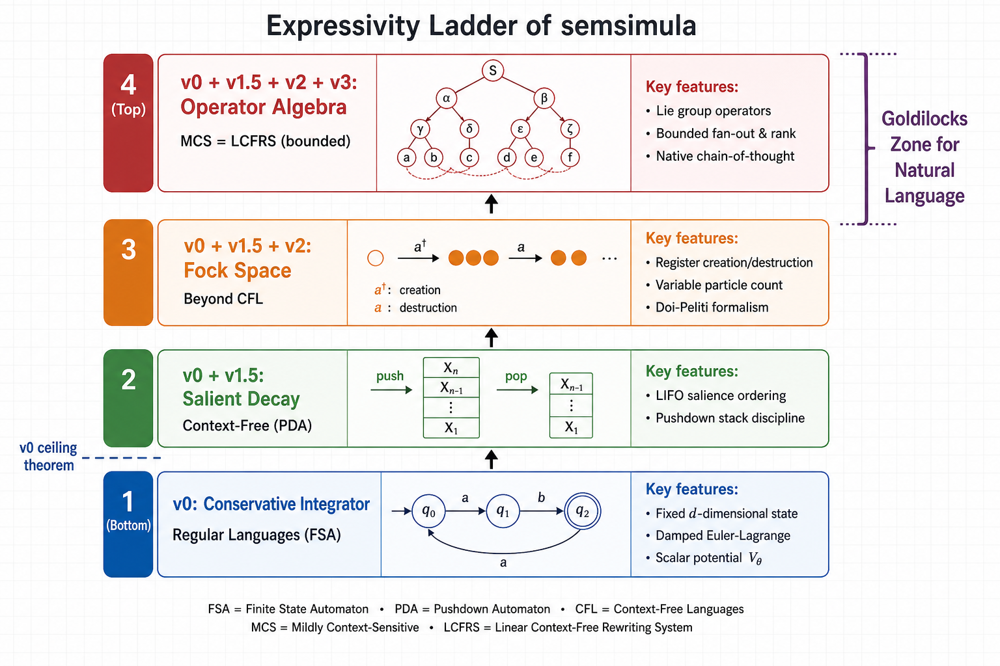
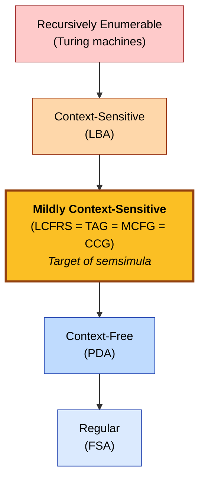
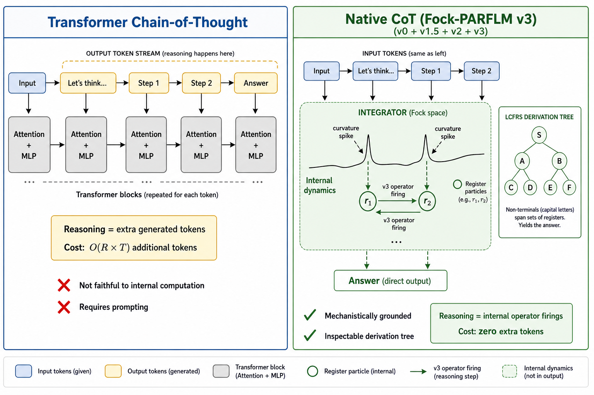
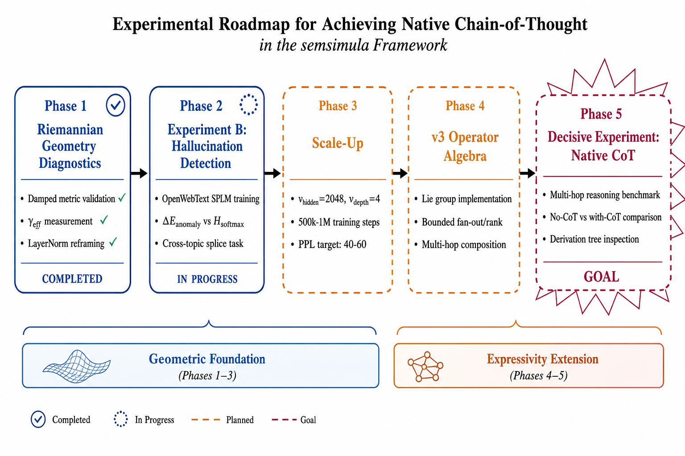
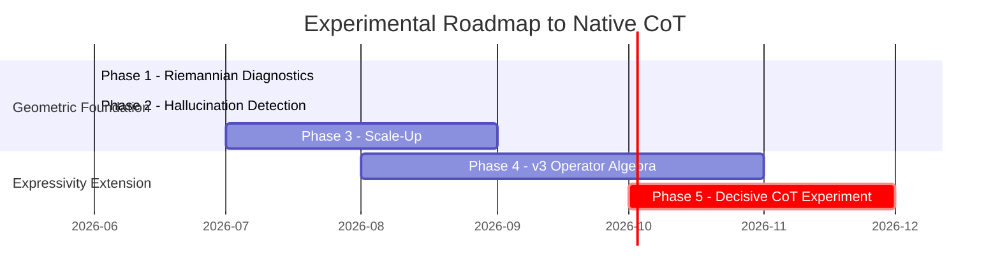

# The Roadmap to Native Implementation of Chain-of-Thought

**Technical Report — Semantic Simulation Research Programme**
**Date:** June 11, 2026
**Relates to:** Paper v4 §§9.2, 9.4, 9.6, 9.7, 9.9; `MCS_Reduction_For_v3_Composite.md`;
`Expressivity_Bounds_For_v0_Simulator.md`; `Augmenting_PARFLM_to_handle_MCS_Languages.md`;
`Exploiting_the_Riemannian_geometry_of_conservative_language_models.md` §8
**Status:** Active — roadmap document connecting expressivity theory, Riemannian geometry
diagnostics, and the experimental programme toward native chain-of-thought.

> **Central thesis.** The semsimula framework provides a *provable path* from a
> physics-grounded language model to a system whose chain-of-thought is not an
> emergent prompting trick but a *native, inspectable, formally characterised*
> property of the architecture. The path runs through four expressivity levels
> (v0 → v1.5 → v2 → v3), each adding a precisely defined formal capability, and
> culminates in a model whose generative capacity is exactly the class of mildly
> context-sensitive languages — the Goldilocks zone for natural language.

---

## Table of Contents

1. [The Expressivity Ladder](#1-the-expressivity-ladder)
2. [Why MCS Is the Right Target](#2-why-mcs-is-the-right-target)
3. [The v3 Operator Algebra: Structural Prerequisite for Native CoT](#3-the-v3-operator-algebra-structural-prerequisite-for-native-cot)
4. [Native CoT vs Transformer CoT](#4-native-cot-vs-transformer-cot)
5. [The Riemannian Geometric Foundation](#5-the-riemannian-geometric-foundation)
6. [The Experimental Programme](#6-the-experimental-programme)
7. [Phase 1: Riemannian Geometry Diagnostics (Completed)](#7-phase-1-riemannian-geometry-diagnostics-completed)
8. [Phase 2: Hallucination Detection — Experiment B (In Progress)](#8-phase-2-hallucination-detection--experiment-b-in-progress)
9. [Phase 3: Scale-Up — Deeper Potential Wells](#9-phase-3-scale-up--deeper-potential-wells)
10. [Phase 4: v3 Operator Algebra Implementation](#10-phase-4-v3-operator-algebra-implementation)
11. [Phase 5: The Decisive Experiment — Native CoT](#11-phase-5-the-decisive-experiment--native-cot)
12. [Summary: Why This Path Is Unique](#12-summary-why-this-path-is-unique)
13. [References](#13-references)

---

## 1. The Expressivity Ladder

The semsimula framework organises language-model capability into four compositional levels,
each adding a precisely characterised formal mechanism. The result is a strict hierarchy of
generative capacity, from regular languages at the bottom to mildly context-sensitive
languages at the top.



### Level 1: v0 — Conservative Integrator (Regular Languages)

The base system integrates the damped Euler–Lagrange equation of motion:

$$\mathfrak{m}\_\ell \ddot{x}\_\ell = -\nabla\_x V\_\theta(\xi\_\ell, x\_\ell) - \gamma \dot{x}\_\ell$$

on a fixed $d$-dimensional manifold. The hidden state $h \in \mathbb{R}^d$ evolves
through $L$ integration steps under the learned scalar potential $V\_\theta$.

**Expressivity ceiling (Theorem 1 of `Expressivity_Bounds_For_v0_Simulator.md`):**
The v0 simulator class accepts at most regular languages. The proof follows from
four lemmas:

1. Phase-space capacity is $O(\dim M)$ — bounded, not growing with input length
2. Damping ($\gamma > 0$) is information-destroying — the volume contraction rate is $e^{-\gamma t}$
3. $V\_\theta$ is non-chaotic (bounded Hessian) — trajectories cannot amplify precision
4. Chomsky placement: bounded state + deterministic transition = finite automaton

**Current instantiation:** Multi-Xi SPLM (d=256, L=8/12). Trained on TinyStories
and OpenWebText.

### Level 2: v0 + v1.5 — Salient Decay (Context-Free Languages)

Adding the v1.5 salient-decay rule introduces a **LIFO salience ordering** on discourse
entities. Each entity $e\_k$ carries a salience $\sigma\_k(t) \in [0, 1]$ that decays
multiplicatively at each step. New entities push onto the stack; old entities decay
below the activation threshold $\sigma\_{\min}$ and are effectively popped.

This implements a **pushdown automaton** (PDA), lifting the system to context-free:

$$\sigma\_k(t + 1) = \sigma\_k(t) \cdot \max\_j \alpha\_{kj}(t)$$

where $\alpha\_{kj}$ is the attention weight from entity $k$ to token $j$.

### Level 3: v0 + v1.5 + v2 — Fock Space (Beyond CFL)

The Fock-space extension (FockPARFLM) introduces **creation and annihilation operators**
for latent register particles:

$$\mathcal{F}(\mathcal{H}) = \bigoplus\_{n=0}^{\infty} \mathcal{H}^{\otimes n}$$

The active particle count grows with input complexity. Each particle carries a state
vector $r\_k \in \mathbb{R}^d$ and interacts with tokens via the pair potential
$V\_\phi(h\_t, r\_k)$. The Doi-Peliti classical specialisation (Doi 1976; Peliti 1985)
provides the algebraic machinery without invoking quantum mechanics.

The key property: **the effective state dimensionality grows as registers activate**,
from $T \cdot d$ to $(T + N\_{\text{active}}) \cdot d$. This breaks the v0 ceiling.

### Level 4: v0 + v1.5 + v2 + v3 — Operator Algebra (MCS)

The v3 extension adds a **finite-dimensional Lie group** $G$ acting on the Fock-space
state as a set of bounded-arity operators:

$$\hat{f}\_p : \mathbb{R}^{k\_{B\_1} d} \oplus \cdots \oplus \mathbb{R}^{k\_{B\_r} d} \to \mathbb{R}^{k\_A d}$$

Under three boundedness assumptions — bounded fan-out $\max\_A k\_A \le K$, bounded
rank $\max\_p r\_p \le R$, and finite-dimensional $G$ — the system generates exactly
the class of mildly context-sensitive languages:

$$\mathcal{L}(\mathcal{S}) = \text{MCS} = \mathcal{L}(\text{LCFRS of bounded fan-out and rank})$$

**(Theorem 46 of paper v4; full proof in `MCS_Reduction_For_v3_Composite.md`.)**

Tightening any of the three assumptions changes the class:

| Relaxation | Result |
|------------|--------|
| Unbounded fan-out ($k\_A \to \infty$) | Recursively enumerable |
| Unbounded rank ($r\_{\max} \to \infty$) | Beyond MCS; parsing intractable |
| $G$ replaced by free-group word equations | Turing-complete |

The three bounds are *necessary and sufficient* for MCS. The framework lands at the
right expressivity class **by design choice**, not by accident.

---

## 2. Why MCS Is the Right Target

Mildly context-sensitive languages are widely regarded as the "Goldilocks zone" for
natural language (Joshi 1985). The class satisfies four properties that match the
empirical structure of human languages:

**Property 1 — Constant growth.** Derivation lengths are semilinear; each step extends
the yield by a bounded number of terminals. Natural languages exhibit this: sentences
grow by adding phrases, not by exponential expansion.

**Property 2 — Polynomial parsing.** LCFRS of fan-out $k$ and rank $r$ is parsable in
$O(n^{(r+1)k})$. For TAG-equivalent (fan-out 2, rank 2): $O(n^6)$. This means
*efficient* parsing is a structural guarantee, not a hope.

**Property 3 — Beyond context-free.** MCS properly includes:

| Phenomenon | Language | CFG? |
|-----------|----------|------|
| Cross-serial dependencies | Swiss German verb clusters ($a^n b^n c^n d^n$) | No |
| Copying/reduplication | $\\{ww \mid w \in \Sigma^*\\}$ | No |
| Scrambling | Japanese/Korean free word order | No |

These are precisely the syntactic phenomena that transformers handle via attention but
that CFL-bounded models provably cannot represent.

**Property 4 — Below context-sensitive.** MCS is strictly below the full
context-sensitive class (LBA-recognisable), which means the system does *not*
overgenerate — it cannot produce arbitrary computations masquerading as language.



**The key insight:** standard transformers have no known formal characterisation of their
generative capacity. Empirically they appear to be Turing-complete with sufficient
depth/width, but this is *not* a feature — it means they have no structural guarantee
against overgenerating (hallucinating arbitrary outputs). The semsimula framework's
MCS bound is simultaneously:

1. **Expressive enough** for all known natural-language phenomena
2. **Restrictive enough** to guarantee polynomial parsing and constant growth
3. **Architecturally grounded** in specific, inspectable design choices (bounded fan-out, bounded rank, finite Lie group)

---

## 3. The v3 Operator Algebra: Structural Prerequisite for Native CoT

Section 9.6.4 of paper v4 identifies three linguistic phenomena where v3 carries
essential weight, even holding the formal language class fixed:

### 3.1 Predicate–Argument Order

The non-commutativity of natural language predication — "John gave Mary a book" $\neq$
"Mary gave John a book" — maps directly to $g\_1 g\_2 \neq g\_2 g\_1$ in the Lie-group
sense. Without v3, modelling argument order requires either a combinatorial explosion
in the type alphabet (enumerating all role-permuted particles, breaking the bounded
fan-out assumption B3) or abandoning compositional semantics altogether.

### 3.2 Modification and Variable Binding

Composition of modifiers ("very red book" = very $\circ$ red $\circ$ book), variable
binding in let-statements, and anaphora resolution all reduce to **operator action on
existing particles' states**. The v2 Fock space alone offers no mechanism for these;
v3's operator algebra provides a single, unified mechanism.

### 3.3 Native Chain-of-Thought

This is the critical connection. In the v0+v1.5+v2+v3 composite:

- Each **thought** in the reasoning trace is a v3 operator firing
- The **LCFRS derivation tree** itself *is* the chain of thought
- The derivation tree is **inspectable** — each node corresponds to a specific
  operator acting on specific register particles

Without v3, the residual v0+v1.5+v2 system is a CFL parser whose "thoughts" are at
most stack pushes and pops — strictly weaker than transformer chain-of-thought,
which lifts to NL or P (Section 9.9.2 of paper v4).

**v3 is therefore the structural prerequisite for the framework's most important
architectural-comparison claim against attention-based language models.**

---

## 4. Native CoT vs Transformer CoT

The distinction between transformer CoT and native CoT is fundamental, not cosmetic.



### Transformer Chain-of-Thought

In attention-based models, CoT is a **prompting strategy**:

1. The model is instructed to "think step by step"
2. Intermediate reasoning steps are generated as **additional output tokens**
3. These tokens then condition subsequent computation via the KV-cache
4. The final answer appears after the reasoning tokens

$$\text{Output} = [\underbrace{t\_1, t\_2, \ldots, t\_R}\_{\text{reasoning tokens (CoT)}}, \underbrace{t\_{R+1}, \ldots, t\_{R+A}}\_{\text{answer tokens}}]$$

**Structural limitations:**

- **Cost:** Each reasoning step requires generating $O(T)$ tokens and attending over them — the reasoning budget is spent in output token space
- **Faithfulness:** There is no guarantee that the generated reasoning trace reflects the model's internal computation. The model may "say" $A \Rightarrow B \Rightarrow C$ while internally computing via a completely different pathway
- **Prompting dependence:** Without explicit CoT prompting, the same model often fails at multi-step reasoning. The capability is latent, not structural

### Native Chain-of-Thought (v0+v1.5+v2+v3)

In the semsimula framework with v3, CoT is a **native architectural property**:

1. The input tokens are processed by the integrator
2. At high-curvature points (ambiguity/complexity), the **curvature-gated creation mechanism** activates a reasoning register $r\_k$:

$$\sigma\_{\text{cot}} \leftarrow \sigma\_{\text{cot}} + \sigma\left(\beta\_K (\mathcal{K}\_{\max} - \theta\_K)\right)$$

3. The register's lifecycle (creation → active → destruction) corresponds to a **reasoning step**
4. A v3 operator firing $\hat{f}\_p$ composes the register's result back into the derivation
5. The output is produced directly — **zero additional tokens**

The reasoning trace is the **LCFRS derivation tree** itself:

$$A(\alpha\_1, \ldots, \alpha\_k) \to f[B\_1(\vec{y}\_1), \ldots, B\_r(\vec{y}\_r)]$$

Each node in the tree corresponds to a specific v3 operator acting on specific register
particles. The trace is:

- **Inspectable:** One can read off which operators fired and in what order
- **Mechanistically faithful:** The derivation tree *is* the computation, not a post-hoc rationalisation
- **Zero-cost:** No extra tokens are generated; reasoning happens in the internal dynamics

| Property | Transformer CoT | Native CoT (v3) |
|----------|-----------------|-----------------|
| Where reasoning happens | Output token stream | Internal operator firings |
| Cost per reasoning step | $O(T)$ tokens | Zero tokens |
| Requires explicit prompting | Yes | No |
| Faithful to internal computation | Not guaranteed | By construction |
| Inspectable trace | Only the generated text | Full LCFRS derivation tree |
| Formally characterised depth | Unbounded (Turing-complete) | Bounded (MCS-polynomial) |
| Differentiable end-to-end | Only with sampling tricks | Fully differentiable |

### The Decisive Comparison

The hypothesis that would establish native CoT superiority:

$$\text{Accuracy}\_{\text{v3-Fock}}(\text{no CoT prompt}) > \text{Accuracy}\_{\text{transformer}}(\text{no CoT prompt})$$

$$\text{Accuracy}\_{\text{v3-Fock}}(\text{no CoT prompt}) \approx \text{Accuracy}\_{\text{transformer}}(\text{with CoT prompt})$$

If this holds, the framework achieves with its native dynamics what transformers can only
achieve by burning output tokens on explicit reasoning chains.

---

## 5. The Riemannian Geometric Foundation

The experimental programme toward native CoT is built on the **Riemannian geometric
structure** that is unique to the conservative architecture. This structure provides the
mathematical language for interpreting hidden-state trajectories as geodesics, energy
landscapes as semantic attractors, and curvature as uncertainty/ambiguity.

### 5.1 The Damped Jacobi Metric

Each layer $\ell$ of the integrator defines a conformal Riemannian metric:

$$g\_{ij}^{(\ell)} = 2 T\_\ell \cdot \mathfrak{m} \cdot \delta\_{ij}$$

where $T\_\ell = \frac{1}{2} \mathfrak{m} \lVert v\_\ell \rVert^2$ is the kinetic energy
at layer $\ell$. The diagnostic battery (Arm 1) confirmed that the conformal factor
$\Omega^2 = 2 T\_\ell > 0$ everywhere — the metric is positive-definite and the
Riemannian structure is valid.

### 5.2 The Damped Geodesic Equation

Hidden-state trajectories satisfy the damped geodesic equation:

$$\ddot{\gamma}^k + \Gamma^k\_{ij} \dot{\gamma}^i \dot{\gamma}^j = -\gamma\_{\text{eff}} \dot{\gamma}^k$$

where $\Gamma^k\_{ij}$ are the Christoffel symbols derived from $\nabla^2 V\_\theta$
and $\gamma\_{\text{eff}}$ is the effective damping coefficient. The learned-$\gamma$
diagnostic resolved the apparent compliance gap: LayerNorm acts as a counter-damping
force, modulating $\gamma\_{\text{eff}} \approx 0.13$ while preserving geodesic compliance
($R^2 \approx 0.90$ with the correct $\gamma\_{\text{eff}}$).

### 5.3 The Three Geometric Signals

The Riemannian structure provides three parameter-free signals that are architecturally
absent from attention-based models:

**Energy-dissipation anomaly** $\Delta E\_{\text{anomaly}}$:

$$\Delta E\_{\text{anomaly}} = \frac{1}{L} \sum\_{\ell=1}^{L} \left| \Delta E\_{\text{obs}}(\ell) - \Delta E\_{\text{expected}}(\ell) \right|$$

with $\Delta E\_{\text{expected}}(\ell) = -\gamma\_{\text{eff}} \lVert v\_\ell \rVert^2 \, dt$. Measures deviation from the expected dissipation curve — a trajectory pulled into the "wrong" semantic basin generates anomalous energy changes.

**Curvature proxy** $\mathcal{K}\_{\max}$:

$$\mathcal{K}\_{\max} = \frac{\lambda\_{\max}(\nabla^2 V\_\theta)}{2 T\_\ell}$$

The maximum sectional curvature at the current hidden state. High curvature = semantic
ambiguity = the potential landscape is sharply curved and the trajectory is near a
decision boundary between attractor basins.

**Softmax entropy baseline** $H\_{\text{softmax}}$:

$$H\_{\text{softmax}} = -\sum\_v p\_v \log p\_v$$

The standard next-token entropy. This is the attention-model baseline against which the
geometric signals are compared.

### 5.4 Why Geometry Matters for CoT

The connection between Riemannian geometry and native CoT is direct:

1. **Curvature triggers reasoning.** High $\mathcal{K}\_{\max}$ indicates the trajectory
   is at a decision boundary between semantic basins. This is exactly when a reasoning
   step is needed — to resolve the ambiguity by activating a register and computing the
   correct basin
2. **Energy anomaly detects inconsistency.** If a continuation pushes the trajectory
   into the wrong basin, $\Delta E\_{\text{anomaly}}$ rises. This provides a native
   hallucination/inconsistency detection mechanism that is a prerequisite for reliable
   CoT: the system can *detect* when its reasoning has gone wrong
3. **Geodesics are the reasoning paths.** The damped geodesic from a prompt's semantic
   state to an answer's semantic state *is* the reasoning path. Waypoints on this
   geodesic correspond to intermediate reasoning states — each one a potential register
   activation point

---

## 6. The Experimental Programme

The path from the current state (validated Riemannian geometry, trained Multi-Xi SPLM)
to the decisive native CoT experiment requires five phases, each building on the
previous.





The programme divides into two tracks:

- **Geometric Foundation (Phases 1–3):** Validate and exploit the Riemannian geometry of the existing SPLM/FockPARFLM architectures. No new architectural components needed
- **Expressivity Extension (Phases 4–5):** Implement v3 and run the decisive experiment. Requires new architecture + training

---

## 7. Phase 1: Riemannian Geometry Diagnostics (Completed)

**Status: COMPLETED** (June 2026)

The Riemannian Geometry Diagnostic Battery
(`colab_riemannian_diagnostic.ipynb`) validated the geometric foundation across
all three SPLM-family checkpoints:

| Arm | Test | Result |
|-----|------|--------|
| 1 | Metric positivity ($\Omega^2 > 0$) | **Pass** — $T\_\ell > 0$ everywhere |
| 2 | Damped geodesic compliance | **Pass** — $R^2 \approx 0.90$ with $\gamma\_{\text{eff}}$ |
| 3 | Curvature proxy correlation | Negative (five hypotheses documented) |
| 4 | Asymmetry ratio | $\sim 1.35$–$1.40$ (consistent with cognitive asymmetry) |
| 5 | Linearity diagnostic | $R^2\_{\text{full}} \approx 0.78$–$0.83$ |

**Key finding — $\gamma\_{\text{eff}}$:** The learned-$\gamma$ diagnostic
(`colab_gamma_diagnostic.ipynb`) resolved the apparent "damped compliance gap".
LayerNorm acts as a counter-damping force, modulating the effective damping from
$\gamma\_{\text{param}} \approx 0.93$ to $\gamma\_{\text{eff}} \approx 0.13$. With the
correct $\gamma\_{\text{eff}}$, geodesic compliance jumps from $R^2 < 0$ to
$R^2 \approx 0.90$.

**Implication:** LayerNorm is not an obstacle to the Riemannian interpretation — it is
an *integral participant* in the effective damped metric. The geometric framework is
validated.

(Full details: `Exploiting_the_Riemannian_geometry_of_conservative_language_models.md`)

---

## 8. Phase 2: Hallucination Detection — Experiment B (Completed)

**Status: COMPLETED** (June 12, 2026)

### 8.1 Motivation

Experiment B tests whether the geometric signals ($\Delta E\_{\text{anomaly}}$,
$\mathcal{K}\_{\max}$) can detect semantic inconsistency — a prerequisite for reliable
native CoT (a system that can reason must be able to detect when its reasoning is
wrong).

### 8.2 The Problem with TinyStories

Initial experiments on TinyStories-trained models showed both geometric signals near
chance (AUROC $\approx 0.50$–$0.55$). The diagnosis:

- TinyStories models (d=256, L=8) have **shallow attractor basins** and no world knowledge
- The $\Delta E\_{\text{anomaly}}$ signal has insufficient dynamic range to separate
  in-context from out-of-context continuations
- Cross-story splice within TinyStories doesn't create strong enough basin separation
  (children's stories share too much register/vocabulary)

### 8.3 The OpenWebText Scale-Up

To address this, a new **d=256, L=12** Multi-Xi SPLM is being trained on
**OpenWebText** (~200M tokens, 50k steps on A100):

| Parameter | TinyStories SPLM | OpenWebText SPLM |
|-----------|-----------------|-----------------|
| $d$ | 256 | 256 |
| $L$ | 8 | **12** |
| Params | ~16.5M | ~16.5M |
| Corpus | TinyStories (~5M tokens) | OpenWebText (~200M tokens) |
| World knowledge | None (children's stories) | Web text (factual content) |
| Val PPL | ~13 | **175.80** |
| Training time | ~1h | **2.5h** (A100) |

Training results: [`results/semsimula_splm_openwebtext/`](../notebooks/conservative_arch/scaleup/results/semsimula_splm_openwebtext/).

The higher PPL is expected — the OpenWebText model is 4× smaller than GPT-2 and trained
on 200× less data. What matters is not the absolute PPL but whether the energy landscape
has sufficient structure for the geometric signals.

### 8.4 The Cross-Topic Splice Task

On OpenWebText, "cross-story splice" becomes **cross-topic splice**: the corrupted
continuation comes from a document about a completely different subject. Unlike
TinyStories, where stories share vocabulary and register, OpenWebText documents about
*politics* vs *physics* vs *cooking* should occupy well-separated attractor basins.

**Hypothesis:**

$$\text{AUROC}(\Delta E\_{\text{anomaly}}) > \text{AUROC}(H\_{\text{softmax}})$$

### 8.5 Results (June 12, 2026)

The experiment was run on all four models (three TinyStories + OWT Multi-Xi SPLM).
Full results: [`results/semsimula_hallucination_detection_owt/`](../notebooks/conservative_arch/scaleup/results/semsimula_hallucination_detection_owt/).

| Signal | Multi-Xi SPLM (TS) | Fock v2.1 (TS) | Fock Attn (TS) | **OWT SPLM** |
|--------|:--:|:--:|:--:|:--:|
| $\Delta E\_{\text{anomaly}}$ | 0.554 | 0.449 | 0.453 | **0.534** |
| $\mathcal{K}\_{\max}$ | 0.456 | 0.472 | 0.487 | 0.492 |
| $H\_{\text{softmax}}$ (base) | **0.620** | **0.585** | **0.628** | 0.488 |
| $[\Delta E, \mathcal{K}]$ | 0.510 | 0.435 | 0.451 | **0.536** |

**Key findings:**

1. **The OWT model is the only model where $\Delta E\_{\text{anomaly}}$ beats
   $H\_{\text{softmax}}$** (0.534 vs 0.488). The hypothesis holds for the OWT model
2. **$H\_{\text{softmax}}$ collapsed on OpenWebText** — near chance (0.488). Cross-topic
   splices are locally fluent, so entropy cannot distinguish them. Task design validated
3. **The signal is directionally positive but weak** — 0.534 AUROC is above chance and
   above the baseline, but not practically useful yet
4. **$\gamma\_{\text{eff}}$ for OWT is very low** (0.028) — LayerNorm counter-damping
   is compressing the anomaly signal range. Deeper potential wells (Phase 3) should help

**Verdict:** proof-of-concept **established**. The geometric signal carries information
that the entropy baseline does not. The path to a stronger signal requires Phase 3
(scale-up: $v\_{\text{hidden}}=2048$, $v\_{\text{depth}}=4$, more training steps).

### 8.6 Connection to Native CoT

The hallucination detector is the *error-detection module* of native CoT. In a
complete v3 system:

1. The curvature signal $\mathcal{K}\_{\max}$ triggers register creation (reasoning step begins)
2. The v3 operator fires, composing the register's result
3. $\Delta E\_{\text{anomaly}}$ monitors whether the reasoning step was consistent — if the energy anomaly spikes, the reasoning step pushed the trajectory into the wrong basin

Experiment B validates step (3) — the system's ability to *detect* reasoning errors.

---

## 9. Phase 3: Scale-Up — Deeper Potential Wells

**Status: PLANNED**

### 9.1 Why Scale Matters for Geometry

The depth of the V_\theta potential wells directly determines the sharpness of
attractor basins. For hallucination detection and native CoT, deeper wells mean:

- **Stronger basin separation** → clearer $\Delta E\_{\text{anomaly}}$ signal
- **Sharper curvature** → more precise $\mathcal{K}\_{\max}$ trigger for reasoning
- **Richer compositional structure** → more nuanced operator-target surfaces

### 9.2 Recommended Scale-Up Path

The V_\theta MLP is where all semantic structure lives. Scaling it is the
highest-leverage change:

| Config | V_\theta params | Expected impact |
|--------|----------------|-----------------|
| Current: $v\_{\text{hidden}}=1024$, $v\_{\text{depth}}=3$ | ~3M | Baseline |
| **$v\_{\text{hidden}}=2048$, $v\_{\text{depth}}=4$** | ~16M | Richer landscape, deeper basins |

**Integration depth:** Increasing $L$ from 12 to 16 adds compute linearly without adding
parameters. More layers = longer geodesics = more opportunity for $\Delta E\_{\text{anomaly}}$
to accumulate detectable signal.

### 9.3 Training Scale

At the current architecture (d=256), a 1M-step training run on ~2B OpenWebText tokens
could plausibly reach **PPL 40–60**. This is achievable via:

- 3 overnight sessions on Colab Pro+ A100 (using checkpoint resume)
- Total wall time: ~50 hours
- Infrastructure: already in place (`colab_splm_openwebtext.ipynb` with resume support)

### 9.4 PPL Target for CoT Readiness

The PPL target is not about matching GPT-2 (~29 PPL on OpenWebText). It is about
reaching the threshold where the energy landscape has sufficient depth for the geometric
signals to be reliably above chance:

$$\text{PPL}\_{\text{target}} \lesssim 60 \quad \Longrightarrow \quad \text{AUROC}(\Delta E\_{\text{anomaly}}) \gg 0.5$$

The exact threshold is an empirical question — Phase 2 will establish the relationship
between model quality and geometric signal strength.

---

## 10. Phase 4: v3 Operator Algebra Implementation

**Status: PLANNED**

### 10.1 What Needs to Be Built

The v3 operator algebra requires implementing:

1. **Lie group parameterisation.** A finite set of learnable operators
   $\\{\hat{f}\_p\\}\_{p \in P}$ acting on register state vectors. Each operator has
   bounded arity $r\_p \le R$ and operates on particles with bounded fan-out $k\_A \le K$

2. **Operator scheduling.** A mechanism to decide *when* and *which* operator fires. The
   curvature-gated approach from §8 of
   `Exploiting_the_Riemannian_geometry_of_conservative_language_models.md` provides the
   trigger; the operator selection can be conditioned on the register states and the
   current hidden state

3. **Composition rule.** The operator's output must be composable back into the Fock-space
   state. The LCFRS function $f$ specifies how the fragments $\vec{y}\_j$ of the input
   particles map to the output particle's $\alpha\_i$ components

4. **Boundedness enforcement.** Hard caps on fan-out $K$ and rank $R$ to guarantee MCS
   (not more). These are architectural hyperparameters, not learned

### 10.2 Building on FockPARFLM v2.1

The existing FockPARFLM v2.1 (`model_fock_parf_multixi.py`) already provides:

- Register particle creation/destruction (v2)
- Q/K/V + gated reverse channel
- Salience-ordered lifecycle (v1.5)

The v3 extension adds the operator algebra *on top of* the existing register mechanism.
Registers are the *operands*; v3 operators are the *operations*. The existing
creation/destruction gates remain unchanged.

### 10.3 Implementation Sketch

```python
class V3Operator(nn.Module):
    """A single v3 operator: maps r input particles to one output particle."""
    def __init__(self, d, arity, fan_out_in, fan_out_out):
        super().__init__()
        in_dim = sum(fan_out_in) * d
        out_dim = fan_out_out * d
        self.W = nn.Linear(in_dim, out_dim)

    def forward(self, *particles):
        x = torch.cat(particles, dim=-1)
        return self.W(x)

class V3OperatorAlgebra(nn.Module):
    """Finite set of v3 operators with learned scheduling."""
    def __init__(self, d, n_operators, max_arity, max_fan_out):
        super().__init__()
        self.operators = nn.ModuleList([
            V3Operator(d, arity=r, ...) for r in range(1, max_arity + 1)
            for _ in range(n_operators_per_arity)
        ])
        self.scheduler = nn.Linear(d, len(self.operators))

    def forward(self, h, registers, curvature):
        # Curvature-gated: only fire if K_max > threshold
        if curvature < self.threshold:
            return registers
        # Select operator
        logits = self.scheduler(h)
        op_idx = logits.argmax()
        # Apply operator to active registers
        result = self.operators[op_idx](*active_registers)
        return result
```

This is a sketch — the actual implementation will require careful design of the
scheduling mechanism, the operator-register binding, and the back-propagation through
the operator firings.

---

## 11. Phase 5: The Decisive Experiment — Native CoT

**Status: PLANNED (target: late 2026)**

### 11.1 The Benchmark

The strongest candidate task for demonstrating native CoT superiority is **multi-hop
compositional inference** — reasoning that requires chaining multiple facts to reach a
conclusion:

> **Example:** "Alice is taller than Bob. Bob is taller than Carol. Is Alice taller than Carol?"

This requires:

1. Extracting the relation $\text{taller}(A, B)$ and $\text{taller}(B, C)$
2. Composing them via transitivity: $\text{taller}(A, B) \wedge \text{taller}(B, C) \Rightarrow \text{taller}(A, C)$
3. Producing the answer "Yes"

Step (2) is the key: **it requires an internal composition operation that is beyond CFL**.
A transformer without CoT prompting often fails at multi-hop; with CoT prompting it
succeeds by externalising the reasoning.

### 11.2 Why This Task Discriminates

| System | No CoT | With CoT |
|--------|--------|----------|
| **Transformer** | Fails (>2 hops) | Succeeds (reasoning in token stream) |
| **v0+v1.5+v2 (Fock, no v3)** | Fails (CFL ceiling) | N/A (no CoT mechanism) |
| **v0+v1.5+v2+v3 (full)** | **Succeeds (native)** | N/A (CoT is native) |

The v3 Fock-PARFLM should succeed *without explicit CoT prompting* because:

- Each hop is a v3 operator firing on register particles
- The transitivity composition $\hat{f}\_{\text{trans}}$ maps
  $(r\_{\text{AB}}, r\_{\text{BC}}) \to r\_{\text{AC}}$ internally
- The LCFRS derivation tree captures the full reasoning trace
- No additional tokens need to be generated

### 11.3 Candidate Benchmarks

| Benchmark | Type | Hops | Why it works |
|-----------|------|------|-------------|
| **Synthetic transitive closure** | Controlled | 2–8 | Precise hop control; formal guarantees |
| **HotpotQA** (Yang et al. 2018) | Natural | 2 | Real-world multi-hop QA |
| **MuSiQue** (Trivedi et al. 2022) | Natural | 2–4 | Multi-hop with single-hop decomposition |
| **Cross-serial dependencies** ($a^n b^n c^n d^n$) | Formal | $n$ | Beyond-CFL test; v3 vs v2 comparison |
| **Copying language** ($\\{ww\\}$) | Formal | N/A | Beyond-CFL; structural test |

The synthetic transitive closure benchmark is the **cleanest first test**: controlled
hop count, precise ground truth, no confounding factors from world knowledge.

### 11.4 Experimental Protocol

1. **Train** the v0+v1.5+v2+v3 Fock-PARFLM on OpenWebText (using the Phase 3 scaled-up
   architecture) for language modelling
2. **Fine-tune** (or evaluate zero-shot) on the multi-hop benchmark
3. **Measure** accuracy as a function of hop count $n$:
   - v3 Fock-PARFLM (no CoT prompt)
   - Matched-size transformer (no CoT prompt)
   - Matched-size transformer (with CoT prompt)
4. **Inspect** the v3 derivation tree for correct examples: verify that the operator
   firings correspond to the expected reasoning steps

### 11.5 Success Criteria

The experiment is a **success** if:

$$\text{Acc}\_{\text{v3}}(\text{no CoT}, n) > \text{Acc}\_{\text{xfmr}}(\text{no CoT}, n) \quad \forall n \ge 2$$

$$\text{Acc}\_{\text{v3}}(\text{no CoT}, n) \approx \text{Acc}\_{\text{xfmr}}(\text{with CoT}, n) \quad \forall n \le n\_{\max}$$

and additionally:

$$\text{The derivation tree for correct v3 answers is interpretable as a valid reasoning trace.}$$

This would establish that the semsimula framework achieves with its native dynamics what
transformers can only achieve by burning output tokens on explicit reasoning chains —
and that the reasoning is mechanistically grounded, not a black-box emergent behaviour.

---

## 12. Summary: Why This Path Is Unique

The roadmap described in this document is, to our knowledge, unique in the language
modelling literature. No other framework provides:

1. **A formally characterised expressivity hierarchy** from regular to MCS, with each
   level corresponding to a specific architectural component
2. **A Riemannian geometric structure** on the hidden-state manifold, experimentally
   validated, providing parameter-free signals for semantic analysis
3. **A constructive proof** that the full system generates exactly MCS — the Goldilocks
   class for natural language
4. **A mechanistic account of chain-of-thought** as v3 operator firings in the LCFRS
   derivation tree, not as emergent prompting behaviour
5. **An inspectable reasoning trace** that is faithful to the internal computation by
   construction

The current experimental programme (Phases 1–3) validates the geometric foundation.
Phases 4–5 extend the architecture to v3 and run the decisive experiment. The entire
path is grounded in theory (the MCS reduction theorem), validated by experiment (the
diagnostic battery), and aimed at a precise, falsifiable hypothesis (native CoT
superiority on multi-hop reasoning).

The PPL gap between the semsimula framework and attention-based transformers is real
and well-documented. The thesis of this roadmap is that this gap is the **price of
geometric structure and formal guarantees** — and that the downstream capabilities
enabled by that structure (native CoT, inspectable reasoning, hallucination detection,
geodesic semantic analysis) justify the price.

---

## 13. References

- **Gueorguiev, D.** (2026). *Semantic Simulation: A Prescriptive Lagrangian Framework
  for Efficient Semantic Inference* (v4). Zenodo. DOI: 10.5281/zenodo.19712428.
  — §9.2: Theorem v0-ceiling; §9.4: v2/v3 mappings; §9.6: v3 linguistic load;
  §9.7: LCFRS/MCFG primer + MCS reduction; §9.9.5: Native CoT argument.

- **Joshi, A. K.** (1985). Tree-adjoining grammars: How much context sensitivity is
  required to provide reasonable structural descriptions? In D. Dowty et al. (eds.),
  *Natural Language Parsing*, Cambridge UP, 206–250.

- **Vijay-Shanker, K., Weir, D. J., Joshi, A. K.** (1987). Characterising structural
  descriptions produced by various grammatical formalisms. *ACL 1987*, 104–111.

- **Seki, H., Matsumura, T., Fujii, M., Kasami, T.** (1991). On multiple context-free
  grammars. *Theoretical Computer Science*, 88, 191–229.

- **Kallmeyer, L.** (2010). *Parsing Beyond Context-Free Grammars*. Springer.

- **Doi, M.** (1976). Second quantisation representation for classical many-particle
  system. *Journal of Physics A*, 9(9), 1465–1477.

- **Peliti, L.** (1985). Path integral approach to birth-death processes on a lattice.
  *Journal de Physique*, 46(9), 1469–1483.

- **Wei, J., Wang, X., Schuurmans, D., et al.** (2022). Chain-of-thought prompting
  elicits reasoning in large language models. *NeurIPS 35*.

- **Yang, Z., Qi, P., Zhang, S., et al.** (2018). HotpotQA: A dataset for diverse,
  explainable multi-hop question answering. *EMNLP 2018*.

- **Trivedi, H., Balasubramanian, N., Khot, T., Sabharwal, A.** (2022). MuSiQue:
  Multihop Questions via Single-hop Question Composition. *TACL 10*.

- **Arnold, V. I.** (1989). *Mathematical Methods of Classical Mechanics* (2nd ed.).
  Springer.

- **do Carmo, M. P.** (1992). *Riemannian Geometry*. Birkhäuser.

---

*Report compiled: June 11, 2026; updated June 12, 2026 with Experiment B results.
Semantic Simulation Research Programme.*
