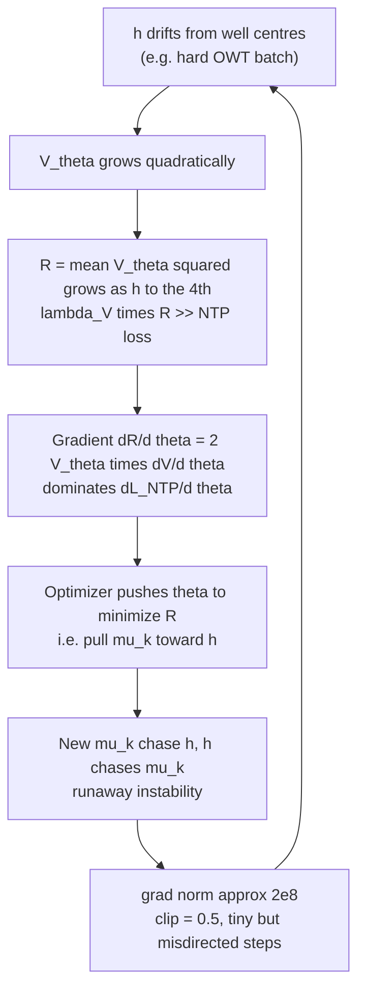
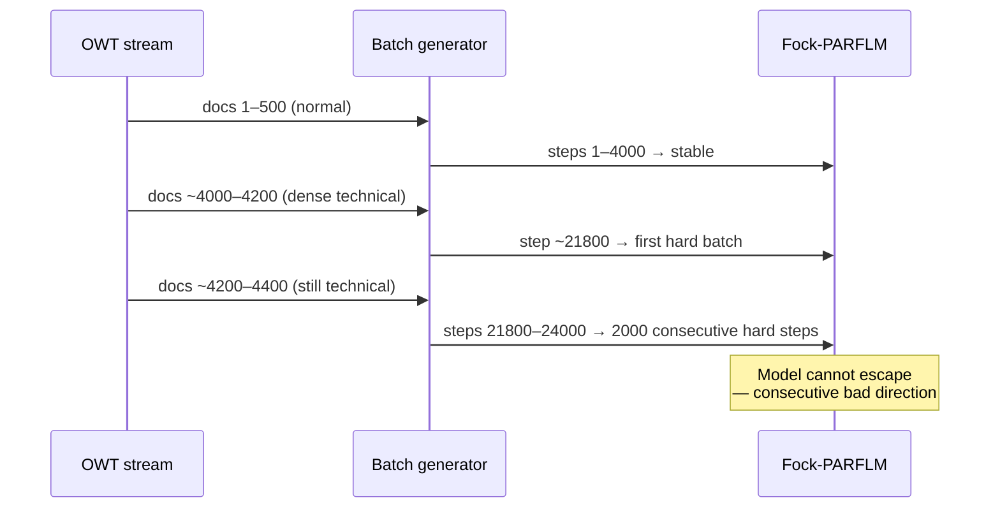
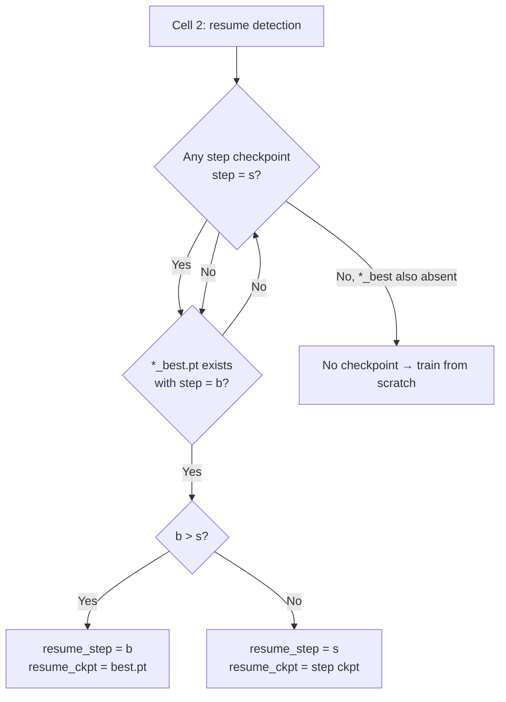
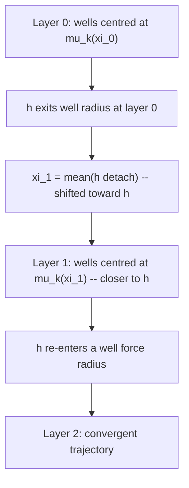
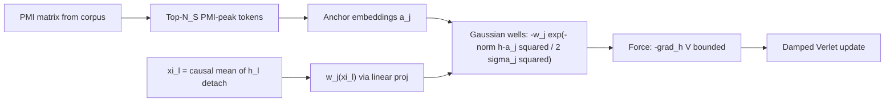
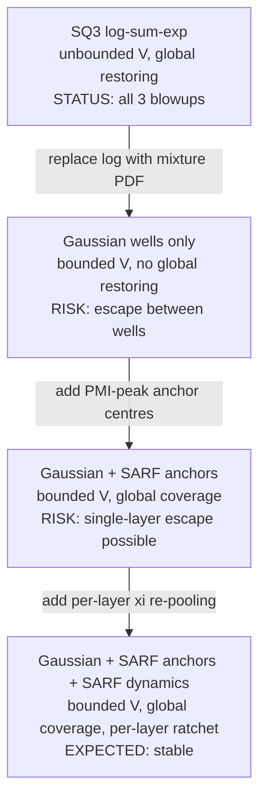

# Training Instabilities in Fock-PARFLM v2.1 with Structured V_θ

**Status:** Internal working note — do not push to remote. 
**Experiment:** OpenWebText Phase 4 scale-up, `d=384`, `L=16`, `M=32`, SQ3 `K_mix=8`. 
**Date:** June 2026

---

## Table of Contents

1. [Background](#1-background)
2. [Blowup 1 — Penalty Dominance](#2-blowup-1--penalty-dominance)
3. [Blowup 2 — Directional Instability](#3-blowup-2--directional-instability)
4. [Blowup 3 — EMA Watchdog Miscalibration](#4-blowup-3--ema-watchdog-miscalibration)
5. [Why Fock-PARFLM is More Susceptible than SPLM](#5-why-fock-parflm-is-more-susceptible-than-splm)
6. [Fixes Applied and Their Mathematical Justification](#6-fixes-applied-and-their-mathematical-justification)
7. [EMA Watchdog Design](#7-ema-watchdog-design)
8. [Residual Risk and Recommendations](#8-residual-risk-and-recommendations)
9. [Architectural Path Forward: Gaussian Wells with SARF Anchors](#9-architectural-path-forward-gaussian-wells-with-sarf-anchors)

---

## 1. Background

### Architecture

The SQ3 structured V_θ replaces the MLP scalar potential with a
$K_{\mathrm{mix}}$-component mixture of diagonal quadratic wells:

$$
V_\theta(\xi, h) = -\tau \log\sum_{k=1}^{K} \pi_k(\xi) 
\exp\left(-\frac{E_k(\xi, h)}{\tau}\right) + b(\xi)
$$

where the per-component energy is

$$
E_k(\xi, h) = \tfrac{1}{2} a_k(\xi)^\top (h - \mu_k(\xi))^2, \qquad a_k > 0.
$$

The attractor centres $\mu_k(\xi)$ and precisions $a_k(\xi)$ are linear
projections of the flattened multi-xi context
$\xi_{\mathrm{flat}}$ which is the flattened multi-xi vector
in $\mathbb{R}^{K_\xi d}$.

**Key structural fact:** $V_\theta$ is quadratic in $h$ and has **no upper bound**. As $\lVert h - \mu_k \rVert$ grows, every $E_k$ grows without limit, and
so does $V_\theta$.

### The regulariser

To prevent the learned potential from becoming arbitrarily flat (zero-force
landscape), we add a penalty term to the training loss:

$$
\mathcal{L} = \mathcal{L}_{\mathrm{NTP}} + \lambda_V \cdot \mathcal{R}(V_\theta)
$$

with $\lambda_V = 0.01$. The choice of $\mathcal{R}$ is the source of both
blowups.

### Training setup

| Parameter | Value |
|-----------|-------|
| `d` | 384 |
| `L` | 16 |
| `M` (Fock registers) | 32 |
| `K_mix` | 8 |
| `K_xi` | 4 |
| Corpus | OpenWebText ~200M tokens |
| Total steps | 200,000 |

---

## 2. Blowup 1 — Penalty Dominance

### Symptom (step ~5,200)

```
step 5200 ntp=10.52 v_reg=27770.6 lr=3.00e-04 grad=216,392,624
step 5400 ntp= 9.91 v_reg=18680.0 lr=3.00e-04 grad= 51,402,900
step 5600 ntp=10.27 v_reg=232,649 lr=3.00e-04 grad= 601,585
```

The model never recovered. Val PPL went from ~535 (step 4k) to 106,078 (step 20k).

### Root cause: unbounded mean(V_θ²)

The original regulariser was:

$$
\mathcal{R}_{\mathrm{quad}}(V_\theta) = \mathbb{E}_{x,h}\bigl[V_\theta(\xi, h)^2\bigr]
$$

This is computed as a batch mean. A **single token** whose hidden state
$h$ drifts far from every well centre produces:

$$
V_\theta(\xi, h) \approx \tfrac{1}{2} \min_k a_k^\top(h-\mu_k)^2
 \sim \lVert h \rVert^2 \quad \text{(quadratic in } \lVert h \rVert)
$$

so $V_\theta^2 \sim \lVert h \rVert^4$. One outlier token with $\lVert h \rVert \approx 10$
contributes $\sim 10^4$ to $\mathcal{R}_{\mathrm{quad}}$, pulling
$\lambda_V \cdot \mathcal{R} \approx 100$ — far exceeding the NTP loss of
$\sim 10$ nats.

### The feedback loop



The critical insight is that **gradient clipping cannot stop this loop**.
Clipping bounds the step size but not the direction. Once
$\lambda_V \mathcal{R} \gg \mathcal{L}_{\mathrm{NTP}}$, every clipped step
points toward reducing $\mathcal{R}$ (pulling attractor centres toward
the outlier hidden states), which does not reduce NTP loss. The model is
trapped.

### Gradient of the original penalty

$$
\frac{\partial}{\partial \theta}\bigl(\lambda_V V_\theta^2\bigr)
 = 2\lambda_V V_\theta \cdot \frac{\partial V_\theta}{\partial \theta}
 \propto V_\theta
$$

Since $V_\theta$ is unbounded, so is this gradient — the penalty is a
**linearly amplified** version of the already-large force, making recovery
impossible once the runaway starts.

---

## 3. Blowup 2 — Directional Instability

After applying the `log1p` fix (Section 5), a second, structurally different
instability occurred at step ~22,000.

### Symptom (step ~21,800–24,000)

```
step 21800 ntp=5.670 v_reg=1.23 grad=214.28 ← first spike
step 22000 EVAL val_ppl=301.75 best=268.84 ← regression
step 22600 ntp=6.193 v_reg=2.74 grad=167.78
step 23200 ntp=6.624 v_reg=4.98 grad= 93.79
step 24000 EVAL val_ppl=388.65 best=268.84 ← continued regression
```

This time: `v_reg` peaked at ~5 (not 2×10⁵), `grad_norm` peaked at 214
(not 2×10⁸), NTP reached 6.7 (not 16+). The log1p fix contained the
severity, but the model failed to self-correct over 2,000+ affected steps.

### Root cause: directional persistence under gradient clipping

`clip_grad_norm_` rescales the gradient vector $g$ as:

$$
\hat{g} = g \cdot \frac{\min(\lVert g \rVert, C)}{\lVert g \rVert}
$$

so the applied update has magnitude exactly $\min(\lVert g \rVert, C)$. With
$\lVert g \rVert = 214$ and $C = 0.5$:

$$
\hat{g} = g \cdot \frac{0.5}{214} \approx 0.0023 g
$$

The step is tiny, but it points in the **same direction as** $g$. The
direction of $g$ is determined by which loss component dominates, and
when the Verlet backward graph is deep, a hard batch can induce a gradient
direction that is persistently destabilizing even at tiny step sizes.

### Why it did not self-correct

At step ~21,800 a hard batch produced $\lVert g \rVert = 214$. The clipped update
moved parameters by $0.5/214 \approx 0.002$ in that direction. If the
next batch is also hard (OWT is streamed sequentially — consecutive batches
share document context), the direction accumulates. Over 2,000 steps the
cumulative displacement from the best basin is:

$$
\Delta\theta_{\mathrm{cum}} \approx \sum_{t=T_0}^{T_0+2000} \hat{g}_t
 \sim 2000 \times 0.5 = 1000 \quad \text{(in gradient units)}
$$

This is enough to move a 31.5M-parameter model substantially out of the
basin of attraction reached at step 20k. Because the cosine-decay LR was
still near its maximum (only 7% decay had occurred by step 22k of a 200k
run), the effective step size was not diminishing fast enough to contain
the drift.

### The OWT sequential streaming factor

OpenWebText is streamed document-by-document. Within a run, the model sees
the same sequence of documents in the same order. This means:



On TinyStories (i.i.d. story chunks), a hard batch at step $t$ is
statistically independent from the batch at step $t+1$, so the
destabilizing directions partially cancel. On OWT they are correlated.

---

## 4. Blowup 3 — EMA Watchdog Miscalibration

After applying all Blowup-2 fixes (log1p regulariser, LR 1.5×10⁻⁴, clip 0.3, EMA
watchdog), training resumed from the step-20k checkpoint (PPL 268.84) and
immediately made genuine progress, reaching a new best PPL of **252.75 at
step 22,000**. Two thousand steps later the model had diverged to PPL 367.98. The
watchdog never fired.

### Symptom (steps 22,000 – 24,000)

```
step 22000 EVAL val_ppl=252.75 *** NEW BEST *** ← checkpoint saved
step 22200 ntp=5.6232 v_reg=1.044 grad= 1.19
step 22400 ntp=5.6164 v_reg=1.171 grad= 1.33
step 22600 ntp=5.6311 v_reg=1.267 grad= 1.31
step 22800 ntp=5.6398 v_reg=1.291 grad= 3.37 ← first elevated spike
step 23000 ntp=5.6362 v_reg=1.279 grad= 1.22
step 23200 ntp=5.6439 v_reg=1.260 grad= 2.14
step 23400 ntp=5.7605 v_reg=1.717 grad= 3.52 ← inflection point
step 23600 ntp=5.6823 v_reg=1.263 grad= 2.66
step 23800 ntp=5.7243 v_reg=1.298 grad= 5.05
step 24000 ntp=5.8080 v_reg=1.527 grad=16.76 ← confirmed blowup
step 24000 EVAL val_ppl=367.98 best=252.75 ← 45% regression
```

This blowup is structurally different from Blowup 2. The gradients are
moderate (peak 16.76, not 214), `v_reg` stays below 1.8 (not 5), and the
onset is gradual — a slow escalation over 2,000 steps rather than a sudden
spike.

### Root cause: the EMA threshold was mathematically unreachable

The watchdog parameters were:

```python
GRAD_NORM_EMA_ALPHA = 0.02 # slow EMA (~50-step memory)
GRAD_NORM_EMA_THRESHOLD = 50.0 # EMA > 50 → consider unstable
GRAD_NORM_EMA_PATIENCE = 100
```

The EMA update is:

$$
\bar{g}_t = (1 - 0.02) \bar{g}_{t-1} + 0.02 \hat{g}_t
= 0.98 \bar{g}_{t-1} + 0.02 \hat{g}_t
$$

The **steady-state** value of the EMA when the gradient is held constant at
$\hat{g}$ is exactly $\hat{g}$ itself. But with $\alpha = 0.02$ the
convergence is slow: from a baseline of 1.3, even 100 consecutive steps at
$\hat{g} = 17$ bring the EMA to only:

$$
\bar{g}_{100} = 17\bigl(1 - 0.98^{100}\bigr) + 1.3 \times 0.98^{100}
 \approx 17 \times 0.87 + 1.3 \times 0.13 \approx 14.9 + 0.17 \approx 15.1
$$

The threshold of 50 requires **sustained** gradients of at least 50 for
hundreds of steps — far above anything this model produces. Working through
the actual log, the EMA stayed near its baseline throughout the blowup:

| Step | grad | EMA (α=0.02, cumulative) |
|---|---|---|
| baseline 22200–23000 | 1.0–1.4 | ~1.30 |
| 22800 | 3.37 | 1.34 |
| 23200 | 2.14 | 1.36 |
| 23400 | 3.52 | 1.40 |
| 23800 | 5.05 | 1.50 |
| 24000 | **16.76** | **~1.81** |

**The EMA peaked at roughly 1.81. The threshold was 50.0. The watchdog was
effectively disabled for this model's gradient scale.** The threshold
calibration was borrowed from a setting where gradient norms could reach
50–200 (as in Blowup 2); after the LR and clip reductions, the gradient
scale shrank to 1–17, making the old threshold permanently unreachable.

### The slow-escalation pattern

Unlike Blowup 2 (single catastrophic spike), Blowup 3 is a
**slow directional drift**: v_reg creeps up from 1.04 to 1.72, ntp rises
from 5.61 to 5.81, and the gradient norm escalates over 2,000 steps. This
pattern is exactly what the EMA watchdog was designed to catch — but only
if the threshold is calibrated to the actual gradient scale.

The inflection point at step 23,400 (ntp jumps from 5.64 to 5.76, v_reg
from 1.26 to 1.72) suggests a particularly hard OWT batch knocked the model
onto a diverging trajectory. The partial recovery at step 23,600 (ntp
falls back to 5.68) is deceptive: the model was already displaced from the
good basin and continued to drift.

---

## 5. Why Fock-PARFLM is More Susceptible than SPLM

The Multi-Xi SPLM at the same `d=384`, `L=16` never exhibited these
instabilities at `LR=3e-4` and `clip=0.5`. The Fock architecture has four
additional instability sources:


| Component | SPLM | Fock-PARFLM v2.1 | Instability mechanism |
|-----------|------|------------------|-----------------------|
| V_θ force | $-\nabla_h V_\theta$ | same | quadratic, unbounded |
| V_φ routing | — | Gumbel-softmax top-k | stochastic routes add gradient noise; wrong routes persist for a full Verlet step |
| Fock registers | — | M=32 register particles | 32 extra hidden states through L=16 backward graph; register creation/destruction gates add non-differentiable-like switching |
| Per-register τ | — | learnable temperature | τ drift can make routing sharper mid-training, amplifying the Gumbel noise |
| Reverse channel | — | non-conservative Q_i | no energy conservation guarantee; small errors in Q_i can compound across layers |

### Effective backward graph depth

For the SPLM with L layers the backward graph is roughly:

$$
\text{depth}_{\mathrm{SPLM}} \approx L \times d^2
$$

For Fock-PARFLM v2.1, each layer has Verlet step + V_φ routing
(top-k gather) + Fock register dynamics + reverse channel. A conservative
estimate:

$$
\text{depth}_{\mathrm{Fock}} \approx L \times \bigl(d^2 + 2 d k + M d + d^2\bigr)
 \approx 4\text{–}5 \times \text{depth}_{\mathrm{SPLM}}
$$

Same `grad_clip` → same magnitude bound, but 4–5× longer backward path →
a destabilizing gradient direction persists 4–5× longer before it is washed
out by the curvature of subsequent batches.

---

## 6. Fixes Applied and Their Mathematical Justification

### Fix 1: Bounded regulariser — log1p(V_θ²)

**Applied after Blowup 1.**

Replace $\mathcal{R}_{\mathrm{quad}} = \mathbb{E}[V_\theta^2]$ with:

$$
\mathcal{R}_{\mathrm{log}}(V_\theta)
 = \mathbb{E}\bigl[\log(1 + V_\theta^2)\bigr]
$$


**Why it works:**

1. **Normal regime equivalence.** For $|V_\theta| \ll 1$:
 $\log(1+V^2) \approx V^2$, so the landscape compression is identical.

2. **Gradient bound.** The gradient with respect to $V_\theta$ is:

$$
\frac{d}{dV}\log(1+V^2) = \frac{2V}{1+V^2}
$$

 This is bounded by $\left|\frac{2V}{1+V^2}\right| \leq 1$ for all
 $V \in \mathbb{R}$, with the maximum at $V=1$. Therefore:

$$
\lambda_V \cdot \frac{\partial \mathcal{R}_{\mathrm{log}}}{\partial \theta}
 \leq \lambda_V \cdot \mathbb{E}\left[\frac{\partial V_\theta}{\partial \theta}\right]
$$

 and the penalty contribution to the total gradient is bounded by
 $\lambda_V$ times the mean magnitude of $\partial V_\theta / \partial\theta$.
 It **cannot** exceed the NTP gradient unless $\lambda_V \gg 1$.

3. **No runaway.** The penalty loss itself is bounded: as $|V_\theta| \to \infty$,
 $\log(1+V^2) \to \log V^2 = 2\log V$, which grows only logarithmically.
 A batch where $V_\theta = 1000$ contributes $\log(10^6+1) \approx 13.8$
 to the penalty, not $10^6$.

**Observed effect:** `v_reg` (now `mean(log1p(V²))`) stabilised at 1.0–1.5
throughout training (vs. 2×10⁵ in the first run).

---

### Fix 2: Lower max LR and tighter grad_clip

**Applied after Blowup 2; tightened again after Blowup 3 (Fix 4).**

| Parameter | Blowup 1 run | After Fix 1 | After Fix 2 | After Fix 4 |
|-----------|-------------|-------------|-------------|-------------|
| `LR` | 3×10⁻⁴ | 2×10⁻⁴ | 1.5×10⁻⁴ | **1.2×10⁻⁴** |
| `GRAD_CLIP` | 0.5 | 0.5 | 0.3 | **0.25** |
| `WARMUP_STEPS` | 5,000 | 8,000 | 8,000 | 8,000 |

**Motivation:**

For a hard batch with $\lVert g \rVert = G$ and clip threshold $C$, the
applied step in any direction is at most:

$$
\lVert \Delta\theta \rVert \leq \eta_t \cdot C
$$

where $\eta_t$ is the learning rate at step $t$. After the cosine
schedule with $\eta_{\max}$ and warmup $T_w$:

$$
\eta_t = \frac{\eta_{\max}}{2}\left(1 + \cos\left(\pi \frac{t-T_w}{T-T_w}\right)\right)
$$

At step 22k of a 200k run (warmup at 8k):

$$
\text{progress} = \frac{22000-8000}{200000-8000} \approx 0.073
\quad\Rightarrow\quad
\eta_{22k} \approx 0.997 \eta_{\max} \approx \eta_{\max}
$$

The cosine schedule had barely started decaying. The maximum per-step
displacement in any direction is:

$$
\lVert \Delta\theta_{\max} \rVert = \eta_{\max} \cdot C
 = \begin{cases}
2\times10^{-4} \times 0.5 = 1\times10^{-4} & \text{(Blowup 2 run)} \\
1.5\times10^{-4} \times 0.3 = 4.5\times10^{-5} & \text{(current run)}
\end{cases}
$$

The new maximum displacement is **2.2× smaller**. Over 100 consecutive hard
steps the cumulative drift in a destabilizing direction is:

$$
\lVert \Delta\theta_{\mathrm{cum}} \rVert
 \lesssim 100 \times 4.5\times10^{-5} = 4.5\times10^{-3}
\quad\text{(vs.} 1\times10^{-2}\text{ before)}
$$

This keeps the model closer to the good basin and makes self-correction
by subsequent normal batches more likely.

---

### Fix 3: Auto-resume from \*\_best.pt (Cell 2)


Cell 2 now checks both the periodic step checkpoints and `*_best.pt`,
selecting whichever is **more recent**:



This means: if a blowup occurs **between** two 25k periodic checkpoints,
the next session automatically recovers the pre-blowup weights without any
manual Drive file operations.

---

### Fix 4: EMA Watchdog Recalibration

**Applied after Blowup 3.**

The three watchdog parameters were recalibrated to the actual gradient scale
of the model after the Fix-2 LR and clip reductions:

| Parameter | Before (broken) | After (calibrated) | Rationale |
|-----------|-----------------|-------------------|-----------|
| `GRAD_NORM_EMA_ALPHA` | 0.02 | **0.05** | Faster EMA (~20-step memory vs 50-step); catches escalation before it fully develops |
| `GRAD_NORM_EMA_THRESHOLD` | 50.0 | **3.5** | Baseline EMA is ~1.3–1.5; threshold = 2.5× baseline; old value of 50 was 35× baseline and permanently unreachable |
| `GRAD_NORM_EMA_PATIENCE` | 100 | **30** | Catch a sustained instability in 30 steps; 100 steps gave the model too long to drift |

Additionally `LR` was reduced from 1.5×10⁻⁴ to **1.2×10⁻⁴** and `GRAD_CLIP`
from 0.3 to **0.25** to further reduce the per-step displacement during any
hard-batch streak that does occur before the watchdog fires.

**Calibration derivation.** With the new parameters, the EMA at steady state
for a sustained gradient of $G$ converges to $G$ itself. With
$\alpha = 0.05$ and the new threshold $\tau = 3.5$:

- **Normal training** (grad ~1.3): EMA steady-state ≈ 1.3. Well below threshold.
- **Single spike** (grad = 7.6 at step 21,400 followed by immediate recovery): EMA
 reaches ≈ 1.6 in one step, falls back next step. Never approaches 3.5 for
 30 consecutive steps → watchdog does not fire.
- **Slow escalation as in Blowup 3** (grads of 2–5 sustained for 200+ steps):
 EMA converges toward 3–5. Threshold crossed within ~50–100 steps → watchdog
 fires and reloads the best checkpoint before the val PPL degrades further.

---

## 7. EMA Watchdog Design

The EMA watchdog detects a soft-instability spiral before the next periodic
checkpoint is written with corrupted weights.

**Algorithm (parameters after Fix 4):**

Let $\hat{g}_t = \lVert g_t \rVert$ (raw gradient norm before clipping) at step $t$.
Maintain an exponential moving average:

$$
\bar{g}_t = (1-\alpha) \bar{g}_{t-1} + \alpha \hat{g}_t,
\qquad \alpha = 0.05 \text{(~20-step memory)}
$$

Maintain a counter $c_t$:

$$
c_t = \begin{cases}
c_{t-1} + 1 & \text{if } \bar{g}_t > \tau_g \\\\
0 & \text{otherwise}
\end{cases}
\qquad \tau_g = 3.5
$$

If $c_t \geq P = 30$ (30 consecutive steps above threshold):
1. Log the event.
2. Call `_reload_best_checkpoint()` — loads `*_best.pt` into `model` and `optim` in-place.
3. Reset $\bar{g}_t = 0$, $c_t = 0$.
4. Continue training from the next step (LR schedule is unchanged — no warmup repeat).

**Threshold calibration (after Fix 4):**

| Regime | Typical grad | EMA (α=0.05) steady state | Triggers? |
|--------|-------------|--------------------------|-----------|
| Normal training | 1.0–1.5 | ~1.3–1.5 | No (below 3.5) |
| Single spike then recovery | 7–16, then 1.3 | peaks ~1.6–2.0, decays immediately | No (stays below 3.5 within ~10 steps) |
| Slow escalation (Blowup 3 pattern) | 2–5 sustained | converges toward 3–5 | Yes, within 50–100 steps |
| Acute blowup (Blowup 2 pattern) | 50–214 | immediately > 3.5 | Yes, within 1–2 steps |

**Why the original parameters (α=0.02, τ=50) failed (Blowup 3):**

The gradient scale after Blowup-2 fixes (LR 1.5×10⁻⁴, clip 0.3) settled at
1–17. The old threshold of 50 required sustained gradients of 50+ to produce
an EMA above 50 — a condition that never occurred after the fixes. The EMA
peaked at ~1.81 during the entire Blowup 3 event. The design rule is:

$$
\tau_g \approx 2\text{–}3 \times \bar{g}_{\mathrm{baseline}}
$$

With baseline EMA ≈ 1.4, this gives τ ≈ 2.8–4.2; the chosen value is 3.5.

**Failure mode check:** If `*_best.pt` does not exist (first session, no eval
yet), the watchdog logs a warning and continues — it cannot roll back. This
is fine because the first eval at step 2,000 writes `*_best.pt`, after which
the watchdog has a recovery target.

---


## 8. Residual Risk and Recommendations

### Remaining instability sources

After all four fixes, the following risks remain:

1. **Hard-batch streak that exceeds the watchdog patience.** With
 `PATIENCE=30`, a sustained streak of fewer than 30 steps above the EMA
 threshold will not trigger a reload. Because OWT documents are streamed
 sequentially, correlated hard batches can run for hundreds of consecutive
 steps; however, the tighter clip (0.25) and lower LR (1.2×10⁻⁴) reduce
 the per-step damage while the watchdog waits.

2. **Post-cosine-peak LR** is still ~1.2×10⁻⁴ at step 20k (only ~7% decay).
 The schedule will not meaningfully reduce LR until ~50k+ steps. Any third
 hard OWT region encountered before that point relies on the watchdog to
 absorb it.

3. **Fock register salience** can drift during a hard streak (register
 particles may incorrectly gain/lose salience). Even after reloading
 `*_best.pt`, the salience state is restored from the checkpoint, so this
 is recoverable.

4. **Watchdog threshold drift.** If training genuinely improves and the
 gradient scale drops further (e.g., to ~0.7), the current threshold of
 3.5 may become overly sensitive (≈5× baseline). Conversely, if a new
 phase of training raises the baseline, the threshold may need
 recalibrating again. The design rule τ ≈ 2.5× baseline should be
 re-checked at every major training milestone.

### Recommendations for future Fock+structured V_θ scale-ups

| Lever | After Fix 4 | Recommended for 1M-step run |
|-------|-------------|------------------------------|
| `LR_max` | 1.2×10⁻⁴ | 1.0×10⁻⁴ |
| `GRAD_CLIP` | 0.25 | 0.2 |
| `WARMUP_STEPS` | 8,000 | 10,000–15,000 |
| `CKPT_INTERVAL` | 25,000 | 10,000 (more frequent saves) |
| `lambda_V` ramp | constant 0.01 | ramp 0→0.01 over first 2k steps |
| `GRAD_NORM_EMA_ALPHA` | 0.05 | 0.05–0.10 |
| `GRAD_NORM_EMA_THRESHOLD` | 3.5 | 2.5× baseline EMA (re-measure at 10k) |
| `GRAD_NORM_EMA_PATIENCE` | 30 | 20–30 |
| Penalty | log1p(V²) | log1p(V²) — keep |
| Data shuffle | sequential OWT | consider shuffling document order to break consecutive-hard-batch correlations |

### The deeper question: is structured V_θ safe at scale?

The instabilities arise from the interaction of three factors:
(a) an **unbounded** quadratic-in-$h$ potential,
(b) **deep** Verlet integration (L=16), and
(c) **sequential data** with correlated hard batches.

Factor (a) is inherent to the SQ3 parameterisation. The log1p fix is a
sound mitigation but not a cure — it prevents the penalty from dominating
but does not prevent $V_\theta$ from growing large during forward inference.
A more principled long-term fix would be to add a **soft-clamp** on $h$
itself (e.g. via layer normalization before the V_θ force computation) so
that $\lVert h - \mu_k \rVert$ cannot grow arbitrarily. The `ln_after_step=True`
flag provides partial protection (LN is applied after each Verlet step),
but LN is applied to the full $h$ vector, not to the difference
$h - \mu_k(\xi)$, so extreme well-displacement can still occur within a
single step.

For MLP-based V_θ (no structured form), the force $-\nabla_h V_\theta$
is an arbitrary neural network output and is empirically bounded by the
weight norms — an implicit regularisation that the analytical SQ3 form does
not share.

---

## 9. Architectural Path Forward: Gaussian Wells with SARF Anchors

The three blowups documented above share a single root cause: the SQ3
potential is **quadratic in** $h$ **and therefore unbounded**. Every
remediation applied so far (log1p penalty, lower LR, tighter clip, EMA
watchdog) is a downstream containment mechanism that treats the symptoms.
This section analyses an architectural alternative that eliminates the root
cause: replacing the SQ3 log-sum-exp wells with Gaussian (mixture-PDF)
wells, and compensating for the resulting loss of global restoring force
with SARF (Semantically Anchored Reference Frame) anchor positions and
SARF-faithful dynamics.

### 9.1. Why SQ3 is structurally unbounded

The SQ3 potential is a **negative free energy** of a Boltzmann mixture:

$$
V_\theta(\xi, h) = -\tau \log \sum_{k=1}^{K} \pi_k(\xi) \exp\left(-\frac{E_k(\xi, h)}{\tau}\right)
$$

Each $\exp(-E_k / \tau)$ is a Gaussian density in $h$, but the $\log$
wrapper inverts the boundedness: as $\lVert h - \mu_k \rVert \to \infty$
for all $k$, every Gaussian density decays to zero, their sum decays to
zero, and the log diverges:

$$
V_\theta \to -\tau \log(0^+) = +\infty
$$

The force $-\nabla_h V_\theta$ grows linearly with displacement — a
global restoring force that pulls every escaped hidden state back toward the
nearest well centre. This is a useful property, but it comes at the cost of
an **unbounded penalty** $V_\theta^2$ that was the direct trigger for
Blowup 1.

### 9.2. The Gaussian-well alternative

Replace the log-sum-exp with the **mixture-PDF form** — the sum of
negative Gaussian bumps without the log wrapper:

$$
V_\theta^{\mathrm{G}}(\xi, h) = -\sum_{k=1}^{K} w_k(\xi) \exp\left(-\frac{\lVert a_k^{1/2}(h - \mu_k(\xi)) \rVert^2}{2}\right)
$$

where $w_k(\xi) \gt 0$ are context-dependent weights (softmax over a
linear projection of the multi-xi context) and $a_k(\xi) \gt 0$ are
per-component precisions as before.


**Structural properties.** The key differences from SQ3 are:

| Property | SQ3 (log-sum-exp) | Gaussian wells (mixture PDF) |
|----------|-------------------|------------------------------|
| Range | $(-\infty, +\infty)$ | $[-\sum_k w_k, 0]$ |
| Asymptotic behaviour | $V \to +\infty$ quadratically | $V \to 0$ (bounded) |
| Force outside wells | linear restoring, grows with displacement | exponential decay to zero |
| Maximum force | unbounded | bounded per well |
| Penalty $V^2$ | unbounded $\to$ Blowup 1 | bounded by $(\sum_k w_k)^2$ |
| Jacobi metric | degenerate at $V = E$ boundary | valid everywhere ($V$ bounded below) |

**Gradient bound.** The force of a single Gaussian well is:

$$
-\nabla_h \left[-w_k \exp\left(-\frac{\lVert h - \mu_k \rVert^2}{2\sigma_k^2}\right)\right] = -\frac{w_k}{\sigma_k^2}(h - \mu_k) \exp\left(-\frac{\lVert h - \mu_k \rVert^2}{2\sigma_k^2}\right)
$$

The exponential decay factor bounds the force magnitude. The maximum occurs
at $\lVert h - \mu_k \rVert = \sigma_k$ and equals:

$$
\lVert F_k \rVert_{\max} = \frac{w_k}{\sigma_k} e^{-1/2} \approx \frac{0.607 w_k}{\sigma_k}
$$

This is finite and independent of the hidden state. No outlier token can
produce an arbitrarily large gradient contribution from the potential,
which **structurally prevents Blowup 1**.

### 9.3. The escape problem and why SARF solves it

The Gaussian well force profile is **non-monotone**: it peaks at distance
$\sigma_k$ from the centre and then decays exponentially. Beyond roughly
$2\sigma_k$, the force is negligible. A hidden state that drifts past all
well radii experiences no meaningful restoring force and moves inertially.

This is the fundamental trade-off: **boundedness (stability) vs. global
attraction (convergence)**. The SQ3 form has global attraction but is
unstable; pure Gaussian wells are stable but have no global attraction.

SARF (Semantically Anchored Reference Frame) provides two mechanisms that
close this gap without reintroducing unboundedness.

#### 9.3.1. SARF anchors: PMI-extremal coverage

SARF anchors $\lbrace a_j \rbrace_{j=1}^{N_S}$ are the embeddings of the
top-$N_S$ tokens ranked by $\max_w \mathrm{PMI}(v, w)$ — tokens with the
most strongly peaked pointwise mutual information with at least one other
token. These are the **informationally extremal** points of the vocabulary.

The anchor selection procedure is:

$$
\mathrm{PMI\_peak}(v) = \max_{w \neq v} \mathrm{PMI}(v, w)
$$

$$
\lbrace a_j \rbrace_{j=1}^{N_S} = \mathrm{TopK}\left(\lbrace E(v) \mid v \in \mathcal{V} \rbrace, \mathrm{PMI\_peak}, N_S\right)
$$

When Gaussian wells are centred on SARF anchors, the potential becomes:

$$
V_\theta^{\mathrm{SARF}}(\xi, h) = -\sum_{j=1}^{N_S} w_j(\xi) \exp\left(-\frac{\lVert h - a_j \rVert^2}{2\sigma_j^2}\right)
$$

**Why escape is structurally impossible.** The SARF anchors are PMI
extremes of the vocabulary — they occupy the "corners" of the semantic
embedding space. Because the anchors span the full semantic range, a
hidden state cannot be simultaneously far from **all** anchors. Any
direction away from one anchor necessarily moves toward another.


The coverage guarantee can be formalised. Let $R = \max_j \lVert a_j \rVert$
be the radius of the anchor constellation and
$\delta = \min_{j \neq k} \lVert a_j - a_k \rVert$ the minimum inter-anchor
distance. Then for any $h$ with $\lVert h \rVert \le R$:

$$
\min_j \lVert h - a_j \rVert \le \delta
$$

by the pigeonhole principle on the Voronoi cells of the anchors. If
$\sigma_j \ge \delta / 2$ for all $j$, every point inside the anchor
constellation lies within at least one well's effective force radius.

#### 9.3.2. SARF-faithful dynamics: adaptive restoring force via per-layer xi re-pooling

The second SARF mechanism is **per-layer recomputation of the context
variable** $\xi$. In the standard SPLM, $\xi$ is computed once from the
layer-0 embeddings and held fixed across all $L$ integration steps. In
the SARF-faithful variant:

$$
\xi_\ell = \frac{1}{t}\sum_{s \le t} h_s^{(\ell)}, \qquad \text{recomputed at each layer } \ell = 0, 1, \ldots, L{-}1
$$

where $h_s^{(\ell)}$ is the hidden state of token $s$ at layer $\ell$
(computed from $h_s^{(\ell)}.detach()$ to sever the autograd path and
preserve the per-token Euler-Lagrange structure).

This creates an **adaptive multi-layer ratchet**: the well centres
$\mu_k(\xi_\ell)$ shift at each layer to track the running mean of the
current hidden states. Even if a hidden state exits a well's force radius
at layer $\ell$, the next layer's well centres are closer because $\xi$
updated to include the displaced $h$.



The ratchet does not add backward-graph depth because `h.detach()` severs
the autograd path from $\xi$ to $h$. The force at each layer is the
standard per-token Euler-Lagrange force:

$$
m \ddot{h}\_t = -\nabla_h V_\theta(\xi_\ell, h_t)
$$

with the damped update (Verlet integrator):

$$
v_{t}^{(\ell+1)} = \frac{v_{t}^{(\ell)} + \Delta t \cdot f_t^{(\ell)} / m}{1 + \Delta t \cdot \gamma}, \qquad h_{t}^{(\ell+1)} = h_{t}^{(\ell)} + \Delta t \cdot v_{t}^{(\ell+1)}
$$

The xi recomputation adds only one `cumsum` + division per layer — negligible
relative to the $V_\theta$ force evaluation.

### 9.4. The combined architecture: Gaussian wells + SARF

The proposed architecture combines three elements:

1. **Gaussian (mixture-PDF) wells** for structurally bounded $V_\theta$.
2. **SARF anchor positions** as well centres for global semantic coverage.
3. **SARF-faithful per-layer xi dynamics** for adaptive restoring.

The potential is:

$$
V_\theta^{\mathrm{SARF}}(\xi_\ell, h) = -\sum_{j=1}^{N_S} w_j(\xi_\ell) \exp\left(-\frac{\lVert h - a_j \rVert^2}{2\sigma_j^2}\right)
$$

where:
- $a_j$ are static PMI-peak SARF anchor positions (fixed after corpus analysis)
- $\sigma_j$ are learned per-anchor widths
- $w_j(\xi_\ell)$ are context-dependent weights: a small MLP or linear projection of $\xi_\ell$
- $\xi_\ell$ is recomputed from $h^{(\ell)}.detach()$ at each layer (SARF-faithful)



**Optional background quadratic.** For additional safety, a mild
global quadratic background can be added:

$$
V_\theta^{\mathrm{SARF+bg}}(\xi_\ell, h) = -\sum_{j=1}^{N_S} w_j(\xi_\ell) \exp\left(-\frac{\lVert h - a_j \rVert^2}{2\sigma_j^2}\right) + \epsilon \lVert h \rVert^2
$$

where $\epsilon \ll 1$ is small enough that the Gaussian wells dominate
locally (within the anchor constellation) but the background prevents
unbounded drift if a hidden state somehow escapes all anchors. This is
analogous to layer normalization (`ln_after_step=True`) but acts through the
potential rather than as a post-hoc normalisation.

### 9.5. What each mechanism fixes

| Blowup | Root cause | Gaussian wells | SARF anchors | SARF dynamics |
|--------|-----------|---------------|-------------|--------------|
| 1 (penalty dominance) | $V_\theta^2 \to \infty$ | **Prevented**: $V^2 \le (\sum w_k)^2$ | neutral | neutral |
| 2 (directional instability) | deep backward graph | **Partially mitigated**: bounded force | neutral | neutral (same depth) |
| 3 (slow escalation) | sustained moderate gradients | **Partially mitigated**: lower gradient ceiling | **Mitigated**: no dead zones between wells | **Mitigated**: per-layer ratchet prevents sustained drift |



### 9.6. Thermodynamic cost

The SQ3 log-sum-exp has a clean **free-energy interpretation**:
$V_\theta = -\tau \log Z(\xi, h)$ where $Z$ is the partition function
of a Boltzmann mixture. This connects to the paper's variational framework
and Jacobi metric derivations.

The Gaussian mixture-PDF form has no such thermodynamic interpretation —
$V_\theta$ is a sum of bump functions, not a log-partition function. However:

1. **The Jacobi metric is actually better behaved.** Because
 $V_\theta^{\mathrm{G}}$ is bounded below (by $-\sum_k w_k$), the Jacobi
 metric $g_{ij}^J = 2(E - V)\delta_{ij}$ is positive-definite everywhere
 (given $E \gt -\sum_k w_k$), without the degeneracy at energy
 boundaries that plagues the SQ3 form.

2. **The connection to attention.** The softmax attention score between
 query $h$ and key $\mu_k$ is proportional to
 $\exp(-\lVert h - \mu_k \rVert^2 / 2\sigma^2)$ in the Gaussian kernel
 formulation. The Gaussian-well potential is therefore a
 potential-energy analogue of the attention score — a well-known
 connection that strengthens rather than weakens the theoretical
 narrative.

3. **The SARF anchors provide interpretability** that the learned SQ3
 well centres lack. Each anchor corresponds to a specific PMI-extremal
 token, giving the potential landscape a grounded semantic interpretation.

### 9.7. Force profile analysis

The force profile of a single Gaussian well (radial component) is:

$$
F(r) = -\frac{w}{\sigma^2} r \exp\left(-\frac{r^2}{2\sigma^2}\right), \qquad r = \lVert h - \mu \rVert
$$

This has a characteristic non-monotone shape:

- **Near-field** ($r \ll \sigma$): $F \approx -w r / \sigma^2$ (linear,
 harmonic oscillator)
- **Peak** ($r = \sigma$): $F_{\max} = -w e^{-1/2} / \sigma \approx -0.607 w / \sigma$
- **Far-field** ($r \gg \sigma$): $F \to 0$ (exponential decay)

The **escape radius** — beyond which the force is less than 1% of peak — is:

$$
r_{\mathrm{esc}} = \sigma\sqrt{2\ln 100} \approx 3.03\sigma
$$

For the combined SARF architecture, the effective restoring force at any
point $h$ is the superposition of all anchor wells:

$$
F_{\mathrm{total}}(h) = \sum_{j=1}^{N_S} \frac{w_j}{\sigma_j^2}(h - a_j) \exp\left(-\frac{\lVert h - a_j \rVert^2}{2\sigma_j^2}\right)
$$

When the SARF anchor constellation tiles the space with
$\sigma_j \ge \delta / 2$ (half the minimum inter-anchor distance), every
interior point receives nonzero force from at least one anchor, and the
maximum "dead-zone force deficit" (the minimum force at any interior point)
is bounded below by:

$$
\lVert F_{\mathrm{total}} \rVert_{\min} \ge \frac{w_{\min}}{\sigma_{\max}} \exp\left(-\frac{\delta^2}{2\sigma_{\min}^2}\right) \gt 0
$$

### 9.8. Implementation considerations

The transition from SQ3 to Gaussian+SARF requires changes in three places:

1. **V_theta module**: replace the `StructuredVThetaSQ3` forward pass
 (log-sum-exp) with a sum of Gaussian bumps. The gradient computation
 via `torch.autograd.grad` is unchanged — PyTorch differentiates the
 Gaussian form automatically.

2. **Anchor computation**: a one-time offline step that computes the PMI
 matrix from the corpus, identifies the top-$N_S$ PMI-peak tokens, and
 saves their embedding positions. This replaces the learned
 $\mu_k(\xi)$ centres.

3. **Integration loop**: adopt SARF-faithful xi recomputation from
 `model_sarf.py` — a one-line change replacing
 `xi = causal_cumulative_mean(emb)` (computed once) with
 `xi = causal_cumulative_mean(h.detach())` (computed per layer).

The regulariser $\mathcal{R}$ can be simplified. With bounded
$V_\theta^{\mathrm{G}}$, the original `mean(V^2)` penalty is already
bounded. The log1p fix remains harmless but is no longer necessary:

$$
\mathcal{R}(V_\theta^{\mathrm{G}}) = \mathbb{E}[V_\theta^2] \le \left(\sum_k w_k\right)^2 \quad \text{(structurally bounded)}
$$

**Parameter count.** For $N_S$ anchors in $d$ dimensions with $K$ context
weights:

| Component | SQ3 (current) | Gaussian + SARF |
|-----------|-------------|-----------------|
| Well centres $\mu_k$ | $K \times K_\xi \times d$ (learned) | $N_S \times d$ (frozen PMI anchors) |
| Precisions $a_k$ | $K \times K_\xi \times d$ (learned) | $N_S$ (learned $\sigma_j$) |
| Weights | $K$ (softmax logits from $\xi$) | $N_S$ (linear head from $\xi$) |
| Total V_theta params | $2K K_\xi d + K$ | $N_S + N_S$ (only widths + weight head) |

With $K = 8$, $K_\xi = 4$, $d = 384$: SQ3 has $24577$ learned V_theta
parameters. With $N_S = 64$ SARF anchors: Gaussian+SARF has $128$ learned
parameters (64 widths + 64 weight-head outputs) plus the frozen anchor
positions. The learned parameter count drops by **192x**, which
correspondingly reduces the V_theta contribution to the backward graph.

---

*This note documents the training process of a research experiment and is
intended for internal diagnostic use. The fixes described here are all
implemented in the notebook
`notebooks/conservative_arch/scaleup/colab_fock_structured_vtheta_openwebtext_phase4.ipynb`.
The SARF anchor computation is implemented in
`notebooks/semsim_simulator/estimators/sarf_anchors.py` and the SARF-faithful
dynamics in `notebooks/conservative_arch/sarf_variant/model_sarf.py`.*
