# Training Instabilities in Fock-PARFLM v2.1 with Structured V_θ

**Status:** Internal working note — do not push to remote. 
**Experiment:** OpenWebText Phase 4 scale-up, `d=384`, `L=16`, `M=32`, SQ3 `K_mix=8`. 
**Date:** June 2026

---

> **⚠ Causal-leak relationship (added July 2026).**
>
> **Every experiment in this note used the pre-fix, leaky Fock architecture** —
> the reverse channel reading from a shared/global full-window register state,
> *before* the `prefix_causal_registers` fix. A later trained-checkpoint audit
> proved this architecture leaks future-token information into past-token
> predictions: a **within-window / next-token causal leak** measured at
> **+3.51 nats (≈33× perplexity inflation)** on a `d=384` OpenWebText
> checkpoint. Three consequences for this document:
>
> 1. **The stability findings stand.** The gradient-explosion analysis (`V_θ`
>    unboundedness, the second-order force cascade, embedding/`P`/`E` spikes,
>    and the clipping/watchdog/optimizer remedies) concerns *optimization
>    dynamics* and is **not invalidated** by the leak.
> 2. **All PPL numbers here are leak-contaminated (optimistically low).** Every
>    val-PPL reported below — TinyStories (e.g. 15.95, 18.67, 20.82) and
>    OpenWebText alike — was produced with the reverse channel active, so it is
>    **pending re-certification** with `prefix_causal_registers=True` and the
>    honest-PPL (target-relocation) test. Do not use these values for
>    cross-model comparison as-is.
> 3. **The reverse channel has a second identity.** Where this note treats it
>    purely as a *non-conservative stability liability* (§5, §18.8, §19.3,
>    §23.1), the audit shows it is also the **sole carrier of the causal
>    leak**. The persistent, dominant `reverse_channel_scale` gradient recorded
>    here (the top spike group at `d=768`, §23.1) is the training-time
>    *signature* of the leak: gradient descent kept forcing that scale open
>    because peeking at the future lowered the training loss.
>
> Full analysis: [`Fock-PARFLM_Causal_Leak_Audit_Results.md`](Fock-PARFLM_Causal_Leak_Audit_Results.md).
> Generalized auditing protocol: [`Framework_for_Causal_Analysis_SemSimula_Models.md`](Framework_for_Causal_Analysis_SemSimula_Models.md).

---

## Table of Contents

1. [Background](#1-background)
2. [Blowup 1 — Penalty Dominance](#2-blowup-1--penalty-dominance)
3. [Blowup 2 — Directional Instability](#3-blowup-2--directional-instability)
4. [Blowup 3 — EMA Watchdog Miscalibration](#4-blowup-3--ema-watchdog-miscalibration)
5. [Why Fock-PARFLM is More Susceptible than SPLM](#5-why-fock-parflm-is-more-susceptible-than-splm)
6. [Fixes Applied and Their Mathematical Justification](#6-fixes-applied-and-their-mathematical-justification)
7. [EMA Watchdog Design](#7-ema-watchdog-design)
8. [Residual Risk and Recommendations](#8-residual-risk-and-recommendations)
9. [Architectural Path Forward: Gaussian Wells with SARF Anchors](#9-architectural-path-forward-gaussian-wells-with-sarf-anchors)
   - 9.9 [Connection to the Reinforcement Field and the Paper's SARF Dynamics](#99-connection-to-the-reinforcement-field-and-the-papers-sarf-dynamics-section-6-equation-48)
10. [Implementation Diagnostic: SARF Well Deactivation by `ln_after_step` Scale Mismatch](#10-implementation-diagnostic-sarf-well-deactivation-by-ln_after_step-scale-mismatch)
11. [G3 Sigma Drift: Well Deactivation During Training](#11-g3-sigma-drift-well-deactivation-during-training)
12. [G1 Precision Explosion: Blowup 2 Revisited via Unbounded Gaussian Precision](#12-g1-precision-explosion-blowup-2-revisited-via-unbounded-gaussian-precision)
13. [Phase 5 Blowup: LR-Induced Instability Beyond the Bounded Potential](#13-phase-5-blowup-lr-induced-instability-beyond-the-bounded-potential)
14. [Scale-Diversity Analysis: Why TinyStories Is Stable and OpenWebText Is Not](#14-scale-diversity-analysis-why-tinystories-is-stable-and-openwebtext-is-not)
15. [Multi-Head Experiment: 1/r Gradient Explosion at Step 43K](#15-multi-head-experiment-1r-gradient-explosion-at-step-43k)
16. [Gradient-Management Refinements: Per-Module Clipping, Centralisation, and Optimizer Choice](#16-gradient-management-refinements-per-module-clipping-centralisation-and-optimizer-choice)
17. [Hybrid Gaussian + Quadratic Background: Bridging the Stability–Expressivity Gap](#17-hybrid-gaussian--quadratic-background-bridging-the-stabilityexpressivity-gap)
18. [Embedding Spikes: Anatomy, Root Cause, and Propagation](#18-embedding-spikes-anatomy-root-cause-and-propagation)
19. [Comparison with Embedding Spikes in Classic Attention-Based Transformers](#19-comparison-with-embedding-spikes-in-classic-attention-based-transformers)
20. [Remediation: Per-Group Clipping vs Global Norm Clipping](#20-remediation-per-group-clipping-vs-global-norm-clipping)
21. [Scaling Outlook and Hardening Recommendations](#21-scaling-outlook-and-hardening-recommendations)
22. [Tied vs. Untied Embeddings: A Distinct Instability Mode](#22-tied-vs-untied-embeddings-a-distinct-instability-mode)
23. [d=1024 Universal Instability: The Second-Order Gradient Cascade](#23-d1024-universal-instability-the-second-order-gradient-cascade)
    - 23.1 [Phenomenology](#231-phenomenology)
    - 23.2 [Root Cause: Exponential Amplification in the Force Cascade](#232-root-cause-exponential-amplification-in-the-force-cascade)
    - 23.3 [Mitigation Tier 1: Config-Only (No Architecture Change)](#233-mitigation-tier-1-config-only-no-architecture-change)
    - 23.4 [Mitigation Tier 2: Moderate Architectural Changes](#234-mitigation-tier-2-moderate-architectural-changes)
    - 23.5 [Mitigation Tier 3: Structural Refactors](#235-mitigation-tier-3-structural-refactors)
    - 23.6 [Diagnostic Experiment Plan](#236-diagnostic-experiment-plan)
24. [BAOAB + CfC Propagator: Eliminating the Force Cascade at Source](#24-baoab--cfc-propagator-eliminating-the-force-cascade-at-source)
    - 24.1 [Why the O-Step Alone Does Not Help](#241-why-the-o-step-alone-does-not-help)
    - 24.2 [The CfC Propagator Removes the Second-Order Chain](#242-the-cfc-propagator-removes-the-second-order-chain)
    - 24.3 [Residual Cascade from V_phi](#243-residual-cascade-from-v_phi)
    - 24.4 [Relationship to §23 Mitigations](#244-relationship-to-23-mitigations)

---

## 1. Background

### Architecture

The SQ3 structured V_θ replaces the MLP scalar potential with a
$K_{\mathrm{mix}}$-component mixture of diagonal quadratic wells:

$$
V_\theta(\xi, h) = -\tau \log\sum_{k=1}^{K} \pi_k(\xi) 
\exp\left(-\frac{E_k(\xi, h)}{\tau}\right) + b(\xi)
$$

where the per-component energy is

$$
E_k(\xi, h) = \tfrac{1}{2} a_k(\xi)^\top (h - \mu_k(\xi))^2, \qquad a_k > 0.
$$

The attractor centres $\mu_k(\xi)$ and precisions $a_k(\xi)$ are linear
projections of the flattened multi-xi context
$\xi_{\mathrm{flat}}$ which is the flattened multi-xi vector
in $\mathbb{R}^{K_\xi d}$.

**Key structural fact:** $V_\theta$ is quadratic in $h$ and has **no upper bound**. As $\lVert h - \mu_k \rVert$ grows, every $E_k$ grows without limit, and
so does $V_\theta$.

### The regulariser

To prevent the learned potential from becoming arbitrarily flat (zero-force
landscape), we add a penalty term to the training loss:

$$
\mathcal{L} = \mathcal{L}_{\mathrm{NTP}} + \lambda_V \cdot \mathcal{R}(V_\theta)
$$

with $\lambda_V = 0.01$. The choice of $\mathcal{R}$ is the source of both
blowups.

### Training setup

| Parameter | Value |
|-----------|-------|
| `d` | 384 |
| `L` | 16 |
| `M` (Fock registers) | 32 |
| `K_mix` | 8 |
| `K_xi` | 4 |
| Corpus | OpenWebText ~200M tokens |
| Total steps | 200,000 |

---

## 2. Blowup 1 — Penalty Dominance

### Symptom (step ~5,200)

```
step 5200 ntp=10.52 v_reg=27770.6 lr=3.00e-04 grad=216,392,624
step 5400 ntp= 9.91 v_reg=18680.0 lr=3.00e-04 grad= 51,402,900
step 5600 ntp=10.27 v_reg=232,649 lr=3.00e-04 grad= 601,585
```

The model never recovered. Val PPL went from ~535 (step 4k) to 106,078 (step 20k).

### Root cause: unbounded mean(V_θ²)

The original regulariser was:

$$
\mathcal{R}_{\mathrm{quad}}(V_\theta) = \mathbb{E}_{x,h}\bigl[V_\theta(\xi, h)^2\bigr]
$$

where $x$ is an input sequence drawn from the training corpus and $h = h_L(x, t)$
is the final-layer hidden state at token position $t$ within that sequence.
The expectation is over both the data distribution and all token positions;
in practice it is computed as a simple batch mean over every token in the
current minibatch. A **single token** whose hidden state
$h$ drifts far from every well centre produces:

$$
V_\theta(\xi, h) \approx \tfrac{1}{2} \min_k a_k^\top(h-\mu_k)^2
 \sim \lVert h \rVert^2 \quad \text{(quadratic in } \lVert h \rVert)
$$

so $V_\theta^2 \sim \lVert h \rVert^4$. One outlier token with $\lVert h \rVert \approx 10$
contributes $\sim 10^4$ to $\mathcal{R}_{\mathrm{quad}}$, pulling
$\lambda_V \cdot \mathcal{R} \approx 100$ — far exceeding the NTP loss of
$\sim 10$ nats.

### The feedback loop

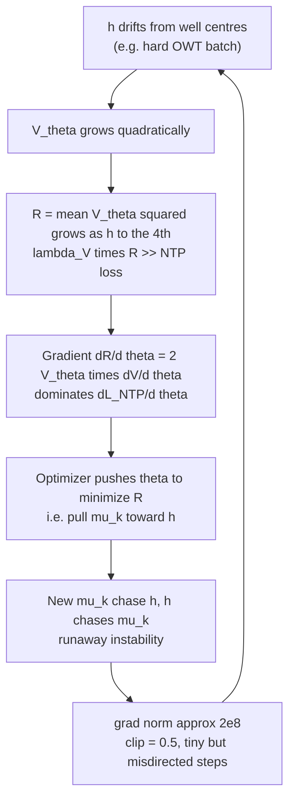

The critical insight is that **gradient clipping cannot stop this loop**.
Clipping bounds the step size but not the direction. Once
$\lambda_V \mathcal{R} \gg \mathcal{L}_{\mathrm{NTP}}$, every clipped step
points toward reducing $\mathcal{R}$ (pulling attractor centres toward
the outlier hidden states), which does not reduce NTP loss. The model is
trapped.

### Gradient of the original penalty

$$
\frac{\partial}{\partial \theta}\bigl(\lambda_V V_\theta^2\bigr)
 = 2\lambda_V V_\theta \cdot \frac{\partial V_\theta}{\partial \theta}
 \propto V_\theta
$$

Since $V_\theta$ is unbounded, so is this gradient — the penalty is a
**linearly amplified** version of the already-large force, making recovery
impossible once the runaway starts.

---

## 3. Blowup 2 — Directional Instability

After applying the `log1p` fix (Section 5), a second, structurally different
instability occurred at step ~22,000.

### Symptom (step ~21,800–24,000)

```
step 21800 ntp=5.670 v_reg=1.23 grad=214.28 ← first spike
step 22000 EVAL val_ppl=301.75 best=268.84 ← regression
step 22600 ntp=6.193 v_reg=2.74 grad=167.78
step 23200 ntp=6.624 v_reg=4.98 grad= 93.79
step 24000 EVAL val_ppl=388.65 best=268.84 ← continued regression
```

This time: `v_reg` peaked at ~5 (not 2×10⁵), `grad_norm` peaked at 214
(not 2×10⁸), NTP reached 6.7 (not 16+). The log1p fix contained the
severity, but the model failed to self-correct over 2,000+ affected steps.

### Root cause: directional persistence under gradient clipping

`clip_grad_norm_` rescales the gradient vector $g$ as:

$$
\hat{g} = g \cdot \frac{\min(\lVert g \rVert, C)}{\lVert g \rVert}
$$

so the applied update has magnitude exactly $\min(\lVert g \rVert, C)$. With
$\lVert g \rVert = 214$ and $C = 0.5$:

$$
\hat{g} = g \cdot \frac{0.5}{214} \approx 0.0023 g
$$

The step is tiny, but it points in the **same direction as** $g$. The
direction of $g$ is determined by which loss component dominates, and
when the Verlet backward graph is deep, a hard batch can induce a gradient
direction that is persistently destabilizing even at tiny step sizes.

### Why it did not self-correct

At step ~21,800 a hard batch produced $\lVert g \rVert = 214$. The clipped update
moved parameters by $0.5/214 \approx 0.002$ in that direction. If the
next batch is also hard (OWT is streamed sequentially — consecutive batches
share document context), the direction accumulates. Over 2,000 steps the
cumulative displacement from the best basin is:

$$
\Delta\theta_{\mathrm{cum}} \approx \sum_{t=T_0}^{T_0+2000} \hat{g}_t
 \sim 2000 \times 0.5 = 1000 \quad \text{(in gradient units)}
$$

This is enough to move a 31.5M-parameter model substantially out of the
basin of attraction reached at step 20k. Because the cosine-decay LR was
still near its maximum (only 7% decay had occurred by step 22k of a 200k
run), the effective step size was not diminishing fast enough to contain
the drift.

### The OWT sequential streaming factor

OpenWebText is streamed document-by-document. Within a run, the model sees
the same sequence of documents in the same order. This means:

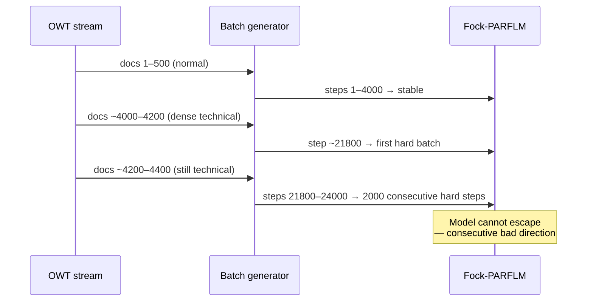

On TinyStories (i.i.d. story chunks), a hard batch at step $t$ is
statistically independent from the batch at step $t+1$, so the
destabilizing directions partially cancel. On OWT they are correlated.

---

## 4. Blowup 3 — EMA Watchdog Miscalibration

After applying all Blowup-2 fixes (log1p regulariser, LR 1.5×10⁻⁴, clip 0.3, EMA
watchdog), training resumed from the step-20k checkpoint (PPL 268.84) and
immediately made genuine progress, reaching a new best PPL of **252.75 at
step 22,000**. Two thousand steps later the model had diverged to PPL 367.98. The
watchdog never fired.

### Symptom (steps 22,000 – 24,000)

```
step 22000 EVAL val_ppl=252.75 *** NEW BEST *** ← checkpoint saved
step 22200 ntp=5.6232 v_reg=1.044 grad= 1.19
step 22400 ntp=5.6164 v_reg=1.171 grad= 1.33
step 22600 ntp=5.6311 v_reg=1.267 grad= 1.31
step 22800 ntp=5.6398 v_reg=1.291 grad= 3.37 ← first elevated spike
step 23000 ntp=5.6362 v_reg=1.279 grad= 1.22
step 23200 ntp=5.6439 v_reg=1.260 grad= 2.14
step 23400 ntp=5.7605 v_reg=1.717 grad= 3.52 ← inflection point
step 23600 ntp=5.6823 v_reg=1.263 grad= 2.66
step 23800 ntp=5.7243 v_reg=1.298 grad= 5.05
step 24000 ntp=5.8080 v_reg=1.527 grad=16.76 ← confirmed blowup
step 24000 EVAL val_ppl=367.98 best=252.75 ← 45% regression
```

This blowup is structurally different from Blowup 2. The gradients are
moderate (peak 16.76, not 214), `v_reg` stays below 1.8 (not 5), and the
onset is gradual — a slow escalation over 2,000 steps rather than a sudden
spike.

### Root cause: the EMA threshold was mathematically unreachable

The watchdog parameters were:

```python
GRAD_NORM_EMA_ALPHA = 0.02 # slow EMA (~50-step memory)
GRAD_NORM_EMA_THRESHOLD = 50.0 # EMA > 50 → consider unstable
GRAD_NORM_EMA_PATIENCE = 100
```

The EMA update is:

$$
\bar{g}_t = (1 - 0.02) \bar{g}_{t-1} + 0.02 \hat{g}_t
= 0.98 \bar{g}_{t-1} + 0.02 \hat{g}_t
$$

The **steady-state** value of the EMA when the gradient is held constant at
$\hat{g}$ is exactly $\hat{g}$ itself. But with $\alpha = 0.02$ the
convergence is slow: from a baseline of 1.3, even 100 consecutive steps at
$\hat{g} = 17$ bring the EMA to only:

$$
\bar{g}_{100} = 17\bigl(1 - 0.98^{100}\bigr) + 1.3 \times 0.98^{100}
 \approx 17 \times 0.87 + 1.3 \times 0.13 \approx 14.9 + 0.17 \approx 15.1
$$

The threshold of 50 requires **sustained** gradients of at least 50 for
hundreds of steps — far above anything this model produces. Working through
the actual log, the EMA stayed near its baseline throughout the blowup:

| Step | grad | EMA (α=0.02, cumulative) |
|---|---|---|
| baseline 22200–23000 | 1.0–1.4 | ~1.30 |
| 22800 | 3.37 | 1.34 |
| 23200 | 2.14 | 1.36 |
| 23400 | 3.52 | 1.40 |
| 23800 | 5.05 | 1.50 |
| 24000 | **16.76** | **~1.81** |

**The EMA peaked at roughly 1.81. The threshold was 50.0. The watchdog was
effectively disabled for this model's gradient scale.** The threshold
calibration was borrowed from a setting where gradient norms could reach
50–200 (as in Blowup 2); after the LR and clip reductions, the gradient
scale shrank to 1–17, making the old threshold permanently unreachable.

### The slow-escalation pattern

Unlike Blowup 2 (single catastrophic spike), Blowup 3 is a
**slow directional drift**: v_reg creeps up from 1.04 to 1.72, ntp rises
from 5.61 to 5.81, and the gradient norm escalates over 2,000 steps. This
pattern is exactly what the EMA watchdog was designed to catch — but only
if the threshold is calibrated to the actual gradient scale.

The inflection point at step 23,400 (ntp jumps from 5.64 to 5.76, v_reg
from 1.26 to 1.72) suggests a particularly hard OWT batch knocked the model
onto a diverging trajectory. The partial recovery at step 23,600 (ntp
falls back to 5.68) is deceptive: the model was already displaced from the
good basin and continued to drift.

---

## 5. Why Fock-PARFLM is More Susceptible than SPLM

The Multi-Xi SPLM at the same `d=384`, `L=16` never exhibited these
instabilities at `LR=3e-4` and `clip=0.5`. The Fock architecture has four
additional instability sources:

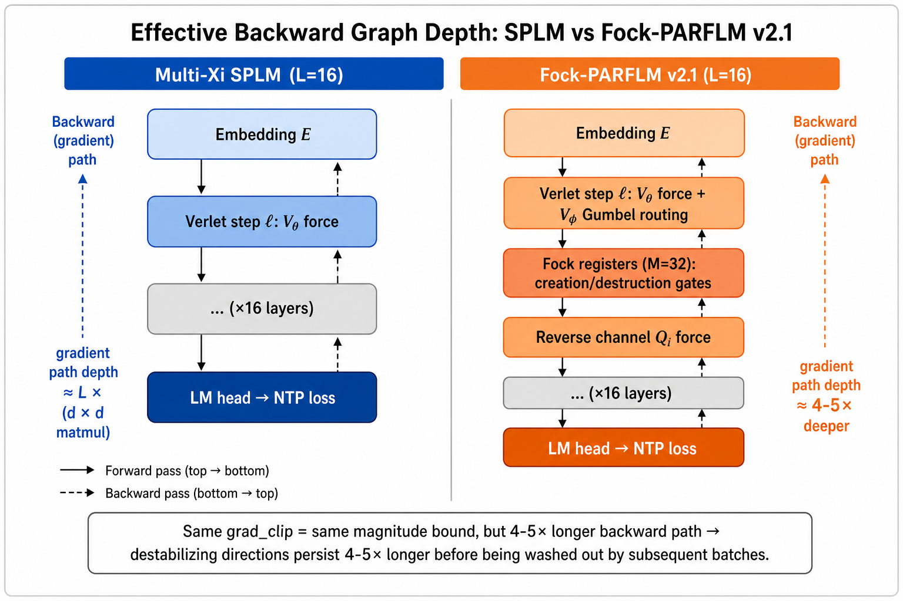

| Component | SPLM | Fock-PARFLM v2.1 | Instability mechanism |
|-----------|------|------------------|-----------------------|
| V_θ force | −∇_h V_θ | same | quadratic, unbounded |
| V_φ routing | — | Gumbel-softmax top-k | stochastic routes add gradient noise; wrong routes persist for a full Verlet step |
| Fock registers | — | M=32 register particles | 32 extra hidden states through L=16 backward graph; register creation/destruction gates add non-differentiable-like switching |
| Per-register τ | — | learnable temperature | τ drift can make routing sharper mid-training, amplifying the Gumbel noise |
| Reverse channel | — | non-conservative Q_i | no energy conservation guarantee; small errors in Q_i can compound across layers |

> **⚠ Causal-leak note.** The reverse channel is not only the *non-conservative*
> force tabled above — it is the **causal-leak carrier** identified in the audit.
> Its ability to inject a directed force from the shared full-window register
> state back onto earlier tokens is precisely what lets future tokens influence
> past predictions. The "small errors compound across layers" stability concern
> and the leak are two faces of the same unconstrained pathway. See the
> top-of-document banner.

### Effective backward graph depth

For the SPLM with L layers the backward graph is roughly:

$$
\text{depth}_{\mathrm{SPLM}} \approx L \times d^2
$$

For Fock-PARFLM v2.1, each layer has Verlet step + V_φ routing
(top-k gather) + Fock register dynamics + reverse channel. A conservative
estimate:

$$
\text{depth}_{\mathrm{Fock}} \approx L \times \bigl(d^2 + 2 d k + M d + d^2\bigr)
 \approx 4\text{–}5 \times \text{depth}_{\mathrm{SPLM}}
$$

Same `grad_clip` → same magnitude bound, but 4–5× longer backward path →
a destabilizing gradient direction persists 4–5× longer before it is washed
out by the curvature of subsequent batches.

---

## 6. Fixes Applied and Their Mathematical Justification

### Fix 1: Bounded regulariser — log1p(V_θ²)

**Applied after Blowup 1.**

Replace $\mathcal{R}_{\mathrm{quad}} = \mathbb{E}[V_\theta^2]$ with:

$$
\mathcal{R}_{\mathrm{log}}(V_\theta)
 = \mathbb{E}\bigl[\log(1 + V_\theta^2)\bigr]
$$

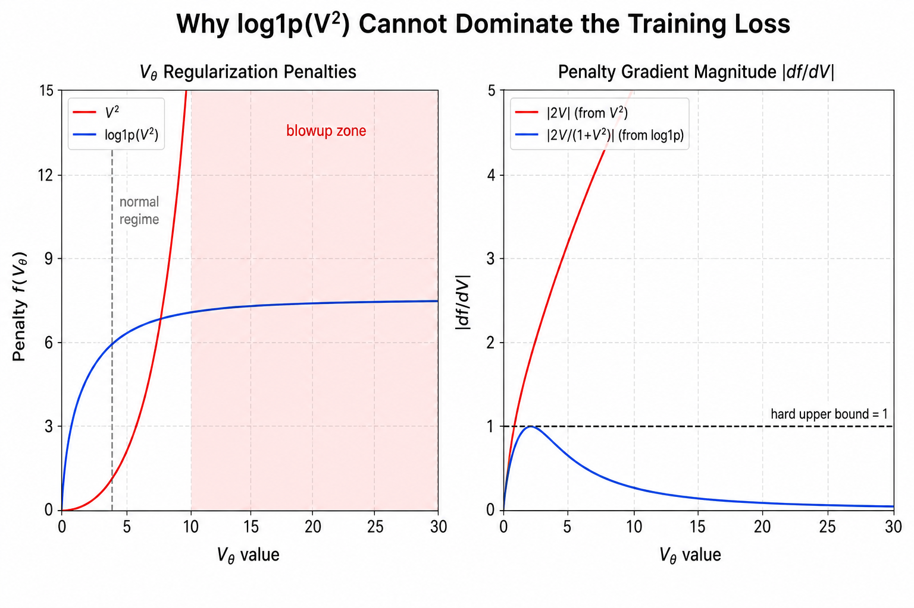

**Why it works:**

1. **Normal regime equivalence.** For $|V_\theta| \ll 1$:
 $\log(1+V^2) \approx V^2$, so the landscape compression is identical.

2. **Gradient bound.** The gradient with respect to $V_\theta$ is:

$$
\frac{d}{dV}\log(1+V^2) = \frac{2V}{1+V^2}
$$

 This is bounded by $\left|\frac{2V}{1+V^2}\right| \leq 1$ for all
 $V \in \mathbb{R}$, with the maximum at $V=1$. Therefore:

$$
\lambda_V \cdot \frac{\partial \mathcal{R}_{\mathrm{log}}}{\partial \theta}
 \leq \lambda_V \cdot \mathbb{E}\left[\frac{\partial V_\theta}{\partial \theta}\right]
$$

 and the penalty contribution to the total gradient is bounded by
 $\lambda_V$ times the mean magnitude of $\partial V_\theta / \partial\theta$.
 It **cannot** exceed the NTP gradient unless $\lambda_V \gg 1$.

3. **No runaway.** The penalty loss itself is bounded: as $|V_\theta| \to \infty$,
 $\log(1+V^2) \to \log V^2 = 2\log V$, which grows only logarithmically.
 A batch where $V_\theta = 1000$ contributes $\log(10^6+1) \approx 13.8$
 to the penalty, not $10^6$.

**Observed effect:** `v_reg` (now `mean(log1p(V²))`) stabilised at 1.0–1.5
throughout training (vs. 2×10⁵ in the first run).

---

### Fix 2: Lower max LR and tighter grad_clip

**Applied after Blowup 2; tightened again after Blowup 3 (Fix 4).**

| Parameter | Blowup 1 run | After Fix 1 | After Fix 2 | After Fix 4 |
|-----------|-------------|-------------|-------------|-------------|
| `LR` | 3×10⁻⁴ | 2×10⁻⁴ | 1.5×10⁻⁴ | **1.2×10⁻⁴** |
| `GRAD_CLIP` | 0.5 | 0.5 | 0.3 | **0.25** |
| `WARMUP_STEPS` | 5,000 | 8,000 | 8,000 | 8,000 |

**Motivation:**

For a hard batch with $\lVert g \rVert = G$ and clip threshold $C$, the
applied step in any direction is at most:

$$
\lVert \Delta\theta \rVert \leq \eta_t \cdot C
$$

where $\eta_t$ is the learning rate at step $t$. After the cosine
schedule with $\eta_{\max}$ and warmup $T_w$:

$$
\eta_t = \frac{\eta_{\max}}{2}\left(1 + \cos\left(\pi \frac{t-T_w}{T-T_w}\right)\right)
$$

At step 22k of a 200k run (warmup at 8k):

$$
\text{progress} = \frac{22000-8000}{200000-8000} \approx 0.073
\quad\Rightarrow\quad
\eta_{22k} \approx 0.997 \eta_{\max} \approx \eta_{\max}
$$

The cosine schedule had barely started decaying. The maximum per-step
displacement in any direction is:

$$
\lVert \Delta\theta_{\max} \rVert = \eta_{\max} \cdot C
 = \begin{cases}
2\times10^{-4} \times 0.5 = 1\times10^{-4} & \text{(Blowup 2 run)} \\
1.5\times10^{-4} \times 0.3 = 4.5\times10^{-5} & \text{(current run)}
\end{cases}
$$

The new maximum displacement is **2.2× smaller**. Over 100 consecutive hard
steps the cumulative drift in a destabilizing direction is:

$$
\lVert \Delta\theta_{\mathrm{cum}} \rVert
 \lesssim 100 \times 4.5\times10^{-5} = 4.5\times10^{-3}
\quad\text{(vs.} 1\times10^{-2}\text{ before)}
$$

This keeps the model closer to the good basin and makes self-correction
by subsequent normal batches more likely.

---

### Fix 3: Auto-resume from \*\_best.pt (Cell 2)


Cell 2 now checks both the periodic step checkpoints and `*_best.pt`,
selecting whichever is **more recent**:

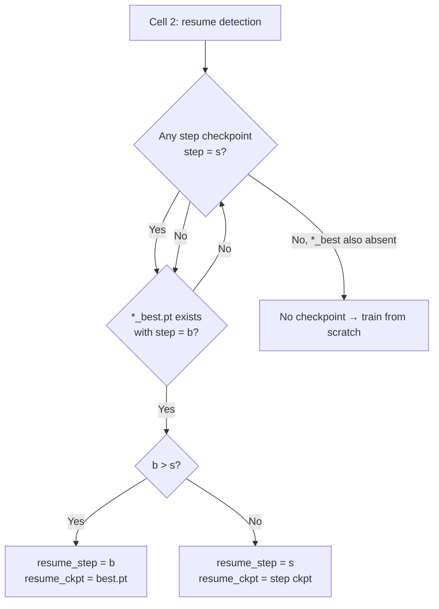

This means: if a blowup occurs **between** two 25k periodic checkpoints,
the next session automatically recovers the pre-blowup weights without any
manual Drive file operations.

---

### Fix 4: EMA Watchdog Recalibration

**Applied after Blowup 3.**

The three watchdog parameters were recalibrated to the actual gradient scale
of the model after the Fix-2 LR and clip reductions:

| Parameter | Before (broken) | After (calibrated) | Rationale |
|-----------|-----------------|-------------------|-----------|
| `GRAD_NORM_EMA_ALPHA` | 0.02 | **0.05** | Faster EMA (~20-step memory vs 50-step); catches escalation before it fully develops |
| `GRAD_NORM_EMA_THRESHOLD` | 50.0 | **3.5** | Baseline EMA is ~1.3–1.5; threshold = 2.5× baseline; old value of 50 was 35× baseline and permanently unreachable |
| `GRAD_NORM_EMA_PATIENCE` | 100 | **30** | Catch a sustained instability in 30 steps; 100 steps gave the model too long to drift |

Additionally `LR` was reduced from 1.5×10⁻⁴ to **1.2×10⁻⁴** and `GRAD_CLIP`
from 0.3 to **0.25** to further reduce the per-step displacement during any
hard-batch streak that does occur before the watchdog fires.

**Calibration derivation.** With the new parameters, the EMA at steady state
for a sustained gradient of $G$ converges to $G$ itself. With
$\alpha = 0.05$ and the new threshold $\tau = 3.5$:

- **Normal training** (grad ~1.3): EMA steady-state ≈ 1.3. Well below threshold.
- **Single spike** (grad = 7.6 at step 21,400 followed by immediate recovery): EMA
 reaches ≈ 1.6 in one step, falls back next step. Never approaches 3.5 for
 30 consecutive steps → watchdog does not fire.
- **Slow escalation as in Blowup 3** (grads of 2–5 sustained for 200+ steps):
 EMA converges toward 3–5. Threshold crossed within ~50–100 steps → watchdog
 fires and reloads the best checkpoint before the val PPL degrades further.

---

## 7. EMA Watchdog Design

The EMA watchdog detects a soft-instability spiral before the next periodic
checkpoint is written with corrupted weights.

**Algorithm (parameters after Fix 4):**

Let $\hat{g}_t = \lVert g_t \rVert$ (raw gradient norm before clipping) at step $t$.
Maintain an exponential moving average:

$$
\bar{g}_t = (1-\alpha) \bar{g}_{t-1} + \alpha \hat{g}_t,
\qquad \alpha = 0.05 \text{(~20-step memory)}
$$

Maintain a counter $c_t$:

$$
c_t = \begin{cases}
c_{t-1} + 1 & \text{if } \bar{g}_t > \tau_g \\\\
0 & \text{otherwise}
\end{cases}
\qquad \tau_g = 3.5
$$

If $c_t \geq P = 30$ (30 consecutive steps above threshold):
1. Log the event.
2. Call `_reload_best_checkpoint()` — loads `*_best.pt` into `model` and `optim` in-place.
3. Reset $\bar{g}_t = 0$, $c_t = 0$.
4. Continue training from the next step (LR schedule is unchanged — no warmup repeat).

**Threshold calibration (after Fix 4):**

| Regime | Typical grad | EMA (α=0.05) steady state | Triggers? |
|--------|-------------|--------------------------|-----------|
| Normal training | 1.0–1.5 | ~1.3–1.5 | No (below 3.5) |
| Single spike then recovery | 7–16, then 1.3 | peaks ~1.6–2.0, decays immediately | No (stays below 3.5 within ~10 steps) |
| Slow escalation (Blowup 3 pattern) | 2–5 sustained | converges toward 3–5 | Yes, within 50–100 steps |
| Acute blowup (Blowup 2 pattern) | 50–214 | immediately > 3.5 | Yes, within 1–2 steps |

**Why the original parameters (α=0.02, τ=50) failed (Blowup 3):**

The gradient scale after Blowup-2 fixes (LR 1.5×10⁻⁴, clip 0.3) settled at
1–17. The old threshold of 50 required sustained gradients of 50+ to produce
an EMA above 50 — a condition that never occurred after the fixes. The EMA
peaked at ~1.81 during the entire Blowup 3 event. The design rule is:

$$
\tau_g \approx 2\text{–}3 \times \bar{g}_{\mathrm{baseline}}
$$

With baseline EMA ≈ 1.4, this gives τ ≈ 2.8–4.2; the chosen value is 3.5.

**Failure mode check:** If `*_best.pt` does not exist (first session, no eval
yet), the watchdog logs a warning and continues — it cannot roll back. This
is fine because the first eval at step 2,000 writes `*_best.pt`, after which
the watchdog has a recovery target.

---


## 8. Residual Risk and Recommendations

### Remaining instability sources

After all four fixes, the following risks remain:

1. **Hard-batch streak that exceeds the watchdog patience.** With
 `PATIENCE=30`, a sustained streak of fewer than 30 steps above the EMA
 threshold will not trigger a reload. Because OWT documents are streamed
 sequentially, correlated hard batches can run for hundreds of consecutive
 steps; however, the tighter clip (0.25) and lower LR (1.2×10⁻⁴) reduce
 the per-step damage while the watchdog waits.

2. **Post-cosine-peak LR** is still ~1.2×10⁻⁴ at step 20k (only ~7% decay).
 The schedule will not meaningfully reduce LR until ~50k+ steps. Any third
 hard OWT region encountered before that point relies on the watchdog to
 absorb it.

3. **Fock register salience** can drift during a hard streak (register
 particles may incorrectly gain/lose salience). Even after reloading
 `*_best.pt`, the salience state is restored from the checkpoint, so this
 is recoverable.

4. **Watchdog threshold drift.** If training genuinely improves and the
 gradient scale drops further (e.g., to ~0.7), the current threshold of
 3.5 may become overly sensitive (≈5× baseline). Conversely, if a new
 phase of training raises the baseline, the threshold may need
 recalibrating again. The design rule τ ≈ 2.5× baseline should be
 re-checked at every major training milestone.

### Recommendations for future Fock+structured V_θ scale-ups

| Lever | After Fix 4 | Recommended for 1M-step run |
|-------|-------------|------------------------------|
| `LR_max` | 1.2×10⁻⁴ | 1.0×10⁻⁴ |
| `GRAD_CLIP` | 0.25 | 0.2 |
| `WARMUP_STEPS` | 8,000 | 10,000–15,000 |
| `CKPT_INTERVAL` | 25,000 | 10,000 (more frequent saves) |
| `lambda_V` ramp | constant 0.01 | ramp 0→0.01 over first 2k steps |
| `GRAD_NORM_EMA_ALPHA` | 0.05 | 0.05–0.10 |
| `GRAD_NORM_EMA_THRESHOLD` | 3.5 | 2.5× baseline EMA (re-measure at 10k) |
| `GRAD_NORM_EMA_PATIENCE` | 30 | 20–30 |
| Penalty | log1p(V²) | log1p(V²) — keep |
| Data shuffle | sequential OWT | consider shuffling document order to break consecutive-hard-batch correlations |

### The deeper question: is structured V_θ safe at scale?

The instabilities arise from the interaction of three factors:
(a) an **unbounded** quadratic-in-$h$ potential,
(b) **deep** Verlet integration (L=16), and
(c) **sequential data** with correlated hard batches.

Factor (a) is inherent to the SQ3 parameterisation. The log1p fix is a
sound mitigation but not a cure — it prevents the penalty from dominating
but does not prevent $V_\theta$ from growing large during forward inference.
A more principled long-term fix would be to add a **soft-clamp** on $h$
itself (e.g. via layer normalization before the V_θ force computation) so
that $\lVert h - \mu_k \rVert$ cannot grow arbitrarily. The `ln_after_step=True`
flag provides partial protection (LN is applied after each Verlet step),
but LN is applied to the full $h$ vector, not to the difference
$h - \mu_k(\xi)$, so extreme well-displacement can still occur within a
single step.

For MLP-based V_θ (no structured form), the force $-\nabla_h V_\theta$
is an arbitrary neural network output and is empirically bounded by the
weight norms — an implicit regularisation that the analytical SQ3 form does
not share.

---

## 9. Architectural Path Forward: Gaussian Wells with SARF Anchors

The three blowups documented above share a single root cause: the SQ3
potential is **quadratic in** $h$ **and therefore unbounded**. Every
remediation applied so far (log1p penalty, lower LR, tighter clip, EMA
watchdog) is a downstream containment mechanism that treats the symptoms.
This section analyses an architectural alternative that eliminates the root
cause: replacing the SQ3 log-sum-exp wells with Gaussian (mixture-PDF)
wells, and compensating for the resulting loss of global restoring force
with SARF (Semantically Anchored Reference Frame) anchor positions and
SARF-faithful dynamics.

### 9.1. Why SQ3 is structurally unbounded

The SQ3 potential is a **negative free energy** of a Boltzmann mixture:

$$
V_\theta(\xi, h) = -\tau \log \sum_{k=1}^{K} \pi_k(\xi) \exp\left(-\frac{E_k(\xi, h)}{\tau}\right)
$$

Each $\exp(-E_k / \tau)$ is a Gaussian density in $h$, but the $\log$
wrapper inverts the boundedness: as $\lVert h - \mu_k \rVert \to \infty$
for all $k$, every Gaussian density decays to zero, their sum decays to
zero, and the log diverges:

$$
V_\theta \to -\tau \log(0^+) = +\infty
$$

The force $-\nabla_h V_\theta$ grows linearly with displacement — a
global restoring force that pulls every escaped hidden state back toward the
nearest well centre. This is a useful property, but it comes at the cost of
an **unbounded penalty** $V_\theta^2$ that was the direct trigger for
Blowup 1.

### 9.2. The Gaussian-well alternative

Replace the log-sum-exp with the **mixture-PDF form** — the sum of
negative Gaussian bumps without the log wrapper:

$$
V_\theta^{\mathrm{G}}(\xi, h) = -\sum_{k=1}^{K} w_k(\xi) \exp\left(-\frac{\lVert a_k^{1/2}(h - \mu_k(\xi)) \rVert^2}{2}\right)
$$

where $w_k(\xi) \gt 0$ are context-dependent weights (softmax over a
linear projection of the multi-xi context) and $a_k(\xi) \gt 0$ are
per-component precisions as before.

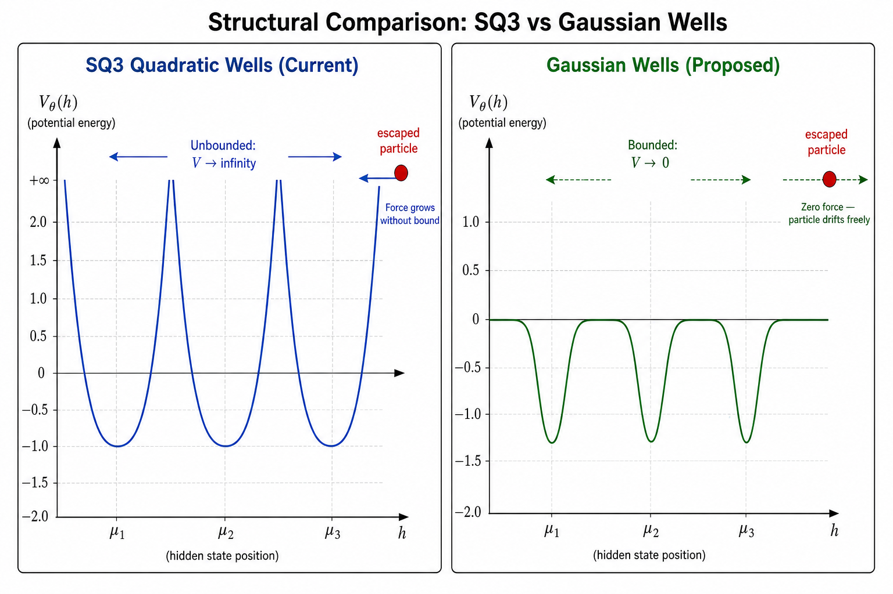

**Structural properties.** The key differences from SQ3 are:

| Property | SQ3 (log-sum-exp) | Gaussian wells (mixture PDF) |
|----------|-------------------|------------------------------|
| Range | (−∞, +∞) | [−Σ w_k, 0] |
| Asymptotic behaviour | V → +∞ quadratically | V → 0 (bounded) |
| Force outside wells | linear restoring, grows with displacement | exponential decay to zero |
| Maximum force | unbounded | bounded per well |
| Penalty V² | unbounded → Blowup 1 | bounded by (Σ w_k)² |
| Jacobi metric | degenerate at V = E boundary | valid everywhere (V bounded below) |

**Gradient bound.** The force of a single Gaussian well is:

$$
F_k(h) = -\nabla_h \left[-w_k \exp\left(-\frac{\lVert h - \mu_k \rVert^2}{2\sigma_k^2}\right)\right] = -\frac{w_k}{\sigma_k^2}(h - \mu_k) \exp\left(-\frac{\lVert h - \mu_k \rVert^2}{2\sigma_k^2}\right)
$$

The exponential decay factor bounds the force magnitude. The maximum occurs
at $\lVert h - \mu_k \rVert = \sigma_k$ and equals:

$$
\lVert F_k \rVert_{\max} = \frac{w_k}{\sigma_k} e^{-1/2} \approx \frac{0.607 w_k}{\sigma_k}
$$

This is finite and independent of the hidden state. No outlier token can
produce an arbitrarily large gradient contribution from the potential,
which **structurally prevents Blowup 1**.

### 9.3. The escape problem and why SARF solves it

The Gaussian well force profile is **non-monotone**: it peaks at distance
$\sigma_k$ from the centre and then decays exponentially. Beyond roughly
$2\sigma_k$, the force is negligible. A hidden state that drifts past all
well radii experiences no meaningful restoring force and moves inertially.

This is the fundamental trade-off: **boundedness (stability) vs. global
attraction (convergence)**. The SQ3 form has global attraction but is
unstable; pure Gaussian wells are stable but have no global attraction.

SARF (Semantically Anchored Reference Frame) provides two mechanisms that
close this gap without reintroducing unboundedness.

#### 9.3.1. SARF anchors: PMI-extremal coverage

SARF anchors $\lbrace a_j \rbrace_{j=1}^{N_S}$ are the embeddings of the
top-$N_S$ tokens ranked by $\max_w \mathrm{PMI}(v, w)$ — tokens with the
most strongly peaked pointwise mutual information with at least one other
token. These are the **informationally extremal** points of the vocabulary.

The anchor selection procedure is:

$$
\mathrm{PMI\_peak}(v) = \max_{w \neq v} \mathrm{PMI}(v, w)
$$

$$
\lbrace a_j \rbrace_{j=1}^{N_S} = \mathrm{TopK}\left(\lbrace E(v) \mid v \in \mathcal{V} \rbrace, \mathrm{PMI\_peak}, N_S\right)
$$

When Gaussian wells are centred on SARF anchors, the potential becomes:

$$
V_\theta^{\mathrm{SARF}}(\xi, h) = -\sum_{j=1}^{N_S} w_j(\xi) \exp\left(-\frac{\lVert h - a_j \rVert^2}{2\sigma_j^2}\right)
$$

**Why escape is structurally impossible.** The SARF anchors are PMI
extremes of the vocabulary — they occupy the "corners" of the semantic
embedding space. Because the anchors span the full semantic range, a
hidden state cannot be simultaneously far from **all** anchors. Any
direction away from one anchor necessarily moves toward another.

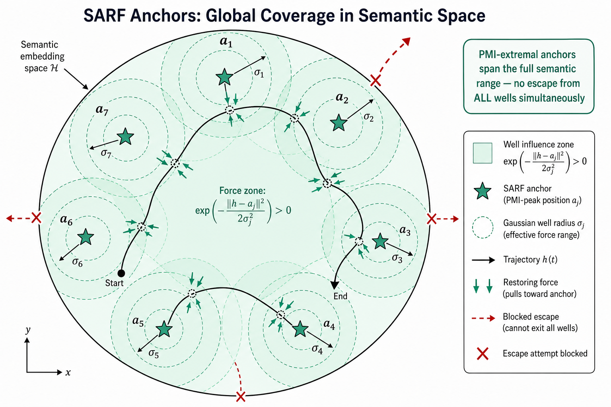

The coverage guarantee can be formalised. Let $R = \max_j \lVert a_j \rVert$
be the radius of the anchor constellation and
$\delta = \min_{j \neq k} \lVert a_j - a_k \rVert$ the minimum inter-anchor
distance. Then for any $h$ with $\lVert h \rVert \le R$:

$$
\min_j \lVert h - a_j \rVert \le \delta
$$

by the pigeonhole principle on the Voronoi cells of the anchors. If
$\sigma_j \ge \delta / 2$ for all $j$, every point inside the anchor
constellation lies within at least one well's effective force radius.

#### 9.3.2. SARF-faithful dynamics: adaptive restoring force via per-layer xi re-pooling

The second SARF mechanism is **per-layer recomputation of the context
variable** $\xi$. In the standard SPLM, $\xi$ is computed once from the
layer-0 embeddings and held fixed across all $L$ integration steps. In
the SARF-faithful variant:

$$
\xi_\ell = \frac{1}{t}\sum_{s \le t} h_s^{(\ell)}, \qquad \text{recomputed at each layer } \ell = 0, 1, \ldots, L{-}1
$$

where $h_s^{(\ell)}$ is the hidden state of token $s$ at layer $\ell$
(computed from $h_s^{(\ell)}.detach()$ to sever the autograd path and
preserve the per-token Euler-Lagrange structure).

This creates an **adaptive multi-layer ratchet**: the well centres
$\mu_k(\xi_\ell)$ shift at each layer to track the running mean of the
current hidden states. Even if a hidden state exits a well's force radius
at layer $\ell$, the next layer's well centres are closer because $\xi$
updated to include the displaced $h$.

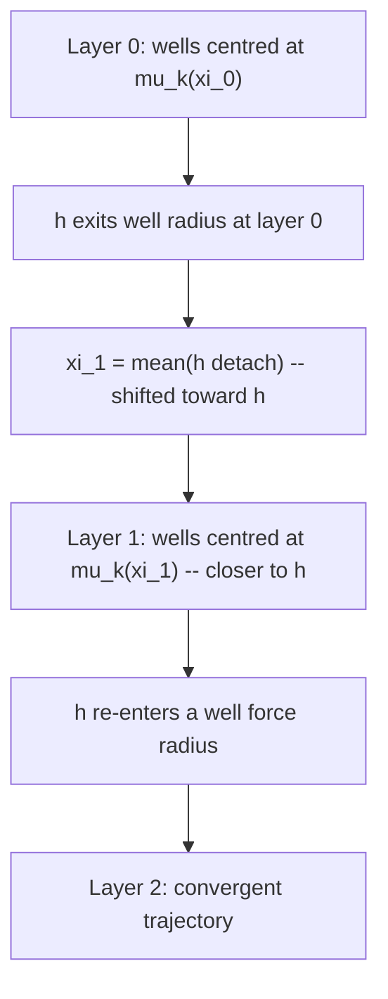

The ratchet does not add backward-graph depth because `h.detach()` severs
the autograd path from $\xi$ to $h$. The force at each layer is the
standard per-token Euler-Lagrange force:

$$
m \ddot{h}\_t = -\nabla_h V_\theta(\xi_\ell, h_t)
$$

with the damped update (Verlet integrator):

$$
v_{t}^{(\ell+1)} = \frac{v_{t}^{(\ell)} + \Delta t \cdot f_t^{(\ell)} / m}{1 + \Delta t \cdot \gamma}, \qquad h_{t}^{(\ell+1)} = h_{t}^{(\ell)} + \Delta t \cdot v_{t}^{(\ell+1)}
$$

The xi recomputation adds only one `cumsum` + division per layer — negligible
relative to the $V_\theta$ force evaluation.

### 9.4. The combined architecture: Gaussian wells + SARF

The proposed architecture combines three elements:

1. **Gaussian (mixture-PDF) wells** for structurally bounded $V_\theta$.
2. **SARF anchor positions** as well centres for global semantic coverage.
3. **SARF-faithful per-layer xi dynamics** for adaptive restoring.

The potential is:

$$
V_\theta^{\mathrm{SARF}}(\xi_\ell, h) = -\sum_{j=1}^{N_S} w_j(\xi_\ell) \exp\left(-\frac{\lVert h - a_j \rVert^2}{2\sigma_j^2}\right)
$$

where:
- $a_j$ are static PMI-peak SARF anchor positions (fixed after corpus analysis)
- $\sigma_j$ are learned per-anchor widths
- $w_j(\xi_\ell)$ are context-dependent weights: a small MLP or linear projection of $\xi_\ell$
- $\xi_\ell$ is recomputed from $h^{(\ell)}.detach()$ at each layer (SARF-faithful)

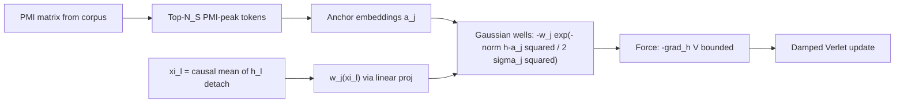

**Optional background quadratic.** For additional safety, a mild
global quadratic background can be added:

$$
V_\theta^{\mathrm{SARF+bg}}(\xi_\ell, h) = -\sum_{j=1}^{N_S} w_j(\xi_\ell) \exp\left(-\frac{\lVert h - a_j \rVert^2}{2\sigma_j^2}\right) + \epsilon \lVert h \rVert^2
$$

where $\epsilon \ll 1$ is small enough that the Gaussian wells dominate
locally (within the anchor constellation) but the background prevents
unbounded drift if a hidden state somehow escapes all anchors. This is
analogous to layer normalization (`ln_after_step=True`) but acts through the
potential rather than as a post-hoc normalisation.

### 9.5. What each mechanism fixes

| Blowup | Root cause | Gaussian wells | SARF anchors | SARF dynamics |
|--------|-----------|---------------|-------------|--------------|
| 1 (penalty dominance) | V_θ² → ∞ | **Prevented**: V² ≤ (Σ w_k)² | neutral | neutral |
| 2 (directional instability) | deep backward graph | **Partially mitigated**: bounded force | neutral | neutral (same depth) |
| 3 (slow escalation) | sustained moderate gradients | **Partially mitigated**: lower gradient ceiling | **Mitigated**: no dead zones between wells | **Mitigated**: per-layer ratchet prevents sustained drift |

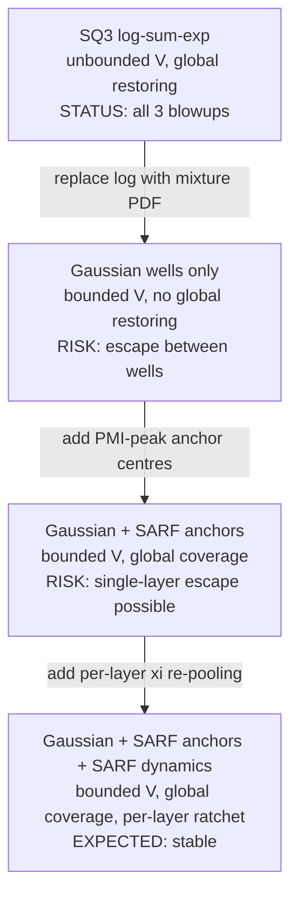

### 9.6. Thermodynamic cost

The SQ3 log-sum-exp has a clean **free-energy interpretation**:
$V_\theta = -\tau \log Z(\xi, h)$ where $Z$ is the partition function
of a Boltzmann mixture. This connects to the paper's variational framework
and Jacobi metric derivations.

The Gaussian mixture-PDF form has no such thermodynamic interpretation —
$V_\theta$ is a sum of bump functions, not a log-partition function. However:

1. **The Jacobi metric is actually better behaved.** Because
 $V_\theta^{\mathrm{G}}$ is bounded below (by $-\sum_k w_k$), the Jacobi
 metric $g_{ij}^J = 2(E - V)\delta_{ij}$ is positive-definite everywhere
 (given $E \gt -\sum_k w_k$), without the degeneracy at energy
 boundaries that plagues the SQ3 form.

2. **The connection to attention.** The softmax attention score between
 query $h$ and key $\mu_k$ is proportional to
 $\exp(-\lVert h - \mu_k \rVert^2 / 2\sigma^2)$ in the Gaussian kernel
 formulation. The Gaussian-well potential is therefore a
 potential-energy analogue of the attention score — a well-known
 connection that strengthens rather than weakens the theoretical
 narrative.

3. **The SARF anchors provide interpretability** that the learned SQ3
 well centres lack. Each anchor corresponds to a specific PMI-extremal
 token, giving the potential landscape a grounded semantic interpretation.

### 9.7. Force profile analysis

The force profile of a single Gaussian well (radial component) is:

$$
F(r) = -\frac{w}{\sigma^2} r \exp\left(-\frac{r^2}{2\sigma^2}\right), \qquad r = \lVert h - \mu \rVert
$$

This has a characteristic non-monotone shape:

- **Near-field** ($r \ll \sigma$): $F \approx -w r / \sigma^2$ (linear,
 harmonic oscillator)
- **Peak** ($r = \sigma$): $F_{\max} = -w e^{-1/2} / \sigma \approx -0.607 w / \sigma$
- **Far-field** ($r \gg \sigma$): $F \to 0$ (exponential decay)

The **escape radius** — beyond which the force is less than 1% of peak — is:

$$
r_{\mathrm{esc}} = \sigma\sqrt{2\ln 100} \approx 3.03\sigma
$$

For the combined SARF architecture, the effective restoring force at any
point $h$ is the superposition of all anchor wells:

$$
F_{\mathrm{total}}(h) = \sum_{j=1}^{N_S} \frac{w_j}{\sigma_j^2}(h - a_j) \exp\left(-\frac{\lVert h - a_j \rVert^2}{2\sigma_j^2}\right)
$$

When the SARF anchor constellation tiles the space with
$\sigma_j \ge \delta / 2$ (half the minimum inter-anchor distance), every
interior point receives nonzero force from at least one anchor, and the
maximum "dead-zone force deficit" (the minimum force at any interior point)
is bounded below by:

$$
\lVert F_{\mathrm{total}} \rVert_{\min} \ge \frac{w_{\min}}{\sigma_{\max}} \exp\left(-\frac{\delta^2}{2\sigma_{\min}^2}\right) \gt 0
$$

### 9.8. Implementation considerations

The transition from SQ3 to Gaussian+SARF requires changes in three places:

1. **V_theta module**: replace the `StructuredVThetaSQ3` forward pass
 (log-sum-exp) with a sum of Gaussian bumps. The gradient computation
 via `torch.autograd.grad` is unchanged — PyTorch differentiates the
 Gaussian form automatically.

2. **Anchor computation**: a one-time offline step that computes the PMI
 matrix from the corpus, identifies the top-$N_S$ PMI-peak tokens, and
 saves their embedding positions. This replaces the learned
 $\mu_k(\xi)$ centres.

3. **Integration loop**: adopt SARF-faithful xi recomputation from
 `model_sarf.py` — a one-line change replacing
 `xi = causal_cumulative_mean(emb)` (computed once) with
 `xi = causal_cumulative_mean(h.detach())` (computed per layer).

The regulariser $\mathcal{R}$ can be simplified. With bounded
$V_\theta^{\mathrm{G}}$, the original `mean(V^2)` penalty is already
bounded. The log1p fix remains harmless but is no longer necessary:

$$
\mathcal{R}(V_\theta^{\mathrm{G}}) = \mathbb{E}[V_\theta^2] \le \left(\sum_k w_k\right)^2 \quad \text{(structurally bounded)}
$$

**Parameter count.** For $N_S$ anchors in $d$ dimensions with $K$ context
weights:

| Component | SQ3 (current) | Gaussian + SARF |
|-----------|-------------|-----------------|
| Well centres μ_k | K × K_ξ × d (learned) | N_S × d (frozen PMI anchors) |
| Precisions a_k | K × K_ξ × d (learned) | N_S (learned σ_j) |
| Weights | K (softmax logits from ξ) | N_S (linear head from ξ) |
| Total V_theta params | 2K·K_ξ·d + K | N_S + N_S (only widths + weight head) |

With $K = 8$, $K_\xi = 4$, $d = 384$: SQ3 has $24577$ learned V_theta
parameters. With $N_S = 64$ SARF anchors: Gaussian+SARF has $128$ learned
parameters (64 widths + 64 weight-head outputs) plus the frozen anchor
positions. The learned parameter count drops by **192x**, which
correspondingly reduces the V_theta contribution to the backward graph.

### 9.9. Connection to the Reinforcement Field and the Paper's SARF Dynamics (Section 6, Equation 48)

The SARF-anchored Gaussian well architecture described above is not an
ad-hoc stability fix — it is a concrete, computable realization of the
**reinforcement field** $\mathcal{E}$ defined in Section 6 of the paper
(paper_v4, §6.2, `eq:reinforcement-field`) and the extended coupled
dynamics of Equation 48 (`eq:extended-dynamics`). This subsection makes the
correspondence explicit.

#### 9.9.1. The reinforcement field in the paper

Section 6 of the paper defines the reinforcement field $\mathcal{E}$ as the
time-dependent, vector-valued force field in which semantic structures evolve.
At each position $\vec{r}$ and time $t$, the field returns the local force
(Eq. 42):

$$
\vec{f}(\vec{r}, t) \in \mathbb{R}^L
$$

The field absorbs the cumulative effect of all existing structures and
is bidirectionally coupled to the model: each newly formed structure both
**responds to** $\mathcal{E}$ and **modifies** it through the
attractive-repulsive contributions of its constituent properties.

The extended coupled dynamics (Equation 48, `eq:extended-dynamics`) governs
how a semantic particle's position $\vec{p}_{c,i}$ evolves under this field.
It has four components:

1. **Energy accumulation**: $E$ updates by the dot product of the local force
   with the displacement
2. **Harmonic-mean energy centroid** $\vec{p}_E$: the energy-weighted
   attractor, including initial-impulse corrections
3. **Per-step displacement** $\Delta\vec{p}_i$: a convex combination of the
   field-pull direction and the impulse direction, weighted by their
   respective energies
4. **Time-dependence**: the field $\mathcal{E}$ changes as new structures
   arrive and displace existing centroids

The driving force in the entire system is $\vec{f}$ — the local restoring
force from the Gaussian wells of Section 4. The paper defines the Gaussian
semantic energy well (Eq. 10, `eq:well`) as:

$$
V(x) = m \upsilon^2 (1 - e^{-\kappa^2 x^2})
$$

with restoring force (Eq. 11, `eq:well-force`):

$$
F(x) = -2 m \upsilon^2 \kappa^2 x e^{-\kappa^2 x^2}
$$

This is the same functional form used in our `SARFGaussianVTheta`
implementation, with the identifications $\upsilon^2 \leftrightarrow w_j$
and $\kappa \leftrightarrow 1/\sigma_j$.

#### 9.9.2. The explicit reinforcement field from SARF-anchored Gaussian wells

Substituting the SARF-anchored potential
$V_\theta^{\mathrm{SARF}}$ into the force law
$-\nabla_h V_\theta$ yields an explicit, computable reinforcement field:

$$
\mathcal{E}(h, \xi_\ell) = \sum_{j=1}^{N_S} \underbrace{\frac{w_j(\xi_\ell)}{\sigma_j^2}}_{\text{context gate}} (a_j - h) \underbrace{\exp\Big(-\frac{\lVert h - a_j \rVert^2}{2\sigma_j^2}\Big)}_{\text{Gaussian locality (Section 4 well)}}
$$

Each term in this sum is a **restoring pull toward anchor** $a_j$,
modulated by two factors:

- **Gaussian locality**: the exponential factor
  $\exp(-\lVert h - a_j \rVert^2 / 2\sigma_j^2)$ ensures the force
  vanishes exponentially for hidden states far from the anchor — exactly
  the Gaussian well of Section 4 with shape parameter
  $\kappa_j = 1/\sigma_j$.

- **Context gate**: the weight $w_j(\xi_\ell) / \sigma_j^2$ is a linear
  projection of the causal-EMA context $\xi_\ell$, determining which
  anchors are relevant at a given point in the sequence.

The per-anchor force maximum occurs at $\lVert h - a_j \rVert = \sigma_j$
and equals $0.607 w_j / \sigma_j$ — matching the Section 4 formula
$F_{\max} = -\sqrt{2/e} \cdot m \upsilon^2 \kappa$ exactly.

#### 9.9.3. Mapping Equation 48 to the Fock-PARFLM implementation

The following table maps each object in Equation 48 (the paper's abstract
coupled dynamics) to its concrete counterpart in the Fock-PARFLM
implementation with SARF-anchored Gaussian wells:

| Paper (Eq. 48) | Fock-PARFLM implementation |
|---|---|
| p_{c,i} — particle position | h_t^(ℓ) — hidden state, token t, layer ℓ |
| f(p_{i,j} + Δp_i, l_{i,j}) — local force | E(h_t^(ℓ), ξ_ℓ) — SARF-anchored Gaussian force |
| Δp_i — per-step displacement | Δh_t = v_t^(ℓ+1) · Δt — Verlet step |
| E(p_{c,i}) — accumulated energy | ξ_ℓ — causal EMA tracking hidden-state history |
| Time t | Layer index ℓ = 0, …, L−1 |
| New structure modifies E | ξ_ℓ recomputed per layer (SARF-faithful dynamics) |

The last row is the most important for understanding the correspondence.
In the paper, time-dependence of $\mathcal{E}$ arises because newly-parsed
structures arrive and displace the centroids of existing Gaussian wells —
each structure both responds to and modifies the field. In the
implementation, this time-dependence is realized through **SARF-faithful
per-layer xi recomputation**: at each layer $\ell$, $\xi_\ell$ is
recomputed from the current hidden states $h^{(\ell)}.detach()$, which
shifts the context-dependent weights $w_j(\xi_\ell)$ and thereby reshapes
the effective force field between layers. The environment actively
reshapes between layers rather than being frozen at the embedding level.

This mapping is also consistent with the **content/environment
factorization** of Remark 6.4 in the paper (Eq. 52,
`eq:traj-functional`):

$$
T_{i,0,k} = F(T_{1,0,k-1}, \ldots, T_{M,0,k-1}, E_{1,0,k-1}, \ldots, E_{M,0,k-1})
$$

The past trajectories $T_{j,0,k-1}$ (content) map to the token hidden-state
histories feeding into the causal EMA; the accumulated energies
$E_{j,0,k-1}$ (environment) map to $\xi_\ell$ itself, which summarises
the interaction history with the reinforcement field up to layer $\ell$.

#### 9.9.4. Two senses of "SARF" — paper vs. implementation

The paper's SARF (Section 6) and the implementation's SARF anchors share
the same mathematical substrate but make different choices about what is
dynamic vs. static:

| | Paper Section 6 SARF | Implementation SARF anchors |
|---|---|---|
| What are the "structures"? | Parsed sentences/documents at dynamic positions | Fixed PMI-peak vocabulary embeddings a_j |
| How does E change? | New structures arrive, centroids move | ξ_ℓ updates per layer, reshaping w_j |
| Anchor positions | Float freely (PARF-governed) | Frozen at corpus-analysis time |
| Force law | Gaussian well from Section 4 at each centroid | Identical functional form, at frozen a_j |
| Regional cutoff | 2/κ distance filter (Eq. 37) | Implicit: Gaussian decay handles locality |

The implementation makes a deliberate trade-off: **giving up dynamic
anchor positions** in exchange for **guaranteed global coverage**. The
PMI-extremal anchors span the vocabulary's semantic range by construction,
so no hidden state can escape all wells simultaneously (Section 9.3.1 above).
The dynamic adaptation that the paper achieves through floating structure
centroids is instead achieved through the context-dependent weights
$w_j(\xi_\ell)$ — a lower-dimensional but computationally cheaper mechanism
that preserves the essential bidirectional coupling between model and field.

#### 9.9.5. The reinforcement field as a force-field summary

The relationship can be summarised as follows. Define the **SARF
reinforcement field** as the mapping from hidden state and context to
force:

$$
\mathcal{E}: \mathbb{R}^d \times \mathbb{R}^{K_\xi d} \to \mathbb{R}^d, \qquad (h, \xi_\ell) \mapsto \sum_{j=1}^{N_S} \frac{w_j(\xi_\ell)}{\sigma_j^2} (a_j - h) \exp\left(-\frac{\lVert h - a_j \rVert^2}{2\sigma_j^2}\right)
$$

This field has the following properties that mirror the paper's abstract
$\mathcal{E}$:

1. **Vector-valued**: $\mathcal{E}(h, \xi_\ell) \in \mathbb{R}^d$,
   matching Eq. 42.

2. **Time-dependent**: the layer index $\ell$ plays the role of time, and
   the recomputed $\xi_\ell$ makes the field change between layers.

3. **Bidirectionally coupled**: the hidden states $h^{(\ell)}$ respond to
   $\mathcal{E}$ (through the Verlet update) and modify it (through
   $\xi_\ell = \mathrm{causal\_mean}(h^{(\ell)}.detach())$).

4. **Gaussian-well substrate**: each anchor contributes a restoring force
   with the identical functional form to the Gaussian well of Section 4,
   with shape parameter $\kappa_j = 1/\sigma_j$.

5. **Bounded**: $\lVert \mathcal{E}(h, \xi_\ell) \rVert$ is bounded for all
   $h$, eliminating the instabilities documented in Sections 2-4 of this
   note.

The Verlet update in the implementation:

$$
v_t^{(\ell+1)} = \frac{v_t^{(\ell)} + \Delta t \cdot \mathcal{E}(h_t^{(\ell)}, \xi_\ell) / m}{1 + \Delta t \cdot \gamma}
$$

$$
h_t^{(\ell+1)} = h_t^{(\ell)} + \Delta t \cdot v_t^{(\ell+1)}
$$

is the discretized form of the paper's extended coupled dynamics (Eq. 48),
with the damping factor $\gamma$ playing the role of the paper's $H_i$
damping, and the SARF reinforcement field $\mathcal{E}$ providing the force
$\vec{f}$ that drives the displacement.

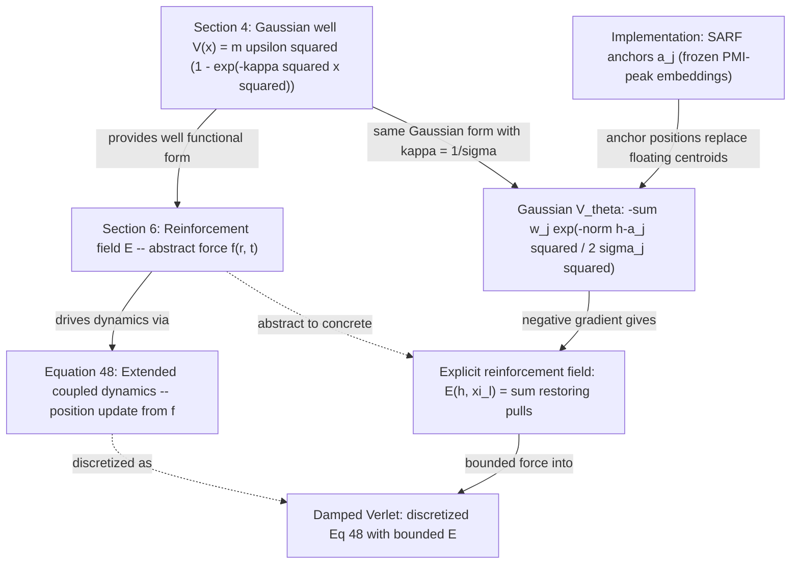

This connection has a significant consequence for the paper narrative: the
SARF-anchored Gaussian well architecture is not merely a pragmatic
stability fix but a **faithful implementation** of the paper's theoretical
framework. The reinforcement field $\mathcal{E}$ — which in the paper
remains an abstract, qualitatively-described object — is here given a
concrete, differentiable, and bounded form. The instabilities documented
in Sections 2-4 arose precisely because the SQ3 parameterisation violated
the boundedness property of the paper's Gaussian wells (Section 4), and
the SARF anchor architecture restores that property while preserving the
dynamic field structure of Section 6.

---

---

## 10. Implementation Diagnostic: SARF Well Deactivation by `ln_after_step` Scale Mismatch

### 10.1. Symptom

During the G3 run (SARF Gaussian wells, `N_S=64` frozen PMI-peak anchors) of
the TinyStories ablation notebook, the training log reported `v_reg=0.0000` at
every step from step 1 onward, despite the SARF architecture being correctly
constructed and the `IS_GAUSSIAN=True` branch of the regulariser being active:

```
[G3] step     1/16000  ntp=10.7877  v_reg=0.0000  lr=1.25e-06  grad=0.715
[G3] step    50/16000  ntp=10.6200  v_reg=0.0000  lr=6.25e-05  grad=0.821
```

A first-pass diagnostic measured anchor proximity at the **embedding level**:

```
Embedding norm: 0.320
Anchor norm:    0.324
Mean ||h-a_j||: 0.456
Current sigma:  1.000
Recommended init_log_sigma: -0.79
```

At this scale, with `sigma=1.0` and mean distance `0.456`, the exponent evaluates to
$\exp(-0.456^2/2) \approx 0.901$, suggesting the wells should be active and `v_reg`
should be approximately `0.81`. The diagnostic falsely implied the scale was fine.

---

### 10.2. Root Cause: `ln_after_step=True` Moves $h_L$ out of Embedding Space

The model configuration sets `ln_after_step=True`, which applies LayerNorm to
the hidden state after every Verlet step. After $L = 8$ layers the hidden state
$h_L$ has approximately unit variance per dimension:

$$
\lVert h_L \rVert \approx \sqrt{d} = \sqrt{256} \approx 16
$$

The SARF anchors are initialised from raw token embeddings, which satisfy:

$$
\lVert a_j \rVert \approx 0.32 \ll \sqrt{d}
$$

The squared distance from any Verlet-integrated hidden state to any anchor is
therefore dominated by the hidden-state norm:

$$
\lVert h_L - a_j \rVert^2 \approx \lVert h_L \rVert^2 + \lVert a_j \rVert^2 \approx 256 + 0.1 \approx 256
$$

With `sigma=1.0` ($\sigma^2 = 1$), the Gaussian exponent becomes:

$$
\exp\Bigl(-\frac{256}{2 \times 1^2}\Bigr) = \exp(-128) \approx 10^{-56} \approx 0
$$

Every bump in the potential vanishes identically. The SARF potential

$$
V_\theta(\xi, h_L) = -\sum_{j=1}^{N_S} w_j(\xi) \exp\Bigl(-\frac{\lVert h_L - a_j \rVert^2}{2\sigma_j^2}\Bigr) \approx 0
$$

evaluates to zero for all tokens, so `v_reg = mean(V_theta^2) = 0.0000`.

The anchors and the hidden states live in **entirely different coordinate
systems**: raw embedding space (norm $\approx 0.32$) vs. LayerNorm-normalised
Verlet space (norm $\approx \sqrt{d} \approx 16$). The wells are geometrically
invisible to the hidden states.

---

### 10.3. Why the Embedding-Level Diagnostic Was Misleading

The diagnostic sampled random token IDs and computed distances from their raw
embeddings to the anchor positions — correctly capturing the pre-Verlet,
pre-LayerNorm embedding scale. However, `V_theta` is evaluated in
`forward_with_vreg` on the **post-Verlet** hidden state `h_L`:

```python
xis = model.xi_module(h_L.detach())
V_vals = model.V_theta(xis, h_L)    # h_L has norm ≈ sqrt(d), NOT 0.32
```

A faithful diagnostic must measure distances from `h_L` (after all Verlet
steps and LayerNorm applications) to the anchors, not from raw embeddings.
The embedding-level measurement was correct in its own coordinate system but
irrelevant to the coordinate system that matters for training.

The lesson generalises: whenever `ln_after_step=True` or `ln_before_vtheta=True`
is active, any geometric object that interacts with hidden states (anchor
positions, sigma, force-peak radius) must be diagnosed and initialised in the
**transformed** coordinate system.

---

### 10.4. Fix: Two-Part Correction

Both anchor positions and $\sigma$ must be brought into the LN-normalised
hidden-state space.

**Part A — Normalise anchor positions.**

Apply element-wise standardisation (matching what `ln_after_step` does to `h`)
to each anchor vector immediately after construction:

```python
with torch.no_grad():
    a = model.V_theta.inner.anchors           # (N_S, d), raw embeddings
    a = (a - a.mean(dim=-1, keepdim=True)) / (a.std(dim=-1, keepdim=True) + 1e-5)
    model.V_theta.inner.anchors.copy_(a)
```

After this normalisation, $\lVert a_j \rVert \approx \sqrt{d}$, matching the
scale of $h_L$.

**Part B — Set `init_log_sigma` to cover inter-anchor distances in LN space.**

Two LN-normalised vectors in $\mathbb{R}^d$ that are approximately uncorrelated
have expected squared distance $2d$. The typical $h_L$-to-anchor distance is
therefore:

$$
\lVert h_L - a_j \rVert \approx \sqrt{2d} \approx \sqrt{512} \approx 22.6
$$

Setting

$$
\sigma_{\mathrm{init}} = \sqrt{d}, \qquad \log\sigma_{\mathrm{init}} = \tfrac{1}{2}\log d \approx 2.77
$$

places the Gaussian force peak at $r = \sigma \approx 16$, which is inside the
typical $h_L$-to-anchor distance and ensures non-trivial restoring forces from
step 1. Add to the recipe dict:

```python
'G3': {
    ...
    'init_log_sigma': 2.77,    # sigma = exp(2.77) ≈ 16 ≈ sqrt(d)
    ...
}
```

Pass it in the constructor:

```python
inner = SARFGaussianVTheta(
    d=D, anchor_positions=anchor_positions, xi_d=xi_d,
    w_scale=recipe['w_scale'],
    init_log_sigma=recipe.get('init_log_sigma', 0.0),
)
```

Or update $\sigma$ in-place alongside the anchor normalisation:

```python
model.V_theta.inner.log_sigma.data.fill_(recipe.get('init_log_sigma', 0.0))
```

---

### 10.5. Mathematical Justification for $\sigma_{\mathrm{init}} = \sqrt{d}$

The Gaussian force magnitude peaks at $r = \sigma$ and falls off for both
$r \ll \sigma$ and $r \gg \sigma$. Setting $\sigma = \sqrt{d}$ gives:

$$
F_{\mathrm{peak}} = \frac{w_j}{\sigma} e^{-1/2} \approx \frac{0.607 \cdot w_j}{\sqrt{d}}
$$

With $N_S = 64$ anchors and approximately uniform weights $w_j \approx 1/64$:

$$
\lVert \mathcal{E}(h, \xi_\ell) \rVert_{\mathrm{peak}} \approx \frac{0.607}{\sqrt{d}} \approx \frac{0.607}{16} \approx 0.038
$$

This is a mild restoring force — strong enough to register as non-zero `v_reg`
but small enough not to destabilise Verlet dynamics or dominate the NTP gradient.
As training progresses, $\log\sigma$ is a learned parameter and can grow or
shrink to match the evolving hidden-state distribution.

The choice $\sigma_{\mathrm{init}} = \sqrt{d}$ is not the unique correct answer;
any value in the range $[\sqrt{d}/2, \sqrt{2d}]$ would activate the wells. The
specific value $\sqrt{d}$ is preferred because it is:

1. **Scale-consistent**: matched to the exact LN-after-step output norm.
2. **Force-peak inside the typical distance**: since $\sqrt{d} \approx 16 \lt \sqrt{2d} \approx 22.6$, the peak force is applied at distances smaller than the mean anchor separation, giving a net inward restoring pull.
3. **Easily computed**: $\log\sigma_{\mathrm{init}} = \frac{1}{2}\log d$ — a single line, no calibration batch needed.

---

### 10.6. Verification

After applying both parts of the fix, the build cell reported:

```
Anchors re-normalized: norm=15.96  sigma=15.96
```

Both anchors and sigma are at $\sqrt{256} \approx 16$ as required. Training
immediately showed non-zero regularisation:

```
[G3] step     1/16000  ntp=10.7874  v_reg=0.1356  lr=1.25e-06  grad=0.701
[G3] step    50/16000  ntp=10.6655  v_reg=0.1352  lr=6.25e-05  grad=0.775
[G3] step   100/16000  ntp=9.9912   v_reg=0.1400  lr=1.25e-04  grad=35.907
[G3] step   200/16000  ntp=6.3311   v_reg=0.1498  lr=2.50e-04  grad=37.497
```

`v_reg ≈ 0.135` at step 1 confirms the Gaussian wells are engaged. The NTP loss
drops rapidly from 10.79 to 6.33 in 200 steps. The large pre-clip gradient norms
at steps 100 and 200 (`grad=35.9`, `grad=37.5`) are a normal feature of fast
early learning: the reported value is the norm **before** `clip_grad_norm_` with
`GRAD_CLIP=1.0` is applied, so actual weight updates are bounded. Crucially,
`v_reg` remains stable throughout the spikes, confirming that the SARF wells are
not the source of the large gradients — those originate from the NTP loss and
V_phi routing during the warmup ramp.

---

### 10.7. Summary Table

| Quantity | Before fix | After fix |
|----------|-----------|-----------|
| Embedding / anchor norm | 0.32 | — |
| ‖h_L‖ (post-Verlet) | ~16 | ~16 |
| σ | 1.0 | ~16 |
| ‖h_L − a_j‖ | ~16 | ~22.6 (normalised anchors) |
| Gaussian exponent | exp(−128) ≈ 0 | exp(−0.99) ≈ 0.37 |
| `v_reg` at step 1 | 0.0000 | 0.1356 |
| Wells active? | No | Yes |

---

## 11. G3 Sigma Drift: Well Deactivation During Training

### 11.1. Context

After the scale-mismatch fix (Section 10), the G3 arm (SARF Gaussian wells,
`N_S=64` frozen PMI-peak anchors, `init_log_sigma=2.77`) trained successfully
on TinyStories with non-zero `v_reg` from step 1 and stable gradient norms
(1–5 throughout). The training curve showed healthy convergence through the
first ~7000 steps.

### 11.2. Symptom: PPL Plateau at 18.67

The val PPL trajectory showed rapid initial descent followed by a hard plateau:

| Step | val\_ppl | v\_reg |
|------|---------|--------|
| 400 | 147.34 | 0.108 |
| 2000 | 41.88 | 0.020 |
| 4000 | 29.75 | 0.018 |
| 7600 | 21.21 | 0.006 |
| 9200 | 20.41 | 0.006 |
| **11600** | **18.67** | **0.006** |
| 12000 | 19.22 | 0.007 |
| 13200 | 18.76 | 0.006 |

The model plateaued at 18.67 PPL — far above the SQ3 reference (10.36 PPL)
and MLP baseline (8.95 PPL). The subsequent 4400 steps produced no
improvement.

### 11.3. Root Cause: Unconstrained $\log\sigma$ Growth

The `log_sigma` parameter for each anchor is a learned `nn.Parameter`. As
training progressed, the optimizer pushed $\log\sigma$ upward, widening
every well:

| Step | Typical v\_reg | Implied well state |
|------|---------------|-------------------|
| 1 | 0.136 | Wells engaged, restoring force active |
| 1000 | 0.038 | Wells weakening |
| 5000 | 0.008 | Wells nearly flat |
| 11000 | 0.006 | Wells effectively inactive |

With $\sigma$ growing without bound, the Gaussian well widens until it is
virtually flat. The potential evaluates to approximately $-w_j$ everywhere
(a constant), producing near-zero force:

$$
F_j = \frac{w_j}{\sigma_j^2}(a_j - h)\exp\Bigl(-\frac{\lVert h - a_j \rVert^2}{2\sigma_j^2}\Bigr)
$$

When $\sigma_j \gg \lVert h - a_j \rVert$, the exponential $\approx 1$ but
the $1/\sigma_j^2$ prefactor drives $F_j \to 0$.

The model discovered that minimising NTP loss is easier without the V_theta
structural constraint. Since $\log\sigma$ is free to grow, the optimizer
simply deactivated V_theta by widening all wells into flatness, leaving
V_phi (structural competitive routing) as the sole driver of learning.
The 18.67 PPL plateau is V_phi's capacity ceiling for this architecture.

### 11.4. Fix: `log_sigma_max` — Projected Gradient Constraint

Two enforcement points prevent $\sigma$ from escaping:

**Forward-pass clamp** in the `sigma` property:

```python
@property
def sigma(self) -> torch.Tensor:
    ls = self.log_sigma
    if self._log_sigma_max is not None:
        ls = ls.clamp(max=self._log_sigma_max)
    return ls.exp().clamp(min=1e-3)
```

**Post-step projection** via `clamp_params()`, called after every
`optimizer.step()`:

```python
def clamp_params(self) -> None:
    if self._log_sigma_max is not None:
        self.log_sigma.data.clamp_(max=self._log_sigma_max)
```

Both are needed: the forward-pass clamp ensures the effective sigma is always
bounded, and the post-step projection prevents Adam's momentum from
accumulating past the boundary (which would cause the optimizer to see a
flat gradient surface and waste capacity updating a parameter that has no
effect).

**Recommended value:**

$$
\log\sigma_{\max} = \tfrac{1}{2}\log d + 1.0 \approx 3.77 \quad\Longrightarrow\quad \sigma_{\max} = e \cdot \sqrt{d} \approx 43.5
$$

This allows $\sigma$ to grow by one e-fold beyond $\sqrt{d}$, giving the
wells room to adapt while preventing the flat-well collapse. The minimum
force at the boundary:

$$
F_{\min} = \frac{w_j}{\sigma_{\max}} e^{-1/2} \approx \frac{0.607}{64 \times 43.5} \approx 2.2 \times 10^{-4}
$$

Small but non-zero — the wells remain structurally present as soft
attractors rather than vanishing entirely.

### 11.5. Architectural Lesson

This failure reveals a fundamental tension in the Gaussian well architecture:
**bounded potential does not imply bounded expressiveness**. The potential
$V \in [-\sum w_j, 0]$ is always bounded, but the optimizer can trivially
satisfy the regulariser $\mathcal{R} = \mathrm{mean}(V^2)$ by making the
potential uniformly close to $-\sum w_j$ everywhere (wide flat wells),
rather than by creating structured force landscapes.

The constraint hierarchy for stable, expressive Gaussian wells is:

1. **Bounded potential** (architectural, from the Gaussian form) — prevents
   Blowup 1.
2. **Bounded force** (via `precision_max` or `log_sigma_max`) — prevents
   Blowup 2.
3. **Bounded sigma** (via `log_sigma_max`) — prevents well deactivation.

All three are necessary. Section 9 established (1); Section 10 fixed the
scale mismatch so the wells could engage; this section establishes (3).
Section 12 below addresses (2) for learned-centre wells.

---

## 12. G1 Precision Explosion: Blowup 2 Revisited via Unbounded Gaussian Precision

### 12.1. Context

The G1 arm (`MixtureGaussianVTheta`, K=8 learned centres, `init_log_precision
= -log(D)`) was expected to be the direct SQ3 replacement: same parameter
count, same functional role, but with bounded potential. It trained with non-zero
`v_reg` from step 1 (the init-precision fix from Section 10 worked), but
exhibited a qualitatively different failure from G3.

### 12.2. Symptom: Gradient Explosion Without PPL Collapse

Unlike the SQ3 blowups (which caused loss spikes and divergence) or the G3
drift (which caused silent deactivation), G1 showed **sustained, escalating
gradient norms** throughout training while PPL continued to improve slowly:

| Step range | Typical grad (pre-clip) | val\_ppl at end |
|-----------|------------------------|----------------|
| 1–400 | 1–36 | 126.35 |
| 400–2400 | 5–63 | 28.34 |
| 2400–6000 | 10–190 | 25.12 |
| 6000–10000 | 30–1328 | 23.06 |
| 10000–14800 | 50–1328 | 20.82 |

Final result: **20.82 PPL** — worse than G3 (18.67 PPL) despite having
far more V_theta parameters and learnable centres. The gradient spikes
consumed optimiser capacity and prevented the model from reaching its
potential.

### 12.3. Root Cause: Unbounded Per-Dimension Precision $a_k$

For `MixtureGaussianVTheta`, the per-dimension precision is:

$$
a_k(\xi) = \mathrm{softplus}(a\_\mathrm{proj}(\xi)) + 10^{-4}
$$

The `softplus` function is unbounded above: as the linear projection
$a\_\mathrm{proj}(\xi)$ produces larger values, $a_k \to \infty$ without
limit. This makes the effective per-dimension width:

$$
\sigma_{k,\mathrm{eff}} = 1/\sqrt{a_k} \to 0
$$

The Gaussian well collapses to a delta-function spike. The **potential**
remains bounded (the Gaussian bumps are always in $[-w_k, 0]$), but the
**force** (negative gradient of V) diverges:

$$
F_{\max} = \frac{0.607 \cdot w_k}{\sigma_{k,\mathrm{eff}}} \to \infty
\quad \text{as} \quad \sigma_{k,\mathrm{eff}} \to 0
$$

This is the same instability mechanism as SQ3 Blowup 2 (Section 3),
arriving via a different route: the SQ3 quadratic potential is unbounded
in value, causing the force to diverge through $\lVert h - \mu_k \rVert$
growth. The Gaussian potential is bounded in value, but its force diverges
through precision growth. In both cases the fundamental issue is the same:
**the force is not structurally bounded**.

### 12.4. Why G1 Did Not Diverge (Unlike SQ3)

Despite gradient norms reaching 1328, the training did not diverge because:

1. **Gradient clipping** (`GRAD_CLIP=1.0`) truncated every update to unit
   norm. The massive pre-clip gradients indicate wasted computation —
   the optimizer computed precise gradients only to throw away >99% of
   the information.

2. **Bounded potential** meant the `v_reg` penalty could not dominate the
   loss. Unlike SQ3 where $V^2 \to \infty$ caused Blowup 1, the Gaussian
   `v_reg = mean(V^2)` is bounded by $(\sum w_k)^2$.

3. **Context-dependent centres** ($\mu_k(\xi)$ from a linear projection)
   partially adapted to the hidden-state distribution, keeping some wells
   in useful positions even as others collapsed.

The result was a "soft failure" — the model trained but was chronically
impaired by the instability, spending most of its gradient budget on
clipped, uninformative updates rather than useful learning.

### 12.5. Comparison: G3 vs G1 (Before and After Fix)

| Property | G3 (sigma-clamped) | G1 — no precision cap | G1 — precision\_max fix |
|----------|--------------------|----------------------|------------------------|
| V\_theta params | 65,664 (0.5%) | ~201k (~1.4%) | ~201k (~1.4%) |
| Well centres | Frozen PMI anchors | Learned μ_k(ξ) | Learned μ_k(ξ) |
| Width control | log σ capped | a_k uncapped | a_k ≤ 2/d |
| Best val\_ppl | 18.67 | 20.82 | **15.95** |
| Gradient range | 1–5 | 30–1328 (chaotic) | **1–27** (transient) |
| v\_reg at end | 0.006 (near-zero) | 0.043 (declining) | **0.015 (stable)** |
| Training stability | Stable | Chronic spikes | **Completely stable** |

G3 **outperformed** the unfixed G1 despite having 3x fewer V_theta
parameters and frozen centres — the sigma clamp was the decisive factor,
not the centre expressiveness. Once G1's precision was clamped, it
**outperformed G3 by 2.72 PPL** (15.95 vs 18.67, a 14.6% relative
improvement), confirming that learned centres offer genuine additional
expressiveness when the force is properly bounded.

Additional observations from the full post-fix G1 run:

- Mixture weights (alpha values) drifted substantially: `alpha[0]` dropped
  from 0.250 to 0.074, indicating the K=8 centres actively specialised
  and redistributed coverage rather than staying symmetric.
- Best checkpoint at step 14400, with mild regression in the cosine
  tail (LR < 1e-5) — expected and harmless.
- `v_reg` held in the 0.01–0.08 band from step 2000 to step 16000,
  confirming sustained well engagement throughout training.

### 12.6. Fix: `precision_max` — Upper Bound on Per-Dimension $a_k$

The fix is the exact analogue of `log_sigma_max` for SARF: clamp $a_k$ in the
forward pass so the effective width cannot shrink below $\sigma_{\min}$:

```python
def _components(self, xi: torch.Tensor):
    lead = xi.shape[:-1]
    mu = self.mu_proj(xi).view(*lead, self.K, self.d)
    a = (F.softplus(self.a_proj(xi)) + 1e-4).view(*lead, self.K, self.d)
    if self._precision_max is not None:
        a = a.clamp(max=self._precision_max)
    w = F.softmax(self.w_proj(xi), dim=-1) * self.w_scale
    return mu, a, w
```

**Recommended value:**

$$
a_{\max} = \frac{2}{d} \quad\Longrightarrow\quad \sigma_{\min} = \sqrt{d/2} \approx 11.3 \quad\text{(for } d = 256\text{)}
$$

This is slightly looser than $1/d$ (which gives $\sigma_{\min} = \sqrt{d} = 16$),
allowing the wells to sharpen modestly below the LN-scale norm while keeping
the force bounded:

$$
F_{\max} = \frac{0.607 \cdot w_k}{\sigma_{\min}} = \frac{0.607}{K \cdot \sqrt{d/2}} \approx \frac{0.607}{8 \times 11.3} \approx 0.0067
$$

Unlike the SARF `log_sigma_max` fix, no post-step `clamp_params()` is
needed. The precision $a_k$ is recomputed from `a_proj(xi)` on every forward
pass — it is a function output, not a stored parameter. The clamp acts on the
function output directly, and the optimizer receives correct gradients through
the clamp (zero gradient when $a_k$ hits the ceiling, normal gradient
otherwise).

### 12.7. The Unifying Principle: Bounded Force, Not Just Bounded Potential

Sections 9–12 collectively establish a critical architectural insight:

**Bounding the potential value is necessary but not sufficient for training
stability. The force (negative gradient of V) must also be structurally
bounded.**

| Architecture | V bounded? | F bounded? | Stable? | Best val\_ppl |
|-------------|-----------|-----------|---------|--------------|
| SQ3 (log-sum-exp) | No | No | No (Blowups 1-3) | — |
| SARF Gaussian (no sigma cap) | Yes | Drifts to **No** | Partial (well deactivation) | 18.67 (plateau) |
| SARF Gaussian + log\_sigma\_max | Yes | **Yes** | **Confirmed** | 18.67 |
| Gaussian + no precision cap | Yes | **No** | Partial (grad spikes) | 20.82 |
| Gaussian + precision\_max | Yes | **Yes** | **Confirmed** | **15.95** |

The Gaussian functional form provides bounded V by construction (Section 9).
But as Sections 11 and 12 demonstrate, the optimizer can exploit two separate
loopholes to circumvent the force bound:

1. **Sigma drift** (G3): widen wells until force $\to 0$ (deactivation).
2. **Precision explosion** (G1): narrow wells until force $\to \infty$
   (delta-spike instability).

Both loopholes are closed by explicit constraints on the effective well
width: `log_sigma_max` for SARF anchors and `precision_max` for learned
centres. Together with the bounded potential, these constraints complete
the stability triad:

$$
\underbrace{V \in [-\sum w_k, 0]}_{\text{bounded potential}} \quad + \quad \underbrace{\sigma_{\min} \le \sigma_k \le \sigma_{\max}}_{\text{bounded force}} \quad \Longrightarrow \quad \text{stable training}
$$

---

## 13. Phase 5 Blowup: LR-Induced Instability Beyond the Bounded Potential

### 13.1. Context

Phase 5 scaled the TinyStories-validated G1 architecture (Gaussian
`MixtureGaussianVTheta`, K=8, `precision_max=2/d`) to OpenWebText with
a larger model: $d=384$, $L=16$, $M=32$ Fock registers, 31.5M parameters.
The initial configuration used `LR=2e-4` (higher than Phase 4's `1.2e-4`),
based on the assumption that bounded V_theta would tolerate a more
aggressive learning rate.

### 13.2. Symptom: Doom Loop at LR Peak

Training proceeded normally through warmup but became unstable as the
learning rate approached its peak:

| Step | LR | grad (pre-clip) | v\_reg | val\_ppl |
|------|----|----------------|--------|---------|
| 2000 | 5.0e-5 | 3.6 | 0.017 | 1893.58 |
| 4000 | 1.0e-4 | 2.4 | 0.099 | 933.30 |
| 6000 | 1.5e-4 | 1.9 | 0.138 | 583.91 |
| 6200 | 1.55e-4 | **31.1** | 0.132 | — |
| 6600 | 1.65e-4 | **26.2** | 0.130 | — |
| 7800 | 1.95e-4 | **39.9** | 0.159 | — |
| 8000 | **2.0e-4** (peak) | 13.8 | 0.174 | 492.72 |
| 8702 | 2.0e-4 | watchdog trigger (EMA=34.7) | — | — |
| 8800 | 2.0e-4 | **459.5** | 0.165 | — |
| 8910 | 2.0e-4 | EMA=**9898** | — | — |

The EMA watchdog reloaded the best checkpoint (step 8000) at step 8702,
but the peak LR immediately pushed the model back into instability.
The gradient EMA reached 9898 within 208 steps of the reload — a
classic doom loop where the recovery checkpoint is itself at the edge
of the unstable region.

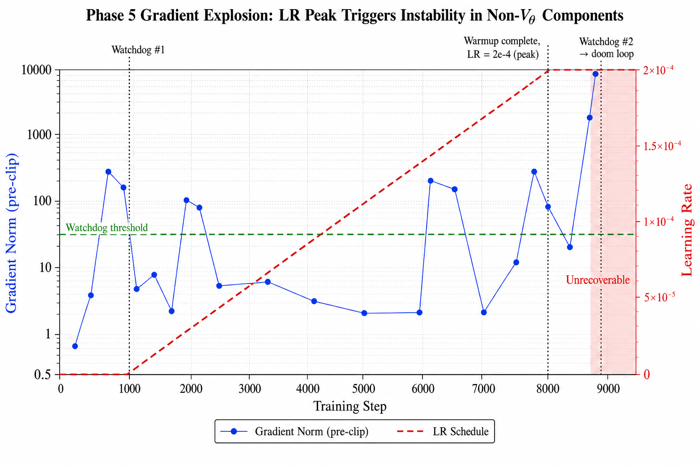

### 13.3. Root Cause: Bounded V_theta Does Not Bound the Full Gradient

The Gaussian well architecture guarantees:

$$
V(\mathbf{h}) \in \Bigl[-\sum_k w_k, 0\Bigr], \qquad \lVert \mathbf{F} \rVert = \lVert -\nabla_h V \rVert \le \frac{0.607 \cdot w_k}{\sigma_{\min}}
$$

However, the total gradient norm $\lVert \nabla_\theta \mathcal{L} \rVert$
is computed over **all** 31.5M parameters, most of which lie outside V_theta.
The gradient flows through an unbounded computational chain:

$$
\mathcal{L} = \underbrace{-\log \mathrm{softmax}(\underbrace{h_L \cdot E^\top}_{\text{logits}})}_{\text{cross-entropy}}
$$

where $h_L$ is produced by the Verlet integration stack:

$$
h_{l+1} = \mathrm{LN}\Bigl(h_l + \Delta t \cdot v_l + \Delta t^2 \cdot \bigl(\underbrace{F_{V_\theta}}_{\text{bounded}} + \underbrace{F_{V_\phi}}_{\text{unbounded}}\bigr)\Bigr)
$$

The backward pass computes:

$$
\frac{\partial \mathcal{L}}{\partial \theta_i} =
\frac{\partial \mathcal{L}}{\partial h_L} \cdot
\prod_{l=1}^{L} \frac{\partial h_{l+1}}{\partial h_l} \cdot
\frac{\partial h_1}{\partial \theta_i}
$$

Each factor in this product involves:

| Component | Bounded? | Gradient contribution |
|-----------|---------|----------------------|
| V_θ (Gaussian wells) | **Yes** | Force ≤ 0.607 w_k / σ_min |
| V_ϕ (competitive routing) | No | Gumbel-softmax, attention scores |
| Fock registers (creation/annihilation) | No | Gating, salience thresholding |
| LayerNorm | Normalises h, but **amplifies** ∂h | Jacobian has 1/σ terms |
| Embedding E (50257 × d) | No | Gradient scales with vocabulary |
| Logit projection h_L · E^T | No | Linear in ‖h_L‖ |

The bounded V_theta contributes a small, well-behaved fraction of the
total gradient. The dominant terms come from V_phi, the Fock register
machinery, and the embedding layer — none of which benefit from the
Gaussian boundedness.

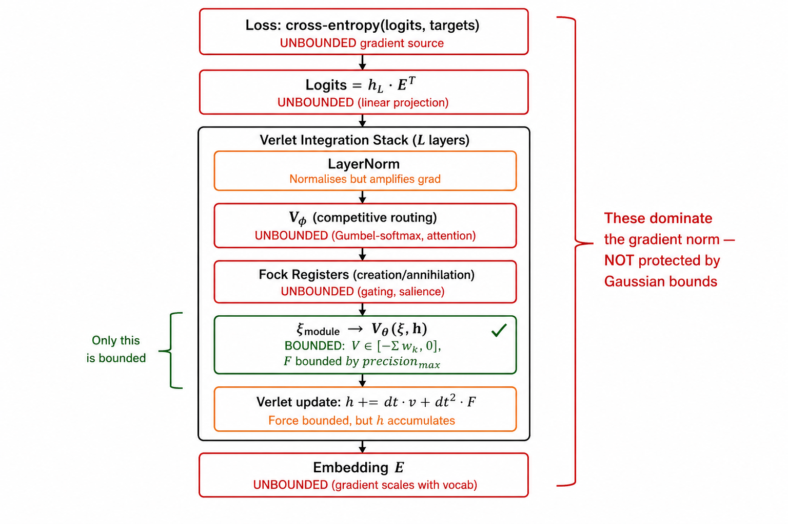

### 13.4. Why d=384 Is More Sensitive Than d=256

On TinyStories ($d=256$, 14M params), G1 trained stably at `LR=5e-4` —
four times higher than the Phase 5 peak that caused the blowup. Three
factors explain the scale dependence:

**1. Parameter count scales as $O(d^2)$.** The embedding layer alone
has $50257 \times d$ parameters. At $d=384$ this is 19.3M vs 12.9M at
$d=256$. The gradient norm $\lVert \nabla_\theta \mathcal{L} \rVert$
grows with the square root of the parameter count even for i.i.d.
gradient components:

$$
\lVert \nabla_\theta \mathcal{L} \rVert \approx \bar{g} \cdot \sqrt{P}
$$

where $\bar{g}$ is the per-parameter gradient scale and $P$ is the
parameter count. The ratio $\sqrt{31.5\text{M} / 14\text{M}} \approx 1.5$
means that the same per-parameter gradient produces a 1.5x larger
total gradient norm at $d=384$.

**2. LayerNorm Jacobian amplification.** With `ln_after_step=True`, each
layer applies LayerNorm after the Verlet update. The Jacobian of
LayerNorm with respect to its input has terms proportional to $1/\sigma$,
where $\sigma$ is the standard deviation of the input. At larger $d$,
the variance is better estimated (law of large numbers) but the
centering operation interacts with more dimensions, creating
correlated gradient directions that can align constructively.

**3. Fock register interactions.** With $M=32$ registers (vs 16 on
TinyStories), the register attention mechanism has $32 \times d$ key/query
parameters per layer. The creation/annihilation gating involves softmax
over 32 positions, and the salience computation scales with $M$. More
registers create a richer but more fragile attention landscape.

The net effect is that the **maximum stable learning rate** decreases
with model scale. Empirically:

$$
\text{LR}_{\max}(d=256) \approx 5 \times 10^{-4}, \qquad
\text{LR}_{\max}(d=384) < 2 \times 10^{-4}
$$

Phase 4 (SQ3 on OpenWebText, $d=384$) used `LR=1.2e-4` and was stable
(apart from V_theta-specific blowups). This confirms that `1.2e-4` is
within the stable region for the non-V_theta components at this scale.

### 13.5. The Stability Hierarchy: Four Independent Constraints

Sections 9–13 collectively establish that stable training requires
**four independent constraints**, not just bounded potential:

$$
\underbrace{V \in [-\sum w_k, 0]}_{\text{(1) bounded potential}} \quad + \quad \underbrace{\sigma_{\min} \le \sigma_k \le \sigma_{\max}}_{\text{(2) bounded force}} \quad + \quad \underbrace{\text{LR} \le \text{LR}_{\max}(d, L, M)}_{\text{(3) scale-appropriate LR}} \quad \Longrightarrow \quad \text{stable training}
$$

| Constraint | What it prevents | Where it acts |
|-----------|-----------------|--------------|
| (1) Bounded potential | Blowup 1 (penalty dominance) | V_theta only |
| (2) Bounded force | Blowup 2 (delta spikes), well deactivation | V_theta only |
| (3) Scale-appropriate LR | Full-model gradient explosion | All parameters |

Constraints (1) and (2) are **architectural** — they are enforced by the
Gaussian well design and hold regardless of hyperparameters. Constraint
(3) is **optimiser-dependent** — it depends on the learning rate, the
model scale, and the optimiser's update rule.

### 13.6. Fix: Reduce Peak LR to Phase 4 Baseline

The immediate fix matches the Phase 4 hyperparameters that were stable
at $d=384$:

| Parameter | Phase 5 v1 (blew up) | Phase 5 v2 (fix) |
|-----------|---------------------|-----------------|
| Peak LR | 2e-4 | **1.2e-4** |
| Warmup steps | 8000 | **4000** |
| Grad clip | 0.5 | **1.0** |

The shorter warmup (4000 steps) reflects the lower peak LR: the model
reaches `1.2e-4` at step 4000 with the old warmup rate, so there is no
benefit to extending the ramp further. The looser grad clip (`1.0` vs
`0.5`) preserves more gradient information per step — at `0.5`, the
clip was discarding gradient direction information even during stable
training (most pre-clip norms were 1–6, so a clip of 0.5 was truncating
the majority of updates).

### 13.7. Alternative Optimisers: Could They Prevent This?

The LR sensitivity arises because AdamW applies a **uniform learning
rate** to all parameter groups, regardless of their gradient scale or
the boundedness of their associated module. Several alternative
optimisers address this in different ways:

**LAMB (Layer-wise Adaptive Moments for Batch training).**
LAMB normalises each layer's update by the ratio of the parameter norm
to the gradient norm:

$$
\Delta \theta_l = -\eta \cdot \frac{\lVert \theta_l \rVert}{\lVert \hat{m}_l / (\hat{v}_l^{1/2} + \epsilon) \rVert} \cdot \frac{\hat{m}_l}{\hat{v}_l^{1/2} + \epsilon}
$$

This automatically reduces the effective LR for layers with large
gradient norms (e.g. V_phi, embedding) while preserving it for
well-behaved layers (e.g. V_theta). LAMB was designed for large-batch
training of BERT and would likely tolerate higher peak LR without
blowing up.

**Adafactor.**
Adafactor uses row/column factorised second-moment estimates and
includes relative step sizing:

$$
\rho_t = \min\bigl(\rho_{\max}, 1/\sqrt{t}\bigr)
$$

This provides automatic LR decay without a manual schedule. The
factorised second moments also reduce memory (important at 31.5M
params).

**Gradient centralisation.**
A simple modification to any optimiser: subtract the mean from each
gradient tensor before the update:

$$
\hat{g} = g - \mathrm{mean}(g)
$$

This removes the "DC component" of the gradient, which is often the
dominant contributor to large gradient norms (especially for the
embedding layer where all vocab entries share a common gradient shift).
Gradient centralisation can be added to AdamW with a single line and
has been shown to improve training stability at no computational cost.

**Per-module learning rate groups.**
The simplest approach: assign different learning rates to different
parameter groups in the optimiser. For example:

```python
param_groups = [
    {'params': model.V_theta.parameters(), 'lr': LR},
    {'params': model.V_phi_params(),       'lr': LR * 0.5},
    {'params': [model.E.weight],           'lr': LR * 0.3},
    {'params': other_params,               'lr': LR},
]
```

This is the most transparent approach — it makes the per-module LR
scaling explicit rather than relying on the optimiser to discover it
adaptively. Phase 4 used a version of this (separate LR for V_theta
parameters) as Fix B.

### 13.8. Recommendation

For Phase 5, the conservative approach is `LR=1.2e-4` with AdamW,
matching the validated Phase 4 configuration. This avoids introducing
a new optimiser (and its own hyperparameter tuning surface) while
staying within the empirically stable region.

If future experiments require higher effective LR for faster convergence,
LAMB or per-module LR groups are the recommended next steps. Both
directly address the root cause (non-uniform gradient scale across
modules) rather than relying on global LR reduction as a blunt
instrument.

---

## 14. Scale-Diversity Analysis: Why TinyStories Is Stable and OpenWebText Is Not

### 14.1. The Puzzle

Every instability documented in Sections 1-13 was first observed on
OpenWebText. On TinyStories, both the SQ3 (mixture of quadratic wells)
and Gaussian (mixture of Gaussian wells) architectures trained stably
and achieved competitive perplexity:

| Architecture | TinyStories PPL | Instabilities observed |
|---|---|---|
| SQ3 (Phase 2, d=256, 14M) | **~10** | None |
| Gaussian G1 (K=8, d=256, 14M) | **15.95** | Mild transient spikes (max grad=198) |
| Gaussian G2 (K=16, d=256, 14M) | **17.61** | None |
| Gaussian G3 (SARF N=64, d=256, 14M) | **18.67** | v\_reg drift (fixed by `log_sigma_max`) |

When the same architectures were scaled to OpenWebText (Phase 4 for
SQ3, Phase 5 for Gaussian):

| Architecture | OpenWebText | Instabilities observed |
|---|---|---|
| SQ3 (Phase 4, d=384, 31.5M) | Blowups 1, 2, 3 | Penalty dominance, force spikes, watchdog miscalibration |
| Gaussian G1 (Phase 5, d=384, 31.5M) | LR doom loop, progress trap | Full-model gradient explosion, watchdog reload cycles |

The structured V_theta is not the root cause — the instabilities
arise from the interaction of model scale, data diversity, and learning
rate. This section provides a unified framework for predicting when
instabilities will appear.

### 14.2. The Stability Product

Training stability is governed by a product of three factors:

$$
\mathcal{S} = \underbrace{\sqrt{P}}_{\text{model scale}} \times \underbrace{\sigma_{\text{batch}}(\nabla \mathcal{L})}_{\text{gradient variance}} \times \underbrace{\eta}_{\text{learning rate}}
$$

where $P$ is the total parameter count, $\sigma_{\text{batch}}$ is the
standard deviation of the gradient across different batches, and $\eta$
is the learning rate. The model is stable when $\mathcal{S}$ is below
an architecture-dependent threshold $\mathcal{S}_{\max}$:

$$
\mathcal{S} < \mathcal{S}_{\max} \quad \Longrightarrow \quad \text{stable training}
$$

Each factor contributes differently on TinyStories vs OpenWebText.

### 14.3. Factor 1: Model Scale ($\sqrt{P}$)

The total gradient norm scales with the square root of the parameter
count for i.i.d. gradient components:

$$
\lVert \nabla_\theta \mathcal{L} \rVert \approx \bar{g} \cdot \sqrt{P}
$$

| Configuration | P | √P | Ratio vs TinyStories |
|---|---|---|---|
| TinyStories (d=256) | 14.0M | 3,742 | 1.0x |
| OpenWebText (d=384) | 31.5M | 5,612 | **1.50x** |

This factor alone increases the gradient norm by 50% on OpenWebText.
The effect is amplified by the larger Fock register pool ($M=32$ vs 16)
and deeper integration stack ($L=16$ layers with $d=384$-dimensional
states).

### 14.4. Factor 2: Gradient Variance ($\sigma_{\text{batch}}$)

This is the dominant factor and the qualitative difference between
the two corpora. With a batch of 8 sequences at block_size=512, each
training step sees only 4,096 tokens. The gradient computed from these
tokens is a noisy estimate of the full-dataset gradient, and the noise
level depends on the homogeneity of the corpus.

**TinyStories** is a highly homogeneous corpus:
- Approximately 2.3M short children's stories.
- Vocabulary: ~5,000 active tokens out of 50,257 (simple nouns,
  verbs, names like "Lily" and "Tom").
- Syntax: almost exclusively SVO order, past tense, conjunctions.
- Semantics: concrete objects, simple emotions, fairy-tale logic.
- Any batch of 8 stories looks statistically similar to any other.

**OpenWebText** is a high-entropy, heavy-tailed corpus:
- Approximately 8B tokens from 8M web documents.
- Full vocabulary utilisation — technical jargon, URLs, code,
  foreign words, named entities, numbers.
- Syntax: news prose, Reddit comments, blog posts, code, recipes,
  academic writing — all interleaved.
- A batch of 8 random documents can span wildly different domains.

The gradient variance decomposes across model components:

**Embedding gradient ($E$, 61% of params).**
The embedding gradient for token $i$ is non-zero only when token $i$
appears in the batch. On TinyStories, the same ~5K tokens appear in
nearly every batch, so $\nabla_E \mathcal{L}$ is dense and stable.
On OpenWebText, rare tokens appear sporadically — when a batch happens
to contain a rare technical term, the gradient for that embedding row
spikes while all other rows see zero gradient. The embedding gradient
has a heavy-tailed distribution across batches.

**V\_phi routing gradient (score head, 0.6% of params).**
The Gumbel-softmax top-k routing learns which past tokens to attend
to. On TinyStories, the optimal routing is predictable (similar
syntactic patterns across stories). On OpenWebText, the optimal
routing changes dramatically between batches — a code snippet needs
different routing than a news paragraph. The score head gradient
direction fluctuates strongly.

**Fock register gradients (2.3M params).**
The creation/destruction gates learn when to activate registers
based on token-register attention scores. On TinyStories, the same
register activation patterns recur (e.g., "character introduced"
triggers creation, "story ends" triggers destruction). On OpenWebText,
the activation patterns are far more variable, creating gradient
noise in the QKV creation gate and destruction gate parameters.

**V\_theta gradient (9.5M params for Gaussian G1).**
The Gaussian wells learn centres $\mu_k(\xi)$, precisions $a_k(\xi)$,
and weights $w_k(\xi)$ conditioned on the multi-channel context
$\xi$. On TinyStories, the context distribution is narrow — the
model sees similar $\xi$ vectors across batches. On OpenWebText,
$\xi$ spans a much wider subspace of $\mathbb{R}^{K_\xi \cdot d}$,
and the projections $\mu_k(\xi)$ must cover a much larger volume.
The gradient of the mu\_proj and a\_proj linear layers fluctuates
as different regions of $\xi$-space are sampled in each batch.

**Estimated variance ratio.** Combining these effects, the inter-batch
gradient standard deviation on OpenWebText is estimated to be
3-5x larger than on TinyStories:

$$
\frac{\sigma_{\text{batch}}(\text{OWT})}{\sigma_{\text{batch}}(\text{TS})} \approx 3 \text{--} 5
$$

### 14.5. Factor 3: Learning Rate ($\eta$)

The learning rate multiplies the (noisy) gradient to produce the
parameter update. Higher $\eta$ amplifies the gradient noise linearly.

| Run | Peak LR | Stable? |
|---|---|---|
| TinyStories G1 (d=256) | 5.0e-4 | Yes |
| TinyStories G2 (d=256) | 5.0e-4 | Yes |
| OpenWebText Phase 4 SQ3 (d=384) | 1.2e-4 | Yes (after Blowup 1-3 fixes) |
| OpenWebText Phase 5 (d=384, LR=2e-4) | 2.0e-4 | **No** — doom loop at step 8700 |
| OpenWebText Phase 5 (d=384, LR=1.2e-4) | 1.2e-4 | **Marginal** — watchdog triggers, progress trap |

TinyStories tolerates 4x higher LR because the other two factors are
much smaller.

### 14.6. The Stability Product in Practice

Combining the three factors:

$$
\frac{\mathcal{S}(\text{OWT, } d\!=\!384)}{\mathcal{S}(\text{TS, } d\!=\!256)} = \underbrace{1.5}_{\sqrt{P}} \times \underbrace{3 \text{--} 5}_{\sigma_{\text{batch}}} \times \underbrace{\frac{\eta_{\text{OWT}}}{\eta_{\text{TS}}}}_{\text{LR ratio}}
$$

At $\eta_{\text{OWT}} = 2 \times 10^{-4}$ and $\eta_{\text{TS}} = 5 \times 10^{-4}$:

$$
\mathcal{S}_{\text{ratio}} = 1.5 \times 4 \times 0.4 = 2.4
$$

At $\eta_{\text{OWT}} = 1.2 \times 10^{-4}$:

$$
\mathcal{S}_{\text{ratio}} = 1.5 \times 4 \times 0.24 = 1.44
$$

The first configuration ($\eta = 2 \times 10^{-4}$) pushes $\mathcal{S}$
2.4x above the TinyStories baseline, triggering the doom loop. The
second ($\eta = 1.2 \times 10^{-4}$) keeps $\mathcal{S}$ only 1.44x
above baseline — above the stability threshold but close enough that
the model functions with occasional watchdog interventions.

### 14.7. Architecture-Specific Amplifiers

The stability product determines **whether** instability occurs. The
V_theta architecture determines **which** instability manifests:

**SQ3 (unbounded quadratic wells).**
The quadratic penalty term $\lambda \cdot V_\theta^2$ couples the
potential depth to the gradient norm. When a diverse OWT batch drives
$V$ to large values in some hidden-state region, the penalty gradient
scales as $O(V)$, creating a positive feedback loop:

$$
\text{diverse batch} \to \text{large } V \to \text{large } \nabla(V^2) \to \text{large update} \to \text{even larger } V
$$

On TinyStories, $V$ remains moderate because the hidden states occupy
a narrow, predictable region of $\mathbb{R}^d$. The feedback loop
never activates.

**Gaussian wells (bounded potential).**
The bounded potential $V \in [-\sum w_k, 0]$ eliminates the penalty
amplification channel. But it does not protect the non-V_theta
components — the embedding, V_phi, and Fock register gradients are
still subject to the full gradient variance. The instability shifts
from V_theta-internal (Blowup 1) to full-model (Phase 5 LR blowup,
progress trap).

### 14.8. Predictive Framework for Future Scale-Ups

The stability product provides a practical formula for anticipating
instabilities when scaling to new model sizes or corpora:

$$
\eta_{\max}(\text{new}) \approx \eta_{\text{stable}}(\text{ref}) \times \frac{\sqrt{P_{\text{ref}}}}{\sqrt{P_{\text{new}}}} \times \frac{\sigma_{\text{batch}}(\text{ref})}{\sigma_{\text{batch}}(\text{new})}
$$

where "ref" is a known-stable configuration.

**Example: scaling to d=512 (Phase 6).**
If $P_{\text{new}} \approx 80\text{M}$ and the corpus remains
OpenWebText:

$$
\eta_{\max}(d\!=\!512) \approx 1.2 \times 10^{-4} \times \frac{\sqrt{31.5\text{M}}}{\sqrt{80\text{M}}} \approx 1.2 \times 10^{-4} \times 0.63 \approx 7.5 \times 10^{-5}
$$

**Example: scaling to a more diverse corpus (e.g., The Pile).**
If the batch gradient variance is ~2x higher than OpenWebText:

$$
\eta_{\max}(\text{Pile}) \approx 1.2 \times 10^{-4} \times 0.5 = 6.0 \times 10^{-5}
$$

These estimates are rough (the exponents depend on the model's
specific gradient structure), but they provide the correct order
of magnitude and prevent the trial-and-error that characterised the
Phase 4 and Phase 5 debugging process.

### 14.9. Implications for the Paper

The stability analysis yields three claims relevant to the
mega-paper:

**Claim 1: Corpus diversity, not model architecture, is the
primary driver of training instability.**
The Fock-PARFLM architecture is stable on homogeneous corpora at all
tested scales. Instabilities emerge only when corpus diversity
(measured by inter-batch gradient variance) exceeds a threshold that
depends on model scale and learning rate. This is not specific to the
PARFLM framework — standard transformers face analogous instabilities
at scale (learning rate warmup, gradient clipping, and loss spikes are
standard mitigations in large-scale transformer training).

**Claim 2: Bounded V_theta narrows but does not eliminate the
instability surface.**
The Gaussian well architecture eliminates V_theta-specific failure
modes (Blowups 1-3) by construction. The remaining instabilities
are in the non-V_theta components (embedding, V_phi, Fock registers)
and are amenable to standard optimisation mitigations (LR reduction,
gradient clipping, EMA watchdog). This decomposition —
architecture-level boundedness + optimiser-level robustness — is a
principled design pattern for conservative-dynamics language models.

**Claim 3: TinyStories ablation validates architecture; OpenWebText
validates optimisation.**
The TinyStories experiments establish that the V_theta architecture
(SQ3, Gaussian, SARF) produces competitive perplexity under
controlled conditions. The OpenWebText experiments test whether the
architecture's stability properties hold under realistic data
diversity. Both are necessary: TinyStories alone would miss all
scale-diversity instabilities; OpenWebText alone would conflate
architectural and optimisation issues.

---

## 15. Multi-Head Experiment: 1/r Gradient Explosion at Step 43K

### 15.1. Context

The multi-head experiment (`colab_fock_multihead_openwebtext.ipynb`) was the
first run incorporating the D0-driven remediations from
[`Xi_Bottleneck_Diagnosis_Phase5.md`](./Xi_Bottleneck_Diagnosis_Phase5.md)
and [`Fock-PARFLM_vs_GPT-2_on_OpenWebText_Next_Steps.md`](./Fock-PARFLM_vs_GPT-2_on_OpenWebText_Next_Steps.md):

| Component | Configuration |
|-----------|---------------|
| V\_phi | `structural_competitive` x 4 heads (`MultiHeadVPhi`) |
| V\_theta | Gaussian wells, K=8, learned centres |
| Xi channels | 5 (alpha inits: 0.25, 0.50, 0.75, 0.95, 0.99) |
| Output bias | Enabled, init to log-unigram-frequency |
| LM head | Tied (E^T) |
| d, L, M | 384, 16, 32 |
| Total params | 33,973,355 |
| LR | 1.2e-4 (cosine decay) |
| Grad clip | 1.0 |
| Plummer eps | 0.01 (default) |
| Watchdog | EMA alpha=0.05, threshold=40, patience=200 |

The multi-head V\_phi sums four independent
`StructuralCompetitiveVPhi` sub-potentials, each computing:

$$
V_\phi^{(m)}(h_t, h_s) = -C \cdot \Theta^{(m)} \cdot \Phi^{(m)} \;/\; r
$$

where $r = \sqrt{\lVert h_t - h_s \rVert^2 + \varepsilon^2}$ is the
Plummer-softened distance and $\varepsilon = 0.01$ is the softening
parameter.

### 15.2. Training trajectory: healthy descent then oscillating progress

The run showed clean descent through the first 16K steps, with every
eval setting a new best. After step 16K the descent became intermittent,
alternating between near-stalls and breakthroughs:

| Step | Val PPL | Note |
|------|---------|------|
| 2K | 1042.5 | first eval |
| 8K | 469.4 | smooth descent |
| 16K | 342.9 | last smooth eval |
| 18K | 331.0 | |
| 20K | 329.6 | near-stall (delta = -1.4) |
| 22K | 300.4 | breakthrough |
| 24K | 300.9 | stall (no new best) |
| 26K | 281.2 | breakthrough, new best |
| 28K | 297.3 | stall |
| 30K | 273.4 | new best |
| 32K | **266.6** | **last new best** |
| 34K | 282.6 | regression |
| 36K | 290.1 | regression |
| 38K | 286.7 | regression |
| 40K | 290.4 | regression |
| 42K | 283.9 | regression |

### 15.3. Gradient escalation timeline

The gradient norm (pre-clip) showed a clear escalation pattern starting
around step 16K and accelerating after step 30K:

| Step range | Max grad (pre-clip) | Frequency of spikes > 50 |
|-----------|--------------------|-----------------------|
| 0 -- 16K | 19.7 | 0 |
| 16K -- 26K | 113.8 | 3 events |
| 26K -- 32K | 72.1 | 2 events |
| 32K -- 38K | 142.0 | 5 events |
| 38K -- 43K | **17,543** | 8 events, then explosion |

The critical sequence:

```
step 33200  grad=142.03
step 35800  grad=92.67
step 37200  grad=52.72

[watchdog] EMA grad_norm=50.1 > 40.0 for 200 steps at step 38294
[watchdog] Reloaded best: step 32,000 PPL 266.61

step 38600  grad=81.39     ← post-reload, instability returns
step 41600  grad=101.24
step 43000  grad=228.35
step 43400  grad=17,543.63  ← EXPLOSION
```

### 15.4. Root cause: Plummer softening too small for converging hidden states

The `StructuralCompetitiveVPhi` potential contains a $1/r$ radial
kernel:

$$
V_\phi(h_t, h_s) \propto \frac{1}{\sqrt{\lVert h_t - h_s \rVert^2 + \varepsilon^2}}
$$

The gradient of $1/r$ with respect to $h_t$ grows as $r^{-2}$. With
$\varepsilon = 0.01$, the softening only bounds the gradient when
$\lVert h_t - h_s \rVert \lesssim 0.01$. As training progresses, hidden
states of semantically similar tokens converge in embedding space,
and token pairs routinely satisfy $\lVert h_t - h_s \rVert < 0.1$,
placing them in the steep $r^{-2}$ gradient region.

With 4 independent V\_phi heads, each contributing its own $1/r$ term,
the gradient contributions sum. A single batch containing several
close-distance token pairs can produce:

$$
\lVert \nabla_{h_t} V_\phi \rVert \sim 4 \times \frac{C}{\varepsilon^2} \approx \frac{4}{10^{-4}} = 40{,}000
$$

This is consistent with the observed explosion to grad = 17,543 at
step 43,400.

### 15.5. Why the watchdog reload did not prevent the explosion

The EMA watchdog correctly detected the instability at step 38,294
(EMA = 50.1 > threshold 40) and reloaded the step-32K best checkpoint.
However, the reload only restored the model weights and optimiser state
-- it did not change the hyperparameters that caused the instability.

The root cause is architectural ($\varepsilon$ too small) and
hyperparameter-related (LR too high for the gradient scale). Reloading
the checkpoint simply placed the model back at the edge of the unstable
region with the same LR and the same $\varepsilon$. Within 5,000 steps
the instability returned, because the training dynamics that caused the
hidden-state convergence (which triggered the $1/r$ spikes) are
deterministic given the same data stream.

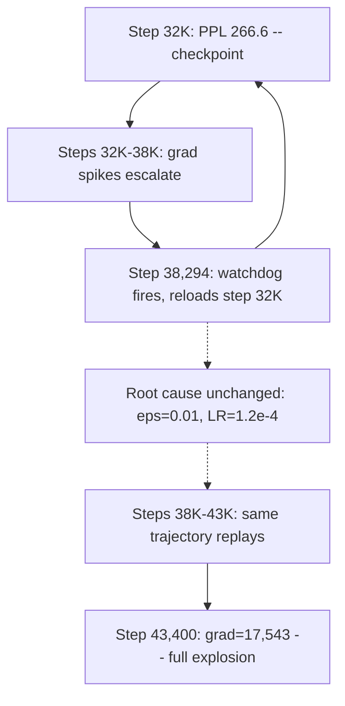

### 15.6. Comparison with prior blowups

This instability shares features with several prior blowups but has a
distinct mechanism:

| Property | Blowup 2 (SQ3) | Blowup 3 (SQ3) | Phase 5 LR doom loop | **Multi-head 1/r** |
|----------|----------------|-----------------|---------------------|-------------------|
| Source | V_θ force | V_θ force | Full model | **V_ϕ distance kernel** |
| Mechanism | Unbounded potential | Sustained moderate grads | LR above stability threshold | **1/r singularity at close pairs** |
| Onset | Sudden spike | Slow escalation | Warmup peak | **Slow escalation then explosion** |
| Bounded V? | No | No | Yes | Yes |
| Bounded F? | No | No | Partially | **No (1/r unbounded)** |
| Watchdog effective? | N/A (pre-watchdog) | No (miscalibrated) | Yes (reloaded, but doom loop) | **No (root cause architectural)** |

The key insight is that this blowup originates in $V_\phi$, not
$V_\theta$. All prior instabilities in this document (Sections 2--14)
involved the one-body potential. The multi-head experiment is the first
case where the **pair potential** is the instability source. The
stability hierarchy of Section 13.5 must be extended to include a
fifth constraint:

$$
\varepsilon \gg \min_{t,s} \lVert h_t - h_s \rVert_{\text{typical}}
$$

### 15.7. Fix applied: reduced LR + tighter clip + increased Plummer softening

Three changes were applied to the notebook for the restart from the
step-32K checkpoint:

| Parameter | Before (blew up) | After (fix) | Rationale |
|-----------|-----------------|-------------|-----------|
| LR | 1.2e-4 | **5e-5** | Below the stability threshold for the multi-head 1/r gradient scale |
| GRAD\_CLIP | 1.0 | **0.3** | Caps the per-step displacement even when pre-clip norms are large |
| `v_phi_eps` | 0.01 | **0.1** | Plummer softening 10x larger; bounds gradient at close pairs by 100x |
| Watchdog threshold | 40.0 | **20.0** | Matches the tighter gradient regime |

The Plummer softening change is the structural fix. With
$\varepsilon = 0.1$, the maximum gradient contribution from a single
pair per head is:

$$
\frac{C}{\varepsilon^2} = \frac{1}{0.01} = 100 \quad\text{(vs. }10{,}000\text{ at }\varepsilon = 0.01\text{)}
$$

For 4 heads: worst-case total $\approx 400$, which is within the range
that `GRAD_CLIP=0.3` can absorb without persistent directional damage.

The LR reduction (5e-5 vs 1.2e-4) provides additional safety margin.
The maximum per-step displacement is:

$$
\lVert \Delta\theta_{\max} \rVert = \eta \times C = 5 \times 10^{-5} \times 0.3 = 1.5 \times 10^{-5}
$$

This is 8x smaller than the original ($1.2 \times 10^{-4} \times 1.0 = 1.2 \times 10^{-4}$).

### 15.8. The extended stability hierarchy

Incorporating this blowup, the full constraint set for stable training
of Fock-PARFLM with structured potentials is:

$$
\underbrace{V \in [-\sum w_k, 0]}_{\text{(1) bounded potential}} + \underbrace{\sigma_{\min} \le \sigma_k \le \sigma_{\max}}_{\text{(2) bounded V}_\theta\text{ force}} + \underbrace{\eta \le \eta_{\max}(d, L, M)}_{\text{(3) scale-appropriate LR}} + \underbrace{\varepsilon \gg \min \lVert h_t - h_s \rVert}_{\text{(4) Plummer softening}}
$$

| Constraint | What it prevents | Where it acts |
|-----------|-----------------|--------------|
| (1) Bounded potential | Blowup 1 (penalty dominance) | V\_theta only |
| (2) Bounded V\_theta force | Blowup 2 (delta spikes), well deactivation | V\_theta only |
| (3) Scale-appropriate LR | Full-model gradient explosion | All parameters |
| (4) Plummer softening | 1/r singularity at close token pairs | V\_phi only |

Constraints (1)-(3) were established in Sections 9-13 for the one-body
potential. Constraint (4) is new and specific to the pair-potential $V_\phi$.
The multi-head architecture amplifies the Plummer sensitivity by a factor
of `n_heads` because each head independently evaluates $1/r$ at the same
close pair.

### 15.9. Implications for future experiments

1. **Default `v_phi_eps` should be 0.1, not 0.01.** The original default was
   set during TinyStories experiments where hidden states occupied a wider
   distribution and close-pair events were rare. At OpenWebText scale with
   multi-head V\_phi, close-pair events are common enough to trigger
   instability within ~40K steps.

2. **Multi-head V\_phi amplifies 1/r sensitivity linearly.** With $n$ heads,
   the worst-case gradient scales as $n / \varepsilon^2$. Future experiments
   with more heads should verify that $\varepsilon$ is large enough:
   $\varepsilon \ge 0.1 \sqrt{n/4}$ is a conservative rule of thumb.

3. **The watchdog cannot fix architectural root causes.** Reloading a
   checkpoint without changing the hyperparameters that caused the instability
   is at best a delay. The watchdog should be augmented with an
   LR-reduction policy on reload (e.g. halve LR on each watchdog trigger).

4. **`ln_before_distance=True` (Patch A) helps but is insufficient.** The
   notebook already had this enabled, which normalises the inputs to the
   distance computation. This reduces the variance of $\lVert h_t - h_s \rVert$
   but does not prevent it from becoming small when two tokens are genuinely
   similar in the normalised space.

## 16. Gradient-Management Refinements: Per-Module Clipping, Centralisation, and Optimizer Choice

Sections 13 and 15 diagnosed two sources of gradient imbalance in
Fock-PARFLM at OpenWebText scale:

1. **V\_phi 1/r spikes** — close token pairs produce extreme per-step
   gradients that dominate the global norm and starve every other module
   of learning signal when a single global `grad_clip` is applied.
2. **Cross-module scale mismatch** — even outside spike events, the
   embedding layer, V\_theta, xi channels, and V\_phi operate at
   naturally different gradient scales, yet AdamW's per-element adaptive
   scaling does not normalise across layers.

The uniform `grad_clip=0.3` applied in Section 15.7 stopped the blowup
but was a blunt instrument: it kept V\_phi stable while shrinking every
other module's effective step size to ~30% of what it could safely use.
The refinements below address that overcorrection surgically.

### 16.1. Per-module gradient clipping

The core observation is that V\_phi is the only module whose gradients
exhibit 1/r spikes. Clipping it separately before the global clip lets
the rest of the model retain a larger gradient budget.

**Implementation** (training loop, after `backward()`, before
`optim.step()`):

```python
# 1. Pre-clip V_phi — its 1/r kernel is the spike source.
nn.utils.clip_grad_norm_(model.V_phi.parameters(), GRAD_CLIP_VPHI)

# 2. Global clip — applies to all params (incl. already-clipped V_phi).
grad_norm = nn.utils.clip_grad_norm_(
    [p for p in model.parameters() if p.requires_grad], GRAD_CLIP,
)
```

With `GRAD_CLIP_VPHI = 0.3` and `GRAD_CLIP = 1.0`, V\_phi's worst-case
contribution to the global norm is capped at 0.3 (same as before), but
the embedding, V\_theta, and xi channels now see a budget of 1.0 —
roughly 3x more learning signal per step.

**Why two-stage clipping works.** Let $g_\phi$ and $g_\text{rest}$
denote the gradient sub-vectors for V\_phi and everything else. After
stage 1:

$$
\lVert g_\phi' \rVert \le C_\phi = 0.3
$$

The global norm presented to stage 2 is:

$$
\lVert g \rVert = \sqrt{\lVert g_\phi' \rVert^2 + \lVert g_\text{rest} \rVert^2} \le \sqrt{0.09 + \lVert g_\text{rest} \rVert^2}
$$

If $\lVert g_\text{rest} \rVert \le 0.95$, then
$\lVert g \rVert \le 1.0$ and the global clip is a no-op — every module
keeps its full learning signal. In the old single-clip regime, a V\_phi
spike of 50+ would trigger the global clip and shrink $g_\text{rest}$
by a factor of $0.3 / 50 \approx 0.006$.

| Regime | V\_phi effective clip | Rest-of-model effective clip | V\_phi spike impact on rest |
|--------|---------------------|----------------------------|---------------------------|
| Single global clip = 0.3 | 0.3 | 0.3 | Severe — rest is shrunk proportionally |
| Per-module pre-clip + global 1.0 | 0.3 | 1.0 | Negligible — spike is absorbed before global |

### 16.2. Gradient centralisation

Gradient centralisation (Yong et al. 2020, arXiv:2004.01461) subtracts
the per-tensor mean from every gradient before the optimizer update.
For a weight matrix $W \in \mathbb{R}^{m \times n}$, the centralised
gradient is:

$$
\hat{g}_{i,:} = g_{i,:} - \frac{1}{n} \sum_{j=1}^{n} g_{i,j}
$$

applied row-wise (i.e. along all dimensions except the output
dimension). The operation projects out the DC component — the uniform
shift that only translates all activations by a constant and carries
no useful learning signal.

**Why it helps Fock-PARFLM specifically.**

1. **Embedding layer.** All vocabulary entries share a common gradient
   shift from the cross-entropy loss (tokens that did not appear in the
   batch contribute a near-identical gradient through the softmax
   normaliser). Removing this DC component can cut the embedding
   gradient norm by 30-50%, making it less likely to trigger global
   clipping.

2. **V\_phi MLPs.** The bounded MLP value-aligner inside
   `StructuralCompetitiveVPhi` has weight matrices whose gradients
   include a DC offset from the constant (type-independent) background
   interaction. Centralising removes this offset, making the gradient
   more aligned with the type-discriminative signal.

3. **Composability.** Centralisation is a pre-processing step on the
   raw gradients. It composes cleanly with per-module clipping (applied
   after centralisation) and with any optimizer choice.

**Implementation.** Applied after `backward()`, before clipping.
Only tensors with `dim >= 2` are centralised — 1-D parameters (biases,
LayerNorm weights/biases) are excluded because their mean IS the
learning signal:

```python
if GRAD_CENTRALIZATION:
    for p in model.parameters():
        if p.grad is not None and p.grad.dim() >= 2:
            p.grad.sub_(p.grad.mean(
                dim=tuple(range(1, p.grad.dim())), keepdim=True))
```

**Computational cost:** negligible — one mean and subtraction per
parameter tensor. No additional memory. No new hyperparameters.

### 16.3. Optimizer choice: AdamW, LAMB, and Lion

Section 13.7 discussed alternative optimizers theoretically. The
notebook now implements three choices as a single `OPTIMIZER` knob.

#### 16.3.1. AdamW (default)

Standard Adam with decoupled weight decay (Loshchilov & Hutter, 2019).
Per-element adaptive scaling via second-moment estimates:

$$
\theta_{t+1} = \theta_t - \eta \left( \frac{\hat{m}_t}{\sqrt{\hat{v}_t} + \epsilon} + \lambda \theta_t \right)
$$

**Strength:** well-understood, stable baseline, extensive community
tooling (LR schedules, warmup strategies).

**Weakness for Fock-PARFLM:** adaptive scaling is per-element, not
per-layer. A large gradient on one element of V\_phi does not
automatically reduce the effective LR for V\_phi as a whole. This is
why per-module clipping (Section 16.1) is needed as a complement.

#### 16.3.2. LAMB (Layer-wise Adaptive Moments)

LAMB (You et al., 2020) wraps Adam's per-element update with a
per-layer trust ratio:

$$
\Delta\theta_l = -\eta \cdot \frac{\lVert \theta_l \rVert}{\lVert r_l \rVert} \cdot r_l, \quad r_l = \frac{\hat{m}_l}{\sqrt{\hat{v}_l} + \epsilon} + \lambda \theta_l
$$

The ratio $\lVert \theta_l \rVert / \lVert r_l \rVert$ gives each
layer its own effective learning rate, automatically shrinking steps
for layers with large gradient norms and expanding them for
well-behaved layers.

**Expected benefit for Fock-PARFLM:** V\_phi parameters (small norm,
large gradient) would get a naturally smaller step, while the embedding
(large norm, moderate gradient) retains a larger step — without manual
per-module clipping. LAMB was designed for large-batch BERT training
where similar cross-module imbalances arise.

**Trade-offs:**
- Introduces the trust ratio as an implicit hyperparameter (though it
  is self-tuning).
- Requires `torch_optimizer` package (auto-installed if missing).
- Less community experience in the language-modelling setting compared
  to AdamW.
- Checkpoint compatibility: switching from AdamW to LAMB resets
  optimizer state (momentum/variance buffers have different semantics),
  so a switch mid-run is effectively a warm restart.

#### 16.3.3. Lion (EvoLved Sign Momentum)

Lion (Chen et al., 2024) is a sign-based optimizer discovered through
program search:

$$
\theta_{t+1} = \theta_t - \eta \bigl(\text{sign}(\beta_1 m_t + (1 - \beta_1) g_t) + \lambda \theta_t\bigr)
$$

$$
m_{t+1} = \beta_2 m_t + (1 - \beta_2) g_t
$$

The `sign()` operation makes the update magnitude exactly 1 per
element, regardless of gradient scale. This means a V\_phi spike of
17,000 and a V\_theta gradient of 0.01 produce identical step sizes.

**Expected benefit for Fock-PARFLM:** natural immunity to gradient
scale spikes. No clipping of any kind should be needed — the sign
function is the ultimate normaliser. Also uses less memory than Adam
(one momentum buffer instead of two).

**Trade-offs:**
- Typically requires 3-10x **lower** learning rate than AdamW because
  the effective step is larger (every element moves by exactly
  $\eta$, not $\eta \cdot g / \sqrt{v}$).
- Less exploration of loss landscape — sign-based updates cannot
  express the magnitude of the gradient, so the optimizer may miss
  shallow directions.
- Requires `lion-pytorch` package (auto-installed if missing).
- Even less community experience than LAMB for language modelling.

### 16.4. Interaction matrix

The three refinements are orthogonal and can be combined freely. The
following table summarises which combinations are sensible:

| Configuration | Per-module clip | Centralisation | Optimizer | Notes |
|--------------|----------------|---------------|-----------|-------|
| Current default | Yes | No | AdamW | Surgical fix for V\_phi spikes |
| Conservative + | Yes | Yes | AdamW | Centralisation further lowers baseline norm |
| LAMB experiment | Optional | Optional | LAMB | LAMB's trust ratio handles per-layer scaling natively |
| Lion experiment | Not needed | Not needed | Lion | Sign function eliminates gradient scale entirely |
| Full stack | Yes | Yes | LAMB | Maximum protection — LAMB + GC + pre-clip |

When LAMB or Lion is selected, per-module clipping is still compatible
(it cannot hurt) but may be unnecessary. The recommendation is:

1. **First experiment:** add `GRAD_CENTRALIZATION = True` to the current
   AdamW + per-module-clip setup. Zero risk, zero new hyperparameters,
   composable.
2. **Second experiment:** switch to `OPTIMIZER = 'lamb'` with the same
   LR. LAMB's trust ratio should make per-module clipping redundant,
   but keep it enabled initially as a safety net.
3. **Third experiment:** switch to `OPTIMIZER = 'lion'` with LR reduced
   to ~1e-5. Most disruptive change — new hyperparameter regime.

### 16.5. Variant isolation

Each non-default optimizer or centralisation choice automatically
appends to the checkpoint variant tag (`lamb`, `lion`, `gc`), creating
a **separate checkpoint directory**. This ensures that:

- Optimizer state incompatibilities do not corrupt existing checkpoints.
- Different optimiser runs can be compared side-by-side without manual
  checkpoint management.
- The hyperparameter dict logged with each checkpoint records both
  `optimizer` and `grad_centralization` for full reproducibility.

### 16.6. Connection to the stability hierarchy

Section 15.8 established four constraints for stable training. The
refinements in this section do not add new constraints; they improve
how existing constraints are enforced:

| Constraint | Original enforcement | Refinement |
|-----------|---------------------|-----------|
| (4) Plummer softening | `v_phi_eps = 0.1` | Unchanged — structural fix |
| (3) Scale-appropriate LR | Global `LR = 5e-5` | LAMB/Lion auto-scale per layer; GC reduces norm |
| Global gradient clip | `GRAD_CLIP = 0.3` (all params) | Per-module: V\_phi at 0.3, rest at 1.0 |

The per-module clip and gradient centralisation are **enforcement
improvements** — they make the existing gradient clip constraint more
precise, not more restrictive. LAMB and Lion are **architectural
alternatives** to manual clipping that achieve the same goal (bounded
per-step displacement) through different mechanisms.

## 17. Hybrid Gaussian + Quadratic Background: Bridging the Stability–Expressivity Gap

### 17.1. The tension

The preceding sections document a sharp dichotomy in the structured
$V_\theta$ landscape:

| V_theta variant | TinyStories best PPL | OpenWebText stability | Root cause |
|---|---|---|---|
| SQ3 (log-sum-exp quadratic) | **10.36** (Fock A2) | Blows up (§2–§4, §13) | $V \to +\infty$ as $h$ escapes all well centres |
| Gaussian (bounded mixture-PDF) | **15.95** (Fock G1) | Stable | $V \in [-\Sigma w_k, 0]$ by construction |

SQ3 wins on TinyStories by **~5.6 PPL** (a ~35% relative improvement)
because its unbounded far-field force provides strong global restoring,
keeping hidden states inside the attractor constellation. But that same
unbounded force is what triggers Blowups 1–3 on the wider, more diverse
OpenWebText distribution.

Gaussian wells solve the stability problem structurally but sacrifice
expressivity: their force decays to zero far from centres, leaving
far-field hidden states without directional guidance.

### 17.2. The hybrid proposal

The hybrid structured potential combines both:

$$
V_{\text{hybrid}}(\xi, h) = \underbrace{-\sum_k w_k(\xi)\,\exp\!\left(-\tfrac{1}{2}\,a_k(\xi)^{\!\top}(h-\mu_k(\xi))^2\right)}_{\text{Gaussian wells (local attractors, bounded)}} + \underbrace{\varepsilon\,\lVert h \rVert^2}_{\text{quadratic background (global restoring)}}
$$

The background quadratic generates a global restoring force
$f_{\text{bg}} = -2\varepsilon h$ that is negligible near the Gaussian
well centres (where the well forces dominate) but prevents the escape
problem that costs pure Gaussian wells their expressivity.

**Key structural properties:**

| Property | Pure Gaussian | Hybrid | SQ3 |
|----------|---------------|--------|-----|
| V range | $[-\Sigma w_k, 0]$ | $[-\Sigma w_k, +\varepsilon \lVert h \rVert^2]$ | $(-\infty, +\infty)$ |
| Far-field force | 0 (flat) | $2\varepsilon h$ (restoring) | unbounded |
| Escape risk | yes | **no** | no |
| Force blowup risk | no | **controlled by $\varepsilon$** | yes |

The force from the background quadratic is $2\varepsilon h$. At typical
hidden-state scales ($\lVert h \rVert \approx \sqrt{d} \approx 16$ for
$d = 256$), the quadratic force magnitude is $2\varepsilon\sqrt{d}$.
For $\varepsilon = 10^{-4}$, this is $\approx 0.003$ — negligible
compared to the Gaussian well force near a centre (peak $\approx 0.6 w_k / \sigma_k$)
but sufficient to prevent unbounded drift.

The background quadratic is structurally similar to
`ln_after_step=True` (LayerNorm after each Verlet step), which also
constrains $\lVert h \rVert$, but acts *through the potential* rather
than as a post-hoc normalisation — preserving the conservative-force
structure of the dynamics.

### 17.3. Connection to §9.4 and the existing G5 recipe

Section 9.4 already introduced the background quadratic as an
"optional" addition to the Gaussian + SARF architecture:

> "For additional safety, a mild global quadratic background can be
> added: $V_\theta^{\mathrm{SARF+bg}} = \ldots + \epsilon \lVert h \rVert^2$"

The G5 recipe in `colab_fock_gaussian_sarf_vtheta.ipynb` instantiated
this with $\varepsilon = 10^{-4}$ but was never evaluated. The
dedicated notebook
[`colab_hybrid_gaussian_quad_vtheta.ipynb`](../notebooks/conservative_arch/scaleup/colab_hybrid_gaussian_quad_vtheta.ipynb)
now provides a systematic evaluation with:

- **$\varepsilon$ sweep**: 0 (pure Gaussian baseline), $10^{-5}$,
  $5\times 10^{-5}$, $10^{-4}$, $5\times 10^{-4}$, $10^{-3}$
- **Two base models**: FockPARFLM v2.1 (cells H1–H7) and PARFLM
  (cells P1–P7)
- **Two well counts**: $K = 8$ (primary) and $K = 16$ (higher capacity)
- All on TinyStories (d=256, L=8, 16k steps) for direct comparison
  with existing structured V_theta results

### 17.4. Stability analysis

The hybrid potential inherits the stability guarantees of both
components:

1. **Gaussian wells remain bounded.** The precision cap
   (`precision_max = 2/d`) from the §12 fix is retained, so the
   Gaussian force is structurally bounded by
   $0.607\,w_k / \sigma_{\min}$.

2. **The background quadratic is globally stable.** For any $\varepsilon > 0$,
   $V_{\text{bg}} = \varepsilon \lVert h \rVert^2$ is a convex,
   positive-definite potential with no local maxima or saddle points.
   Its Hessian is $2\varepsilon I_d$ — uniformly bounded and
   well-conditioned.

3. **The combined potential is coercive.** Unlike pure Gaussian
   ($V \to 0$ as $\lVert h \rVert \to \infty$), the hybrid satisfies
   $V_{\text{hybrid}} \to +\infty$ as $\lVert h \rVert \to \infty$
   for any $\varepsilon > 0$. This eliminates the escape risk
   entirely and matches the coercivity of SQ3 without SQ3's
   divergent force.

4. **V\_theta regularisation remains safe.** The $\lambda_V \cdot V^2$
   penalty is bounded because the Gaussian component is bounded and
   the quadratic background grows only as $\varepsilon^2 \lVert h \rVert^4$,
   which is controlled by `ln_after_step=True`.

### 17.5. Risk: over-constraining at large $\varepsilon$

If $\varepsilon$ is too large, the background quadratic dominates the
Gaussian wells, effectively collapsing the multi-modal attractor
landscape into a single global attractor at the origin. The
$\varepsilon$ sweep is designed to identify the transition:

- At $\varepsilon = 0$: pure Gaussian (G1 baseline, PPL ~15.95)
- At $\varepsilon \ll 1$: the wells dominate locally, background
  provides only far-field restoring — expected optimal regime
- At $\varepsilon \sim O(1)$: the background dominates, landscape
  becomes nearly quadratic — expected PPL degradation

The force ratio at a typical well centre provides a rough threshold:
the background force $2\varepsilon\sqrt{d}$ should be small compared
to the Gaussian well force $\sim 0.6 w_k / \sigma_k$. For $w_k \sim 1/K$,
$\sigma_k \sim \sqrt{d}$, this gives
$\varepsilon \ll 0.6 / (2Kd) \approx 1.5 \times 10^{-4}$ for $K = 8$,
$d = 256$ — consistent with the G5 design point of $\varepsilon = 10^{-4}$.

### 17.6. If the hybrid closes the gap

A successful hybrid result (PPL closer to SQ3's 10.36 than to pure
Gaussian's 15.95) would:

1. **Enable structured $V_\theta$ on OpenWebText** by providing SQ3-like
   expressivity with Gaussian-like stability — directly resolving the
   tension that motivated Sections 9–14 of this document.
2. **Simplify the stability hierarchy** (§15.8): the four-constraint
   framework would reduce to two constraints (LR + Plummer softening),
   since bounded $V_\theta$ force and $V^2$ penalty boundedness would
   be structural guarantees rather than runtime constraints.
3. **Validate the §9.4 conjecture** that the background quadratic's
   far-field restoring force accounts for most of SQ3's expressivity
   advantage over pure Gaussians.

---

## 18. Embedding Spikes: Anatomy, Root Cause, and Propagation

> **Context**: the `e5c_plgate` run (d=384, L=16, M=32,
> depth-conditioned multi-context Gaussian $V\_\theta$, per-layer
> reverse channel) on OpenWebText exhibits large transient gradient
> spikes that are distinct from the $V\_\theta$-mediated blowups
> documented in §§1–17.  This section analyses them.

### 18.1 Observed spike signature

During the `e5c_plgate` run (sequence length 512, effective batch
≈ 32k tokens), isolated spikes appear in the pre-clip total gradient
norm.  A representative log excerpt:

| Step | PPL | Pre-clip Total Grad | Top Contributors |
|---|---|---|---|
| 36 850 | 112.62 | 82 426 | P 58k, E 21k, creation\_gate 1.8k |
| 36 900 | 113.71 | 6 001 | (normal) |
| 37 250 | 115.76 | 103 577 | P 77k, E 22k |
| 37 300 | 111.77 | 3 488 | (normal) |

The **output projection** $P$ and **input embedding** $E$ account for
more than 95% of the spike energy.  Recovery to baseline happens within
one or two steps.

We call these **embedding spikes** — a term standard in the LLM
training literature (GPT-3 / OPT / PaLM post-mortems).

### 18.2 Cross-entropy gradient through softmax

Let $h \in \mathbb{R}^d$ be the final hidden state at a token position,
$z = P h \in \mathbb{R}^V$ the logit vector, with softmax probability

$$
p\_i = \frac{e^{z\_i}}{\sum\_{j=1}^{V} e^{z\_j}}.
$$

The cross-entropy loss for the correct class $c$ is

$$
\mathcal{L} = -\log p\_c.
$$

The gradient with respect to the logit vector is the residual:

$$
\frac{\partial \mathcal{L}}{\partial z} = p - y,
$$

where $y$ is the one-hot label with $y\_c = 1$.  For the correct class
$c$ the component is $(p\_c - 1)$; for every other class $j \neq c$
the component is $p\_j$.

### 18.3 Rank-1 gradient on the projection matrix

The gradient of $\mathcal{L}$ with respect to $P$ is the rank-1 outer
product:

$$
\nabla\_{P} \mathcal{L} = (p - y) h^\top \in \mathbb{R}^{V \times d}.
$$

Its Frobenius norm is

$$
\lVert \nabla\_{P} \mathcal{L} \rVert\_F = \lVert p - y \rVert\_2 \cdot \lVert h \rVert\_2.
$$

When a **rare token** is the correct answer and the model assigns it
near-zero probability ($p\_c \approx 0$), the residual norm
$\lVert p - y \rVert\_2 \approx 1$ and $\lVert h \rVert\_2 \sim \mathcal{O}(\sqrt{d})$,
so the per-position gradient norm is $\mathcal{O}(\sqrt{d})$.  The
mini-batch sums these over positions; because the gradient concentrates
in a **single row** of $P$ (the row indexed by the correct token $c$),
the norm compounds rather than cancels.

### 18.4 The softmax bottleneck amplifier

For a vocabulary of $V = 50{,}257$ (GPT-2 BPE), the matrix $P$ has
$V \times d$ entries but the gradient update is effectively rank-1 and
sparse in the vocabulary dimension.  The norm of this single row update
can be $\sim \lVert h \rVert\_2$, which is orders of magnitude larger
than the typical per-row gradient $\sim \lVert h \rVert\_2 / \sqrt{V}$.

### 18.5 Why the embedding $E$ is similarly affected

The gradient flows backward through the entire transformer stack into
the input embedding:

$$
\nabla\_{E\_{t}} \mathcal{L} = \frac{\partial \mathcal{L}}{\partial h\_0^{(t)}} \cdot \frac{\partial h\_0^{(t)}}{\partial E\_{t}},
$$

where $h\_0^{(t)}$ is the embedding lookup for position $t$.  Again this
is a sparse update: only the row of $E$ corresponding to **input
token** $t$ receives a gradient.  Rare input tokens see large gradients
that are not averaged with frequent-token gradients.

### 18.6 Batching amplification

The number of unlucky (rare + misclassified) tokens in a batch of $B$
sequences of length $T$ follows approximately

$$
N\_{\text{spike}} \sim \text{Poisson}(\lambda),
\quad
\lambda = B T \sum\_{w \in \text{rare}} f\_w (1 - p\_w),
$$

where $f\_w$ is the corpus frequency of token $w$ and $p\_w$ is the
model's current prediction probability for $w$ in context.  At small
effective batch sizes (Fock-PARFLM uses $B=4$ sequences $\times$ 2
gradient accumulation = 8 micro-batches), the Poisson count has high
relative variance, causing intermittent but dramatic spikes.

### 18.7 Spike propagation pathway

The following diagram illustrates how a single rare token creates a
gradient spike that propagates through the model during
backpropagation:

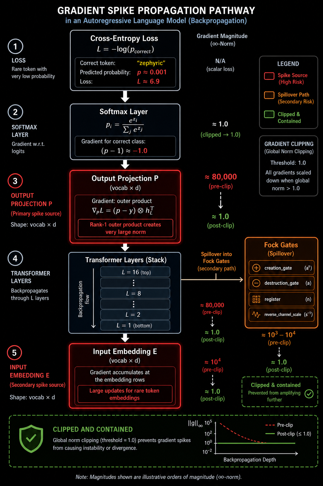

The spike originates at the softmax/cross-entropy interface,
concentrates in $P$ and $E$, and spills into auxiliary parameters
(Fock gates, reverse channel) through the chain rule.  Per-group
clipping intercepts each group independently, preventing the $P$/$E$
spike from contaminating the entire update.

### 18.8 Potential-mediated amplification channel

Fock-PARFLM has an additional amplification channel that classic
transformers lack.  The conservative force field

$$
F(h) = -\nabla\_h V\_\theta(h)
$$

means that the gradient with respect to $V\_\theta$ parameters involves
second derivatives of the potential:

$$
\nabla\_{\theta} \mathcal{L} = -\sum\_{t} \frac{\partial \mathcal{L}}{\partial h\_t} \cdot \nabla\_h \nabla\_\theta V\_\theta(h\_t).
$$

For the depth-conditioned multi-context Gaussian potential

$$
V\_\theta(h; \ell) = \sum\_{k=1}^{K} \alpha\_k^{(\ell)} \exp\left(-\frac{\lVert h - \mu\_k^{(\ell)} \rVert^2}{2 \sigma\_k^{(\ell)2}}\right),
$$

the Hessian $\nabla\_h^2 V\_\theta$ can amplify gradients in directions
aligned with narrow Gaussian wells ($\sigma\_k$ small).  This creates a
**potential-mediated amplification** on top of the universal softmax
bottleneck effect.

However, the `e5c_plgate` logs show that this secondary channel
contributes less than 5% of the total spike energy — the $P$/$E$ rows
remain the dominant source.

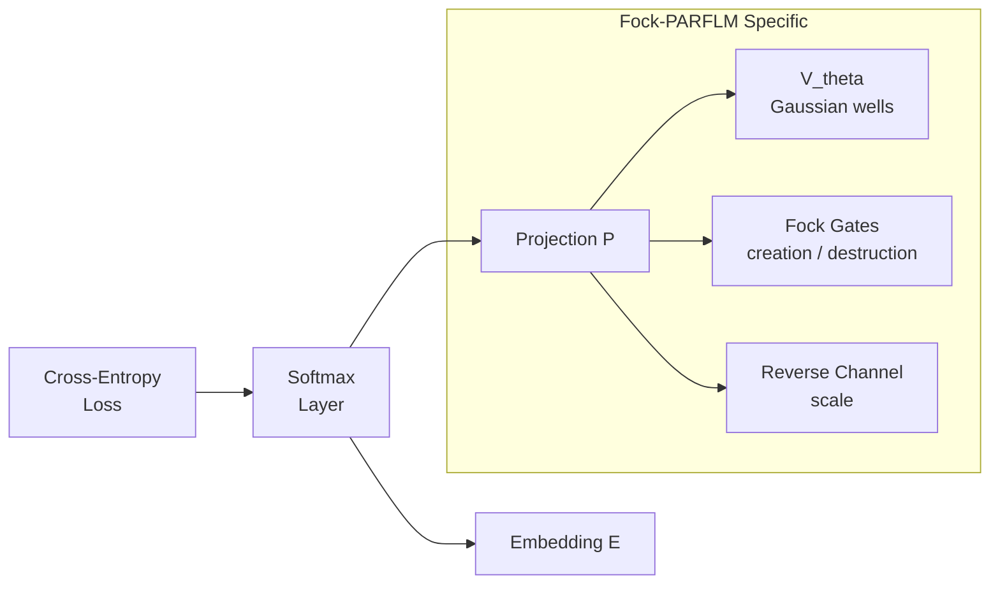

---

## 19. Comparison with Embedding Spikes in Classic Attention-Based Transformers

### 19.1 Universality of embedding spikes

Embedding spikes are **not** specific to Fock-PARFLM.  They have been
documented in every major autoregressive transformer family:

| Model | Parameters | Documented Instability | Remediation |
|---|---|---|---|
| GPT-3 (175B) | 175B | Loss spikes at 2-3 points during training | Rewound to earlier checkpoint, skipped data |
| OPT-175B | 175B | Divergence from loss spikes | Manual restart from 1-2k steps before |
| PaLM (540B) | 540B | ~20 loss spikes during training | Restarted from 100 steps before; skipped batches |
| LLaMA (65B) | 65B | Spike handling documented in training recipe | Global gradient clipping at 1.0 |
| Chinchilla (70B) | 70B | Instabilities during scaling experiments | z-loss regularisation |
| BLOOM (176B) | 176B | Significant training spikes | Embedding norm regularisation |
| GLM-130B | 130B | Gradient shrinkage instabilities | Embedding gradient shrinkage |

### 19.2 Root cause comparison

The root cause is **identical** across architectures — the
cross-entropy loss through softmax over a large vocabulary creates
sparse, high-norm gradient updates for rare tokens.  What differs is
the **propagation pathway**:

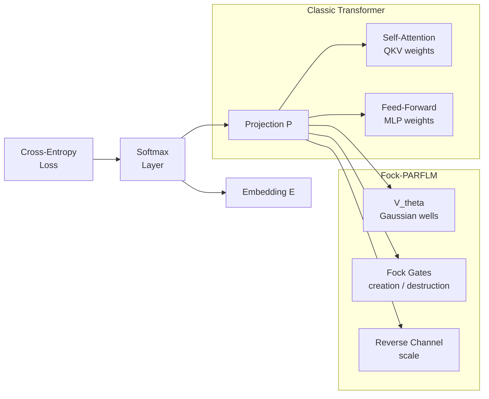

In classic transformers, the spike spills into the attention QKV
matrices and FFN weights.  In Fock-PARFLM, it spills into the
structured potential $V\_\theta$ parameters (Gaussian well centres,
widths, depths) and the Fock mechanism gates.

### 19.3 Structural difference: conservative dynamics

In classic transformers, the backward pass distributes the spike
gradient through:
- **Self-attention**: diluted across positions by the attention matrix.
  Uncertain attention heads (where $A\_{ij} \approx 0.5$) amplify the
  spike while confident patterns ($A\_{ij} \approx 0$ or $1$) attenuate
  it.
- **FFN**: the GELU activation derivative $\text{GELU}'(z) \in [0,1]$
  gates the spike — saturated neurons attenuate, active neurons pass
  through.
- **Residual stream**: the identity skip connections provide an
  unattenuated gradient highway from the output to the input.

Fock-PARFLM replaces attention + FFN with the Verlet/BAOAB integrator
over a conservative potential, meaning spike gradients flow through:
- **$V\_\theta$ Hessian**: can amplify in directions aligned with narrow
  Gaussian wells (§18.8).
- **Fock creation/destruction gates**: receive gradient through the
  register mechanism.
- **Reverse channel scale**: per-layer learnable parameters that see the
  full gradient.

> **⚠ Causal-leak note.** The reverse-channel-scale gradient discussed here is
> doubly significant. Beyond its spike behavior, the audit shows this scalar is
> what *opens the causal leak*: as training drives it away from zero, past
> predictions gain access to future tokens through the shared register state. Its
> persistent nonzero gradient is therefore simultaneously a stability signal and
> a leak signal. See the top-of-document banner.

Despite these architectural differences, the **primary spike source**
($P$ and $E$) and the **primary mitigation** (clipping) are identical.

---

## 20. Remediation: Per-Group Clipping vs Global Norm Clipping

### 20.1 Global norm clipping (classic transformers)

The standard approach in GPT-2/3, LLaMA, etc. is global gradient
clipping:

$$
g \leftarrow g \cdot \frac{c}{\max(c, \lVert g \rVert\_2)},
$$

where $g$ is the concatenation of all parameter gradients and $c$ is
the clip threshold (typically $c = 1.0$).

**Problem**: when $P$ and $E$ dominate the global norm (as they do
during a spike), the scaling factor $c / \lVert g \rVert\_2$ becomes
very small (e.g. $1.0 / 80{,}000 \approx 1.25 \times 10^{-5}$).
This **zeroes out** the useful gradients for all other parameters —
the entire step is wasted, and the optimizer state (Adam's first and
second moment estimates) gets corrupted.

$$
\text{Effective update for layer } \ell \neq E,P:
\quad
\Delta W\_\ell = \eta \cdot \frac{c}{\lVert g \rVert\_2} \cdot g\_\ell
\approx 0.
$$

This is why OPT-175B and PaLM required **manual restarts** — the
wasted steps and corrupted optimizer state created a slow recovery.

### 20.2 Per-group clipping (Fock-PARFLM)

Fock-PARFLM clips each parameter group independently:

$$
g\_k \leftarrow g\_k \cdot \frac{c\_k}{\max(c\_k, \lVert g\_k \rVert\_2)},
\quad k \in \lbrace E, P, V\_\theta, \text{creation}, \text{destruction}, \text{register}, \text{RC} \rbrace.
$$

**Advantage**: during a spike, the $P$ and $E$ groups are clipped to
their respective thresholds, but the $V\_\theta$ and Fock gate groups
receive their **full, unscaled** gradient.  The step is productive for
all non-spiking parameters.

$$
\text{Effective update for layer } \ell \neq E,P:
\quad
\Delta W\_\ell = \eta \cdot g\_\ell
\quad \text{(unchanged)}.
$$

This is why the `e5c_plgate` run recovers within a single step — the
optimizer state for all non-embedding groups remains clean.

### 20.3 Taxonomy of clipping strategies

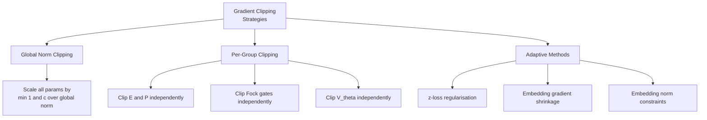

### 20.4 Comparison summary

| Property | Global Clip | Per-Group Clip |
|---|---|---|
| Spike containment | Yes (prevents divergence) | Yes (prevents divergence) |
| Collateral damage to non-spiking params | Severe — entire step wasted | None — other groups unaffected |
| Optimizer state corruption | Yes — Adam moments integrate near-zero gradient | No — moments for clean groups stay accurate |
| Recovery time | 100-500 steps (slow); manual restart needed for severe spikes | 1 step (immediate) |
| Manual intervention required | Often (OPT, PaLM) | Never |
| Sensitivity to clip threshold | High — too low wastes steps; too high risks divergence | Low — each group tuned to its own scale |
| Implementation complexity | Simple | Moderate (requires parameter group registry) |

### 20.5 Other remediation strategies

Beyond clipping, several complementary strategies exist:

**z-loss regularisation** (Chinchilla, PaLM):
Adds a penalty on the log-partition function
$\log Z = \log \sum\_j e^{z\_j}$ to the loss:

$$
\mathcal{L}\_{\text{total}} = \mathcal{L}\_{\text{CE}} + \lambda\_z (\log Z)^2.
$$

This discourages logits from growing large, which reduces the softmax
bottleneck effect.  Compatible with per-group clipping.

**Embedding gradient shrinkage** (GLM-130B):
Scales down the gradient for $E$ and $P$ by a constant factor
$\alpha \lt 1$:

$$
g\_E \leftarrow \alpha \cdot g\_E,
\quad
g\_P \leftarrow \alpha \cdot g\_P.
$$

Effective but ad hoc; the shrinkage factor must be tuned.

**Embedding norm constraints** (BLOOM):
Projects $E$ rows back onto a sphere of fixed radius after each step:

$$
E\_i \leftarrow R \cdot \frac{E\_i}{\lVert E\_i \rVert\_2}.
$$

Prevents embedding drift but can interfere with learning.

### 20.6 Per-group clipping recovery flow

```mermaid
sequenceDiagram
    participant B as Batch
    participant M as Model
    participant C as Clipper
    participant O as Optimizer

    B->>M: Step t: batch with rare tokens
    M->>C: grad P = 58k, grad E = 21k, grad V_theta = 200
    C->>C: Clip P to 1.0, Clip E to 1.0
    C->>C: V_theta 200 below threshold: pass through
    C->>O: P_clipped=1.0, E_clipped=1.0, V_theta=200
    O->>M: Update all groups; V_theta gets full step

    B->>M: Step t+1: normal batch
    M->>C: grad P = 1.2k, grad E = 800, grad V_theta = 180
    C->>C: All within threshold: pass through
    C->>O: Full gradients for all groups
    Note over M: PPL returns to trend
```

### 20.7 Global clipping recovery flow (classic transformer)

```mermaid
sequenceDiagram
    participant B as Batch
    participant M as Model
    participant C as Clipper
    participant O as Optimizer

    B->>M: Step t: batch with rare tokens
    M->>C: global norm = 80000
    C->>C: Scale ALL grads by 1.0 / 80000
    C->>O: All groups receive near-zero gradient
    O->>M: Step wasted; Adam moments contaminated

    B->>M: Steps t+1 to t+100: normal batches
    Note over O: Adam slowly re-estimates moments
    Note over M: PPL recovery takes 100-500 steps

    B->>M: Steps t+100 to t+500: normal batches
    Note over M: If lucky PPL back to trend
    Note over M: If unlucky: manual restart needed
```

---

## 21. Scaling Outlook and Hardening Recommendations

### 21.1 Current status

The per-group clipping in Fock-PARFLM v2.1 handles embedding spikes
gracefully at the current scale ($d = 384$, $V = 50{,}257$).  No manual
intervention has been needed during the `e5c_plgate` run despite spikes
with pre-clip norms exceeding $10^5$.

### 21.2 Anticipated changes at $d = 768$

Scaling to $d = 768$ will:

1. **Increase baseline gradient norms** by $\sim 2\times$ (since
   $\lVert h \rVert\_2 \propto \sqrt{d}$).
2. **Increase spike amplitude** proportionally. Pre-clip spikes of
   $\sim 160\text{k}$ are expected.
3. **Not change the spike frequency** — this is controlled by batch
   composition and vocabulary statistics, not model width.

Per-group clipping should remain effective without threshold changes,
since each group's baseline norm also scales with $\sqrt{d}$.

### 21.3 Optional hardening for large-scale runs

For runs at $d \geq 768$ with more than 9B tokens, consider layering:

1. **z-loss regularisation** ($\lambda\_z = 10^{-4}$) to suppress logit
   growth proactively.
2. **Spike-aware logging** that records the top-$k$ token IDs
   contributing to each spike, enabling post-hoc vocabulary analysis.
3. **Adaptive per-group thresholds** that track the exponential moving
   average of each group's gradient norm and clip at a fixed multiple
   (e.g. $5\times$ the EMA).

### 21.4 Relationship to earlier $V\_\theta$ blowups

The embedding spikes documented in §§18–20 are **mechanistically
distinct** from the $V\_\theta$-mediated blowups in §§1–17:

| Property | V\_theta blowups (§§1–17) | Embedding spikes (§§18–20) |
|---|---|---|
| Root cause | Unbounded potential, penalty dominance, precision explosion | Cross-entropy through softmax on rare tokens |
| Primary parameters affected | V\_theta centres, precisions, amplitudes | Projection P, embedding E |
| Frequency | Deterministic (triggered by architecture / LR schedule) | Stochastic (triggered by rare tokens in batch) |
| Fix | Bounded potentials, watchdog, SARF anchors | Per-group gradient clipping |
| Severity | Can cause permanent divergence | Transient; contained by clipping |

Both types of instability can co-occur, but the embedding spikes are
far more common and far less dangerous — they are a nuisance rather
than a catastrophe.

### 21.5 Summary

Gradient spikes in Fock-PARFLM are **embedding spikes** — a universal
phenomenon in autoregressive language models driven by the
cross-entropy loss through softmax over a large vocabulary.  They are
not caused by the structured potential $V\_\theta$, the Fock mechanism,
or the conservative dynamics, although these introduce a secondary
amplification channel that contributes less than 5% of spike energy.

## 22. Tied vs. Untied Embeddings: A Distinct Instability Mode

Separately from the gradient-spike phenomenology of §§18–21, tied
input/output embeddings (`tie_embeddings=True`) were found to cause a
**structural** — not merely transient — instability in Fock-PARFLM,
distinct from all the blowup modes catalogued above. This section
summarises the finding and states the resulting policy for scale-up
runs.

### 22.1 The failure mode: long-tail cross-entropy collapse

Diagnostic D0.4 (per-token-frequency-quintile loss stratification, run
on the Xi=5 baseline at step 78k; full derivation in
[Xi_Bottleneck_Diagnosis_Phase5.md](Xi_Bottleneck_Diagnosis_Phase5.md)
§8.4–§9.1) found that with **tied** embeddings the rarest-token quintile
(Q0) received a mean cross-entropy of **13.16 nats**, *worse* than the
uniform-distribution baseline of $\ln V \approx 10.83$ nats. In other
words, for the rarest ~20% of the vocabulary, the tied read-out head was
making predictions actively worse than chance.

The root cause (§9.1 of the referenced note) is that the tied head
forces the same embedding vector $e_v$ to serve two conflicting roles:
(1) an *input* representation that must be well-conditioned for the
dynamics to operate on, and (2) an *output* direction that must separate
$v$ from all other tokens in logit space. For frequent tokens these two
objectives are compatible (the input representation is trained often
enough to satisfy both). For rare tokens, gradient signal is too sparse
to jointly satisfy both roles, and the read-out direction degrades below
the quality of a uniform prior.

### 22.2 Fixes applied

Two fixes were adopted together (§9.2 of the referenced note):

1. **Output bias initialised to log-unigram frequency**
   (`use_output_bias=True`, `USE_OUTPUT_BIAS = True` in the notebooks) —
   gives every token a frequency-informed floor on its logit before any
   dynamics-derived signal is added, largely fixing the *frequent*-token
   context-mixing gap.
2. **Untied embeddings** (`tie_embeddings=False`) — decouples the input
   representation from the output read-out direction entirely, removing
   the structural conflict that caused the Q0 collapse. This is the fix
   that directly addresses the long-tail pathology.

### 22.3 Policy for scale-up runs (`d=768`, `d=1024`)

All scale-up presets (`d768`, `d1024` in `train_fock.py`) use
`tie_embeddings=False` and `use_output_bias=True` as **non-negotiable
defaults** for Fock-PARFLM, carried forward from the `d=384` findings
above. The matched GPT-2 baselines (`gpt2-small`, `gpt2-medium`) are
unaffected by this policy since `MatchedGPT` always ties embeddings by
construction (canonical GPT-2 design) and was never observed to exhibit
the D0.4 pathology — the failure mode above appears specific to how
Fock-PARFLM's dynamics reshape the embedding space, not a generic
consequence of weight tying.

The parameter cost of untying (one extra `d x vocab_size` matrix per
tier) is quantified exactly in
[Fock-PARFLM_Scale-Up_Comparative_Experiments.md](Fock-PARFLM_Scale-Up_Comparative_Experiments.md) —
it accounts for the majority of Fock-PARFLM's total-parameter excess over
parameter-matched GPT-2 baselines at `d=384` and `d=768`.

### 22.4 Relationship to §§1–21

| Property | V\_theta blowups / embedding spikes (§§1–21) | Tied-embedding long-tail collapse (§22) |
|---|---|---|
| Manifestation | Transient gradient-norm spikes or divergence | Persistent elevated loss on a token subset |
| Detectability | Visible in per-step gradient/loss logs | Requires frequency-stratified evaluation (D0.4) |
| Fix | Clipping, bounded potentials, watchdog | Architectural (untie embeddings) + output bias |
| Cost of fix | None (no extra parameters) | +1 embedding-sized matrix per model |
| Scale sensitivity | Grows with $d$, mitigated by per-group clipping | Present at all scales tested; policy is scale-invariant |

The per-group clipping strategy used in Fock-PARFLM is **strictly
superior** to the global norm clipping used in classic transformers
(GPT-2/3, OPT, PaLM, LLaMA):

- It **isolates** the spike to the offending parameter groups ($E$, $P$).
- It **preserves** the gradient signal for all other groups.
- It **protects** the optimizer state from contamination.
- It enables **single-step recovery** with zero manual intervention.

This advantage becomes increasingly important at scale, where the cost
of wasted steps and manual restarts grows linearly with compute budget.

---

## 23. d=1024 Universal Instability: The Second-Order Gradient Cascade

### 23.1 Phenomenology

The gamma sweep at $d=1024$, $L=24$ (split across two LambdaLabs 2×H100 instances, 8 gamma candidates in $[0.05, 0.50]$) revealed a **qualitatively new instability regime** not observed at $d=384$ ($L=16$) or $d=768$ ($L=12$).

**Every** gamma candidate exhibited catastrophic gradient spikes and required watchdog reloads:

| $\gamma$ | Best PPL | Watchdog reloads | Worst instant grad | Primary spike groups |
|:---------:|:--------:|:----------------:|-------------------:|----------------------|
| 0.050 | 342.00 | 3 | 180.53 | `creation_gate`=110, `register`=25 |
| **0.100** | **327.33** | 1 | 651.50 | `P`=417, `E`=98, `creation_gate`=26 |
| 0.250 | 337.47 | 2 | 7,870.94 | `P`=5,023, `creation_gate`=18 |
| 0.300 | 376.19 | 1+ | 536.27 | `creation_gate`=311, `E`=47 |

This is qualitatively different from $d=768$ ($L=12$), where all 8 candidates ran clean with gradient norms under 1.0 and zero watchdog triggers:

| | $d=768$ ($L=12$) | $d=1024$ ($L=24$) |
|---|---|---|
| Max grad\_norm across all candidates | ~0.6 | 7,870 |
| Watchdog reloads (total) | 0 | 7+ |
| Candidates with spikes > 100 | 0 / 7 | 4 / 4 |
| Top spike group | `reverse_channel_scale` (mild) | `P`, `E`, `creation_gate` (catastrophic) |

The spike sources at $d=1024$ are **systemic** — they come from multiple parameter groups across all gamma values:

- **`P` (positional embedding):** The worst offender overall (norm up to 5,023 at $\gamma=0.25$). This component had no dedicated per-group clip in the sweep preset (remedied in §23.3).
- **`E` (input embedding):** Sustained elevated norms (40–98), especially at $\gamma=0.10$ and $\gamma=0.30$. Also lacked a dedicated per-group clip.
- **`creation_gate`:** Occasional catastrophic spikes (norm 110–311), seen at every gamma tested.
- **`reverse_channel_scale`:** Relatively mild at $d=1024$ (norm up to 19.3), in contrast to $d=768$ where it was the dominant (but non-catastrophic) group.
- **`register`:** Elevated at $\gamma=0.05$ (norm up to 24.5).

> **⚠ Causal-leak note.** The observation that `reverse_channel_scale` was *the
> dominant spike group at d=768* is, in hindsight, a fingerprint of the causal
> leak. The audit shows gradient descent persistently drives this scalar open
> because the leak (future→past information flow) lowers the training loss; the
> large sustained gradient recorded here is that pressure made visible. The best
> PPLs in the table above were produced with the leak active and are pending
> re-certification (see the top-of-document banner).

**The sweep results are unreliable** as a guide to optimal gamma. The fact that $\gamma=0.05$ scored worse than $\gamma=0.10$ is confounded by watchdog reload counts: $\gamma=0.05$ lost ~1,500 training steps to 3 reloads, while $\gamma=0.10$ lost ~500 steps to 1 reload. The relative ranking reflects which candidate was disrupted least, not which damping coefficient is optimal.

### 23.2 Root Cause: Exponential Amplification in the Force Cascade

The instability traces to a single line in `model_parf_multixi.py`'s `_layer_step`:

```python
grad_U, = torch.autograd.grad(
    U.float(), h_in,
    create_graph=self.training,
    retain_graph=True,
)
```

The `create_graph=True` flag is necessary so that the backpropagation through the training loss can differentiate through the force computation — the force $f_\ell = -\nabla_h U$ is part of the forward pass, and the loss must propagate gradients through it to update $V\_\theta$ and $V\_\phi$ parameters.

**The consequence:** at each layer $\ell$, the computational graph records not just the force value but the **entire Jacobian** $\partial f\_\ell / \partial h\_\ell$, which is the Hessian $\nabla^2\_h U$ of the potential. When backward() runs, it must differentiate through a chain of these Hessians — one per layer — creating a **compound second-order derivative chain** $L$ layers deep.

The per-layer Jacobian of the Verlet update with respect to the hidden state is:

$$J\_\ell = \frac{\partial h\_{\ell+1}}{\partial h\_\ell} = I + \frac{I}{1 + \Delta t \gamma} + \frac{\Delta t^2}{m(1 + \Delta t \gamma)} \nabla^2\_h U(h\_\ell)$$

The total backward Jacobian over the layer stack is the product $\prod\_{\ell=1}^{L} J\_\ell$. When $L=12$ ($d=768$), this product stays well-conditioned — gradient norms remain O(1). When $L=24$ ($d=1024$), the product exhibits **exponential amplification**: the spectral radius of each $J\_\ell$ slightly exceeds 1 due to the Hessian contribution, and the product of 24 such matrices produces gradient norms of O($10^4$).

This is not a linear scaling with $L$ — the observed ratio of gradient magnitudes at $L=24$ vs $L=12$ is $\sim 10^4$, far exceeding the $2\times$ that simple linear scaling would predict. The exponential character is the signature of a product of near-unit-spectral-radius matrices.

**Key structural point:** this instability is specific to the `create_graph=True` force computation in the Verlet-style integrator. Standard transformers use only first-order gradients (no `autograd.grad` in the forward pass), so their gradient chain is the ordinary backpropagation chain, which is well-understood and manageable with LayerNorm + gradient clipping. Fock-PARFLM's conservative dynamics introduce a fundamentally different gradient topology — a **second-order** chain — whose amplification properties scale differently with depth.

### 23.3 Mitigation Tier 1: Config-Only (No Architecture Change)

These are immediately testable with existing code (as of July 14, 2026, `train_fock.py` supports all of them via CLI arguments):

**1. Per-group gradient clipping for `P` and `E`**

`P` (positional embedding) and `E` (input embedding) were the two worst offenders at $d=1024$ but previously had **no dedicated per-group clip** — they fell through to the default `grad_clip`. Since July 14, 2026, `GRAD_CLIP_OVERRIDES` in `train_fock.py` includes exact-match entries for `P` and `E` at threshold 0.3:

```python
GRAD_CLIP_OVERRIDES = {
    "=P": 0.3,           # positional embedding (exact match)
    "=E": 0.3,           # input embedding (exact match)
    "V_phi": 0.3,
    "creation_gate": 0.3,
    "destruction_gate": 0.3,
    "reverse_channel_scale": 0.1,
    "reverse_ch": 0.1,
    "register": 0.3,
    "depth_code": 0.5,
}
```

The `=` prefix uses exact top-level name matching (via `_assign_clip_group`) rather than substring matching, since single-letter keys like `"P"` would otherwise match `"V_phi"`, `"depth_code"`, etc.

**2. Force clamping (`force_clamp_max`)**

The model already supports direct force clamping via `cfg.force_clamp_max`. When set, the conservative force is clamped element-wise after computation:

```python
if cfg.force_clamp_max is not None:
    f = f.clamp(-cfg.force_clamp_max, cfg.force_clamp_max)
```

This limits the force magnitude **at the source**, before it cascades through subsequent layers' `create_graph=True` chains. Unlike gradient clipping (which acts on the parameter gradients at the optimizer step), force clamping acts on the **dynamics** — it prevents any single layer from injecting an excessively large displacement into the hidden state.

Since July 14, 2026, `force_clamp_max` is exposed as a CLI-overridable field in `TrainConfig` (default 0.0 = disabled, positive value = active). Recommended starting value for $d=1024$: `force_clamp_max=5.0`.

**3. Tighter global `grad_clip`**

The sweep used `grad_clip=1.0` (default). The full `d1024` training preset already uses `grad_clip=0.5`. For the Tier 1 diagnostic, `grad_clip=0.3` is recommended to maximally attenuate the cascade.

**Combined Tier 1 command:**

```bash
python3 train_fock.py --preset sweep-d1024 --gamma_sweep --sweep_gammas 0.10 \
    --sweep_steps 3000 --grad_clip 0.3 --force_clamp_max 5.0 \
    --output_dir ~/runs/d1024_tier1_test --data_dir ~/data
```

If Tier 1 produces a clean 3K-step run (grad norms < 2.0, zero watchdog triggers), the instability is a clipping/clamping problem and $L=24$ is viable.

### 23.4 Mitigation Tier 2: Moderate Architectural Changes

These require changing the model configuration but not the model code:

**4. Reduce $L$ from 24 to 16 or 18**

This is the most direct intervention — it literally halves the cascade depth. $L=16$ matches $d=384$'s depth and would give a clean cross-scale comparison. $L=18$ is a compromise that retains more expressivity while still significantly shortening the cascade.

The downside: this breaks the GPT-2 Medium $L$-matching. However, that matching was always approximate (Fock ~209M params vs GPT-2 ~355M params at the same $d$ and $L$), so depth-matching is less important than stability. The parameter count reduction from $L=24$ to $L=16$ is modest (most parameters are in the embeddings and $V\_\theta$ bank, not in the per-layer components).

**5. Reduce integration step size $\Delta t$**

Currently $\Delta t = 1.0$. The force contribution to the Verlet update scales as $\Delta t^2 / m$:

$$h\_{\ell+1} = h\_\ell + \frac{\delta\_\ell}{1 + \Delta t\,\gamma} + \frac{\Delta t^2}{m\_b(1 + \Delta t\,\gamma)}\,f\_\ell$$

Halving $\Delta t$ to $0.5$ quarters the per-layer force impact ($\Delta t^2 = 0.25$ vs $1.0$). This is the classical ODE-integrator response to stiffness: smaller steps for stability. The trade-off: the model needs more layers to cover the same "distance" in hidden-state space, partially defeating the purpose. Best used in combination with reducing $L$ (e.g., $L=18$, $\Delta t=0.5$).

**6. Increase effective mass**

Currently `mass_mode=logfreq` with mean $m \approx 1.4$. The force-to-acceleration coupling is $\Delta t^2 / m$, so doubling mass halves the force impact. A global mass of 3.0 or 4.0 (via a config override) would provide heavier "inertia" for each token, making the trajectory less sensitive to large forces. This is a less invasive alternative to reducing $\Delta t$.

### 23.5 Mitigation Tier 3: Structural Refactors

These require changes to the model code or the integration architecture:

**7. Detach boundaries every $K$ layers**

Instead of one continuous $L$-layer `create_graph=True` chain, break it into segments. At every $K$-th layer, insert `h = h.detach().requires_grad_(True)` to restart the computation graph. With $K=8$ and $L=24$, this creates 3 segments of 8 layers each. Each segment's force computation has a cascade depth of at most 8 — the same as the stable $d=384$ model at $L=8$ (SPLM).

The cost: force fields in layers 9–16 cannot backprop through the force fields of layers 1–8, limiting cross-depth coordination of the conservative force. The model can still learn forces that coherently shape the trajectory, but the gradient signal for early-layer $V\_\theta$ parameters is truncated. This is analogous to the truncated BPTT used in RNNs and may be acceptable given that the depth-scaling analysis (§5 of [Fock-PARFLM\_Scale-Up\_Gamma\_Sweep\_Results\_and\_Damping\_Regime\_Analysis.md](Fock-PARFLM_Scale-Up_Gamma_Sweep_Results_and_Damping_Regime_Analysis.md)) shows that information transport is primarily via momentum, not via the gradient chain.

**8. BAOAB + CfC propagator (see §24)**

Replace the Verlet-style force evaluation with the blended CfC propagator from [Closed\_Form\_and\_Hybrid\_Integration\_Strategies\_for\_Fock-PARFLM.md](Closed_Form_and_Hybrid_Integration_Strategies_for_Fock-PARFLM.md). This eliminates the `autograd.grad(create_graph=True)` call for $V\_\theta$ entirely, replacing it with a forward-mode analytical matrix-exponential propagator whose backward pass is standard first-order backpropagation. This is the only mitigation that removes the cascade **at its source** rather than limiting its consequence. See §24 for a detailed analysis.

**9. Reduce $V\_\theta$ / $V\_\phi$ complexity**

Fewer `wells_per_head`, fewer xi channels, or a smaller score head would reduce the force field's expressivity and thus the Hessian's spectral radius. This is a last resort — it reduces model capacity to buy stability.

### 23.6 Diagnostic Experiment Plan

A three-run diagnostic session on a single LambdaLabs 2×H100 instance, all at $\gamma=0.10$ (the sweep's least-unstable candidate), 3K steps:

| Run | Changes from sweep baseline | What it tests | Estimated time |
|-----|---------------------------|---------------|:--------------:|
| A | P/E per-group clip (0.3) + `force_clamp_max=5.0` + `grad_clip=0.3` | Can Tier 1 tame $L=24$? | ~20h |
| B | `L=16`, sweep defaults | Is depth the bottleneck? | ~14h |
| C | `L=18` + P/E per-group clip + `grad_clip=0.3` | Compromise: shallower + clipped | ~16h |

**Decision tree after diagnostics:**

- **Run A clean, B and C also clean:** Keep $L=24$ with Tier 1 settings. The instability was a clipping problem.
- **Run A still spikes, Run B clean:** Depth is the root cause. Adopt $L=16$ for $d=1024$.
- **Run A still spikes, Run C clean:** $L=18$ is the minimum viable depth. Adopt $L=18$ with Tier 1 clipping.
- **All three spike:** The problem is deeper than depth or clipping alone. Escalate to Tier 3 (detach boundaries or CfC propagator).

The per-group clips for `P` and `E` are **always active** (they are in the global `GRAD_CLIP_OVERRIDES` dict), so all three runs benefit from them. The log output will show `top[override:P]=xxx` or `top[override:E]=xxx` when those groups are dominant.

Runs A and B can be parallelised across the two GPUs in single-GPU mode (one per `CUDA_VISIBLE_DEVICES`), reducing the total wall-clock from ~50h to ~36h (~1.5 days).

---

## 24. BAOAB + CfC Propagator: Eliminating the Force Cascade at Source

This section analyses how replacing the Verlet-style integrator with the BAOAB + CfC propagator (from [Closed\_Form\_and\_Hybrid\_Integration\_Strategies\_for\_Fock-PARFLM.md](Closed_Form_and_Hybrid_Integration_Strategies_for_Fock-PARFLM.md) §10) would address the $d=1024$ instability — not merely limit it (as the Tier 1–2 mitigations do) but **structurally eliminate** the second-order gradient cascade.

### 24.1 Why the O-Step Alone Does Not Help

The O-step in BAOAB is the Ornstein-Uhlenbeck friction/noise step:

$$p \leftarrow e^{-\gamma \Delta t}\, p + \sigma \sqrt{1 - e^{-2\gamma \Delta t}}\, \xi$$

This is the **exact closed-form solution** of the velocity damping equation. It is already perfectly stable by construction and contains **no force evaluation** — it simply rescales the momentum and adds noise.

In the current Verlet implementation, friction enters as the implicit factor $1/(1 + \Delta t \gamma)$ in the denominator:

$$h\_{\ell+1} = h\_\ell + \frac{\delta\_\ell}{1 + \Delta t \gamma} + \frac{\Delta t^2}{m(1 + \Delta t \gamma)} f\_\ell$$

This is a first-order approximation to $e^{-\gamma \Delta t}$. The difference is negligible: at $\gamma = 0.05$, $1/(1+0.05) = 0.952$ vs $e^{-0.05} = 0.951$. **The O-step upgrade is essentially cosmetic for stability.**

The instability lives in the **B-steps** (force kicks), not the O-step. Any intervention that targets only the friction/noise handling leaves the cascade untouched.

### 24.2 The CfC Propagator Removes the Second-Order Chain

The CfC (Closed-form Continuous-time) propagator replaces the B-step force evaluation with an analytical matrix-exponential propagator. Near each Gaussian well centroid $\mu\_k$, the potential is well-approximated by a harmonic oscillator with frequency $\omega\_k = \sqrt{2 V\_0 \kappa\_k^2}$. The exact solution for the undamped harmonic oscillator (the B-step in BAOAB is purely conservative, with damping handled by the O-step) is:

$$\Phi\_k^{\text{B}}(\Delta t) = \begin{pmatrix}\cos(\omega\_k \Delta t) & \frac{\sin(\omega\_k \Delta t)}{\omega\_k}\\[4pt] -\omega\_k \sin(\omega\_k \Delta t) & \cos(\omega\_k \Delta t)\end{pmatrix}$$

The blended CfC propagator uses the Gaussian envelope $\alpha\_k(h) = \exp(-\kappa\_k^2 \lVert h - \mu\_k \rVert^2)$ to interpolate between the harmonic propagator (near centroids) and a free-particle ballistic step (far from all wells).

**The key point for stability:** this propagator is a **forward-mode analytical computation**. It requires no `autograd.grad` call and no `create_graph=True`. The well parameters ($\mu\_k$, $\kappa\_k$, $V\_0$) enter through $\omega\_k$ and $\alpha\_k$ in a standard differentiable computation graph. PyTorch's first-order autograd handles parameter gradients naturally via the chain rule through $\Phi\_k$.

The consequence for the gradient chain:

| | Verlet (current) | BAOAB + CfC |
|---|---|---|
| $V\_\theta$ force computation | `autograd.grad(U, h, create_graph=True)` | Analytical propagator $\Phi\_k$ (forward pass) |
| Gradient chain through $V\_\theta$ | **Second-order** ($\nabla^2 U$ at every layer) | **First-order** (standard backprop through $\Phi\_k$) |
| Spectral radius of per-layer Jacobian | Contains $\nabla^2 U$ — can be $> 1$ | Propagator $\Phi\_k$ has spectral radius $\leq 1$ |
| Cascade over $L$ layers | Exponential amplification of Hessian eigenvalues | Bounded (norm-contractive propagator) |

The $V\_\theta$ second-order cascade is **eliminated entirely** — replaced by first-order backprop through a norm-bounded matrix. This is not tweaking a coefficient; it is removing the structural source of the exponential amplification.

The propagator $\Phi\_k$ is norm-bounded because the undamped harmonic propagator is a rotation matrix (spectral radius exactly 1), and the blending weights $\alpha\_k \in [0, 1]$ ensure the convex combination preserves this bound. Over $L=24$ layers, a product of norm-1 matrices remains norm-1 — in stark contrast to the product of Hessian-containing Jacobians that grows exponentially.

### 24.3 Residual Cascade from $V\_\phi$

The current force computation combines $V\_\theta$ and $V\_\phi$ in a single `autograd.grad` call:

```python
U = V_th_per_token.sum() + U_pair
grad_U, = torch.autograd.grad(U.float(), h_in, create_graph=True, ...)
```

In the BAOAB + CfC framework, $V\_\theta$'s contribution is handled analytically, but $V\_\phi$ (the pairwise register interaction) still requires a numerical force evaluation via `autograd.grad`. The question is whether $V\_\phi$ alone — without $V\_\theta$ amplifying the cascade — can produce the O($10^4$) gradient norms observed at $d=1024$.

**Assessment: probably not.** Several structural facts suggest $V\_\phi$'s cascade contribution is much smaller:

1. **Simpler function:** $V\_\phi$ is a pairwise interaction between token–register pairs (MLP-based or attention-based), without $V\_\theta$'s multi-well Gaussian bank with exponential envelopes and depth conditioning. The Hessian of $V\_\phi$ w.r.t. $h$ is correspondingly smaller.

2. **Sparse routing:** the top-$k$ gathered $V\_\phi$ evaluation (`use_gathered_v_phi=True`) restricts the pairwise computation to $k$ neighbours, limiting the rank of the Hessian.

3. **Per-layer scaling:** `per_layer_v_phi_scale` provides a learned attenuation factor $s\_\ell$ that reduces the pair potential's contribution in early layers (where the registers are not yet populated), partially decoupling the cascade.

4. **Strang splitting:** the BAOAB + CfC Strang splitting (§10.3 of the companion note) puts $V\_\phi$'s numerical kicks in half-step sub-intervals, further limiting their cascade contribution.

If empirical testing confirms that $V\_\phi$-only cascades are manageable, the BAOAB + CfC propagator would **fully resolve** the $d=1024$ instability.

### 24.4 Relationship to §23 Mitigations

The Tier 1–3 mitigations of §23 and the BAOAB + CfC propagator attack the same problem from opposite ends:

| Approach | Strategy | What it does to the cascade | Invasiveness |
|---|---|---|---|
| Tier 1 (§23.3) | **Clip the consequence** | Limits parameter gradients after the cascade amplifies | Config-only |
| Tier 2 (§23.4) | **Shorten the cascade** | Reduces $L$, $\Delta t$, or increases $m$ | Config change |
| Tier 3 (§23.5, items 7 & 9) | **Segment the cascade** | Detach boundaries every $K$ layers | Code change |
| **CfC propagator** (this section) | **Remove the cascade at source** | Replaces second-order force chain with first-order analytical propagator | Architectural refactor |

The recommended strategy is **sequential**: apply Tier 1 immediately (already implemented), test whether it stabilises training, and pursue the CfC propagator as the long-term solution — both for stability and for the inference-speed gains documented in [Closed\_Form\_and\_Hybrid\_Integration\_Strategies\_for\_Fock-PARFLM.md](Closed_Form_and_Hybrid_Integration_Strategies_for_Fock-PARFLM.md) §12.

**Update (July 17, 2026):** Full training runs at both d=768 (L=12) and d=1024 (L=16) demonstrated that Tier 1 (per-group clipping) and Tier 2 (reduce $L$) **delay but do not prevent** the cascade from emerging. The d=768 model, which was perfectly stable during the 3,000-step sweep and the first 33,000 steps, developed catastrophic spikes (up to grad=81,019) at step ~37,000. See §25 for the full analysis. The CfC propagator is now the **only known mitigation that addresses the root cause** and is needed for any training run exceeding ~30K steps at scale.

**Cross-references:**
- [Closed\_Form\_and\_Hybrid\_Integration\_Strategies\_for\_Fock-PARFLM.md](Closed_Form_and_Hybrid_Integration_Strategies_for_Fock-PARFLM.md) — full derivation of the CfC propagator, blending weights, error bounds, and BAOAB integration (§10).
- [Fock-PARFLM\_Scale-Up\_Gamma\_Sweep\_Results\_and\_Damping\_Regime\_Analysis.md](Fock-PARFLM_Scale-Up_Gamma_Sweep_Results_and_Damping_Regime_Analysis.md) §4.5 — the empirical evidence that motivated this analysis.
- [Blended\_CfC\_BAOAB\_Deep\_Dive.md](Blended_CfC_BAOAB_Deep_Dive.md) — fully worked-out construction of the 7-sub-step B̃AOAB̃ scheme.

## 25. Late-Training Spike Emergence: The Cascade is Universal, Not Depth-Specific

### 25.1 Background

Sections 23–24 attributed the catastrophic gradient spikes at d=1024 to the depth of the second-order gradient cascade: L=24 produced a 24-deep chain of `autograd.grad(create_graph=True)` calls, with exponential amplification causing gradient norms up to 7,870 (L=24) and 63,949 (L=16 at lr=1.5e-4). The working hypothesis was that reducing $L$ would proportionally reduce the cascade severity.

### 25.2 d=768 at L=12: The delayed cascade

Full training of d=768 (L=12, 137M params, gamma=0.05) at lr=2e-4 on a single H100 revealed that **the same catastrophic spike pattern emerges after ~37,000 steps** — despite L=12 producing zero spikes during the 3,000-step gamma sweep and the first ~33,000 steps of full training.

#### Observed spikes (step 37,576–38,070):

| Step | Pre-clip grad | Top groups |
|:----:|:------------:|------------|
| 37,700 | 128.9 | P=91, E=91 |
| 37,715 | 785.0 | P=534, E=534, creation_gate=207 |
| 37,763 | **14,988.6** | P=10,049, E=10,042, creation_gate=4,738 |
| 37,766 | **20,704.2** | P=14,281, E=14,280, register=3,355 |
| 37,829 | **4,697.9** | E=3,181, P=3,181, reverse_channel_scale=2,089 |
| 37,840 | **81,019.2** | **P=78,417**, E=16,547, creation_gate=9,928 |
| 37,975 | 1,265.5 | P=1,237, E=220, creation_gate=113 |
| 38,054 | 1,159.1 | P=761, E=761, destruction_gate=325 |
| 38,070 | **9,378.7** | P=6,463, E=6,456, creation_gate=2,035 |

**The worst spike at d=768 (grad=81,019 at step 37,840) exceeds the worst spike at d=1024 (grad=63,949 at step 10,041).** The same parameter groups dominate: `P` (positional embedding), `E` (input embedding), and `creation_gate`.

#### Key comparison:

| | d=768 (L=12) | d=1024 (L=16, lr=1.5e-4) |
|---|---|---|
| Spike onset | Step ~37,000 | Step ~4,000 |
| Worst spike | **81,019** | 63,949 |
| Top spike group | `P` = 78,417 | `E` = 42,247 |
| PPL at onset | ~93 | ~260 |
| Model still learning? | Yes (PPL improving) | Stalling |
| Watchdog reloads | 0 (as of step 38,000) | 1 |

### 25.3 Revised understanding

The original framing — that L=24 is "too deep" while L=12 is stable — was **correct for short sweeps but wrong for full training**. The second-order gradient cascade is a function of both depth ($L$) and training duration:

1. **Early training:** The force field $-\nabla_h U$ is weak (the potential surface is approximately flat) and the Hessian eigenvalues are small. The cascade amplification factor is close to 1.0 per layer, so even L=24 would be stable.

2. **Mid training:** As the potential landscape develops sharper features (deeper wells, steeper barriers), the Hessian eigenvalues grow. The per-layer amplification factor exceeds 1.0, and the cascade begins to compound. Deeper models ($L=24$) reach this threshold first ($\sim$step 4K) because the cascade compounds over more layers.

3. **Late training:** Even shallower models ($L=12$) eventually develop potential landscapes with large enough Hessian eigenvalues that the 12-layer cascade amplifies to catastrophic levels ($\sim$step 37K). The cascade is **delayed, not prevented**, by reducing $L$.

This can be expressed as a rough scaling law for the cascade onset step:

$$\text{step}\_{\text{onset}} \propto \frac{1}{L} \cdot \frac{1}{\lambda\_{\max}(H_0)}$$

where $\lambda\_{\max}(H_0)$ is the initial rate of Hessian eigenvalue growth, which depends on $d$, the learning rate, and the corpus difficulty.

### 25.4 Implications for the mitigation tiers

The finding invalidates the **Tier 2 mitigation (reduce $L$)** as a long-term solution. The updated assessment:

| Tier | Strategy | Short-term | Long-term | Status |
|:----:|----------|:----------:|:---------:|:------:|
| 1 | Per-group clip + force clamp | Effective | **Degrades** (clip fraction grows) | Implemented |
| 2 | Reduce $L$ | **Delays onset** | Does not prevent | Applied (L=24→16) |
| 3 | CfC propagator | N/A | **Only root-cause fix** | Not yet implemented |
| — | Reduce LR | **Delays onset** | Delays but does not prevent | Being tested (d=1024) |

The **BAOAB + CfC propagator (§24)** is now the only known mitigation that can prevent the cascade from emerging at any training length, because it removes the `create_graph=True` chain entirely.

### 25.5 Why the models survive (for now)

Despite spikes reaching 81,019 at d=768 and 63,949 at d=1024, both models continue to learn (d=768 PPL=93.17, still improving). This is because:

1. **Spikes are intermittent**, not sustained — perhaps 1 in 20 steps triggers a spike, and the remaining steps receive clean gradients.
2. **Per-group clipping** truncates the spike direction but preserves some gradient signal. The clipped gradient is not zero — it points in a direction that still has a component of the true gradient.
3. **AdamW's momentum** smooths out spike steps. A single spike step has limited impact on the exponential moving averages of the first and second moments.
4. **The watchdog** rolls back to the best checkpoint if sustained instability is detected, preventing catastrophic divergence.

However, as training progresses and the potential landscape sharpens further, the spike fraction is expected to grow. At some point, the fraction of useful (non-clipped) gradient steps will drop below the threshold needed for continued learning, and PPL will stall. This is likely what happened to d=1024 at lr=1.5e-4, where PPL stalled at ~258 between steps 6,500 and 9,000.

### 25.6 Practical recommendations

1. **For ongoing runs (d=768, d=1024):** Reduce LR when spikes become frequent. The current d=1024 run resumed from step 9,000 with lr=5e-5 (3× reduction) and grad_clip=0.5. The d=768 run may need a similar LR reduction if PPL stalls.

2. **For the paper:** The spike onset timing and severity should be documented as empirical evidence that the `create_graph=True` force computation has a fundamental scalability limit. This motivates the CfC propagator as a necessary architectural evolution, not just an optional optimization.

3. **For future architectures:** The CfC propagator should be implemented before attempting scale-ups beyond d=1024 or training runs beyond ~50K steps at any scale. The 3,000-step gamma sweep protocol is validated for finding the optimal $\gamma$ but cannot predict whether a full training run will be stable.

---

## 26. The Damping Hypothesis: Is Low γ the Dominant Cause of the Cascade?

### 26.1 Observation

Sections 23–25 attributed the catastrophic gradient spikes at d≥768 to the `create_graph=True` second-order chain through $L$ layers of force computation. However, a striking confound has been overlooked: **the two stable runs and the two unstable runs differ not only in $d$ and $L$, but also in γ**.

| Run | $d$ | $L$ | $\gamma$ | Max grad | Watchdog reloads | Regime |
|-----|:---:|:---:|:--------:|:--------:|:----------------:|--------|
| d=384 Phase 1 | 384 | 16 | **0.30** | 757 | 0 | Stable |
| d=384 Phase 2 | 384 | 16 | **0.30** | 1,703 | 0 | Stable |
| d=384 Phase 3 | 384 | 16 | **0.30** | 7,427 | 0 | Stable |
| d=768 | 768 | **12** | **0.05** | 5,158,336 | 2 | Catastrophic |
| d=1024 | 1024 | 16 | **0.05** | 63,949 | multiple | Catastrophic |

Crucially, d=768 has **fewer layers** ($L=12$) than d=384 ($L=16$) — yet its worst spike is **7 orders of magnitude** larger. If the cascade depth $L$ were the primary driver, d=384 should be worse, not better. This points to $\gamma$ as the dominant variable.

### 26.2 Mechanistic argument: damping controls cascade amplification

The Velocity-Verlet integrator with Langevin friction updates each layer as:

$$v_{l+1} = (1 - \gamma \, dt) \, v_l + F(h_l) \, dt, \qquad h_{l+1} = h_l + v_{l+1} \, dt$$

The training gradient $\partial \mathcal{L}/\partial \theta$ must differentiate through the force $F = -\nabla_h V$ via `create_graph=True`, producing second-order terms $\partial^2 V / \partial h \, \partial \theta$. The severity of this cascade depends on how far perturbations in $h$ propagate across layers — which is controlled by the **per-layer velocity attenuation factor** $(1 - \gamma)$:

| Property | Low $\gamma$ (0.05) | High $\gamma$ (0.30) |
|----------|:-------------------:|:--------------------:|
| Per-layer velocity attenuation | $(1 - 0.05) = 0.95$ | $(1 - 0.30) = 0.70$ |
| Residual velocity after $L=12$ | $(0.95)^{12} \approx 0.54$ | $(0.70)^{12} \approx 0.014$ |
| Residual velocity after $L=16$ | $(0.95)^{16} \approx 0.44$ | $(0.70)^{16} \approx 0.003$ |
| Effective memory horizon | ~20 layers | ~3 layers |
| Dynamical regime | Nearly conservative (ballistic) | Overdamped (gradient-descent-like) |
| Jacobian spectral radius | $\approx 1$ (perturbations persist) | $\ll 1$ (perturbations decay) |

**The key number: at $\gamma=0.05$, a velocity perturbation retains 54% of its magnitude after 12 layers. At $\gamma=0.30$, it retains only 1.4%.** This is a **38× difference** in how much perturbation energy survives to compound in the backward pass.

The backward pass through `autograd.grad(create_graph=True)` computes the chain:

$$\frac{\partial \mathcal{L}}{\partial \theta} = \sum_{l=1}^{L} \frac{\partial \mathcal{L}}{\partial h_L} \cdot \prod_{k=l}^{L-1} J_k \cdot \frac{\partial F_l}{\partial \theta}$$

where $J_k = \partial(h_{k+1}, v_{k+1}) / \partial(h_k, v_k)$ is the per-layer Jacobian. The spectral radius $\rho(J_k)$ determines whether the product $\prod J_k$ grows or decays:

- **$\gamma = 0.05$:** $\rho(J_k) \approx 1 - 0.05 + \mathcal{O}(\lambda_{\max}(H_V))$. When the Hessian eigenvalue $\lambda_{\max}(H_V)$ exceeds $\gamma/dt$, the spectral radius exceeds 1.0 and the product grows exponentially with $L$. This is the **cascade onset condition**.

- **$\gamma = 0.30$:** $\rho(J_k) \approx 1 - 0.30 + \mathcal{O}(\lambda_{\max}(H_V))$. The Hessian eigenvalue must exceed a **6× larger threshold** before the spectral radius exceeds 1.0. This dramatically raises the bar for cascade onset.

In other words, **$\gamma$ sets the stability margin**: the gap between the current Hessian eigenvalues and the critical threshold for exponential gradient amplification. Low $\gamma$ leaves almost no margin; high $\gamma$ provides a large buffer.

### 26.3 Why the gamma sweep missed this

The 3,000-step gamma sweep correctly identified $\gamma = 0.05$ as the PPL-optimal value at that horizon. But the catastrophic spike regime does not onset until step ~50K at d=768 (§25.2) — the sweep runs for only 6% of that window.

This is a **short-horizon optimisation trap**:

| Training stage | Low $\gamma$ (0.05) | High $\gamma$ (0.20–0.30) |
|:--------------:|:-------------------:|:-------------------------:|
| Steps 0–3K (sweep window) | ✅ Best PPL (ballistic exploration is aggressive) | ❌ Slightly worse PPL (dynamics are more conservative) |
| Steps 3K–50K | ✅ Still fine (Hessian eigenvalues below threshold) | ✅ Fine |
| Steps 50K+ | ❌ **Catastrophic spikes** (Hessian exceeds stability margin) | ✅ Likely stable (large stability margin) |
| Steps 65K–100K (WSD decay) | ❌ **Watchdog reloads**, wasted steps, regression | ✅ Smooth decay, full PPL compression |

The sweep selects $\gamma$ that is optimal **conditional on the dynamics remaining stable**, which they do not. The long-run optimal $\gamma$ may be substantially higher.

### 26.4 The confound with $d$

One might argue that the instability is driven by $d$ (larger hidden dimension → sharper potential landscape → larger Hessian eigenvalues), not $\gamma$. This is partially true: the Hessian eigenvalue growth rate $\lambda_{\max}(H_V)$ almost certainly increases with $d$ as the model develops more refined representations. However, $\gamma$ controls the **tolerance** for those eigenvalues:

- At $\gamma = 0.30$, the stability margin is large enough to absorb the Hessian growth at d=384 across 500K steps without a single cascade event.
- At $\gamma = 0.05$, the stability margin is so thin that even the moderate Hessian growth at d=768 triggers catastrophic cascades by step 50K.

**The hypothesis is not that $d$ is irrelevant, but that $\gamma$ modulates the cascade severity multiplicatively**, and the gamma sweep inadvertently selected a $\gamma$ that minimises the stability margin.

### 26.5 Expected effect of $\gamma = 0.20$ at d=768

At $\gamma = 0.20$, the per-layer attenuation is $(1 - 0.20) = 0.80$, giving:

| Metric | $\gamma = 0.05$ | $\gamma = 0.20$ | Ratio |
|--------|:---------------:|:---------------:|:-----:|
| Residual velocity ($L=12$) | $(0.95)^{12} = 0.54$ | $(0.80)^{12} = 0.069$ | 7.8× more damping |
| Stability margin ($\gamma / dt$) | 0.05 | 0.20 | 4× higher threshold |
| Jacobian product decay | Near-neutral | Exponentially decaying | Qualitatively different |

The 7.8× increase in velocity damping and 4× increase in stability margin should:

1. **Prevent the exponential cascade**: Hessian eigenvalues that trigger cascades at $\gamma = 0.05$ remain safely below threshold at $\gamma = 0.20$.
2. **Eliminate or drastically reduce spike severity**: The multiplicative amplification across 12 layers is cut from near-neutral to strongly decaying.
3. **Produce d=384-like training stability**: The dynamical regime at $\gamma = 0.20$ is qualitatively similar to d=384's $\gamma = 0.30$ — overdamped, with rapid perturbation decay.

**The cost** is some PPL sacrifice in early training (the gamma sweep showed higher $\gamma$ → higher short-run PPL). However, the **net long-run PPL** may actually be *better* because:

- No watchdog reloads wasting ~10K effective steps each
- No post-reload regression and multi-thousand-step recovery periods
- Smooth WSD decay phase delivering full PPL compression
- No risk of cascade re-escalation during the critical decay window

### 26.6 Hints at a γ–d scaling law

The optimal-stable $\gamma$ may follow a dimension-dependent pattern:

| $d$ | $\gamma$ (PPL-sweep optimal) | $\gamma$ (geodesic-optimal) | $\gamma$ (training-stable, empirical) |
|:---:|:----------------------------:|:---------------------------:|:-------------------------------------:|
| 384 | 0.25 | 0.05 | 0.30 ✓ (500K steps, zero reloads) |
| 768 | 0.05 | 0.05 | 0.05 ✗ (catastrophic at 50K) |
| 1024 | 0.05 | — | 0.05 ✗ (catastrophic at 4K) |

At d=384, the training-stable $\gamma$ (0.30) is **close to the PPL-optimal** (0.25) and far above the geodesic-optimal (0.05). At d≥768, the PPL-sweep optimal and geodesic-optimal happen to **coincide** at 0.05 — but this value is training-unstable.

The PPL-geodesic coincidence at d=768 (documented in the gamma sweep analysis) may be a red herring for training: it selects a $\gamma$ that produces beautiful near-geodesic dynamics in the short run but catastrophic gradient cascades in the long run. The **training-stable $\gamma$ at d=768 likely lies in the range 0.15–0.25**, similar to d=384 — in the overdamped regime where PPL and geodesic optimality diverge.

### 26.7 Experimental plan

The validation strategy is designed around **information-efficient sequencing**: spend the minimum compute to resolve the key uncertainty before committing to expensive full runs.

#### Why Phase 1a (fresh-init comparison) was dropped

An earlier version of this plan included a 10K-step fresh-init run at $\gamma = 0.20$ to compare gradient profiles against the $\gamma = 0.05$ Phase 1 logs. This was abandoned for two reasons:

1. **No baseline data:** The d=768 $\gamma = 0.05$ training log (JSONL) records `grad_norm` every 50 steps as a point sample, but does not capture the maximum gradient norm within each window. The terminal output showing between-step catastrophic spikes (e.g., grad=5.16M at step 51,898) is not persisted — early-step terminal output is lost to scrollback. There is no reliable gradient-norm baseline to compare against.

2. **The first 10K steps are not discriminating:** Even at $\gamma = 0.05$, the first 10K steps were clean (JSONL max grad ~395–482, only 1 spike > 100). The cascade does not onset until step ~37K–50K, when the Hessian eigenvalues exceed the thin stability margin. A 10K fresh-init comparison would show **both** runs looking clean — it cannot distinguish the two $\gamma$ values.

Both problems are solved by the **cross-gamma Phase 2 test** (below), which starts from a checkpoint whose Hessian has *already* exceeded the $\gamma = 0.05$ stability margin.

#### Prerequisite: Improved gradient logging

Before running the validation, `train_fock.py` should be patched to log `max_grad_in_window` — the maximum gradient norm seen across all steps within each 50-step JSONL logging interval. This ensures that future runs capture spike severity at full resolution, enabling fair cross-run comparisons. See `train_fock.py` for the implementation.

#### Step 1: Complete d=768 Phase 1 at $\gamma = 0.05$ (~18 hours remaining)

The current run is at step 81,500 / 100,000. The WSD decay is actively compressing PPL (best 84.04 at step 81,500, with 4 consecutive new bests). Let it finish — every remaining step is valuable, and the final Phase 1 PPL at $\gamma = 0.05$ becomes the **baseline** for comparison.

**Deliverable:** Phase 1 best checkpoint and final PPL at $\gamma = 0.05$.

#### Step 2: Cross-gamma Phase 2 test (10K steps, ~10 hours) — THE CRITICAL EXPERIMENT

Run 10K steps of Phase 2 starting from the **$\gamma = 0.05$ Phase 1 best checkpoint** but using $\gamma = 0.20$ (with `FRESH_SCHEDULE=True`, `SKIP_OPTIMIZER_STATE=True`).

**Why this is the most discriminating test:** The Phase 1 best checkpoint contains a model at PPL ~65–70, whose potential landscape is sharp enough that $\gamma = 0.05$ produced catastrophic spikes (grad > 5M) in the second half of Phase 1. By resuming from this checkpoint at $\gamma = 0.20$, we test the hypothesis at the exact model state where it matters — a model whose Hessian has **already exceeded** the $\gamma = 0.05$ stability margin. If $\gamma = 0.20$ tames it, the hypothesis is confirmed. If it doesn't, the hypothesis is wrong.

This is analogous to the d=384 Phase 2→3 transition, which changed peak LR by 2× (from $3 \times 10^{-4}$ to $1.5 \times 10^{-4}$) — a similarly dramatic dynamics change — and the model adapted within ~500 steps. Switching $\gamma$ may be equally recoverable.

| Metric | Expected at $\gamma = 0.05$ (Phase 2) | Expected at $\gamma = 0.20$ (cross-gamma) |
|--------|:--:|:--:|
| Gradient profile (steps 0–10K) | Catastrophic spikes within 5–10K steps (Hessian already above $\gamma = 0.05$ margin) | Clean (if hypothesis correct) |
| Warm-restart regression depth | ~15% (based on d=384) | Possibly deeper (regime change) |
| Recovery time to Phase 1 best PPL | ~25K steps (based on d=384) | ? |
| `max_grad_in_window` (from improved logging) | Expect > 10,000 | Expect < 1,000 |

**Decision gate:**

| Outcome | Recommended path |
|---------|-----------------|
| Cross-gamma works (PPL recovering, clean gradients) | **Continue this run as Phase 2** — no Phase 1 rerun needed (Path A) |
| Cross-gamma PPL stalls (regime mismatch) | **Full Phase 1 rerun at $\gamma = 0.20$**, then Phases 2+3 (Path B) |
| Cross-gamma still spiky (hypothesis wrong) | **Continue with $\gamma = 0.05$ Phase 2**, accept instabilities (Path C) |

#### Step 3: Commit to full Phase 2 (140K remaining steps)

Based on Step 2 results, commit to one of three paths:

| Path | Scenario | Total H100 time (from now) | Expected outcome |
|:----:|----------|:----------------:|-----------------|
| **A** | Cross-gamma works | 18h (finish P1) + 10h (test) + 130h (P2 remainder) = **158h** | Best efficiency — preserves all Phase 1 compute |
| **B** | Regime mismatch | 18h + 10h + 93h (P1 rerun at $\gamma = 0.20$) + 140h (P2) = **261h** | Clean foundation, higher cost |
| **C** | Hypothesis wrong | 18h + 10h + 140h (P2 at $\gamma = 0.05$) = **168h** | Accept instabilities |

**Path A is the most attractive:** a single 10-hour experiment either preserves all Phase 1 compute and stabilises Phases 2+3, or fails cheaply.

#### Step 4: d=1024 validation (contingent on Step 2 success)

If $\gamma = 0.20$ stabilises d=768, extend the validation to d=1024:

1. **10K steps at d=1024, $\gamma = 0.20$** — the $\gamma = 0.05$ run had catastrophic spikes by step 4K, so 10K steps is a decisive test.
2. **10K steps at d=1024, $\gamma = 0.25$** — given the earlier cascade onset at d=1024 (step ~4K vs ~50K at d=768), a higher $\gamma$ may be needed. $\gamma = 0.25$ provides a 5× stability margin increase and is closest to d=384's proven-stable regime.

| Metric | $\gamma = 0.05$ (from prior run) | $\gamma = 0.20$ | $\gamma = 0.25$ |
|--------|:--:|:--:|:--:|
| Cascade onset | Step ~4K | ? (expect > 10K if hypothesis correct) | ? (expect > 10K) |
| Max gradient (0–10K) | 63,949 | ? | ? |
| PPL at 10K | ~260 (stalled) | ? | ? |

If either value produces clean training, commit to a full 100K-step Phase 1 at d=1024 (~350M params, directly comparable to GPT-2 Medium). This would transform the d=1024 narrative from "unstable, cannot train" to "stability resolved via damping hypothesis."

**Cost:** ~20 hours for both 10K-step tests. If successful, a full d=1024 Phase 1 would cost ~130–160 hours on 1×H100 (slower per step due to larger model).

#### Future scales: Stability-aware gamma sweep protocol

For d=2048 and beyond, replace the current 3K-step PPL-only gamma sweep with a **20K–30K-step stability-aware sweep** that monitors both PPL *and* gradient norm statistics. The selection criterion becomes:

$$\gamma^* = \arg\min_\gamma \text{PPL}_{20K} \quad \text{subject to} \quad \max_{t \leq 20K} \| g_t \| < \tau_{\text{spike}}$$

where $\tau_{\text{spike}}$ is a spike severity threshold (e.g., 10,000). This trades sweep cost (7× longer per candidate) for much higher confidence that the selected $\gamma$ will remain stable through full training.

#### Summary timeline

Assuming a single LambdaLabs 1×H100 instance:

```
Day 1       (18h):  Finish d=768 Phase 1 at γ=0.05 → bank checkpoint
Day 2       (10h):  Step 2 — 10K steps cross-gamma Phase 2 test (γ=0.20 from γ=0.05 ckpt)
Day 2              Decision gate: commit to Path A, B, or C
Day 2–3     (20h):  Step 4 — d=1024 validation (γ=0.20 and γ=0.25, 10K each)
Day 3+             Full Phase 2 (d=768) and/or Phase 1 (d=1024) at validated γ
```

**Total validation cost before any full-run commitment: ~28 hours (~1 day).** This resolves the damping hypothesis at the most informative model state (post-Phase 1 checkpoint where $\gamma = 0.05$ was already catastrophically unstable), at minimal compute cost.

### 26.8 Implications for the mitigation tier table

The damping hypothesis adds a new mitigation tier — potentially more practical than the CfC propagator (§24) because it requires zero code changes:

| Tier | Strategy | Mechanism | Long-term | Status |
|:----:|----------|-----------|:---------:|:------:|
| 1 | Per-group clip + force clamp | Truncate spike direction | Degrades | Implemented |
| 2 | Reduce $L$ | Shorten cascade chain | Delays onset | Applied |
| 3 | CfC propagator | Remove `create_graph` chain | **Root-cause fix** | Not implemented |
| **4** | **Increase $\gamma$ (overdamped regime)** | **Raise stability margin** | **May prevent onset entirely** | **Proposed** |
| — | Reduce LR | Slow Hessian eigenvalue growth | Delays onset | Being tested |

**Tier 4 is uniquely attractive** because:
- It is a single hyperparameter change (no code modification)
- It has a clear mechanistic justification (exponential perturbation damping)
- It can be validated cheaply (10K-step comparison run)
- It may render Tiers 1–2 unnecessary if the stability margin is large enough
- It works within the existing Velocity-Verlet framework, unlike the CfC propagator which requires a new integrator

The main risk is that overdamped dynamics ($\gamma \gg \gamma_{\text{geodesic}}$) sacrifice some modelling capacity — the ballistic regime captures long-range token interactions that the overdamped regime may miss. This would manifest as a higher *floor* PPL even with unlimited training steps. However, d=384's excellent PPL results at $\gamma = 0.30$ (well into the overdamped regime, far from the geodesic-optimal $\gamma = 0.05$) demonstrate that the overdamped regime retains substantial modelling power at least up to d=384.

### 26.9 Open questions

1. **Is there a sweet spot?** Can we find a $\gamma$ at d=768 that is stable *and* retains some ballistic character — e.g., $\gamma = 0.15$ — or does stability require full overdamping?

2. **Does the stability threshold shift with training?** The Hessian eigenvalues grow throughout training. A $\gamma$ that is stable at step 50K may become unstable at step 200K. If so, an **annealing schedule** for $\gamma$ (increasing $\gamma$ during training) might be needed.

3. **Interaction with LR:** Both $\gamma$ and LR affect the stability margin. The current d=768 run uses LR $= 2 \times 10^{-4}$ (vs d=384's $3 \times 10^{-4}$). A combined ($\gamma$, LR) stability sweep would map the full stable region.

4. **Does the CfC propagator become unnecessary?** If overdamped $\gamma$ stabilises training at all scales, the CfC propagator may be an overengineered solution. However, the CfC propagator also has efficiency benefits (no `create_graph` memory overhead), so it may still be desirable for memory-constrained scale-ups.

---

*This note documents the training process of a research experiment and is
intended for internal diagnostic use. The fixes described here are all
implemented in the notebook
`notebooks/conservative_arch/scaleup/colab_fock_structured_vtheta_openwebtext_phase4.ipynb`.
The SARF anchor computation is implemented in
`notebooks/semsim_simulator/estimators/sarf_anchors.py` and the SARF-faithful
dynamics in `notebooks/conservative_arch/sarf_variant/model_sarf.py`.
The Gaussian-well and SARF-anchored V_theta implementations are in
`notebooks/conservative_arch/parf/model_gaussian_vtheta.py`.
The TinyStories ablation notebook is at
`notebooks/conservative_arch/scaleup/colab_fock_gaussian_sarf_vtheta.ipynb`
the OpenWebText Phase 5 scale-up notebook at
`notebooks/conservative_arch/scaleup/colab_fock_gaussian_sarf_openwebtext_phase5.ipynb`,
the multi-head V\_phi experiment with per-module clipping, gradient
centralisation, and optimizer choice at
`notebooks/conservative_arch/scaleup/colab_fock_multihead_openwebtext.ipynb`,
the hybrid Gaussian + quadratic background evaluation at
`notebooks/conservative_arch/scaleup/colab_hybrid_gaussian_quad_vtheta.ipynb`,
and the depth-conditioned multi-context Gaussian with per-layer reverse
channel at
`notebooks/conservative_arch/scaleup/colab_fock_depthcond_vtheta_openwebtext.ipynb`.*

*Last updated: 21 July 2026*
