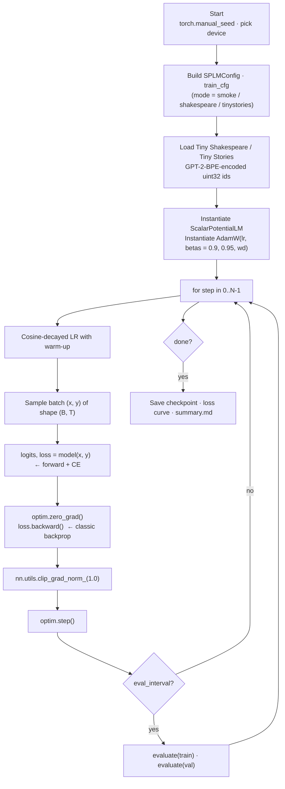
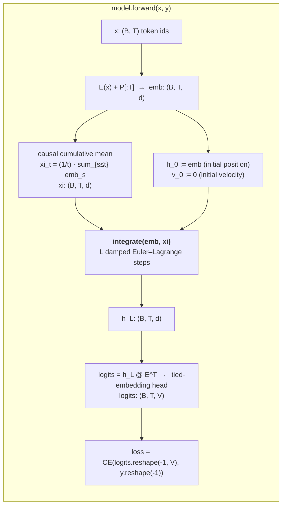
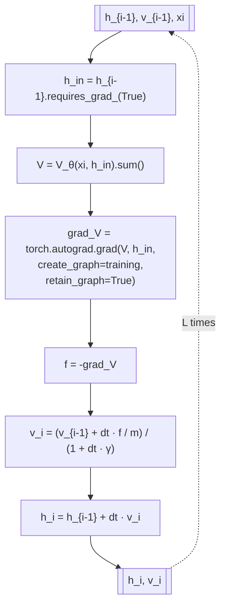
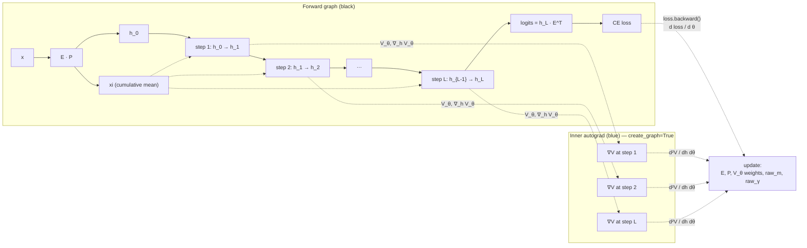
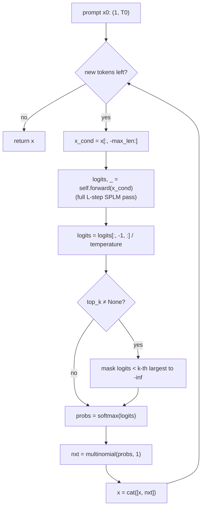

# Training and inference with the Scalar-Potential Language Model (SPLM)

This note is a detailed walk-through of how the conservative-by-construction
language model of §14 of the paper is actually trained and run at inference
time. It complements the higher-level design document
[`Conservative_by_Construction_Language_Models.md`](./Conservative_by_Construction_Language_Models.md)
by focusing on the concrete computational pipeline: what happens to a batch of
token ids on its way to a loss value, how the autograd graph is built, what
parameters are updated, and how the same forward pass is reused for scoring
and autoregressive generation.

The reference implementation lives in
[`notebooks/conservative_arch/model.py`](../notebooks/conservative_arch/model.py)
and [`notebooks/conservative_arch/train_splm.py`](../notebooks/conservative_arch/train_splm.py).
All code excerpts below are from those two files, unchanged.

---

## 1. Architectural recap

SPLM is a shared-weight damped-flow language model. The network has three
trainable components:

| component                     | shape / size                            | role                                  |
|-------------------------------|------------------------------------------|---------------------------------------|
| token embedding `E`           | `(V, d)`, `V = 50257`, `d ∈ {64, 128, 192}` | token id → vector, also used as unembedding (weight-tied) |
| positional embedding `P`      | `(T_max, d)`                             | absolute position bias (learned)      |
| scalar potential `V_θ(ξ, h)`  | MLP `2d → v_hidden → ... → 1`            | shared scalar energy over all layers  |
| mass `m`, damping `γ`         | two scalars                              | global integrator constants            |

Everything else — "layers", "heads", "feed-forward blocks" — is *absent*.
Depth is realised not by stacking different blocks, but by running `L`
integration steps of a single damped Euler–Lagrange flow on the same
potential `V_θ`. This is what the paper means by *conservative by
construction*: at every integration step the per-position force is the
gradient of a scalar, so by Clairaut's theorem it is curl-free by definition,
regardless of training.

```43:54:notebooks/conservative_arch/model.py
@dataclass
class SPLMConfig:
    vocab_size: int = 50257
    d: int = 128
    max_len: int = 512
    v_hidden: int = 512
    v_depth: int = 3         # number of hidden layers in V_theta MLP
    L: int = 8               # integration steps (shared-weight "depth")
    dt: float = 1.0
    init_m: float = 1.0
    init_gamma: float = 1.0
    learn_mgamma: bool = True
```

---

## 2. The training pipeline

### 2.1 Top-level training loop

Training is a standard decoder-only LM loop: sample a batch of `(x, y)` with
`y[i,t] = x[i,t+1]`, compute cross-entropy on next-token prediction, backprop,
step the optimiser. The loop in
[`train_splm.py`](../notebooks/conservative_arch/train_splm.py) is:



Nothing in this loop is SPLM-specific; it is the same pattern you would use
for a small GPT. The two-step update is:

```190:195:notebooks/conservative_arch/train_splm.py
        _, loss = model(x, y)
        optim.zero_grad(set_to_none=True)
        loss.backward()
        grad_norm = nn.utils.clip_grad_norm_(model.parameters(),
                                             train_cfg["grad_clip"])
        optim.step()
```

Optimiser: `AdamW(lr, weight_decay, betas=(0.9, 0.95))` with cosine LR decay
and linear warm-up:

```106:110:notebooks/conservative_arch/train_splm.py
def lr_schedule(step: int, lr: float, warmup: int, total: int) -> float:
    if step < warmup:
        return lr * (step + 1) / warmup
    progress = (step - warmup) / max(total - warmup, 1)
    return lr * 0.5 * (1.0 + math.cos(math.pi * min(progress, 1.0)))
```

The only SPLM-specific thing in training is that `model.m` and `model.gamma`
are logged at every `log_interval` step, because their evolution during
training is a physically meaningful diagnostic (after all, they are the
learned mass and damping of the semantic particle). They end up, for the
Shakespeare run, at `m ≈ 0.98`, `γ ≈ 0.96` — the integrator constants that
the §14.4 oracle test recovers to three decimal places.

### 2.2 The forward pass in detail

The model's `forward` has three stages: embed and causal-pool, integrate the
damped flow for `L` steps, tie-weight-unembed into vocabulary logits.



Embedding and causal pool — one forward scan, no attention:

```113:122:notebooks/conservative_arch/model.py
    def _embed_and_pool(self, x: torch.Tensor) -> Tuple[torch.Tensor, torch.Tensor]:
        """x: (B, T) token ids -> (emb, xi)"""
        B, T = x.shape
        pos = self.P[:T].unsqueeze(0)        # (1, T, d)
        emb = self.E(x) + pos                # (B, T, d)
        cumsum = emb.cumsum(dim=1)           # (B, T, d)
        denom = torch.arange(1, T + 1, device=x.device,
                             dtype=emb.dtype).view(1, T, 1)
        xi = cumsum / denom                  # causal cumulative mean
        return emb, xi
```

This `xi_t` is the "context vector" appearing in `V_θ(ξ, h)`. The key
property is that it is *causal* (depends only on positions `≤ t`) and
*associative-scan-cheap* (`O(T · d)`, not `O(T² · d)`). In the main-text
SPLM (§14.2 of the paper) it is held **fixed** throughout the `L`
integration steps at every position.

> **SARF-faithful variant.** The paper also documents a controlled
> ablation (§14.13) in which $\xi^{(\ell)}$ is recomputed from the
> current hidden states at *every* integration step — literally
> realising the time-dependent reinforcement field $\mathcal{E}(t)$ of
> §6 with layer $\ell$ playing the role of time. The only change is
> one additional line inside the integrator loop of §2.3 below; the
> force is still $-\nabla_h V_\theta(\xi, h)$ and all other mechanics
> are unchanged. On Tiny Shakespeare this single-line change buys a
> **33 % perplexity reduction** at identical parameter count and
> wall-clock. See
> [`notebooks/conservative_arch/sarf_variant/`](../notebooks/conservative_arch/sarf_variant/)
> for the implementation and §4 below for the empirical comparison.

### 2.3 The damped Euler–Lagrange integrator

The core of the model is the integrator. Given the fixed `xi` and starting
from `h_0 = emb`, `v_0 = 0`, it iterates for `L` steps:

$$f = -\nabla_{h} V_\theta(\xi, h_{i-1}), \quad v_i = \frac{v_{i-1} + dt \cdot f / m}{1 + dt \cdot \gamma}, \quad h_i = h_{i-1} + dt \cdot v_i.$$



The corresponding code is compact:

```145:161:notebooks/conservative_arch/model.py
        for _ in range(cfg.L):
            # Force f = -grad_h V_theta(xi, h), differentiable through V_theta.
            h_in = h
            if not h_in.requires_grad:
                h_in = h_in.requires_grad_(True)
            V = self.V_theta(xi, h_in).sum()
            grad_V, = torch.autograd.grad(
                V, h_in, create_graph=self.training, retain_graph=True,
            )
            f = -grad_V
            v = (v + dt * f / m) / (1.0 + dt * gamma)
            h = h_in + dt * v
            if return_trajectory:
                assert traj is not None
                traj.append(h.detach().cpu())

        return h, traj
```

Two things worth calling out:

1. **`.sum()` is a trick.** `V_θ(xi, h_in)` has shape `(B, T, 1)`, but
   `torch.autograd.grad` expects a scalar. Summing over all `(B, T)`
   positions does not break the per-position gradient, because each output
   depends only on its own `h_in[b, t, :]` — the sum is an independent sum
   of independent scalars, and each partial derivative w.r.t. `h_in[b, t, :]`
   is exactly the per-position force. This is the standard way to vectorise
   `∇_x` of a scalar over a batch dimension.

2. **`create_graph=self.training` is the crucial flag.** When set, PyTorch
   preserves the forward graph of `grad_V` itself, so that the outer
   `loss.backward()` can subsequently propagate gradients *through the
   gradient computation*. Without this flag, the force `f` would be a leaf
   w.r.t. the `V_θ` parameters and they would never be trained.

### 2.4 What the gradient graph looks like

The Lagrangian structure means the training-time autograd graph is a
*second-order* graph: ordinary gradient flow through the integration and
the unembedding, plus one extra `∇∇` node per integration step for the
force. The picture:



In words:
- `loss.backward()` propagates `∂loss/∂logits → ∂loss/∂h_L` through the
  tied-embedding unembedding.
- For each of the `L` integration steps, the chain rule needs
  `∂h_i / ∂h_{i-1}`, which itself contains the Jacobian of `-∇_h V_θ`.
  This is a *second* derivative of `V_θ` and requires `create_graph=True`
  at the force-evaluation step.
- All `L` inner gradient calls contribute to `V_θ`'s parameter gradient,
  because `V_θ` is *shared* across steps. Mass `m` and damping `γ`
  accumulate gradient from every step through the integrator's closed
  form.

The key invariant is that **only ordinary backprop** is used at the outer
loop; the force computation is just a nested differentiation call, and
PyTorch's autograd handles the full Hessian-vector algebra transparently.
There is no manual adjoint method, no PINN-style physics loss, no
matching-to-transformer-trajectories objective. The physics is in the
*architecture*, not in the loss.

### 2.5 Loss, gradient flow, and trainable parameters

The loss is a plain token-level cross-entropy:

```180:185:notebooks/conservative_arch/model.py
        loss = None
        if targets is not None:
            loss = F.cross_entropy(
                logits.reshape(-1, self.cfg.vocab_size),
                targets.reshape(-1),
            )
```

Trainable parameter groups and the paths along which gradients reach them:

| parameter            | update signal                                                    |
|----------------------|------------------------------------------------------------------|
| `E.weight`           | both the initial position `h_0` and the unembedding `h_L · E^T`  |
| `P`                  | only the initial position `h_0`                                  |
| `V_θ.net.*`          | via every one of the `L` inner `torch.autograd.grad` calls       |
| `raw_m`, `raw_γ`     | via the integrator update, positivity-mapped by `softplus(·) + 1e-3` |

The positivity of `m` and `γ` is structurally guaranteed:

```104:110:notebooks/conservative_arch/model.py
    @property
    def m(self) -> torch.Tensor:
        return F.softplus(self.raw_m) + 1e-3

    @property
    def gamma(self) -> torch.Tensor:
        return F.softplus(self.raw_gamma)
```

so the learned integrator stays a well-posed damped oscillator for the full
length of training.

### 2.6 Why the network converges despite a single shared `V_θ`

A reasonable worry is that a single MLP `V_θ` shared across `L` steps is
too rigid to capture the computation that a GPT-2 block sequence expresses.
The escape hatch is that *depth* in SPLM is not depth of distinct maps; it
is depth of *integration of the same map*. The effective computation at
layer `i` is

$$h_i = \Phi^{(i)}_{dt, m, \gamma}\bigl(V_\theta(\xi, \cdot)\bigr)(h_0)$$

where `Φ^(i)` is `i` compositions of the damped-Euler operator. Even with
a fixed `V_θ`, the orbit `{h_0, h_1, …, h_L}` traces a non-trivial curve
through the energy landscape, and the shape of that curve — which of the
minima, saddles, and slow manifolds of `V_θ` are visited, and for how long
— is controlled by `(h_0, ξ, m, γ, dt)`. Training moves the landscape of
`V_θ` until the last point `h_L` of the orbit carries the next-token
information under the tied unembedding.

This is why the §14.2 shared-potential fit reaches median `R² = 0.90`
across all layers on SPLM: by construction, the flow it runs *is* a
shared-scalar dynamics, so the diagnostic that looks for one is guaranteed
to find the corresponding structure.

---

## 3. The inference pipeline

### 3.1 Scoring a known sequence

Computing logits / loss on a fixed sequence is exactly the forward pass of
§2 with `targets` optionally provided. The only inference-time differences
from training are:

1. `model.eval()` is set (toggles `create_graph=False` in the integrator,
   because `self.training` is now `False` — see
   [`model.py:152`](../notebooks/conservative_arch/model.py)). This keeps
   the inner `torch.autograd.grad` call's graph alive only for the
   force-compute itself, discarding the second-order structure. The inner
   call is still needed — the force is still `-∇_h V_θ` — but nothing holds
   a reference to it afterwards, so memory usage is `O(1)` in `L`.

2. The outer loop wraps in `torch.no_grad()` where the caller does not need
   the logits to be differentiable. Note that `evaluate()` in
   `train_splm.py` deliberately uses `torch.enable_grad()` inside a
   `@torch.no_grad()`-decorated function:

```113:127:notebooks/conservative_arch/train_splm.py
@torch.no_grad()
def evaluate(model: ScalarPotentialLM, ids: np.ndarray,
             iters: int, batch_size: int, block_size: int,
             rng: np.random.Generator, device: str) -> float:
    model.eval()
    losses = []
    for _ in range(iters):
        xb, yb = get_batch(ids, batch_size, block_size, rng)
        x = torch.from_numpy(xb).to(device)
        y = torch.from_numpy(yb).to(device)
        with torch.enable_grad():
            _, loss = model(x, y)
        losses.append(loss.item())
    model.train()
    return float(np.mean(losses))
```

The `torch.enable_grad()` is necessary: the integrator cannot compute the
force `f = -∇_h V_θ` with autograd disabled globally.  `model.eval()` turns
off `create_graph` for the second-order term, which is what actually saves
memory.

### 3.2 Autoregressive generation

Generation is the natural decoder-only loop: on each step, score the
window of the last `max_len` tokens, take the last-position logits, sample
(top-k + temperature), append, repeat.



The code is:

```190:206:notebooks/conservative_arch/model.py
    @torch.no_grad()
    def generate(self, x: torch.Tensor, max_new_tokens: int,
                 temperature: float = 1.0, top_k: Optional[int] = None) -> torch.Tensor:
        """Autoregressive greedy / sampled generation.  x: (1, T0)."""
        self.eval()
        for _ in range(max_new_tokens):
            x_cond = x[:, -self.cfg.max_len:]
            logits, _ = self.forward(x_cond)
            logits = logits[:, -1, :] / max(temperature, 1e-6)
            if top_k is not None:
                v, _ = torch.topk(logits, top_k)
                logits[logits < v[:, [-1]]] = -float("inf")
            probs = F.softmax(logits, dim=-1)
            nxt = torch.multinomial(probs, num_samples=1)
            x = torch.cat([x, nxt], dim=1)
        return x
```

### 3.3 Why there is no KV cache (and why decoding is cheap)

In an attention decoder, generating the `t`-th new token requires the
keys and values of *all* `t-1` past tokens, which is why transformers
maintain a KV cache that grows linearly with prefix length.  At every new
step the cost of one block is `O(L · T · d + L · T · d²)` where `T` is the
current prefix length (with cache), or `O(L · T² · d)` without it.

SPLM has no such per-position state: the *only* context summary it needs
for position `t` is the single `d`-vector
`xi_t = (1/t) · Σ_{s≤t} (E(x_s) + P_s)`, which is a one-term running
arithmetic mean. If we are willing to cache that `(1, d)` vector across
generation steps, each new token costs exactly one SPLM forward pass on
its own position:

- embed the new token into `emb_t`,
- update `xi_t = ((t-1) · xi_{t-1} + emb_t) / t`,
- run `L` integration steps on `(emb_t, xi_t)` — cost `O(L · d · d_V)`
  where `d_V` is `V_θ`'s hidden width — to get `h_L`,
- compute last-position logits by `h_L · E^T`.

Crucially, this cost is **independent of the prefix length `t`**. That is
the asymptotic-decoding story of the paper's Appendix B:
`O(L · d · d_V)` per new token for SPLM versus `O(L · T · d)` per new
token for a KV-cached attention transformer, so the ratio grows linearly
with `T`.

The current reference implementation of `generate()` does *not* exploit
this — it recomputes the whole window on every step — because the
per-step KV-style optimisation is not needed for research-scale
experiments and the paper's point is the asymptotic count, not the
prototype constant. A "fast" decoder that maintains running `(xi_t,
count_t)` across steps is a trivial extension and the subject of the
efficiency caveats in Appendix B.

> **Fixed-$\xi$ vs SARF-faithful decoder state.** Under the main-text
> (fixed-$\xi$) SPLM, the running state carried across generation
> steps is one `(1, d)` vector per token — the layer-$0$ cumulative
> mean — and $L$ does not enter. Under the SARF-faithful variant, the
> same derivation gives $L$ `(1, d)` cumulative means (one per
> integration step, updated by the same one-term recurrence at each
> layer), so the per-position decoder state grows from `d` floats to
> `L · d` floats — still independent of prefix length `T`. At the
> paper's $L = 8, d = 128$ configuration that is an increase from
> $128$ to $1{,}024$ floats of state per generated token, compared to
> the $2 \cdot L \cdot T \cdot d$ KV cache of a transformer which
> grows with $T$. The constant-in-$T$ decoding claim therefore
> survives SARF-faithful $\xi$ unchanged; only the constant changes.

### 3.4 Trajectory-extraction inference (for diagnostics only)

For the §13 / §14 dynamical-systems diagnostics, the trainer also offers
a non-standard inference mode: same forward pass, but the integrator
snapshots `h_0, h_1, …, h_L` on CPU, which are then analysed offline:

```125:143:notebooks/conservative_arch/model.py
    def integrate(
        self,
        emb: torch.Tensor,   # (B, T, d)  initial h_0
        xi:  torch.Tensor,   # (B, T, d)  context (held fixed along integration)
        return_trajectory: bool = False,
    ) -> Tuple[torch.Tensor, Optional[List[torch.Tensor]]]:
        """Damped Lagrangian flow starting from h_0 = emb, v_0 = 0.

        Returns h_L (and optionally the full per-step trajectory
        [h_0, h_1, ..., h_L] as a list of detached tensors for analysis).
        """
        cfg = self.cfg
        h = emb
        v = torch.zeros_like(h)
        m, gamma, dt = self.m, self.gamma, cfg.dt

        traj: Optional[List[torch.Tensor]] = None
        if return_trajectory:
            traj = [h.detach().cpu()]
```

These trajectories are what the paper's shared-potential fit, velocity-aware
Jacobian-symmetry test, and oracle fit consume.  At *production* inference
this path is never used.

---

## 4. What the main-text SPLM simplifies — and what recent ablations restore

The main-text SPLM of §14.2 is deliberately a *minimal* realisation of
the Semantic Simulation framework — enough to serve as a positive
control for the shared-potential diagnostic, but not a full-fidelity
instantiation of every §-by-§ piece of the framework. It makes two
named simplifications, one on the **reinforcement field** $\xi$ and
one on the **semantic mass** $m$. Both have since been investigated
empirically in dedicated ablations (§14.13 and §14.14 of the paper),
and this section records what the framework prescribes, what SPLM
uses, and what the ablations measured. A conceptual overview of the
same material, without code excerpts, lives in
[`On_Modeling_Semantic_Energy_Field_into_SPLM.md`](./On_Modeling_Semantic_Energy_Field_into_SPLM.md).

### 4.1 Simplification 1: the reinforcement field $\xi$

§6 of the paper defines the reinforcement field $\mathcal{E}(t)$ as a
time-dependent aggregate of every active structure's current state.
Applied inside an `L`-step integrator, the natural identification is
$\mathcal{E}(\ell) \equiv \xi^{(\ell)}$ with $\ell$ playing the role
of discrete time.

**Used in the main-text SPLM (fixed-$\xi$):** compute the pool once
from the layer-$0$ embeddings and reuse it at every subsequent step.
See the `_embed_and_pool` block in §2.2 above.

**Ablation (§14.13, SARF-faithful):** recompute $\xi^{(\ell)}$ from the
current hidden states at every integration step. Code lives in
[`notebooks/conservative_arch/sarf_variant/model_sarf.py`](../notebooks/conservative_arch/sarf_variant/model_sarf.py);
the only functional change is one line inside the integrator loop
(recompute `xi` from `h` at each step before evaluating
`V_θ(xi, h)`).

Empirical result on Tiny Shakespeare at identical
$(d, L, d_V) = (128, 8, 512)$, identical parameter count
($7{,}123{,}075$), identical seed and training budget:

| variant            | val CE | val ppl | $\Delta$ ppl     |
|--------------------|-------:|--------:|-----------------:|
| fixed-$\xi$ SPLM   | 5.661  | 287.4   | —                |
| SARF-faithful SPLM | 5.259  | 192.2   | **−33 %**        |

Wall-clock is within 6 % of fixed-$\xi$ in both directions across
repeated runs — the per-layer cumulative mean is `O(T · d)` against the
already-paid `O(T · d · d_V)` of the potential MLP, so SARF-faithful
is effectively free.

### 4.2 Simplification 2: the semantic mass $m$

§11 of the paper defines semantic mass as the **per-token** quantity

$$m_t = w_t = \frac{1}{H}\sum_{n=1}^{H}\sum_{s>t}\alpha^{(n)}_{s,t}$$

— the aggregate attention directed back at position `t` by later
positions `s`, averaged across heads. §11 argues this identification
satisfies five axioms (M1 inertia, M2 gravitational centering, M3
well depth, M4 bound-state proximity / attention-sink phenomenology,
M5 information-content × valence decomposition) and commits to
$m_t = w_t$ for the rest of the paper.

**Used in the main-text SPLM (global $m$):** the integrator uses a
single learned positive scalar $m$, shared across all tokens, all
batch items, and all $L$ integration steps:

```99:110:notebooks/conservative_arch/model.py
        self.raw_m     = nn.Parameter(torch.tensor(_raw_from_positive(cfg.init_m)),
                                      requires_grad=cfg.learn_mgamma)
        self.raw_gamma = nn.Parameter(torch.tensor(_raw_from_positive(cfg.init_gamma)),
                                      requires_grad=cfg.learn_mgamma)

    @property
    def m(self) -> torch.Tensor:
        return F.softplus(self.raw_m) + 1e-3
```

Motivations for this reduction:

1. **SPLM has no attention.** The formula $w_t = \sum_s \alpha_{s,t}$
   is defined in terms of attention weights that do not exist in
   SPLM; the causal cumulative-mean pool is in their place, so the
   §11 formula is not directly evaluable.
2. **A global $m$ makes the oracle fit of §14.4 a clean positive
   control.** The oracle substitutes SPLM's own $V_\theta(\xi, h)$
   for the shared $V_\psi(h)$ and recovers $m = 0.980$, $\gamma =
   0.961$ as global constants with no per-token confound.

### 4.3 Per-token mass ablation (§14.14)

Two cheap SPLM-native per-token mass parameterisations were
implemented and tested on top of the SARF-faithful variant. Code
lives in
[`notebooks/conservative_arch/sarf_mass_variant/model_sarf_mass.py`](../notebooks/conservative_arch/sarf_mass_variant/model_sarf_mass.py)
under `mass_mode ∈ {global, embed_head, logfreq}`. Both preserve
conservativity — the force is still $-\nabla_h V_\theta(\xi, h)$, and
only the kinetic-term prefactor in the integrator becomes
position-dependent.

**Variant (A) — learned linear head on the token embedding** (minimal
data-driven per-token mass):

$$m_t^{(A)} = \mathrm{softplus}(\langle w_m, E_{x_t} \rangle + b_m) + \varepsilon.$$

This adds $d + 1$ parameters, one linear projection from the $d$-dim
embedding down to a scalar.

**Variant (B) — information-theoretic surprisal prior** (minimal
framework-prescribed per-token mass):

$$m_t^{(B)} = \mathrm{softplus}(b_m + \alpha \cdot (-\log \hat p(x_t))) + \varepsilon,$$

where $\hat p(x_t)$ is the add-one-smoothed unigram frequency on the
Tiny Shakespeare training split, precomputed by
[`compute_unigram_frequencies.py`](../notebooks/conservative_arch/sarf_mass_variant/compute_unigram_frequencies.py).
The only new learnable parameter is the scalar scale $\alpha$; the
shape of $m_t$ is fixed by the data once and for all.

The integrator change in both cases is one line: replace
`v = (v + dt * f / m) / (1 + dt * γ)` by
`v = (v + dt * f / m_t.unsqueeze(-1)) / (1 + dt * γ)`.

**Empirical comparison** on Tiny Shakespeare at the same
configuration as §4.1 (four variants, identical $d, L, d_V$, identical
seed and budget):

| variant                            | params       | val CE | val ppl | $\Delta$ ppl vs fixed-$\xi$ |
|------------------------------------|-------------:|-------:|--------:|----------------------------:|
| fixed-$\xi$ SPLM                   | 7,123,075    | 5.661  | 287.4   | —                           |
| SARF-faithful SPLM                 | 7,123,075    | 5.259  | 192.2   | −33 %                       |
| SARF + embed-head mass (A)         | 7,123,204    | 5.407  | 222.9   | −22 %                       |
| **SARF + logfreq mass (B)**        | **7,123,076**| **5.079** | **160.6** | **−44 %**                 |

The headline numbers:

- Variant (B), the framework-prescribed surprisal prior, beats every
  other configuration: **44 % val ppl reduction vs fixed-$\xi$**
  SPLM, and **17 % further reduction on top of SARF-faithful**, at
  the cost of **one** extra scalar parameter and a frozen
  vocabulary-sized surprisal tensor (which does not enter the
  parameter count).
- Variant (A), the more expressive learned head, **underperforms**
  variant (B) by about $27\%$ at this scale. The asymmetry is an
  inductive-bias-vs-data-efficiency finding: the surprisal prior
  fixes the *shape* of $m_t$ from step $0$ and leaves only a single
  scale $\alpha$ to be learned, whereas (A) must discover both shape
  and scale from roughly $300$K tokens.
- Along the **depth axis**, the strict shared-$V_\psi$ fit of §14.2
  actually **tightens** under variant (B): pooled TEST $R^2$ goes
  from $+0.79$ (fixed-$\xi$) to $+0.84$. Variant (B) is the only
  configuration in the paper where LM perplexity and strict
  shared-potential fidelity improve in the same direction.
- Along the **token axis**, by contrast, pooled TEST $R^2$ drops
  monotonically across the four variants ($0.52 \to 0.41 \to 0.36
  \to 0.33$). Part of this is expected: the larger a per-token
  structural difference variant (B) introduces, the less a single
  shared $V_\psi(h)$ — which ignores $\xi$ and $m_t$ — can absorb
  along the position axis at fixed layer. The trade-off
  ($-0.19$ token-axis $R^2$ for $-44\%$ perplexity and $+0.05$
  depth-axis $R^2$) is, on net, favourable, and is discussed in
  §14.14 of the paper.

This is the first direct empirical resolution of what §16 of the
paper flagged as Open Question **Q10** ("per-token semantic mass in
SPLM"): of the two cheap per-token parameterisations we tried on top
of SARF-faithful $\xi$, the *framework-prescribed* one
($m_t \propto -\log \hat p(x_t)$) wins decisively. A third
parameterisation, the pool-weighted mass
$w_t^{\mathrm{splm}} = \sum_{s \ge t} 1/s$ that the causal cumulative
mean makes available without any new parameters, remains open (Q11
in [`On_Modeling_Semantic_Energy_Field_into_SPLM.md`](./On_Modeling_Semantic_Energy_Field_into_SPLM.md)).

### 4.4 The best-in-paper configuration

Combining the two ablations — SARF-faithful $\xi$ *and* logfreq
per-token mass — gives the best SPLM in the paper:

- val ppl **160.6** on Tiny Shakespeare, a **44 %** reduction from
  the main-text fixed-$\xi$ global-$m$ baseline;
- closes the gap to the matched 8 M-parameter GPT-2-style baseline
  from $287/142 \approx 2.0\times$ to $161/142 \approx 1.13\times$;
- depth-axis pooled shared-$V_\psi$ $R^2 = +0.84$, above the
  fixed-$\xi$ baseline's $+0.79$ and nowhere near the GPT-2
  middle-band $R^2 \approx +0.09$;
- one extra scalar parameter over the baseline, plus a frozen
  vocabulary-sized surprisal tensor;
- wall-clock within about $25\%$ of baseline SPLM on the same MPS
  backend (all extra cost is Python dispatch, not FLOPs; see
  Appendix B of the paper).

This is the configuration that should be read as "the most
framework-faithful SPLM that fits within the scope of this paper".
Full numerical tables, per-layer $R^2$ profiles and reproduction
commands live in
[`notebooks/conservative_arch/sarf_mass_variant/comparison_report.md`](../notebooks/conservative_arch/sarf_mass_variant/comparison_report.md).

---

## 5. Summary

- Training is classic backprop with `AdamW`, next-token CE, cosine LR and
  gradient clipping. There is no physics regulariser, no auxiliary loss, no
  distillation.
- The conservativity comes from the architecture: the inter-layer update is
  `h_{i} = h_{i-1} + dt · v_i`, `v_i = (v_{i-1} + dt · f / m) / (1 + dt · γ)`
  with `f = -∇_h V_θ`, and `V_θ` is the *same* scalar MLP at every step.
- The only subtlety is the nested `torch.autograd.grad` call that computes
  the force inside the forward pass with `create_graph=True` during
  training; this is what makes `∂loss/∂V_θ` propagate through the `L`
  integration steps.
- Inference is the same forward pass with `model.eval()` (no second-order
  graph) and wraps in a standard top-k/temperature autoregressive loop.
  The causal cumulative-mean pool and the layer-sharing of `V_θ`, `m`, `γ`
  jointly eliminate the need for a KV cache and give the decoder-time
  efficiency story of Appendix B.
- The main-text SPLM makes two named simplifications against the
  framework — a fixed (rather than layer-refreshed) reinforcement
  field $\xi$ and a single global (rather than per-token) semantic
  mass $m$. Both have been investigated empirically in dedicated
  ablations (§14.13 and §14.14 of the paper, summarised in §4 above).
  Restoring layer-refreshed $\xi$ buys a **33 %** val-perplexity
  reduction; layering a per-token $m_t \propto -\log \hat p(x_t)$
  prior on top of that buys another **17 %**, for a combined **44 %**
  reduction against the main-text SPLM — at the cost of **one**
  extra scalar parameter and a frozen surprisal tensor. This is the
  first case in the paper where a framework-prescribed upgrade to
  SPLM simultaneously **improves LM quality** and **tightens the
  shared-potential diagnostic of §14.2**.

In short: *physics in the architecture, classical optimiser on the outside — and every framework-faithful refinement we have tested so far has made the model better.*
