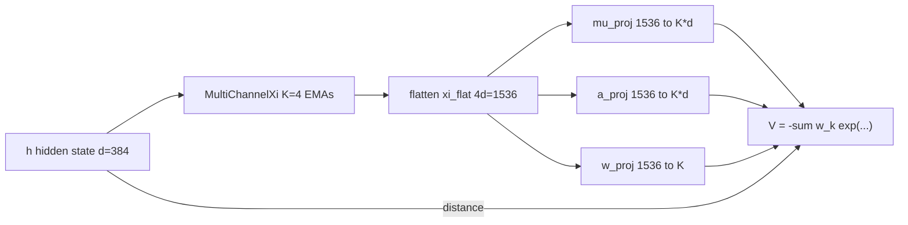
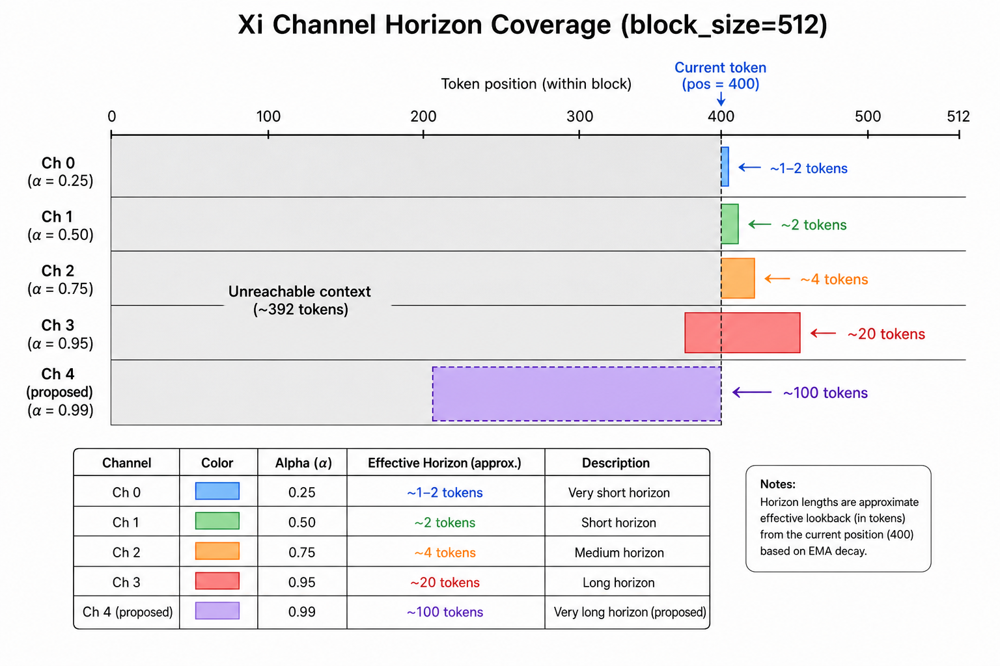
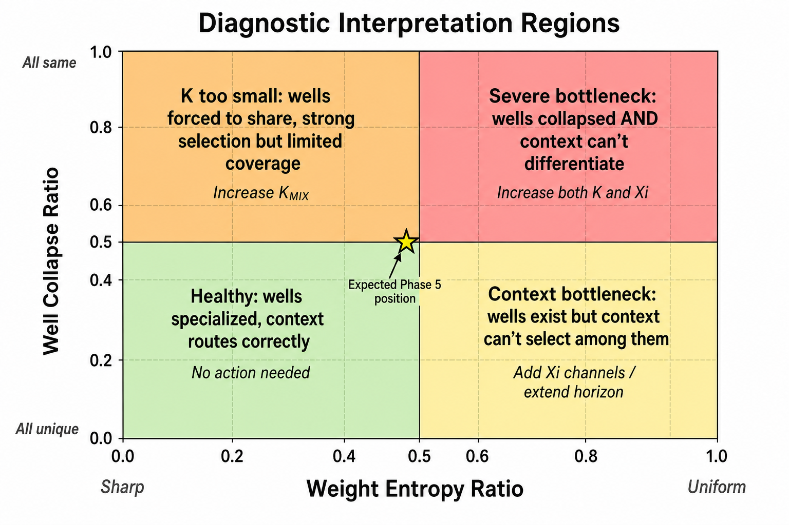
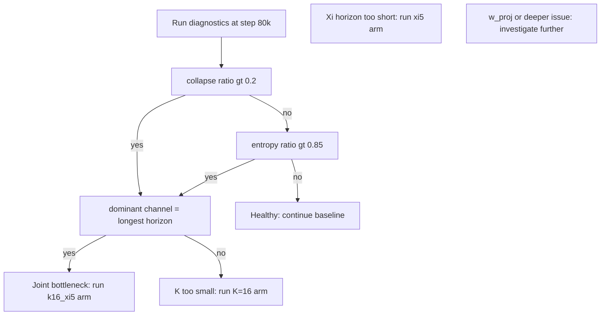
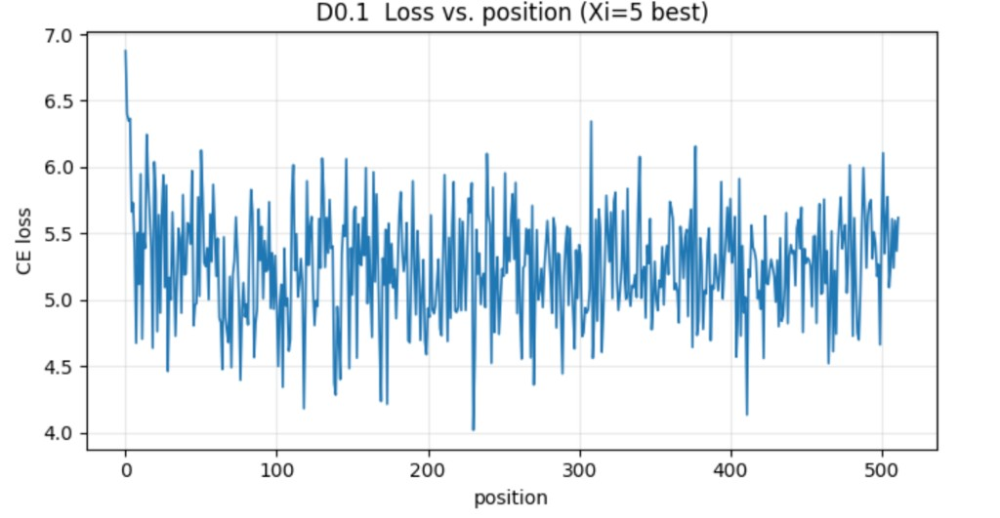
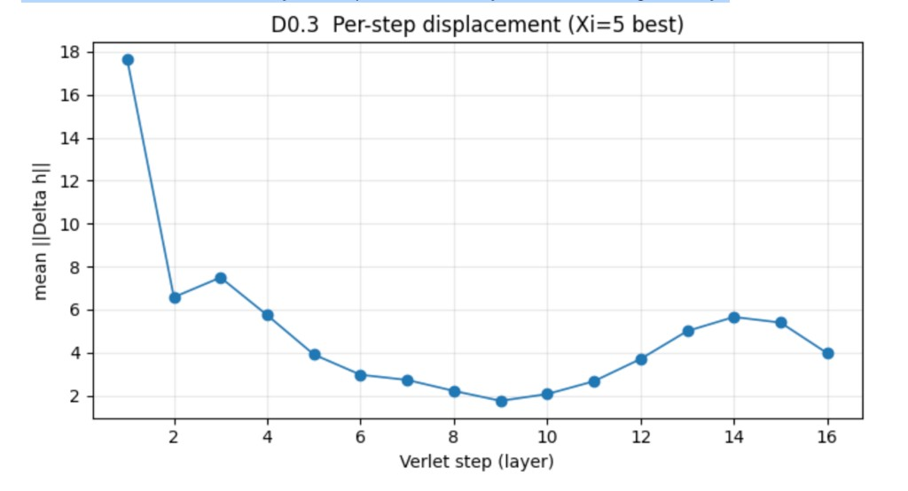
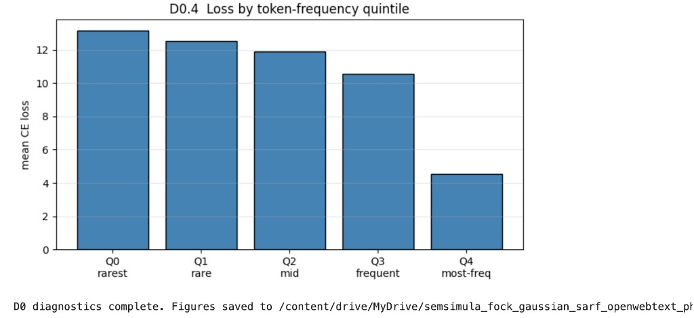
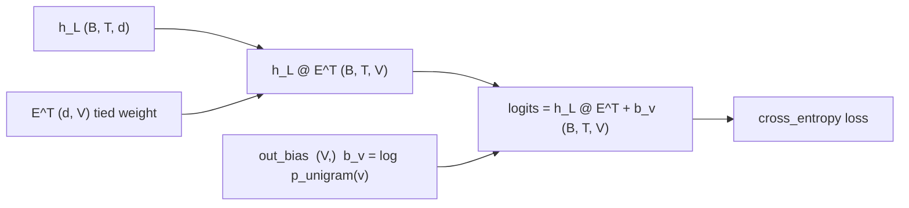
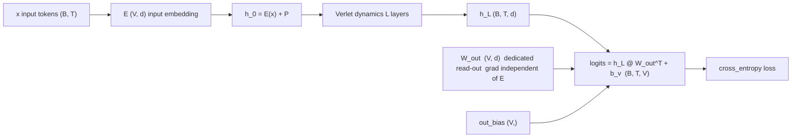
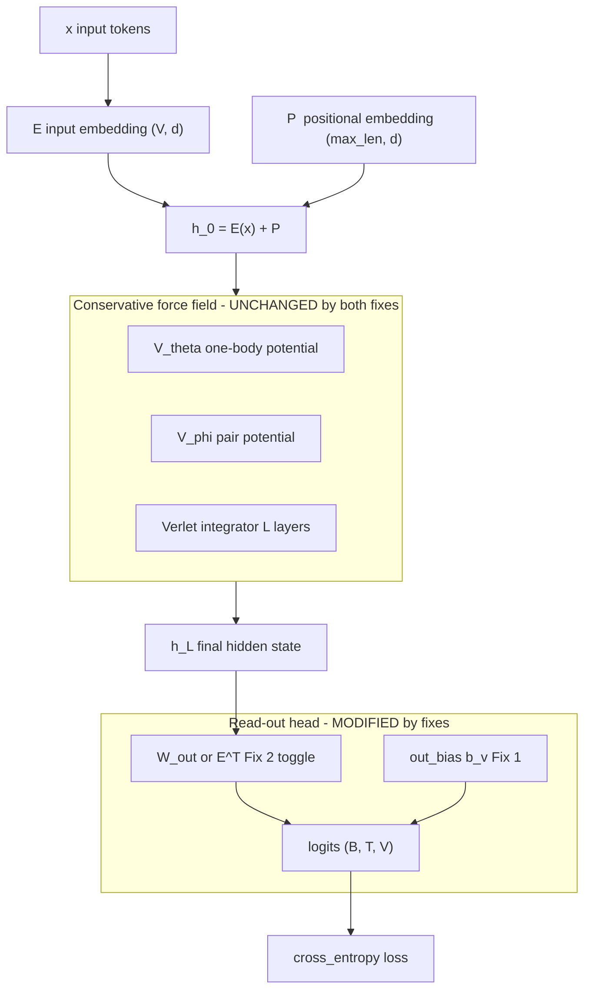

# Xi Bottleneck Diagnosis: Phase 5 Multi-Xi Fock-PARFLM v2.1 on OpenWebText

**Status:** companion note to *Semantic Simulation: A Prescriptive Lagrangian Framework for Efficient Semantic Inference* (Gueorguiev, 2026).
**Scope:** diagnosing and isolating the capacity bottleneck that causes the Gaussian-well Fock-PARFLM v2.1 to plateau at PPL ~222 on OpenWebText, and defining the experimental protocol to resolve it.
**Companion docs:**

- [`Training_Instabilities_in_Fock-PARFLM_with_structured_V_theta.md`](./Training_Instabilities_in_Fock-PARFLM_with_structured_V_theta.md) -- stability fixes (LR, watchdog, sigma/precision caps).
- [`Structured_VTheta_Design_and_Theory.md`](./Structured_VTheta_Design_and_Theory.md) -- structured $V_\theta$ theory and the Gaussian/SARF family.
- **Implementation:**
  - Diagnostics module: [`notebooks/conservative_arch/parf/xi_bottleneck_diagnostics.py`](../notebooks/conservative_arch/parf/xi_bottleneck_diagnostics.py).
  - Phase 5 notebook: [`notebooks/conservative_arch/scaleup/colab_fock_gaussian_sarf_openwebtext_phase5.ipynb`](../notebooks/conservative_arch/scaleup/colab_fock_gaussian_sarf_openwebtext_phase5.ipynb).

---

## Table of Contents

1. [The observed plateau](#1-the-observed-plateau)
2. [Architecture and capacity knobs](#2-architecture-and-capacity-knobs)
3. [Three bottleneck hypotheses](#3-three-bottleneck-hypotheses)
4. [Diagnostic battery](#4-diagnostic-battery)
5. [Experimental arms](#5-experimental-arms)
6. [Decision framework](#6-decision-framework)
7. [Expected outcomes and next steps](#7-expected-outcomes-and-next-steps)
8. [D0 free-diagnostics: measured results (Xi=5, step 78k)](#8-d0-free-diagnostics-measured-results-xi5-step-78k)
9. [Read-out head fixes: code walkthrough](#9-read-out-head-fixes-code-walkthrough)

---

> **Update (2026-06-21).** The Xi-specific battery of §4 (well collapse / Xi
> sensitivity / weight entropy) was **disabled before it produced data** — the
> `run_xi_diagnostics` call left the model in `eval()` mode on failure, collapsing
> `v_reg`, so it was removed from the training loop. Instead, the **free D0
> battery** (loss-vs-position, effective rank, per-Verlet-step displacement,
> loss-by-frequency) was run read-only on the Xi=5 best checkpoint. Its results
> (§8) **partly overturn** the H1/H2 ranking below: the binding constraint is an
> output/embedding-head long-tail problem, not well count or Xi horizon. Read §8
> together with §15 of
> [`Fock-PARFLM_vs_GPT-2_on_OpenWebText_Next_Steps.md`](./Fock-PARFLM_vs_GPT-2_on_OpenWebText_Next_Steps.md).

---

## 1. The observed plateau

Phase 5 of the Gaussian-well Fock-PARFLM v2.1 on OpenWebText shows a clear pattern: after strong initial convergence (PPL 247 at step 40k to PPL 222 at step 70k), the model enters a regime characterised by:

- **Stalling best PPL** around ~222, with eval oscillations of 10--15 PPL points above the best.
- **Escalating gradient spikes** in raw magnitude: 413 (step 43k), 1177 (step 52.8k), 1484 (step 75.8k).
- **Periodic watchdog reloads** (3 in 36k steps), each recovering to the best checkpoint but struggling to improve past it.

The gradient spike pattern is the key signal. Spikes that grow in magnitude while the best PPL stalls indicate that the optimizer is attempting increasingly large updates to well parameters in order to make progress, but the model's capacity is insufficient to accommodate the competing data modes -- the wells are being pulled in conflicting directions by different subsets of the corpus.

**Current configuration:**

| Parameter | Value |
|-----------|-------|
| d (hidden dim) | 384 |
| L (layers) | 16 |
| M (Fock registers) | 32 |
| K (Gaussian wells) | 8 |
| K_xi (Xi channels) | 4 |
| α inits | [0.25, 0.50, 0.75, 0.95] |
| Total params | 31.5M |
| block\_size | 512 |

## 2. Architecture and capacity knobs

The end-to-end data flow through the Xi/V\_theta subsystem has three distinct capacity chokepoints.



Each Xi channel $\xi^{(k)}$ is a causal exponential moving average of hidden states $h$:

$$
\xi^{(k)}_t = \alpha_k \xi^{(k)}_{t-1} + (1 - \alpha_k) h_t,
$$

with effective lookback horizon $\tau_k = 1 / (1 - \alpha_k)$. The channels are concatenated into a single context vector that drives the well parameters:

$$
\xi_{\text{flat}} = \big[\xi^{(1)}_t \ \Vert \ \xi^{(2)}_t \ \Vert \ \cdots \ \Vert \ \xi^{(K_\xi)}_t\big] \in \mathbb{R}^{K_\xi d}.
$$

Three linear projections map this context to well parameters:

$$
\mu_k(\xi) = W_\mu \xi_{\text{flat}} + b_\mu \in \mathbb{R}^{K \times d}, \qquad
a_k(\xi) = \text{softplus}(W_a \xi_{\text{flat}} + b_a) \in \mathbb{R}^{K \times d},
$$

$$
w_k(\xi) = \text{softmax}(W_w \xi_{\text{flat}} + b_w) \in \mathbb{R}^K.
$$

The potential is then:

$$
V(\xi, h) = -\sum_{k=1}^{K} w_k(\xi) \exp\left(-\tfrac{1}{2} a_k(\xi)^\top (h - \mu_k(\xi))^2\right).
$$

**Projection parameter counts (d=384, K=8):**

| Projection | Shape | Params | Notes |
|------------|-------|--------|-------|
| `mu_proj` | 1536 to 3072 | ~4.7M | Positions wells in latent space |
| `a_proj` | 1536 to 3072 | ~4.7M | Controls well widths (precision) |
| `w_proj` | 1536 to 8 | ~12K | Routes context to wells |

## 3. Three bottleneck hypotheses

### H1: Well count ($K = 8$ is too small)

Eight Gaussian wells must partition the full semantic manifold of OpenWebText -- a diverse corpus spanning news, technical writing, fiction, opinion, and dialogue. When wells are too few, gradient competition arises: a batch of technical content pulls well centres toward domain-specific positions, then the next batch of casual prose pulls them back. The optimizer must make increasingly large updates to find compromises, producing the escalating spike pattern.

**Quantitative signature.** If $K$ is the bottleneck, multiple wells will decode to the same token through the LM head, because they are forced to cover overlapping semantic regions:

$$
\text{collapse ratio} = 1 - \frac{\text{unique decoded tokens}}{K}.
$$

A healthy model has collapse ratio near 0. A bottlenecked model approaches $1 - 1/K$.

### H2: Xi channel horizon ($\alpha_{\max} = 0.95$ is too short)

The current Xi channel configuration provides effective lookback horizons of:

| Channel | α | Horizon (τ tokens) |
|---------|----------|------------------------|
| ξ¹ | 0.25 | ~1.3 |
| ξ² | 0.50 | ~2.0 |
| ξ³ | 0.75 | ~4.0 |
| ξ⁴ | 0.95 | ~20.0 |

For TinyStories (short narratives, small vocabulary), 20 tokens of context captures most of the relevant structure. For OpenWebText with `block_size=512`, **the longest Xi channel sees only 3.9% of the available context window** (20 / 512). The model literally cannot condition its well positions on paragraph-level or document-level topic.



This forces $\mu_k(\xi)$ to produce **corpus-average well positions** rather than topic-specialised ones, degrading the effective expressivity of the 8-well partition.

**Quantitative signature.** If the Xi horizon is the bottleneck, the longest-horizon channel will carry the largest gradient because the model is squeezing maximal information from it:

$$
\text{dominance ratio} = \frac{\max_k \lVert \partial V / \partial \xi^{(k)} \rVert}{\min_k \lVert \partial V / \partial \xi^{(k)} \rVert}.
$$

A dominance ratio significantly above 1, where the dominant channel is $k = K_\xi - 1$ (the longest horizon), indicates the model wants more long-range context.

### H3: Mixing weight capacity ($w\_\text{proj}$: 1536 to 8 is too tight)

The mixing-weight head compresses 1536 dimensions into 8 softmax logits. If this projection cannot differentiate contexts well enough, all wells receive near-uniform weight regardless of the input, preventing specialisation.

**Quantitative signature.** Near-uniform mixing weights have entropy close to the theoretical maximum:

$$
H(w) = -\sum_{k=1}^{K} w_k \log w_k, \qquad H_{\max} = \log K.
$$

The entropy ratio $H(w) / H_{\max}$ quantifies how uniform the mixing is: 1.0 = perfectly uniform (no differentiation), 0.0 = maximally sharp (single well dominates).

**Assessment:** for $K = 8$, a 1536-to-8 projection is not inherently bottlenecked (1536 features can easily drive 8 logits). This becomes a concern only if $K$ increases to 32 or 64. However, the entropy ratio is still a valuable diagnostic because it **detects the downstream effect** of hypotheses H1 and H2: if wells are collapsed (H1) or context is too short to discriminate (H2), entropy will be high regardless of `w_proj` capacity.

### H1+H2 interaction: the core hypothesis

The most likely scenario is that H1 and H2 interact. With only 20-token horizon, the model cannot tell "I am in a science article" from "I am in a political opinion piece." So `mu_proj` produces corpus-average well positions. With only 8 wells at averaged positions, the basin partition is too coarse for a 50k-vocabulary, diverse corpus. The gradient spikes arise when domain-specific batches try to drag well centres toward specialised positions, but the narrow context window makes the specialisation impossible to sustain.

The interaction predicts that **increasing K alone** (e.g. K=16) will produce diminishing returns if the Xi horizon remains at 20 tokens -- the model gets more wells but still cannot route contexts to them. Conversely, **extending the Xi horizon alone** helps only if there are enough wells to specialise.

## 4. Diagnostic battery

Three metrics are implemented in `xi_bottleneck_diagnostics.py` and run every 10,000 steps during the Phase 5 eval loop.

### 4.1 Well collapse metric

For each position $(t)$ in a validation batch, decode all $K$ well centroids $\mu_k(\xi_t)$ through the LM head:

$$
\text{token}_k = \arg\max_v \left(\mu_k(\xi_t) \cdot E[v]\right),
$$

where $E[v]$ is the embedding of token $v$. Then count unique decoded tokens per position:

$$
U(t) = \lvert \lbrace \text{token}_k : k = 1, \ldots, K \rbrace \rvert.
$$

Report:
- **Average unique per position**: $\bar{U} = \tfrac{1}{BT}\sum_t U(t)$. Ideal: $\bar{U} = K$.
- **Collapse ratio**: $1 - \bar{U}/K$. Ideal: 0.
- **Centroid decode**: the token each averaged centroid $\bar{\mu}\_k$ decodes to, revealing the semantic identity of each basin.
- **Mean responsibility**: average $w_k$ per component, exposing dead wells.

### 4.2 Xi sensitivity (per-channel gradient norm)

Compute the gradient of the potential with respect to each Xi channel separately:

$$
g_k = \lVert \partial V / \partial \xi^{(k)} \rVert_F, \qquad k = 1, \ldots, K_\xi.
$$

This requires a single backward pass through $V$ with `autograd.grad` on $\xi$, which is fast and does not interfere with the main training graph (the diagnostic runs after eval, on a detached batch).

Report:
- **Per-channel norm**: identifies which temporal scale the model depends on most.
- **Dominant channel**: if $k = K_\xi - 1$ (longest horizon) dominates, the model wants more context.
- **Dominance ratio**: how much stronger the dominant channel is vs the weakest.

### 4.3 Weight entropy

Compute the Shannon entropy of the mixing weights averaged over all batch positions:

$$
\bar{H} = \frac{1}{BT}\sum_t H(w(\xi_t)), \qquad H(w) = -\sum_k w_k \log w_k.
$$

Report:
- Mean entropy $\bar{H}$ and max entropy $\log K$.
- **Entropy ratio** $\bar{H} / \log K$ in [0, 1].
- **Per-component mean weight** $\bar{w}\_k = \tfrac{1}{BT}\sum_t w_k(\xi_t)$.

### Diagnostic output format

At every `DIAG_INTERVAL` step (default: 10,000), the training loop prints a formatted summary block and writes the full diagnostic data to `training_log.jsonl`:

```
─── Xi Bottleneck Diagnostics ───

  Well collapse:  K=8  avg_unique=6.2  collapse_ratio=0.225
    centroid decodes: [11, 262, 13, 318, 11, 284, 290, 13]
    mean responsibility: [0.124, 0.126, 0.125, ...]
    centroid tokens: [',', ' the', '.', ' of', ',', ' and', ' in', '.']

  Xi sensitivity (||dV/dxi_k||):
    ch0: 0.000312  (alpha=0.042, ~1 tok)
    ch1: 0.000847  (alpha=0.389, ~2 tok)
    ch2: 0.001203  (alpha=0.621, ~3 tok)
    ch3: 0.002841  (alpha=0.904, ~10 tok) <-- dominant
    dominance ratio: 9.11x

  Weight entropy:  H=1.9421  H_max=2.0794  ratio=0.934  (0=sharp, 1=uniform)
    per-component mean w: [0.125, 0.126, 0.125, ...]
──────────────────────────────────
```

(Values above are illustrative; actual values will be populated from the running experiment.)

## 5. Experimental arms

### 5.1 Current baseline (running)

| Knob | Value |
|------|-------|
| K | 8 |
| K_xi | 4 |
| α inits | [0.25, 0.50, 0.75, 0.95] |
| Variant tag | (none) |

This is the run currently at step ~76k. The diagnostics will produce the first data point at the next `DIAG_INTERVAL` crossing (step 80k).

### 5.2 Extended Xi horizon (prepared)

| Knob | Value |
|------|-------|
| K | 8 |
| K_xi | 5 |
| α inits | [0.25, 0.50, 0.75, 0.95, **0.99**] |
| Variant tag | `xi5` |

Set `XI_OVERRIDE = 5` in Cell 0. This adds a 5th channel with ~100-token horizon, providing 5x the lookback of the current longest channel. The additional parameter cost is modest (~0.6M in `mu_proj` and `a_proj` due to the wider `xi_d = 5d = 1920`).

Isolated directory: `semsimula_fock_gaussian_sarf_openwebtext_phase5_xi5/`.

### 5.3 Increased well count (prepared)

| Knob | Value |
|------|-------|
| K | 16 |
| K_xi | 4 |
| α inits | [0.25, 0.50, 0.75, 0.95] |
| Variant tag | `k16` |

Set `K_MIX = 16` in Cell 0. This doubles the number of Gaussian wells while keeping the Xi configuration unchanged.

Isolated directory: `semsimula_fock_gaussian_sarf_openwebtext_phase5_k16/`.

### 5.4 Combined (if both help)

| Knob | Value |
|------|-------|
| K | 16 |
| K_xi | 5 |
| α inits | [0.25, 0.50, 0.75, 0.95, **0.99**] |
| Variant tag | `k16_xi5` |

Set both `K_MIX = 16` and `XI_OVERRIDE = 5`. This is the definitive arm if the diagnostics indicate a joint H1+H2 bottleneck.

Isolated directory: `semsimula_fock_gaussian_sarf_openwebtext_phase5_k16_xi5/`.

## 6. Decision framework

The diagnostics feed a structured decision tree that maps metric outcomes to the correct intervention.





**Reading the decision tree:**

1. **High collapse ratio (> 0.2) + dominant longest channel**: the joint H1+H2 bottleneck. Wells are collapsing because they cannot specialise, and the model is stretching the longest Xi channel. Run the combined K=16, xi5 arm.

2. **High collapse ratio + dominant is NOT the longest channel**: pure well-count bottleneck (H1). The model has enough context to differentiate but not enough wells. Run K=16.

3. **Low collapse ratio + high entropy ratio (> 0.85) + dominant longest channel**: the context bottleneck (H2). Wells are geometrically distinct but the model cannot modulate weights because context is too short. Run xi5.

4. **Low collapse ratio + low entropy ratio**: the model is healthy at this capacity level. Continue the baseline and monitor for later-stage plateaus.

### Quantitative thresholds

| Metric | Healthy | Warning | Bottleneck |
|--------|---------|---------|------------|
| Collapse ratio | < 0.1 | 0.1--0.25 | > 0.25 |
| Entropy ratio | < 0.7 | 0.7--0.85 | > 0.85 |
| Dominance ratio | < 2 | 2--5 | > 5 |

These thresholds are initial calibration points. After the first diagnostic run at step 80k, they may be refined based on the actual distribution of values.

## 7. Expected outcomes and next steps

### Predictions

Based on the training log analysis, the most likely diagnostic profile at step 80k is:

| Metric | Predicted range | Basis |
|--------|-----------------|-------|
| Collapse ratio | 0.15--0.35 | The 8.3 TinyStories decode showed wells converging to frequent/function tokens; OWT diversity will worsen this |
| Entropy ratio | 0.80--0.95 | With only ~20-token context, the model cannot sharply select wells per topic |
| Dominant channel | ch3 (α = 0.95) | The longest channel carries the most V-relevant information |
| Dominance ratio | 3--10x | The horizon gap between ch3 (20 tok) and ch2 (4 tok) is large |

If confirmed, this places Phase 5 squarely in the **joint bottleneck region** (H1+H2), indicating that the combined K=16, xi5 arm is the correct next experiment.

### Timeline

1. **Step 80k** (imminent): first diagnostic snapshot from the current run. Confirms or refutes the predictions above.
2. **Step 80k--90k**: based on diagnostic results, launch the indicated experimental arm. The xi5 arm trains from scratch but converges faster in the 40k--70k range due to longer context enabling better well positioning from early training.
3. **Step ~120k of the experimental arm**: compare val PPL curves. If the experimental arm beats 222 PPL at an earlier step count, the bottleneck is confirmed.
4. **Convergence (~200k)**: final comparison of best PPL across all arms. The winning configuration informs the production model.

### Per-arm cost estimate

Each arm is a full 200k-step run on a single H100. At ~22 seconds per 200-step block (current rate), each arm takes approximately 50 hours of GPU time.

| Arm | Extra params | GPU-hours | Priority |
|-----|-------------|-----------|----------|
| Baseline (K=8, xi4) | -- | ~50h | Running |
| xi5 (K=8, xi5) | +0.6M | ~51h | High |
| K=16 (K=16, xi4) | +4.7M | ~53h | Medium |
| K=16+xi5 (K=16, xi5) | +5.9M | ~55h | Conditional |

The xi5 arm is the cheapest intervention and the most diagnostic: if it improves PPL without increasing K, the Xi horizon was the dominant bottleneck. If it does not, the next step is clear (increase K).

## 8. D0 free-diagnostics: measured results (Xi=5, step 78k)

The Xi-specific battery of §4 never produced data (disabled; see the update
banner). The **free D0 battery** was run instead — four read-only probes that
need no extra training, defined in §13 of the Next-Steps companion. They were
executed on the Xi=5 arm's best checkpoint
`fock_gaussian_sarf_owt_phase5_xi5_step78000_best.pt` (val PPL 190.73,
$d=384$, $L=16$, $K=8$, $K_\xi=5$). The four probes refine — and in two places
overturn — the H1/H2/H3 ranking of §3.

### 8.1 D0.1 — Loss vs. position



| Position bin | Mean CE (nats) |
|--------------|----------------|
| 0–63 | 5.4393 |
| 64–127 | 5.1153 |
| 128–191 | 5.2589 |
| 192–255 | 5.1952 |
| 256–319 | 5.1911 |
| 320–383 | 5.2616 |
| 384–447 | 5.2236 |
| 448–511 | 5.3312 |

early(8–63) = 5.3695, late(256+) = 5.2519, **total drop = 0.12 nats**. The curve
is essentially flat past ~64 tokens: long-range context is barely exploited.
This is the direct, falsifiable signature anticipated for **H2 (Xi horizon)** and
for V_phi starvation — but the *absolute* range is tiny, so context modelling is
not where most of the loss lives (see §8.4).

### 8.2 D0.2 — Effective rank (participation ratio)

Participation ratio of the final-layer $h_L$ = **229.6** out of $d = 384$, far
above $K = 8$. The representation is **high-rank, not collapsed toward the well
count**. This **refutes the "output attractor ceiling" reading of H1**: there is
no collapse to $K$ directions, so adding wells ($K \to 16$) does not relieve a
binding constraint. (No plot — this probe is a single scalar.)

### 8.3 D0.3 — Per-Verlet-step displacement



$\lVert \Delta h \rVert$ is **U-shaped** across the 16 steps: large at step 0→1
(17.6), a minimum near step 8→9 (1.75), then rising again to ~5.6 at steps
13→14. early(0–2) = 10.57, late(last 3) = 5.00, late/early = **0.47**. Late
layers do substantial work, so **depth is used, not wasted** — contradicting the
auto-heuristic's "depth wasted" message (which only applies below 0.01) and
removing any case for untying $V_\theta$ across layer groups to rescue dead depth.

### 8.4 D0.4 — Loss stratified by token-frequency quintile



Uniform-prior loss is $\ln V = \ln 50257 \approx 10.83$ nats. Measured:

| Quintile | Mean CE (nats) | Occurrences | Reading |
|----------|----------------|-------------|---------|
| Q4 most-freq | 4.541 | 37086 | the bulk (~90.5% of tokens) |
| Q3 frequent | 10.545 | 1982 | ≈ uniform |
| Q2 mid | 11.906 | 1041 | > uniform |
| Q1 rare | 12.541 | 622 | > uniform |
| Q0 rarest | 13.162 | 229 | ≫ uniform |

Everything outside the top quintile is **at or above the uniform-prior loss** —
the model assigns rare targets *less* than uniform probability. The cause is
structural: the read-out is a **tied head with no output bias**
(`logits = h_L @ E.weight.T` in `model_parf.py`), so the network must encode the
entire unigram log-prior as a *direction* in $h_L$ space — impossible for the
whole vocabulary at once, so rare-target positions default to the frequent-token
direction. This is a brand-new finding, **outside the original H1/H2/H3 set**,
and it is the single largest mis-calibration.

### 8.5 Synthesis and revised conclusion

Occurrence-weighted, the ~5.2-nat aggregate (PPL ≈ 180–190) splits into two
additive gaps versus a parameter-matched GPT-2 (CE ≈ 3.4–3.9):

| Component | Share of loss | Probe | Nature | Cure |
|-----------|---------------|-------|--------|------|
| Head (Q4) | ~79% | D0.1, D0.4 | context-mixing gap (CE 4.54 not benefiting from context) | multi-head `V_phi` + `top_k` 8→16/32 |
| Tail (Q0–Q3) | ~21% | D0.4 | output/embedding head (worse than uniform) | output bias init to log-freq; untie LM head |

This **reframes the §6 decision tree and the §7 prediction** (which expected a
joint H1+H2 bottleneck → the `k16_xi5` arm):

- **H1 (well count) — refuted** as a binding constraint by D0.2 (PR 229.6/384, no
  collapse). Increasing $K$ is demoted.
- **H2 (Xi horizon) — partially supported** by the flat D0.1 curve, but the small
  absolute drop means it is secondary to the head/tail gaps; subsumed into the
  multi-head `V_phi` cure rather than a standalone `xi5`/`k16_xi5` arm.
- **Depth — healthy** (D0.3); no V_theta layer-group untie needed.
- **New lead — the output read-out head** (D0.4), which none of H1/H2/H3 covered.

**Implemented response.** `model_parf.PARFConfig` gained `use_output_bias` (a
learned logit bias initialised to log-unigram-frequency via
`PARFLM.init_output_bias_from_logfreq`) and now honours `tie_embeddings=False`
to allocate a dedicated $W_{out}$ read-out; both flow through
`PARFLM.compute_logits`. Because the read-out is a pure post-dynamics projection
of $h_L$, **neither knob touches $V_\theta$ or $V_\phi$, so conservativity is
preserved**. Both knobs are wired into `colab_fock_multihead_openwebtext.ipynb`
(`USE_OUTPUT_BIAS`, `TIE_EMBEDDINGS`) alongside the multi-head `V_phi` cure, so a
single run attacks both the tail (D0.4) and the frequent-token context gap
(D0.1). Recommended sequencing: bias-only first (nearly free), then untie the
head if Q0–Q3 do not recover. The full revised remediation ladder is in §15 of
[`Fock-PARFLM_vs_GPT-2_on_OpenWebText_Next_Steps.md`](./Fock-PARFLM_vs_GPT-2_on_OpenWebText_Next_Steps.md).

## 9. Read-out head fixes: code walkthrough

This section explains the two fixes — output bias (`Fix 1`) and untied LM head
(`Fix 2`) — at the code level, with excerpts from
[`notebooks/conservative_arch/parf/model_parf.py`](../notebooks/conservative_arch/parf/model_parf.py)
and the corresponding notebook knobs in
[`notebooks/conservative_arch/scaleup/colab_fock_multihead_openwebtext.ipynb`](../notebooks/conservative_arch/scaleup/colab_fock_multihead_openwebtext.ipynb).

Both changes live entirely in the **read-out layer** — the projection from the
final hidden state $h_L$ to vocabulary logits. They are **downstream of the
conservative force field** ($V_\theta$, $V_\phi$) and do not affect any gradient
that flows back into those modules, so **conservativity is preserved with no
changes to the Arm-1 diagnostic gate**.

### 9.1 Root cause: the tied-head forced h_L to encode the frequency prior


In the Phase-5 baseline the logit for token $v$ at position $t$ was computed
purely as a dot product between the final hidden state and the token's **input
embedding** $e_v$:

```python
# model_parf.py — Phase-5 baseline (PARFLM.forward)
logits = h_L @ self.E.weight.T   # (B, T, V)
```

This one line creates two intertwined problems.

**Problem 1 — the frequency prior must live in h_L.**
For the model to predict frequent tokens more often than rare ones (as the corpus
demands), the token distribution $P(v \mid h_L) = \text{softmax}(h_L \cdot
E^T)$ must be skewed toward frequent tokens. With no explicit bias the only way
to do this is to steer $h_L$ toward the subspace of frequent-token embeddings.
The training signal pulls $h_L$ into that subspace at every step, leaving less
room for the semantic content the dynamics are supposed to encode. At PPL 190 the
model has clearly found a local equilibrium where $h_L$ encodes **frequency + partial
semantics**, but cannot do both perfectly simultaneously.

**Problem 2 — rare tokens have undertrained input embeddings serving double duty.**
The same matrix $E$ is used both to look up the input representation of token $v$
and to score $h_L$ against it in the output. Rare tokens appear infrequently in
the training data, so their rows $e_v \in E$ receive very few gradient updates.
The model therefore cannot distinguish rare token $v$ from a semantically
different but equally rare token $u$ in the output direction — they both have
poorly defined $e_v$ and $e_u$. The D0.4 result (Q0 CE = 13.16 > ln V = 10.83)
is a direct signature: the model's output distribution on rare targets is *worse
than uniform*.

### 9.2 Fix 1 — Output bias initialised to log-unigram-frequency


**Idea.** Add a learned scalar $b_v$ per vocabulary token to the logits. Initialise
$b_v = \log p_{\text{unigram}}(v)$ so that at step 0 the model's output
distribution is exactly the corpus unigram distribution — for free, without the
dynamics having to encode it. From that point the dynamics can focus entirely on
encoding *contextual deviation* from the prior.

**Data flow after Fix 1:**



**Config flag** (`model_parf.py`, `PARFConfig`):

```python
# PARFConfig dataclass  (model_parf.py, line ~266)
use_output_bias: bool = False   # set True to activate Fix 1
```

**Parameter construction** (`PARFLM.__init__`):

```python
# model_parf.py — PARFLM.__init__
if getattr(cfg, "use_output_bias", False):
    self.out_bias: Optional[nn.Parameter] = nn.Parameter(
        torch.zeros(cfg.vocab_size)   # initialised to zero; overwritten below
    )
else:
    self.register_parameter("out_bias", None)   # not present → no extra params
```

**Log-frequency initialisation** (`PARFLM.init_output_bias_from_logfreq`):

```python
# model_parf.py
@torch.no_grad()
def init_output_bias_from_logfreq(
    self,
    token_counts: torch.Tensor,
    smoothing: float = 1.0,
) -> None:
    """b_v <- log( (count_v + s) / sum_v (count_v + s) )"""
    if self.out_bias is None:
        return                          # no-op when fix is disabled
    counts = torch.as_tensor(
        token_counts, dtype=torch.float32, device=self.out_bias.device
    ).reshape(-1)
    probs = (counts + smoothing) / (counts + smoothing).sum()
    self.out_bias.copy_(probs.log().to(self.out_bias.dtype))
```

The `smoothing=1.0` (add-1 Laplace) prevents $-\infty$ for tokens that appear
zero times in the training slice, which would cause gradient explosions.

**Notebook trigger** (`colab_fock_multihead_openwebtext.ipynb`, Cell 0 + Cell 4):

```python
# Cell 0 — Configuration
USE_OUTPUT_BIAS = True   # D0.4 fix: log-freq output bias (recommended)

# Cell 4 — after model is built
if USE_OUTPUT_BIAS:
    _ob_counts = np.bincount(train_ids.astype(np.int64), minlength=VOCAB_SIZE)
    model.init_output_bias_from_logfreq(_ob_counts)
    print(f'Output bias <- log-unigram-freq  '
          f'(b range [{model.out_bias.min().item():.2f}, '
          f'{model.out_bias.max().item():.2f}])')
```

**Parameter cost.** Exactly $V = 50257$ scalar parameters ($\approx 0.05$% of the
33 M total). Effectively free.

**What it fixes.** $b_v$ absorbs the global frequency prior, so the logit for
token $v$ becomes $h_L \cdot e_v + \log p(v)$. Rare tokens start at a
calibrated baseline instead of being dominated by $h_L$'s frequency-skewed
direction. Because the bias is learned, it can also drift from the pure unigram
prior during training to reflect token-conditional frequency effects.

### 9.3 Fix 2 — Untied LM head (dedicated W_out)

**Idea.** Allocate a completely separate weight matrix $W_{out} \in
\mathbb{R}^{V \times d}$ for the output projection. The input embedding matrix
$E$ is kept for the token lookup `h_0 = E(x) + P`, but the output path uses
$W_{out}$ instead of $E^T$. Their gradients are now independent: $E$ is updated
by the path $x \to h_0 \to \ldots \to h_L \to \text{loss}$ while $W_{out}$ is
updated only by $h_L \to \text{logits} \to \text{loss}$.

**Data flow after Fix 2:**



**Parameter construction** (`PARFLM.__init__`):

```python
# model_parf.py — PARFLM.__init__
# tie_embeddings=True  →  no separate W_out, reuse E^T  (default, Phase-5 compat)
# tie_embeddings=False →  allocate a dedicated nn.Linear read-out head
if cfg.tie_embeddings:
    self.lm_head: Optional[nn.Linear] = None
else:
    self.lm_head = nn.Linear(cfg.d, cfg.vocab_size, bias=False)
    nn.init.normal_(self.lm_head.weight, mean=0.0, std=0.02)
```

**Unified logit computation** (`PARFLM.compute_logits`):

```python
# model_parf.py — called from forward() and from forward_with_vreg() in the notebook
def compute_logits(self, h_L: torch.Tensor) -> torch.Tensor:
    if self.lm_head is not None:
        logits = self.lm_head(h_L)          # uses W_out  (untied path)
    else:
        logits = h_L @ self.E.weight.T      # uses E^T   (tied path)
    if self.out_bias is not None:
        logits = logits + self.out_bias      # Fix 1 bias, if enabled
    return logits
```

This single method is the **single source of truth** for the read-out: both
`forward()` and the notebook's `forward_with_vreg` call it, so neither can
silently bypass the bias or the untied weight. (The previous bug — `forward_with_vreg`
hard-coding `h_L @ model.E.weight.T` — was exactly this bypass and was fixed
simultaneously.)

**Notebook knob** (`colab_fock_multihead_openwebtext.ipynb`, Cell 0):

```python
# Cell 0 — Configuration
TIE_EMBEDDINGS  = True   # False = allocate dedicated W_out read-out head
```

The config kwarg `tie_embeddings=TIE_EMBEDDINGS` is forwarded to `FockMultiXiPARFConfig`
in `make_config()` (Cell 4), which propagates to `PARFLM.__init__` via
the inheritance chain `FockMultiXiPARFLM → MultiXiPARFLM → SparsePARFLM → PARFLM`.

**Parameter cost.** $V \times d = 50257 \times 384 \approx 19.3$ M additional
parameters — roughly a 58% increase on the 33 M baseline. This is why Fix 2 is
applied second (only if the bias-only Fix 1 does not cure Q0–Q3), and why it
warrants a fresh training run rather than fine-tuning: the gradient flow through
$E$ changes qualitatively.

**What it fixes.** Rare tokens' output representations are no longer constrained
by their undertrained input embeddings. $W_{out}$ can develop a well-conditioned
output direction for token $v$ even if $v$ has been seen only 229 times, because
$W_{out}[v]$ only needs to point in the direction of $h_L$ when the context
predicts $v$ — it does not also have to serve as the initial representation
of $v$ when $v$ appears as an input.

### 9.4 Data-flow summary and conservativity argument



The force field subgraph is entirely upstream of the read-out. Gradients from
the loss flow back through the read-out and into $h_L$, but $h_L$ is a **leaf of
the force-field graph** — the gradient `dL/dh_L` is used by the Verlet integrator's
backward pass, not by any $V_\theta$/$V_\phi$ structural computation. So changing
the read-out head **does not alter** which scalar potential generates the forces,
and the Jacobian-symmetry / curl-free property checked by Arm 1 of
`conservativity_diagnostic.py` is unaffected. No re-run of the diagnostic gate
is needed before launching.

### 9.5 Recommended sequencing

| Step | Config | Rationale |
|------|--------|-----------|
| **Run 1 (current)** | `USE_OUTPUT_BIAS=True`, `TIE_EMBEDDINGS=True` | Bias-only: nearly free, directly fixes D0.4 calibration; run with multi-head V_phi |
| **Run 2 (if Q0–Q3 tail persists)** | `USE_OUTPUT_BIAS=True`, `TIE_EMBEDDINGS=False` | Untied head: deeper fix for undertrained rare-token output directions; trains from scratch |
| **Ablation** | `USE_OUTPUT_BIAS=False`, `TIE_EMBEDDINGS=False` | Isolates the untied-head effect alone (no freq-prior term) |

---

**References:**

- Gueorguiev, D. (2026). *Semantic Simulation: A Prescriptive Lagrangian Framework for Efficient Semantic Inference.*
- [`Structured_VTheta_Design_and_Theory.md`](./Structured_VTheta_Design_and_Theory.md) -- structured $V_\theta$ derivations, attractor interpretability, and $K_{\text{mix}}$ selection.
- [`Training_Instabilities_in_Fock-PARFLM_with_structured_V_theta.md`](./Training_Instabilities_in_Fock-PARFLM_with_structured_V_theta.md) -- stability fixes applied in Phase 5.
- [`SARF_Anchor_Placement_From_Converged_Gaussian_Centres.md`](./SARF_Anchor_Placement_From_Converged_Gaussian_Centres.md) -- anchor-placement methodology (uses converged centres from the winning arm).
