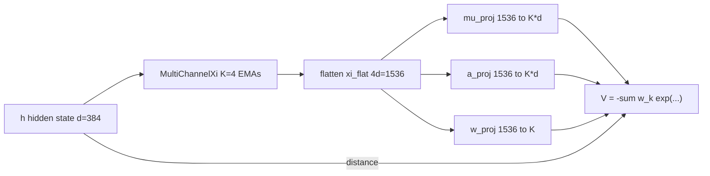
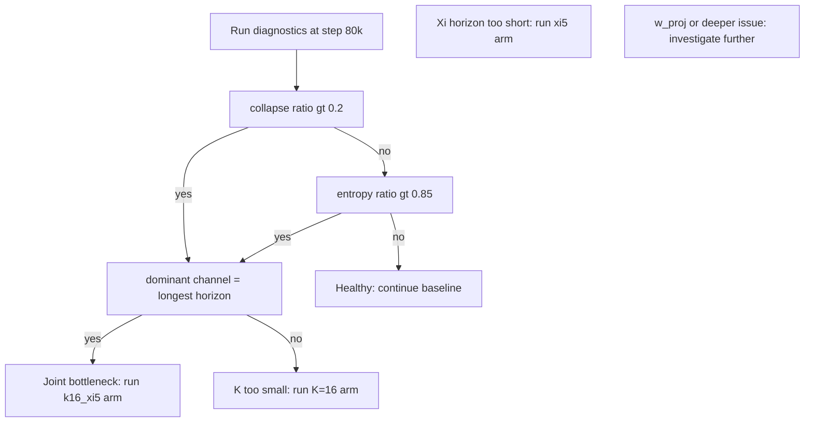

# Xi Bottleneck Diagnosis: Phase 5 Multi-Xi Fock-PARFLM v2.1 on OpenWebText

**Status:** companion note to *Semantic Simulation: A Prescriptive Lagrangian Framework for Efficient Semantic Inference* (Gueorguiev, 2026).
**Scope:** diagnosing and isolating the capacity bottleneck that causes the Gaussian-well Fock-PARFLM v2.1 to plateau at PPL ~222 on OpenWebText, and defining the experimental protocol to resolve it.
**Companion docs:**

- [`Training_Instabilities_in_Fock-PARFLM_with_structured_V_theta.md`](./Training_Instabilities_in_Fock-PARFLM_with_structured_V_theta.md) -- stability fixes (LR, watchdog, sigma/precision caps).
- [`Structured_VTheta_Design_and_Theory.md`](./Structured_VTheta_Design_and_Theory.md) -- structured $V_\theta$ theory and the Gaussian/SARF family.
- **Implementation:**
  - Diagnostics module: [`notebooks/conservative_arch/parf/xi_bottleneck_diagnostics.py`](../notebooks/conservative_arch/parf/xi_bottleneck_diagnostics.py).
  - Phase 5 notebook: [`notebooks/conservative_arch/scaleup/colab_fock_gaussian_sarf_openwebtext_phase5.ipynb`](../notebooks/conservative_arch/scaleup/colab_fock_gaussian_sarf_openwebtext_phase5.ipynb).

---

## Table of Contents

1. [The observed plateau](#1-the-observed-plateau)
2. [Architecture and capacity knobs](#2-architecture-and-capacity-knobs)
3. [Three bottleneck hypotheses](#3-three-bottleneck-hypotheses)
4. [Diagnostic battery](#4-diagnostic-battery)
5. [Experimental arms](#5-experimental-arms)
6. [Decision framework](#6-decision-framework)
7. [Expected outcomes and next steps](#7-expected-outcomes-and-next-steps)

---

## 1. The observed plateau

Phase 5 of the Gaussian-well Fock-PARFLM v2.1 on OpenWebText shows a clear pattern: after strong initial convergence (PPL 247 at step 40k to PPL 222 at step 70k), the model enters a regime characterised by:

- **Stalling best PPL** around ~222, with eval oscillations of 10--15 PPL points above the best.
- **Escalating gradient spikes** in raw magnitude: 413 (step 43k), 1177 (step 52.8k), 1484 (step 75.8k).
- **Periodic watchdog reloads** (3 in 36k steps), each recovering to the best checkpoint but struggling to improve past it.

The gradient spike pattern is the key signal. Spikes that grow in magnitude while the best PPL stalls indicate that the optimizer is attempting increasingly large updates to well parameters in order to make progress, but the model's capacity is insufficient to accommodate the competing data modes -- the wells are being pulled in conflicting directions by different subsets of the corpus.

**Current configuration:**

| Parameter | Value |
|-----------|-------|
| $d$ (hidden dim) | 384 |
| $L$ (layers) | 16 |
| $M$ (Fock registers) | 32 |
| $K$ (Gaussian wells) | 8 |
| $K\_\xi$ (Xi channels) | 4 |
| $\alpha$ inits | [0.25, 0.50, 0.75, 0.95] |
| Total params | 31.5M |
| block\_size | 512 |

## 2. Architecture and capacity knobs

The end-to-end data flow through the Xi/V\_theta subsystem has three distinct capacity chokepoints.



Each Xi channel $\xi^{(k)}$ is a causal exponential moving average of hidden states $h$:

$$
\xi^{(k)}_t = \alpha_k \xi^{(k)}_{t-1} + (1 - \alpha_k) h_t,
$$

with effective lookback horizon $\tau_k = 1 / (1 - \alpha_k)$. The channels are concatenated into a single context vector that drives the well parameters:

$$
\xi_{\text{flat}} = \big[\xi^{(1)}_t \ \Vert \ \xi^{(2)}_t \ \Vert \ \cdots \ \Vert \ \xi^{(K_\xi)}_t\big] \in \mathbb{R}^{K_\xi d}.
$$

Three linear projections map this context to well parameters:

$$
\mu_k(\xi) = W_\mu \xi_{\text{flat}} + b_\mu \in \mathbb{R}^{K \times d}, \qquad
a_k(\xi) = \text{softplus}(W_a \xi_{\text{flat}} + b_a) \in \mathbb{R}^{K \times d},
$$

$$
w_k(\xi) = \text{softmax}(W_w \xi_{\text{flat}} + b_w) \in \mathbb{R}^K.
$$

The potential is then:

$$
V(\xi, h) = -\sum_{k=1}^{K} w_k(\xi) \exp\left(-\tfrac{1}{2} a_k(\xi)^\top (h - \mu_k(\xi))^2\right).
$$

**Projection parameter counts (d=384, K=8):**

| Projection | Shape | Params | Notes |
|------------|-------|--------|-------|
| `mu_proj` | 1536 to 3072 | ~4.7M | Positions wells in latent space |
| `a_proj` | 1536 to 3072 | ~4.7M | Controls well widths (precision) |
| `w_proj` | 1536 to 8 | ~12K | Routes context to wells |

## 3. Three bottleneck hypotheses

### H1: Well count ($K = 8$ is too small)

Eight Gaussian wells must partition the full semantic manifold of OpenWebText -- a diverse corpus spanning news, technical writing, fiction, opinion, and dialogue. When wells are too few, gradient competition arises: a batch of technical content pulls well centres toward domain-specific positions, then the next batch of casual prose pulls them back. The optimizer must make increasingly large updates to find compromises, producing the escalating spike pattern.

**Quantitative signature.** If $K$ is the bottleneck, multiple wells will decode to the same token through the LM head, because they are forced to cover overlapping semantic regions:

$$
\text{collapse ratio} = 1 - \frac{\text{unique decoded tokens}}{K}.
$$

A healthy model has collapse ratio near 0. A bottlenecked model approaches $1 - 1/K$.

### H2: Xi channel horizon ($\alpha_{\max} = 0.95$ is too short)

The current Xi channel configuration provides effective lookback horizons of:

| Channel | $\alpha$ | Horizon ($\tau$ tokens) |
|---------|----------|------------------------|
| $\xi^{(1)}$ | 0.25 | ~1.3 |
| $\xi^{(2)}$ | 0.50 | ~2.0 |
| $\xi^{(3)}$ | 0.75 | ~4.0 |
| $\xi^{(4)}$ | 0.95 | ~20.0 |

For TinyStories (short narratives, small vocabulary), 20 tokens of context captures most of the relevant structure. For OpenWebText with `block_size=512`, **the longest Xi channel sees only 3.9% of the available context window** (20 / 512). The model literally cannot condition its well positions on paragraph-level or document-level topic.


This forces $\mu_k(\xi)$ to produce **corpus-average well positions** rather than topic-specialised ones, degrading the effective expressivity of the 8-well partition.

**Quantitative signature.** If the Xi horizon is the bottleneck, the longest-horizon channel will carry the largest gradient because the model is squeezing maximal information from it:

$$
\text{dominance ratio} = \frac{\max_k \lVert \partial V / \partial \xi^{(k)} \rVert}{\min_k \lVert \partial V / \partial \xi^{(k)} \rVert}.
$$

A dominance ratio significantly above 1, where the dominant channel is $k = K_\xi - 1$ (the longest horizon), indicates the model wants more long-range context.

### H3: Mixing weight capacity ($w\_\text{proj}$: 1536 to 8 is too tight)

The mixing-weight head compresses 1536 dimensions into 8 softmax logits. If this projection cannot differentiate contexts well enough, all wells receive near-uniform weight regardless of the input, preventing specialisation.

**Quantitative signature.** Near-uniform mixing weights have entropy close to the theoretical maximum:

$$
H(w) = -\sum_{k=1}^{K} w_k \log w_k, \qquad H_{\max} = \log K.
$$

The entropy ratio $H(w) / H_{\max}$ quantifies how uniform the mixing is: 1.0 = perfectly uniform (no differentiation), 0.0 = maximally sharp (single well dominates).

**Assessment:** for $K = 8$, a 1536-to-8 projection is not inherently bottlenecked (1536 features can easily drive 8 logits). This becomes a concern only if $K$ increases to 32 or 64. However, the entropy ratio is still a valuable diagnostic because it **detects the downstream effect** of hypotheses H1 and H2: if wells are collapsed (H1) or context is too short to discriminate (H2), entropy will be high regardless of `w_proj` capacity.

### H1+H2 interaction: the core hypothesis

The most likely scenario is that H1 and H2 interact. With only 20-token horizon, the model cannot tell "I am in a science article" from "I am in a political opinion piece." So `mu_proj` produces corpus-average well positions. With only 8 wells at averaged positions, the basin partition is too coarse for a 50k-vocabulary, diverse corpus. The gradient spikes arise when domain-specific batches try to drag well centres toward specialised positions, but the narrow context window makes the specialisation impossible to sustain.

The interaction predicts that **increasing K alone** (e.g. K=16) will produce diminishing returns if the Xi horizon remains at 20 tokens -- the model gets more wells but still cannot route contexts to them. Conversely, **extending the Xi horizon alone** helps only if there are enough wells to specialise.

## 4. Diagnostic battery

Three metrics are implemented in `xi_bottleneck_diagnostics.py` and run every 10,000 steps during the Phase 5 eval loop.

### 4.1 Well collapse metric

For each position $(t)$ in a validation batch, decode all $K$ well centroids $\mu_k(\xi_t)$ through the LM head:

$$
\text{token}_k = \arg\max_v \left(\mu_k(\xi_t) \cdot E[v]\right),
$$

where $E[v]$ is the embedding of token $v$. Then count unique decoded tokens per position:

$$
U(t) = \lvert \lbrace \text{token}_k : k = 1, \ldots, K \rbrace \rvert.
$$

Report:
- **Average unique per position**: $\bar{U} = \tfrac{1}{BT}\sum_t U(t)$. Ideal: $\bar{U} = K$.
- **Collapse ratio**: $1 - \bar{U}/K$. Ideal: 0.
- **Centroid decode**: the token each averaged centroid $\bar{\mu}\_k$ decodes to, revealing the semantic identity of each basin.
- **Mean responsibility**: average $w_k$ per component, exposing dead wells.

### 4.2 Xi sensitivity (per-channel gradient norm)

Compute the gradient of the potential with respect to each Xi channel separately:

$$
g_k = \lVert \partial V / \partial \xi^{(k)} \rVert_F, \qquad k = 1, \ldots, K_\xi.
$$

This requires a single backward pass through $V$ with `autograd.grad` on $\xi$, which is fast and does not interfere with the main training graph (the diagnostic runs after eval, on a detached batch).

Report:
- **Per-channel norm**: identifies which temporal scale the model depends on most.
- **Dominant channel**: if $k = K_\xi - 1$ (longest horizon) dominates, the model wants more context.
- **Dominance ratio**: how much stronger the dominant channel is vs the weakest.

### 4.3 Weight entropy

Compute the Shannon entropy of the mixing weights averaged over all batch positions:

$$
\bar{H} = \frac{1}{BT}\sum_t H(w(\xi_t)), \qquad H(w) = -\sum_k w_k \log w_k.
$$

Report:
- **Mean entropy** $\bar{H}$ and **max entropy** $\log K$.
- **Entropy ratio** $\bar{H} / \log K$ in [0, 1].
- **Per-component mean weight** $\bar{w}\_k = \tfrac{1}{BT}\sum_t w_k(\xi_t)$.

### Diagnostic output format

At every `DIAG_INTERVAL` step (default: 10,000), the training loop prints a formatted summary block and writes the full diagnostic data to `training_log.jsonl`:

```
─── Xi Bottleneck Diagnostics ───

  Well collapse:  K=8  avg_unique=6.2  collapse_ratio=0.225
    centroid decodes: [11, 262, 13, 318, 11, 284, 290, 13]
    mean responsibility: [0.124, 0.126, 0.125, ...]
    centroid tokens: [',', ' the', '.', ' of', ',', ' and', ' in', '.']

  Xi sensitivity (||dV/dxi_k||):
    ch0: 0.000312  (alpha=0.042, ~1 tok)
    ch1: 0.000847  (alpha=0.389, ~2 tok)
    ch2: 0.001203  (alpha=0.621, ~3 tok)
    ch3: 0.002841  (alpha=0.904, ~10 tok) <-- dominant
    dominance ratio: 9.11x

  Weight entropy:  H=1.9421  H_max=2.0794  ratio=0.934  (0=sharp, 1=uniform)
    per-component mean w: [0.125, 0.126, 0.125, ...]
──────────────────────────────────
```

(Values above are illustrative; actual values will be populated from the running experiment.)

## 5. Experimental arms

### 5.1 Current baseline (running)

| Knob | Value |
|------|-------|
| $K$ | 8 |
| $K_\xi$ | 4 |
| $\alpha$ inits | [0.25, 0.50, 0.75, 0.95] |
| Variant tag | (none) |

This is the run currently at step ~76k. The diagnostics will produce the first data point at the next `DIAG_INTERVAL` crossing (step 80k).

### 5.2 Extended Xi horizon (prepared)

| Knob | Value |
|------|-------|
| $K$ | 8 |
| $K_\xi$ | 5 |
| $\alpha$ inits | [0.25, 0.50, 0.75, 0.95, **0.99**] |
| Variant tag | `xi5` |

Set `XI_OVERRIDE = 5` in Cell 0. This adds a 5th channel with ~100-token horizon, providing 5x the lookback of the current longest channel. The additional parameter cost is modest (~0.6M in `mu_proj` and `a_proj` due to the wider `xi_d = 5d = 1920`).

Isolated directory: `semsimula_fock_gaussian_sarf_openwebtext_phase5_xi5/`.

### 5.3 Increased well count (prepared)

| Knob | Value |
|------|-------|
| $K$ | 16 |
| $K_\xi$ | 4 |
| $\alpha$ inits | [0.25, 0.50, 0.75, 0.95] |
| Variant tag | `k16` |

Set `K_MIX = 16` in Cell 0. This doubles the number of Gaussian wells while keeping the Xi configuration unchanged.

Isolated directory: `semsimula_fock_gaussian_sarf_openwebtext_phase5_k16/`.

### 5.4 Combined (if both help)

| Knob | Value |
|------|-------|
| $K$ | 16 |
| $K_\xi$ | 5 |
| $\alpha$ inits | [0.25, 0.50, 0.75, 0.95, **0.99**] |
| Variant tag | `k16_xi5` |

Set both `K_MIX = 16` and `XI_OVERRIDE = 5`. This is the definitive arm if the diagnostics indicate a joint H1+H2 bottleneck.

Isolated directory: `semsimula_fock_gaussian_sarf_openwebtext_phase5_k16_xi5/`.

## 6. Decision framework

The diagnostics feed a structured decision tree that maps metric outcomes to the correct intervention.




**Reading the decision tree:**

1. **High collapse ratio ($\gt 0.2$) + dominant longest channel**: the joint H1+H2 bottleneck. Wells are collapsing because they cannot specialise, and the model is stretching the longest Xi channel. Run the combined K=16, xi5 arm.

2. **High collapse ratio + dominant is NOT the longest channel**: pure well-count bottleneck (H1). The model has enough context to differentiate but not enough wells. Run K=16.

3. **Low collapse ratio + high entropy ratio ($\gt 0.85$) + dominant longest channel**: the context bottleneck (H2). Wells are geometrically distinct but the model cannot modulate weights because context is too short. Run xi5.

4. **Low collapse ratio + low entropy ratio**: the model is healthy at this capacity level. Continue the baseline and monitor for later-stage plateaus.

### Quantitative thresholds

| Metric | Healthy | Warning | Bottleneck |
|--------|---------|---------|------------|
| Collapse ratio | $\lt 0.1$ | 0.1--0.25 | $\gt 0.25$ |
| Entropy ratio | $\lt 0.7$ | 0.7--0.85 | $\gt 0.85$ |
| Dominance ratio | $\lt 2$ | 2--5 | $\gt 5$ |

These thresholds are initial calibration points. After the first diagnostic run at step 80k, they may be refined based on the actual distribution of values.

## 7. Expected outcomes and next steps

### Predictions

Based on the training log analysis, the most likely diagnostic profile at step 80k is:

| Metric | Predicted range | Basis |
|--------|-----------------|-------|
| Collapse ratio | 0.15--0.35 | The 8.3 TinyStories decode showed wells converging to frequent/function tokens; OWT diversity will worsen this |
| Entropy ratio | 0.80--0.95 | With only ~20-token context, the model cannot sharply select wells per topic |
| Dominant channel | ch3 ($\alpha$ = 0.95) | The longest channel carries the most V-relevant information |
| Dominance ratio | 3--10x | The horizon gap between ch3 (20 tok) and ch2 (4 tok) is large |

If confirmed, this places Phase 5 squarely in the **joint bottleneck region** (H1+H2), indicating that the combined K=16, xi5 arm is the correct next experiment.

### Timeline

1. **Step 80k** (imminent): first diagnostic snapshot from the current run. Confirms or refutes the predictions above.
2. **Step 80k--90k**: based on diagnostic results, launch the indicated experimental arm. The xi5 arm trains from scratch but converges faster in the 40k--70k range due to longer context enabling better well positioning from early training.
3. **Step ~120k of the experimental arm**: compare val PPL curves. If the experimental arm beats 222 PPL at an earlier step count, the bottleneck is confirmed.
4. **Convergence (~200k)**: final comparison of best PPL across all arms. The winning configuration informs the production model.

### Per-arm cost estimate

Each arm is a full 200k-step run on a single H100. At ~22 seconds per 200-step block (current rate), each arm takes approximately 50 hours of GPU time.

| Arm | Extra params | GPU-hours | Priority |
|-----|-------------|-----------|----------|
| Baseline (K=8, xi4) | -- | ~50h | Running |
| xi5 (K=8, xi5) | +0.6M | ~51h | High |
| K=16 (K=16, xi4) | +4.7M | ~53h | Medium |
| K=16+xi5 (K=16, xi5) | +5.9M | ~55h | Conditional |

The xi5 arm is the cheapest intervention and the most diagnostic: if it improves PPL without increasing K, the Xi horizon was the dominant bottleneck. If it does not, the next step is clear (increase K).

---

**References:**

- Gueorguiev, D. (2026). *Semantic Simulation: A Prescriptive Lagrangian Framework for Efficient Semantic Inference.*
- [`Structured_VTheta_Design_and_Theory.md`](./Structured_VTheta_Design_and_Theory.md) -- structured $V_\theta$ derivations, attractor interpretability, and $K_{\text{mix}}$ selection.
- [`Training_Instabilities_in_Fock-PARFLM_with_structured_V_theta.md`](./Training_Instabilities_in_Fock-PARFLM_with_structured_V_theta.md) -- stability fixes applied in Phase 5.
- [`SARF_Anchor_Placement_From_Converged_Gaussian_Centres.md`](./SARF_Anchor_Placement_From_Converged_Gaussian_Centres.md) -- anchor-placement methodology (uses converged centres from the winning arm).
