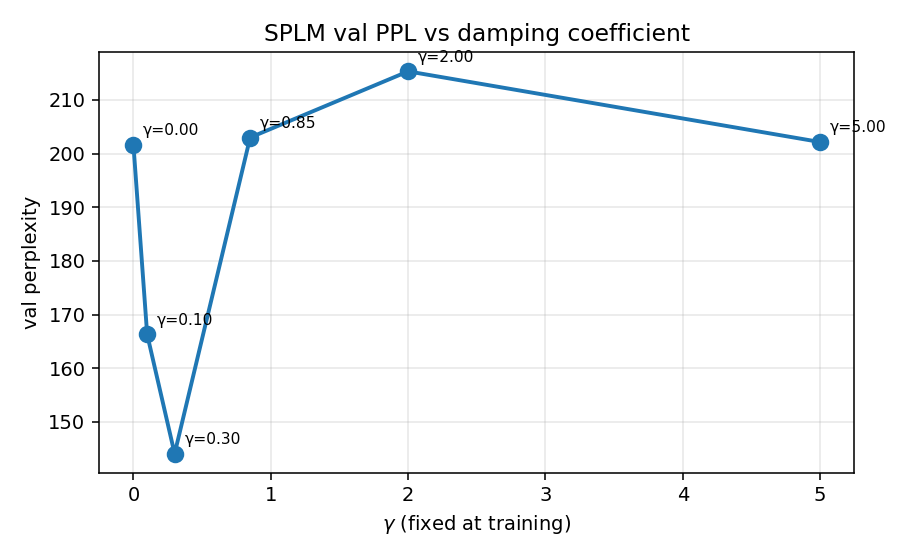
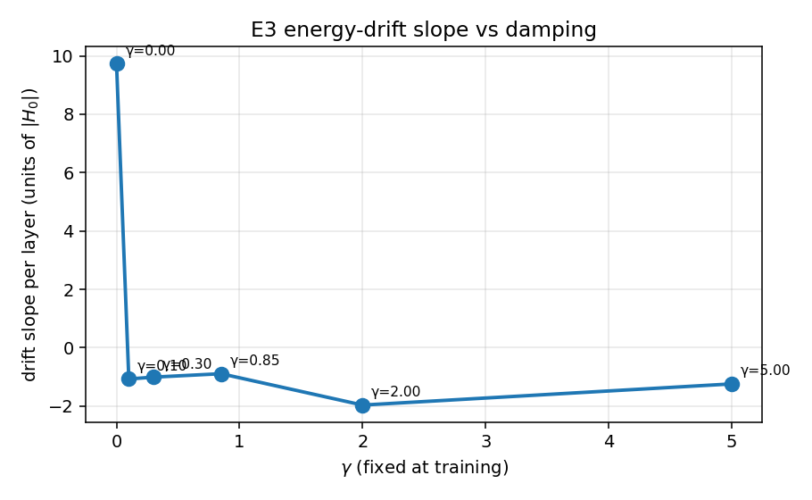
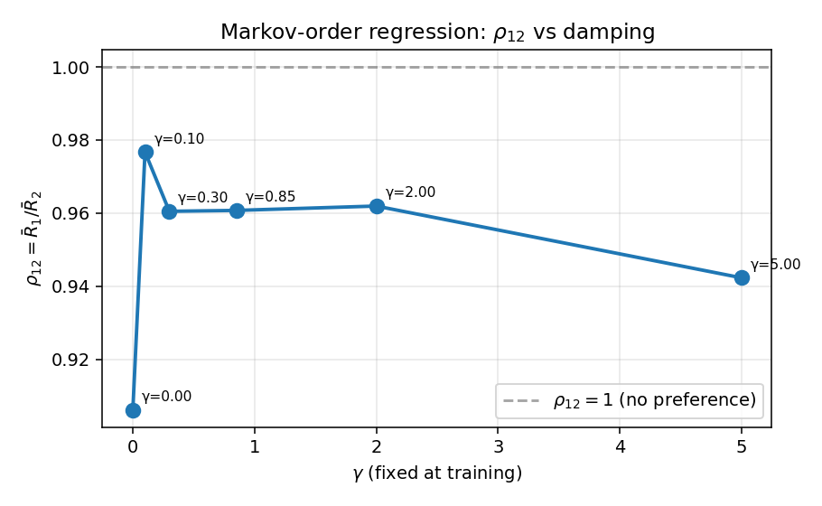
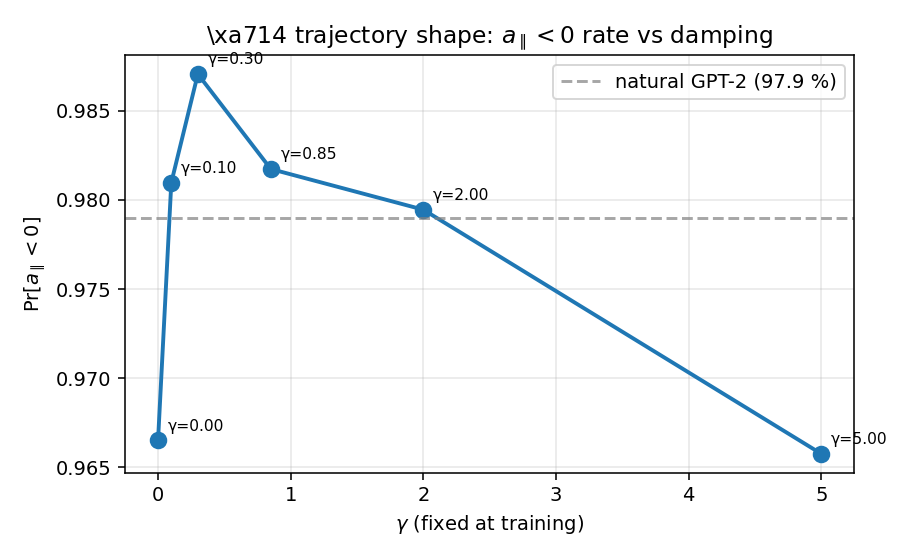

# RESULTS — E4 SPLM damping sweep

> Pre-registered protocol: [`docs/E4_damping_sweep_pre-registered_protocol.md`](../../../docs/E4_damping_sweep_pre-registered_protocol.md)

## Headline grid

| tag | $\gamma$ | val ppl | drift slope / layer | bandwidth | $\rho_{12}$ | $p_{12}$ | Markov decision | $a_\parallel<0$ | $\|a_\parallel\|/\|a_\perp\|$ | perm $z$ |
|---|---:|---:|---:|---:|---:|---:|---|---:|---:|---:|
| `gamma0p00` | 0.00 | 201.65 | 9.729 | 17.32 | 0.9061 | 4.92e-11 | **C** | 0.967 | 4.064 | 3.18 |
| `gamma0p10` | 0.10 | 166.30 | -1.07 | 6.278 | 0.9767 | 1.84e-03 | **C** | 0.981 | 3.528 | 1.96 |
| `gamma0p30` | 0.30 | 144.06 | -1.006 | 11.35 | 0.9605 | 1.36e-09 | **C** | 0.987 | 2.934 | 1.94 |
| `gamma0p85` | 0.85 | 203.00 | -0.889 | 4.969 | 0.9607 | 6.45e-07 | **C** | 0.982 | 4.550 | 2.17 |
| `gamma2p00` | 2.00 | 215.33 | -1.964 | 5.29 | 0.9619 | 3.72e-06 | **C** | 0.979 | 3.625 | 1.03 |
| `gamma5p00` | 5.00 | 202.16 | -1.238 | 2.07 | 0.9423 | 9.29e-08 | **C** | 0.966 | 4.506 | 3.55 |

## Decision summary (per protocol §6)

| decision | count |
|---|---:|
| **C** | 6 |

## Plots

- 
- 
- 
- 

Refer to the protocol's outcome table (§6) for the headline reading.
