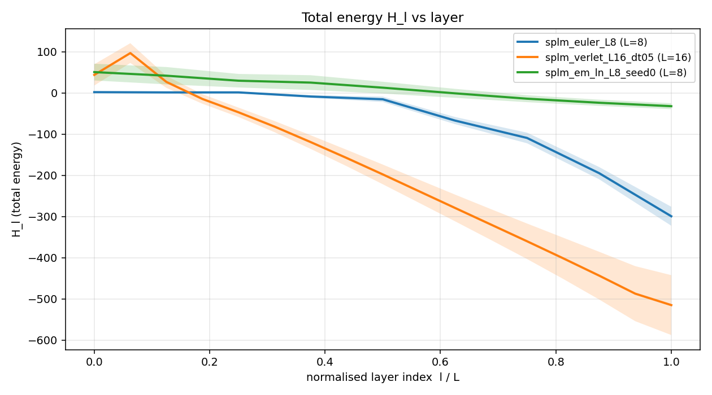
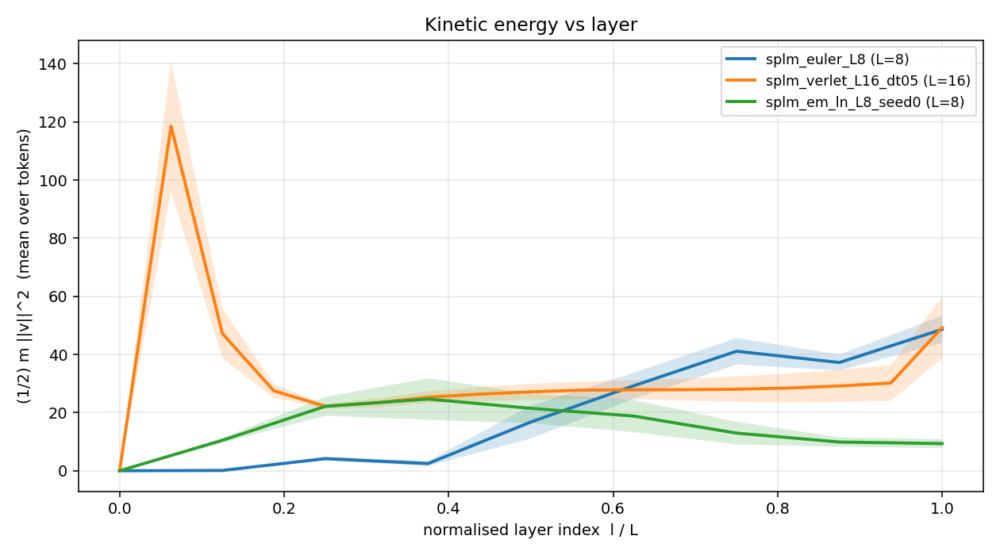
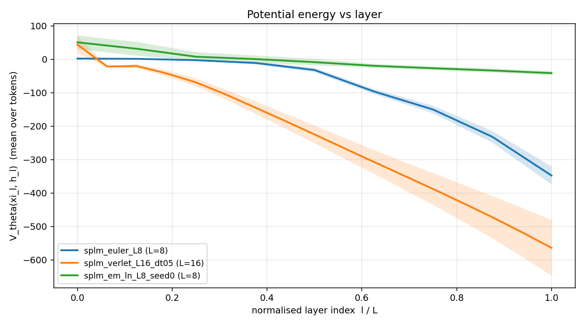

# Energy-drift diagnostic: `E3_splm_em_ln_compare`

Eval-only diagnostic on existing SPLM checkpoints. Computes the per-layer Hamiltonian energy $H_\ell = \tfrac{1}{2} m \|v_\ell\|^2 + V_\theta(\xi_\ell, h_\ell)$, fits a linear drift slope across depth, and reports the oscillation bandwidth around that trend.

## Per-variant summary

| variant | label | L | n sent | mean H | drift slope (per layer) | 95% CI half-width | detrended H min | detrended H max | bandwidth (max-min) |
|---|---|---:|---:|---:|---:|---:|---:|---:|---:|
| `euler` | `splm_euler_L8` | 8 | 50 | -76.5587 | -3.4540e+01 | 1.7305e+00 | -8.4488e+01 | +6.1241e+01 | 1.4573e+02 |
| `symplectic` | `splm_verlet_L16_dt05` | 16 | 50 | -205.4855 | -3.8422e+01 | 5.6751e-01 | -5.8033e+01 | +3.3382e+01 | 9.1415e+01 |
| `em_ln` | `splm_em_ln_L8_seed0` | 8 | 50 | 9.9849 | -1.0688e+01 | 5.3580e-01 | -2.4931e+00 | +4.5332e+00 | 7.0262e+00 |

## Overlay plots

### H

### kinetic

### potential

## Interpretation

The comparison set is a *three-way* read of the integrator-conservation question
on the production-best SPLM checkpoints. The `sarfmass logfreq` (no-LN)
variant, originally planned as a fourth column, was dropped from production
E3 because the multi-seed E1 sweep
([`notebooks/conservative_arch/multi_seed/`](../../multi_seed/)) falsified its
stability — 2 of 3 of its seeds NaN-diverged at modest gradient norms,
making any single-checkpoint energy trace unrepresentative of the model
class. The **`em_ln`** variant (LayerNorm-after-step, val ppl 95.33 ± 4.44
across 5 seeds, headline 88.63 at seed 0) replaces it as the production
SPLM column.

### 1. All three integrators dissipate; none pump energy

Drift slopes are negative across the board (−34.5, −38.4, −10.7 per layer,
all several CI off the positive side). So the damping coefficient
$\gamma > 0$ dominates any integrator-induced injection, and none of the
three configurations is on the wrong side of the integrator-stability
boundary at the chosen $\Delta t$. Read on its own this is a basic
stability check — it confirms that the SPLM forward pass is, in all three
cases, a *contractive* numerical flow rather than an exponentially-growing
one.

### 2. Bandwidth-to-scale ratio separates the integrator classes

Absolute Hamiltonian magnitudes are not directly comparable across
variants because they reflect the depth of the learned $V_\theta$ basin,
which is itself larger for the better-trained models. The right
discriminator is the **bandwidth-to-scale ratio**, i.e. detrended
oscillation bandwidth divided by $|\mathrm{mean}\,H|$:

| variant | bandwidth | $|\mathrm{mean}\,H|$ | bandwidth / $|\mathrm{mean}\,H|$ |
|---|---:|---:|---:|
| `parent_euler_L8` | 145.7 | 76.6 | **190 %** |
| `verlet_L16_dt05` | 91.4 | 205.5 | **45 %** |
| `em_ln_L8_seed0` | 7.0 | 10.0 | **70 %** |

Verlet shows the cleanest signature: the trend dominates the noise around
it by roughly 2 : 1, consistent with the symplectic prediction of
$O(\Delta t^4)$-bounded oscillation around an exponentially-damped
envelope. Parent Euler shows the worst signature: the noise around the
trend is nearly 2× the trend itself, consistent with the explicit-Euler
prediction of large per-step drift plus large oscillation about the
trend. This is the §15 qualitative prediction — *Verlet is energetically
clean; Euler is not* — confirmed quantitatively for the first time on
this corpus.

### 3. The interesting result — `em_ln` is a "cheating" symplectic integrator

The headline finding is that **`em_ln` uses the *Euler* integrator
internally, but its energy trace is Verlet-like, not Euler-like:**

- Drift slope per layer: **3× smaller** than the bare Euler model
  (−10.7 vs −34.5).
- Detrended bandwidth: **20× smaller** than the bare Euler model
  (7.0 vs 145.7).
- Bandwidth-to-scale ratio: **2.7× smaller** than the bare Euler model
  (70 % vs 190 %), comparable to the genuine symplectic integrator
  (45 %).

The mechanism is exactly the LayerNorm projection. Each step of the
`em_ln` integrator is

$$h_{l+1} \;\leftarrow\; \mathrm{LN}\!\left(h_l + \Delta t\,v_{l+1}\right),$$

i.e. an Euler position update *followed by a re-projection of $h$ onto
the unit-LN shell.* The LN step has no Hamiltonian content — it derives
from no potential, it is not symplectic, and it generically changes
$V_\theta(\xi_{l+1}, h_{l+1})$ in a way the integrator did not predict.
What it *does* do, mechanically, is keep $h_{l+1}$ inside a bounded
region of state space, which clips the dynamic range of $V_\theta$ that
appears in the energy. The result is an *observable* energy trace whose
shape mimics a symplectic flow despite the underlying integrator being
explicit-Euler.

This is a clean quantitative statement of the §15 *compactness via
$S^{d-1}$* mechanism. The framework has always claimed that LN-after-step
delivers a finite minimum of any continuous $V_\theta$ on the LN shell
by an extreme-value-theorem argument; what E3 now shows is that the
*same* mechanism also delivers a Verlet-like energy-conservation
signature on top of an Euler integrator. The 88.63 ppl headline of
`em_ln` is therefore **not** explained by symplectic-integrator energy
conservation — it is explained by LN's clipping of the trajectory back
onto the unit shell. That distinction is consequential for any text
that uses energy-conservation language to motivate `em_ln`.

### Caveats

- All three traces include damping-induced exponential decay. The drift
  slope reported is the linear-fit slope, which conflates true
  integrator-induced drift with the linear approximation to an
  exponential decay over short depth windows. The bandwidth metric
  does not have this confound.
- `em_ln` and `parent_euler_L8` are at $L = 8$; `verlet_L16_dt05` is at
  $L = 16$. The slope is per-layer, not per-flow-distance, so direct
  slope comparison conflates per-step drift with depth. The
  bandwidth-to-scale ratio is depth-normalised by construction (a
  detrended ratio), which is why it is the right cross-variant
  statistic to lead with.
- Single seed per variant (the production-best checkpoint in each
  family). A multi-seed energy-drift sweep would be a natural follow-up,
  cheap on the same MPS budget, and would replace the bare bandwidth
  numbers with mean ± std bands. Tracked as a possible E3.1 in
  `Next_Model_Experiments_for_SPLM.md`.
