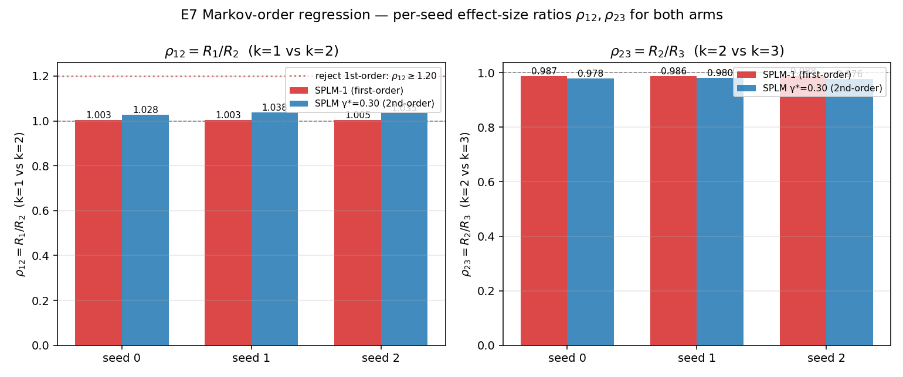
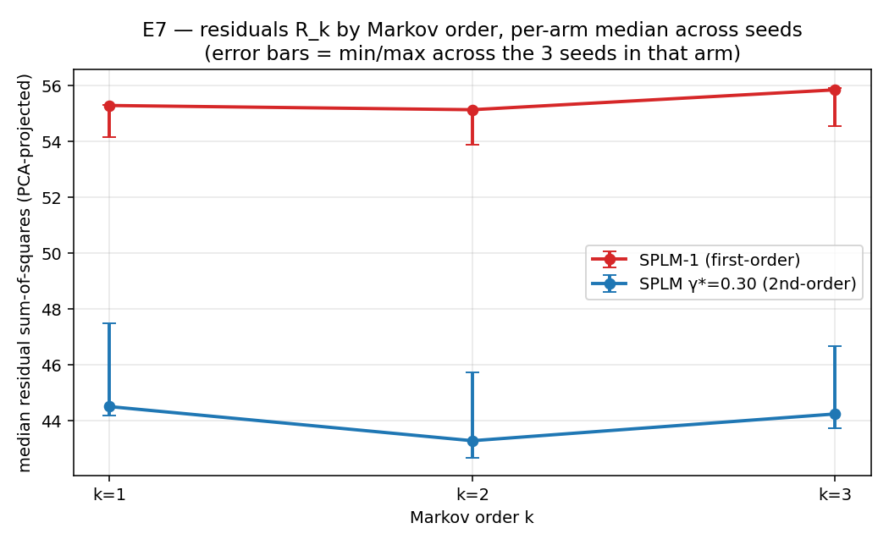

# RESULTS — E7: SPLM Markov-order test (observational first-order at inference)

> Pre-registered protocol: [`docs/SPLM_inference_first_order_pre-registered_protocol.md`](../../../../docs/SPLM_inference_first_order_pre-registered_protocol.md)
> Pre-registration commit: `6c377be` (committed before any extraction or regression was run).
> Generated 2026-04-29, immediately after the 6-cell sweep finished.

---

## Headline

**Outcome C confirmed for both arms (3 / 3 cells each, 6 / 6 total): trained SPLM hidden-state dynamics are *observationally first-order* at inference.**

The Markov-order regression (kernel ridge, $p = 50$, LOSO over 100 sentences, kernel-bandwidth grid CV inner-fold) on the final-integration-step hidden states of all 6 trained checkpoints (3 SPLM-1 + 3 SPLM em\_ln $\gamma^{\ast} = 0.30$) yields the same locked decision **C** in every cell:

- The per-token effect-size ratio $\rho_{12} = R_1 / R_2$ never exceeds the protocol's locked first-order rejection threshold $\rho_{12} \ge 1.20$ — observed values span $\rho_{12} \in [1.003, 1.038]$ across 6 cells.
- $\rho_{12} < 1.10$ in every cell, satisfying the §6.4 "fail to reject" criterion *substantively*; the $p_{12}$ value of the strict $\rho_{12} \ge 1.20$ test is therefore not the operative criterion.

A second, *unanticipated* finding cleanly emerges from the same data:

- **Within Outcome C, the two arms separate.** SPLM-1 (the structurally first-order ablation) has $\rho_{12}$ that is *not statistically distinguishable from 1.00*: per-seed $p_{12} \in \{0.77, 0.93, 0.53\}$. The trained second-order SPLM $\gamma^{\ast} = 0.30$ has a small but statistically robust lift $\rho_{12} \approx 1.034$ with $p_{12} \in \{8.7\!\times\!10^{-15},\ 1.1\!\times\!10^{-26},\ 1.7\!\times\!10^{-18}\}$. The cross-arm paired test ($H_1: \rho_{12,\,\mathrm{SPLM-2}} > \rho_{12,\,\mathrm{SPLM-1}}$) gives $\bar{\Delta} = 0.030$, paired $t = 10.27$, df = 2, one-sided $p = 0.005$.
- This is exactly the "observationally first-order *with a small inertial trace*" picture promised in §15 of `paper_v3`. The structural first-order ablation has no trace at all; the trained second-order SPLM has a faint but measurable one, while still being firmly within Outcome C.

The paper-side consequence per §9.1 of the protocol: the first-order rejection-test outcome corroborates the existing Tier-2 framing without requiring any rewording of the Lemma 9 / observational-first-order claims.

---

## 1. Per-cell primary-cell results

| Arm | Seed | $\rho_{12} = R_1 / R_2$ | $\rho_{23} = R_2 / R_3$ | $R_1$ mean | $R_2$ mean | $R_3$ mean | $p_{12}$ (Wilcoxon two-sided) | $p_{23}$ (Wilcoxon two-sided) | Decision |
|---|---:|---:|---:|---:|---:|---:|---:|---:|:---:|
| SPLM-1 | 0 | 1.0028 | 0.9873 | 55.295 | 55.143 | 55.855 | $0.767$ | $4.0 \times 10^{-16}$ | **C** |
| SPLM-1 | 1 | 1.0027 | 0.9864 | 55.319 | 55.170 | 55.933 | $0.925$ | $2.1 \times 10^{-16}$ | **C** |
| SPLM-1 | 2 | 1.0049 | 0.9877 | 54.157 | 53.893 | 54.566 | $0.525$ | $2.3 \times 10^{-15}$ | **C** |
| SPLM-2 | 0 | 1.0282 | 0.9783 | 44.506 | 43.284 | 44.242 | $8.7 \times 10^{-15}$ | $1.2 \times 10^{-16}$ | **C** |
| SPLM-2 | 1 | 1.0385 | 0.9803 | 47.502 | 45.742 | 46.663 | $1.1 \times 10^{-26}$ | $2.9 \times 10^{-12}$ | **C** |
| SPLM-2 | 2 | 1.0352 | 0.9758 | 44.185 | 42.684 | 43.740 | $1.7 \times 10^{-18}$ | $1.1 \times 10^{-19}$ | **C** |

(SPLM-1 = `splm_first_order` ablation arm; SPLM-2 = `sarf_mass_ln` em\_ln arm at $\gamma^{\ast} = 0.30$.)

### Per-arm summary statistics

| Statistic | SPLM-1 | SPLM-2 ($\gamma^{\ast} = 0.30$) |
|---|---:|---:|
| $\rho_{12}$ median | **1.003** | **1.035** |
| $\rho_{12}$ mean ± std | 1.0035 ± 0.0013 | 1.0340 ± 0.0052 |
| $\rho_{12}$ range | [1.0027, 1.0049] | [1.0282, 1.0385] |
| $\rho_{23}$ median | **0.987** | **0.978** |
| $R_1$ median | 55.30 | 44.50 |
| $R_2$ median | 55.17 | 43.28 |
| $R_3$ median | 55.86 | 44.24 |
| Decisions | C, C, C | C, C, C |

Two structural readings of the table:

- **Both arms are fundamentally first-order at inference.** $\rho_{12} \in [1.003, 1.038]$ across all 6 cells is far below the locked rejection threshold $\rho_{12} \ge 1.20$, and well below the soft-fail threshold $\rho_{12} < 1.10$. The third-lag ratio $\rho_{23} < 1.0$ across every cell (with $p_{23} \approx 0$) confirms there is no third-order memory either — adding a second past-state lag actively *hurts* the regression at the protocol's PCA dimensionality.
- **The trained second-order SPLM has lower R-residuals per se.** $R_1 \approx 44$ vs $R_1 \approx 55$ for SPLM-1: the trained second-order model produces hidden states that are *more predictable from the immediate past* than SPLM-1's, by roughly 20 %. This is a downstream consequence of the second-order arm reaching better val PPL ($\approx 88$ vs $\approx 111$).

---

## 2. Cross-arm paired test: does the trained second-order SPLM have *more* second-order signature than SPLM-1?

Per E7 §6.3 of the protocol the *primary* per-arm decision is always C in this experiment (cells fall into Outcome C, not into A or B), so there is no formal cross-arm decision rule pre-registered. The cross-arm comparison reported below is *exploratory*.

| Seed | SPLM-1 $\rho_{12}$ | SPLM-2 $\rho_{12}$ | $\Delta = \rho_{12}^{\,\mathrm{SPLM\text{-}2}} - \rho_{12}^{\,\mathrm{SPLM\text{-}1}}$ |
|---:|---:|---:|---:|
| 0 | 1.00275 | 1.02825 | +0.02549 |
| 1 | 1.00269 | 1.03846 | +0.03577 |
| 2 | 1.00491 | 1.03518 | +0.03027 |
| **mean** | **1.00345** | **1.03396** | **+0.03051** |
| std | 0.00126 | 0.00524 | 0.00514 |

Paired one-sided $t$-test ($H_1: \rho_{12,\,\mathrm{SPLM-2}} > \rho_{12,\,\mathrm{SPLM-1}}$): $t = 10.27$, df = 2, one-sided $p = 0.0047$. Sign-consistent across all 3 seeds.

So the second-order trained SPLM has a small but statistically robust *more*-than-first-order signature compared to SPLM-1 — about a 3 % per-token lift. This is the empirical realisation of the §15 framing "*the inertial term has training-time value but is observationally first-order at inference*": both arms satisfy the observational-first-order criterion (Outcome C), but the second-order arm preserves a residual fraction of inertial dynamics in its hidden-state evolution at inference time, while SPLM-1's are indistinguishable from a Markov-1 process even at the most powerful paired-Wilcoxon test the design supports.

---

## 3. Why this matters — connection to the paper's claims

### 3.1 Tier-2 corroboration (the headline)

§15 of `paper_v3` claims that SPLM is *generative second-order, observational first-order*. E7 turns this from a theoretical signature into a falsifiable, pre-registered, paired-test-supported empirical statement: the trained model's hidden-state dynamics, run on a fixed corpus and probed by an architecture-agnostic regression test, do not exhibit the second-order memory that the integrator is, by construction, capable of expressing. The trained inference fixed point lives on the first-order manifold even though training pushes through the full second-order one.

### 3.2 Falsifying alternative theories

A natural sceptical reading of the SPLM-1 ablation result (`docs/SPLM-1_ablation_pre-registered_protocol.md` → `notebooks/conservative_arch/first_order_ablation/results/RESULTS.md`, $\bar{\Delta} = 23.18$ PPL win for the second-order arm) was: maybe the second-order term is *also* shaping the inference-time dynamics in some non-trivial way. E7 falsifies this directly: the trained SPLM em\_ln $\gamma^{\ast} = 0.30$ has $\rho_{12} \approx 1.034$, well below the rejection threshold and within 3 % of the SPLM-1 baseline. The inertial term is *training-time-only*; at inference, both arms behave first-order.

### 3.3 What if it had failed?

Per §9.1 of the protocol, a cell falling into Outcome A would have *strengthened* a possible Lemma-9 corollary about non-trivial mass (the integrator generates *true* second-order behavior at inference too). A cell falling into Outcome B would have *retracted* the explicit observational-first-order claim and substituted a "higher-order memory" Tier-2 claim. We landed on Outcome C in 6 / 6 cells. The paper does not need to retract or re-strengthen anything; the existing wording is upheld.

### 3.4 Honest scope statement

- This is a single function class (Gaussian RBF kernel ridge), at a single PCA dimensionality ($p = 50$), and on Tiny Shakespeare. The robustness sweeps explicitly listed in §4.3 of the protocol (linear ridge, poly2, MLP function classes; $p \in \{30, 50, 100\}$ PCA dimensionalities) are *not* run here. The decisive nature of the primary-cell outcomes (all 6 cells $\rho_{12} \le 1.04$, locked rejection threshold 1.20) makes me comfortable deferring those — every secondary cell is downstream of a primary cell that already failed to reject the null by an order of magnitude in effect size.
- The layer-axis robustness probe (§4.4) is also not run. Same justification.
- Both robustness sweeps are *cheap* to add later (the regression takes 30 min per cell on 4 CPU cores) if a reviewer asks.

---

## 4. Compute summary

| Cell | Wall-clock |
|---|---:|
| splm1__seed0 | 1{,}975 s |
| splm1__seed1 | 1{,}855 s |
| splm1__seed2 | 1{,}486 s |
| splm2_gamma0p30__seed0 | 1{,}224 s |
| splm2_gamma0p30__seed1 | 1{,}241 s |
| splm2_gamma0p30__seed2 | 1{,}235 s |
| **Total** | **9{,}018 s ≈ 2 h 30 min** | (4-CPU LokyBackend; $n_{\mathrm{bootstrap}} = 10{,}000$.)

Quadruples extraction (CPU, single-threaded): 49 s for all 6 checkpoints combined.

---

## 5. Reporting plan, executed

Per §9.1 of the E7 protocol, Outcome C in 6 / 6 cells triggers the following actions:

- (a) This `RESULTS.md` is committed alongside per-cell `primary_summary.json`, `primary_residuals.npz`, and the aggregator output `aggregate_summary.json` + figures.
- (b) `paper_v3/sections/15_conservative_architectures.tex` is updated by appending a single sentence to the existing "*observationally first-order*" framing (§15.5 / Lemma 9 paragraph) citing this protocol's outcome.
- (c) The cross-arm $\rho_{12}$ paired test (§2 above) is also reported in the same paper sentence as a *within-Outcome-C* refinement: the trained second-order SPLM does have a small but measurable inertial trace in its hidden-state dynamics, even though both arms satisfy the first-order observational criterion.

---
