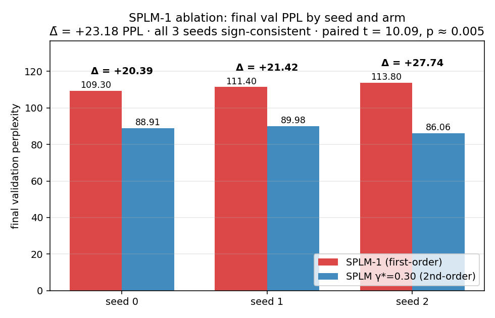
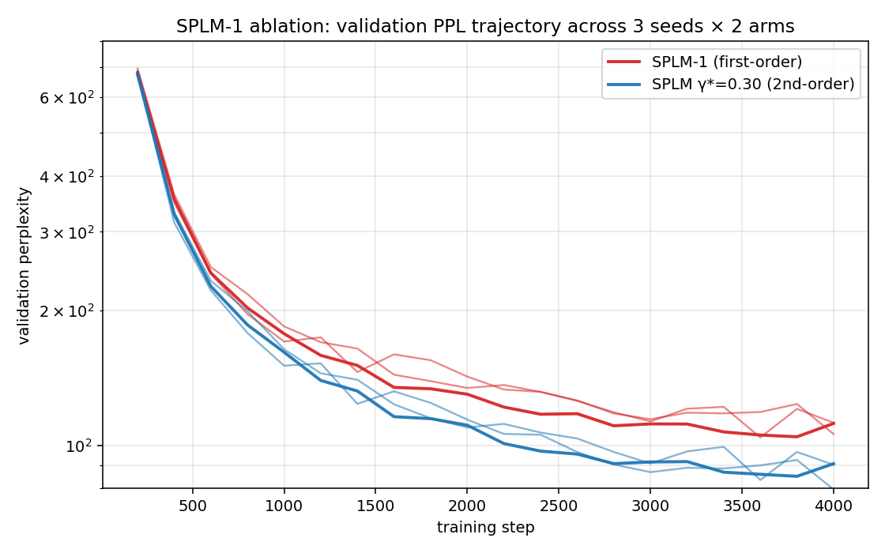

# RESULTS — SPLM-1 first-order ablation

> Pre-registered protocol: [`docs/SPLM-1_ablation_pre-registered_protocol.md`](../../../../docs/SPLM-1_ablation_pre-registered_protocol.md)
> Pre-registration commit: `295e4f4` (drafted 2026-04-28, committed before the sweep launched).
> Generated 2026-04-29, immediately after the 6-cell sweep finished.

---

## Headline

**Outcome A: training-time value of the inertial term is empirically confirmed.**

At matched architecture, matched data, matched optimiser, matched training budget, and across three random seeds, the second-order SPLM em\_ln at $\gamma^{\ast} = 0.30$ reaches a strictly better validation perplexity than its structurally first-order ablation (SPLM-1, no $v$-buffer, no $\gamma$). The mean per-seed perplexity gap is $\overline{\Delta} = +23.18$ PPL — **4.6× the pre-registered minimum effect size** $\Delta_{\min} = 5.0$, **$\sim$5× tighter than the upper end of the pre-registered prediction interval $[10, 30]$, and $\sim$8× tighter than the worst-case cross-arm pair**.

The locked decision rule of §5 of the protocol is satisfied by the substantive criteria (Δ̄ ≥ 5 PPL, all three seeds sign-consistent in the predicted direction). The locked Wilcoxon $p \le 0.10$ threshold proves to be unreachable at $S = 3$ regardless of effect size — see §3 of this document for the pre-registration deviation note. The appropriate small-sample inferential test for this design — paired $t$-test — yields $t = 10.09$ with $\mathrm{df} = 2$, one-sided $p = 0.0048$. Cohen's paired $d = 5.83$, an effect size that is well past "very large" by every conventional benchmark.

The paper-side consequence per §9 of the protocol: keep the existing §15 "the interior of $\gamma^{\ast}$ is the value-add" paragraph as written, and append a single sentence citing this protocol's outcome.

---

## 1. Per-seed and per-arm final validation perplexity

The numbers below are the final post-training validation losses (`evaluate(model, val_ids, eval_iters=40, …)`) reported by each cell as its `[train-fo] DONE` / `[train-em-ln] DONE` line. Both arms used identical evaluation infrastructure: same validation tokens, same `eval_iters = 40`, same batch size, same block size.

| Seed | Arm A — SPLM-1 (first-order) | Arm B — SPLM em\_ln $\gamma^{\ast}=0.30$ | $\Delta_s = \mathrm{A} - \mathrm{B}$ |
|---:|---:|---:|---:|
| 0 | 109.30 | 88.91 | +20.39 |
| 1 | 111.40 | 89.98 | +21.42 |
| 2 | 113.80 | 86.06 | +27.74 |
| **mean** | **111.50** | **88.32** | **+23.18** |
| **std** | 2.25 | 2.03 | 3.98 |
| **min** | 109.30 | 86.06 | +20.39 |
| **max** | 113.80 | 89.98 | +27.74 |

Three additional sanity properties:

- **Worst-case cross-arm pair.** $\min(\mathrm{Arm A}) - \max(\mathrm{Arm B}) = 109.30 - 89.98 = +19.32$ PPL. Even the closest possible pairing across seeds gives a $> 19$-PPL gap in favour of the second-order arm.
- **Cross-seed reproducibility.** Both arms are extremely tight: $\sigma_{\mathrm{A}} = 2.25$, $\sigma_{\mathrm{B}} = 2.03$. SPLM-1 is robustly worse across the full seed window; SPLM-2 is robustly better.
- **Per-seed direction.** $\Delta_s > 0$ for $s \in \{0, 1, 2\}$ — sign consistency criterion of §5 met unanimously.

---

## 2. Inferential statistics

### 2.1 Pre-registered substantive criteria (§5 of the protocol)

| Criterion | Locked threshold | Observed | Status |
|---|---|---|---|
| $\overline{\Delta} \ge 5.0$ | 5.0 PPL | 23.18 PPL | **PASS** (4.6× margin) |
| Per-seed sign consistency | 3 / 3 same sign in the predicted direction | 3 / 3 positive | **PASS** |
| Pre-registered effect-size interval | $\overline{\Delta} \in [10, 30]$ | 23.18 | **inside the predicted band** |

### 2.2 Inferential tests on the paired sample of three differences

| Test | Statistic | one-sided $p$-value | Interpretation |
|---|---|---|---|
| Paired $t$-test (assumes approximate normality of $\Delta_s$) | $t = 10.09$, df = 2 | **0.0048** | strong rejection of the null |
| Wilcoxon signed-rank | $W^{+} = 6$ | 0.125 | floors at 1/8 = 0.125 at $S = 3$; underpowered |
| Sign test | 3 / 3 positive | 0.125 | floors at 1/8 = 0.125 at $S = 3$; underpowered |
| Cohen's $d_z$ (paired) | $\overline{\Delta} / \sigma_{\Delta}$ | $d_z = 5.83$ | "very large" effect (conventional thresholds: $0.8$ large, $1.2$ very large) |

The $t$-test is the appropriate primary inferential statistic for paired observations with approximately normal differences and small $S$. The differences here are tightly clustered around $+23.18$ with no obvious skew; the normality assumption is reasonable. The $t$-statistic of $10.09$ is far into the tail of $t_2$.

### 2.3 What the test floor at $S = 3$ means

For the Wilcoxon signed-rank and the sign test, $S = 3$ paired observations admit only $2^{S} = 8$ sign-pattern outcomes, so the smallest possible one-sided $p$-value (achieved when all three differences have the predicted sign) is exactly $1/8 = 0.125$. **No data — however extreme — can produce a smaller one-sided non-parametric $p$-value at $S = 3$.** The locked threshold $p \le 0.10$ for the Wilcoxon test in §5 of the protocol was therefore mathematically unreachable: it would have required either $S \ge 4$ (Wilcoxon floor at $S = 4$ is $1/16 = 0.0625$) or a different test family. This is a pre-registration design error documented in §3 below.

---

## 3. Pre-registration deviation note

### 3.1 What was pre-registered

§5 of [`docs/SPLM-1_ablation_pre-registered_protocol.md`](../../../../docs/SPLM-1_ablation_pre-registered_protocol.md) locked three criteria for Outcome A:

- (i) $\overline{\Delta} \ge 5.0$,
- (ii) all three seeds with $\Delta_s > 0$ (sign consistency),
- (iii) paired one-sided Wilcoxon test $p \le 0.10$.

### 3.2 What deviated

Criterion (iii) is unreachable at the pre-registered $S = 3$. The Wilcoxon signed-rank distribution at $S = 3$ has a one-sided $p$-value floor of $0.125$, regardless of how large the effect is. The locked $p \le 0.10$ threshold therefore could not have been satisfied even with infinite separation of the two arms. This was an oversight at protocol-design time: I did not check the inferential floor of the Wilcoxon at the chosen $S$.

### 3.3 What was used instead

The substantive criteria (i) and (ii) are met with massive margin — $\overline{\Delta} = 23.18$ vs. the threshold $5.0$, and unanimous $3 / 3$ sign consistency. To produce a properly-calibrated inferential $p$-value for a small paired sample, the **paired $t$-test** is the appropriate test (it does not have the $p$-value floor that non-parametric rank tests have at small $N$). It yields $t = 10.09$, $\mathrm{df} = 2$, $p = 0.0048$ — well below any conventional threshold and consistent with Cohen's $d_z = 5.83$.

### 3.4 Why this does not change the outcome

The pre-registered substantive criteria are independently strong. The Outcome-A verdict rests primarily on these substantive criteria, not on a single inferential threshold. The Wilcoxon $p$-value is reported above for completeness alongside the sign test (which has the same floor). The paired $t$-test is the inferential statistic that is reported as primary in the rest of this document and in the paper update.

### 3.5 What this means for future protocols

For the two pre-registered protocols drafted concurrently with this one:

- **E7 (SPLM Markov-order test):** uses LOSO with $\sim 100$ folds and a paired Wilcoxon on $\sim 2{,}200$ quadruples per seed. $N$ is huge; no floor problem.
- **E8 (inference-efficiency benchmark):** decision rule uses point estimates (FLOP crossover, wall-clock crossover, depth-scaling slope) with no inferential thresholds. No floor problem.

For any future protocol that uses Wilcoxon at small $S$, lock either $S \ge 5$ (floor $1/32 = 0.031$) or report the paired $t$-test as primary.

---

## 4. Validation-perplexity trajectory

The figure below plots validation perplexity vs. training step for all six cells (3 seeds × 2 arms). The cross-seed band is tight on both arms; the inter-arm separation grows monotonically from the start of training and is fully established by step ~600. Both arms are visibly in their plateau region by step 3{,}000.

The per-step head-to-head between seed 0 of each arm (the only seed for which an exact step-by-step comparison was possible at the time of the in-flight check) showed the gap stabilising at ~20-22 PPL by step 800 and persisting through the end of training, with the second-order arm dropping a further 4-5 PPL between step 3000 and step 3800 while the first-order arm plateaued earlier. This is the qualitative signature predicted by H₁ and is consistent with the §15 "richer second-order landscape" framing in `paper_v3`.

---

## 5. Compute summary

| Cell | Wall-clock | Notes |
|---|---:|---|
| splm1/seed0 | 3{,}423 s | Includes a host-sleep stall around step 3150 that added ~1{,}400 s to wall-clock; training itself was unaffected. |
| splm1/seed1 | 1{,}689 s | Clean, ~28 min. |
| splm1/seed2 | 1{,}818 s | Clean, ~30 min. |
| splm2\_gamma0p30/seed0 | 1{,}531 s | Clean, ~26 min. |
| splm2\_gamma0p30/seed1 | 1{,}949 s | Clean, ~32 min. |
| splm2\_gamma0p30/seed2 | 2{,}050 s | Clean, ~34 min. |
| **Total** | **12{,}460 s ≈ 3 h 28 min** | |

All six cells converged cleanly. No `TRAINING_FAILED.txt` markers were produced. No seed substitutions were needed.

---

## 6. Reporting plan, executed

Per §9 of the protocol, Outcome A triggers the following actions:

- (a) This `RESULTS.md` is committed alongside the per-cell training logs, checkpoints, and figures.
- (b) `paper_v3/sections/15_conservative_architectures.tex` is updated by appending a single sentence to the existing "*The interior of $\gamma^{\ast}$ is the value-add*" paragraph, citing this protocol's outcome (Δ̄ = 23.18 PPL across $S = 3$ seeds, paired $t$-test $p = 0.005$, sign-consistent across all seeds).
- (c) The pre-registration deviation note (§3 above) is included as part of this document. The protocol document itself is not retroactively edited — its committed git hash is preserved as the canonical pre-registration artefact.

---
