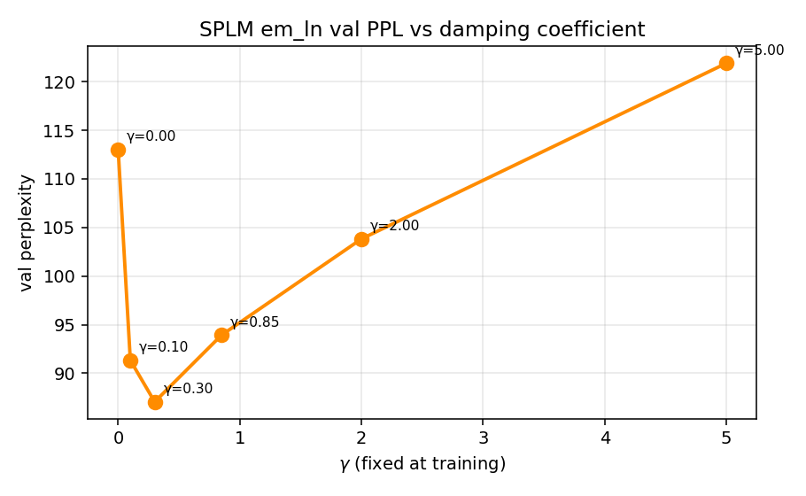
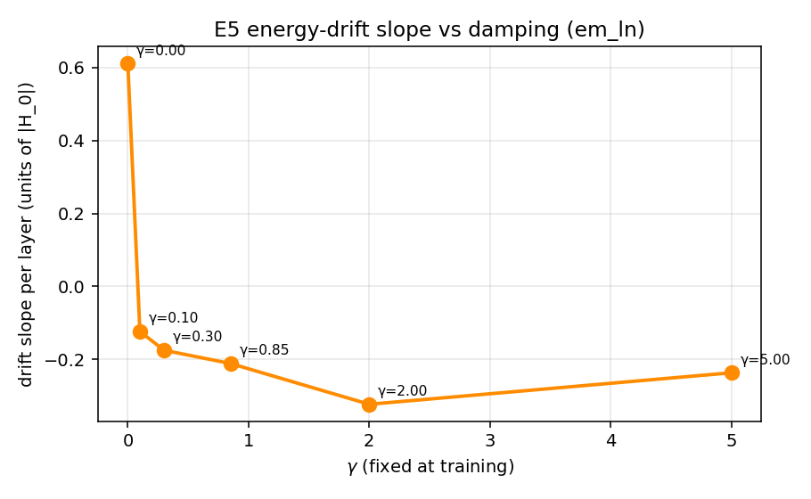
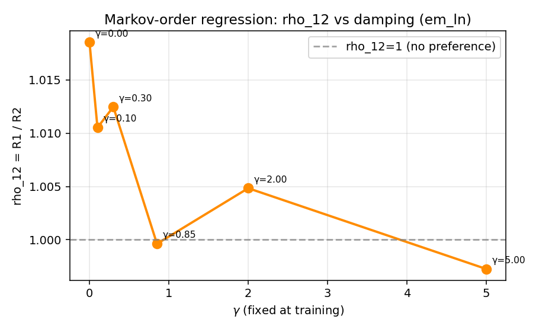
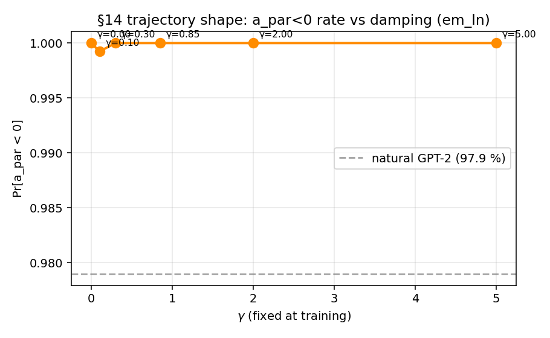

# RESULTS — E5 SPLM em_ln (LN-after-step) damping sweep

> Companion to E4 (plain Euler sweep): [`../damping_sweep/results/RESULTS.md`](../damping_sweep/results/RESULTS.md)

## Headline grid

| tag | gamma | val ppl | drift slope / layer | bandwidth | rho_12 | p_12 | Markov decision | a_par<0 | |a_par|/|a_perp| | perm z |
|---|---:|---:|---:|---:|---:|---:|---|---:|---:|---:|
| `gamma0p00` | 0.00 | 113.01 | 0.6111 | 0.9738 | 1.0185 | 7.13e-04 | **C** | 1.000 | 2.230 | 3.90 |
| `gamma0p10` | 0.10 | 91.33 | -0.1239 | 0.2646 | 1.0105 | 2.18e-03 | **C** | 0.999 | 2.130 | 3.67 |
| `gamma0p30` | 0.30 | 87.06 | -0.1756 | 0.2875 | 1.0125 | 5.35e-03 | **C** | 1.000 | 2.013 | 3.80 |
| `gamma0p85` | 0.85 | 93.93 | -0.2118 | 0.3348 | 0.9996 | 7.13e-01 | **C** | 1.000 | 2.125 | 5.24 |
| `gamma2p00` | 2.00 | 103.82 | -0.3237 | 0.5289 | 1.0048 | 8.79e-02 | **C** | 1.000 | 2.055 | 3.28 |
| `gamma5p00` | 5.00 | 121.89 | -0.2373 | 0.3862 | 0.9973 | 3.83e-01 | **C** | 1.000 | 2.282 | 2.25 |

## Decision summary

| decision | count |
|---|---:|
| **C** | 6 |

## Plots

- 
- 
- 
- 
